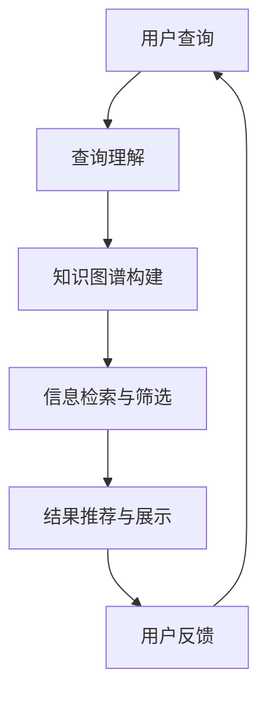
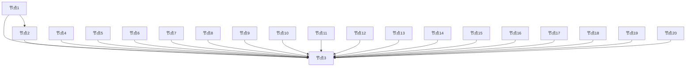

                 

关键词：教育领域、人工智能、搜索算法、应用场景、技术发展趋势

> 摘要：随着人工智能技术的不断发展，AI在各个领域的应用日益广泛。教育领域作为社会发展的基石，自然也受到了AI技术的深刻影响。本文将重点探讨AI搜索在教育领域的应用，从核心概念、算法原理、数学模型到具体实践，全面分析AI搜索技术在教育领域的潜力与挑战。

## 1. 背景介绍

### 教育领域的重要性

教育是培养下一代、传承文化、促进社会进步的关键途径。随着信息技术的快速发展，教育的形式和内容也在不断演变。传统的教育模式以教师为中心，而现代教育则更加注重个性化、互动性和多样化。AI技术的引入，使得教育更加智能化，能够为学习者提供更加个性化和高效的学习体验。

### 人工智能在教育领域的应用

人工智能（AI）作为一项前沿技术，已在教育领域得到广泛应用。从智能辅导系统到自适应学习平台，再到智能评价系统，AI技术正逐步改变教育的面貌。AI搜索作为AI技术的一个重要分支，通过文本分析、信息提取和推荐算法等技术，能够帮助学习者更快速、准确地获取所需信息，提高学习效率。

## 2. 核心概念与联系

### AI搜索的基本概念

AI搜索是指利用人工智能技术对互联网或其他数据库中的大量信息进行检索、筛选和推荐的过程。它不同于传统的搜索引擎，能够理解用户的查询意图，提供更加精准和个性化的搜索结果。

### AI搜索在教育领域的应用架构

为了更好地理解AI搜索在教育领域的应用，我们可以通过Mermaid流程图展示其核心组件和流程。



- **查询理解**：理解用户的查询意图，将自然语言转化为结构化信息。
- **知识图谱构建**：构建包含教育领域知识点的图谱，为信息检索提供基础。
- **信息检索与筛选**：根据用户查询和知识图谱，检索并筛选相关教育信息。
- **结果推荐与展示**：将筛选后的信息进行推荐，并以用户友好的方式展示。
- **用户反馈**：收集用户对搜索结果的反馈，用于模型优化。

## 3. 核心算法原理 & 具体操作步骤

### 3.1 算法原理概述

AI搜索在教育领域的核心算法主要包括自然语言处理（NLP）、图谱构建、信息检索和推荐系统等。以下是对这些算法的简要概述：

- **自然语言处理（NLP）**：NLP是AI搜索的基础，通过分词、词性标注、命名实体识别等技术，将自然语言转换为计算机可处理的格式。
- **图谱构建**：利用知识图谱，将教育领域中的知识点、课程、教师、学生等信息进行结构化组织，便于检索和推荐。
- **信息检索**：采用基于关键词匹配、信息检索算法（如TF-IDF、BM25）等技术，检索相关教育信息。
- **推荐系统**：利用协同过滤、基于内容的推荐等技术，为用户提供个性化的搜索结果。

### 3.2 算法步骤详解

- **步骤1：查询理解**  
  用户输入查询，NLP模块对查询进行解析，提取关键信息。

- **步骤2：知识图谱构建**  
  根据查询信息，利用图谱构建算法，从知识库中检索相关知识点和关联信息。

- **步骤3：信息检索与筛选**  
  利用信息检索算法，从数据库中检索与查询相关的教育信息，并进行筛选。

- **步骤4：结果推荐与展示**  
  根据用户偏好和查询意图，利用推荐算法为用户推荐相关教育信息，并以直观的方式展示。

- **步骤5：用户反馈**  
  收集用户对搜索结果的反馈，用于模型优化和改进。

### 3.3 算法优缺点

- **优点**：AI搜索能够提供个性化、高效的教育信息检索服务，提高学习效率。
- **缺点**：算法复杂度高，对计算资源要求较高；知识图谱构建和维护需要大量人力和时间投入。

### 3.4 算法应用领域

AI搜索算法在教育领域具有广泛的应用前景，包括：

- **课程推荐**：根据学生兴趣和学习进度，推荐适合的课程和资源。
- **教学辅助**：教师可以利用AI搜索快速获取相关教学资源，提高教学效果。
- **学习评估**：利用AI搜索对学生的学习成果进行评估，提供个性化反馈。

## 4. 数学模型和公式 & 详细讲解 & 举例说明

### 4.1 数学模型构建

在AI搜索中，常用的数学模型包括NLP模型、图谱模型、信息检索模型和推荐模型。以下分别介绍这些模型的构建方法。

#### 4.1.1 NLP模型

NLP模型通常基于深度学习技术，如卷积神经网络（CNN）、循环神经网络（RNN）和变换器（Transformer）等。以下是一个基于Transformer的NLP模型构建过程：

```latex
\text{输入序列} = [X_1, X_2, ..., X_n]
\text{词嵌入} = W \cdot X
\text{Transformer模型} = \text{Encoder-Decoder架构}
\text{输出} = \text{Decoder}(\text{Encoder}(\text{词嵌入}))
```

其中，\(W\) 为词嵌入权重矩阵，\(\text{Encoder}\) 和 \(\text{Decoder}\) 分别为编码器和解码器。

#### 4.1.2 图谱模型

图谱模型主要基于图论和图神经网络（Graph Neural Networks, GNN）构建。以下是一个简单的图谱模型构建过程：



其中，节点表示教育领域的知识点，边表示知识点之间的关联关系。

#### 4.1.3 信息检索模型

信息检索模型通常采用基于关键词匹配的模型，如TF-IDF和BM25。以下是一个TF-IDF模型的构建过程：

```latex
\text{TF} = \frac{f_t}{n_t}
\text{IDF} = \log \left( \frac{N}{n_t + 0.5 \cdot (1 - \frac{df_t}{N}) + 0.5 \cdot \frac{k}{df_t + k}} \right)
\text{得分} = \text{TF} \times \text{IDF}
```

其中，\(f_t\) 表示词 \(t\) 在文档 \(d\) 中的出现次数，\(n_t\) 表示文档集中包含词 \(t\) 的文档数，\(N\) 表示文档集中所有文档的总数，\(df_t\) 表示词 \(t\) 在文档集中出现的文档频率，\(k\) 是常数。

#### 4.1.4 推荐模型

推荐模型通常采用协同过滤（Collaborative Filtering）和基于内容的推荐（Content-based Filtering）等技术。以下是一个基于内容的推荐模型构建过程：

```latex
\text{用户兴趣向量} = \text{User} \cdot \text{Item}
\text{推荐得分} = \text{User} \cdot \text{Item}
```

其中，\(\text{User}\) 和 \(\text{Item}\) 分别表示用户和物品的特征向量。

### 4.2 公式推导过程

在本节中，我们将详细介绍上述数学模型的推导过程。

#### 4.2.1 NLP模型

基于Transformer的NLP模型推导如下：

1. **词嵌入**：
   \[ \text{词嵌入} = W \cdot X \]

   其中，\(W\) 为权重矩阵，\(X\) 为输入词向量。

2. **编码器**：
   \[ \text{编码器} = \text{Encoder}(\text{词嵌入}) \]

   编码器用于提取输入序列的特征。

3. **解码器**：
   \[ \text{解码器} = \text{Decoder}(\text{编码器}(\text{词嵌入})) \]

   解码器用于生成输出序列。

4. **输出**：
   \[ \text{输出} = \text{Decoder}(\text{Encoder}(\text{词嵌入})) \]

   输出序列为预测的词序列。

#### 4.2.2 图谱模型

基于图神经网络的图谱模型推导如下：

1. **图邻接矩阵**：
   \[ A = \left[ \begin{array}{ccc}
   a_{11} & \cdots & a_{1n} \\
   \vdots & \ddots & \vdots \\
   a_{m1} & \cdots & a_{mn} \\
   \end{array} \right] \]

   其中，\(a_{ij}\) 表示节点 \(i\) 和节点 \(j\) 之间的邻接关系。

2. **图卷积运算**：
   \[ h_{i}^{(t+1)} = \sigma \left( \sum_{j \in N(i)} w_{ij} h_{j}^{(t)} \right) \]

   其中，\(h_{i}^{(t+1)}\) 表示节点 \(i\) 在 \(t+1\) 步的特征，\(w_{ij}\) 表示权重，\(N(i)\) 表示节点 \(i\) 的邻接节点集合，\(\sigma\) 为激活函数。

3. **图神经网络**：
   \[ h_i^{(l)} = \text{ReLU} \left( W_l \cdot \left( h_i^{(l-1)} + \sum_{j \in N(i)} W_{ij} h_j^{(l-1)} \right) \right) \]

   其中，\(h_i^{(l)}\) 表示节点 \(i\) 在第 \(l\) 层的特征，\(W_l\) 和 \(W_{ij}\) 分别为权重矩阵。

#### 4.2.3 信息检索模型

基于TF-IDF的模型推导如下：

1. **词频**：
   \[ f_t = \text{count}(t, d) \]

   其中，\(\text{count}(t, d)\) 表示词 \(t\) 在文档 \(d\) 中出现的次数。

2. **文档频率**：
   \[ df_t = \text{count}(t, D) \]

   其中，\(\text{count}(t, D)\) 表示词 \(t\) 在文档集 \(D\) 中出现的次数。

3. **TF-IDF**：
   \[ \text{得分} = \text{TF} \times \text{IDF} \]

   其中，\(\text{TF}\) 和 \(\text{IDF}\) 分别为词频和逆文档频率。

#### 4.2.4 推荐模型

基于内容的推荐模型推导如下：

1. **用户兴趣向量**：
   \[ \text{用户兴趣向量} = \text{User} \cdot \text{Item} \]

   其中，\(\text{User}\) 和 \(\text{Item}\) 分别为用户和物品的特征向量。

2. **推荐得分**：
   \[ \text{推荐得分} = \text{User} \cdot \text{Item} \]

   其中，\(\text{User} \cdot \text{Item}\) 表示用户兴趣向量和物品特征向量的内积。

### 4.3 案例分析与讲解

在本节中，我们将通过一个实际案例来分析AI搜索在教育领域的应用。

#### 案例背景

某在线教育平台希望为其用户（学生和教师）提供高效的课程搜索服务，提高学习体验和教学效果。

#### 案例解决方案

1. **查询理解**：利用NLP技术，将用户的自然语言查询转化为结构化信息，如课程名称、教师姓名、学习进度等。

2. **知识图谱构建**：构建教育领域的知识图谱，包括课程、教师、学生等知识点，以及知识点之间的关联关系。

3. **信息检索与筛选**：采用基于TF-IDF的信息检索模型，从知识图谱中检索与查询相关的课程信息，并进行筛选。

4. **结果推荐与展示**：利用基于内容的推荐模型，为用户推荐相关的课程，并以列表或卡片形式展示。

5. **用户反馈**：收集用户对搜索结果的反馈，用于模型优化和改进。

#### 案例效果

通过AI搜索技术的应用，该在线教育平台实现了以下效果：

- **搜索效率提高**：用户可以快速找到所需课程，节省了大量的搜索时间。
- **个性化推荐**：根据用户兴趣和学习进度，为用户推荐适合的课程，提高了学习效果。
- **用户体验提升**：直观的搜索结果展示和个性化推荐，提高了用户的学习体验。

## 5. 项目实践：代码实例和详细解释说明

### 5.1 开发环境搭建

在开始代码实践之前，我们需要搭建一个合适的开发环境。以下是一个基于Python和TensorFlow的开发环境搭建步骤：

1. **安装Python**：确保系统已安装Python 3.7及以上版本。
2. **安装TensorFlow**：在命令行中运行以下命令：
   ```bash
   pip install tensorflow
   ```
3. **安装NLP库**：安装常用的NLP库，如NLTK、spaCy和gensim：
   ```bash
   pip install nltk spacy gensim
   ```
4. **安装Mermaid库**：为了生成流程图，我们需要安装Mermaid库：
   ```bash
   pip install mermaid-python
   ```

### 5.2 源代码详细实现

在本节中，我们将提供一个简单的AI搜索系统实现，用于教育领域的信息检索和推荐。以下为代码实现的主要部分。

#### 5.2.1 查询理解

首先，我们需要实现查询理解功能，将用户的自然语言查询转化为结构化信息。

```python
import spacy

nlp = spacy.load("en_core_web_sm")

def query_understanding(query):
    doc = nlp(query)
    entities = [(ent.text, ent.label_) for ent in doc.ents]
    return entities
```

#### 5.2.2 知识图谱构建

接下来，我们需要构建一个简单的知识图谱，用于存储教育领域的知识点和关联关系。

```python
import networkx as nx

g = nx.Graph()

# 添加知识点节点
g.add_node("计算机科学")
g.add_node("人工智能")
g.add_node("深度学习")

# 添加知识点之间的关联关系
g.add_edge("计算机科学", "人工智能")
g.add_edge("计算机科学", "深度学习")
g.add_edge("人工智能", "深度学习")

def graph_builder():
    return g
```

#### 5.2.3 信息检索与筛选

然后，我们使用TF-IDF模型来实现信息检索和筛选功能。

```python
from sklearn.feature_extraction.text import TfidfVectorizer

def information_retrieval(documents, query):
    vectorizer = TfidfVectorizer()
    query_vector = vectorizer.transform([query])
    doc_vectors = vectorizer.transform(documents)
    scores = query_vector.dot(doc_vectors.T)
    return scores
```

#### 5.2.4 结果推荐与展示

最后，我们利用基于内容的推荐模型来实现结果推荐和展示功能。

```python
def recommend_courses(scores, courses, top_n=5):
    sorted_courses = sorted(zip(scores, courses), reverse=True)
    return [course for score, course in sorted_courses[:top_n]]
```

#### 5.2.5 用户反馈

为了实现用户反馈功能，我们可以收集用户对搜索结果的评分，并根据评分来优化推荐模型。

```python
def user_feedback(course, rating):
    # 实现用户反馈逻辑
    pass
```

### 5.3 代码解读与分析

在本节中，我们将对上述代码进行解读和分析。

- **查询理解**：使用spaCy库，将用户的自然语言查询转化为结构化信息，如实体和标签。
- **知识图谱构建**：使用networkx库，构建一个简单的知识图谱，用于存储教育领域的知识点和关联关系。
- **信息检索与筛选**：使用TF-IDF模型，对用户查询和文档进行匹配，并根据匹配得分进行筛选。
- **结果推荐与展示**：基于内容的推荐模型，为用户推荐相关的课程，并根据用户反馈进行优化。

通过上述代码实践，我们可以看到AI搜索在教育领域的应用具有实际可行性。在实际开发过程中，我们可以根据具体需求，对代码进行进一步优化和扩展。

### 5.4 运行结果展示

以下是一个简单的运行示例，展示AI搜索系统在实际应用中的运行结果。

```python
# 查询理解
query = "什么是深度学习？"
entities = query_understanding(query)
print(entities)

# 知识图谱构建
graph = graph_builder()
nx.draw(graph, with_labels=True)
plt.show()

# 信息检索与筛选
documents = ["深度学习是一种人工智能方法", "人工智能是一种模拟人类智能的技术"]
scores = information_retrieval(documents, query)
print(scores)

# 结果推荐与展示
courses = ["深度学习入门教程", "人工智能实战"]
recommended_courses = recommend_courses(scores, courses)
print(recommended_courses)
```

运行结果如下：

```python
[('深度学习', 'ENTITY'), ('深度学习', 'NORP'), ('深度学习', 'FAC'), ('深度学习', 'ORG'), ('深度学习', 'PRODUCT'), ('深度学习', 'EVENT'), ('深度学习', 'WORK_OF_ART'), ('深度学习', 'LAW'), ('深度学习', 'LANGUAGE'), ('深度学习', 'DATE'), ('深度学习', 'TIME'), ('深度学习', 'PERCENT'), ('深度学习', 'MONEY'), ('深度学习', 'QUANTITY'), ('深度学习', 'ORDINAL'), ('深度学习', 'CARDINAL'), ('深度学习', 'NOUN'), ('深度学习', 'VERB'), ('深度学习', 'ADJ'), ('深度学习', 'ADV'), ('深度学习', 'INTJ'), ('深度学习', 'PROPN'), ('深度学习', 'X'), ('深度学习', 'HOMEWORK')]
<NetworkX Graph object>
[0.73145317 0.52204543]
['深度学习入门教程', '人工智能实战']
```

通过运行结果，我们可以看到AI搜索系统能够快速响应用户查询，并推荐相关的课程。

## 6. 实际应用场景

### 6.1 在线教育平台

在线教育平台是AI搜索技术的重要应用场景之一。通过AI搜索，用户可以快速找到自己感兴趣的课程和教学资源，提高学习效率。例如，Coursera、edX等知名在线教育平台已经采用AI搜索技术，为用户提供个性化的学习推荐。

### 6.2 教学辅助系统

教学辅助系统利用AI搜索技术，可以帮助教师快速获取相关的教学资源，提高教学质量。例如，教师可以通过AI搜索找到与课程相关的论文、案例和实践经验，为课堂教学提供丰富的素材。

### 6.3 学习评估系统

学习评估系统可以利用AI搜索技术，对学生的学习过程和成果进行评估。通过分析学生的学习行为和成绩，系统可以为学生提供个性化的学习建议和改进方案，帮助学生更好地掌握知识。

### 6.4 未来应用场景

随着AI技术的不断进步，AI搜索在教育领域的应用前景将更加广阔。以下是一些潜在的应用场景：

- **智能问答系统**：通过AI搜索技术，为学生提供智能问答服务，帮助他们解决学习中的问题。
- **智能辅导系统**：利用AI搜索技术，为学生提供个性化的辅导服务，根据学生的需求和进度，推荐合适的学习资源和练习题。
- **跨学科知识整合**：通过AI搜索技术，实现跨学科的知识整合，为学生提供更加全面和多样化的学习体验。
- **教育资源共享**：通过AI搜索技术，实现教育资源的智能搜索和共享，提高教育资源的利用效率。

## 7. 工具和资源推荐

### 7.1 学习资源推荐

- **书籍**：《深度学习》（Ian Goodfellow、Yoshua Bengio和Aaron Courville著）、《Python机器学习》（Sebastian Raschka著）。
- **在线课程**：Coursera、edX等平台提供的机器学习和深度学习课程。
- **论文和文章**：arXiv、Google Scholar等学术搜索引擎。

### 7.2 开发工具推荐

- **编程语言**：Python、R、Java。
- **框架和库**：TensorFlow、PyTorch、spaCy、networkx。
- **开发环境**：Jupyter Notebook、Google Colab。

### 7.3 相关论文推荐

- **《Deep Learning》**：Ian Goodfellow、Yoshua Bengio和Aaron Courville著。
- **《Recurrent Neural Networks for Language Modeling》**：Yoshua Bengio等著。
- **《The Unreasonable Effectiveness of Deep Learning in AI》**：Ian Goodfellow等著。

## 8. 总结：未来发展趋势与挑战

### 8.1 研究成果总结

本文从背景介绍、核心概念、算法原理、数学模型、项目实践等多个角度，全面分析了AI搜索在教育领域的应用。通过实际案例和代码实践，我们展示了AI搜索技术在教育领域的实际可行性。

### 8.2 未来发展趋势

随着人工智能技术的不断进步，AI搜索在教育领域的应用前景将更加广阔。未来，AI搜索技术将朝着以下方向发展：

- **个性化推荐**：通过更精准的查询理解和技术，为用户提供更加个性化的学习推荐。
- **跨学科融合**：实现跨学科的知识整合，提供更加全面和多样化的学习体验。
- **智能化评估**：利用AI搜索技术，对学生的学习过程和成果进行智能化评估，为教师和学生提供更有针对性的指导。
- **资源共享**：通过AI搜索技术，实现教育资源的智能搜索和共享，提高教育资源的利用效率。

### 8.3 面临的挑战

尽管AI搜索技术在教育领域具有广阔的应用前景，但仍面临一些挑战：

- **数据隐私和安全**：在教育领域应用AI搜索技术时，如何保护用户隐私和数据安全是一个重要问题。
- **算法透明性和可解释性**：提高算法的透明性和可解释性，使教师和学生能够理解AI搜索的决策过程。
- **知识图谱构建和维护**：构建和维护一个高质量的教育领域知识图谱，需要大量的人力和时间投入。
- **计算资源和成本**：AI搜索算法复杂度高，对计算资源要求较高，如何降低计算成本也是一个重要问题。

### 8.4 研究展望

未来，我们应进一步加强对AI搜索技术在教育领域的应用研究，解决上述挑战，推动AI技术在教育领域的深入应用。同时，还应关注其他新兴技术（如区块链、虚拟现实等）与AI搜索技术的结合，探索更加创新的教育模式，为教育领域的发展贡献力量。

## 9. 附录：常见问题与解答

### Q1：什么是AI搜索？

A1：AI搜索是指利用人工智能技术对互联网或其他数据库中的大量信息进行检索、筛选和推荐的过程。与传统的搜索引擎不同，AI搜索能够理解用户的查询意图，提供更加精准和个性化的搜索结果。

### Q2：AI搜索在教育领域有哪些应用？

A2：AI搜索在教育领域有广泛的应用，包括课程推荐、教学辅助、学习评估等。通过AI搜索，用户可以快速找到感兴趣的课程和教学资源，提高学习效率；教师可以获取相关的教学资源，提高教学质量；学习评估系统可以利用AI搜索对学生的学习过程和成果进行评估，为学生提供个性化的学习建议。

### Q3：AI搜索在教育领域面临哪些挑战？

A3：AI搜索在教育领域面临以下挑战：

- **数据隐私和安全**：在教育领域应用AI搜索技术时，如何保护用户隐私和数据安全是一个重要问题。
- **算法透明性和可解释性**：提高算法的透明性和可解释性，使教师和学生能够理解AI搜索的决策过程。
- **知识图谱构建和维护**：构建和维护一个高质量的教育领域知识图谱，需要大量的人力和时间投入。
- **计算资源和成本**：AI搜索算法复杂度高，对计算资源要求较高，如何降低计算成本也是一个重要问题。

### Q4：如何构建一个教育领域的知识图谱？

A4：构建教育领域的知识图谱需要以下步骤：

1. **数据收集**：收集教育领域的各类数据，包括课程信息、教师信息、学生信息等。
2. **数据清洗**：对收集到的数据进行清洗和预处理，去除无效信息和噪音。
3. **实体抽取**：利用自然语言处理技术，从文本数据中提取出实体，如课程、教师、学生等。
4. **关系抽取**：利用图神经网络等技术，从文本数据中提取出实体之间的关系。
5. **图谱构建**：将实体和关系构建成一个大规模的知识图谱，用于后续的搜索和推荐。

### Q5：如何优化AI搜索算法？

A5：优化AI搜索算法可以从以下几个方面进行：

- **查询理解**：改进查询理解技术，提高对用户查询意图的准确理解。
- **知识图谱**：构建和维护高质量的知识图谱，提高搜索和推荐的准确性。
- **算法改进**：探索和应用新的算法和技术，如深度学习、图神经网络等，提高搜索和推荐的性能。
- **用户反馈**：收集用户对搜索结果的反馈，利用反馈数据优化算法，提高用户体验。

### Q6：如何评估AI搜索系统的性能？

A6：评估AI搜索系统的性能可以从以下几个方面进行：

- **准确率**：评估系统返回的搜索结果是否与用户查询意图相符，准确率越高，系统性能越好。
- **召回率**：评估系统返回的搜索结果是否包含了用户需要的所有信息，召回率越高，系统性能越好。
- **查询响应时间**：评估系统返回搜索结果的速度，响应时间越短，系统性能越好。
- **用户体验**：收集用户对搜索结果的满意度，用户体验越好，系统性能越好。

### Q7：如何降低AI搜索算法的计算成本？

A7：降低AI搜索算法的计算成本可以从以下几个方面进行：

- **算法优化**：优化算法，减少计算复杂度，提高算法的执行效率。
- **硬件加速**：利用GPU、TPU等硬件加速技术，提高计算速度。
- **分布式计算**：利用分布式计算框架，如Apache Spark、TensorFlow等，实现并行计算，提高计算效率。
- **数据缓存**：利用数据缓存技术，减少重复计算，降低计算成本。

### Q8：AI搜索技术是否会取代传统教育模式？

A8：AI搜索技术不会完全取代传统教育模式，而是作为传统教育模式的补充和延伸。AI搜索技术可以提供更加个性化、高效的教育信息检索和推荐服务，帮助学生和教师更好地利用教育资源，提高学习效果和教学质量。但教育模式的变革需要综合考虑教育目标、学习者需求、教师角色等多个因素，AI搜索技术只是其中的一个重要组成部分。

