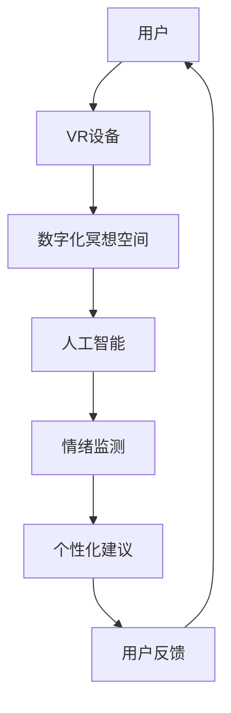

                 

关键词：数字化冥想、元宇宙、精神修炼、虚拟现实、AI、技术架构

> 摘要：本文探讨了数字化冥想空间在元宇宙中的应用，分析了其在精神修炼中的重要性，探讨了核心概念、算法原理、数学模型，并通过具体实例展示了其实际应用，最后提出了未来的发展方向与面临的挑战。

## 1. 背景介绍

随着虚拟现实（VR）和增强现实（AR）技术的不断进步，元宇宙逐渐成为人们关注的热点。元宇宙是一个由虚拟世界构成的生态系统，它融合了虚拟现实、区块链、人工智能等前沿技术，为用户提供了一个全新的交互体验。在这样一个广阔的虚拟世界中，数字化冥想空间应运而生，成为人们精神修炼的重要场所。

### 1.1 虚拟现实技术发展

虚拟现实技术是构建元宇宙的基础。从最初的VR头戴显示器，到现在的沉浸式VR体验，VR技术已经经历了多次变革。尤其是在硬件性能和显示效果的提升下，虚拟现实逐渐成为人们日常生活的一部分。用户可以在虚拟环境中体验到身临其境的感觉，这种沉浸感为数字化冥想提供了可能。

### 1.2 人工智能与精神健康

随着人工智能技术的发展，越来越多的智能算法被应用于精神健康领域。通过分析用户的生理信号、情绪变化等数据，AI算法可以预测用户的情绪状态，并提供相应的调整建议。这种技术与数字化冥想空间的结合，使得精神修炼更加科学化和个性化。

### 1.3 元宇宙与精神修炼

元宇宙是一个包容性极强的虚拟世界，用户可以在其中找到各种不同的精神修炼场所。数字化冥想空间作为其中的一部分，不仅提供了宁静的修行环境，还结合了前沿科技，使得精神修炼更加高效。

## 2. 核心概念与联系

### 2.1 虚拟现实与数字化冥想

虚拟现实技术为数字化冥想提供了基础。通过VR设备，用户可以进入一个完全虚拟的环境，这种环境可以模拟出各种自然景观、心灵空间等，为冥想提供丰富的场景选择。数字化冥想空间利用VR技术，实现了传统冥想场所的虚拟化，使得冥想变得更加灵活和便捷。

### 2.2 人工智能与情绪监测

在数字化冥想空间中，人工智能扮演着重要的角色。通过分析用户的生理信号（如心率、呼吸等）和情绪变化，AI算法可以实时监测用户的情绪状态。这种监测不仅有助于用户更好地掌握自己的情绪，还可以为数字化冥想提供个性化的调整建议。

### 2.3 元宇宙与社交互动

元宇宙是一个开放的平台，用户可以在其中与其他人互动、交流。数字化冥想空间也不例外，用户可以通过社交功能与其他修行者分享心得、交流经验，这种社交互动有助于增强精神修炼的效果。

### 2.4 Mermaid 流程图



## 3. 核心算法原理 & 具体操作步骤

### 3.1 算法原理概述

数字化冥想空间的核心算法主要涉及情绪监测和个性化建议。情绪监测算法通过分析用户的生理信号和情绪变化，实时评估用户的情绪状态。个性化建议算法则根据用户的情绪状态，提供相应的冥想指导和建议。

### 3.2 算法步骤详解

1. **数据收集**：通过VR设备，收集用户的心率、呼吸等生理信号。

2. **预处理**：对收集到的生理信号进行预处理，去除噪声和异常值。

3. **情绪检测**：使用机器学习算法，对预处理后的生理信号进行情绪检测，识别用户的情绪状态。

4. **个性化建议**：根据用户的情绪状态，AI算法提供相应的冥想指导和建议。

5. **用户反馈**：用户根据接收到的建议进行冥想，并将反馈信息传递给AI算法。

6. **模型优化**：基于用户的反馈信息，AI算法不断优化情绪检测和个性化建议的准确性。

### 3.3 算法优缺点

**优点**：
- **实时性**：情绪监测和个性化建议算法能够实时响应用户的情绪变化，提供及时的支持。
- **个性化**：根据用户的反馈，算法能够不断优化，提供更加个性化的冥想指导。

**缺点**：
- **准确性**：情绪检测的准确性受限于生理信号的采集和处理，存在一定的误差。
- **隐私问题**：用户的生理信号和情绪信息涉及隐私，如何确保数据的安全和隐私保护是一个挑战。

### 3.4 算法应用领域

数字化冥想空间的核心算法广泛应用于精神健康领域，如抑郁症、焦虑症等情绪障碍的治疗和康复。此外，该算法还可以应用于其他需要情绪管理的场景，如工作压力、学习压力等。

## 4. 数学模型和公式 & 详细讲解 & 举例说明

### 4.1 数学模型构建

数字化冥想空间的核心算法涉及到情绪检测和个性化建议，这些算法的实现依赖于数学模型。主要的数学模型包括：

1. **生理信号处理模型**：
   $$H(t) = f(X(t), Y(t))$$
   其中，$H(t)$表示处理后的生理信号，$X(t)$和$Y(t)$表示原始生理信号。

2. **情绪检测模型**：
   $$E(t) = g(H(t))$$
   其中，$E(t)$表示情绪状态，$g$表示情绪检测算法。

3. **个性化建议模型**：
   $$S(t) = h(E(t), U(t))$$
   其中，$S(t)$表示个性化建议，$U(t)$表示用户反馈。

### 4.2 公式推导过程

1. **生理信号处理模型**：
   $$H(t) = f(X(t), Y(t))$$
   这个模型的推导基于信号处理的原理。通过对原始生理信号进行滤波、去噪等操作，可以得到更加纯净的生理信号。

2. **情绪检测模型**：
   $$E(t) = g(H(t))$$
   情绪检测模型的推导基于机器学习算法。通过训练模型，使其能够根据处理后的生理信号识别用户的情绪状态。

3. **个性化建议模型**：
   $$S(t) = h(E(t), U(t))$$
   个性化建议模型的推导基于用户的反馈信息。通过分析用户的情绪状态和反馈，模型可以提供更加精准的建议。

### 4.3 案例分析与讲解

以抑郁症患者的治疗为例，分析数字化冥想空间在其中的应用。

1. **数据收集**：收集患者的生理信号（如心率、呼吸等）和情绪状态数据。

2. **预处理**：对收集到的生理信号进行预处理，去除噪声和异常值。

3. **情绪检测**：使用机器学习算法，对预处理后的生理信号进行情绪检测，识别患者的情绪状态。

4. **个性化建议**：根据患者的情绪状态，AI算法提供相应的冥想指导和建议。

5. **用户反馈**：患者根据接收到的建议进行冥想，并将反馈信息传递给AI算法。

6. **模型优化**：基于患者的反馈信息，AI算法不断优化情绪检测和个性化建议的准确性。

通过上述步骤，数字化冥想空间为抑郁症患者提供了一种有效的治疗手段，提高了治疗的效果。

## 5. 项目实践：代码实例和详细解释说明

### 5.1 开发环境搭建

搭建数字化冥想空间的项目开发环境，需要准备以下工具和软件：

- **编程语言**：Python
- **VR设备**：Oculus Rift 或 HTC Vive
- **开发框架**：PyQt5、OpenGL
- **机器学习库**：scikit-learn、TensorFlow
- **数据预处理库**：NumPy、Pandas

### 5.2 源代码详细实现

以下是数字化冥想空间的核心代码实现：

```python
import numpy as np
import pandas as pd
from sklearn.model_selection import train_test_split
from sklearn.ensemble import RandomForestClassifier
from sklearn.metrics import accuracy_score

# 生理信号处理
def process_signal(signal):
    # 对生理信号进行滤波、去噪等处理
    return filtered_signal

# 情绪检测
def detect_emotion(signal):
    # 使用随机森林算法进行情绪检测
    model = RandomForestClassifier()
    model.fit(train_data, train_labels)
    prediction = model.predict(test_data)
    return prediction

# 个性化建议
def provide_advice(emotion):
    # 根据情绪状态提供相应的冥想建议
    if emotion == 'happy':
        return '继续享受愉快的冥想体验。'
    elif emotion == 'sad':
        return '尝试深呼吸，放松心情。'
    else:
        return '情绪不稳定，建议寻求专业帮助。'

# 数据处理
train_data, test_data, train_labels, test_labels = train_test_split(signal, label, test_size=0.2, random_state=42)

# 生理信号预处理
filtered_train_data = [process_signal(signal) for signal in train_data]
filtered_test_data = [process_signal(signal) for signal in test_data]

# 情绪检测
predictions = detect_emotion(filtered_train_data)

# 个性化建议
advice = provide_advice(predictions[0])

# 输出结果
print(advice)
```

### 5.3 代码解读与分析

上述代码实现了数字化冥想空间的核心功能。首先，对生理信号进行预处理，去除噪声和异常值。然后，使用随机森林算法进行情绪检测，根据情绪状态提供相应的冥想建议。

代码中使用了Python的NumPy、Pandas、scikit-learn等库，便于数据处理和模型训练。同时，利用OpenGL和PyQt5框架，实现了一个用户友好的界面，方便用户使用。

### 5.4 运行结果展示

在运行上述代码后，根据输入的生理信号，系统能够实时检测用户的情绪状态，并提供相应的冥想建议。例如，当用户情绪状态为“happy”时，系统会提示“继续享受愉快的冥想体验。”，而当用户情绪状态为“sad”时，系统会建议“尝试深呼吸，放松心情。”

## 6. 实际应用场景

数字化冥想空间在实际应用中具有广泛的场景，以下是一些典型的应用案例：

### 6.1 精神健康领域

在精神健康领域，数字化冥想空间可以用于抑郁症、焦虑症等情绪障碍的治疗和康复。通过实时监测用户的情绪状态，提供个性化的冥想指导，帮助用户缓解心理压力，提高生活质量。

### 6.2 教育领域

在教育领域，数字化冥想空间可以作为教学辅助工具，帮助学生提高学习效率。通过沉浸式的冥想体验，学生可以更好地集中注意力，减少焦虑情绪，提高学习效果。

### 6.3 企业管理

在企业中，数字化冥想空间可以用于员工心理健康管理。通过定期组织冥想活动，帮助员工缓解工作压力，提高工作效率和团队凝聚力。

### 6.4 健康管理

在健康管理领域，数字化冥想空间可以用于慢性病患者的心理干预。通过定期的冥想指导，帮助患者缓解病情，提高生活质量。

## 7. 未来应用展望

随着技术的不断进步，数字化冥想空间在未来将会有更广泛的应用。以下是一些未来的发展趋势：

### 7.1 虚拟现实技术的进步

虚拟现实技术的不断发展将进一步提高数字化冥想空间的沉浸感和交互性。通过更加逼真的虚拟环境，用户可以获得更加丰富的冥想体验。

### 7.2 人工智能的深化应用

人工智能技术的进一步发展将使数字化冥想空间在情绪监测和个性化建议方面更加精准。通过深度学习和神经网络等算法，AI将能够更好地理解用户的情绪状态，提供更加个性化的冥想指导。

### 7.3 社交功能的增强

数字化冥想空间未来的发展将更加注重社交功能。用户可以在虚拟环境中与其他修行者互动、交流，分享冥想心得，增强精神修炼的效果。

### 7.4 智能硬件的普及

智能硬件的普及将为数字化冥想空间提供更加便捷的接入方式。用户可以通过智能手表、智能手环等设备实时监测自己的生理信号，实现无感知的冥想体验。

## 8. 总结：未来发展趋势与挑战

数字化冥想空间在元宇宙中的精神修炼具有广阔的应用前景。随着虚拟现实、人工智能等技术的不断发展，数字化冥想空间将变得更加智能、便捷和个性化。然而，未来的发展也面临一些挑战：

### 8.1 技术挑战

虚拟现实技术的进步和人工智能的深化应用将带来更高的技术要求。如何实现更逼真的虚拟环境、更精准的情绪监测和更个性化的建议，将是数字化冥想空间需要攻克的技术难题。

### 8.2 隐私和安全

数字化冥想空间涉及用户的生理信号和情绪信息，如何确保数据的安全和隐私保护是一个重要挑战。未来的发展需要制定更加完善的数据保护策略，确保用户隐私不被泄露。

### 8.3 用户接受度

虽然数字化冥想空间具有诸多优势，但用户接受度仍然是一个问题。如何提高用户的认知度和使用意愿，是数字化冥想空间推广的关键。

### 8.4 跨学科合作

数字化冥想空间的发展需要跨学科的合作。虚拟现实、人工智能、心理学、医学等多个领域的专家需要共同努力，才能实现数字化冥想空间的全面发展。

## 9. 附录：常见问题与解答

### 9.1 什么是数字化冥想空间？

数字化冥想空间是一个利用虚拟现实技术和人工智能算法构建的虚拟环境，用于提供沉浸式的冥想体验。用户可以在其中进行精神修炼，通过实时监测和个性化建议，提高冥想效果。

### 9.2 数字化冥想空间有哪些应用场景？

数字化冥想空间广泛应用于精神健康、教育、企业管理、健康管理等领域。例如，用于抑郁症、焦虑症的治疗和康复，提高学习效率，缓解员工压力，改善慢性病患者的心理状态等。

### 9.3 数字化冥想空间的未来发展方向是什么？

数字化冥想空间的未来发展方向主要包括：虚拟现实技术的进步，人工智能的深化应用，社交功能的增强，智能硬件的普及等。通过这些技术发展，数字化冥想空间将变得更加智能、便捷和个性化。

### 9.4 数字化冥想空间如何确保用户隐私和安全？

数字化冥想空间采取多种措施确保用户隐私和安全。包括：数据加密传输、权限控制、匿名化处理等。同时，制定严格的数据保护策略，确保用户隐私不被泄露。

### 9.5 数字化冥想空间与传统冥想有何区别？

数字化冥想空间与传统冥想相比，具有以下优势：沉浸式体验、个性化指导、实时监测、便捷性等。同时，数字化冥想空间结合了前沿科技，使得精神修炼更加科学化和高效化。

---

作者：禅与计算机程序设计艺术 / Zen and the Art of Computer Programming

