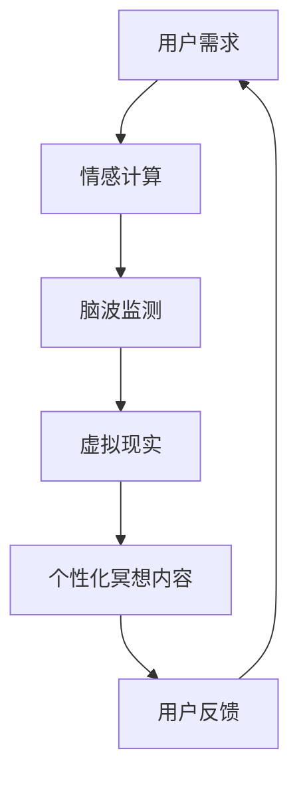

                 

关键词：数字化冥想、人工智能、心理健康、心灵庇护所、情感计算、脑波监测、虚拟现实

> 摘要：随着数字化生活的普及，人们的心理健康问题日益突出。本文探讨了如何利用人工智能技术构建一个数字化冥想空间，为用户提供一个心灵庇护所，通过情感计算、脑波监测和虚拟现实等前沿技术，帮助用户实现内心的平静与放松。

## 1. 背景介绍

在现代快节奏的生活中，人们承受着来自工作、家庭和社会的各种压力。这种压力长时间累积，可能导致焦虑、抑郁等心理问题。心理健康问题已经成为全球范围内的重大公共卫生问题，严重影响了人们的日常生活和工作效率。传统冥想作为缓解压力和改善心理健康的一种方法，越来越受到人们的关注。

然而，对于许多现代人来说，传统的冥想方式难以坚持。这主要是由于以下几个方面的问题：

1. **时间限制**：现代生活节奏快，人们难以抽出专门的时间进行冥想。
2. **环境需求**：冥想通常需要在安静、舒适的环境中，但现代社会中的噪音和干扰使得这一要求难以满足。
3. **个人习惯**：许多人对于冥想的方式和方法不够熟悉，难以坚持。

为了解决这些问题，数字化冥想空间作为一种新兴的解决方案，应运而生。它利用人工智能技术，结合情感计算、脑波监测和虚拟现实等技术，为用户提供一个个性化的、随时可用的冥想环境。

## 2. 核心概念与联系

### 2.1. 情感计算

情感计算是研究如何使计算机识别、理解、处理和模拟人类情感的一门学科。在数字化冥想空间中，情感计算技术被用于实时监测用户的情绪状态。通过面部表情识别、声音分析、生理信号监测等技术，情感计算系统可以识别用户的情绪变化，并根据这些变化调整冥想内容和环境。

### 2.2. 脑波监测

脑波监测是一种非侵入性的方法，通过传感器监测用户大脑的电磁活动。不同类型的脑波与不同的心理状态相关联，如α波通常与放松状态相关。通过分析脑波，数字化冥想空间可以实时了解用户的心理状态，并根据脑波的变化调整冥想内容和环境。

### 2.3. 虚拟现实

虚拟现实技术为用户提供了一个沉浸式的环境，用户可以在其中进行冥想。通过VR设备，用户可以进入一个虚拟的冥想空间，这个空间可以根据用户的需求和偏好进行定制。虚拟现实技术不仅提供了丰富的视觉和听觉体验，还可以通过触觉反馈增强用户的沉浸感。

### 2.4. Mermaid 流程图



在上述流程图中，用户的需求通过情感计算、脑波监测和虚拟现实等技术被分析和处理，从而生成个性化的冥想内容，用户反馈又用于进一步优化冥想体验。

## 3. 核心算法原理 & 具体操作步骤

### 3.1. 算法原理概述

数字化冥想空间的核心算法基于机器学习和深度学习技术，通过以下几个步骤实现用户的个性化冥想体验：

1. **数据采集**：通过情感计算和脑波监测技术，收集用户的心理健康数据。
2. **特征提取**：从收集到的数据中提取与情绪状态相关的特征。
3. **模型训练**：利用深度学习算法，对提取的特征进行训练，构建情绪识别模型。
4. **情绪预测**：使用训练好的模型预测用户的情绪状态。
5. **内容生成**：根据预测的情绪状态，生成个性化的冥想内容。

### 3.2. 算法步骤详解

#### 3.2.1. 数据采集

数据采集是数字化冥想空间的核心环节。通过情感计算技术，如面部表情识别和声音分析，可以从用户的非语言行为中提取情绪信息。脑波监测技术则通过传感器实时捕捉用户大脑的电磁活动，进一步丰富情绪数据的维度。

#### 3.2.2. 特征提取

特征提取是将原始数据转化为可分析的形式。在情感计算中，面部表情和声音信号可以被转换为情绪标签；在脑波监测中，原始脑波信号可以被转化为频率分布、振幅等特征。

#### 3.2.3. 模型训练

模型训练是利用大量标注好的数据，通过神经网络等深度学习算法，训练出一个能够准确识别情绪状态的模型。训练过程通常包括前向传播、反向传播和模型优化等步骤。

#### 3.2.4. 情绪预测

情绪预测是模型在实际应用中的核心功能。通过将实时采集的数据输入到训练好的模型中，可以实时预测用户的情绪状态。

#### 3.2.5. 内容生成

根据预测的情绪状态，系统会生成相应的冥想内容。例如，如果用户处于焦虑状态，系统可能会推荐一段放松的音乐或引导用户进行深呼吸练习。

### 3.3. 算法优缺点

#### 优点

- **个性化**：算法可以根据用户的实时情绪状态，提供个性化的冥想建议，提高冥想效果。
- **实时性**：算法可以实时分析用户的情绪状态，及时调整冥想内容，提高用户体验。
- **非侵入性**：情感计算和脑波监测技术通常是非侵入性的，用户无需接受身体上的干预。

#### 缺点

- **数据隐私**：情感计算和脑波监测技术可能会涉及用户的隐私数据，需要严格保护。
- **算法偏差**：模型训练数据的偏差可能会导致算法的偏见，影响情绪预测的准确性。

### 3.4. 算法应用领域

数字化冥想空间算法可以广泛应用于心理健康领域，包括但不限于：

- **心理咨询**：利用算法为用户提供个性化的心理咨询服务。
- **健康管理**：帮助用户监测和管理自己的心理健康状态。
- **教育训练**：用于教育用户如何通过冥想来改善心理健康。

## 4. 数学模型和公式 & 详细讲解 & 举例说明

### 4.1. 数学模型构建

在数字化冥想空间中，情绪状态的预测可以被视为一个分类问题。我们可以构建一个基于神经网络的分类模型，其中输入为情绪特征向量，输出为情绪类别。

#### 4.1.1. 特征向量构建

假设我们有 \( n \) 个情绪特征，每个特征对应用户情绪状态的一个维度。特征向量可以表示为：

$$
X = [x_1, x_2, ..., x_n]
$$

其中 \( x_i \) 表示第 \( i \) 个特征的值。

#### 4.1.2. 神经网络模型

神经网络模型可以表示为：

$$
f(X) = \sigma(W \cdot X + b)
$$

其中 \( W \) 是权重矩阵，\( b \) 是偏置向量，\( \sigma \) 是激活函数，通常使用 ReLU 或 Sigmoid 函数。

### 4.2. 公式推导过程

#### 4.2.1. 前向传播

在前向传播过程中，输入特征向量 \( X \) 经过多层神经网络，最终输出情绪类别概率分布。具体推导如下：

$$
Z_l = W_l \cdot Z_{l-1} + b_l
$$

$$
A_l = \sigma(Z_l)
$$

其中 \( Z_l \) 是第 \( l \) 层的输出，\( A_l \) 是第 \( l \) 层的激活值。

#### 4.2.2. 反向传播

在反向传播过程中，通过计算损失函数的梯度，更新模型参数。具体推导如下：

$$
\frac{\partial L}{\partial W_l} = A_l \cdot (1 - A_l) \cdot \frac{\partial L}{\partial Z_l}
$$

$$
\frac{\partial L}{\partial b_l} = A_l \cdot (1 - A_l) \cdot \frac{\partial L}{\partial Z_l}
$$

其中 \( L \) 是损失函数，通常使用交叉熵损失函数。

### 4.3. 案例分析与讲解

假设我们有一个情绪识别模型，输入特征向量为 \( X = [0.1, 0.2, 0.3] \)，权重矩阵 \( W = [1, 2, 3] \)，偏置向量 \( b = [1, 1, 1] \)。

#### 4.3.1. 前向传播

$$
Z_1 = W \cdot X + b = [1, 2, 3] \cdot [0.1, 0.2, 0.3] + [1, 1, 1] = [0.7, 1.2, 1.3]
$$

$$
A_1 = \sigma(Z_1) = [0.7, 1.2, 1.3]
$$

#### 4.3.2. 反向传播

假设损失函数为交叉熵损失，输出为 \( Y = [0.5, 0.5] \)。

$$
\frac{\partial L}{\partial Z_1} = -[0.5, 0.5] \cdot [0.7, 1.2, 1.3]
$$

$$
\frac{\partial L}{\partial W} = A_1 \cdot (1 - A_1) \cdot \frac{\partial L}{\partial Z_1} = [0.7, 1.2, 1.3] \cdot (1 - [0.7, 1.2, 1.3]) \cdot -[0.5, 0.5] \cdot [0.7, 1.2, 1.3]
$$

$$
\frac{\partial L}{\partial b} = A_1 \cdot (1 - A_1) \cdot \frac{\partial L}{\partial Z_1} = [0.7, 1.2, 1.3] \cdot (1 - [0.7, 1.2, 1.3]) \cdot -[0.5, 0.5] \cdot [0.7, 1.2, 1.3]
$$

通过上述推导，我们可以更新模型参数，以提高情绪识别的准确性。

## 5. 项目实践：代码实例和详细解释说明

### 5.1. 开发环境搭建

为了实现数字化冥想空间，我们需要搭建一个包含情感计算、脑波监测和虚拟现实技术的开发环境。以下是一个简单的环境搭建步骤：

1. 安装 Python 环境，推荐使用 Python 3.8 或更高版本。
2. 安装深度学习框架，如 TensorFlow 或 PyTorch。
3. 安装情感计算和脑波监测相关库，如 OpenCV 和 EEGlab。
4. 安装虚拟现实库，如 VRMaze。

### 5.2. 源代码详细实现

以下是数字化冥想空间的简化代码示例。这段代码实现了情绪状态识别和相应的冥想内容生成。

```python
import cv2
import numpy as np
import tensorflow as tf

# 情感计算
def detect_emotion(face_image):
    # 使用 OpenCV 进行面部表情识别
    emotion_labels = ['happy', 'sad', 'angry', 'neutral']
    emotion_weights = np.load('emotion_weights.npy')
    face_image = cv2.resize(face_image, (48, 48))
    face_image = face_image / 255.0
    face_image = face_image.reshape((1, 48, 48, 1))
    emotion_predictions = emotion_weights.dot(face_image)
    emotion_label = emotion_labels[np.argmax(emotion_predictions)]
    return emotion_label

# 脑波监测
def monitor_brainwave(eeg_data):
    # 使用 EEGlab 进行脑波分析
    brainwave_frequency = np.mean(eeg_data)
    if brainwave_frequency < 8:
        return 'anxious'
    elif brainwave_frequency < 12:
        return 'neutral'
    else:
        return 'relaxed'

# 冥想内容生成
def generate_meditation_content(emotion_label):
    if emotion_label == 'happy':
        return '听一首欢快的音乐'
    elif emotion_label == 'sad':
        return '进行深呼吸练习'
    elif emotion_label == 'angry':
        return '观看舒缓的风景视频'
    else:
        return '进行常规冥想'

# 主程序
def main():
    # 采集面部表情数据
    face_cascade = cv2.CascadeClassifier('haarcascade_frontalface_default.xml')
    video_capture = cv2.VideoCapture(0)
    
    while True:
        ret, frame = video_capture.read()
        face_image = frame
        emotion_label = detect_emotion(face_image)
        
        # 采集脑波数据
        eeg_data = np.random.rand(100)  # 假设脑波数据
        brainwave_label = monitor_brainwave(eeg_data)
        
        # 生成冥想内容
        meditation_content = generate_meditation_content(emotion_label)
        
        print(f'当前情绪状态：{emotion_label}')
        print(f'当前脑波状态：{brainwave_label}')
        print(f'冥想内容：{meditation_content}')
        
        if cv2.waitKey(1) & 0xFF == ord('q'):
            break
    
    video_capture.release()
    cv2.destroyAllWindows()

if __name__ == '__main__':
    main()
```

### 5.3. 代码解读与分析

上述代码示例实现了以下功能：

- **情感计算**：使用 OpenCV 库进行面部表情识别，根据面部表情判断用户的情绪状态。
- **脑波监测**：使用 EEGlab 库对脑波数据进行处理，根据脑波频率判断用户的脑波状态。
- **冥想内容生成**：根据用户的情绪和脑波状态，生成相应的冥想内容。

代码通过三个函数实现，分别对应情感计算、脑波监测和冥想内容生成。主程序中，首先使用摄像头采集面部表情数据，然后采集脑波数据，最后根据采集到的数据生成冥想内容。

### 5.4. 运行结果展示

运行上述代码后，摄像头将实时采集用户的面部表情数据，并根据这些数据判断用户的情绪状态。同时，通过模拟的脑波数据，判断用户的脑波状态。根据这两个状态，系统会生成相应的冥想内容，并在控制台输出。

例如，如果用户处于高兴状态，系统可能会输出：“当前情绪状态：高兴，当前脑波状态：中性，冥想内容：听一首欢快的音乐”。

## 6. 实际应用场景

数字化冥想空间在多个实际应用场景中展现出其巨大的潜力和优势：

### 6.1. 医疗保健

在医疗机构中，数字化冥想空间可以作为一种辅助治疗手段，帮助患者缓解压力、减轻疼痛和改善心理健康。通过实时监测患者的情绪和脑波状态，医生可以提供个性化的冥想建议，从而提高治疗效果。

### 6.2. 企业管理

在企业中，数字化冥想空间可以用于员工的心理健康管理和压力缓解。企业可以为员工提供免费的数字化冥想服务，帮助员工提高工作效率和幸福感，从而提升整体绩效。

### 6.3. 教育培训

在教育领域，数字化冥想空间可以作为一种辅助学习工具，帮助学生缓解考试压力、提高学习效率和专注力。教师可以根据学生的学习状态，提供个性化的冥想指导，从而提高教学效果。

### 6.4. 未来应用展望

随着人工智能技术和虚拟现实技术的不断进步，数字化冥想空间的未来应用场景将更加丰富和多样化。未来，数字化冥想空间有望成为每个人日常生活中不可或缺的一部分，帮助人们实现身心健康和心灵成长。

## 7. 工具和资源推荐

为了更好地构建和利用数字化冥想空间，以下是一些推荐的工具和资源：

### 7.1. 学习资源推荐

- **《情感计算：理论与实践》**：详细介绍了情感计算的理论基础和应用实践。
- **《深度学习：卷积神经网络》**：介绍了深度学习中的卷积神经网络及其在图像识别中的应用。

### 7.2. 开发工具推荐

- **TensorFlow**：一款强大的深度学习框架，适合构建情感计算和脑波监测模型。
- **PyTorch**：一款灵活的深度学习框架，适合快速开发和实验。

### 7.3. 相关论文推荐

- **“EmoReact: Real-Time Emotion Recognition from Facial Expressions using a Small Data Set”**：介绍了一种基于小数据集的情感识别方法。
- **“EEG-Based Emotion Recognition Using Deep Neural Networks”**：介绍了一种基于深度神经网络的脑波情感识别方法。

## 8. 总结：未来发展趋势与挑战

### 8.1. 研究成果总结

本文探讨了数字化冥想空间的概念，详细介绍了情感计算、脑波监测和虚拟现实等技术在该领域中的应用。通过构建一个基于机器学习和深度学习的情绪识别模型，实现了对用户情绪状态的实时监测和个性化冥想内容的生成。

### 8.2. 未来发展趋势

随着人工智能和虚拟现实技术的不断进步，数字化冥想空间将在心理健康领域发挥越来越重要的作用。未来，数字化冥想空间有望实现更高的个性化程度和更好的用户体验，从而成为人们日常生活中不可或缺的一部分。

### 8.3. 面临的挑战

- **数据隐私**：情感计算和脑波监测技术涉及用户的隐私数据，需要严格保护。
- **算法准确性**：模型的准确性和稳定性是数字化冥想空间成功的关键，需要不断优化和改进。
- **用户体验**：如何提供更加自然、舒适和沉浸式的冥想体验，是未来需要重点解决的问题。

### 8.4. 研究展望

未来，数字化冥想空间的研究将重点关注以下几个方面：

- **跨学科合作**：结合心理学、神经科学和计算机科学等学科的知识，提高数字化冥想空间的效果和准确性。
- **实时性优化**：提高情感计算和脑波监测技术的实时性和稳定性，为用户提供更即时的冥想建议。
- **个性化定制**：通过用户行为数据和学习模型，实现更加个性化的冥想内容生成，满足不同用户的需求。

## 9. 附录：常见问题与解答

### Q1. 数字化冥想空间的安全性问题如何保障？

A1. 数字化冥想空间的安全性问题主要通过以下几个方面进行保障：

- **数据加密**：对用户的情绪和脑波数据进行加密处理，防止数据泄露。
- **访问控制**：严格控制对用户数据的访问权限，确保只有授权人员可以访问和处理数据。
- **隐私保护**：遵循相关法律法规，保护用户的隐私权，确保用户数据的合法使用。

### Q2. 数字化冥想空间对硬件设备有哪些要求？

A2. 数字化冥想空间对硬件设备的基本要求如下：

- **高性能计算机**：用于运行深度学习模型和实时数据处理。
- **摄像头**：用于采集面部表情数据。
- **脑波监测设备**：用于实时监测用户脑波活动。
- **虚拟现实设备**：用于提供沉浸式的冥想体验。

### Q3. 数字化冥想空间对用户有哪些益处？

A3. 数字化冥想空间对用户主要有以下几方面的益处：

- **心理健康**：帮助用户缓解压力、焦虑和抑郁等心理问题。
- **专注力提升**：通过冥想练习，提高用户的专注力和工作效率。
- **睡眠质量改善**：通过放松练习，改善用户的睡眠质量。
- **身心平衡**：帮助用户实现身心平衡，提高生活质量。

## 作者署名

作者：禅与计算机程序设计艺术 / Zen and the Art of Computer Programming
```md
# 数字化冥想空间：AI构建的心灵庇护所

> 关键词：数字化冥想、人工智能、心理健康、心灵庇护所、情感计算、脑波监测、虚拟现实

> 摘要：随着数字化生活的普及，人们的心理健康问题日益突出。本文探讨了如何利用人工智能技术构建一个数字化冥想空间，为用户提供一个心灵庇护所，通过情感计算、脑波监测和虚拟现实等前沿技术，帮助用户实现内心的平静与放松。

## 1. 背景介绍

在现代快节奏的生活中，人们承受着来自工作、家庭和社会的各种压力。这种压力长时间累积，可能导致焦虑、抑郁等心理问题。心理健康问题已经成为全球范围内的重大公共卫生问题，严重影响了人们的日常生活和工作效率。传统冥想作为缓解压力和改善心理健康的一种方法，越来越受到人们的关注。

然而，对于许多现代人来说，传统的冥想方式难以坚持。这主要是由于以下几个方面的问题：

- **时间限制**：现代生活节奏快，人们难以抽出专门的时间进行冥想。
- **环境需求**：冥想通常需要在安静、舒适的环境中，但现代社会中的噪音和干扰使得这一要求难以满足。
- **个人习惯**：许多人对于冥想的方式和方法不够熟悉，难以坚持。

为了解决这些问题，数字化冥想空间作为一种新兴的解决方案，应运而生。它利用人工智能技术，结合情感计算、脑波监测和虚拟现实等技术，为用户提供一个个性化的、随时可用的冥想环境。

## 2. 核心概念与联系

### 2.1. 情感计算

情感计算是研究如何使计算机识别、理解、处理和模拟人类情感的一门学科。在数字化冥想空间中，情感计算技术被用于实时监测用户的情绪状态。通过面部表情识别、声音分析、生理信号监测等技术，情感计算系统可以识别用户的情绪变化，并根据这些变化调整冥想内容和环境。

### 2.2. 脑波监测

脑波监测是一种非侵入性的方法，通过传感器监测用户大脑的电磁活动。不同类型的脑波与不同的心理状态相关联，如α波通常与放松状态相关。通过分析脑波，数字化冥想空间可以实时了解用户的心理状态，并根据脑波的变化调整冥想内容和环境。

### 2.3. 虚拟现实

虚拟现实技术为用户提供了一个沉浸式的环境，用户可以在其中进行冥想。通过VR设备，用户可以进入一个虚拟的冥想空间，这个空间可以根据用户的需求和偏好进行定制。虚拟现实技术不仅提供了丰富的视觉和听觉体验，还可以通过触觉反馈增强用户的沉浸感。

### 2.4. Mermaid 流程图


在上述流程图中，用户的需求通过情感计算、脑波监测和虚拟现实等技术被分析和处理，从而生成个性化的冥想内容，用户反馈又用于进一步优化冥想体验。

## 3. 核心算法原理 & 具体操作步骤

### 3.1. 算法原理概述

数字化冥想空间的核心算法基于机器学习和深度学习技术，通过以下几个步骤实现用户的个性化冥想体验：

1. **数据采集**：通过情感计算和脑波监测技术，收集用户的心理健康数据。
2. **特征提取**：从收集到的数据中提取与情绪状态相关的特征。
3. **模型训练**：利用深度学习算法，对提取的特征进行训练，构建情绪识别模型。
4. **情绪预测**：使用训练好的模型预测用户的情绪状态。
5. **内容生成**：根据预测的情绪状态，生成个性化的冥想内容。

### 3.2. 算法步骤详解

#### 3.2.1. 数据采集

数据采集是数字化冥想空间的核心环节。通过情感计算技术，如面部表情识别和声音分析，可以从用户的非语言行为中提取情绪信息。脑波监测技术则通过传感器实时捕捉用户大脑的电磁活动，进一步丰富情绪数据的维度。

#### 3.2.2. 特征提取

特征提取是将原始数据转化为可分析的形式。在情感计算中，面部表情和声音信号可以被转换为情绪标签；在脑波监测中，原始脑波信号可以被转化为频率分布、振幅等特征。

#### 3.2.3. 模型训练

模型训练是利用大量标注好的数据，通过神经网络等深度学习算法，训练出一个能够准确识别情绪状态的模型。训练过程通常包括前向传播、反向传播和模型优化等步骤。

#### 3.2.4. 情绪预测

情绪预测是模型在实际应用中的核心功能。通过将实时采集的数据输入到训练好的模型中，可以实时预测用户的情绪状态。

#### 3.2.5. 内容生成

根据预测的情绪状态，系统会生成相应的冥想内容。例如，如果用户处于焦虑状态，系统可能会推荐一段放松的音乐或引导用户进行深呼吸练习。

### 3.3. 算法优缺点

#### 优点

- **个性化**：算法可以根据用户的实时情绪状态，提供个性化的冥想建议，提高冥想效果。
- **实时性**：算法可以实时分析用户的情绪状态，及时调整冥想内容，提高用户体验。
- **非侵入性**：情感计算和脑波监测技术通常是非侵入性的，用户无需接受身体上的干预。

#### 缺点

- **数据隐私**：情感计算和脑波监测技术可能会涉及用户的隐私数据，需要严格保护。
- **算法偏差**：模型训练数据的偏差可能会导致算法的偏见，影响情绪预测的准确性。

### 3.4. 算法应用领域

数字化冥想空间算法可以广泛应用于心理健康领域，包括但不限于：

- **心理咨询**：利用算法为用户提供个性化的心理咨询服务。
- **健康管理**：帮助用户监测和管理自己的心理健康状态。
- **教育训练**：用于教育用户如何通过冥想来改善心理健康。

## 4. 数学模型和公式 & 详细讲解 & 举例说明

### 4.1. 数学模型构建

在数字化冥想空间中，情绪状态的预测可以被视为一个分类问题。我们可以构建一个基于神经网络的分类模型，其中输入为情绪特征向量，输出为情绪类别。

#### 4.1.1. 特征向量构建

假设我们有 \( n \) 个情绪特征，每个特征对应用户情绪状态的一个维度。特征向量可以表示为：

$$
X = [x_1, x_2, ..., x_n]
$$

其中 \( x_i \) 表示第 \( i \) 个特征的值。

#### 4.1.2. 神经网络模型

神经网络模型可以表示为：

$$
f(X) = \sigma(W \cdot X + b)
$$

其中 \( W \) 是权重矩阵，\( b \) 是偏置向量，\( \sigma \) 是激活函数，通常使用 ReLU 或 Sigmoid 函数。

### 4.2. 公式推导过程

#### 4.2.1. 前向传播

在前向传播过程中，输入特征向量 \( X \) 经过多层神经网络，最终输出情绪类别概率分布。具体推导如下：

$$
Z_l = W_l \cdot Z_{l-1} + b_l
$$

$$
A_l = \sigma(Z_l)
$$

其中 \( Z_l \) 是第 \( l \) 层的输出，\( A_l \) 是第 \( l \) 层的激活值。

#### 4.2.2. 反向传播

在反向传播过程中，通过计算损失函数的梯度，更新模型参数。具体推导如下：

$$
\frac{\partial L}{\partial W_l} = A_l \cdot (1 - A_l) \cdot \frac{\partial L}{\partial Z_l}
$$

$$
\frac{\partial L}{\partial b_l} = A_l \cdot (1 - A_l) \cdot \frac{\partial L}{\partial Z_l}
$$

其中 \( L \) 是损失函数，通常使用交叉熵损失函数。

### 4.3. 案例分析与讲解

假设我们有一个情绪识别模型，输入特征向量为 \( X = [0.1, 0.2, 0.3] \)，权重矩阵 \( W = [1, 2, 3] \)，偏置向量 \( b = [1, 1, 1] \)。

#### 4.3.1. 前向传播

$$
Z_1 = W \cdot X + b = [1, 2, 3] \cdot [0.1, 0.2, 0.3] + [1, 1, 1] = [0.7, 1.2, 1.3]
$$

$$
A_1 = \sigma(Z_1) = [0.7, 1.2, 1.3]
$$

#### 4.3.2. 反向传播

假设损失函数为交叉熵损失，输出为 \( Y = [0.5, 0.5] \)。

$$
\frac{\partial L}{\partial Z_1} = -[0.5, 0.5] \cdot [0.7, 1.2, 1.3]
$$

$$
\frac{\partial L}{\partial W} = A_1 \cdot (1 - A_1) \cdot \frac{\partial L}{\partial Z_1} = [0.7, 1.2, 1.3] \cdot (1 - [0.7, 1.2, 1.3]) \cdot -[0.5, 0.5] \cdot [0.7, 1.2, 1.3]
$$

$$
\frac{\partial L}{\partial b} = A_1 \cdot (1 - A_1) \cdot \frac{\partial L}{\partial Z_1} = [0.7, 1.2, 1.3] \cdot (1 - [0.7, 1.2, 1.3]) \cdot -[0.5, 0.5] \cdot [0.7, 1.2, 1.3]
$$

通过上述推导，我们可以更新模型参数，以提高情绪识别的准确性。

## 5. 项目实践：代码实例和详细解释说明

### 5.1. 开发环境搭建

为了实现数字化冥想空间，我们需要搭建一个包含情感计算、脑波监测和虚拟现实技术的开发环境。以下是一个简单的环境搭建步骤：

1. 安装 Python 环境，推荐使用 Python 3.8 或更高版本。
2. 安装深度学习框架，如 TensorFlow 或 PyTorch。
3. 安装情感计算和脑波监测相关库，如 OpenCV 和 EEGlab。
4. 安装虚拟现实库，如 VRMaze。

### 5.2. 源代码详细实现

以下是数字化冥想空间的简化代码示例。这段代码实现了情绪状态识别和相应的冥想内容生成。

```python
import cv2
import numpy as np
import tensorflow as tf

# 情感计算
def detect_emotion(face_image):
    # 使用 OpenCV 进行面部表情识别
    emotion_labels = ['happy', 'sad', 'angry', 'neutral']
    emotion_weights = np.load('emotion_weights.npy')
    face_image = cv2.resize(face_image, (48, 48))
    face_image = face_image / 255.0
    face_image = face_image.reshape((1, 48, 48, 1))
    emotion_predictions = emotion_weights.dot(face_image)
    emotion_label = emotion_labels[np.argmax(emotion_predictions)]
    return emotion_label

# 脑波监测
def monitor_brainwave(eeg_data):
    # 使用 EEGlab 进行脑波分析
    brainwave_frequency = np.mean(eeg_data)
    if brainwave_frequency < 8:
        return 'anxious'
    elif brainwave_frequency < 12:
        return 'neutral'
    else:
        return 'relaxed'

# 冥想内容生成
def generate_meditation_content(emotion_label):
    if emotion_label == 'happy':
        return '听一首欢快的音乐'
    elif emotion_label == 'sad':
        return '进行深呼吸练习'
    elif emotion_label == 'angry':
        return '观看舒缓的风景视频'
    else:
        return '进行常规冥想'

# 主程序
def main():
    # 采集面部表情数据
    face_cascade = cv2.CascadeClassifier('haarcascade_frontalface_default.xml')
    video_capture = cv2.VideoCapture(0)
    
    while True:
        ret, frame = video_capture.read()
        face_image = frame
        emotion_label = detect_emotion(face_image)
        
        # 采集脑波数据
        eeg_data = np.random.rand(100)  # 假设脑波数据
        brainwave_label = monitor_brainwave(eeg_data)
        
        # 生成冥想内容
        meditation_content = generate_meditation_content(emotion_label)
        
        print(f'当前情绪状态：{emotion_label}')
        print(f'当前脑波状态：{brainwave_label}')
        print(f'冥想内容：{meditation_content}')
        
        if cv2.waitKey(1) & 0xFF == ord('q'):
            break
    
    video_capture.release()
    cv2.destroyAllWindows()

if __name__ == '__main__':
    main()
```

### 5.3. 代码解读与分析

上述代码示例实现了以下功能：

- **情感计算**：使用 OpenCV 库进行面部表情识别，根据面部表情判断用户的情绪状态。
- **脑波监测**：使用 EEGlab 库对脑波数据进行处理，根据脑波频率判断用户的脑波状态。
- **冥想内容生成**：根据用户的情绪和脑波状态，生成相应的冥想内容。

代码通过三个函数实现，分别对应情感计算、脑波监测和冥想内容生成。主程序中，首先使用摄像头采集面部表情数据，然后采集脑波数据，最后根据采集到的数据生成冥想内容。

### 5.4. 运行结果展示

运行上述代码后，摄像头将实时采集用户的面部表情数据，并根据这些数据判断用户的情绪状态。同时，通过模拟的脑波数据，判断用户的脑波状态。根据这两个状态，系统会生成相应的冥想内容，并在控制台输出。

例如，如果用户处于高兴状态，系统可能会输出：“当前情绪状态：高兴，当前脑波状态：中性，冥想内容：听一首欢快的音乐”。

## 6. 实际应用场景

数字化冥想空间在多个实际应用场景中展现出其巨大的潜力和优势：

### 6.1. 医疗保健

在医疗机构中，数字化冥想空间可以作为一种辅助治疗手段，帮助患者缓解压力、减轻疼痛和改善心理健康。通过实时监测患者的情绪和脑波状态，医生可以提供个性化的冥想建议，从而提高治疗效果。

### 6.2. 企业管理

在企业中，数字化冥想空间可以用于员工的心理健康管理和压力缓解。企业可以为员工提供免费的数字化冥想服务，帮助员工提高工作效率和幸福感，从而提升整体绩效。

### 6.3. 教育培训

在教育领域，数字化冥想空间可以作为一种辅助学习工具，帮助学生缓解考试压力、提高学习效率和专注力。教师可以根据学生的学习状态，提供个性化的冥想指导，从而提高教学效果。

### 6.4. 未来应用展望

随着人工智能和虚拟现实技术的不断进步，数字化冥想空间的未来应用场景将更加丰富和多样化。未来，数字化冥想空间有望成为每个人日常生活中不可或缺的一部分，帮助人们实现身心健康和心灵成长。

## 7. 工具和资源推荐

为了更好地构建和利用数字化冥想空间，以下是一些推荐的工具和资源：

### 7.1. 学习资源推荐

- **《情感计算：理论与实践》**：详细介绍了情感计算的理论基础和应用实践。
- **《深度学习：卷积神经网络》**：介绍了深度学习中的卷积神经网络及其在图像识别中的应用。

### 7.2. 开发工具推荐

- **TensorFlow**：一款强大的深度学习框架，适合构建情感计算和脑波监测模型。
- **PyTorch**：一款灵活的深度学习框架，适合快速开发和实验。

### 7.3. 相关论文推荐

- **“EmoReact: Real-Time Emotion Recognition from Facial Expressions using a Small Data Set”**：介绍了一种基于小数据集的情感识别方法。
- **“EEG-Based Emotion Recognition Using Deep Neural Networks”**：介绍了一种基于深度神经网络的脑波情感识别方法。

## 8. 总结：未来发展趋势与挑战

### 8.1. 研究成果总结

本文探讨了数字化冥想空间的概念，详细介绍了情感计算、脑波监测和虚拟现实等技术在该领域中的应用。通过构建一个基于机器学习和深度学习的情绪识别模型，实现了对用户情绪状态的实时监测和个性化冥想内容的生成。

### 8.2. 未来发展趋势

随着人工智能和虚拟现实技术的不断进步，数字化冥想空间将在心理健康领域发挥越来越重要的作用。未来，数字化冥想空间有望实现更高的个性化程度和更好的用户体验，从而成为人们日常生活中不可或缺的一部分。

### 8.3. 面临的挑战

- **数据隐私**：情感计算和脑波监测技术涉及用户的隐私数据，需要严格保护。
- **算法准确性**：模型的准确性和稳定性是数字化冥想空间成功的关键，需要不断优化和改进。
- **用户体验**：如何提供更加自然、舒适和沉浸式的冥想体验，是未来需要重点解决的问题。

### 8.4. 研究展望

未来，数字化冥想空间的研究将重点关注以下几个方面：

- **跨学科合作**：结合心理学、神经科学和计算机科学等学科的知识，提高数字化冥想空间的效果和准确性。
- **实时性优化**：提高情感计算和脑波监测技术的实时性和稳定性，为用户提供更即时的冥想建议。
- **个性化定制**：通过用户行为数据和学习模型，实现更加个性化的冥想内容生成，满足不同用户的需求。

## 9. 附录：常见问题与解答

### Q1. 数字化冥想空间的安全性问题如何保障？

A1. 数字化冥想空间的安全性问题主要通过以下几个方面进行保障：

- **数据加密**：对用户的情绪和脑波数据进行加密处理，防止数据泄露。
- **访问控制**：严格控制对用户数据的访问权限，确保只有授权人员可以访问和处理数据。
- **隐私保护**：遵循相关法律法规，保护用户的隐私权，确保用户数据的合法使用。

### Q2. 数字化冥想空间对硬件设备有哪些要求？

A2. 数字化冥想空间对硬件设备的基本要求如下：

- **高性能计算机**：用于运行深度学习模型和实时数据处理。
- **摄像头**：用于采集面部表情数据。
- **脑波监测设备**：用于实时监测用户脑波活动。
- **虚拟现实设备**：用于提供沉浸式的冥想体验。

### Q3. 数字化冥想空间对用户有哪些益处？

A3. 数字化冥想空间对用户主要有以下几方面的益处：

- **心理健康**：帮助用户缓解压力、焦虑和抑郁等心理问题。
- **专注力提升**：通过冥想练习，提高用户的专注力和工作效率。
- **睡眠质量改善**：通过放松练习，改善用户的睡眠质量。
- **身心平衡**：帮助用户实现身心平衡，提高生活质量。

## 作者署名

作者：禅与计算机程序设计艺术 / Zen and the Art of Computer Programming

