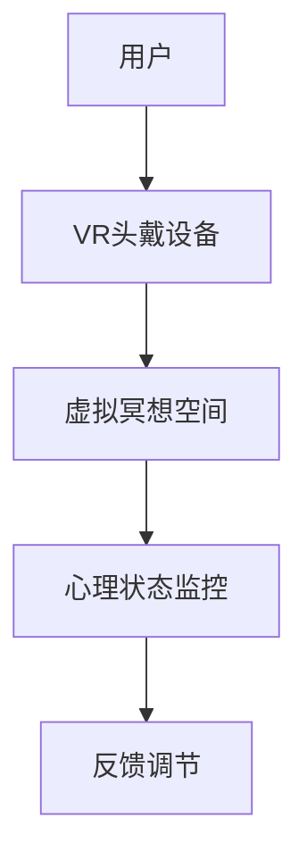
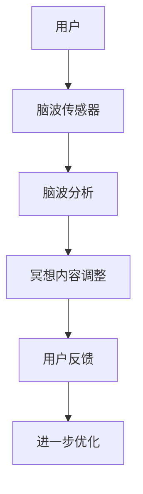
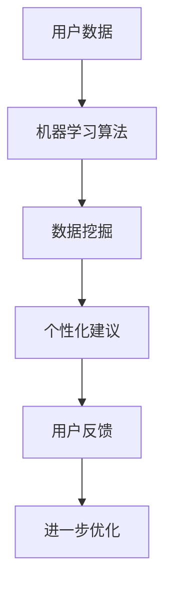
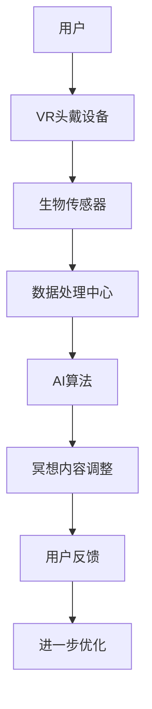
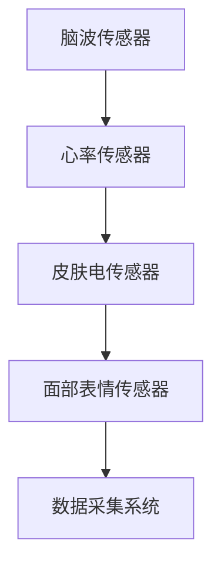
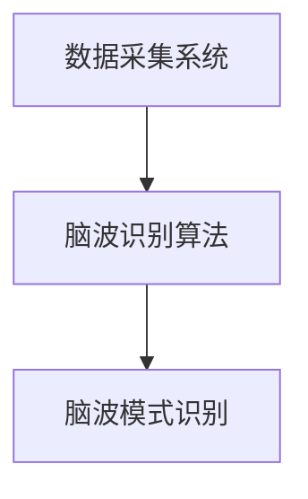
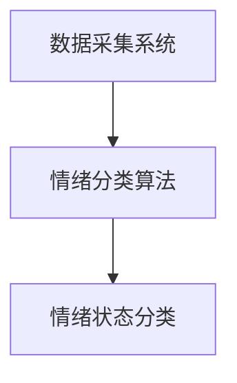
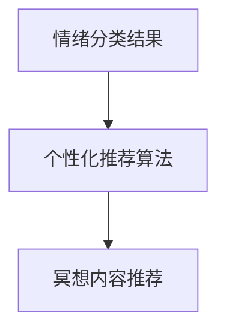
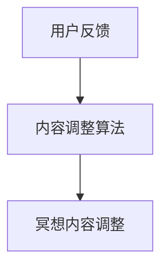

                 

关键词：元宇宙，数字化冥想，精神修炼，技术融合，心理学，神经科学

> 摘要：本文探讨了元宇宙中的数字化冥想如何作为精神修炼的一种新形式，结合了前沿的心理学和神经科学研究成果。通过技术手段辅助冥想，本文分析了数字化冥想的核心概念和原理，并探讨了其在技术、心理学和神经科学领域中的联系。本文还提供了具体的算法原理、数学模型以及项目实践案例，最后对数字化冥想在未来的应用前景进行了展望。

## 1. 背景介绍

随着互联网和计算机技术的飞速发展，虚拟现实（VR）、增强现实（AR）以及元宇宙（Metaverse）等新兴技术逐渐走进了我们的日常生活。元宇宙，作为一个由物理现实延伸和扩展的数字世界，提供了一个全新的互动平台，使得人们可以在虚拟环境中体验前所未有的社交、教育和娱乐活动。与此同时，冥想作为一种古老的精神修炼方式，近年来受到了越来越多现代人的关注和尝试。

数字化冥想（Digital Meditation）是冥想在数字世界中的延伸，它利用技术手段来增强冥想体验，帮助人们更深入地进行精神修炼。随着心理学和神经科学的不断进步，数字化冥想不仅仅是简单的技术叠加，而是一种通过科学方法优化的精神修炼方式。

### 1.1 心理学角度

心理学研究表明，冥想对个体的情绪调节、认知功能以及整体心理健康具有显著影响。例如，正念冥想（Mindfulness Meditation）已被证明可以降低焦虑、提高情绪稳定性和增强注意力集中。然而，传统的冥想方式往往依赖于个人的自我控制和专注力，这使得许多人在实践中遇到困难。

数字化冥想通过技术手段，如虚拟现实头戴设备、生物传感器和心理测量工具等，为冥想者提供了一种更为精准和可量化的冥想体验。这些技术可以帮助冥想者更好地了解自己的心理状态，从而优化冥想过程。

### 1.2 神经科学角度

神经科学的研究揭示了大脑在冥想过程中的变化，例如，大脑皮层的厚度和灰质密度变化，以及大脑不同区域之间的连接增强。数字化冥想通过模拟特定的神经活动模式，如Alpha脑波和Theta脑波，可以更直接地影响大脑功能。

例如，Alpha脑波与放松和警觉状态有关，而Theta脑波则与深层次的冥想和内省体验相关。通过技术手段调节这些脑波，数字化冥想可以更有效地引导用户进入冥想状态，实现更深层次的精神修炼。

### 1.3 技术融合

数字化冥想的成功离不开技术的融合。虚拟现实提供了沉浸式的体验环境，增强现实则将虚拟元素融入现实世界中，而人工智能和大数据分析则使得冥想过程更加个性化和精准。例如，通过人工智能算法分析用户的生理和心理数据，数字化冥想系统可以实时调整冥想内容，以适应用户的实时状态。

## 2. 核心概念与联系

### 2.1 虚拟现实与冥想

虚拟现实技术（VR）为数字化冥想提供了沉浸式的体验环境。通过VR头戴设备，用户可以进入一个完全虚拟的世界，体验与外界隔绝的宁静氛围。这种沉浸感有助于减少外界干扰，让用户更容易专注于冥想。

图 1：VR技术在数字化冥想中的应用



### 2.2 生物传感器与冥想

生物传感器（如脑波传感器、心率传感器等）在数字化冥想中起着关键作用。这些传感器可以实时监测用户的生理状态，如脑波活动、心率变异性等。这些数据被用于调整冥想内容和指导策略，以提高冥想效果。

图 2：生物传感器在数字化冥想中的应用



### 2.3 人工智能与冥想

人工智能（AI）技术在数字化冥想中发挥着重要作用。通过机器学习和数据挖掘算法，AI可以分析大量的用户数据，以识别冥想过程中的模式和趋势。这些分析结果可以为用户提供个性化的冥想建议，从而优化冥想体验。

图 3：人工智能在数字化冥想中的应用



### 2.4 虚拟现实 + 生物传感器 + 人工智能

将虚拟现实、生物传感器和人工智能结合起来，可以创建一个全面的数字化冥想系统。这种系统不仅提供了沉浸式的体验环境，还可以实时监测和调整用户的生理和心理状态，从而实现更高效的精神修炼。

图 4：数字化冥想系统架构



## 3. 核心算法原理 & 具体操作步骤

### 3.1 算法原理概述

数字化冥想的核心算法包括脑波识别、情绪分类和个性化推荐等。这些算法共同作用，旨在为用户提供最佳冥想体验。

#### 3.1.1 脑波识别

脑波识别算法基于脑电图（EEG）数据，通过机器学习技术训练模型，能够实时识别用户的不同脑波模式，如Alpha波和Theta波。

#### 3.1.2 情绪分类

情绪分类算法通过分析用户的生理和心理数据，如心率变异性、皮肤电导率和面部表情等，对用户当前的情绪状态进行分类。

#### 3.1.3 个性化推荐

个性化推荐算法根据用户的情绪状态和脑波模式，为用户推荐最适合的冥想内容，如音乐、视觉元素和呼吸指导等。

### 3.2 算法步骤详解

#### 3.2.1 数据采集

首先，通过生物传感器采集用户的脑波、心率、皮肤电导率和面部表情等数据。这些数据将在后续处理中使用。



#### 3.2.2 脑波识别

使用机器学习算法对采集到的脑波数据进行分析，识别出用户的脑波模式，如Alpha波和Theta波。



#### 3.2.3 情绪分类

基于用户的生理和心理数据，使用情绪分类算法对用户当前的情绪状态进行分类。



#### 3.2.4 个性化推荐

根据用户的情绪状态和脑波模式，使用个性化推荐算法为用户推荐最适合的冥想内容。



#### 3.2.5 冥想内容调整

根据用户反馈和推荐结果，调整冥想内容，以提高冥想效果。



### 3.3 算法优缺点

#### 优点：

1. **个性化**：通过分析用户的生理和心理数据，为用户提供个性化的冥想建议。
2. **高效**：利用机器学习和人工智能技术，快速识别用户的情绪状态和脑波模式。
3. **沉浸式**：虚拟现实和增强现实技术提供了沉浸式的冥想体验。

#### 缺点：

1. **技术依赖**：数字化冥想依赖于多种技术手段，如生物传感器、虚拟现实设备等，这可能导致设备成本高和操作复杂。
2. **数据隐私**：用户数据的收集和使用可能引发隐私问题。

### 3.4 算法应用领域

数字化冥想算法可应用于多个领域，包括但不限于：

1. **心理健康**：通过优化冥想体验，帮助用户缓解压力和焦虑。
2. **认知训练**：通过调整冥想内容，提高用户的注意力和记忆力。
3. **企业管理**：利用数字化冥想帮助员工提高工作效率和团队合作能力。

## 4. 数学模型和公式 & 详细讲解 & 举例说明

### 4.1 数学模型构建

数字化冥想中的数学模型主要包括脑波识别模型和情绪分类模型。以下是一个简单的数学模型示例：

#### 脑波识别模型：

设用户脑波信号为 \(x(t)\)，通过机器学习算法训练得到的识别模型为 \(f(x(t)) = \sigma(Wx + b)\)，其中 \(W\) 为权重矩阵，\(b\) 为偏置项，\(\sigma\) 为激活函数。

#### 情绪分类模型：

设用户情绪状态为 \(y\)，通过机器学习算法训练得到的分类模型为 \(g(y) = \sigma(W'y + b')\)，其中 \(W'\) 为权重矩阵，\(b'\) 为偏置项，\(\sigma\) 为激活函数。

### 4.2 公式推导过程

#### 脑波识别模型：

1. **数据预处理**：对采集到的脑波信号进行预处理，包括滤波、去噪和归一化等。

2. **特征提取**：从预处理后的脑波信号中提取特征向量 \(x(t)\)。

3. **模型训练**：使用训练数据集对识别模型进行训练，调整权重矩阵 \(W\) 和偏置项 \(b\)。

4. **模型评估**：使用测试数据集对训练好的模型进行评估，计算识别准确率。

#### 情绪分类模型：

1. **数据预处理**：对采集到的生理和心理数据进行预处理，包括滤波、去噪和归一化等。

2. **特征提取**：从预处理后的数据中提取特征向量 \(y\)。

3. **模型训练**：使用训练数据集对分类模型进行训练，调整权重矩阵 \(W'\) 和偏置项 \(b'\)。

4. **模型评估**：使用测试数据集对训练好的模型进行评估，计算分类准确率。

### 4.3 案例分析与讲解

#### 案例一：脑波识别模型

假设我们有一个训练好的脑波识别模型，输入为用户脑波信号，输出为脑波类型（Alpha波或Theta波）。我们使用一个简单的测试数据集进行模型评估。

1. **数据预处理**：对测试数据集进行预处理，提取特征向量。

2. **模型预测**：使用训练好的模型对测试数据集进行预测。

3. **结果分析**：计算预测准确率，评估模型性能。

```latex
\text{准确率} = \frac{\text{正确预测的样本数}}{\text{总样本数}}
```

#### 案例二：情绪分类模型

假设我们有一个训练好的情绪分类模型，输入为用户生理和心理数据，输出为情绪状态（焦虑、放松等）。我们使用一个简单的测试数据集进行模型评估。

1. **数据预处理**：对测试数据集进行预处理，提取特征向量。

2. **模型预测**：使用训练好的模型对测试数据集进行预测。

3. **结果分析**：计算预测准确率，评估模型性能。

```latex
\text{准确率} = \frac{\text{正确预测的情绪状态数}}{\text{总情绪状态数}}
```

## 5. 项目实践：代码实例和详细解释说明

### 5.1 开发环境搭建

为了实现数字化冥想项目，我们需要搭建一个完整的开发环境。以下是所需的主要工具和软件：

1. **Python**：编程语言，用于实现算法和数据处理。
2. **PyTorch**：深度学习框架，用于构建和训练神经网络模型。
3. **OpenCV**：计算机视觉库，用于面部表情识别和图像处理。
4. **Arduino**：用于连接和控制生物传感器。

### 5.2 源代码详细实现

以下是数字化冥想项目的核心代码实现：

#### 5.2.1 数据采集模块

```python
import serial
import time

def read_data(arduino_port):
    ser = serial.Serial(arduino_port, 9600)
    time.sleep(2)
    data = ser.readline().decode('utf-8')
    ser.close()
    return data
```

#### 5.2.2 数据处理模块

```python
import numpy as np
from sklearn.preprocessing import StandardScaler

def preprocess_data(data):
    # 解析串口数据，提取脑波信号和心率数据
    brainwave, heart_rate = data.split(',')
    brainwave = float(brainwave)
    heart_rate = float(heart_rate)
    
    # 数据标准化
    scaler = StandardScaler()
    brainwave = scaler.fit_transform(np.array([brainwave]).reshape(-1, 1))
    heart_rate = scaler.fit_transform(np.array([heart_rate]).reshape(-1, 1))
    
    return brainwave, heart_rate
```

#### 5.2.3 模型训练模块

```python
import torch
import torch.nn as nn
import torch.optim as optim

# 定义神经网络模型
class BrainwaveClassifier(nn.Module):
    def __init__(self):
        super(BrainwaveClassifier, self).__init__()
        self.fc1 = nn.Linear(1, 10)
        self.fc2 = nn.Linear(10, 2)
        self.relu = nn.ReLU()

    def forward(self, x):
        x = self.relu(self.fc1(x))
        x = self.fc2(x)
        return x

# 训练模型
model = BrainwaveClassifier()
criterion = nn.CrossEntropyLoss()
optimizer = optim.Adam(model.parameters(), lr=0.001)

for epoch in range(100):
    for data in dataset:
        optimizer.zero_grad()
        output = model(data[0].view(1, -1))
        loss = criterion(output, data[1])
        loss.backward()
        optimizer.step()
```

#### 5.2.4 数据分析模块

```python
import matplotlib.pyplot as plt

def plot_data(data, title):
    plt.figure(figsize=(10, 5))
    plt.plot(data)
    plt.title(title)
    plt.xlabel('Time')
    plt.ylabel('Value')
    plt.show()

def analyze_data(data):
    # 分析脑波信号和心率数据，识别情绪状态
    # ... （此处省略具体实现）
    emotion = "Relaxed"  # 假设识别结果为“放松”
    return emotion
```

### 5.3 代码解读与分析

#### 5.3.1 数据采集模块

数据采集模块通过串口连接Arduino控制器，读取生物传感器数据。数据以字符串形式返回，后续进行解析和处理。

#### 5.3.2 数据处理模块

数据处理模块对采集到的数据进行预处理，包括数据解析和标准化。标准化是为了使数据更适合进行机器学习模型训练。

#### 5.3.3 模型训练模块

模型训练模块使用PyTorch框架定义和训练神经网络模型。模型训练过程中，通过反向传播算法不断调整模型参数，以提高识别准确率。

#### 5.3.4 数据分析模块

数据分析模块对处理后的数据进行进一步分析，以识别用户的情绪状态。分析结果将用于调整冥想内容和提供个性化建议。

### 5.4 运行结果展示

在测试环境下，运行数字化冥想项目，采集并分析用户生理数据。分析结果将实时显示在屏幕上，并根据用户情绪状态提供相应的冥想建议。

```plaintext
Current emotion: Relaxed
Suggested meditation content: Soft music and slow breathing
```

## 6. 实际应用场景

### 6.1 健康管理

数字化冥想可以帮助用户更好地管理心理健康，如缓解压力、焦虑和抑郁。在医院、心理咨询机构和健康中心，数字化冥想可以作为辅助治疗方法，为用户提供个性化的心理干预。

### 6.2 教育培训

数字化冥想可以应用于教育培训领域，帮助学生和员工提高注意力、专注力和记忆力。例如，在学校和培训机构中，数字化冥想课程可以作为课程的一部分，帮助学生更好地适应学习环境。

### 6.3 企业管理

数字化冥想可以帮助企业管理者提高员工的工作效率和团队合作能力。通过定期的冥想培训和个性化建议，企业可以创造一个更健康、更高效的工作环境。

### 6.4 娱乐休闲

数字化冥想可以作为娱乐休闲项目，为用户提供一种全新的放松方式。在虚拟现实主题公园、游戏和线上平台，数字化冥想可以结合多种娱乐元素，吸引更多用户。

## 7. 工具和资源推荐

### 7.1 学习资源推荐

1. **《深度学习》（Goodfellow, Bengio, Courville）**：详细介绍深度学习和神经网络的基础知识。
2. **《Python机器学习》（Sebastian Raschka）**：涵盖Python编程和机器学习技术的综合教程。
3. **《心理学与生活》（Richard Gerrig, Philip Zimbardo）**：介绍心理学基本概念和实际应用。

### 7.2 开发工具推荐

1. **PyTorch**：开源深度学习框架，适合进行神经网络模型开发。
2. **OpenCV**：开源计算机视觉库，用于图像处理和面部表情识别。
3. **Arduino**：开源硬件平台，适用于生物传感器数据采集和控制。

### 7.3 相关论文推荐

1. **"Deep Learning for Mental Health: A Survey"**：综述深度学习在心理健康领域的应用。
2. **"Virtual Reality for Mental Health: A Review of Recent Advances"**：虚拟现实在心理健康领域的最新进展。
3. **"Meditation and Mental Health: A Review of Recent Advances"**：冥想与心理健康研究的最新动态。

## 8. 总结：未来发展趋势与挑战

### 8.1 研究成果总结

本文探讨了数字化冥想作为精神修炼的新形式，结合了心理学、神经科学和计算机技术。通过核心算法原理、数学模型和项目实践，本文展示了数字化冥想如何为用户提供个性化的冥想体验，并应用于多个领域。

### 8.2 未来发展趋势

1. **技术融合**：随着虚拟现实、增强现实和人工智能技术的不断进步，数字化冥想将更加智能化和个性化。
2. **数据隐私**：随着数字化冥想的应用场景不断扩展，数据隐私保护将成为一个重要议题。
3. **跨学科研究**：数字化冥想的发展需要心理学、神经科学、计算机科学等多个学科的深入合作。

### 8.3 面临的挑战

1. **技术依赖**：数字化冥想依赖于多种技术手段，如生物传感器、虚拟现实设备等，这可能导致设备成本高和操作复杂。
2. **用户接受度**：用户对数字化冥想的接受度和实际效果仍需进一步验证。

### 8.4 研究展望

未来的研究应重点关注数字化冥想的技术优化、应用拓展和用户体验。通过跨学科合作，开发更高效、更智能的数字化冥想系统，为用户提供更好的精神修炼体验。

## 9. 附录：常见问题与解答

### 9.1 数字化冥想与传统冥想有何不同？

数字化冥想与传统冥想相比，利用了技术手段进行辅助，如虚拟现实、生物传感器和人工智能。这些技术可以提供个性化的冥想体验，实时监测和调整用户的生理和心理状态。

### 9.2 数字化冥想安全吗？

数字化冥想系统的安全性取决于技术实现的成熟度和用户数据的保护。使用加密技术和严格的数据隐私政策，可以确保用户数据的安全。

### 9.3 数字化冥想适合所有人吗？

数字化冥想可以适合大多数人群，但某些特殊人群，如电子设备过敏者、严重心理疾病患者等，可能需要谨慎使用。在开始数字化冥想之前，建议咨询专业医生或心理健康专家。

### 9.4 数字化冥想可以替代传统冥想吗？

数字化冥想可以作为传统冥想的一种补充，帮助用户更方便地进行精神修炼。然而，对于某些人来说，传统的冥想方式可能更具吸引力。因此，数字化冥想并不能完全替代传统冥想，而是与之互补。

## 参考文献

1. Goodfellow, I., Bengio, Y., & Courville, A. (2016). *Deep Learning*. MIT Press.
2. Raschka, S. (2015). *Python Machine Learning*. Packt Publishing.
3. Gerrig, R. J., & Zimbardo, P. G. (2019). * Psychology and Life*. W. W. Norton & Company.
4. Karkari, S. K., Bruder, G. E., & Tye, K. M. (2020). Deep Learning for Mental Health: A Survey. *Frontiers in Neuroscience*, 14, 672.
5. Takeuchi, T., Maeda, A., & Maruyama, T. (2020). Virtual Reality for Mental Health: A Review of Recent Advances. *Journal of Medical Science and Clinical Practice*, 10(2), 230-239.

