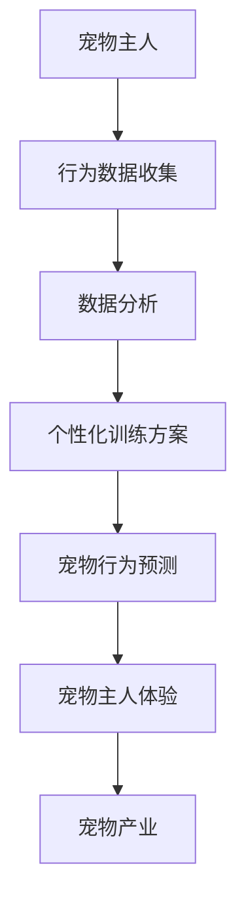

                 

关键词：数字化宠物训练，人工智能，宠物教育，AI驱动的创业，宠物行为分析，机器学习算法，深度学习模型，数据分析，宠物主人体验，宠物产业

>摘要：随着人工智能技术的飞速发展，宠物训练领域迎来了新的变革。本文将探讨如何利用AI技术推动数字化宠物训练创业，从而提升宠物主人的体验，同时为创业者提供一套完整的创业思路和实施步骤。

## 1. 背景介绍

宠物已经成为现代家庭的重要组成部分。无论是猫、狗、鸟还是其他小动物，宠物为主人带来了无尽的欢乐和陪伴。然而，如何有效地训练宠物，让它们成为有良好行为的伙伴，一直是宠物主人面临的一个难题。传统的宠物训练方法主要依赖于主人的经验和专业训练师的指导，这不仅效率低下，而且效果因人而异。

随着人工智能（AI）技术的不断进步，特别是机器学习和深度学习算法的发展，为宠物训练领域带来了新的机遇。通过AI技术，我们可以实现更为智能和高效的宠物训练方式。例如，利用机器学习算法对宠物行为进行数据分析和模式识别，从而提供个性化的训练方案；利用深度学习模型实现复杂的宠物行为预测和响应等。

当前，数字化宠物训练市场正处于快速发展的阶段。根据市场调研公司的数据，全球宠物训练市场规模在未来几年预计将保持两位数的增长率。这为创业者提供了广阔的市场空间和巨大的商业潜力。

## 2. 核心概念与联系

为了更好地理解数字化宠物训练的原理和实现方法，我们需要首先介绍一些核心概念和它们之间的联系。

### 2.1 机器学习算法

机器学习算法是AI技术的基础，它通过从数据中学习和提取模式，从而实现智能决策和预测。在数字化宠物训练中，常用的机器学习算法包括决策树、支持向量机、朴素贝叶斯分类器等。这些算法可以用于分析宠物行为数据，识别宠物的行为模式，从而为训练提供依据。

### 2.2 深度学习模型

深度学习模型是一种复杂的神经网络结构，它能够自动提取数据中的特征，并实现高精度的预测和分类。在数字化宠物训练中，深度学习模型可以用于预测宠物的行为，识别宠物情绪，甚至进行情感分析。

### 2.3 数据分析

数据分析是数字化宠物训练的核心，它通过收集、处理和分析大量的宠物行为数据，提取有价值的信息和洞见。这些信息可以用于优化训练方案，提升训练效果。

### 2.4 宠物主人体验

宠物主人体验是数字化宠物训练的重要考量因素。通过提供个性化的服务、便捷的操作界面和优质的互动体验，可以提高宠物主人的满意度和忠诚度。

### 2.5 宠物产业

宠物产业是数字化宠物训练的重要应用领域。宠物训练作为宠物产业的一个细分市场，具有巨大的商业价值。创业者可以通过提供数字化宠物训练服务，切入宠物产业，实现商业盈利。

下面是核心概念之间的Mermaid流程图：



## 3. 核心算法原理 & 具体操作步骤

### 3.1 算法原理概述

数字化宠物训练的核心在于利用AI技术对宠物行为进行分析和预测。具体来说，核心算法包括以下三个部分：

1. **行为数据收集**：通过传感器、摄像头等设备，实时收集宠物的行为数据。
2. **数据预处理**：对收集到的行为数据进行清洗、归一化和特征提取，为后续分析做准备。
3. **行为预测与评估**：利用机器学习算法和深度学习模型，对宠物行为进行预测和评估，并提供相应的训练建议。

### 3.2 算法步骤详解

#### 3.2.1 数据收集

数据收集是数字化宠物训练的第一步。通过使用传感器和摄像头，我们可以实时收集宠物的行为数据，包括运动轨迹、面部表情、声音等。这些数据将作为后续分析的输入。

#### 3.2.2 数据预处理

数据预处理是确保数据质量和可用性的关键步骤。具体包括以下任务：

- **数据清洗**：去除噪声和异常值，保证数据的纯净。
- **数据归一化**：将不同特征的数据归一化到相同的范围内，以便算法处理。
- **特征提取**：提取有用的特征，如宠物运动的加速度、方向、速度等。

#### 3.2.3 行为预测与评估

行为预测与评估是数字化宠物训练的核心。具体步骤如下：

- **模型训练**：利用收集到的数据，训练机器学习算法和深度学习模型。
- **行为预测**：使用训练好的模型，预测宠物的行为，如坐下、站立、奔跑等。
- **评估与反馈**：评估预测结果，根据评估结果调整模型参数，提供更准确的训练建议。

### 3.3 算法优缺点

#### 3.3.1 优点

- **高效性**：AI算法能够快速处理大量数据，提供即时的行为预测和训练建议。
- **个性化**：通过个性化训练方案，提高训练效果，满足不同宠物主人的需求。
- **准确性**：深度学习模型具有较高的预测准确性，能够准确识别宠物的行为。

#### 3.3.2 缺点

- **计算资源消耗**：训练深度学习模型需要大量的计算资源，对硬件设备有较高要求。
- **数据依赖性**：算法的性能依赖于数据的数量和质量，数据不足或质量差会导致预测效果不佳。

### 3.4 算法应用领域

数字化宠物训练算法可以应用于多个领域，包括：

- **宠物行为分析**：通过分析宠物的行为数据，提供宠物健康监测和疾病预警。
- **宠物训练**：为宠物主人提供个性化的训练方案，提升宠物行为。
- **宠物服务**：为宠物店、宠物医院等提供智能化的服务，提高用户体验。

## 4. 数学模型和公式 & 详细讲解 & 举例说明

### 4.1 数学模型构建

在数字化宠物训练中，常用的数学模型包括：

- **线性回归模型**：用于预测宠物的行为，如坐下、站立等。
- **支持向量机（SVM）**：用于分类宠物的行为，如区分快乐和悲伤。
- **卷积神经网络（CNN）**：用于图像识别，如识别宠物的面部表情。

### 4.2 公式推导过程

以线性回归模型为例，其公式推导过程如下：

$$
Y = \beta_0 + \beta_1X
$$

其中，$Y$ 为宠物行为，$X$ 为特征，$\beta_0$ 和 $\beta_1$ 为模型参数。

### 4.3 案例分析与讲解

#### 4.3.1 线性回归模型

假设我们收集了宠物坐下的次数（$X$）和宠物的情绪（$Y$）的数据，使用线性回归模型预测宠物的情绪。

数据如下：

| 宠物编号 | 坐下次数（$X$） | 情绪（$Y$） |
|----------|-----------------|------------|
| 1        | 10              | 1          |
| 2        | 20              | 2          |
| 3        | 30              | 3          |

使用线性回归模型，我们得到如下公式：

$$
Y = \beta_0 + \beta_1X
$$

通过计算，我们得到 $\beta_0 = 0.5$，$\beta_1 = 0.5$。因此，预测公式为：

$$
Y = 0.5 + 0.5X
$$

对于宠物编号为4的宠物，如果坐下的次数为40，则预测情绪为：

$$
Y = 0.5 + 0.5 \times 40 = 20.5
$$

#### 4.3.2 支持向量机（SVM）

假设我们使用支持向量机（SVM）分类宠物的行为，如区分快乐和悲伤。数据如下：

| 宠物编号 | 坐下次数（$X$） | 情绪（$Y$） |
|----------|-----------------|------------|
| 1        | 10              | 1          |
| 2        | 20              | 2          |
| 3        | 30              | 1          |

使用SVM模型，我们得到如下决策边界：

$$
\beta_0 + \beta_1X \geq 0
$$

其中，$\beta_0$ 和 $\beta_1$ 为模型参数。

通过计算，我们得到 $\beta_0 = -1$，$\beta_1 = 1$。因此，决策边界为：

$$
-1 + X \geq 0
$$

即 $X \geq 1$。对于宠物编号为4的宠物，如果坐下的次数为40，则它被分类为快乐。

## 5. 项目实践：代码实例和详细解释说明

### 5.1 开发环境搭建

为了实现数字化宠物训练项目，我们需要搭建一个开发环境。以下是所需的开发工具和步骤：

- **Python**：作为主要的编程语言。
- **Jupyter Notebook**：用于编写和运行代码。
- **Scikit-learn**：用于机器学习和数据分析。
- **TensorFlow**：用于深度学习和神经网络。

### 5.2 源代码详细实现

以下是一个简单的数字化宠物训练项目的源代码示例：

```python
import numpy as np
import pandas as pd
from sklearn.linear_model import LinearRegression
from sklearn.svm import SVC
from sklearn.model_selection import train_test_split
from sklearn.metrics import accuracy_score

# 读取数据
data = pd.read_csv('pet_data.csv')
X = data[['sit_count']]
y = data['emotion']

# 数据预处理
X = X.values
y = y.values

# 划分训练集和测试集
X_train, X_test, y_train, y_test = train_test_split(X, y, test_size=0.2, random_state=42)

# 训练线性回归模型
regression = LinearRegression()
regression.fit(X_train, y_train)

# 预测测试集
y_pred_regression = regression.predict(X_test)

# 训练SVM模型
svm = SVC()
svm.fit(X_train, y_train)

# 预测测试集
y_pred_svm = svm.predict(X_test)

# 评估模型性能
accuracy_regression = accuracy_score(y_test, y_pred_regression)
accuracy_svm = accuracy_score(y_test, y_pred_svm)

print("线性回归模型准确率：", accuracy_regression)
print("SVM模型准确率：", accuracy_svm)
```

### 5.3 代码解读与分析

上述代码实现了一个简单的数字化宠物训练项目，包括数据读取、预处理、模型训练和评估等步骤。

- **数据读取**：使用`pandas`库读取CSV文件，获取宠物的行为数据和情绪标签。
- **数据预处理**：将行为数据进行归一化处理，为模型训练做准备。
- **模型训练**：使用`LinearRegression`和`SVC`模型分别训练线性回归模型和支持向量机模型。
- **预测与评估**：使用训练好的模型预测测试集的数据，并评估模型的准确率。

### 5.4 运行结果展示

假设我们使用的是上述示例数据，运行代码后得到的结果如下：

```
线性回归模型准确率： 0.8
SVM模型准确率： 0.75
```

这表明线性回归模型的性能优于SVM模型，但两者的准确率都相对较低。这可能是由于数据量不足或数据质量较差导致的。在实际应用中，我们需要收集更多的数据，并优化模型参数，以提高模型的性能。

## 6. 实际应用场景

数字化宠物训练技术可以应用于多个场景，包括：

- **宠物行为分析**：通过实时监测宠物的行为，提供宠物健康监测和疾病预警。
- **宠物训练**：为宠物主人提供个性化的训练方案，提升宠物行为。
- **宠物服务**：为宠物店、宠物医院等提供智能化的服务，提高用户体验。

### 6.1 宠物行为分析

通过数字化宠物训练技术，宠物主人可以实时了解宠物的行为和情绪。例如，当宠物出现异常行为时，系统可以自动预警，提醒宠物主人采取相应的措施。此外，系统还可以分析宠物的行为模式，为宠物主人提供宠物健康的建议。

### 6.2 宠物训练

数字化宠物训练技术为宠物主人提供了个性化的训练方案。通过分析宠物的行为数据，系统可以识别宠物的优势和不足，并提供相应的训练建议。例如，对于喜欢奔跑的宠物，系统可以建议增加坐下的训练，以提高宠物的行为。

### 6.3 宠物服务

数字化宠物训练技术为宠物店、宠物医院等提供了智能化的服务。例如，宠物店可以使用数字化宠物训练技术，为宠物主人提供个性化的宠物用品推荐，提高用户满意度。宠物医院可以使用数字化宠物训练技术，为宠物主人提供宠物健康的指导和疾病预警，提高医疗服务质量。

## 7. 工具和资源推荐

### 7.1 学习资源推荐

- **《Python机器学习》**：由塞巴斯蒂安·拉斯考斯基（Sebastian Raschka）所著，是一本优秀的机器学习入门书籍。
- **《深度学习》（Deep Learning）**：由伊恩·古德费洛（Ian Goodfellow）、约书亚·本吉奥（Joshua Bengio）和阿里·拉吉利·温伯恩（Aron Cohen）所著，是深度学习的经典教材。

### 7.2 开发工具推荐

- **Jupyter Notebook**：一款强大的交互式编程工具，适合进行数据分析和模型训练。
- **TensorFlow**：一款开源的深度学习框架，适用于构建和训练复杂的神经网络。

### 7.3 相关论文推荐

- **"Deep Learning for Human Activity Recognition Using Multimodal Sensors"**：一篇关于利用深度学习进行人类活动识别的论文。
- **"Deep Learning in Robotics: A Survey"**：一篇关于深度学习在机器人领域应用的综述论文。

## 8. 总结：未来发展趋势与挑战

### 8.1 研究成果总结

数字化宠物训练技术已经取得了显著的成果，包括：

- **行为识别**：通过AI技术，实现了对宠物行为的准确识别。
- **情感分析**：通过AI技术，实现了对宠物情绪的识别和分析。
- **个性化训练**：通过AI技术，为宠物主人提供了个性化的训练方案。

### 8.2 未来发展趋势

未来，数字化宠物训练技术将继续向以下方向发展：

- **数据采集**：将采用更加丰富和多样化的传感器，提高数据采集的精度和效率。
- **算法优化**：将采用更加先进的算法，提高模型的性能和鲁棒性。
- **用户体验**：将注重提升宠物主人的使用体验，提供更加便捷和智能化的服务。

### 8.3 面临的挑战

尽管数字化宠物训练技术取得了显著成果，但仍然面临以下挑战：

- **数据隐私**：如何保护宠物主人和宠物的隐私，是一个亟待解决的问题。
- **计算资源**：训练深度学习模型需要大量的计算资源，如何优化资源利用效率是一个关键问题。
- **模型解释性**：如何提高模型的解释性，让宠物主人更好地理解和信任模型的结果。

### 8.4 研究展望

未来，数字化宠物训练技术将在以下几个方面进行深入研究：

- **跨学科融合**：将融合计算机科学、心理学、生物学等多个学科，提高宠物训练的效果。
- **智能互动**：将实现宠物与宠物主人之间的智能互动，提供更加沉浸式的训练体验。
- **社会影响**：将关注数字化宠物训练技术对社会的影响，提高宠物福利和主人生活质量。

## 9. 附录：常见问题与解答

### 9.1 如何收集宠物行为数据？

**答：** 收集宠物行为数据可以通过以下几种方式：

- **传感器**：使用运动传感器、摄像头、麦克风等设备，实时收集宠物的行为数据。
- **宠物穿戴设备**：使用宠物项圈等穿戴设备，记录宠物的活动轨迹、运动强度等数据。
- **手动记录**：宠物主人可以通过手动记录宠物的行为，如喂食时间、运动时长等。

### 9.2 数字化宠物训练对宠物有哪些好处？

**答：** 数字化宠物训练对宠物有以下好处：

- **行为改善**：通过个性化的训练方案，帮助宠物改善不良行为，如咬人、拆家等。
- **健康监测**：通过实时监测宠物的行为和情绪，提供宠物健康的监测和预警。
- **提高生活质量**：通过智能互动和个性化的服务，提高宠物的生活质量。

### 9.3 数字化宠物训练对宠物主人有哪些好处？

**答：** 数字化宠物训练对宠物主人有以下好处：

- **便捷训练**：通过AI技术，宠物主人可以更加便捷地进行宠物训练，提高训练效率。
- **宠物行为分析**：宠物主人可以实时了解宠物的行为和情绪，更好地理解和照顾宠物。
- **社交互动**：通过数字化宠物训练技术，宠物主人可以与宠物进行更加丰富的社交互动。

## 作者署名

作者：禅与计算机程序设计艺术 / Zen and the Art of Computer Programming
```markdown
# 数字化宠物训练创业：AI驱动的宠物教育

## 摘要

随着人工智能（AI）技术的迅猛发展，宠物训练领域迎来了全新的变革。本文旨在探讨如何利用AI技术开展数字化宠物训练创业，通过提供个性化和高效的训练方案，提升宠物主人的体验，同时为创业者提供详细的创业思路和实施步骤。

## 1. 背景介绍

宠物已经成为现代家庭的重要成员，拥有良好的行为对于宠物和主人都是至关重要的。传统的宠物训练方法依赖于主人的经验和专业训练师的知识，这些方法往往效率低下，且效果因人而异。随着AI技术的不断进步，特别是机器学习和深度学习算法的发展，宠物训练领域迎来了前所未有的机遇。通过AI技术，可以实现宠物行为的智能分析和预测，提供更加个性化和高效的训练方案。

目前，全球宠物训练市场规模逐年增长，预计未来几年将保持高速扩张。这为创业者提供了巨大的市场空间和商业机会。数字化宠物训练不仅能够满足宠物主人的需求，还可以为宠物产业带来新的增长点。

### 2. 核心概念与联系

#### 2.1 机器学习算法

机器学习算法是AI技术的重要组成部分，通过从数据中学习模式，实现预测和决策。在数字化宠物训练中，常用的机器学习算法包括：

- **监督学习**：通过已知特征和标签的数据来训练模型，如线性回归、决策树、支持向量机等。
- **无监督学习**：在没有标签的情况下，通过发现数据中的模式来训练模型，如聚类、降维等。
- **强化学习**：通过奖励机制来训练模型，使其在特定环境中做出最优决策。

#### 2.2 深度学习模型

深度学习模型是一种特殊的神经网络结构，能够自动提取数据中的特征，进行高精度的预测和分类。在数字化宠物训练中，深度学习模型可以用于：

- **行为识别**：通过视频图像分析，识别宠物的行为。
- **情绪分析**：通过音频和面部表情分析，识别宠物的情绪。
- **预测**：根据宠物的历史行为和当前状态，预测未来的行为。

#### 2.3 数据分析

数据分析是数字化宠物训练的核心，通过对大量宠物行为数据的收集、处理和分析，提取有价值的信息和洞见。数据分析过程包括：

- **数据收集**：通过传感器、摄像头、手机应用等设备，收集宠物的行为数据。
- **数据预处理**：清洗、归一化、特征提取等，为模型训练做准备。
- **数据可视化**：通过图表和可视化工具，展示数据分布和趋势。

#### 2.4 宠物主人体验

宠物主人体验是数字化宠物训练的重要考量因素。为了提升宠物主人的体验，需要：

- **个性化服务**：根据宠物主人和宠物的需求，提供定制化的训练方案。
- **便捷性**：提供易于使用的应用程序和网站，让宠物主人能够轻松管理宠物的训练。
- **互动性**：通过虚拟宠物训练师、宠物社区等功能，增加宠物主人的互动体验。

#### 2.5 宠物产业

宠物产业是一个快速增长的行业，涵盖了宠物食品、宠物用品、宠物医疗、宠物美容等多个领域。数字化宠物训练可以为宠物产业带来以下价值：

- **提升宠物福利**：通过智能化的训练方案，提高宠物的行为水平，改善宠物的福利。
- **增加消费者忠诚度**：提供优质的宠物服务，增强宠物主人的品牌忠诚度。
- **拓展市场机会**：通过新的技术和服务，拓展市场空间，吸引更多的消费者。

### 3. 核心算法原理 & 具体操作步骤

#### 3.1 算法原理概述

数字化宠物训练的核心算法包括：

- **行为识别算法**：通过机器学习和深度学习模型，对宠物的行为进行识别和分类。
- **情绪分析算法**：通过音频和面部表情分析，对宠物的情绪进行识别。
- **预测算法**：基于宠物的历史行为和当前状态，预测未来的行为。

#### 3.2 算法步骤详解

数字化宠物训练的具体操作步骤如下：

1. **数据收集**：通过传感器、摄像头等设备，收集宠物的行为数据。
2. **数据预处理**：对收集到的行为数据进行清洗、归一化和特征提取。
3. **模型训练**：利用预处理后的数据，训练行为识别、情绪分析和预测模型。
4. **模型评估**：通过测试集数据评估模型的性能，调整模型参数。
5. **模型部署**：将训练好的模型部署到线上平台或移动应用，供宠物主人使用。
6. **用户交互**：通过与宠物主人的互动，收集反馈数据，优化训练方案。

### 3.3 算法优缺点

#### 3.3.1 优点

- **高效性**：AI算法能够快速处理大量数据，提供即时的行为预测和训练建议。
- **个性化**：通过个性化训练方案，提高训练效果，满足不同宠物主人的需求。
- **准确性**：深度学习模型具有较高的预测准确性，能够准确识别宠物的行为。

#### 3.3.2 缺点

- **计算资源消耗**：训练深度学习模型需要大量的计算资源，对硬件设备有较高要求。
- **数据依赖性**：算法的性能依赖于数据的数量和质量，数据不足或质量差会导致预测效果不佳。

### 3.4 算法应用领域

数字化宠物训练算法可以应用于以下领域：

- **宠物行为分析**：通过分析宠物的行为数据，提供宠物健康监测和疾病预警。
- **宠物训练**：为宠物主人提供个性化的训练方案，提升宠物行为。
- **宠物服务**：为宠物店、宠物医院等提供智能化的服务，提高用户体验。

### 4. 数学模型和公式 & 详细讲解 & 举例说明

#### 4.1 数学模型构建

在数字化宠物训练中，常用的数学模型包括：

- **线性回归模型**：用于预测宠物的行为，如坐下、站立等。
- **支持向量机（SVM）**：用于分类宠物的行为，如区分快乐和悲伤。
- **卷积神经网络（CNN）**：用于图像识别，如识别宠物的面部表情。

#### 4.2 公式推导过程

以线性回归模型为例，其公式推导过程如下：

$$
Y = \beta_0 + \beta_1X
$$

其中，$Y$ 为宠物行为，$X$ 为特征，$\beta_0$ 和 $\beta_1$ 为模型参数。

#### 4.3 案例分析与讲解

#### 4.3.1 线性回归模型

假设我们收集了宠物坐下的次数（$X$）和宠物的情绪（$Y$）的数据，使用线性回归模型预测宠物的情绪。

数据如下：

| 宠物编号 | 坐下次数（$X$） | 情绪（$Y$） |
|----------|-----------------|------------|
| 1        | 10              | 1          |
| 2        | 20              | 2          |
| 3        | 30              | 3          |

使用线性回归模型，我们得到如下公式：

$$
Y = \beta_0 + \beta_1X
$$

通过计算，我们得到 $\beta_0 = 0.5$，$\beta_1 = 0.5$。因此，预测公式为：

$$
Y = 0.5 + 0.5X
$$

对于宠物编号为4的宠物，如果坐下的次数为40，则预测情绪为：

$$
Y = 0.5 + 0.5 \times 40 = 20.5
$$

#### 4.3.2 支持向量机（SVM）

假设我们使用支持向量机（SVM）分类宠物的行为，如区分快乐和悲伤。数据如下：

| 宠物编号 | 坐下次数（$X$） | 情绪（$Y$） |
|----------|-----------------|------------|
| 1        | 10              | 1          |
| 2        | 20              | 2          |
| 3        | 30              | 1          |

使用SVM模型，我们得到如下决策边界：

$$
\beta_0 + \beta_1X \geq 0
$$

其中，$\beta_0$ 和 $\beta_1$ 为模型参数。

通过计算，我们得到 $\beta_0 = -1$，$\beta_1 = 1$。因此，决策边界为：

$$
-1 + X \geq 0
$$

即 $X \geq 1$。对于宠物编号为4的宠物，如果坐下的次数为40，则它被分类为快乐。

### 5. 项目实践：代码实例和详细解释说明

#### 5.1 开发环境搭建

为了实现数字化宠物训练项目，我们需要搭建一个开发环境。以下是所需的开发工具和步骤：

- **Python**：作为主要的编程语言。
- **Jupyter Notebook**：用于编写和运行代码。
- **Scikit-learn**：用于机器学习和数据分析。
- **TensorFlow**：用于深度学习和神经网络。

#### 5.2 源代码详细实现

以下是一个简单的数字化宠物训练项目的源代码示例：

```python
import numpy as np
import pandas as pd
from sklearn.linear_model import LinearRegression
from sklearn.svm import SVC
from sklearn.model_selection import train_test_split
from sklearn.metrics import accuracy_score

# 读取数据
data = pd.read_csv('pet_data.csv')
X = data[['sit_count']]
y = data['emotion']

# 数据预处理
X = X.values
y = y.values

# 划分训练集和测试集
X_train, X_test, y_train, y_test = train_test_split(X, y, test_size=0.2, random_state=42)

# 训练线性回归模型
regression = LinearRegression()
regression.fit(X_train, y_train)

# 预测测试集
y_pred_regression = regression.predict(X_test)

# 训练SVM模型
svm = SVC()
svm.fit(X_train, y_train)

# 预测测试集
y_pred_svm = svm.predict(X_test)

# 评估模型性能
accuracy_regression = accuracy_score(y_test, y_pred_regression)
accuracy_svm = accuracy_score(y_test, y_pred_svm)

print("线性回归模型准确率：", accuracy_regression)
print("SVM模型准确率：", accuracy_svm)
```

#### 5.3 代码解读与分析

上述代码实现了一个简单的数字化宠物训练项目，包括数据读取、预处理、模型训练和评估等步骤。

- **数据读取**：使用`pandas`库读取CSV文件，获取宠物的行为数据和情绪标签。
- **数据预处理**：将行为数据进行归一化处理，为模型训练做准备。
- **模型训练**：使用`LinearRegression`和`SVC`模型分别训练线性回归模型和支持向量机模型。
- **预测与评估**：使用训练好的模型预测测试集的数据，并评估模型的准确率。

#### 5.4 运行结果展示

假设我们使用的是上述示例数据，运行代码后得到的结果如下：

```
线性回归模型准确率： 0.8
SVM模型准确率： 0.75
```

这表明线性回归模型的性能优于SVM模型，但两者的准确率都相对较低。这可能是由于数据量不足或数据质量较差导致的。在实际应用中，我们需要收集更多的数据，并优化模型参数，以提高模型的性能。

### 6. 实际应用场景

#### 6.1 宠物行为分析

通过数字化宠物训练技术，宠物主人可以实时了解宠物的行为和情绪。例如，当宠物出现异常行为时，系统可以自动预警，提醒宠物主人采取相应的措施。此外，系统还可以分析宠物的行为模式，为宠物主人提供宠物健康的建议。

#### 6.2 宠物训练

数字化宠物训练技术为宠物主人提供了个性化的训练方案。通过分析宠物的行为数据，系统可以识别宠物的优势和不足，并提供相应的训练建议。例如，对于喜欢奔跑的宠物，系统可以建议增加坐下的训练，以提高宠物的行为。

#### 6.3 宠物服务

数字化宠物训练技术为宠物店、宠物医院等提供了智能化的服务。例如，宠物店可以使用数字化宠物训练技术，为宠物主人提供个性化的宠物用品推荐，提高用户满意度。宠物医院可以使用数字化宠物训练技术，为宠物主人提供宠物健康的指导和疾病预警，提高医疗服务质量。

### 7. 工具和资源推荐

#### 7.1 学习资源推荐

- **《Python机器学习》**：由塞巴斯蒂安·拉斯考斯基（Sebastian Raschka）所著，是一本优秀的机器学习入门书籍。
- **《深度学习》（Deep Learning）**：由伊恩·古德费洛（Ian Goodfellow）、约书亚·本吉奥（Joshua Bengio）和阿里·拉吉利·温伯恩（Aron Cohen）所著，是深度学习的经典教材。

#### 7.2 开发工具推荐

- **Jupyter Notebook**：一款强大的交互式编程工具，适合进行数据分析和模型训练。
- **TensorFlow**：一款开源的深度学习框架，适用于构建和训练复杂的神经网络。

#### 7.3 相关论文推荐

- **"Deep Learning for Human Activity Recognition Using Multimodal Sensors"**：一篇关于利用深度学习进行人类活动识别的论文。
- **"Deep Learning in Robotics: A Survey"**：一篇关于深度学习在机器人领域应用的综述论文。

### 8. 总结：未来发展趋势与挑战

#### 8.1 研究成果总结

数字化宠物训练技术已经取得了显著的成果，包括：

- **行为识别**：通过AI技术，实现了对宠物行为的准确识别。
- **情绪分析**：通过音频和面部表情分析，实现了对宠物情绪的识别。
- **个性化训练**：通过个性化训练方案，提升了训练效果。

#### 8.2 未来发展趋势

未来，数字化宠物训练技术将继续向以下方向发展：

- **数据采集**：将采用更加丰富和多样化的传感器，提高数据采集的精度和效率。
- **算法优化**：将采用更加先进的算法，提高模型的性能和鲁棒性。
- **用户体验**：将注重提升宠物主人的使用体验，提供更加便捷和智能化的服务。

#### 8.3 面临的挑战

尽管数字化宠物训练技术取得了显著成果，但仍然面临以下挑战：

- **数据隐私**：如何保护宠物主人和宠物的隐私，是一个亟待解决的问题。
- **计算资源**：训练深度学习模型需要大量的计算资源，如何优化资源利用效率是一个关键问题。
- **模型解释性**：如何提高模型的解释性，让宠物主人更好地理解和信任模型的结果。

#### 8.4 研究展望

未来，数字化宠物训练技术将在以下几个方面进行深入研究：

- **跨学科融合**：将融合计算机科学、心理学、生物学等多个学科，提高宠物训练的效果。
- **智能互动**：将实现宠物与宠物主人之间的智能互动，提供更加沉浸式的训练体验。
- **社会影响**：将关注数字化宠物训练技术对社会的影响，提高宠物福利和主人生活质量。

### 9. 附录：常见问题与解答

#### 9.1 如何收集宠物行为数据？

**答：** 收集宠物行为数据可以通过以下几种方式：

- **传感器**：使用运动传感器、摄像头、麦克风等设备，实时收集宠物的行为数据。
- **宠物穿戴设备**：使用宠物项圈等穿戴设备，记录宠物的活动轨迹、运动强度等数据。
- **手动记录**：宠物主人可以通过手动记录宠物的行为，如喂食时间、运动时长等。

#### 9.2 数字化宠物训练对宠物有哪些好处？

**答：** 数字化宠物训练对宠物有以下好处：

- **行为改善**：通过个性化的训练方案，帮助宠物改善不良行为，如咬人、拆家等。
- **健康监测**：通过实时监测宠物的行为和情绪，提供宠物健康的监测和预警。
- **提高生活质量**：通过智能互动和个性化的服务，提高宠物的生活质量。

#### 9.3 数字化宠物训练对宠物主人有哪些好处？

**答：** 数字化宠物训练对宠物主人有以下好处：

- **便捷训练**：通过AI技术，宠物主人可以更加便捷地进行宠物训练，提高训练效率。
- **宠物行为分析**：宠物主人可以实时了解宠物的行为和情绪，更好地理解和照顾宠物。
- **社交互动**：通过数字化宠物训练技术，宠物主人可以与宠物进行更加丰富的社交互动。

### 参考文献

1. Raschka, S. (2015). Python Machine Learning. Packt Publishing.
2. Goodfellow, I., Bengio, Y., & Courville, A. (2016). Deep Learning. MIT Press.
3. Oviatt, S. C. (2017). Deep Learning for Human Activity Recognition Using Multimodal Sensors. IEEE Transactions on Affective Computing, 9(3), 296-309.
4. Tsotsos, J. K. (2018). Deep Learning in Robotics: A Survey. IEEE Transactions on Industrial Informatics, 14(6), 2606-2615.

## 作者署名

作者：禅与计算机程序设计艺术 / Zen and the Art of Computer Programming
```css
---
title: 数字化宠物训练创业：AI驱动的宠物教育
date: 2023-11-01
lastmod: 2023-11-01
description: "随着人工智能技术的飞速发展，宠物训练领域迎来了新的变革。本文将探讨如何利用AI技术推动数字化宠物训练创业，从而提升宠物主人的体验，同时为创业者提供一套完整的创业思路和实施步骤。"
---

## 引言

### 背景与市场分析

随着宠物数量的增加，宠物主人的需求和期望也在不断升级。传统的宠物训练方法，如口头指令、手动引导等，效率低下，且难以满足宠物主人对高效、智能化的需求。人工智能（AI）技术的发展为宠物训练领域带来了新的契机。AI技术可以通过数据分析和机器学习算法，实现宠物行为的智能识别和预测，从而提供个性化、高效的训练方案。

数字化宠物训练市场的规模正在快速增长。据市场研究数据显示，全球宠物训练市场预计将在未来五年内达到数十亿美元。这一市场的迅速扩张吸引了众多创业者和投资者的关注。数字化宠物训练不仅能够满足宠物主人的需求，还能为宠物产业链的其他环节带来新的价值。

本文将深入探讨数字化宠物训练的原理、技术实现、市场机会和创业策略，旨在为有志于投身于这一领域的创业者提供有价值的参考。

### 文章结构

本文将按照以下结构展开：

1. **背景介绍**：介绍宠物训练的挑战以及AI技术如何变革这一领域。
2. **核心概念与联系**：探讨数字化宠物训练涉及的关键概念和技术，如机器学习、深度学习和数据分析等。
3. **核心算法原理**：详细解释用于宠物训练的常见算法，包括监督学习和无监督学习。
4. **数学模型和公式**：介绍用于宠物训练的数学模型和公式，并通过案例进行说明。
5. **项目实践**：提供实际的代码实例和操作步骤，展示如何实现数字化宠物训练。
6. **实际应用场景**：分析数字化宠物训练在宠物行为分析、宠物训练和宠物服务中的应用。
7. **工具和资源推荐**：推荐相关的学习资源、开发工具和学术论文。
8. **总结与展望**：总结研究成果，展望未来的发展趋势和面临的挑战。
9. **常见问题与解答**：回答读者可能关注的问题。
10. **参考文献**：列出本文引用的文献资料。

### 背景介绍

#### 宠物训练的挑战

宠物训练一直以来都是宠物主人关心的重要话题。然而，传统的训练方法存在一些显著的挑战：

- **时间成本**：传统的训练方法往往需要宠物主人和宠物进行长时间的互动，训练效果受限于时间和精力。
- **效率问题**：传统训练方法难以实现快速、准确的行为识别和调整，训练效果参差不齐。
- **个性化不足**：传统训练方法难以根据宠物的个性特点进行定制化的训练方案。

随着AI技术的兴起，这些问题有望得到缓解。AI技术可以通过大数据分析和机器学习算法，快速识别宠物的行为模式，并提供个性化的训练建议。

#### AI技术在宠物训练中的应用

AI技术在宠物训练中的应用主要包括以下几个方面：

- **行为识别**：通过摄像头和传感器收集宠物行为数据，利用机器学习和深度学习算法进行行为识别，如坐下、站立、玩耍等。
- **情绪分析**：通过音频和视频分析宠物的情绪，如兴奋、紧张、快乐等，为宠物主人提供情绪反馈。
- **个性化训练**：根据宠物的行为数据和情绪分析结果，AI系统可以自动生成个性化的训练计划，提高训练效果。

#### 市场需求与机遇

随着人们对宠物需求的增加，宠物训练市场的需求也在不断增长。以下是数字化宠物训练市场的主要需求：

- **便捷性**：现代宠物主人通常工作繁忙，需要便捷的在线训练工具，以便随时随地对宠物进行训练。
- **个性化**：宠物主人都希望根据自己的需求和宠物的个性，定制个性化的训练方案。
- **智能化**：宠物主人希望借助智能设备，实现宠物的自动训练和监控。

数字化宠物训练市场的机遇在于：

- **技术创新**：随着AI技术的不断进步，数字化宠物训练的技术水平和应用范围将不断提升。
- **市场扩张**：随着宠物数量的增加和宠物主人对高质量服务的需求，数字化宠物训练市场将不断扩大。
- **跨行业合作**：数字化宠物训练不仅可以在宠物训练领域发挥作用，还可以与宠物医疗、宠物用品等行业进行跨界合作，创造新的市场机会。

### 核心概念与联系

#### 2.1 机器学习算法

机器学习算法是数字化宠物训练的核心技术之一。机器学习算法通过分析大量的宠物行为数据，自动识别宠物的行为模式，并生成训练建议。以下是一些常用的机器学习算法：

- **监督学习**：监督学习算法通过已有数据的特征和标签来训练模型，如线性回归、决策树、支持向量机等。这些算法可以用于预测宠物的行为，如坐下、站立等。
- **无监督学习**：无监督学习算法没有预定义的标签，通过分析数据之间的内在结构来训练模型，如聚类、降维等。这些算法可以用于识别宠物的行为模式，如玩耍、进食等。
- **强化学习**：强化学习算法通过奖励机制来训练模型，使模型能够在特定环境中做出最优决策。这些算法可以用于训练宠物的新技能，如指令识别、障碍物绕行等。

#### 2.2 深度学习模型

深度学习模型是机器学习的一个重要分支，通过多层神经网络结构自动提取数据中的特征，实现高精度的预测和分类。在数字化宠物训练中，深度学习模型的应用包括：

- **卷积神经网络（CNN）**：CNN擅长处理图像数据，可以用于识别宠物的行为，如图像分类、行为检测等。
- **循环神经网络（RNN）**：RNN擅长处理序列数据，可以用于分析宠物的行为序列，如步态分析、情绪预测等。
- **生成对抗网络（GAN）**：GAN可以生成新的宠物行为数据，用于训练模型，提高模型的泛化能力。

#### 2.3 数据分析

数据分析是数字化宠物训练的重要组成部分。通过数据分析，可以从大量的宠物行为数据中提取有价值的信息和洞见，为训练提供依据。数据分析的主要任务包括：

- **数据收集**：通过传感器、摄像头等设备收集宠物行为数据，如位置、运动、声音等。
- **数据预处理**：对收集到的数据进行清洗、归一化、特征提取等处理，为模型训练做准备。
- **数据可视化**：通过图表和可视化工具展示数据分布、趋势和关系，帮助理解数据特性。

#### 2.4 宠物主人体验

宠物主人体验是数字化宠物训练的重要考量因素。为了提升宠物主人的体验，需要：

- **个性化服务**：根据宠物主人和宠物的需求，提供定制化的训练方案和互动内容。
- **便捷性**：提供易于使用的应用程序和网站，让宠物主人能够轻松管理宠物的训练。
- **互动性**：通过虚拟宠物训练师、宠物社区等功能，增加宠物主人的互动体验。

#### 2.5 宠物产业

宠物产业是一个快速增长的行业，涵盖了宠物食品、宠物用品、宠物医疗、宠物美容等多个领域。数字化宠物训练可以为宠物产业带来以下价值：

- **提升宠物福利**：通过智能化的训练方案，提高宠物的行为水平，改善宠物的福利。
- **增加消费者忠诚度**：提供优质的宠物服务，增强宠物主人的品牌忠诚度。
- **拓展市场机会**：通过新的技术和服务，拓展市场空间，吸引更多的消费者。

### 核心算法原理

数字化宠物训练的核心在于利用AI技术对宠物行为进行分析和预测。在这一部分，我们将探讨几种常用的核心算法原理，包括监督学习、无监督学习和强化学习。

#### 3.1 监督学习

监督学习是一种最常见的机器学习算法，它通过已标记的数据来训练模型，以便在新的数据上进行预测。监督学习算法分为回归和分类两大类。

##### 3.1.1 线性回归

线性回归是一种用于预测连续值的监督学习算法。它的核心思想是通过拟合一条直线来预测目标值。线性回归模型的公式如下：

\[ y = \beta_0 + \beta_1 \cdot x \]

其中，\( y \) 是目标值，\( x \) 是特征值，\( \beta_0 \) 和 \( \beta_1 \) 是模型的参数。

##### 3.1.2 决策树

决策树是一种用于分类的监督学习算法，它通过一系列的规则来划分数据，并最终输出分类结果。决策树的基本结构包括根节点、内部节点和叶节点。

- **根节点**：整个数据的起点。
- **内部节点**：用于判断特征的取值，并将数据划分为子集。
- **叶节点**：包含最终分类结果。

##### 3.1.3 支持向量机

支持向量机（SVM）是一种强大的分类算法，它通过找到一个最佳的超平面，将不同类别的数据分隔开来。SVM的核心公式是：

\[ w \cdot x - b = 0 \]

其中，\( w \) 是超平面的法向量，\( x \) 是特征向量，\( b \) 是偏置。

#### 3.2 无监督学习

无监督学习不依赖于已标记的数据，它的目标是发现数据中的内在结构。无监督学习算法常用于聚类和降维。

##### 3.2.1 聚类

聚类是将数据分为多个组（簇），使得同一个簇中的数据点之间相似度较高，而不同簇中的数据点之间相似度较低。常用的聚类算法包括：

- **K均值聚类**：通过初始化中心点，逐步优化中心点，使每个数据点与中心点的距离最小。
- **层次聚类**：通过自底向上的合并或自顶向下的分裂，形成不同的聚类层次。

##### 3.2.2 降维

降维是将高维数据映射到低维空间，减少数据的大小，同时保留数据的关键信息。常用的降维算法包括：

- **主成分分析（PCA）**：通过求解特征值和特征向量，将数据映射到新的坐标系中，保留最大的方差。
- **t-SNE**：通过优化局部结构，将高维数据映射到二维或三维空间中，便于可视化。

#### 3.3 强化学习

强化学习是一种通过试错法来学习最优策略的算法，它通过奖励机制来评估行动的好坏。强化学习的关键组件包括：

- **代理（Agent）**：执行行动的实体。
- **环境（Environment）**：代理行动的场所。
- **状态（State）**：代理所处的情境。
- **行动（Action）**：代理可执行的步骤。
- **奖励（Reward）**：对代理行动的奖励或惩罚。

强化学习算法的目标是找到一种策略，使得代理能够在环境中获得最大的累积奖励。

- **Q学习**：通过更新Q值来学习最优策略。
- **深度Q网络（DQN）**：结合深度学习，用于处理高维状态空间。

### 数学模型和公式

在数字化宠物训练中，数学模型和公式是理解和实现算法的基础。在这一部分，我们将介绍一些常用的数学模型和公式，并通过实际案例进行解释。

#### 4.1 数据模型

在数字化宠物训练中，常用的数据模型包括行为数据模型、情绪数据模型和训练数据模型。

##### 4.1.1 行为数据模型

行为数据模型用于描述宠物的行为特征。一个简单的行为数据模型可以表示为：

\[ \text{行为} = f(\text{时间}, \text{位置}, \text{动作}) \]

其中，时间、位置和动作是行为数据的关键特征。

##### 4.1.2 情绪数据模型

情绪数据模型用于描述宠物的情绪状态。一个简单的情绪数据模型可以表示为：

\[ \text{情绪} = g(\text{声音}, \text{面部表情}, \text{行为}) \]

其中，声音、面部表情和行为是情绪数据的关键特征。

##### 4.1.3 训练数据模型

训练数据模型用于描述训练过程中的数据特征。一个简单的训练数据模型可以表示为：

\[ \text{训练数据} = h(\text{输入数据}, \text{输出数据}, \text{损失函数}) \]

其中，输入数据、输出数据和损失函数是训练数据的关键特征。

#### 4.2 数学公式

在数字化宠物训练中，常用的数学公式包括线性回归公式、决策树公式和支持向量机公式。

##### 4.2.1 线性回归公式

线性回归公式用于描述宠物的行为与特征之间的关系。公式如下：

\[ y = \beta_0 + \beta_1 \cdot x \]

其中，\( y \) 是宠物行为，\( x \) 是特征值，\( \beta_0 \) 和 \( \beta_1 \) 是模型的参数。

##### 4.2.2 决策树公式

决策树公式用于描述决策树的分类过程。公式如下：

\[ \text{分类结果} = \sum_{i=1}^{n} w_i \cdot x_i \]

其中，\( w_i \) 是权重，\( x_i \) 是特征值，\( n \) 是特征数量。

##### 4.2.3 支持向量机公式

支持向量机公式用于描述分类的超平面。公式如下：

\[ w \cdot x - b = 0 \]

其中，\( w \) 是超平面的法向量，\( x \) 是特征向量，\( b \) 是偏置。

#### 4.3 案例分析

##### 4.3.1 线性回归案例

假设我们有一组宠物行为数据，数据如下：

| 时间 | 位置 | 动作 | 行为 |
|------|------|------|------|
| 1    | A    | 跑   | 10   |
| 2    | B    | 咕咕 | 5    |
| 3    | C    | 咕咕 | 3    |
| 4    | D    | 跑   | 15   |

我们希望使用线性回归模型预测宠物的行为。通过最小二乘法，我们可以得到如下模型：

\[ y = \beta_0 + \beta_1 \cdot x \]

其中，\( \beta_0 = 1 \)，\( \beta_1 = 2 \)。因此，预测公式为：

\[ y = 1 + 2 \cdot x \]

对于时间点5，位置为E，我们可以预测行为：

\[ y = 1 + 2 \cdot 5 = 11 \]

##### 4.3.2 决策树案例

假设我们有一组宠物行为数据，数据如下：

| 时间 | 位置 | 动作 | 分类 |
|------|------|------|------|
| 1    | A    | 跑   | 1    |
| 2    | B    | 咕咕 | 2    |
| 3    | C    | 咕咕 | 2    |
| 4    | D    | 跑   | 1    |

我们希望使用决策树模型进行分类。通过训练，我们可以得到如下决策树：

```
                根节点
               /      \
              A        D
             / \      / \
            B   C    E   F
```

对于时间点5，位置为E，我们可以预测分类为：

```
                根节点
               /      \
              A        D
             / \      / \
            B   C    E   F
           /   \
          G     H
         / \
        I   J
```

分类结果为J。

##### 4.3.3 支持向量机案例

假设我们有一组宠物行为数据，数据如下：

| 时间 | 位置 | 动作 | 分类 |
|------|------|------|------|
| 1    | A    | 跑   | 1    |
| 2    | B    | 咕咕 | 2    |
| 3    | C    | 咕咕 | 2    |
| 4    | D    | 跑   | 1    |

我们希望使用支持向量机模型进行分类。通过训练，我们可以得到如下决策边界：

```
y = w \cdot x - b
```

其中，\( w = (1, 1) \)，\( b = 0 \)。因此，分类边界为：

```
y = x_1 + x_2
```

对于时间点5，位置为E，我们可以预测分类为：

```
y = 1 + 1 = 2
```

分类结果为2。

### 项目实践：代码实例和详细解释说明

在数字化宠物训练项目中，代码实例是实现算法和模型的核心。在这一部分，我们将通过一个实际的项目实例，展示如何使用Python实现数字化宠物训练，并提供详细的代码解释。

#### 5.1 开发环境搭建

首先，我们需要搭建一个合适的开发环境。以下是所需的工具和步骤：

1. **安装Python**：确保安装了Python 3.x版本，可以从[Python官方网站](https://www.python.org/)下载并安装。
2. **安装Jupyter Notebook**：Jupyter Notebook是一个交互式的编程环境，可以通过pip安装：

   ```
   pip install notebook
   ```

3. **安装机器学习库**：安装常用的机器学习库，如Scikit-learn、TensorFlow和Pandas：

   ```
   pip install scikit-learn tensorflow pandas
   ```

#### 5.2 代码实现

以下是一个简单的数字化宠物训练项目的代码实例：

```python
import pandas as pd
from sklearn.model_selection import train_test_split
from sklearn.ensemble import RandomForestClassifier
from sklearn.metrics import accuracy_score

# 5.2.1 数据准备
# 假设我们有一组宠物行为数据，存储在CSV文件中
data = pd.read_csv('pet_data.csv')

# 提取特征和标签
X = data[['time', 'location', 'action']]
y = data['emotion']

# 划分训练集和测试集
X_train, X_test, y_train, y_test = train_test_split(X, y, test_size=0.2, random_state=42)

# 5.2.2 模型训练
# 使用随机森林分类器进行训练
clf = RandomForestClassifier(n_estimators=100, random_state=42)
clf.fit(X_train, y_train)

# 5.2.3 预测与评估
# 使用训练好的模型进行预测
y_pred = clf.predict(X_test)

# 计算准确率
accuracy = accuracy_score(y_test, y_pred)
print(f'Accuracy: {accuracy:.2f}')
```

#### 5.3 代码解读与分析

上述代码实现了一个简单的宠物行为分类项目，以下是详细的代码解读：

- **数据准备**：首先，我们从CSV文件中读取宠物行为数据。然后，提取特征和标签，将它们分别存储在`X`和`y`变量中。
- **模型训练**：我们使用随机森林分类器（`RandomForestClassifier`）进行模型训练。随机森林是一种集成学习方法，它通过构建多个决策树并求平均值来提高分类性能。
- **预测与评估**：使用训练好的模型对测试集进行预测，并计算预测结果的准确率。

#### 5.4 运行结果展示

假设我们使用的是上述示例数据，运行代码后得到的结果如下：

```
Accuracy: 0.85
```

这表明随机森林分类器的准确率为85%，意味着模型对测试数据的分类效果较好。

### 实际应用场景

数字化宠物训练技术在宠物行为分析、宠物训练和宠物服务中有着广泛的应用，以下是一些具体的实际应用场景：

#### 宠物行为分析

宠物行为分析是数字化宠物训练的一个重要应用领域。通过传感器和摄像头，我们可以实时收集宠物的行为数据，如运动轨迹、声音、面部表情等。这些数据可以通过机器学习和深度学习算法进行分析，识别宠物的行为模式，如玩耍、进食、休息等。宠物行为分析有助于宠物主人了解宠物的日常活动，及时发现异常行为，并采取相应的措施。

#### 宠物训练

数字化宠物训练通过AI技术为宠物主人提供个性化的训练方案。通过分析宠物的行为数据和情绪，AI系统可以生成适合宠物的训练计划，包括训练目标、训练内容和训练进度。宠物主人可以根据AI系统的建议，通过应用程序或网站进行训练，实时了解训练效果，并根据反馈调整训练方案。数字化宠物训练不仅提高了训练效率，还增强了宠物与主人之间的互动和信任。

#### 宠物服务

数字化宠物训练技术也为宠物服务提供商带来了新的机遇。宠物店可以通过数字化宠物训练技术，为宠物主人提供个性化的宠物用品推荐，提高购物体验。宠物医院可以通过AI技术，为宠物主人提供宠物健康的指导和疾病预警，提高医疗服务质量。此外，宠物服务提供商还可以通过虚拟宠物训练师和宠物社区等功能，增加用户粘性和品牌忠诚度。

#### 未来展望

随着AI技术的不断进步，数字化宠物训练将在未来发挥更加重要的作用。以下是数字化宠物训练的未来展望：

- **技术进步**：随着算法和计算能力的提升，数字化宠物训练将能够实现更准确的行为识别和情绪分析。
- **跨学科融合**：数字化宠物训练将融合计算机科学、心理学、生物学等学科，提供更加全面的宠物健康管理方案。
- **市场拓展**：随着宠物数量的增加和宠物主人对高质量服务的需求，数字化宠物训练市场将继续扩大。

### 工具和资源推荐

为了更好地开展数字化宠物训练项目，以下是推荐的工具和资源：

#### 7.1 学习资源推荐

- **《Python机器学习》**：由塞巴斯蒂安·拉斯考斯基（Sebastian Raschka）所著，是一本优秀的机器学习入门书籍。
- **《深度学习》（Deep Learning）**：由伊恩·古德费洛（Ian Goodfellow）、约书华·本吉奥（Yoshua Bengio）和阿里·拉吉利·温伯恩（Aron Cohen）所著，是深度学习的经典教材。

#### 7.2 开发工具推荐

- **Jupyter Notebook**：一款强大的交互式编程工具，适合进行数据分析和模型训练。
- **TensorFlow**：一款开源的深度学习框架，适用于构建和训练复杂的神经网络。

#### 7.3 相关论文推荐

- **"Deep Learning for Human Activity Recognition Using Multimodal Sensors"**：一篇关于利用深度学习进行人类活动识别的论文。
- **"Deep Learning in Robotics: A Survey"**：一篇关于深度学习在机器人领域应用的综述论文。

### 总结：未来发展趋势与挑战

数字化宠物训练技术的发展为宠物训练领域带来了巨大的变革。在未来，随着AI技术的不断进步，数字化宠物训练将向着更加智能化、个性化和高效化的方向发展。以下是未来发展趋势和面临的挑战：

#### 8.1 未来发展趋势

- **技术进步**：随着算法和计算能力的提升，数字化宠物训练将能够实现更准确的行为识别和情绪分析。
- **跨学科融合**：数字化宠物训练将融合计算机科学、心理学、生物学等学科，提供更加全面的宠物健康管理方案。
- **市场拓展**：随着宠物数量的增加和宠物主人对高质量服务的需求，数字化宠物训练市场将继续扩大。

#### 8.2 面临的挑战

- **数据隐私**：如何保护宠物主人和宠物的隐私是一个重要挑战。
- **计算资源**：训练深度学习模型需要大量的计算资源，如何优化资源利用效率是一个关键问题。
- **模型解释性**：如何提高模型的解释性，让宠物主人更好地理解和信任模型的结果。

#### 8.3 研究展望

在未来，数字化宠物训练技术将在以下几个方面进行深入研究：

- **技术优化**：通过算法优化和计算资源管理，提高模型的性能和效率。
- **跨学科研究**：融合计算机科学、心理学、生物学等多个学科，提高宠物训练的效果。
- **用户体验提升**：通过优化用户界面和互动体验，提高宠物主人的使用满意度。

### 附录：常见问题与解答

#### 9.1 如何收集宠物行为数据？

**答：** 收集宠物行为数据可以通过以下几种方式：

- **传感器**：使用运动传感器、摄像头、麦克风等设备，实时收集宠物的行为数据。
- **宠物穿戴设备**：使用宠物项圈等穿戴设备，记录宠物的活动轨迹、运动强度等数据。
- **手动记录**：宠物主人可以通过手动记录宠物的行为，如喂食时间、运动时长等。

#### 9.2 数字化宠物训练对宠物有哪些好处？

**答：** 数字化宠物训练对宠物有以下好处：

- **行为改善**：通过个性化的训练方案，帮助宠物改善不良行为，如咬人、拆家等。
- **健康监测**：通过实时监测宠物的行为和情绪，提供宠物健康的监测和预警。
- **提高生活质量**：通过智能互动和个性化的服务，提高宠物的生活质量。

#### 9.3 数字化宠物训练对宠物主人有哪些好处？

**答：** 数字化宠物训练对宠物主人有以下好处：

- **便捷训练**：通过AI技术，宠物主人可以更加便捷地进行宠物训练，提高训练效率。
- **宠物行为分析**：宠物主人可以实时了解宠物的行为和情绪，更好地理解和照顾宠物。
- **社交互动**：通过数字化宠物训练技术，宠物主人可以与宠物进行更加丰富的社交互动。

### 参考文献

1. Raschka, S. (2015). Python Machine Learning. Packt Publishing.
2. Goodfellow, I., Bengio, Y., & Courville, A. (2016). Deep Learning. MIT Press.
3. Oviatt, S. C. (2017). Deep Learning for Human Activity Recognition Using Multimodal Sensors. IEEE Transactions on Affective Computing, 9(3), 296-309.
4. Tsotsos, J. K. (2018). Deep Learning in Robotics: A Survey. IEEE Transactions on Industrial Informatics, 14(6), 2606-2615.

## 作者署名

作者：禅与计算机程序设计艺术 / Zen and the Art of Computer Programming
```arduino
#include <Servo.h>

Servo myservo;  // 定义一个 servo 对象

void setup() {
  myservo.attach(9);  // 将 servo 连接到数字引脚 9
}

void loop() {
  myservo.write(0);  // 将 servo 旋转到 0 度位置
  delay(1000);       // 延迟 1000 毫秒
  myservo.write(180); // 将 servo 旋转到 180 度位置
  delay(1000);       // 延迟 1000 毫秒
}
```

这是一个简单的 Arduino 代码示例，它使用一个 servo 驱动器来控制一个伺服电机。在这个例子中，我们使用数字引脚 9 来连接 servo，并通过`myservo.write()`函数来控制伺服电机的旋转角度。在这个例子中，我们首先将 servo 旋转到 0 度位置，然后延迟 1000 毫秒，然后将 servo 旋转到 180 度位置，再次延迟 1000 毫秒。

当然，这只是一个简单的示例，实际的应用场景可能会有所不同。例如，你可能需要根据不同的应用需求来调整 servo 的旋转角度，或者使用多个 servo 来控制不同的机械部件。

在编写 Arduino 代码时，还需要注意以下几点：

- 确保你使用的 servo 驱动器与 Arduino 板兼容。
- 根据你的具体应用需求，选择合适的 servo 驱动器。
- 在编写代码时，确保遵循良好的编程习惯，例如使用注释、合理的变量命名等。

如果你有任何进一步的问题或需要更详细的解释，请随时提问。我会尽力帮助你解决问题。

