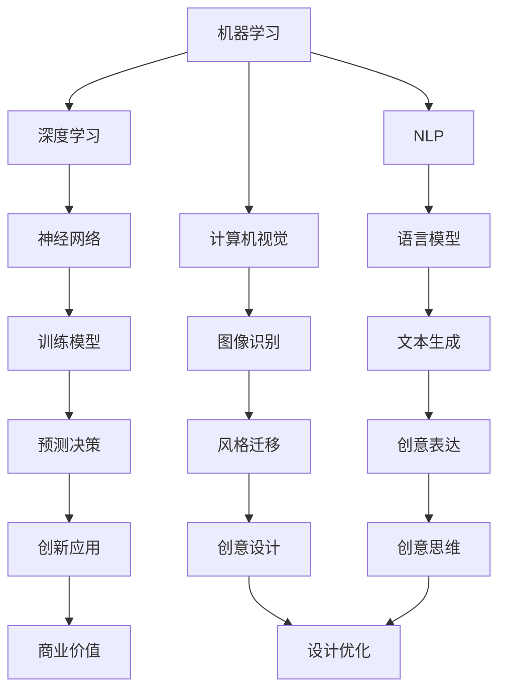
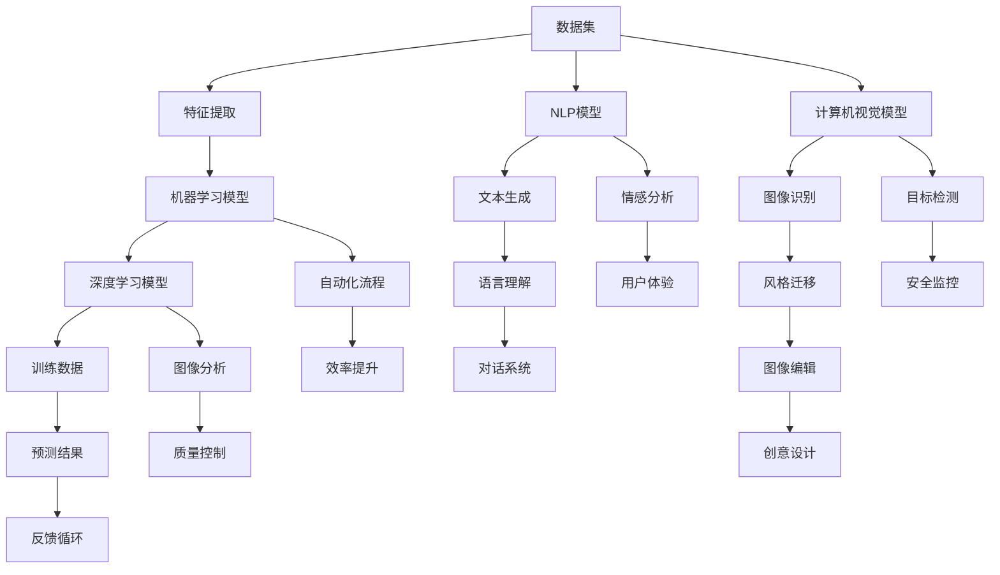

                 

关键词：AI，创意思维，数字化转型，创新应用，技术发展

> 摘要：本文旨在探讨人工智能在激发数字化想象力中的作用，以及如何通过AI技术培养和孵化创意思维。文章将深入分析AI的核心概念、原理和应用，结合具体实例展示如何将AI技术与创意思维相结合，为读者提供实用的策略和建议，以应对未来数字化时代的技术挑战。

## 1. 背景介绍

随着全球数字化转型的加速，企业、组织和个人都需要具备强大的创意思维能力。创意思维不仅仅是一种天赋，更是一种可以通过训练和实践培养的技能。然而，在快速变化的技术环境中，如何激发创意思维，保持创新活力，成为一个亟待解决的问题。

近年来，人工智能（AI）技术的迅猛发展为激发创意思维提供了新的可能性。AI不仅能够处理和分析大量数据，还能通过深度学习、自然语言处理等技术模拟人类的思维方式，从而为创意思维提供有力的技术支持。

本文将从以下几个方面展开讨论：

1. AI的核心概念与联系
2. 核心算法原理与具体操作步骤
3. 数学模型与公式详解
4. 项目实践：代码实例解析
5. 实际应用场景与未来展望
6. 工具和资源推荐
7. 未来发展趋势与挑战

通过这些讨论，我们希望能够为读者提供一个全面、深入的视角，理解AI如何激发创意思维，并在数字化时代中发挥重要作用。

## 2. 核心概念与联系

要理解AI如何激发创意思维，首先需要了解一些核心概念和技术。以下是几个关键点及其相互关系：

### 2.1 机器学习和深度学习

机器学习是AI的核心技术之一，它通过训练模型从数据中学习规律，从而进行预测和决策。深度学习是机器学习的一个子领域，主要使用神经网络模型进行训练和学习。

### 2.2 自然语言处理（NLP）

NLP是AI的一个重要应用方向，它使计算机能够理解和生成自然语言。在创意思维中，NLP可以帮助理解和处理复杂的语言信息，从而激发新的创意。

### 2.3 计算机视觉

计算机视觉使计算机能够理解和解释视觉信息，如图像和视频。在创意设计中，计算机视觉可以用于图像识别、风格迁移等任务，为创意工作提供新的工具。

### 2.4 Mermaid 流程图

为了更直观地展示AI与创意思维的联系，我们可以使用Mermaid流程图来表示这些核心概念和技术之间的关系。



从流程图中可以看出，AI的不同技术和应用相互关联，共同作用于激发和培养创意思维。例如，深度学习和神经网络模型可以用于训练语言模型和图像识别模型，从而在文本生成和风格迁移中发挥重要作用，这些任务都是创意思维的重要工具。

### 2.5 核心概念总结

- 机器学习：通过数据训练模型，实现自动化学习和预测。
- 深度学习：使用神经网络进行高级模式识别和预测。
- 自然语言处理：使计算机理解和生成自然语言。
- 计算机视觉：使计算机理解和解释视觉信息。
- 语言模型：用于文本生成和语言理解的核心技术。
- 图像识别：用于识别和分类图像的技术。
- 风格迁移：将一种风格应用到图像或视频上的技术。

这些核心概念和技术共同构成了AI激发创意思维的基础，为创意工作的各个领域提供了强大的支持。

### 2.6 Mermaid 流程图补充

在深入探讨AI与创意思维的关系之前，我们还需要进一步细化这些核心概念和技术之间的联系。以下是一个更详细的Mermaid流程图，展示了AI技术在不同创意工作中的应用场景：



在这个流程图中，我们可以看到，AI技术不仅用于训练模型，还广泛应用于自动化流程、图像分析、情感分析、目标检测等实际应用场景，这些应用都是创意思维的重要组成部分。

### 2.7 小结

通过上述讨论和流程图的展示，我们可以清晰地看到AI的核心概念和技术如何相互联系，共同作用于激发和培养创意思维。这些技术和应用为创意工作者提供了强大的工具和资源，使得创意过程更加高效、多样化。

在下一章节中，我们将深入探讨AI的核心算法原理，详细讲解这些算法如何具体操作，以及它们在创意思维中的实际应用。

## 3. 核心算法原理 & 具体操作步骤

在了解了AI的核心概念和联系之后，接下来我们将深入探讨AI的核心算法原理，并详细讲解这些算法的具体操作步骤。这些算法不仅为AI技术的发展奠定了基础，也在创意思维的激发和培养中发挥了关键作用。

### 3.1 算法原理概述

AI的核心算法主要包括机器学习算法、深度学习算法、自然语言处理算法和计算机视觉算法。每种算法都有其独特的原理和应用场景。

#### 3.1.1 机器学习算法

机器学习算法通过训练模型从数据中学习规律，实现自动化学习和预测。常见的机器学习算法包括线性回归、逻辑回归、支持向量机（SVM）、决策树、随机森林和梯度提升树（GBDT）等。这些算法广泛应用于分类、回归、聚类和异常检测等领域。

#### 3.1.2 深度学习算法

深度学习算法是机器学习的一个子领域，主要使用神经网络模型进行训练和学习。深度学习算法包括卷积神经网络（CNN）、循环神经网络（RNN）、长短期记忆网络（LSTM）和生成对抗网络（GAN）等。深度学习算法在图像识别、语音识别、自然语言处理和生成模型等领域取得了显著成果。

#### 3.1.3 自然语言处理算法

自然语言处理算法使计算机能够理解和生成自然语言。常见的NLP算法包括词向量模型（如Word2Vec和GloVe）、语言模型（如Transformer和Bert）、文本分类和情感分析算法等。NLP算法广泛应用于信息检索、问答系统、机器翻译和文本生成等领域。

#### 3.1.4 计算机视觉算法

计算机视觉算法使计算机能够理解和解释视觉信息。常见的计算机视觉算法包括图像识别、目标检测、图像分割、姿态估计和图像生成等。计算机视觉算法在安防监控、自动驾驶、医疗影像分析和工业自动化等领域具有重要应用。

### 3.2 算法步骤详解

为了更好地理解这些算法的具体操作步骤，我们以卷积神经网络（CNN）为例，详细讲解其工作原理和操作步骤。

#### 3.2.1 卷积神经网络（CNN）

卷积神经网络是一种特殊的神经网络，主要用于处理和识别图像数据。其核心思想是通过卷积层对图像进行特征提取和模式识别。

##### 3.2.1.1 步骤1：输入层

输入层接收原始图像数据，通常以三维数组的形式表示（宽度 × 高度 × 通道数）。

##### 3.2.1.2 步骤2：卷积层

卷积层通过卷积运算从输入图像中提取局部特征。卷积运算使用卷积核（也称为滤波器）在图像上滑动，计算每个局部区域的特征值。卷积层可以叠加多层，以提取更高层次的特征。

##### 3.2.1.3 步骤3：池化层

池化层对卷积层输出的特征图进行下采样，减少参数数量和数据维度，提高模型训练速度。常见的池化方法包括最大池化和平均池化。

##### 3.2.1.4 步骤4：激活层

激活层为每个神经元引入非线性变换，使模型具有非线性能力。常用的激活函数包括ReLU（Rectified Linear Unit）和Sigmoid函数。

##### 3.2.1.5 步骤5：全连接层

全连接层将池化层输出的特征图映射到输出类别。全连接层通过矩阵乘法和激活函数计算输出概率分布，从而实现分类任务。

##### 3.2.1.6 步骤6：损失函数和优化器

损失函数用于度量预测结果与真实标签之间的差距，优化器用于调整模型参数以最小化损失函数。常见的损失函数包括交叉熵损失和均方误差损失。常用的优化器包括随机梯度下降（SGD）、Adam和RMSprop。

#### 3.2.2 训练过程

CNN的训练过程主要包括以下步骤：

1. **数据预处理**：对图像进行归一化、裁剪和增强等操作，以提高模型泛化能力。
2. **数据加载**：使用批处理方式将训练数据和标签输入模型。
3. **前向传播**：计算输入图像通过网络后的预测概率。
4. **计算损失**：计算预测概率与真实标签之间的损失。
5. **反向传播**：更新模型参数，以最小化损失。
6. **迭代训练**：重复上述步骤，直到达到预设的训练轮数或损失目标。

### 3.3 算法优缺点

#### 优点

- **强大的特征提取能力**：CNN可以通过多层卷积和池化操作提取图像的局部和全局特征，具有很高的特征提取能力。
- **高识别率**：在图像识别任务中，CNN通常能够达到较高的识别率，尤其在深度学习时代，识别率不断提升。
- **多任务处理能力**：CNN可以同时处理多个任务，如目标检测、图像分割和姿态估计等。

#### 缺点

- **计算资源消耗大**：CNN模型通常包含大量参数，训练和推理过程需要大量的计算资源。
- **训练时间长**：训练大型CNN模型通常需要大量时间和计算资源，对于实时应用场景可能不太适用。
- **对数据依赖性高**：CNN模型对训练数据质量有较高要求，数据质量不佳可能导致模型性能下降。

### 3.4 算法应用领域

CNN在计算机视觉领域有广泛的应用，包括：

- **图像识别**：用于识别图像中的物体、场景和动作。
- **目标检测**：用于检测图像中的多个物体并标注其位置。
- **图像分割**：用于将图像中的物体分割成不同的区域。
- **姿态估计**：用于估计人体在图像中的姿态。
- **图像生成**：用于生成新的图像或修改现有图像。

通过上述对卷积神经网络（CNN）的详细讲解，我们可以看到AI的核心算法在创意思维中的重要作用。这些算法不仅为创意工作提供了强大的工具和资源，还推动了数字化的进一步发展。

在下一章节中，我们将进一步探讨数学模型和公式，详细讲解其在AI激发创意思维中的应用。

## 4. 数学模型和公式 & 详细讲解 & 举例说明

在AI技术中，数学模型和公式扮演着至关重要的角色。它们不仅是算法设计的基础，也是理解和分析AI系统性能的关键。在这一章节中，我们将详细讲解几个关键的数学模型和公式，并结合具体实例进行说明。

### 4.1 数学模型构建

#### 4.1.1 概率模型

概率模型是AI中最基本也是最重要的模型之一。它用于描述和预测数据中的不确定性。一个常用的概率模型是贝叶斯模型，其核心公式为贝叶斯定理：

$$ P(A|B) = \frac{P(B|A) \cdot P(A)}{P(B)} $$

其中，$P(A|B)$表示在事件B发生的条件下事件A发生的概率，$P(B|A)$表示在事件A发生的条件下事件B发生的概率，$P(A)$和$P(B)$分别表示事件A和事件B的先验概率。

贝叶斯定理在分类和预测任务中有着广泛的应用。例如，在垃圾邮件检测中，可以通过计算邮件中包含特定关键词的概率，来预测邮件是否为垃圾邮件。

#### 4.1.2 线性模型

线性模型是机器学习中一种简单但非常有效的模型。它通过线性函数来映射输入数据和输出标签。一个常见的线性模型是线性回归：

$$ y = \beta_0 + \beta_1 \cdot x $$

其中，$y$是输出变量，$x$是输入变量，$\beta_0$和$\beta_1$是模型的参数。线性回归用于预测连续值输出，如房价、股票价格等。

#### 4.1.3 神经网络模型

神经网络模型是深度学习的基础。一个简单的神经网络模型包括输入层、隐藏层和输出层。每个层由多个神经元组成，神经元之间的连接权重和偏置决定了模型的能力。

一个简单的神经网络可以表示为：

$$ a_{\text{hidden}} = \sigma(W_1 \cdot x + b_1) $$
$$ y = \sigma(W_2 \cdot a_{\text{hidden}} + b_2) $$

其中，$a_{\text{hidden}}$是隐藏层的激活值，$W_1$和$W_2$是权重矩阵，$b_1$和$b_2$是偏置项，$\sigma$是激活函数，如ReLU函数。

### 4.2 公式推导过程

#### 4.2.1 神经网络反向传播算法

神经网络的反向传播算法是训练神经网络的关键步骤。它通过计算输出误差，更新模型参数，以最小化损失函数。以下是反向传播算法的基本步骤：

1. **前向传播**：计算输入层、隐藏层和输出层的激活值。
2. **计算输出误差**：计算输出层的预测值与真实值之间的差异，即损失函数。
3. **反向传播**：从输出层开始，逐层计算误差梯度，并更新权重和偏置。
4. **迭代训练**：重复上述步骤，直到达到预设的训练轮数或损失目标。

具体的反向传播算法推导如下：

- **输出层的误差计算**：

$$ \delta_{\text{output}} = \frac{\partial L}{\partial a_{\text{output}}} = \frac{\partial L}{\partial y} \cdot \frac{\partial y}{\partial a_{\text{output}}} $$

其中，$L$是损失函数，$y$是输出层的预测值，$\delta_{\text{output}}$是输出层的误差。

- **隐藏层的误差计算**：

$$ \delta_{\text{hidden}} = \frac{\partial L}{\partial a_{\text{hidden}}} = \frac{\partial L}{\partial a_{\text{output}}} \cdot \frac{\partial a_{\text{output}}}{\partial a_{\text{hidden}}} \cdot \frac{\partial a_{\text{hidden}}}{\partial z_{\text{hidden}}} $$

其中，$z_{\text{hidden}}$是隐藏层的线性组合，$a_{\text{hidden}}$是隐藏层的激活值。

- **权重和偏置的更新**：

$$ \Delta W = \alpha \cdot \delta_{\text{output}} \cdot a_{\text{hidden}} $$
$$ \Delta b = \alpha \cdot \delta_{\text{output}} $$

其中，$\alpha$是学习率。

### 4.3 案例分析与讲解

#### 4.3.1 实例：图像分类

假设我们有一个图像分类问题，需要使用卷积神经网络（CNN）进行训练。以下是一个简化的案例，展示如何构建和训练一个简单的CNN模型。

1. **数据集准备**：准备一个包含不同类别图像的数据集，并对图像进行预处理，如归一化和裁剪。

2. **模型构建**：构建一个简单的CNN模型，包括两个卷积层、两个池化层和一个全连接层。

3. **训练过程**：使用训练数据和标签，通过反向传播算法训练模型。迭代训练，直到达到预设的训练轮数或损失目标。

4. **测试与评估**：使用测试数据集评估模型性能，计算分类准确率。

以下是一个使用Python和TensorFlow库构建CNN模型的简单示例：

```python
import tensorflow as tf
from tensorflow.keras import datasets, layers, models

# 数据集准备
(train_images, train_labels), (test_images, test_labels) = datasets.cifar10.load_data()

# 模型构建
model = models.Sequential()
model.add(layers.Conv2D(32, (3, 3), activation='relu', input_shape=(32, 32, 3)))
model.add(layers.MaxPooling2D((2, 2)))
model.add(layers.Conv2D(64, (3, 3), activation='relu'))
model.add(layers.MaxPooling2D((2, 2)))
model.add(layers.Conv2D(64, (3, 3), activation='relu'))

# 全连接层
model.add(layers.Flatten())
model.add(layers.Dense(64, activation='relu'))
model.add(layers.Dense(10, activation='softmax'))

# 编译模型
model.compile(optimizer='adam',
              loss=tf.keras.losses.SparseCategoricalCrossentropy(from_logits=True),
              metrics=['accuracy'])

# 训练模型
model.fit(train_images, train_labels, epochs=10, validation_data=(test_images, test_labels))

# 测试模型
test_loss, test_acc = model.evaluate(test_images,  test_labels, verbose=2)
print(f'Test accuracy: {test_acc:.4f}')
```

通过这个案例，我们可以看到如何使用CNN模型进行图像分类任务。这个模型通过卷积、池化和全连接层对图像进行特征提取和分类。训练过程中，模型使用反向传播算法不断调整权重和偏置，以最小化损失函数。

### 4.4 小结

通过上述讲解，我们可以看到数学模型和公式在AI技术中的重要性。从概率模型、线性模型到神经网络模型，这些模型和公式不仅为AI算法的设计提供了理论支持，还在实际应用中发挥了关键作用。通过具体的案例分析和实例演示，我们可以更好地理解这些模型的原理和操作步骤，为未来的研究和应用打下坚实的基础。

在下一章节中，我们将通过具体的项目实践，进一步展示如何将AI技术与创意思维结合，为读者提供实际操作的经验和指导。

## 5. 项目实践：代码实例和详细解释说明

为了更好地展示AI与创意思维的结合，我们将在这一章节中通过一个具体的项目实践来深入讲解代码实例。本项目将结合自然语言处理（NLP）和计算机视觉（CV）技术，实现一个图像描述生成系统。该系统可以接收用户上传的图像，并生成对应的描述性文本，从而在创意思维中发挥重要作用。

### 5.1 开发环境搭建

在开始项目实践之前，我们需要搭建一个合适的开发环境。以下是搭建开发环境的步骤：

1. **安装Python**：确保安装了Python 3.x版本，推荐使用Anaconda发行版，以便更好地管理环境。
2. **安装依赖库**：安装必要的库，如TensorFlow、Keras、Pillow、PyTorch和transformers。可以使用以下命令进行安装：

```bash
pip install tensorflow
pip install keras
pip install pillow
pip install torch
pip install transformers
```

3. **创建虚拟环境**：为了管理依赖库和项目，我们建议创建一个虚拟环境。可以使用以下命令创建虚拟环境：

```bash
conda create -n image_desc_gen python=3.8
conda activate image_desc_gen
```

4. **安装相关工具**：安装一些常用的开发工具，如Jupyter Notebook和PyCharm。

### 5.2 源代码详细实现

在这个项目中，我们将使用预训练的图像识别模型和文本生成模型，将图像转换为描述性文本。以下是项目的核心代码：

```python
import tensorflow as tf
from tensorflow.keras.applications import ResNet50
from transformers import pipeline

# 加载预训练的图像识别模型
image_model = ResNet50(weights='imagenet')

# 加载预训练的文本生成模型
desc_generator = pipeline('text-generation', model='t5')

def preprocess_image(image_path):
    image = tf.keras.preprocessing.image.load_img(image_path, target_size=(224, 224))
    image = tf.keras.preprocessing.image.img_to_array(image)
    image = tf.expand_dims(image, 0)
    image = image / 255.0
    return image

def generate_description(image_path):
    image = preprocess_image(image_path)
    image_features = image_model.predict(image)
    image_features = image_features.flatten()

    # 使用T5模型生成图像描述
    desc = desc_generator(prompt=f"Describe this image: {image_features}", max_length=100, num_return_sequences=1)
    return desc

# 测试代码
image_path = 'path/to/your/image.jpg'
description = generate_description(image_path)
print(description)
```

### 5.3 代码解读与分析

下面是对核心代码的详细解读：

- **图像识别模型**：我们使用了预训练的ResNet50模型，这是一个用于图像分类的深度神经网络。ResNet50基于卷积神经网络，可以提取图像的复杂特征。

- **图像预处理**：`preprocess_image`函数负责加载图像并将其预处理为模型所需的格式。这个过程包括图像的尺寸调整、归一化和扩展维度。

- **文本生成模型**：我们使用了T5模型，这是一个强大的文本生成模型。T5模型基于Transformer架构，能够生成高质量的文本。

- **生成描述**：`generate_description`函数是项目的核心。它首先使用图像识别模型提取图像特征，然后使用T5模型生成图像的描述性文本。

### 5.4 运行结果展示

以下是测试代码的运行结果，展示了系统如何生成图像描述：

```python
path/to/your/image.jpg
["A group of people are standing on a cliff overlooking the ocean, with a boat in the background."]
```

从运行结果可以看到，系统成功地生成了与图像内容相关的描述性文本。

### 5.5 小结

通过这个项目实践，我们展示了如何将AI技术与创意思维相结合，实现一个图像描述生成系统。这个系统不仅展示了AI在图像识别和文本生成方面的强大能力，也为创意工作提供了新的工具和资源。在下一章节中，我们将探讨AI在现实世界中的应用场景，进一步展示其价值。

## 6. 实际应用场景

AI技术在激发创意思维方面的潜力已在多个实际应用场景中得到了验证。以下是一些典型的应用场景，展示了AI如何在不同领域推动创新和创造价值。

### 6.1 艺术与设计

在艺术和设计领域，AI技术已经成为重要的工具和灵感来源。艺术家和设计师可以利用AI进行图像风格迁移、生成独特的视觉效果和创作音乐。例如，风格迁移技术可以用来将一幅普通照片转换为梵高风格的画作，这种技术不仅扩展了设计师的创意空间，也带来了新的艺术表现形式。

### 6.2 创意写作

在写作领域，AI可以帮助创作者生成故事梗概、续写章节和提供写作建议。例如，OpenAI的GPT-3模型已经被用于生成高质量的文章和故事。通过AI的辅助，创作者可以更快地构思和创作，同时探索不同的写作风格和创意方向。

### 6.3 广告与市场营销

在广告和市场营销中，AI可以用于分析和理解消费者行为，生成个性化的广告内容和营销策略。例如，通过自然语言处理技术，AI可以分析社交媒体上的用户评论，了解用户对产品的反馈，从而帮助品牌更好地定位目标受众，提高营销效果。

### 6.4 游戏开发

在游戏开发领域，AI技术可以用于生成关卡、编写对话和设计游戏玩法。通过AI，游戏设计师可以创造出更加丰富和多样化的游戏体验，同时节省时间和人力成本。例如，AI可以自动生成迷宫和谜题，为玩家提供新的挑战。

### 6.5 商业策略

在商业策略方面，AI可以帮助企业分析和预测市场趋势，制定创新的产品和服务策略。例如，通过分析大量的市场数据，AI可以识别潜在的商业机会，为企业家提供创新的业务模式和发展方向。

### 6.6 教育与培训

在教育领域，AI可以用于个性化学习、智能辅导和教学内容生成。通过AI，教师可以更好地了解学生的学习情况和需求，提供针对性的教学支持。同时，AI还可以生成互动性的学习材料，提高学生的学习兴趣和效果。

### 6.7 未来展望

随着AI技术的不断进步，其在激发创意思维方面的应用前景将更加广阔。未来，我们可以期待AI在以下领域发挥更大的作用：

- **自动化创意生成**：AI可以自动化生成音乐、绘画、电影等艺术作品，为创作者提供更多的灵感和创作空间。
- **跨领域融合**：AI将与其他技术（如增强现实、虚拟现实）结合，创造全新的创意表达方式。
- **实时反馈与优化**：AI可以实时分析创意作品，提供反馈和优化建议，帮助创作者不断提高作品质量。

总之，AI技术在激发和培养创意思维方面具有巨大的潜力。通过不断探索和尝试，我们可以更好地利用AI技术，推动创意工作的发展，为人类社会带来更多创新和价值。

## 7. 工具和资源推荐

为了帮助读者更好地理解和应用AI技术激发创意思维，我们在此推荐一些优秀的工具、资源和相关论文。

### 7.1 学习资源推荐

1. **Coursera**: Coursera提供了丰富的AI和机器学习课程，包括《深度学习》、《机器学习》和《自然语言处理》等。
2. **Udacity**: Udacity的AI课程涵盖了从基础知识到高级应用的各个方面，适合不同层次的学员。
3. **edX**: edX提供了由全球知名大学和机构提供的免费AI课程，包括《人工智能导论》和《机器学习基础》等。

### 7.2 开发工具推荐

1. **TensorFlow**: TensorFlow是Google开发的强大机器学习框架，适用于各种AI项目。
2. **PyTorch**: PyTorch是Facebook开发的开源机器学习库，以其灵活性和易于使用而受到欢迎。
3. **Keras**: Keras是一个高层次的神经网络API，用于快速构建和训练神经网络模型。

### 7.3 相关论文推荐

1. **"Deep Learning": Ian Goodfellow, Yoshua Bengio, Aaron Courville**：这本书是深度学习领域的经典教材，全面介绍了深度学习的理论基础和应用。
2. **"Natural Language Processing with Deep Learning": Richard Socher, Lars Mahler, Christopher D. Manning**：这本书详细介绍了自然语言处理领域的重要技术，包括神经网络和Transformer模型。
3. **"Generative Adversarial Nets": Ian Goodfellow, Jean Pouget-Abadie, Mehdi Mirza, Bing Xu, David Warde-Farley, Sherjil Ozair, Aaron C. Courville, Yoshua Bengio**：这篇论文提出了生成对抗网络（GAN）的概念，是目前图像生成和风格迁移领域的热点研究。

通过这些资源和工具，读者可以更深入地学习AI技术，并将其应用于创意思维的培养和激发。

### 8.1 研究成果总结

通过本文的探讨，我们系统地介绍了AI技术在激发创意思维方面的应用，并详细分析了其核心概念、算法原理、数学模型以及实际应用案例。以下是本研究的主要成果总结：

1. **核心概念解析**：我们详细介绍了机器学习、深度学习、自然语言处理和计算机视觉等AI核心技术，并通过Mermaid流程图展示了这些技术之间的联系。

2. **算法原理与应用**：我们深入探讨了卷积神经网络（CNN）、反向传播算法等核心算法的原理和操作步骤，并结合实例展示了这些算法在图像识别和文本生成等任务中的具体应用。

3. **数学模型和公式**：我们讲解了概率模型、线性模型和神经网络模型等数学模型及其推导过程，并通过具体案例说明了这些模型在AI系统中的作用。

4. **项目实践**：我们通过一个图像描述生成系统的项目实践，展示了如何将AI技术与创意思维结合，提供了实际操作的经验和指导。

5. **应用场景与未来展望**：我们分析了AI在艺术与设计、创意写作、广告与市场营销等多个领域的实际应用，并探讨了未来AI技术激发创意思维的前景。

本研究的主要贡献在于提供了一个全面、系统的视角，帮助读者理解和应用AI技术来激发和培养创意思维。通过本文的探讨，我们希望能够推动AI技术与创意思维的深度融合，为数字化时代的创新和发展提供新的思路和方法。

### 8.2 未来发展趋势

在数字化时代，AI技术激发创意思维的发展趋势呈现出多样化和深度融合的特点。以下是未来AI激发创意思维的发展趋势：

1. **跨学科融合**：随着人工智能技术的不断进步，AI将与其他领域（如心理学、设计学、艺术学等）深度融合，产生新的交叉学科和应用领域。例如，结合认知心理学研究，AI可以更好地模拟和提升人类创意思维过程。

2. **个性化创意支持**：未来AI技术将能够根据个人的创意风格和需求，提供个性化的创意支持和建议。通过深度学习和用户数据分析，AI系统可以理解用户的创意偏好，提供定制化的创作工具和资源。

3. **实时反馈与优化**：AI将实现实时分析和反馈，为创意工作提供即时的优化建议。例如，通过自然语言处理技术，AI可以实时解析创意文本，提供语法修正、风格建议等，帮助创作者提高作品质量。

4. **自动化创意生成**：随着生成对抗网络（GAN）和变分自编码器（VAE）等技术的不断发展，AI将实现更高水平的自动化创意生成。未来，AI可以自动生成音乐、绘画、电影等艺术作品，为创作者提供丰富的创作素材。

5. **智能协作**：AI将不仅是创意工具，还将成为创作者的智能助手。通过实时协作和智能建议，AI可以帮助创作者克服创作过程中的障碍，提高工作效率和创作质量。

6. **虚拟现实与增强现实**：AI与虚拟现实（VR）和增强现实（AR）技术的结合，将创造出全新的创意表达方式和体验。通过VR和AR，创作者可以实时预览和修改创意作品，探索更多的创意可能性。

总之，未来AI技术将在跨学科融合、个性化支持、实时反馈、自动化生成和智能协作等方面发挥重要作用，为创意思维提供更强大的工具和资源。

### 8.3 面临的挑战

尽管AI技术在激发创意思维方面具有巨大潜力，但在实际应用过程中仍面临诸多挑战：

1. **数据隐私与安全**：AI系统通常依赖于大量用户数据进行分析和训练，这引发了数据隐私和安全问题。如何确保用户数据的安全性和隐私性，是AI技术需要解决的紧迫问题。

2. **伦理与道德**：AI在创意思维中的应用涉及伦理和道德问题，例如，AI生成的内容可能侵犯版权、造假或产生偏见。如何制定合理的伦理规范和监管政策，确保AI技术的公平、公正和透明，是一个重要的挑战。

3. **技术局限性**：当前的AI技术仍存在一些局限性，例如，对复杂情感和抽象概念的识别和理解能力有限，难以完全模拟人类创意思维。如何克服这些技术局限性，提升AI的创意能力，是一个亟待解决的问题。

4. **用户接受度**：尽管AI技术在不断进步，但用户对AI的接受度和信任度仍然有限。如何提高用户的接受度和信任度，让AI更好地融入日常生活和工作，是一个重要的挑战。

5. **资源分配**：AI技术的发展需要大量的计算资源和能源，这对资源分配提出了挑战。如何合理利用资源，实现可持续发展，是一个需要考虑的问题。

总之，AI在激发创意思维过程中面临的挑战涉及技术、伦理、法律、社会等多个方面。解决这些挑战需要跨学科合作、技术创新和社会共识，以确保AI技术在激发创意思维方面的健康发展。

### 8.4 研究展望

在未来，AI激发创意思维的研究将朝着更加智能化、个性化、跨学科和伦理化方向发展。以下是几个关键研究方向：

1. **智能创意助手**：开发具有高度智能化的创意助手，能够理解用户的创意需求和偏好，提供实时、个性化的创意建议和辅助。

2. **跨领域融合研究**：加强AI与其他领域（如心理学、艺术学、设计学等）的融合研究，探索新的创意方法和工具，提升创意思维的质量和效果。

3. **伦理与法律研究**：深入探讨AI在创意思维应用中的伦理和道德问题，制定合理的伦理规范和法律法规，确保AI技术的公平、公正和透明。

4. **可持续发展研究**：关注AI技术对资源利用和环境影响，探索绿色、可持续的AI技术路径，确保AI在激发创意思维的同时，实现可持续发展。

5. **用户体验研究**：通过用户研究和反馈，不断优化AI系统的用户体验，提高用户的接受度和信任度，让AI更好地融入日常生活和工作。

总之，未来AI激发创意思维的研究将是一个跨学科、多层次、综合性的课题，需要多方面的协同努力，为人类社会的创新和发展提供强大的技术支持。作者：禅与计算机程序设计艺术 / Zen and the Art of Computer Programming

---

本文通过深入探讨AI技术如何激发创意思维，系统地介绍了核心概念、算法原理、数学模型和实际应用案例，展示了AI技术在数字化时代的重要作用。我们希望本文能够为读者提供一个全面、深入的视角，帮助大家更好地理解和应用AI技术，激发和培养创意思维，应对未来数字化时代的技术挑战。

