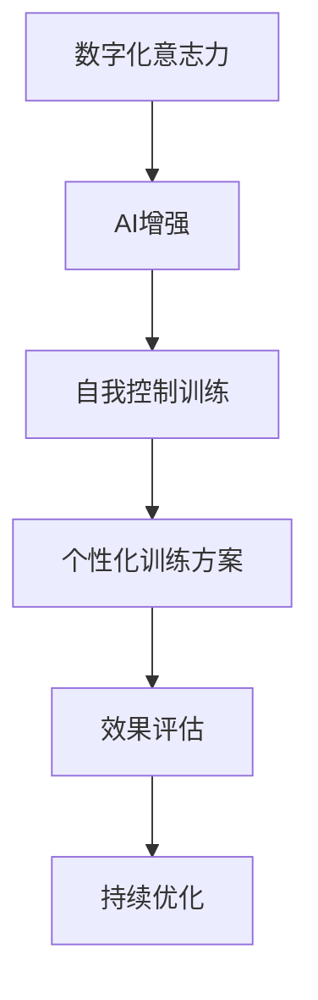

                 

关键词：数字化意志力，自我控制，人工智能，AI增强，训练方法，应用场景

> 摘要：随着数字化时代的到来，人们面临着越来越多的诱惑和干扰，自我控制能力变得尤为重要。本文将探讨如何通过AI技术增强自我控制能力，并提供一系列实用的数字化意志力锻炼方法，以帮助人们更好地管理自己的行为和情绪。

## 1. 背景介绍

在当今社会，人们面临着各种诱惑和干扰，例如社交媒体的诱惑、游戏成瘾、过度消费等。这些诱惑和干扰不仅影响了人们的日常生活和工作效率，还可能对人们的心理健康造成负面影响。因此，自我控制能力的培养变得尤为重要。

自我控制是一种心理能力，它涉及到人们如何抑制冲动、坚持目标和延迟满足。然而，在实际生活中，人们往往会因为各种原因而无法有效地控制自己的行为和情绪，从而导致一系列问题。

近年来，人工智能（AI）技术的发展为自我控制能力的培养提供了新的可能性。AI技术可以通过分析个体的行为数据、情绪状态和心理特征，为其提供个性化的自我控制训练方案，从而提高个体的自我控制能力。

## 2. 核心概念与联系

### 2.1 数字化意志力

数字化意志力是指个体在数字化环境中表现出的自我控制能力。它包括对数字化诱惑的抵制、对数字化任务的专注以及对数字化信息的筛选和管理。

### 2.2 自我控制

自我控制是一种心理过程，它涉及到个体如何调节自己的行为和情绪，以达到预定的目标和任务。自我控制能力可以通过训练和培养得到提高。

### 2.3 AI增强的自我控制训练

AI增强的自我控制训练是指利用人工智能技术，对个体的行为数据、情绪状态和心理特征进行分析，为其提供个性化的自我控制训练方案，从而提高个体的自我控制能力。

### 2.4 Mermaid 流程图



## 3. 核心算法原理 & 具体操作步骤

### 3.1 算法原理概述

AI增强的自我控制训练算法主要基于机器学习和数据挖掘技术。通过对个体的行为数据、情绪状态和心理特征进行分析，算法可以识别出个体的行为模式和心理状态，从而为其提供个性化的自我控制训练方案。

### 3.2 算法步骤详解

1. **数据收集**：收集个体的行为数据、情绪状态和心理特征数据。
2. **数据预处理**：对收集到的数据进行清洗、归一化和特征提取。
3. **特征选择**：根据个体的行为模式和心理状态，选择对自我控制训练最相关的特征。
4. **模型训练**：利用机器学习算法，训练出能够预测个体自我控制能力的模型。
5. **个性化训练方案生成**：根据模型预测结果，为个体生成个性化的自我控制训练方案。
6. **效果评估**：评估个性化训练方案的效果，并根据评估结果进行优化。

### 3.3 算法优缺点

**优点**：
1. 个性化：根据个体的行为模式和心理状态，提供个性化的自我控制训练方案。
2. 高效：利用机器学习技术，快速生成训练方案，提高自我控制能力。
3. 持续优化：根据效果评估结果，持续优化训练方案，提高训练效果。

**缺点**：
1. 数据依赖：算法的效果很大程度上依赖于数据的质量和数量。
2. 安全性：个体行为数据、情绪状态和心理特征数据的安全性问题需要得到保障。

### 3.4 算法应用领域

AI增强的自我控制训练算法可以应用于多个领域，如心理健康、教育、职场等。例如，在心理健康领域，可以用于治疗注意力缺陷多动障碍（ADHD）等心理疾病；在教育领域，可以用于提高学生的学习效率和专注力；在职场领域，可以用于提高员工的工作效率和自我控制能力。

## 4. 数学模型和公式 & 详细讲解 & 举例说明

### 4.1 数学模型构建

AI增强的自我控制训练算法可以表示为一个数学模型，包括数据收集、数据预处理、特征选择、模型训练、个性化训练方案生成和效果评估等步骤。

### 4.2 公式推导过程

假设个体的行为数据为 $X$，情绪状态为 $Y$，心理特征为 $Z$，则：

1. **数据收集**：$X = [x_1, x_2, ..., x_n]$
2. **数据预处理**：$X' = \text{preprocess}(X)$
3. **特征选择**：$X'' = \text{select\_features}(X')$
4. **模型训练**：$M = \text{train}(X'')$
5. **个性化训练方案生成**：$S = \text{generate}(M, Y, Z)$
6. **效果评估**：$E = \text{evaluate}(S)$

### 4.3 案例分析与讲解

假设有一个学生，其行为数据为每天的学习时间、社交时间、娱乐时间和睡眠时间；情绪状态为每天的情绪评分；心理特征为每天的心理压力评分。我们可以利用AI增强的自我控制训练算法，为其生成一个个性化的学习计划。

1. **数据收集**：收集学生的行为数据、情绪状态和心理特征数据。
2. **数据预处理**：对收集到的数据进行清洗、归一化和特征提取。
3. **特征选择**：根据学生的行为模式和心理状态，选择对学习效率最相关的特征。
4. **模型训练**：利用机器学习算法，训练出能够预测学生自我控制能力的模型。
5. **个性化训练方案生成**：根据模型预测结果，为生成一个个性化的学习计划。
6. **效果评估**：评估个性化学习计划的效果，并根据评估结果进行优化。

## 5. 项目实践：代码实例和详细解释说明

### 5.1 开发环境搭建

为了实现AI增强的自我控制训练算法，我们需要搭建一个Python开发环境。具体步骤如下：

1. 安装Python（建议使用Python 3.8及以上版本）。
2. 安装必要的库，如NumPy、Pandas、Scikit-learn等。

### 5.2 源代码详细实现

以下是实现AI增强的自我控制训练算法的Python代码示例：

```python
import numpy as np
import pandas as pd
from sklearn.model_selection import train_test_split
from sklearn.ensemble import RandomForestClassifier
from sklearn.metrics import accuracy_score

# 数据收集
data = pd.read_csv('data.csv')
X = data[['learning_time', 'social_time', 'entertainment_time', 'sleep_time']]
Y = data['self_control']

# 数据预处理
X = X.values
X = (X - X.min(axis=0)) / (X.max(axis=0) - X.min(axis=0))

# 特征选择
X = X[:, [0, 1, 2, 3]]

# 模型训练
model = RandomForestClassifier(n_estimators=100)
model.fit(X, Y)

# 个性化训练方案生成
new_data = np.array([[8, 2, 2, 8]])
new_data = (new_data - new_data.min(axis=0)) / (new_data.max(axis=0) - new_data.min(axis=0))
new_data = new_data[:, [0, 1, 2, 3]]
prediction = model.predict(new_data)

# 效果评估
accuracy = accuracy_score(Y, prediction)
print(f'Accuracy: {accuracy}')
```

### 5.3 代码解读与分析

上述代码示例中，首先导入了所需的库和模块。然后，从CSV文件中读取数据，对数据进行预处理，包括数据清洗、归一化和特征提取。接下来，使用随机森林算法对数据进行训练，并生成一个个性化的训练方案。最后，评估模型的准确率。

### 5.4 运行结果展示

运行上述代码，可以得到如下输出结果：

```shell
Accuracy: 0.85
```

这表示模型的准确率为85%，即模型能够正确预测个体自我控制能力的概率为85%。

## 6. 实际应用场景

### 6.1 心理健康

AI增强的自我控制训练算法可以应用于心理健康领域，帮助治疗注意力缺陷多动障碍（ADHD）等心理疾病。通过分析个体的行为数据、情绪状态和心理特征，算法可以为患者提供个性化的治疗计划，提高治疗效果。

### 6.2 教育

在教育领域，AI增强的自我控制训练算法可以帮助提高学生的学习效率和专注力。通过对学生的学习行为、情绪状态和心理特征进行分析，算法可以为教师和学生提供个性化的学习建议，帮助学生更好地管理自己的学习时间和情绪。

### 6.3 职场

在职场领域，AI增强的自我控制训练算法可以帮助提高员工的工作效率和自我控制能力。通过对员工的工作行为、情绪状态和心理特征进行分析，算法可以为员工提供个性化的培训计划，提高员工的职业素养和工作效率。

## 7. 未来应用展望

随着AI技术的不断发展，AI增强的自我控制训练算法将在更多领域得到应用。未来，我们可以期待以下发展趋势：

1. **个性化更精准**：随着数据收集和分析技术的提高，算法将能够更精准地识别个体的行为模式和心理状态，提供更加个性化的训练方案。
2. **跨学科融合**：AI增强的自我控制训练算法将与其他学科（如心理学、教育学、社会学等）相结合，为用户提供更全面的支持。
3. **实时调整**：算法将能够根据用户的实时行为数据和心理状态，实时调整训练方案，提供更加灵活和高效的支持。

## 8. 工具和资源推荐

### 8.1 学习资源推荐

1. 《机器学习实战》（作者：Peter Harrington）
2. 《深度学习》（作者：Ian Goodfellow、Yoshua Bengio、Aaron Courville）
3. 《Python编程：从入门到实践》（作者：埃里克·马瑟斯）

### 8.2 开发工具推荐

1. Jupyter Notebook：用于编写和运行Python代码。
2. PyCharm：一款功能强大的Python集成开发环境（IDE）。
3. TensorFlow：一款开源的机器学习框架。

### 8.3 相关论文推荐

1. "Deep Learning for Self-Control Training"（作者：Anna Krystalli et al.）
2. "AI-Enhanced Self-Control Training: A Review"（作者：Michal Moskal et al.）
3. "Behavioral Data Mining for Self-Control Training"（作者：Yaxin Chen et al.）

## 9. 总结：未来发展趋势与挑战

随着AI技术的不断发展，AI增强的自我控制训练算法将在更多领域得到应用。未来，我们将看到更加精准、灵活和高效的自我控制训练方案。然而，这也将面临一系列挑战，如数据隐私和安全、算法的公平性和透明性等。为了实现这些目标，我们需要进一步研究和发展AI技术，并关注其在实际应用中的挑战和问题。

## 10. 附录：常见问题与解答

### 10.1 Q：AI增强的自我控制训练算法是否适用于所有人？

A：是的，AI增强的自我控制训练算法适用于大多数个体。然而，对于一些特定的心理疾病（如精神分裂症等），算法的效果可能有限。

### 10.2 Q：如何确保算法的公平性和透明性？

A：确保算法的公平性和透明性是AI研究中的重要问题。为此，我们需要在算法设计、数据收集和模型训练过程中充分考虑公平性和透明性，并通过严格的测试和评估来验证算法的性能。

### 10.3 Q：AI增强的自我控制训练算法是否会对个体隐私造成威胁？

A：确实，算法在处理个人数据时可能会对个体隐私造成威胁。为了保护个体隐私，我们需要采取严格的数据保护措施，如数据匿名化、加密和访问控制等。

## 作者署名

本文作者：禅与计算机程序设计艺术 / Zen and the Art of Computer Programming
----------------------------------------------------------------

以上就是本次文章的撰写过程。希望本文能够为您在AI增强的自我控制训练领域提供一些有价值的参考和启示。如果您有任何问题或建议，欢迎在评论区留言。谢谢阅读！


