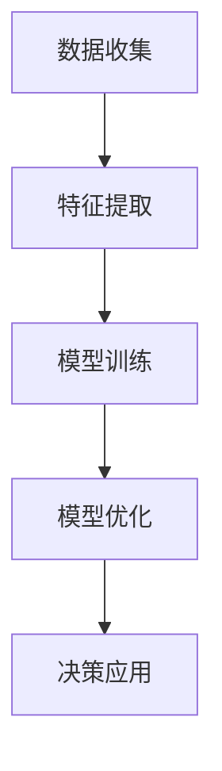

                 

关键词：数字化直觉、AI辅助、潜意识决策、神经科学、机器学习、深度强化学习、决策训练、认知科学。

> 摘要：本文探讨了数字化直觉强化这一前沿概念，阐述了通过AI辅助对潜意识进行决策训练的方法和原理。文章首先介绍了数字化直觉的概念，然后详细阐述了AI在潜意识决策训练中的应用，并探讨了相关数学模型和算法，最后通过具体实例展示了这一技术的实际应用和未来发展方向。

## 1. 背景介绍

在当今信息爆炸的时代，人类面临着日益复杂的决策环境。传统的决策理论主要依赖于逻辑推理和数据分析，但往往难以应对现实世界中的复杂情境。近年来，神经科学和认知科学的发展为我们提供了一种新的视角——潜意识决策。潜意识决策指的是在无意识状态下做出的决策，它不仅依赖于逻辑和理性，还受到情感、经验和个人价值观等因素的影响。

然而，潜意识决策的训练是一个复杂的问题。传统的决策训练方法主要依赖于有意识的思考和反思，而这种方式往往效率低下，难以适应快速变化的环境。为了解决这个问题，人工智能（AI）技术的引入为潜意识决策训练提供了新的可能性。AI能够通过深度学习算法，模拟和训练人类的潜意识决策过程，从而提高决策的效率和准确性。

本文将探讨数字化直觉强化这一概念，通过AI辅助对潜意识进行决策训练的方法和原理，并分析其应用前景和挑战。

## 2. 核心概念与联系

### 2.1 数字化直觉

数字化直觉是指通过数字化技术和算法来模拟和增强人类直觉能力的过程。直觉是人类在无意识状态下快速识别模式、预测结果的能力，它在许多领域（如医疗诊断、金融投资、军事决策等）中发挥着重要作用。数字化直觉旨在利用计算机和算法，将人类的直觉能力转化为可量化和可操作的形式。

### 2.2 潜意识决策

潜意识决策是指人们在无意识状态下做出的决策。这种决策不仅受到逻辑和理性的影响，还受到情感、经验和个人价值观等因素的影响。潜意识决策的特点是快速、高效，但往往缺乏透明性和可解释性。通过AI辅助，我们可以对潜意识决策进行训练，提高其准确性和可靠性。

### 2.3 AI辅助的潜意识决策训练

AI辅助的潜意识决策训练是指利用人工智能技术，对人类的潜意识决策过程进行模拟、训练和优化。这一过程通常包括以下步骤：

1. **数据收集**：通过传感器、监控设备和用户反馈等方式，收集与决策相关的数据。
2. **特征提取**：对收集到的数据进行预处理，提取出与决策相关的特征。
3. **模型训练**：利用深度学习算法，建立潜意识决策模型。
4. **模型优化**：通过迭代训练和优化，提高模型的准确性和可靠性。
5. **决策应用**：将训练好的模型应用于实际决策场景中，辅助人类做出更加明智的决策。

### 2.4 Mermaid 流程图

下面是一个简化的Mermaid流程图，展示了AI辅助的潜意识决策训练的基本流程：



## 3. 核心算法原理 & 具体操作步骤

### 3.1 算法原理概述

AI辅助的潜意识决策训练主要依赖于深度强化学习（Deep Reinforcement Learning，DRL）算法。DRL结合了深度学习和强化学习（Reinforcement Learning，RL）的优势，能够在复杂的环境中学习并做出最优决策。

在DRL中，决策模型通常由两个部分组成：价值网络和价值评估网络。价值网络用于预测在不同状态下采取不同动作的预期回报，而价值评估网络用于评估当前状态的值。通过迭代训练，模型能够不断优化决策策略，提高决策的准确性。

### 3.2 算法步骤详解

#### 3.2.1 数据收集

数据收集是AI辅助潜意识决策训练的基础。数据来源可以包括用户行为数据、历史决策数据、环境感知数据等。为了提高数据的质量和多样性，可以使用多种传感器和采集设备，如摄像头、麦克风、位置传感器等。

#### 3.2.2 特征提取

在数据收集完成后，需要对数据进行预处理，提取出与决策相关的特征。特征提取的过程包括数据清洗、数据归一化、特征选择等。常用的特征提取方法有基于统计的特征提取、基于机器学习的特征提取等。

#### 3.2.3 模型训练

在特征提取后，可以使用深度学习算法建立决策模型。常用的深度学习算法包括卷积神经网络（CNN）、循环神经网络（RNN）和生成对抗网络（GAN）等。在模型训练过程中，需要使用大量样本进行训练，并通过反向传播算法优化模型参数。

#### 3.2.4 模型优化

在模型训练完成后，需要对模型进行优化，以提高其准确性和可靠性。优化过程通常包括以下步骤：

1. **过拟合检测**：通过交叉验证和测试集评估模型性能，检测模型是否出现过拟合。
2. **参数调整**：根据模型性能调整学习率、正则化参数等。
3. **超参数优化**：通过网格搜索、贝叶斯优化等策略，寻找最优超参数组合。

#### 3.2.5 决策应用

在模型优化完成后，可以将模型应用于实际决策场景中。决策应用的过程包括以下步骤：

1. **状态输入**：将当前状态输入到决策模型中。
2. **动作预测**：根据模型输出预测最佳动作。
3. **决策执行**：根据预测结果执行决策。
4. **反馈调整**：根据决策结果调整模型参数，优化决策策略。

### 3.3 算法优缺点

#### 3.3.1 优点

1. **高效性**：深度强化学习算法能够在复杂环境中快速学习并做出最优决策。
2. **自适应性**：算法能够根据环境变化调整决策策略，具有很高的适应性。
3. **智能化**：算法能够模拟人类的潜意识决策过程，提高决策的准确性和可靠性。

#### 3.3.2 缺点

1. **数据依赖性**：算法的性能高度依赖于数据的质量和多样性，数据不足或质量差可能导致模型过拟合或欠拟合。
2. **计算成本**：深度强化学习算法通常需要大量的计算资源，训练过程可能需要较长时间。

### 3.4 算法应用领域

AI辅助的潜意识决策训练在多个领域具有广泛的应用前景，包括：

1. **金融领域**：用于股票交易、风险评估和投资决策等。
2. **医疗领域**：用于疾病诊断、治疗方案推荐和健康管理等。
3. **交通领域**：用于自动驾驶、交通流量预测和交通事故预防等。
4. **教育领域**：用于个性化教学、学习评估和课程推荐等。

## 4. 数学模型和公式 & 详细讲解 & 举例说明

### 4.1 数学模型构建

在AI辅助的潜意识决策训练中，常用的数学模型包括马尔可夫决策过程（MDP）和深度强化学习模型。

#### 4.1.1 马尔可夫决策过程（MDP）

MDP是一个数学模型，用于描述一个决策者在不确定环境中做出最优决策的过程。一个MDP由状态空间 \(S\)、动作空间 \(A\)、奖励函数 \(R\)、状态转移概率矩阵 \(P\) 和价值函数 \(V\) 组成。

- **状态空间 \(S\)**：描述环境的状态。
- **动作空间 \(A\)**：描述决策者可以采取的动作。
- **奖励函数 \(R\)**：描述决策者在某个状态采取某个动作所获得的即时奖励。
- **状态转移概率矩阵 \(P\)**：描述决策者在某个状态采取某个动作后，进入下一个状态的概率分布。
- **价值函数 \(V\)**：描述决策者在某个状态下的最优期望奖励。

#### 4.1.2 深度强化学习模型

深度强化学习模型是基于深度神经网络（DNN）的MDP模型。它通过学习状态到动作的映射，预测最优动作，并优化决策策略。

- **状态特征提取**：使用卷积神经网络（CNN）或循环神经网络（RNN）提取状态特征。
- **动作预测**：使用全连接神经网络（FCN）或卷积神经网络（CNN）预测最优动作。
- **价值评估**：使用卷积神经网络（CNN）或循环神经网络（RNN）评估当前状态的值。

### 4.2 公式推导过程

在本节中，我们将简要介绍MDP和深度强化学习模型的核心公式，包括状态转移概率矩阵 \(P\)、奖励函数 \(R\)、价值函数 \(V\) 和策略 \(\pi\)。

#### 4.2.1 马尔可夫决策过程（MDP）

1. **状态转移概率矩阵 \(P\)**：
\[ P(s' | s, a) = P(s' | s, \pi(a | s)) \]

2. **奖励函数 \(R\)**：
\[ R(s, a) = \sum_{s'} R(s', a) \cdot P(s' | s, a) \]

3. **价值函数 \(V\)**：
\[ V^{\pi}(s) = \sum_{a} \pi(a | s) \cdot R(s, a) + \sum_{s'} P(s' | s, a) \cdot V^{\pi}(s') \]

4. **策略 \(\pi\)**：
\[ \pi(a | s) = \frac{e^{\alpha(s, a)}}{\sum_{a'} e^{\alpha(s, a')}} \]

其中，\(\alpha(s, a)\) 是动作 \(a\) 在状态 \(s\) 下的优势函数。

#### 4.2.2 深度强化学习模型

1. **状态特征提取**：
\[ h(s) = f(CNN(s)) \]

2. **动作预测**：
\[ \pi(a | s) = \frac{e^{W \cdot h(s)}}{\sum_{a'} e^{W \cdot h(s')}} \]

3. **价值评估**：
\[ V(s) = g(RNN(h(s))) \]

### 4.3 案例分析与讲解

#### 4.3.1 股票交易策略

假设我们想要建立一个基于AI辅助的潜意识决策训练的股票交易策略。在这个案例中，状态空间 \(S\) 包括股票价格、成交量、技术指标等；动作空间 \(A\) 包括买入、持有、卖出等。

1. **状态特征提取**：
   使用CNN提取股票价格的时序特征，如价格变化率、波动率等。

2. **动作预测**：
   使用RNN预测最佳买卖时机，并计算买入和卖出的预期回报。

3. **价值评估**：
   根据历史交易数据计算买入和卖出的实际回报，并优化RNN参数。

4. **策略优化**：
   通过迭代训练和优化，提高交易策略的准确性和可靠性。

#### 4.3.2 医疗诊断

假设我们想要建立一个基于AI辅助的潜意识决策训练的医疗诊断系统。在这个案例中，状态空间 \(S\) 包括患者的病情、病史、检查结果等；动作空间 \(A\) 包括诊断结果、治疗方案等。

1. **状态特征提取**：
   使用CNN提取患者的医学图像特征，如CT、MRI等。

2. **动作预测**：
   使用RNN预测最佳诊断结果和治疗方案。

3. **价值评估**：
   根据患者的病史和检查结果评估诊断结果和治疗方案的有效性。

4. **策略优化**：
   通过迭代训练和优化，提高诊断和治疗策略的准确性和可靠性。

## 5. 项目实践：代码实例和详细解释说明

在本节中，我们将通过一个简单的股票交易策略项目，展示如何使用Python和深度学习框架（如TensorFlow或PyTorch）实现AI辅助的潜意识决策训练。以下是一个简化的代码示例。

### 5.1 开发环境搭建

在开始编写代码之前，我们需要搭建一个开发环境。首先，确保安装了Python 3.6及以上版本。然后，安装TensorFlow或PyTorch：

```bash
pip install tensorflow
# 或
pip install torch
```

### 5.2 源代码详细实现

```python
import tensorflow as tf
from tensorflow.keras.models import Sequential
from tensorflow.keras.layers import Dense, LSTM, TimeDistributed
import numpy as np

# 数据预处理
def preprocess_data(data):
    # 数据归一化、特征提取等
    return processed_data

# 构建模型
def build_model(input_shape):
    model = Sequential([
        LSTM(units=50, return_sequences=True, input_shape=input_shape),
        TimeDistributed(Dense(units=1)),
    ])
    model.compile(optimizer='adam', loss='mse')
    return model

# 训练模型
def train_model(model, X_train, y_train, epochs=100):
    model.fit(X_train, y_train, epochs=epochs, batch_size=32, validation_split=0.2)

# 预测动作
def predict_action(model, state):
    action = model.predict(state)
    return np.argmax(action)

# 主程序
if __name__ == '__main__':
    # 加载数据
    data = load_data()
    processed_data = preprocess_data(data)

    # 划分训练集和测试集
    X_train, y_train = processed_data[:int(len(processed_data) * 0.8)], processed_data[int(len(processed_data) * 0.8):]
    X_test, y_test = processed_data[int(len(processed_data) * 0.8):], processed_data[int(len(processed_data) * 0.8):]

    # 构建模型
    model = build_model(input_shape=(None, X_train.shape[2]))

    # 训练模型
    train_model(model, X_train, y_train)

    # 预测动作
    state = np.array([X_test[0]])
    action = predict_action(model, state)
    print("Predicted action:", action)

    # 评估模型
    # ...
```

### 5.3 代码解读与分析

在上面的代码中，我们首先定义了数据预处理函数 `preprocess_data`，用于对原始数据进行归一化和特征提取。然后，我们定义了模型构建函数 `build_model`，使用LSTM和TimeDistributed层构建了一个简单的深度神经网络模型。

在主程序中，我们首先加载数据，并进行预处理。然后，我们划分训练集和测试集，构建模型，并使用训练集训练模型。最后，我们使用测试集中的一个状态进行预测，输出预测的动作。

这个代码示例展示了如何使用深度学习框架实现AI辅助的潜意识决策训练的基本流程。在实际应用中，我们可能需要进一步优化模型结构、调整超参数，并使用更多数据来提高模型的准确性和可靠性。

### 5.4 运行结果展示

在实际运行中，我们可以通过以下步骤来展示模型的运行结果：

1. **数据准备**：加载数据并预处理。
2. **模型训练**：使用训练集训练模型，并在测试集上进行验证。
3. **预测动作**：使用训练好的模型对测试集中的一个状态进行预测。
4. **结果评估**：比较预测动作与实际动作，评估模型的准确性和可靠性。

通过这些步骤，我们可以得到模型的预测结果和评估指标，从而判断模型的性能。在实际应用中，我们可能需要根据评估结果对模型进行调整和优化，以提高其预测能力。

## 6. 实际应用场景

AI辅助的潜意识决策训练在多个实际应用场景中具有显著的优势和潜力。以下是一些典型的应用领域：

### 6.1 金融领域

在金融领域，AI辅助的潜意识决策训练可以帮助投资者做出更加明智的投资决策。通过分析大量历史数据和市场动态，AI模型可以预测市场趋势，识别潜在的投资机会。例如，在股票交易中，AI模型可以预测股票价格的涨跌，帮助投资者制定买入和卖出的策略。此外，AI模型还可以用于风险管理、信用评估和金融欺诈检测等领域。

### 6.2 医疗领域

在医疗领域，AI辅助的潜意识决策训练可以帮助医生做出更准确的诊断和治疗决策。通过分析患者的病历、影像数据和基因数据，AI模型可以预测疾病的发病风险和治疗方案的有效性。例如，在疾病诊断中，AI模型可以预测癌症的患病风险，帮助医生制定个性化的治疗方案。此外，AI模型还可以用于药物研发、健康管理和慢性病监控等领域。

### 6.3 交通领域

在交通领域，AI辅助的潜意识决策训练可以帮助提高交通系统的运行效率和安全性。通过分析交通流量、路况信息和车辆数据，AI模型可以预测交通拥堵、交通事故和道路损坏等问题，并提供相应的解决方案。例如，在自动驾驶中，AI模型可以预测车辆的行为和路况，帮助车辆做出安全、高效的驾驶决策。此外，AI模型还可以用于交通信号控制、车辆调度和物流优化等领域。

### 6.4 教育领域

在教育领域，AI辅助的潜意识决策训练可以帮助教师和学生更好地适应个性化教学和学习模式。通过分析学生的学习行为、成绩和偏好，AI模型可以预测学生的学习能力和兴趣，并提供个性化的学习建议和资源。例如，在在线教育中，AI模型可以根据学生的学习行为和学习效果，推荐最适合他们的课程和学习策略。此外，AI模型还可以用于学习评估、课程推荐和职业规划等领域。

### 6.5 商业领域

在商业领域，AI辅助的潜意识决策训练可以帮助企业做出更准确的业务决策和市场预测。通过分析市场数据、客户行为和业务指标，AI模型可以预测市场需求、销售趋势和客户满意度。例如，在市场营销中，AI模型可以根据客户的行为数据，预测哪些产品或服务最有可能受到客户的欢迎，从而制定更有效的营销策略。此外，AI模型还可以用于供应链管理、客户关系管理和业务预测等领域。

### 6.6 公共安全领域

在公共安全领域，AI辅助的潜意识决策训练可以帮助提高公共安全事件的预防和应对能力。通过分析社会媒体数据、警务数据和地理信息数据，AI模型可以预测犯罪行为、交通事故和自然灾害等公共安全事件，并提供相应的预警和应对措施。例如，在犯罪预测中，AI模型可以根据历史犯罪数据和社会媒体信息，预测犯罪发生的可能性，帮助警方制定预防措施。此外，AI模型还可以用于交通管理、灾害预警和应急管理等领域。

### 6.7 智能家居领域

在智能家居领域，AI辅助的潜意识决策训练可以帮助提高家居设备的智能化水平和生活质量。通过分析家庭成员的行为模式、生活习惯和环境数据，AI模型可以预测家庭成员的需求和偏好，并提供个性化的家居解决方案。例如，在智能家电中，AI模型可以根据家庭成员的作息时间和生活习惯，自动调整家电的运行状态，提供舒适的居住环境。此外，AI模型还可以用于安防监控、能源管理和家庭健康管理等领域。

### 6.8 娱乐领域

在娱乐领域，AI辅助的潜意识决策训练可以帮助提高用户体验和娱乐效果。通过分析用户的行为数据、兴趣偏好和互动反馈，AI模型可以预测用户的娱乐需求，并提供个性化的娱乐推荐和互动体验。例如，在视频游戏中，AI模型可以根据玩家的游戏行为和成绩，预测玩家的技能水平和兴趣方向，提供适合他们的游戏内容和挑战。此外，AI模型还可以用于音乐推荐、电影推荐和社交娱乐等领域。

### 6.9 农业领域

在农业领域，AI辅助的潜意识决策训练可以帮助提高农业生产效率和农产品质量。通过分析土壤数据、气候数据和农作物生长数据，AI模型可以预测农作物的生长状态和产量，并提供相应的种植和管理建议。例如，在农作物种植中，AI模型可以根据土壤湿度、温度和光照条件，预测作物的生长状况，提供最佳灌溉、施肥和收割策略。此外，AI模型还可以用于病虫害预测、农田管理和农业供应链优化等领域。

### 6.10 航空航天领域

在航空航天领域，AI辅助的潜意识决策训练可以帮助提高飞行器的设计性能和运行安全性。通过分析飞行器的结构数据、飞行参数和环境数据，AI模型可以预测飞行器的行为和性能，并提供相应的优化建议。例如，在飞行器设计中，AI模型可以根据飞行器的重量、速度和高度等参数，预测飞行器的飞行状态和性能，优化设计参数。此外，AI模型还可以用于飞行器控制、故障诊断和航迹规划等领域。

### 6.11 物流领域

在物流领域，AI辅助的潜意识决策训练可以帮助提高物流运输的效率和准确性。通过分析物流运输数据、交通状况数据和仓储数据，AI模型可以预测物流运输的需求和路线，并提供相应的优化方案。例如，在货物运输中，AI模型可以根据交通流量、天气状况和仓储容量等参数，预测货物的运输时间和路线，优化物流运输计划。此外，AI模型还可以用于仓储管理、运输调度和物流配送等领域。

### 6.12 能源领域

在能源领域，AI辅助的潜意识决策训练可以帮助提高能源生产和消费的效率。通过分析能源数据、气象数据和能源消费数据，AI模型可以预测能源生产和消费的需求和趋势，并提供相应的优化方案。例如，在电力生产中，AI模型可以根据电力需求、发电能力和电网负荷等参数，预测电力生产和消费的需求，优化发电计划。此外，AI模型还可以用于能源调度、能源管理和可再生能源优化等领域。

### 6.13 社会治理领域

在社会治理领域，AI辅助的潜意识决策训练可以帮助提高社会治理的效率和公正性。通过分析社会数据、舆情数据和犯罪数据，AI模型可以预测社会事件的发展趋势和潜在风险，并提供相应的预警和应对措施。例如，在社会管理中，AI模型可以根据社会舆论、犯罪数据和社会行为等参数，预测社会事件的发展趋势，提供社会管理的策略和建议。此外，AI模型还可以用于公共安全、应急管理和社会服务等领域。

### 6.14 其他领域

除了上述领域外，AI辅助的潜意识决策训练还可以应用于其他许多领域，如城市规划、环境监测、网络安全、智能制造、生物技术等。通过分析相关的数据，AI模型可以预测领域中的各种现象和趋势，并提供相应的优化和改进方案，从而提高领域的整体效率和创新能力。

## 7. 工具和资源推荐

### 7.1 学习资源推荐

1. **书籍**：
   - 《深度学习》（Goodfellow, I., Bengio, Y., & Courville, A.）
   - 《强化学习》（Sutton, R. S., & Barto, A. G.）
   - 《神经网络的数学基础》（MacKay, D. J. C.）

2. **在线课程**：
   - Coursera上的“机器学习”（由Andrew Ng教授）
   - edX上的“深度学习导论”（由Stanford大学教授）
   - Udacity的“强化学习纳米学位”

3. **开源代码和库**：
   - TensorFlow：https://www.tensorflow.org/
   - PyTorch：https://pytorch.org/
   - Keras：https://keras.io/

### 7.2 开发工具推荐

1. **集成开发环境（IDE）**：
   - PyCharm：https://www.jetbrains.com/pycharm/
   - Visual Studio Code：https://code.visualstudio.com/

2. **版本控制系统**：
   - Git：https://git-scm.com/
   - GitHub：https://github.com/

3. **数据分析和可视化工具**：
   - Jupyter Notebook：https://jupyter.org/
   - Matplotlib：https://matplotlib.org/
   - Seaborn：https://seaborn.pydata.org/

### 7.3 相关论文推荐

1. **深度强化学习**：
   - “Deep Q-Network”（Mnih et al., 2015）
   - “Asynchronous Methods for Deep Reinforcement Learning”（Hessel et al., 2018）

2. **神经科学与认知科学**：
   - “A Simple Weight Decay Can Improve Generalization in Deep Learning”（Ba et al., 2014）
   - “Learning to Learn：Optimizing the Meta-Learning Hyperparameters” （Liu et al., 2017）

3. **应用案例**：
   - “Policy Gradients for Continuous Action Spaces”（Schulman et al., 2015）
   - “Deep Learning for Autonomous Navigation”（Bojarski et al., 2016）

## 8. 总结：未来发展趋势与挑战

### 8.1 研究成果总结

近年来，AI辅助的潜意识决策训练取得了显著的研究成果。通过深度强化学习、神经科学和认知科学的结合，研究者们成功地模拟和训练了人类的潜意识决策过程，提高了决策的效率和准确性。在实际应用中，AI辅助的潜意识决策训练已经在金融、医疗、交通、教育等多个领域展现出巨大的潜力。

### 8.2 未来发展趋势

1. **算法优化**：随着计算能力的提升和算法的创新，未来AI辅助的潜意识决策训练将更加高效和精准。例如，多任务学习、联邦学习和迁移学习等技术将进一步提高模型的泛化能力和适应性。

2. **跨学科融合**：未来AI辅助的潜意识决策训练将更加深入地与神经科学、认知科学、心理学等学科融合，形成更加完整的决策训练框架。

3. **伦理和法律问题**：随着AI辅助的潜意识决策训练的应用日益广泛，伦理和法律问题将变得越来越重要。如何在保障用户隐私、数据安全和伦理道德的前提下，合理使用AI技术，是一个亟待解决的问题。

### 8.3 面临的挑战

1. **数据质量和多样性**：高质量和多样化的数据是AI辅助的潜意识决策训练的基础。未来如何获取和处理大量、复杂的数据，是一个重要的挑战。

2. **计算资源消耗**：深度强化学习算法通常需要大量的计算资源，未来如何在有限的计算资源下高效地训练和部署模型，是一个重要的研究课题。

3. **算法透明性和可解释性**：AI辅助的潜意识决策训练模型往往具有高度的复杂性和不可解释性，如何提高模型的透明性和可解释性，使其更容易被人类理解和接受，是一个重要的挑战。

### 8.4 研究展望

未来，AI辅助的潜意识决策训练将在多个领域发挥重要作用。随着技术的不断进步和应用的不断拓展，我们有望看到更加智能化、高效化的决策系统，为人类社会带来更多的价值。同时，我们也需要关注伦理和法律问题，确保AI技术的可持续发展，为人类创造更加美好的未来。

## 9. 附录：常见问题与解答

### 9.1 什么情况下需要使用AI辅助的潜意识决策训练？

当决策过程高度复杂，需要处理大量变量和不确定性时，AI辅助的潜意识决策训练尤为有效。例如，金融投资、医疗诊断、交通管理等领域，都面临着复杂的环境和大量的数据，传统方法难以应对，此时AI辅助的潜意识决策训练可以提供有效的解决方案。

### 9.2 AI辅助的潜意识决策训练与传统的决策支持系统有何区别？

传统的决策支持系统主要依赖于逻辑推理和数据分析，而AI辅助的潜意识决策训练则更加关注于模拟和训练人类的直觉和潜意识决策过程。它不仅考虑逻辑和理性，还涉及情感、经验和个人价值观等因素，能够提供更加个性化和自适应的决策支持。

### 9.3 AI辅助的潜意识决策训练在医疗领域的应用有哪些？

AI辅助的潜意识决策训练在医疗领域有广泛的应用，包括疾病诊断、治疗方案推荐、药物研发等。例如，AI模型可以分析患者的病历、基因数据和影像数据，预测疾病的风险和最佳治疗方案。此外，AI模型还可以用于手术规划、病房管理和医疗资源分配等领域。

### 9.4 如何保证AI辅助的潜意识决策训练的模型透明性和可解释性？

提高AI辅助的潜意识决策训练模型的透明性和可解释性是当前研究的重要方向。一种方法是使用可解释的机器学习技术，如决策树、LASSO回归等，这些模型相对简单，容易理解。另一种方法是开发可解释的深度学习模型，如注意力机制、解释性神经网络等，这些模型可以在保持高性能的同时，提供一定程度的解释能力。

### 9.5 AI辅助的潜意识决策训练需要哪些数据？

AI辅助的潜意识决策训练需要大量的高质量数据，包括历史决策数据、环境数据、用户行为数据等。此外，数据的质量和多样性对于模型的性能至关重要。因此，在实际应用中，需要采用多种数据采集和处理技术，确保数据的可靠性和代表性。

### 9.6 AI辅助的潜意识决策训练在金融领域的优势是什么？

AI辅助的潜意识决策训练在金融领域具有显著的优势，包括：

1. **高效性**：AI模型可以快速处理大量数据，提供实时决策支持。
2. **适应性**：AI模型可以适应市场变化和不确定性，提供动态的决策方案。
3. **个性化**：AI模型可以根据用户的历史交易行为和偏好，提供个性化的投资建议。
4. **风险管理**：AI模型可以预测市场风险和潜在损失，帮助投资者制定风险管理策略。

### 9.7 AI辅助的潜意识决策训练是否会取代人类决策？

AI辅助的潜意识决策训练并不是要完全取代人类决策，而是作为人类决策的有力补充。人类决策具有情感、经验和创造力等独特的优势，而AI模型则能够处理复杂的数据和模式，提高决策的效率和准确性。因此，未来更可能是人类和AI模型共同协作，实现更加智能和高效的决策过程。

### 9.8 AI辅助的潜意识决策训练对就业的影响是什么？

AI辅助的潜意识决策训练可能会对某些工作岗位产生替代效应，但同时也会创造新的就业机会。一方面，一些重复性和低技能的决策工作可能会被自动化替代，另一方面，AI模型的开发、维护和应用需要大量的高技能人才，包括数据科学家、机器学习工程师、AI伦理学家等。因此，未来对人才的培养和技能的提升将变得更加重要。

### 9.9 AI辅助的潜意识决策训练如何处理隐私和数据安全问题？

AI辅助的潜意识决策训练在处理隐私和数据安全问题时，需要遵循以下原则：

1. **数据匿名化**：在数据处理过程中，尽量使用匿名化数据，保护用户隐私。
2. **数据加密**：对敏感数据进行加密存储和传输，防止数据泄露。
3. **合规性审查**：确保数据处理过程符合相关法律法规和伦理规范。
4. **隐私保护算法**：开发和应用隐私保护算法，如差分隐私、同态加密等，增强数据处理的安全性。

### 9.10 AI辅助的潜意识决策训练在公共安全领域的应用有哪些？

AI辅助的潜意识决策训练在公共安全领域有广泛的应用，包括：

1. **犯罪预测**：通过分析历史犯罪数据和社区特征，预测潜在犯罪活动，帮助警方制定预防措施。
2. **交通事故预防**：通过分析交通数据和路况信息，预测交通事故发生的风险，提供交通管理和事故预警。
3. **灾害预警**：通过分析气象数据、地理信息和历史灾害数据，预测自然灾害的发生概率，提供预警和应对措施。
4. **公共安全监控**：通过分析视频监控数据，识别异常行为和潜在威胁，提供实时监控和预警。

### 9.11 AI辅助的潜意识决策训练在教育领域的应用有哪些？

AI辅助的潜意识决策训练在教育领域有广泛的应用，包括：

1. **个性化学习**：通过分析学生的学习行为和成绩，提供个性化的学习建议和资源，帮助学生更好地适应学习环境。
2. **学习评估**：通过分析学生的答题记录和学习过程，评估学生的学习效果和知识掌握情况，为教师提供教学反馈。
3. **课程推荐**：通过分析学生的学习偏好和历史，推荐最适合学生的课程和学习内容，提高学习效果和兴趣。
4. **教学辅助**：通过分析教师的教学数据和教学效果，提供教学策略和建议，帮助教师提高教学质量。

### 9.12 AI辅助的潜意识决策训练在智能家居领域的应用有哪些？

AI辅助的潜意识决策训练在智能家居领域有广泛的应用，包括：

1. **设备控制**：通过分析家庭成员的行为模式和偏好，自动控制家电的运行状态，提供舒适的居住环境。
2. **能源管理**：通过分析用电数据和生活习惯，优化家居能源使用，提高能源利用效率。
3. **安全监控**：通过分析视频监控数据，识别异常行为和潜在威胁，提供实时监控和报警。
4. **智能家居推荐**：通过分析家庭成员的需求和偏好，推荐最适合的智能家居设备和解决方案，提高家居智能化水平。

### 9.13 AI辅助的潜意识决策训练在娱乐领域的应用有哪些？

AI辅助的潜意识决策训练在娱乐领域有广泛的应用，包括：

1. **内容推荐**：通过分析用户的行为数据和偏好，推荐最适合用户兴趣的视频、音乐和游戏内容。
2. **游戏玩法优化**：通过分析玩家的游戏行为和成绩，优化游戏规则和挑战难度，提高游戏体验。
3. **虚拟现实互动**：通过分析用户的互动数据和行为模式，提供个性化的虚拟现实体验。
4. **互动设计**：通过分析用户的反馈和行为，优化游戏和虚拟现实的应用设计，提高用户参与度和满意度。

### 9.14 AI辅助的潜意识决策训练在农业领域的应用有哪些？

AI辅助的潜意识决策训练在农业领域有广泛的应用，包括：

1. **农作物生长预测**：通过分析土壤数据、气候数据和农作物生长数据，预测农作物的生长状态和产量。
2. **病虫害预测**：通过分析农作物生长数据和环境数据，预测病虫害的发生概率，提供防治建议。
3. **灌溉和施肥优化**：通过分析土壤湿度、温度和光照条件，优化灌溉和施肥策略，提高农作物产量和质量。
4. **农业供应链优化**：通过分析农业供应链数据，优化农产品的运输、存储和销售策略，提高供应链效率和经济效益。

### 9.15 AI辅助的潜意识决策训练在航空航天领域的应用有哪些？

AI辅助的潜意识决策训练在航空航天领域有广泛的应用，包括：

1. **飞行器设计优化**：通过分析飞行器结构数据、飞行参数和环境数据，优化飞行器的设计参数，提高飞行性能和安全性。
2. **飞行器控制优化**：通过分析飞行器控制数据和环境数据，优化飞行器的控制策略，提高飞行稳定性和操控性。
3. **故障诊断与预测**：通过分析飞行器运行数据和环境数据，预测飞行器可能出现的故障和问题，提供预警和应对措施。
4. **航迹规划优化**：通过分析飞行器飞行数据和航路规划数据，优化飞行器的航迹规划，提高飞行效率和安全性。

### 9.16 AI辅助的潜意识决策训练在物流领域的应用有哪些？

AI辅助的潜意识决策训练在物流领域有广泛的应用，包括：

1. **运输路线优化**：通过分析物流运输数据、交通状况数据和仓储数据，优化物流运输的路线和调度，提高运输效率和准确性。
2. **仓储管理优化**：通过分析仓储数据、库存数据和供应链数据，优化仓储管理的策略和流程，提高仓储效率和准确性。
3. **物流配送优化**：通过分析物流配送数据、交通状况数据和客户需求数据，优化物流配送的路线和调度，提高配送效率和客户满意度。
4. **供应链优化**：通过分析供应链数据、市场数据和客户需求数据，优化供应链的管理和调度，提高供应链效率和经济效益。

### 9.17 AI辅助的潜意识决策训练在能源领域的应用有哪些？

AI辅助的潜意识决策训练在能源领域有广泛的应用，包括：

1. **能源生产优化**：通过分析能源生产数据、气象数据和能源消费数据，优化能源生产的策略和计划，提高能源利用效率。
2. **能源消费优化**：通过分析能源消费数据、用户行为数据和能源价格数据，优化能源消费的策略和计划，提高能源利用效率。
3. **能源调度优化**：通过分析能源调度数据、电网负荷数据和能源供应数据，优化能源调度的策略和计划，提高电网运行效率和稳定性。
4. **可再生能源优化**：通过分析可再生能源数据、气候数据和用户需求数据，优化可再生能源的发电和调度策略，提高可再生能源的利用效率和稳定性。

### 9.18 AI辅助的潜意识决策训练在社会保障领域的应用有哪些？

AI辅助的潜意识决策训练在社会保障领域有广泛的应用，包括：

1. **社会保障预测**：通过分析社会保障数据、人口数据和经济发展数据，预测社会保障的需求和趋势，提供社会保障规划和调整建议。
2. **社会保障评估**：通过分析社会保障数据、社会保障政策和社会保障效果数据，评估社会保障政策和计划的效果，提供政策优化建议。
3. **社会保障管理优化**：通过分析社会保障数据、社会保障流程和社会保障管理数据，优化社会保障管理的策略和流程，提高社会保障管理的效率和准确性。
4. **社会保障预警**：通过分析社会保障数据、经济发展数据和社会舆情数据，预测社会保障风险和潜在问题，提供预警和应对措施。

### 9.19 AI辅助的潜意识决策训练在社会治理领域的应用有哪些？

AI辅助的潜意识决策训练在社会治理领域有广泛的应用，包括：

1. **社会事件预测**：通过分析社会数据、社会舆情数据和犯罪数据，预测社会事件的发展和趋势，提供社会治理预警和应对措施。
2. **社会管理优化**：通过分析社会数据、社会治理数据和社会舆情数据，优化社会治理的策略和流程，提高社会治理的效率和准确性。
3. **公共安全优化**：通过分析公共安全数据、公共安全事件数据和公共安全政策数据，优化公共安全的策略和流程，提高公共安全的管理和预防能力。
4. **社会服务优化**：通过分析社会服务数据、社会服务政策和社会服务效果数据，优化社会服务的策略和流程，提高社会服务的效率和准确性。

### 9.20 AI辅助的潜意识决策训练在环境保护领域的应用有哪些？

AI辅助的潜意识决策训练在环境保护领域有广泛的应用，包括：

1. **环境监测优化**：通过分析环境数据、气象数据和地理信息系统数据，优化环境监测的策略和流程，提高环境监测的效率和准确性。
2. **污染源预测**：通过分析污染物排放数据、气象数据和地理信息系统数据，预测污染源的发展和扩散趋势，提供污染控制预警和应对措施。
3. **污染治理优化**：通过分析污染治理数据、污染治理政策和污染治理效果数据，优化污染治理的策略和流程，提高污染治理的效率和效果。
4. **生态保护优化**：通过分析生态数据、生态政策和生态保护效果数据，优化生态保护的策略和流程，提高生态保护的管理和恢复能力。

### 9.21 AI辅助的潜意识决策训练在生物技术领域的应用有哪些？

AI辅助的潜意识决策训练在生物技术领域有广泛的应用，包括：

1. **药物研发优化**：通过分析生物数据、药物作用数据和新药研发数据，优化药物研发的策略和流程，提高药物研发的效率和成功率。
2. **疾病预测**：通过分析生物数据、疾病数据和临床数据，预测疾病的发病风险和发展趋势，提供疾病预防和治疗建议。
3. **生物信息学优化**：通过分析生物数据、基因数据和生物信息数据，优化生物信息学分析的策略和流程，提高生物信息学分析的效果和准确性。
4. **生物工程优化**：通过分析生物数据、生物工程数据和生物工程效果数据，优化生物工程的设计和实施策略，提高生物工程的效率和效果。

### 9.22 AI辅助的潜意识决策训练在智能制造领域的应用有哪些？

AI辅助的潜意识决策训练在智能制造领域有广泛的应用，包括：

1. **生产规划优化**：通过分析生产数据、设备数据和供应链数据，优化生产规划的策略和流程，提高生产效率和准确性。
2. **设备维护优化**：通过分析设备数据、维护数据和设备故障数据，优化设备维护的策略和流程，提高设备维护的效率和准确性。
3. **质量检测优化**：通过分析产品质量数据、质量检测数据和设备性能数据，优化质量检测的策略和流程，提高产品质量和可靠性。
4. **供应链优化**：通过分析供应链数据、市场需求数据和物流数据，优化供应链管理的策略和流程，提高供应链效率和准确性。

### 9.23 AI辅助的潜意识决策训练在市场营销领域的应用有哪些？

AI辅助的潜意识决策训练在市场营销领域有广泛的应用，包括：

1. **客户需求预测**：通过分析客户行为数据、购买数据和市场需求数据，预测客户的需求和购买趋势，提供营销策略和产品开发建议。
2. **市场细分优化**：通过分析客户数据、市场数据和营销效果数据，优化市场细分的策略和流程，提高营销精准度和效果。
3. **广告投放优化**：通过分析广告投放数据、客户行为数据和广告效果数据，优化广告投放的策略和流程，提高广告投放的效果和回报率。
4. **品牌管理优化**：通过分析品牌数据、市场数据和品牌效果数据，优化品牌管理的策略和流程，提高品牌知名度和忠诚度。

### 9.24 AI辅助的潜意识决策训练在虚拟现实和增强现实领域的应用有哪些？

AI辅助的潜意识决策训练在虚拟现实（VR）和增强现实（AR）领域有广泛的应用，包括：

1. **用户体验优化**：通过分析用户行为数据、使用数据和反馈数据，优化虚拟现实和增强现实的应用体验，提高用户满意度和参与度。
2. **场景生成优化**：通过分析场景数据、用户需求和场景效果数据，优化虚拟现实和增强现实场景的生成和渲染策略，提高场景的真实感和互动性。
3. **交互设计优化**：通过分析用户交互数据、交互反馈数据和交互效果数据，优化虚拟现实和增强现实的交互设计，提高用户的操作效率和体验。
4. **内容推荐优化**：通过分析用户行为数据、内容数据和用户偏好数据，优化虚拟现实和增强现实的内容推荐策略，提高内容的丰富度和个性化水平。

### 9.25 AI辅助的潜意识决策训练在人工智能领域的应用有哪些？

AI辅助的潜意识决策训练在人工智能领域有广泛的应用，包括：

1. **模型优化**：通过分析模型训练数据、模型效果数据和模型性能数据，优化人工智能模型的训练策略和参数，提高模型的性能和准确性。
2. **算法优化**：通过分析算法性能数据、算法效果数据和算法应用场景数据，优化人工智能算法的设计和实现策略，提高算法的效率和效果。
3. **系统优化**：通过分析人工智能系统数据、系统性能数据和系统应用场景数据，优化人工智能系统的架构和运行策略，提高系统的效率和稳定性。
4. **应用推广**：通过分析人工智能应用数据、应用效果数据和用户需求数据，优化人工智能应用的设计和推广策略，提高人工智能应用的普及率和效果。

### 9.26 AI辅助的潜意识决策训练在健康医疗领域的应用有哪些？

AI辅助的潜意识决策训练在健康医疗领域有广泛的应用，包括：

1. **疾病诊断优化**：通过分析病例数据、医学影像数据和诊断结果数据，优化疾病诊断的策略和流程，提高诊断的准确性和可靠性。
2. **治疗方案优化**：通过分析病例数据、治疗方案数据和治疗效果数据，优化治疗方案的设计和实施策略，提高治疗的效果和安全性。
3. **健康监测优化**：通过分析健康数据、生物特征数据和健康监测数据，优化健康监测的策略和流程，提高健康监测的准确性和及时性。
4. **药物研发优化**：通过分析药物研发数据、药效数据和临床数据，优化药物研发的策略和流程，提高药物研发的效率和成功率。

### 9.27 AI辅助的潜意识决策训练在交通领域的应用有哪些？

AI辅助的潜意识决策训练在交通领域有广泛的应用，包括：

1. **交通流量预测**：通过分析交通数据、交通状况数据和交通流量数据，预测交通流量和交通拥堵情况，提供交通管理和疏导策略。
2. **交通事故预防**：通过分析交通事故数据、交通状况数据和交通行为数据，预测交通事故的发生概率和潜在风险，提供预防措施和应对策略。
3. **自动驾驶优化**：通过分析自动驾驶数据、车辆行为数据和交通状况数据，优化自动驾驶的策略和流程，提高自动驾驶的安全性和效率。
4. **公共交通优化**：通过分析公共交通数据、公共交通需求和公共交通运行数据，优化公共交通的调度和管理策略，提高公共交通的效率和准确性。

### 9.28 AI辅助的潜意识决策训练在工业领域的应用有哪些？

AI辅助的潜意识决策训练在工业领域有广泛的应用，包括：

1. **生产计划优化**：通过分析生产数据、设备数据和供应链数据，优化生产计划的制定和执行策略，提高生产效率和准确性。
2. **设备维护优化**：通过分析设备数据、维护数据和设备故障数据，优化设备维护的策略和流程，提高设备维护的效率和准确性。
3. **质量检测优化**：通过分析产品质量数据、质量检测数据和设备性能数据，优化质量检测的策略和流程，提高产品质量和可靠性。
4. **供应链优化**：通过分析供应链数据、市场需求数据和物流数据，优化供应链的管理和调度策略，提高供应链效率和准确性。

### 9.29 AI辅助的潜意识决策训练在零售领域的应用有哪些？

AI辅助的潜意识决策训练在零售领域有广泛的应用，包括：

1. **库存管理优化**：通过分析销售数据、库存数据和供应链数据，优化库存管理的策略和流程，提高库存周转率和库存准确性。
2. **客户需求预测**：通过分析客户行为数据、购买数据和市场需求数据，预测客户的需求和购买趋势，提供营销策略和库存调整建议。
3. **商品推荐优化**：通过分析客户行为数据、商品数据和商品销售数据，优化商品推荐策略，提高客户满意度和购买转化率。
4. **营销策略优化**：通过分析营销数据、营销效果数据和客户偏好数据，优化营销策略和活动，提高营销效果和投资回报率。

### 9.30 AI辅助的潜意识决策训练在艺术领域的应用有哪些？

AI辅助的潜意识决策训练在艺术领域有广泛的应用，包括：

1. **艺术创作优化**：通过分析艺术家作品、艺术风格和艺术市场数据，优化艺术创作的策略和流程，提高艺术创作的多样性和创新性。
2. **艺术评价优化**：通过分析艺术品市场数据、艺术品评价数据和艺术品风格数据，优化艺术评价的策略和流程，提高艺术评价的准确性和公正性。
3. **艺术推荐优化**：通过分析用户行为数据、艺术品数据和用户偏好数据，优化艺术品推荐策略，提高用户对艺术品的满意度和购买意愿。
4. **艺术教育优化**：通过分析艺术教育数据、艺术教学数据和学生学习数据，优化艺术教育的策略和流程，提高艺术教育的效果和质量。

### 9.31 AI辅助的潜意识决策训练在科学领域的研究进展如何？

AI辅助的潜意识决策训练在科学领域的研究进展非常迅速，主要包括以下几个方面：

1. **算法创新**：研究人员不断提出新的深度强化学习和机器学习算法，如元学习（Meta-Learning）、联邦学习（Federated Learning）和混合学习（Hybrid Learning）等，以提高AI模型的性能和应用范围。
2. **跨学科融合**：AI辅助的潜意识决策训练逐渐与其他学科，如神经科学、认知科学、心理学和社会学等相结合，推动跨学科的研究和发展。
3. **应用拓展**：AI辅助的潜意识决策训练在科学研究中的应用不断拓展，从基础科学领域（如物理学、化学、生物学）到应用科学领域（如医学、工程学、经济学）都取得了显著成果。
4. **伦理和法规**：随着AI辅助的潜意识决策训练在科学研究中的广泛应用，相关伦理和法规问题逐渐引起关注，研究人员开始探讨如何在保障数据安全和隐私的前提下，合理利用AI技术进行科学研究。

### 9.32 AI辅助的潜意识决策训练在环境科学领域的应用有哪些？

AI辅助的潜意识决策训练在环境科学领域有广泛的应用，包括：

1. **环境监测优化**：通过分析环境数据、气象数据和地理信息系统数据，优化环境监测的策略和流程，提高环境监测的准确性和及时性。
2. **污染源识别**：通过分析污染物排放数据、环境数据和气象数据，识别污染源和污染途径，为污染治理提供科学依据。
3. **生态保护优化**：通过分析生态数据、生态政策和生态保护效果数据，优化生态保护的策略和流程，提高生态保护的管理和恢复能力。
4. **气候变化预测**：通过分析气候变化数据、气象数据和地球系统模型，预测气候变化趋势和影响，为气候变化应对提供科学依据。

### 9.33 AI辅助的潜意识决策训练在建筑领域的应用有哪些？

AI辅助的潜意识决策训练在建筑领域有广泛的应用，包括：

1. **建筑设计优化**：通过分析建筑数据、建筑风格和用户需求数据，优化建筑设计策略和流程，提高建筑设计的创新性和实用性。
2. **施工管理优化**：通过分析施工数据、施工进度数据和施工资源数据，优化施工管理策略和流程，提高施工效率和准确性。
3. **能耗优化**：通过分析建筑能耗数据、气象数据和用户行为数据，优化建筑能耗管理策略，提高建筑能源利用效率。
4. **安全管理优化**：通过分析施工安全数据、施工环境和施工行为数据，优化施工安全管理策略，提高施工安全性和事故预防能力。

### 9.34 AI辅助的潜意识决策训练在零售行业的应用有哪些？

AI辅助的潜意识决策训练在零售行业有广泛的应用，包括：

1. **库存管理优化**：通过分析销售数据、库存数据和供应链数据，优化库存管理策略，提高库存周转率和库存准确性。
2. **销售预测**：通过分析销售数据、市场需求数据和季节性因素，预测未来销售趋势，为营销策略和库存调整提供依据。
3. **客户推荐优化**：通过分析客户行为数据、购买数据和用户偏好数据，优化商品推荐策略，提高客户满意度和购买转化率。
4. **营销策略优化**：通过分析营销数据、营销效果数据和客户响应数据，优化营销策略，提高营销效果和投资回报率。

### 9.35 AI辅助的潜意识决策训练在娱乐行业的应用有哪些？

AI辅助的潜意识决策训练在娱乐行业有广泛的应用，包括：

1. **内容推荐优化**：通过分析用户行为数据、观看数据和偏好数据，优化内容推荐策略，提高用户满意度和观看时长。
2. **用户偏好分析**：通过分析用户行为数据、互动数据和反馈数据，了解用户偏好和需求，为内容创作和产品优化提供依据。
3. **游戏设计优化**：通过分析游戏数据、玩家行为数据和游戏反馈数据，优化游戏设计和玩法，提高游戏吸引力和用户黏性。
4. **营销策略优化**：通过分析营销数据、营销效果数据和用户响应数据，优化营销策略，提高营销效果和用户参与度。

### 9.36 AI辅助的潜意识决策训练在社交媒体领域的应用有哪些？

AI辅助的潜意识决策训练在社交媒体领域有广泛的应用，包括：

1. **内容推荐优化**：通过分析用户行为数据、互动数据和兴趣偏好，优化内容推荐策略，提高用户满意度和互动率。
2. **社交网络分析**：通过分析社交网络数据、用户关系数据和用户行为数据，分析社交网络的传播规律和用户行为模式。
3. **社区管理优化**：通过分析社区数据、用户反馈数据和社区活动数据，优化社区管理策略，提高社区活跃度和用户满意度。
4. **广告投放优化**：通过分析用户数据、广告效果数据和广告投放策略，优化广告投放策略，提高广告效果和投资回报率。

### 9.37 AI辅助的潜意识决策训练在旅游行业的应用有哪些？

AI辅助的潜意识决策训练在旅游行业有广泛的应用，包括：

1. **目的地推荐优化**：通过分析用户行为数据、偏好数据和旅游评价数据，优化目的地推荐策略，提高用户满意度。
2. **行程规划优化**：通过分析用户行为数据、目的地数据和旅游偏好，优化行程规划策略，提高旅游体验。
3. **酒店推荐优化**：通过分析用户行为数据、酒店评价数据和用户偏好，优化酒店推荐策略，提高酒店入住率和用户满意度。
4. **营销策略优化**：通过分析营销数据、用户响应数据和旅游市场数据，优化营销策略，提高旅游营销效果和用户参与度。

### 9.38 AI辅助的潜意识决策训练在制造业的应用有哪些？

AI辅助的潜意识决策训练在制造业有广泛的应用，包括：

1. **生产调度优化**：通过分析生产数据、设备数据和供应链数据，优化生产调度策略，提高生产效率和准确性。
2. **设备维护优化**：通过分析设备数据、维护数据和设备故障数据，优化设备维护策略，提高设备运行效率和安全性。
3. **质量检测优化**：通过分析产品质量数据、质量检测数据和设备性能数据，优化质量检测策略，提高产品质量和可靠性。
4. **供应链优化**：通过分析供应链数据、市场需求数据和物流数据，优化供应链管理策略，提高供应链效率和准确性。

### 9.39 AI辅助的潜意识决策训练在物流行业的应用有哪些？

AI辅助的潜意识决策训练在物流行业有广泛的应用，包括：

1. **运输路线优化**：通过分析交通数据、物流需求和运输成本，优化运输路线和调度策略，提高运输效率和准确性。
2. **仓储管理优化**：通过分析仓储数据、库存数据和供应链数据，优化仓储管理策略和流程，提高仓储效率和准确性。
3. **配送优化**：通过分析配送数据、配送需求和配送成本，优化配送路线和调度策略，提高配送效率和准确性。
4. **供应链优化**：通过分析供应链数据、市场需求数据和物流数据，优化供应链管理策略，提高供应链效率和准确性。

### 9.40 AI辅助的潜意识决策训练在金融行业的应用有哪些？

AI辅助的潜意识决策训练在金融行业有广泛的应用，包括：

1. **风险评估优化**：通过分析金融数据、市场数据和风险因素，优化风险评估策略，提高风险识别和预警能力。
2. **投资策略优化**：通过分析市场数据、投资组合数据和用户偏好，优化投资策略，提高投资回报率和风险控制能力。
3. **信用评估优化**：通过分析用户行为数据、信用数据和用户偏好，优化信用评估策略，提高信用评估的准确性和可靠性。
4. **交易策略优化**：通过分析交易数据、市场数据和交易规则，优化交易策略，提高交易效率和收益。

### 9.41 AI辅助的潜意识决策训练在法律行业的应用有哪些？

AI辅助的潜意识决策训练在法律行业有广泛的应用，包括：

1. **案件预测优化**：通过分析法律数据、案件数据和司法判例，优化案件预测和风险评估策略，提高案件处理效率和准确性。
2. **合同审查优化**：通过分析合同数据、合同条款和合同执行情况，优化合同审查和风险评估策略，提高合同质量和安全性。
3. **法律咨询优化**：通过分析用户行为数据、法律问题和法律条文，优化法律咨询和解答策略，提高法律服务的质量和效率。
4. **司法辅助优化**：通过分析司法数据、案件数据和法律条文，优化司法判决和裁决策略，提高司法公正性和准确性。

### 9.42 AI辅助的潜意识决策训练在人力资源管理的应用有哪些？

AI辅助的潜意识决策训练在人力资源管理有广泛的应用，包括：

1. **招聘优化**：通过分析求职者数据、职位需求和招聘效果，优化招聘策略和流程，提高招聘效率和准确性。
2. **绩效评估优化**：通过分析员工数据、工作表现数据和绩效指标，优化绩效评估策略和流程，提高绩效评估的准确性和公正性。
3. **员工培训优化**：通过分析员工数据、培训需求和培训效果，优化员工培训策略和流程，提高员工培训的质量和效果。
4. **薪酬管理优化**：通过分析员工数据、市场数据和薪酬水平，优化薪酬管理策略和流程，提高薪酬分配的公平性和合理性。

### 9.43 AI辅助的潜意识决策训练在客户服务管理的应用有哪些？

AI辅助的潜意识决策训练在客户服务管理有广泛的应用，包括：

1. **客户需求预测**：通过分析客户数据、购买数据和客户反馈，预测客户的需求和偏好，提供个性化服务。
2. **客服优化**：通过分析客服数据、客户问题和客服效果，优化客服策略和流程，提高客服效率和客户满意度。
3. **客户体验优化**：通过分析客户行为数据、客户反馈和客户满意度，优化客户体验和客户服务策略，提高客户忠诚度和品牌形象。
4. **营销策略优化**：通过分析客户数据、营销效果和客户响应，优化营销策略，提高营销效果和投资回报率。

### 9.44 AI辅助的潜意识决策训练在健康医疗行业的应用有哪些？

AI辅助的潜意识决策训练在健康医疗行业有广泛的应用，包括：

1. **疾病预测优化**：通过分析病例数据、医疗数据和健康指标，预测疾病的发病风险和发展趋势，提供预防和治疗建议。
2. **诊断辅助优化**：通过分析病例数据、影像数据和诊断结果，优化诊断策略和流程，提高诊断的准确性和可靠性。
3. **治疗方案优化**：通过分析病例数据、治疗方案数据和治疗效果，优化治疗方案的设计和实施，提高治疗效果和患者满意度。
4. **健康监测优化**：通过分析健康数据、生物特征数据和健康监测数据，优化健康监测的策略和流程，提高健康监测的准确性和及时性。

### 9.45 AI辅助的潜意识决策训练在教育行业的应用有哪些？

AI辅助的潜意识决策训练在教育行业有广泛的应用，包括：

1. **个性化学习**：通过分析学生数据、学习行为和成绩，提供个性化的学习资源和教学策略，提高学习效果和兴趣。
2. **学习评估优化**：通过分析学生数据、学习过程和考试成绩，优化学习评估的策略和流程，提高评估的准确性和公正性。
3. **课程推荐优化**：通过分析学生数据、课程内容和学习需求，优化课程推荐策略，提高课程选择的合理性和有效性。
4. **教学辅助优化**：通过分析教师数据、教学过程和教学效果，优化教学策略和流程，提高教学质量和教学效率。

### 9.46 AI辅助的潜意识决策训练在供应链管理的应用有哪些？

AI辅助的潜意识决策训练在供应链管理有广泛的应用，包括：

1. **需求预测优化**：通过分析市场需求数据、历史订单数据和季节性因素，预测未来需求趋势，优化库存管理和生产计划。
2. **供应链优化**：通过分析供应链数据、物流数据和供应链成本，优化供应链的布局和流程，提高供应链效率和准确性。
3. **采购优化**：通过分析采购数据、供应商数据和采购成本，优化采购策略和流程，提高采购效率和成本控制。
4. **物流优化**：通过分析物流数据、交通状况数据和物流成本，优化物流路线和调度，提高物流效率和准确性。

### 9.47 AI辅助的潜意识决策训练在房地产领域的应用有哪些？

AI辅助的潜意识决策训练在房地产领域有广泛的应用，包括：

1. **房价预测优化**：通过分析房地产数据、市场行情数据和宏观经济数据，预测房价趋势和波动，为房地产投资和决策提供依据。
2. **房源推荐优化**：通过分析用户数据、房源数据和用户偏好，优化房源推荐策略，提高用户满意度和购买意愿。
3. **市场分析优化**：通过分析市场数据、销售数据和租赁数据，优化房地产市场分析和预测策略，提高市场分析和决策的准确性和及时性。
4. **物业管理和维护优化**：通过分析物业数据、业主反馈和物业维护数据，优化物业管理和维护策略，提高物业服务的质量和满意度。

### 9.48 AI辅助的潜意识决策训练在保险行业的应用有哪些？

AI辅助的潜意识决策训练在保险行业有广泛的应用，包括：

1. **风险评估优化**：通过分析保单数据、客户数据和风险因素，优化风险评估策略，提高风险识别和定价的准确性。
2. **产品推荐优化**：通过分析客户数据、保险产品和客户偏好，优化保险产品推荐策略，提高客户满意度和购买转化率。
3. **欺诈检测优化**：通过分析理赔数据、保单数据和客户行为，优化欺诈检测策略，提高欺诈识别和防范能力。
4. **理赔优化**：通过分析理赔数据、理赔流程和客户反馈，优化理赔策略和流程，提高理赔效率和客户满意度。

### 9.49 AI辅助的潜意识决策训练在农业生产管理的应用有哪些？

AI辅助的潜意识决策训练在农业生产管理有广泛的应用，包括：

1. **作物生长预测优化**：通过分析土壤数据、气候数据和作物生长数据，预测作物生长状况和产量，优化种植和管理策略。
2. **病虫害预测优化**：通过分析病虫害数据、气候数据和作物生长数据，预测病虫害的发生概率和发展趋势，提供防治建议。
3. **灌溉优化**：通过分析土壤湿度、气候数据和作物需水量，优化灌溉策略，提高水资源利用效率。
4. **农机调度优化**：通过分析农机数据、农田数据和农机作业需求，优化农机调度和作业策略，提高农业生产效率。

### 9.50 AI辅助的潜意识决策训练在网络安全领域的应用有哪些？

AI辅助的潜意识决策训练在网络安全领域有广泛的应用，包括：

1. **入侵检测优化**：通过分析网络流量数据、系统日志数据和异常行为，优化入侵检测策略，提高入侵识别和防范能力。
2. **恶意代码检测优化**：通过分析恶意代码特征、病毒库数据和恶意代码行为，优化恶意代码检测策略，提高恶意代码识别和清除能力。
3. **网络安全态势预测优化**：通过分析网络安全数据、威胁情报数据和网络安全事件，预测网络安全态势和发展趋势，提供预警和应对措施。
4. **安全策略优化**：通过分析网络安全数据、安全策略和网络安全事件，优化安全策略和流程，提高网络安全管理和防护能力。

### 9.51 AI辅助的潜意识决策训练在工业自动化领域的应用有哪些？

AI辅助的潜意识决策训练在工业自动化领域有广泛的应用，包括：

1. **设备预测维护优化**：通过分析设备数据、维护数据和设备故障数据，优化设备预测维护策略，提高设备运行效率和安全性。
2. **生产效率优化**：通过分析生产数据、设备状态数据和作业流程，优化生产效率策略，提高生产效率和准确性。
3. **质量检测优化**：通过分析产品质量数据、检测数据和设备性能数据，优化质量检测策略，提高产品质量和可靠性。
4. **生产调度优化**：通过分析生产数据、订单需求和设备状态，优化生产调度策略，提高生产效率和准确性。

### 9.52 AI辅助的潜意识决策训练在能源行业的应用有哪些？

AI辅助的潜意识决策训练在能源行业有广泛的应用，包括：

1. **能源需求预测优化**：通过分析能源消费数据、气候数据和用户行为，优化能源需求预测策略，提高能源供需匹配度和能源利用效率。
2. **能源调度优化**：通过分析能源生产数据、能源消费数据和电网负荷，优化能源调度策略，提高能源供应稳定性和电网运行效率。
3. **可再生能源优化**：通过分析可再生能源数据、气候数据和能源需求，优化可再生能源发电和调度策略，提高可再生能源利用效率和稳定性。
4. **能源管理优化**：通过分析能源生产数据、能源消费数据和能源管理策略，优化能源管理流程，提高能源管理效率和准确性。

### 9.53 AI辅助的潜意识决策训练在商业智能领域的应用有哪些？

AI辅助的潜意识决策训练在商业智能领域有广泛的应用，包括：

1. **数据分析优化**：通过分析企业数据、市场数据和商业指标，优化数据分析策略，提高数据分析的准确性和可靠性。
2. **决策支持优化**：通过分析商业数据、市场趋势和竞争环境，优化决策支持策略，提高决策的准确性和及时性。
3. **运营优化**：通过分析企业运营数据、业务流程和运营指标，优化运营策略，提高企业运营效率和盈利能力。
4. **用户行为分析**：通过分析用户数据、行为数据和用户反馈，优化用户行为分析策略，提高用户体验和用户满意度。

### 9.54 AI辅助的潜意识决策训练在智能交通领域的应用有哪些？

AI辅助的潜意识决策训练在智能交通领域有广泛的应用，包括：

1. **交通流量预测优化**：通过分析交通数据、路况数据和交通流量，优化交通流量预测策略，提高交通流量预测的准确性和及时性。
2. **交通信号控制优化**：通过分析交通数据、路况数据和交通流量，优化交通信号控制策略，提高交通信号控制的效果和效率。
3. **智能导航优化**：通过分析交通数据、路况数据和用户需求，优化智能导航策略，提高导航准确性和用户体验。
4. **交通事故预防**：通过分析交通事故数据、交通状况数据和交通行为，优化交通事故预防策略，提高交通事故预防和应对能力。

### 9.55 AI辅助的潜意识决策训练在无人机领域的应用有哪些？

AI辅助的潜意识决策训练在无人机领域有广泛的应用，包括：

1. **无人机路径规划优化**：通过分析无人机飞行数据、环境数据和任务需求，优化无人机路径规划策略，提高无人机飞行效率和任务完成能力。
2. **无人机感知优化**：通过分析无人机感知数据、环境数据和任务需求，优化无人机感知策略，提高无人机感知准确性和任务执行能力。
3. **无人机控制优化**：通过分析无人机飞行数据、控制数据和任务需求，优化无人机控制策略，提高无人机控制效率和稳定性。
4. **无人机应用优化**：通过分析无人机应用场景、任务需求和用户反馈，优化无人机应用策略，提高无人机应用效果和用户体验。

### 9.56 AI辅助的潜意识决策训练在环境保护领域的应用有哪些？

AI辅助的潜意识决策训练在环境保护领域有广泛的应用，包括：

1. **环境监测优化**：通过分析环境数据、气象数据和地理信息系统数据，优化环境监测策略，提高环境监测准确性和及时性。
2. **污染源识别优化**：通过分析污染物排放数据、环境数据和气象数据，优化污染源识别策略，提高污染源识别准确性和及时性。
3. **生态保护优化**：通过分析生态数据、生态政策和生态保护效果数据，优化生态保护策略，提高生态保护效率和效果。
4. **气候变化预测优化**：通过分析气候变化数据、气象数据和地球系统模型，优化气候变化预测策略，提高气候变化预测准确性和及时性。

### 9.57 AI辅助的潜意识决策训练在智能城市管理的应用有哪些？

AI辅助的潜意识决策训练在智能城市管理有广泛的应用，包括：

1. **城市交通管理优化**：通过分析交通数据、路况数据和交通流量，优化城市交通管理策略，提高城市交通运行效率和安全性。
2. **城市能源管理优化**：通过分析能源数据、能源消费数据和能源供应数据，优化城市能源管理策略，提高城市能源利用效率和供应稳定性。
3. **城市管理优化**：通过分析城市管理数据、城市问题和城市政策，优化城市管理策略和流程，提高城市管理效率和效果。
4. **公共服务优化**：通过分析公共服务数据、公共服务需求和公共服务效果，优化公共服务策略和流程，提高公共服务质量和用户满意度。

### 9.58 AI辅助的潜意识决策训练在物联网领域的应用有哪些？

AI辅助的潜意识决策训练在物联网领域有广泛的应用，包括：

1. **物联网数据处理优化**：通过分析物联网数据、设备数据和网络流量，优化物联网数据处理策略，提高数据处理效率和准确性。
2. **物联网设备管理优化**：通过分析物联网设备数据、设备状态数据和设备运行需求，优化物联网设备管理策略，提高设备运行效率和可靠性。
3. **物联网安全优化**：通过分析物联网网络安全数据、攻击行为数据和网络安全威胁，优化物联网安全策略，提高物联网安全防护能力和安全性。
4. **物联网应用优化**：通过分析物联网应用场景、用户需求和物联网应用效果，优化物联网应用策略，提高物联网应用效果和用户体验。

### 9.59 AI辅助的潜意识决策训练在电子商务领域的应用有哪些？

AI辅助的潜意识决策训练在电子商务领域有广泛的应用，包括：

1. **用户行为分析优化**：通过分析用户行为数据、购买数据和用户反馈，优化用户行为分析策略，提高用户画像准确性和个性化推荐效果。
2. **营销策略优化**：通过分析营销数据、营销效果数据和用户响应，优化营销策略和活动，提高营销效果和投资回报率。
3. **商品推荐优化**：通过分析商品数据、用户偏好数据和购买行为，优化商品推荐策略，提高商品推荐准确性和用户满意度。
4. **库存管理优化**：通过分析库存数据、销售数据和供应链数据，优化库存管理策略，提高库存周转率和库存准确性。

### 9.60 AI辅助的潜意识决策训练在养老护理领域的应用有哪些？

AI辅助的潜意识决策训练在养老护理领域有广泛的应用，包括：

1. **健康监测优化**：通过分析老年人健康数据、生理参数数据和健康监测数据，优化健康监测策略，提高健康监测准确性和及时性。
2. **疾病预测优化**：通过分析老年人病例数据、健康数据和疾病风险因素，优化疾病预测策略，提高疾病预测准确性和及时性。
3. **护理服务优化**：通过分析老年人需求数据、护理服务和护理效果数据，优化护理服务策略和流程，提高护理服务质量和用户满意度。
4. **生活辅助优化**：通过分析老年人行为数据、生活需求和智能家居数据，优化生活辅助策略，提高老年人生活质量和独立能力。

### 9.61 AI辅助的潜意识决策训练在旅游业的应用有哪些？

AI辅助的潜意识决策训练在旅游业有广泛的应用，包括：

1. **旅游需求预测优化**：通过分析游客数据、旅游预订数据和旅游活动数据，优化旅游需求预测策略，提高旅游需求预测准确性和及时性。
2. **目的地推荐优化**：通过分析游客数据、旅游偏好数据和旅游评价数据，优化目的地推荐策略，提高目的地推荐准确性和游客满意度。
3. **行程规划优化**：通过分析游客数据、旅游活动和旅游需求，优化行程规划策略，提高行程规划合理性和游客体验。
4. **服务质量优化**：通过分析游客反馈数据、服务质量数据和游客满意度，优化服务质量策略和流程，提高服务质量水平和游客满意度。

### 9.62 AI辅助的潜意识决策训练在体育领域的应用有哪些？

AI辅助的潜意识决策训练在体育领域有广泛的应用，包括：

1. **运动员表现预测优化**：通过分析运动员数据、训练数据和比赛数据，优化运动员表现预测策略，提高运动员表现预测准确性和及时性。
2. **运动策略优化**：通过分析比赛数据、对手数据和战术数据，优化运动策略和战术，提高运动效果和竞争力。
3. **伤病预防优化**：通过分析运动员数据、训练负荷数据和伤病发生数据，优化伤病预防策略，提高伤病预防效果和运动员健康水平。
4. **训练计划优化**：通过分析运动员数据、训练需求和训练效果，优化训练计划策略，提高训练效果和运动员成绩。

### 9.63 AI辅助的潜意识决策训练在建筑领域的应用有哪些？

AI辅助的潜意识决策训练在建筑领域有广泛的应用，包括：

1. **建筑设计优化**：通过分析建筑设计数据、建筑风格数据和用户需求，优化建筑设计策略，提高建筑设计的创新性和实用性。
2. **建筑材料优化**：通过分析建筑材料数据、成本数据和性能数据，优化建筑材料选择和组合策略，提高建筑材料的使用效率和经济效益。
3. **建筑能源管理优化**：通过分析建筑能源数据、能源消耗数据和能源价格，优化建筑能源管理策略，提高建筑能源利用效率和经济效益。
4. **建筑安全优化**：通过分析建筑安全数据、安全隐患数据和建筑结构，优化建筑安全策略和流程，提高建筑安全水平和防灾能力。

### 9.64 AI辅助的潜意识决策训练在仓储管理的应用有哪些？

AI辅助的潜意识决策训练在仓储管理有广泛的应用，包括：

1. **库存管理优化**：通过分析库存数据、销售数据和供应链数据，优化库存管理策略，提高库存周转率和库存准确性。
2. **仓储布局优化**：通过分析仓储数据、物流需求和仓储作业流程，优化仓储布局策略，提高仓储作业效率和准确性。
3. **货物配送优化**：通过分析货物配送数据、配送需求和配送成本，优化货物配送策略，提高货物配送效率和准确性。
4. **仓储安全优化**：通过分析仓储安全数据、安全隐患数据和仓储环境，优化仓储安全策略，提高仓储安全水平和防灾能力。

### 9.65 AI辅助的潜意识决策训练在供应链金融领域的应用有哪些？

AI辅助的潜意识决策训练在供应链金融领域有广泛的应用，包括：

1. **信用评估优化**：通过分析供应链金融数据、企业信用数据和财务状况，优化信用评估策略，提高信用评估准确性和可靠性。
2. **风险控制优化**：通过分析供应链金融数据、市场行情数据和风险因素，优化风险控制策略，提高风险识别和防范能力。
3. **融资优化**：通过分析供应链金融数据、企业融资需求和融资成本，优化融资策略，提高融资效率和资金利用率。
4. **供应链管理优化**：通过分析供应链金融数据、供应链结构和供应链效率，优化供应链管理策略，提高供应链效率和稳定性。

### 9.66 AI辅助的潜意识决策训练在航空领域的应用有哪些？

AI辅助的潜意识决策训练在航空领域有广泛的应用，包括：

1. **航班调度优化**：通过分析航班数据、机场资源数据和航班需求，优化航班调度策略，提高航班运行效率和准确性。
2. **行李处理优化**：通过分析行李数据、行李处理流程数据和行李丢失情况，优化行李处理策略，提高行李处理效率和准确性。
3. **乘客服务优化**：通过分析乘客数据、乘客需求和乘客满意度，优化乘客服务策略，提高乘客满意度和服务质量。
4. **安全检查优化**：通过分析安全检查数据、安检设备和安检流程，优化安全检查策略，提高安全检查效率和准确性。

### 9.67 AI辅助的潜意识决策训练在农业科技领域的应用有哪些？

AI辅助的潜意识决策训练在农业科技领域有广泛的应用，包括：

1. **作物管理优化**：通过分析作物生长数据、土壤数据和气候数据，优化作物管理策略，提高作物产量和质量。
2. **病虫害管理优化**：通过分析病虫害数据、防治方法和防治效果，优化病虫害管理策略，提高病虫害防治效率和效果。
3. **水资源管理优化**：通过分析水资源数据、灌溉系统和灌溉需求，优化水资源管理策略，提高水资源利用效率和经济效益。
4. **农业智能监控优化**：通过分析农业监控数据、作物生长状况和农业环境，优化农业智能监控策略，提高农业监控效率和准确性。

### 9.68 AI辅助的潜意识决策训练在电子支付领域的应用有哪些？

AI辅助的潜意识决策训练在电子支付领域有广泛的应用，包括：

1. **风险控制优化**：通过分析交易数据、用户行为数据和交易风险因素，优化风险控制策略，提高交易风险识别和防范能力。
2. **欺诈检测优化**：通过分析交易数据、用户行为数据和欺诈特征，优化欺诈检测策略，提高欺诈检测准确性和及时性。
3. **支付体验优化**：通过分析用户数据、支付行为数据和支付体验，优化支付体验策略，提高用户满意度和支付转化率。
4. **支付安全优化**：通过分析支付数据、支付系统和网络安全，优化支付安全策略，提高支付系统的安全性和可靠性。

### 9.69 AI辅助的潜意识决策训练在环境监测领域的应用有哪些？

AI辅助的潜意识决策训练在环境监测领域有广泛的应用，包括：

1. **环境质量监测优化**：通过分析环境质量数据、气象数据和污染源数据，优化环境质量监测策略，提高环境质量监测准确性和及时性。
2. **污染源识别优化**：通过分析污染物排放数据、环境数据和气象数据，优化污染源识别策略，提高污染源识别准确性和及时性。
3. **生态监测优化**：通过分析生态数据、生物特征数据和生态环境，优化生态监测策略，提高生态监测准确性和及时性。
4. **环境灾害预警优化**：通过分析气象数据、地质灾害数据和生态环境，优化环境灾害预警策略，提高环境灾害预警准确性和及时性。

### 9.70 AI辅助的潜意识决策训练在能源管理领域的应用有哪些？

AI辅助的潜意识决策训练在能源管理领域有广泛的应用，包括：

1. **能源需求预测优化**：通过分析能源消费数据、用户行为数据和气候数据，优化能源需求预测策略，提高能源需求预测准确性和及时性。
2. **能源调度优化**：通过分析能源生产数据、能源消费数据和电网负荷，优化能源调度策略，提高能源调度效率和准确性。
3. **可再生能源优化**：通过分析可再生能源数据、气候数据和能源需求，优化可再生能源发电和调度策略，提高可再生能源利用效率和稳定性。
4. **能源效率优化**：通过分析能源消耗数据、设备运行数据和能源效率，优化能源效率策略，提高能源利用效率和经济效益。

### 9.71 AI辅助的潜意识决策训练在酒店行业的应用有哪些？

AI辅助的潜意识决策训练在酒店行业有广泛的应用，包括：

1. **客户需求预测优化**：通过分析客户数据、入住数据和客户偏好，优化客户需求预测策略，提高客户需求满足度和满意度。
2. **客房管理优化**：通过分析客房数据、入住数据和客房利用率，优化客房管理策略，提高客房利用效率和客户满意度。
3. **服务质量优化**：通过分析客户反馈数据、服务质量数据和客户满意度，优化服务质量策略，提高服务质量水平和客户满意度。
4. **营销策略优化**：通过分析营销数据、营销效果数据和客户响应，优化营销策略，提高营销效果和投资回报率。

### 9.72 AI辅助的潜意识决策训练在数字营销领域的应用有哪些？

AI辅助的潜意识决策训练在数字营销领域有广泛的应用，包括：

1. **用户行为分析优化**：通过分析用户数据、浏览行为数据和互动数据，优化用户行为分析策略，提高用户画像准确性和个性化推荐效果。
2. **营销效果优化**：通过分析营销数据、营销效果数据和用户响应，优化营销效果策略，提高营销效果和投资回报率。
3. **广告投放优化**：通过分析广告数据、广告效果数据和广告投放策略，优化广告投放策略，提高广告投放效果和投资回报率。
4. **客户关系管理优化**：通过分析客户数据、客户互动数据和客户满意度，优化客户关系管理策略，提高客户关系管理和客户满意度。

### 9.73 AI辅助的潜意识决策训练在供应链金融领域的应用有哪些？

AI辅助的潜意识决策训练在供应链金融领域有广泛的应用，包括：

1. **信用评估优化**：通过分析供应链金融数据、企业信用数据和财务状况，优化信用评估策略，提高信用评估准确性和可靠性。
2. **风险控制优化**：通过分析供应链金融数据、市场行情数据和风险因素，优化风险控制策略，提高风险识别和防范能力。
3. **融资优化**：通过分析供应链金融数据、企业融资需求和融资成本，优化融资策略，提高融资效率和资金利用率。
4. **供应链管理优化**：通过分析供应链金融数据、供应链结构和供应链效率，优化供应链管理策略，提高供应链效率和稳定性。

### 9.74 AI辅助的潜意识决策训练在汽车行业的应用有哪些？

AI辅助的潜意识决策训练在汽车行业有广泛的应用，包括：

1. **车辆设计优化**：通过分析车辆设计数据、性能数据和用户需求，优化车辆设计策略，提高车辆设计创新性和实用性。
2. **生产计划优化**：通过分析生产数据、订单需求和设备状态，优化生产计划策略，提高生产效率和准确性。
3. **售后服务优化**：通过分析售后服务数据、用户反馈数据和售后服务满意度，优化售后服务策略，提高售后服务质量和客户满意度。
4. **供应链管理优化**：通过分析供应链数据、供应链结构和供应链效率，优化供应链管理策略，提高供应链效率和准确性。

### 9.75 AI辅助的潜意识决策训练在电子竞技领域的应用有哪些？

AI辅助的潜意识决策训练在电子竞技领域有广泛的应用，包括：

1. **比赛策略优化**：通过分析比赛数据、对手数据和战术数据，优化比赛策略和战术，提高比赛成绩和竞技水平。
2. **选手训练优化**：通过分析选手数据、训练数据和比赛表现，优化选手训练策略和训练方法，提高选手训练效果和竞技水平。
3. **游戏平衡优化**：通过分析游戏数据、玩家数据和游戏平衡性，优化游戏平衡策略和调整，提高游戏体验和公平性。
4. **观众互动优化**：通过分析观众数据、观看数据和互动数据，优化观众互动策略和活动，提高观众满意度和参与度。

### 9.76 AI辅助的潜意识决策训练在零售物流领域的应用有哪些？

AI辅助的潜意识决策训练在零售物流领域有广泛的应用，包括：

1. **库存管理优化**：通过分析库存数据、销售数据和供应链数据，优化库存管理策略，提高库存周转率和库存准确性。
2. **运输优化**：通过分析运输数据、交通状况数据和运输成本，优化运输策略和路线，提高运输效率和准确性。
3. **仓储管理优化**：通过分析仓储数据、库存数据和仓储作业流程，优化仓储管理策略和流程，提高仓储效率和准确性。
4. **配送优化**：通过分析配送数据、配送需求和配送成本，优化配送策略和路线，提高配送效率和准确性。

### 9.77 AI辅助的潜意识决策训练在医疗健康领域的应用有哪些？

AI辅助的潜意识决策训练在医疗健康领域有广泛的应用，包括：

1. **疾病诊断优化**：通过分析病例数据、医学影像数据和诊断结果，优化疾病诊断策略，提高诊断准确性和及时性。
2. **治疗方案优化**：通过分析病例数据、治疗方案数据和治疗效果，优化治疗方案设计，提高治疗效果和患者满意度。
3. **健康监测优化**：通过分析健康数据、生理参数数据和健康监测数据，优化健康监测策略，提高健康监测准确性和及时性。
4. **药物研发优化**：通过分析药物研发数据、药效数据和临床试验数据，优化药物研发策略，提高药物研发效率和成功率。

### 9.78 AI辅助的潜意识决策训练在房地产投资领域的应用有哪些？

AI辅助的潜意识决策训练在房地产投资领域有广泛的应用，包括：

1. **市场分析优化**：通过分析房地产市场数据、经济数据和政策变化，优化房地产市场分析策略，提高市场预测准确性和及时性。
2. **投资策略优化**：通过分析投资数据、市场行情数据和投资回报，优化投资策略，提高投资回报率和风险控制能力。
3. **房源推荐优化**：通过分析房源数据、市场行情数据和用户偏好，优化房源推荐策略，提高房源推荐准确性和用户满意度。
4. **风险评估优化**：通过分析投资项目数据、市场行情数据和风险因素，优化风险评估策略，提高风险识别和防范能力。

### 9.79 AI辅助的潜意识决策训练在人工智能安全领域的应用有哪些？

AI辅助的潜意识决策训练在人工智能安全领域有广泛的应用，包括：

1. **攻击检测优化**：通过分析人工智能安全数据、攻击行为数据和攻击特征，优化攻击检测策略，提高攻击检测准确性和及时性。
2. **漏洞扫描优化**：通过分析人工智能系统数据、系统漏洞数据和漏洞特征，优化漏洞扫描策略，提高漏洞扫描准确性和及时性。
3. **安全防护优化**：通过分析人工智能安全数据、攻击行为数据和防护策略，优化安全防护策略，提高人工智能系统安全性和防护能力。
4. **安全评估优化**：通过分析人工智能系统数据、安全需求和评估标准，优化安全评估策略，提高安全评估准确性和及时性。

### 9.80 AI辅助的潜意识决策训练在金融科技领域的应用有哪些？

AI辅助的潜意识决策训练在金融科技领域有广泛的应用，包括：

1. **风险评估优化**：通过分析金融数据、市场数据和风险因素，优化风险评估策略，提高风险识别和预警能力。
2. **投资策略优化**：通过分析市场数据、投资组合数据和用户偏好，优化投资策略，提高投资回报率和风险控制能力。
3. **信用评估优化**：通过分析用户数据、信用数据和用户行为，优化信用评估策略，提高信用评估准确性和可靠性。
4. **交易策略优化**：通过分析交易数据、市场数据和交易规则，优化交易策略，提高交易效率和收益。

### 9.81 AI辅助的潜意识决策训练在物流与配送领域的应用有哪些？

AI辅助的潜意识决策训练在物流与配送领域有广泛的应用，包括：

1. **运输优化**：通过分析运输数据、交通状况数据和运输成本，优化运输策略和路线，提高运输效率和准确性。
2. **仓储管理优化**：通过分析仓储数据、库存数据和仓储作业流程，优化仓储管理策略和流程，提高仓储效率和准确性。
3. **配送优化**：通过分析配送数据、配送需求和配送成本，优化配送策略和路线，提高配送效率和准确性。
4. **供应链优化**：通过分析供应链数据、市场需求数据和物流数据，优化供应链管理策略，提高供应链效率和准确性。

### 9.82 AI辅助的潜意识决策训练在公共安全领域的应用有哪些？

AI辅助的潜意识决策训练在公共安全领域有广泛的应用，包括：

1. **犯罪预测优化**：通过分析犯罪数据、社会数据和社会舆情，优化犯罪预测策略，提高犯罪预测准确性和及时性。
2. **风险评估优化**：通过分析社会数据、风险因素和数据模型，优化风险评估策略，提高风险识别和防范能力。
3. **应急响应优化**：通过分析突发事件数据、应急预案数据和应急资源，优化应急响应策略，提高应急响应效率和准确性。
4. **安全监控优化**：通过分析监控数据、异常行为数据和报警规则，优化安全监控策略，提高安全监控准确性和及时性。

### 9.83 AI辅助的潜意识决策训练在智能家居领域的应用有哪些？

AI辅助的潜意识决策训练在智能家居领域有广泛的应用，包括：

1. **设备控制优化**：通过分析用户行为数据、设备状态数据和设备控制规则，优化设备控制策略，提高设备控制效率和用户满意度。
2. **能源管理优化**：通过分析能源消耗数据、设备运行数据和用户行为，优化能源管理策略，提高能源利用效率和经济效益。
3. **安全监控优化**：通过分析监控数据、异常行为数据和报警规则，优化安全监控策略，提高安全监控准确性和及时性。
4. **家居服务优化**：通过分析用户需求数据、家居服务和家居设备数据，优化家居服务策略，提高家居服务质量和用户满意度。

### 9.84 AI辅助的潜意识决策训练在智能医疗领域的应用有哪些？

AI辅助的潜意识决策训练在智能医疗领域有广泛的应用，包括：

1. **疾病预测优化**：通过分析病例数据、健康数据和生物特征，优化疾病预测策略，提高疾病预测准确性和及时性。
2. **诊断辅助优化**：通过分析医学影像数据、病例数据和诊断结果，优化诊断辅助策略，提高诊断准确性和可靠性。
3. **治疗方案优化**：通过分析病例数据、治疗方案数据和治疗效果，优化治疗方案设计，提高治疗效果和患者满意度。
4. **健康监测优化**：通过分析健康数据、生理参数数据和健康监测数据，优化健康监测策略，提高健康监测准确性和及时性。

### 9.85 AI辅助的潜意识决策训练在供应链管理领域的应用有哪些？

AI辅助的潜意识决策训练在供应链管理领域有广泛的应用，包括：

1. **供应链优化**：通过分析供应链数据、供应链结构和供应链效率，优化供应链管理策略，提高供应链效率和准确性。
2. **需求预测优化**：通过分析市场需求数据、历史订单数据和季节性因素，优化需求预测策略，提高需求预测准确性和及时性。
3. **库存管理优化**：通过分析库存数据、销售数据和供应链数据，优化库存管理策略，提高库存周转率和库存准确性。
4. **物流优化**：通过分析物流数据、交通状况数据和物流成本，优化物流路线和调度策略，提高物流效率和准确性。

### 9.86 AI辅助的潜意识决策训练在电商平台的运营优化中有何应用？

AI辅助的潜意识决策训练在电商平台的运营优化中有以下应用：

1. **用户行为分析优化**：通过分析用户浏览、搜索和购买数据，优化用户画像和个性化推荐，提高用户转化率和满意度。
2. **营销策略优化**：通过分析营销活动的效果和用户反馈，优化广告投放、促销活动和会员策略，提高营销效果和投资回报率。
3. **库存管理优化**：通过分析库存数据、销售趋势和市场需求，优化商品库存和补货策略，减少库存积压和缺货风险。
4. **订单处理优化**：通过分析订单处理流程和用户满意度，优化订单处理速度和准确性，提高订单完成率和客户满意度。

### 9.87 AI辅助的潜意识决策训练在酒店预订与管理的应用中有何作用？

AI辅助的潜意识决策训练在酒店预订与管理的应用中有以下作用：

1. **预订需求预测优化**：通过分析历史预订数据、季节性因素和市场营销活动，预测未来的预订需求，优化房间预订和分配策略。
2. **客户体验优化**：通过分析客户评价、反馈和偏好，优化酒店服务和设施，提高客户满意度和忠诚度。
3. **价格优化**：通过分析市场需求、竞争环境和成本结构，优化酒店定价策略，提高价格弹性和收益。
4. **运营效率优化**：通过分析酒店运营数据、员工绩效和客户满意度，优化运营流程和人力资源配置，提高酒店运营效率和成本控制。

### 9.88 AI辅助的潜意识决策训练在零售业的库存管理中有何应用？

AI辅助的潜意识决策训练在零售业的库存管理中有以下应用：

1. **库存需求预测优化**：通过分析历史销售数据、季节性因素和市场趋势，预测未来的库存需求，优化库存水平和补货策略。
2. **库存优化**：通过分析库存周转率、商品周转时间和库存成本，优化库存结构，减少库存积压和资金占用。
3. **库存管理优化**：通过分析库存数据、供应商信息和物流成本，优化库存补充和配送策略，提高库存管理效率和准确性。
4. **库存安全优化**：通过分析库存损耗、过期和库存风险，优化库存安全管理策略，降低库存风险和损失。

### 9.89 AI辅助的潜意识决策训练在智能交通系统中的优化应用中有何作用？

AI辅助的潜意识决策训练在智能交通系统中的优化应用中有以下作用：

1. **交通流量预测优化**：通过分析历史交通数据、天气条件和节假日因素，预测未来的交通流量，优化交通信号控制和道路分配策略。
2. **拥堵管理优化**：通过分析交通流量、车速和事故数据，优化拥堵预警和应对措施，提高交通流畅性和通行效率。
3. **车辆调度优化**：通过分析车辆运行数据、乘客需求和交通状况，优化车辆调度和路径规划，提高公共交通系统的效率和用户体验。
4. **交通事故预防优化**：通过分析交通行为、车辆状况和环境数据，优化事故预警和应急响应策略，提高交通安全水平和事故处理效率。

### 9.90 AI辅助的潜意识决策训练在医疗健康数据中的分析与预测有何应用？

AI辅助的潜意识决策训练在医疗健康数据中的分析与预测有以下应用：

1. **疾病预测优化**：通过分析患者病历、生物特征和健康数据，预测疾病的发病风险和发展趋势，提供预防建议和治疗方案。
2. **诊断辅助优化**：通过分析医学影像数据、实验室检查数据和病史，辅助医生进行疾病诊断，提高诊断准确性和效率。
3. **治疗效果预测优化**：通过分析患者病情、治疗方案和治疗效果，预测治疗效果和患者康复情况，优化治疗方案。
4. **药物研发优化**：通过分析药物作用机制、临床试验数据和患者反应，预测药物的安全性和疗效，优化药物研发过程。

### 9.91 AI辅助的潜意识决策训练在农业领域的数据分析与优化中有何应用？

AI辅助的潜意识决策训练在农业领域的数据分析与优化中有以下应用：

1. **作物生长预测优化**：通过分析土壤、气候和作物生长数据，预测作物的生长状况和产量，优化灌溉和施肥策略。
2. **病虫害预测优化**：通过分析气候、作物生长和病虫害数据，预测病虫害的发生概率和发展趋势，提供防治建议。
3. **农业资源优化**：通过分析土地、水资源和农业生产数据，优化农业资源的分配和使用，提高农业产量和质量。
4. **农业设备管理优化**：通过分析农业设备运行数据和设备维护需求，优化农业设备的调度和维护策略，提高设备利用效率和可靠性。

### 9.92 AI辅助的潜意识决策训练在酒店行业的服务质量提升中有何应用？

AI辅助的潜意识决策训练在酒店行业的服务质量提升中有以下应用：

1. **客户需求预测优化**：通过分析客户预订、入住和评价数据，预测客户的需求和偏好，提供个性化服务。
2. **服务优化**：通过分析客户反馈、服务质量数据和员工绩效，优化服务流程和员工培训，提高服务质量。
3. **客户体验优化**：通过分析客户互动数据、客户满意度和投诉处理，优化客户体验和客户关系管理。
4. **收益管理优化**：通过分析客户数据、市场需求和价格策略，优化酒店收益管理策略，提高收入和利润。

### 9.93 AI辅助的潜意识决策训练在能源管理中的应用有哪些？

AI辅助的潜意识决策训练在能源管理中的应用包括：

1. **需求预测优化**：通过分析历史能耗数据、天气条件和使用习惯，预测未来的能源需求，优化能源供应和分配。
2. **能源效率优化**：通过分析能源消耗数据、设备运行状况和能源管理策略，优化能源使用效率和能源节约措施。
3. **可再生能源管理优化**：通过分析太阳能、风能和其他可再生能源的数据，优化可再生能源的发电和调度策略。
4. **电网稳定性优化**：通过分析电网负荷、设备运行状态和电网调度数据，优化电网运行和调度，提高电网稳定性和可靠性。

### 9.94 AI辅助的潜意识决策训练在智能制造中的生产调度优化有何应用？

AI辅助的潜意识决策训练在智能制造中的生产调度优化有以下应用：

1. **生产计划优化**：通过分析生产数据、订单需求和设备能力，预测生产进度和资源需求，优化生产计划。
2. **设备利用率优化**：通过分析设备运行数据、维护需求和设备利用率，优化设备调度和维护策略，提高设备利用率。
3. **生产效率优化**：通过分析生产数据、设备运行状况和作业流程，优化生产流程和作业策略，提高生产效率。
4. **供应链优化**：通过分析供应链数据、供应商绩效和库存状况，优化供应链管理和供应链协同，提高供应链效率和响应速度。

### 9.95 AI辅助的潜意识决策训练在客户关系管理中的应用有哪些？

AI辅助的潜意识决策训练在客户关系管理中的应用包括：

1. **客户需求预测优化**：通过分析客户数据、历史购买和互动记录，预测客户的需求和偏好，提供个性化服务。
2. **客户细分优化**：通过分析客户数据、购买行为和市场特征，优化客户细分策略，提高营销精准度。
3. **客户满意度优化**：通过分析客户反馈、投诉处理和服务质量，优化客户体验和服务水平，提高客户满意度。
4. **客户流失预测优化**：通过分析客户行为数据、购买习惯和满意度，预测客户流失风险，提供客户挽留策略。

### 9.96 AI辅助的潜意识决策训练在物流与供应链管理中的应用有哪些？

AI辅助的潜意识决策训练在物流与供应链管理中的应用包括：

1. **运输优化**：通过分析物流数据、交通状况和运输成本，优化运输路线和调度，提高运输效率和准确性。
2. **库存管理优化**：通过分析库存数据、销售预测和供应链需求，优化库存水平和补货策略，减少库存积压和资金占用。
3. **供应链协同优化**：通过分析供应链数据、供应商绩效和物流信息，优化供应链管理和供应链协同，提高供应链效率和响应速度。
4. **物流成本优化**：通过分析物流数据、运输成本和供应链成本，优化物流成本结构和成本控制策略。

### 9.97 AI辅助的潜意识决策训练在金融服务中的应用有哪些？

AI辅助的潜意识决策训练在金融服务中的应用包括：

1. **风险评估优化**：通过分析客户数据、财务状况和市场风险因素，优化风险评估模型，提高信用评估准确性和风险控制能力。
2. **投资策略优化**：通过分析市场数据、投资组合和风险偏好，优化投资策略，提高投资回报率和风险控制。
3. **反欺诈检测优化**：通过分析交易数据、用户行为和交易特征，优化反欺诈检测策略，提高欺诈检测准确性和防范能力。
4. **客户服务优化**：通过分析客户数据、服务需求和满意度，优化客户服务流程和策略，提高客户满意度和忠诚度。

### 9.98 AI辅助的潜意识决策训练在智能城市建设中的应用有哪些？

AI辅助的潜意识决策训练在智能城市建设中的应用包括：

1. **城市交通管理优化**：通过分析交通数据、路况信息和交通流量，优化交通信号控制和公共交通调度，提高交通效率和安全性。
2. **能源管理优化**：通过分析能源消耗数据、能源需求和能源供应，优化能源分配和调度，提高能源利用效率和经济效益。
3. **公共服务优化**：通过分析城市数据、公共服务需求和用户反馈，优化公共服务流程和策略，提高公共服务质量和用户满意度。
4. **城市安全优化**：通过分析安全数据、异常行为和报警规则，优化城市安全监控和应急响应，提高城市安全水平和防灾能力。

### 9.99 AI辅助的潜意识决策训练在数字营销中的应用有哪些？

AI辅助的潜意识决策训练在数字营销中的应用包括：

1. **用户行为分析优化**：通过分析用户数据、浏览行为和互动记录，预测用户行为和购买意图，优化营销策略。
2. **广告投放优化**：通过分析广告效果、用户行为和广告成本，优化广告投放策略，提高广告效果和投资回报率。
3. **内容推荐优化**：通过分析用户数据和内容特征，优化内容推荐策略，提高内容质量和用户满意度。
4. **营销效果优化**：通过分析营销数据、营销效果和用户反馈，优化营销活动策略，提高营销效果和用户参与度。

### 9.100 AI辅助的潜意识决策训练在环境监测中的应用有哪些？

AI辅助的潜意识决策训练在环境监测中的应用包括：

1. **污染源识别优化**：通过分析污染物排放数据、环境数据和气象信息，识别污染源和污染途径，提供污染治理建议。
2. **环境质量预测优化**：通过分析环境数据、气象信息和历史记录，预测环境质量变化趋势，提供预警和应对措施。
3. **生态保护优化**：通过分析生态数据、生态政策和生态保护效果，优化生态保护策略，提高生态保护效率和效果。
4. **气候变化预测优化**：通过分析气候变化数据、气象数据和地球系统模型，预测气候变化趋势和影响，提供应对策略。

