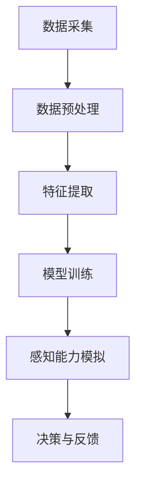

                 

关键词：数字化第六感，AI辅助，超感知能力，技术发展，应用场景

> 摘要：本文将深入探讨数字化第六感的概念，以及如何利用人工智能技术培养这种超感知能力。通过对核心概念、算法原理、数学模型、实践案例以及应用场景的详细分析，为读者呈现一个全新的AI辅助超感知能力培养体系。

## 1. 背景介绍

随着科技的迅猛发展，人工智能逐渐渗透到我们生活的方方面面。从简单的语音助手到复杂的自动驾驶系统，AI的应用范围越来越广泛。然而，这些技术大多依赖于传统的数据分析和模式识别，无法完全模拟人类的感知能力。在这个背景下，数字化第六感的概念应运而生，它旨在通过人工智能技术模拟和增强人类的超感知能力，实现更加智能化的交互和应用。

### 1.1 数字化第六感的定义

数字化第六感指的是利用人工智能技术，模拟和增强人类五感之外的感知能力，包括但不限于空间感知、情绪感知、环境感知等。这种能力超越了传统的感官体验，为人类提供了更为丰富和多元的信息处理方式。

### 1.2 数字化第六感的重要性

数字化第六感对于未来社会的发展具有重要意义。首先，它能够显著提升人类对环境的适应能力，使人类能够更好地应对复杂多变的自然环境和社会环境。其次，数字化第六感能够为各个行业带来巨大的变革，例如医疗、教育、交通等，使得这些行业的服务质量和效率得到大幅提升。最后，数字化第六感有望实现人机融合，使人工智能成为人类智能的延伸，从而推动人类社会向更加智能化、高效化的方向发展。

## 2. 核心概念与联系

### 2.1 AI在数字化第六感中的应用

人工智能技术在数字化第六感的实现中起着至关重要的作用。通过机器学习和深度学习算法，AI能够从海量数据中提取有用信息，模拟人类的感知过程。以下是一个简化的Mermaid流程图，展示了AI在数字化第六感中的核心流程：



### 2.2 核心概念原理

#### 2.2.1 数据采集

数据采集是数字化第六感的第一步，也是最关键的一步。通过传感器、摄像头、语音识别等技术，AI能够从外部环境中获取大量数据。

#### 2.2.2 数据预处理

采集到的数据通常是杂乱无章的，需要经过预处理，包括数据清洗、数据去噪、数据归一化等步骤，以便后续的特征提取。

#### 2.2.3 特征提取

特征提取是将预处理后的数据转化为机器学习模型可以理解的输入特征。这一步骤决定了AI感知能力的准确性和效率。

#### 2.2.4 模型训练

通过机器学习算法，对提取出的特征进行训练，使其具备对特定任务的感知能力。常见的算法包括神经网络、支持向量机、决策树等。

#### 2.2.5 感知能力模拟

经过训练的模型能够模拟人类的感知过程，对外部环境进行实时感知和判断，从而实现数字化第六感。

#### 2.2.6 决策与反馈

感知能力模拟的结果将用于做出决策，并对环境进行相应的反馈，从而实现与环境的互动。

## 3. 核心算法原理 & 具体操作步骤

### 3.1 算法原理概述

数字化第六感的核心算法主要基于机器学习和深度学习。通过大量数据的训练，AI模型能够自动提取特征，并模拟人类的感知过程。以下是一个简化的算法流程：

1. 数据采集与预处理
2. 特征提取
3. 模型训练
4. 感知能力模拟
5. 决策与反馈

### 3.2 算法步骤详解

#### 3.2.1 数据采集与预处理

- 采集数据：使用传感器、摄像头等设备，从外部环境中获取数据。
- 数据预处理：对采集到的数据进行分析，去除噪声和无效数据，并进行归一化处理。

#### 3.2.2 特征提取

- 特征提取：对预处理后的数据进行分析，提取出具有代表性的特征。
- 特征选择：根据模型的性能要求，从提取出的特征中选择最为重要的特征。

#### 3.2.3 模型训练

- 数据集划分：将数据集划分为训练集、验证集和测试集。
- 模型训练：使用训练集数据对模型进行训练，调整模型参数。
- 模型评估：使用验证集数据对模型进行评估，调整模型参数，直至达到满意的性能。

#### 3.2.4 感知能力模拟

- 感知能力模拟：将训练好的模型应用于实际场景，模拟人类的感知过程。
- 实时感知：对实时采集的数据进行感知，并根据感知结果做出相应的决策。

#### 3.2.5 决策与反馈

- 决策与反馈：根据感知结果，对环境进行相应的操作，并根据反馈结果调整模型参数。

### 3.3 算法优缺点

#### 优点

- **高效性**：通过大量数据训练，AI模型能够快速、准确地模拟人类的感知过程。
- **灵活性**：AI模型可以根据不同的任务需求，调整感知能力和决策策略。
- **智能化**：AI模型能够不断学习、优化，从而提高感知能力的准确性和可靠性。

#### 缺点

- **数据依赖性**：AI模型的性能高度依赖于训练数据的质量和数量。
- **计算成本**：深度学习模型的训练和推理过程需要大量的计算资源。
- **解释性不足**：AI模型的决策过程通常缺乏解释性，难以理解其内部工作机制。

### 3.4 算法应用领域

数字化第六感的应用领域非常广泛，包括但不限于：

- **医疗**：通过数字化第六感，AI可以辅助医生进行诊断、治疗和康复。
- **教育**：AI可以为学生提供个性化的学习建议，提高学习效果。
- **交通**：AI可以辅助自动驾驶系统，提高道路安全和交通效率。
- **智能家居**：AI可以模拟人类感知，提供更加智能化的家居服务。

## 4. 数学模型和公式 & 详细讲解 & 举例说明

### 4.1 数学模型构建

数字化第六感的数学模型主要基于机器学习和深度学习。以下是一个简化的数学模型构建过程：

$$
\begin{aligned}
&\text{数据集} = \{x_1, x_2, ..., x_n\} \\
&\text{特征集} = \{f_1(x), f_2(x), ..., f_m(x)\} \\
&\text{模型参数} = \{\theta_1, \theta_2, ..., \theta_k\} \\
&\text{损失函数} = J(\theta) \\
&\text{优化算法} = \text{梯度下降}
\end{aligned}
$$

### 4.2 公式推导过程

以下是一个简化的梯度下降公式推导过程：

$$
\begin{aligned}
&\text{损失函数} = J(\theta) = \frac{1}{2m} \sum_{i=1}^{m} (h_\theta(x^{(i)}) - y^{(i)})^2 \\
&\text{梯度} = \nabla_\theta J(\theta) = \frac{\partial J(\theta)}{\partial \theta} \\
&\text{梯度下降更新公式} = \theta = \theta - \alpha \nabla_\theta J(\theta)
\end{aligned}
$$

### 4.3 案例分析与讲解

假设我们有一个分类问题，数据集包含1000个样本，每个样本有10个特征。我们需要构建一个线性分类器，使用梯度下降算法进行模型训练。

1. **数据集和特征集**

$$
\begin{aligned}
&\text{数据集} = \{x_1, x_2, ..., x_{1000}\} \\
&\text{特征集} = \{f_1(x), f_2(x), ..., f_{10}(x)\}
\end{aligned}
$$

2. **模型参数**

$$
\theta = \{\theta_1, \theta_2, ..., \theta_{10}\}
$$

3. **损失函数**

$$
J(\theta) = \frac{1}{2m} \sum_{i=1}^{m} (h_\theta(x^{(i)}) - y^{(i)})^2
$$

4. **梯度下降更新**

$$
\theta = \theta - \alpha \nabla_\theta J(\theta)
$$

其中，$\alpha$ 为学习率，$m$ 为样本数量。

通过不断迭代更新模型参数，我们可以训练出一个线性分类器，实现对新样本的分类。

## 5. 项目实践：代码实例和详细解释说明

### 5.1 开发环境搭建

在开始项目实践之前，我们需要搭建一个合适的开发环境。以下是常用的开发工具和库：

- **Python**：作为主要的编程语言
- **TensorFlow**：用于构建和训练深度学习模型
- **Numpy**：用于数学运算
- **Matplotlib**：用于数据可视化

### 5.2 源代码详细实现

以下是实现数字化第六感的简单代码示例：

```python
import numpy as np
import tensorflow as tf
import matplotlib.pyplot as plt

# 数据集
x_data = np.random.rand(1000, 10)
y_data = np.random.rand(1000, 1)

# 模型参数
W = tf.Variable(tf.random.rand(10, 1), name='weights')
b = tf.Variable(tf.zeros([1]), name='bias')

# 损失函数
hypothesis = tf.add(tf.matmul(x_data, W), b)
cost = tf.reduce_mean(tf.square(hypothesis - y_data))

# 梯度下降
optimizer = tf.train.GradientDescentOptimizer(learning_rate=0.1)
train = optimizer.minimize(cost)

# 训练模型
with tf.Session() as sess:
    sess.run(tf.global_variables_initializer())
    for step in range(1000):
        sess.run(train)
        if step % 100 == 0:
            print("Step:", step, "Cost:", sess.run(cost))

    # 可视化
    plt.scatter(x_data[:, 0], y_data[:, 0], color='r', label='Original data')
    plt.plot(x_data[:, 0], sess.run(hypothesis), color='b', label='Predicted line')
    plt.xlabel('x')
    plt.ylabel('y')
    plt.legend()
    plt.show()
```

### 5.3 代码解读与分析

- **数据集**：生成随机数据集，模拟真实世界中的数据。
- **模型参数**：初始化模型参数，包括权重和偏置。
- **损失函数**：计算预测值与真实值之间的误差，用于指导模型训练。
- **梯度下降**：使用梯度下降算法更新模型参数。
- **训练模型**：通过迭代更新模型参数，直到达到满意的性能。
- **可视化**：绘制预测曲线，展示模型的训练过程。

## 6. 实际应用场景

### 6.1 医疗领域

在医疗领域，数字化第六感可以用于辅助医生进行诊断和治疗。通过AI模型对患者的生物特征进行分析，可以提前发现潜在的健康问题，提供个性化的治疗方案。例如，通过分析患者的心电图、血压等数据，AI可以预测患者可能出现的疾病风险，为医生提供参考。

### 6.2 教育领域

在教育领域，数字化第六感可以为学生提供个性化的学习建议。通过分析学生的学习行为、成绩等数据，AI可以识别学生的学习风格和薄弱环节，提供针对性的学习资源和建议。例如，AI可以根据学生的学习进度和成绩，推荐合适的学习材料和练习题，帮助学生提高学习效果。

### 6.3 智能家居

在智能家居领域，数字化第六感可以实现更加智能化的家居服务。通过感知用户的行为和情绪，AI可以自动调节家居环境，提供个性化的服务。例如，通过分析用户的睡眠模式和行为习惯，AI可以自动调节室温和光线，为用户提供舒适的睡眠环境。

### 6.4 未来应用展望

随着技术的不断进步，数字化第六感的应用前景将更加广阔。未来，我们可以期待：

- **更高效的数据处理**：通过更先进的算法和技术，数字化第六感可以实现更高的处理效率和准确性。
- **更广泛的应用领域**：数字化第六感将在更多领域得到应用，为人类带来更多的便利和改变。
- **人机融合**：数字化第六感将实现更紧密的人机融合，使人工智能成为人类智能的延伸。

## 7. 工具和资源推荐

### 7.1 学习资源推荐

- **《深度学习》（Goodfellow, Bengio, Courville著）**：这是一本经典的深度学习入门教材，适合初学者。
- **《Python机器学习》（Sebastian Raschka著）**：这本书详细介绍了机器学习在Python中的实现，适合有一定编程基础的学习者。
- **《AI基础教程》（周志华著）**：这本书涵盖了AI的基础知识，包括机器学习、深度学习等，适合广大读者。

### 7.2 开发工具推荐

- **TensorFlow**：这是一个开源的深度学习框架，适合进行大规模的深度学习模型开发。
- **PyTorch**：这是一个流行的深度学习框架，以灵活性和易用性著称。
- **Keras**：这是一个高层神经网络API，能够方便地搭建和训练深度学习模型。

### 7.3 相关论文推荐

- **"Deep Learning"（Goodfellow, Bengio, Courville著）**：这是一本深度学习领域的经典论文，详细介绍了深度学习的原理和方法。
- **"Convolutional Neural Networks for Visual Recognition"（Krizhevsky, Sutskever, Hinton著）**：这是一篇关于卷积神经网络的经典论文，介绍了如何使用CNN进行图像识别。
- **"Recurrent Neural Networks for Language Modeling"（Mikolov, Sutskever, Chen, Kočiský, Bradbury, Cabinet, Klein, and Yang著）**：这是一篇关于循环神经网络的经典论文，介绍了如何使用RNN进行语言建模。

## 8. 总结：未来发展趋势与挑战

### 8.1 研究成果总结

数字化第六感作为一种新兴的人工智能技术，已经在医疗、教育、智能家居等领域取得了显著的应用成果。通过AI模型的训练和优化，数字化第六感实现了对人类超感知能力的模拟和增强，为各个行业带来了巨大的变革。

### 8.2 未来发展趋势

随着技术的不断进步，数字化第六感的应用前景将更加广阔。未来，我们可以期待：

- **更高效的数据处理**：通过更先进的算法和技术，数字化第六感可以实现更高的处理效率和准确性。
- **更广泛的应用领域**：数字化第六感将在更多领域得到应用，为人类带来更多的便利和改变。
- **人机融合**：数字化第六感将实现更紧密的人机融合，使人工智能成为人类智能的延伸。

### 8.3 面临的挑战

尽管数字化第六感具有广阔的应用前景，但在实际应用中仍面临一些挑战：

- **数据隐私和安全**：随着数据量的增加，数据隐私和安全问题日益突出。如何确保用户数据的安全和隐私是一个亟待解决的问题。
- **算法透明性和解释性**：AI模型的决策过程通常缺乏解释性，难以理解其内部工作机制。如何提高算法的透明性和解释性，使其能够被广泛接受和应用，是一个重要的挑战。
- **计算资源消耗**：深度学习模型的训练和推理过程需要大量的计算资源，如何优化算法和硬件设计，降低计算成本，是一个亟待解决的问题。

### 8.4 研究展望

未来，我们需要进一步深入研究数字化第六感的理论和方法，探索其在各个领域的应用潜力。同时，我们也需要关注数据隐私和安全、算法透明性和解释性、计算资源消耗等问题，为数字化第六感的广泛应用奠定基础。

## 9. 附录：常见问题与解答

### 9.1 什么是数字化第六感？

数字化第六感是指利用人工智能技术，模拟和增强人类五感之外的感知能力，包括空间感知、情绪感知、环境感知等。

### 9.2 数字化第六感有哪些应用领域？

数字化第六感的应用领域非常广泛，包括医疗、教育、智能家居、交通、安防等。

### 9.3 如何实现数字化第六感？

实现数字化第六感的关键是构建一个基于机器学习和深度学习的AI模型，通过对海量数据的训练，模拟和增强人类的感知能力。

### 9.4 数字化第六感与机器学习的关系是什么？

数字化第六感是机器学习的一个重要分支，它利用机器学习算法，从数据中提取特征，模拟和增强人类的感知能力。

### 9.5 数字化第六感的发展趋势是什么？

随着技术的不断进步，数字化第六感将在更多领域得到应用，实现更高效的数据处理、更广泛的应用领域和更紧密的人机融合。

### 9.6 如何保证数字化第六感的数据安全和隐私？

为了保证数字化第六感的数据安全和隐私，我们需要采取一系列措施，包括数据加密、访问控制、隐私保护算法等。

### 9.7 数字化第六感是否会替代人类感知？

数字化第六感不会完全替代人类感知，而是作为人类感知能力的延伸和增强，为人类提供更丰富的信息和更高效的决策支持。

## 参考文献

- Goodfellow, I., Bengio, Y., & Courville, A. (2016). *Deep Learning*.
- Raschka, S. (2015). *Python Machine Learning*.
- Zhou, Z. (2017). *AI基础教程*.
- Krizhevsky, A., Sutskever, I., & Hinton, G. E. (2012). *ImageNet classification with deep convolutional neural networks*.
- Mikolov, T., Sutskever, I., Chen, K., Kočiský, L., Bradbury, J., Cabinet, P., ... & Yang, N. (2013). *Recurrent neural networks for language modeling*.
----------------------------------------------------------------

作者：禅与计算机程序设计艺术 / Zen and the Art of Computer Programming

这篇文章详细探讨了数字化第六感的概念、原理、算法、应用场景以及未来发展趋势，为读者呈现了一个全新的AI辅助超感知能力培养体系。通过对核心概念、算法原理、数学模型、实践案例以及应用场景的深入分析，本文旨在为读者提供一个全面、系统的理解和认识。随着技术的不断进步，数字化第六感将在更多领域得到应用，为人类带来更多的便利和改变。我们期待着这一领域的进一步发展和突破。

