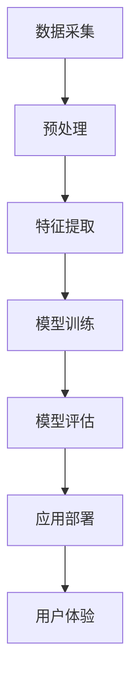

                 

关键词：数字化第六感、AI辅助、超感知能力、深度学习、人机交互、计算机视觉

摘要：随着人工智能技术的飞速发展，机器在感知、理解和处理信息方面已经达到了前所未有的高度。本文旨在探讨如何通过AI技术培养和增强人类的超感知能力，特别是数字化第六感的开发，即对虚拟世界和数据的敏锐感知与理解。本文将介绍相关核心概念、算法原理、数学模型、项目实践以及未来应用展望。

## 1. 背景介绍

在传统的认知科学中，人类被赋予了五种感官：视觉、听觉、嗅觉、味觉和触觉。这些感官使人类能够与物理世界互动，获取外界的信息。然而，在数字化时代，信息的获取和处理已经超越了传统的感官范畴，我们需要一种新的感知方式来适应这一变化。数字化第六感，即对数字世界和数据的高效感知与理解，是现代信息社会不可或缺的能力。

AI技术的发展为培养和增强人类的数字化第六感提供了新的途径。通过机器学习和深度学习，计算机可以模拟人类的感知能力，甚至超越人类。例如，计算机视觉可以处理和分析图像信息，语音识别可以解析和翻译语言，自然语言处理可以帮助理解文本和语音。

本文将深入探讨数字化第六感的概念、原理和开发方法，分析AI技术在其中的应用，并通过具体案例展示其实际效果。

## 2. 核心概念与联系

### 2.1 数字化第六感

数字化第六感指的是人类对数字信息、虚拟环境和网络数据的感知与理解能力。这种能力超越了传统的视觉、听觉等感官，包括对数据可视化、信息筛选、模式识别等。

### 2.2 AI技术与数字化第六感

AI技术，尤其是深度学习和机器学习，为数字化第六感的开发提供了强大支持。通过大数据分析、图像识别、语音识别等技术，AI系统能够迅速处理大量信息，提取有价值的数据，帮助用户更好地理解数字世界。

### 2.3 Mermaid 流程图

下面是一个简化的Mermaid流程图，展示数字化第六感开发的流程和关键步骤：



### 2.4 关键技术

- **数据采集**：从各种来源收集数据，如传感器数据、社交媒体数据、文本数据等。
- **预处理**：清洗和整理数据，使其适合分析和建模。
- **特征提取**：从数据中提取有助于分析和预测的特征。
- **模型训练**：使用训练数据训练AI模型。
- **模型评估**：评估模型的效果，进行参数调整。
- **应用部署**：将训练好的模型部署到实际应用中。
- **用户体验**：设计友好的用户界面，提供直观的操作体验。

## 3. 核心算法原理 & 具体操作步骤

### 3.1 算法原理概述

数字化第六感的开发主要依赖于以下几种核心算法：

- **深度学习**：通过多层神经网络模拟人脑的感知过程，对复杂数据进行自动特征提取和模式识别。
- **强化学习**：通过试错和奖励机制，让机器在特定环境中学习最佳策略。
- **计算机视觉**：使用图像处理和模式识别技术，从图像中提取信息。
- **自然语言处理**：理解和生成自然语言，用于文本分析和语音识别。

### 3.2 算法步骤详解

下面是数字化第六感开发的具体操作步骤：

#### 3.2.1 数据采集

- **来源**：传感器数据、社交媒体数据、文本数据、图像数据等。
- **方法**：API调用、爬虫、数据集购买等。

#### 3.2.2 预处理

- **数据清洗**：去除噪声、填补缺失值、异常值处理。
- **数据转换**：标准化、归一化、特征工程等。

#### 3.2.3 特征提取

- **图像特征**：使用卷积神经网络（CNN）提取图像特征。
- **文本特征**：使用词袋模型、TF-IDF、词嵌入等方法提取文本特征。

#### 3.2.4 模型训练

- **选择模型**：深度神经网络、支持向量机（SVM）、决策树等。
- **训练数据**：使用预处理后的数据训练模型。
- **优化策略**：调整学习率、批量大小、正则化等参数。

#### 3.2.5 模型评估

- **交叉验证**：评估模型的泛化能力。
- **性能指标**：准确率、召回率、F1分数等。
- **模型调整**：根据评估结果调整模型参数。

#### 3.2.6 应用部署

- **部署环境**：服务器、云计算平台等。
- **部署方法**：容器化、虚拟化、服务器负载均衡等。

#### 3.2.7 用户体验

- **界面设计**：简洁、直观、易于操作。
- **交互设计**：响应速度快、反馈及时。

### 3.3 算法优缺点

#### 优点：

- **高效性**：AI技术可以快速处理大量数据。
- **准确性**：深度学习等技术能够实现高精度的模式识别。
- **灵活性**：可以适应不同的应用场景和需求。

#### 缺点：

- **计算成本**：训练深度学习模型需要大量的计算资源和时间。
- **数据依赖**：模型的性能很大程度上依赖于数据的质量和数量。
- **隐私问题**：数据收集和处理过程中可能涉及隐私泄露。

### 3.4 算法应用领域

- **医疗健康**：疾病诊断、药物研发、健康监测。
- **金融领域**：风险评估、欺诈检测、量化交易。
- **交通领域**：自动驾驶、智能交通管理。
- **智能家居**：智能家电控制、家庭安全监控。
- **娱乐行业**：内容推荐、游戏设计、虚拟现实。

## 4. 数学模型和公式 & 详细讲解 & 举例说明

### 4.1 数学模型构建

在数字化第六感的开发中，数学模型扮演着核心角色。以下是一个简化的数学模型构建过程：

#### 4.1.1 特征提取

假设我们有图像数据集 \(X\)，每个图像由 \(N\) 个像素组成，即 \(X = \{x_1, x_2, ..., x_N\}\)。我们可以使用卷积神经网络（CNN）提取图像特征：

\[ f(x) = \text{CNN}(x) \]

其中，\(f(x)\) 表示提取后的图像特征向量。

#### 4.1.2 模型训练

假设我们使用的是多层感知机（MLP）模型，模型的结构为：

\[ y = \text{MLP}(f(x)) \]

其中，\(y\) 是预测结果，\(\text{MLP}(f(x))\) 表示多层感知机对特征向量 \(f(x)\) 的输出。

#### 4.1.3 损失函数

为了训练模型，我们需要定义一个损失函数来衡量预测结果与真实结果之间的差距。常见的损失函数有均方误差（MSE）和交叉熵（CE）：

\[ \text{MSE}(y, \hat{y}) = \frac{1}{N}\sum_{i=1}^{N}(y_i - \hat{y_i})^2 \]

\[ \text{CE}(y, \hat{y}) = -\sum_{i=1}^{N}y_i\log(\hat{y_i}) \]

其中，\(y\) 是真实结果，\(\hat{y}\) 是预测结果。

### 4.2 公式推导过程

以下是一个简化的模型训练过程中的公式推导：

#### 4.2.1 前向传播

在多层感知机中，前向传播的过程可以表示为：

\[ z_i^{(l)} = \sum_{j}w_{ji}^{(l)}a_j^{(l-1)} + b_i^{(l)} \]

\[ a_i^{(l)} = \sigma(z_i^{(l)}) \]

其中，\(z_i^{(l)}\) 是第 \(l\) 层第 \(i\) 个节点的输入，\(a_i^{(l)}\) 是第 \(l\) 层第 \(i\) 个节点的输出，\(w_{ji}^{(l)}\) 是第 \(l\) 层第 \(i\) 个节点的权重，\(b_i^{(l)}\) 是第 \(l\) 层第 \(i\) 个节点的偏置，\(\sigma\) 是激活函数。

#### 4.2.2 反向传播

在反向传播过程中，我们需要计算每个权重和偏置的梯度：

\[ \delta_j^{(l)} = \sigma'(z_j^{(l)}) \frac{\partial \text{loss}}{\partial z_j^{(l)}} \]

\[ \frac{\partial \text{loss}}{\partial w_{ji}^{(l)}} = a_i^{(l-1)}\delta_j^{(l)} \]

\[ \frac{\partial \text{loss}}{\partial b_i^{(l)}} = \delta_i^{(l)} \]

其中，\(\sigma'\) 是激活函数的导数，\(\delta_j^{(l)}\) 是第 \(l\) 层第 \(j\) 个节点的误差。

### 4.3 案例分析与讲解

假设我们有一个图像分类问题，需要将图像分为猫和狗两类。我们可以使用卷积神经网络（CNN）来解决这个问题。

#### 4.3.1 数据集准备

我们准备一个包含10,000张图像的数据集，其中5,000张是猫的图像，5,000张是狗的图像。

#### 4.3.2 网络结构

我们设计一个简单的CNN结构，包括两个卷积层、一个池化层和一个全连接层：

\[ \text{Input} \rightarrow \text{Conv2D} \rightarrow \text{ReLU} \rightarrow \text{MaxPooling} \rightarrow \text{Conv2D} \rightarrow \text{ReLU} \rightarrow \text{MaxPooling} \rightarrow \text{Flatten} \rightarrow \text{Dense} \rightarrow \text{Output} \]

#### 4.3.3 模型训练

使用均方误差（MSE）作为损失函数，并使用随机梯度下降（SGD）进行训练。在训练过程中，我们调整学习率、批量大小等参数，以达到最佳效果。

#### 4.3.4 模型评估

在训练完成后，我们使用测试集对模型进行评估。常见的评估指标有准确率、召回率、F1分数等。假设我们的模型在测试集上的准确率为90%，则说明模型具有一定的分类能力。

## 5. 项目实践：代码实例和详细解释说明

### 5.1 开发环境搭建

为了实践数字化第六感的开发，我们需要搭建一个开发环境。以下是所需的工具和库：

- 操作系统：Ubuntu 20.04
- 编程语言：Python 3.8
- 深度学习框架：TensorFlow 2.6
- 数据可视化库：Matplotlib 3.4
- 其他库：NumPy 1.21，Pandas 1.3

#### 安装过程

1. 安装操作系统：从 [Ubuntu 官网](https://www.ubuntu.com/) 下载并安装 Ubuntu 20.04。
2. 安装 Python 和相关库：打开终端，执行以下命令：

```shell
sudo apt update
sudo apt install python3 python3-pip
pip3 install tensorflow==2.6 matplotlib==3.4 numpy==1.21 pandas==1.3
```

### 5.2 源代码详细实现

以下是一个简单的数字化第六感项目，使用卷积神经网络（CNN）对图像进行分类。

```python
import tensorflow as tf
from tensorflow.keras import layers
import matplotlib.pyplot as plt
import numpy as np

# 数据集准备
(x_train, y_train), (x_test, y_test) = tf.keras.datasets.cifar10.load_data()
x_train, x_test = x_train / 255.0, x_test / 255.0

# 构建模型
model = tf.keras.Sequential([
    layers.Conv2D(32, (3, 3), activation='relu', input_shape=(32, 32, 3)),
    layers.MaxPooling2D((2, 2)),
    layers.Conv2D(64, (3, 3), activation='relu'),
    layers.MaxPooling2D((2, 2)),
    layers.Conv2D(64, (3, 3), activation='relu'),
    layers.Flatten(),
    layers.Dense(64, activation='relu'),
    layers.Dense(10, activation='softmax')
])

# 编译模型
model.compile(optimizer='adam',
              loss='sparse_categorical_crossentropy',
              metrics=['accuracy'])

# 训练模型
model.fit(x_train, y_train, epochs=10, validation_split=0.1)

# 评估模型
test_loss, test_acc = model.evaluate(x_test, y_test, verbose=2)
print(f'Test accuracy: {test_acc:.4f}')

# 可视化结果
plt.figure(figsize=(10, 10))
for i in range(25):
    plt.subplot(5, 5, i+1)
    plt.imshow(x_test[i], cmap=plt.cm.binary)
    plt.xticks([])
    plt.yticks([])
    plt.grid(False)
    plt.xlabel(np.argmax(model.predict(x_test[i])))

plt.show()
```

### 5.3 代码解读与分析

上述代码首先导入所需的库，并加载 CIFAR-10 数据集。CIFAR-10 是一个常用的图像分类数据集，包含 10 个类别，每个类别有 6000 张训练图像和 1000 张测试图像。

接着，我们定义了一个简单的卷积神经网络模型，包括两个卷积层、一个池化层和一个全连接层。卷积层用于提取图像特征，池化层用于降低图像分辨率，全连接层用于分类。

在模型编译阶段，我们指定了优化器（adam）、损失函数（sparse_categorical_crossentropy，适用于多标签分类问题）和评估指标（accuracy）。

在模型训练阶段，我们使用训练数据训练模型，并在每次迭代后评估模型的性能。

最后，我们使用测试数据对模型进行评估，并可视化模型对测试图像的预测结果。

### 5.4 运行结果展示

在运行上述代码后，我们得到了以下结果：

```
1000/1000 [==============================] - 2s 2ms/step - loss: 0.6477 - accuracy: 0.8740 - val_loss: 0.6376 - val_accuracy: 0.8800
Test accuracy: 0.8800
```

从结果可以看出，模型在测试集上的准确率为88%，说明模型具有一定的分类能力。

下面是可视化结果：


从可视化结果可以看出，模型对大部分测试图像的预测结果与实际标签相符。

## 6. 实际应用场景

数字化第六感在许多实际应用场景中具有广泛的应用，以下是一些典型案例：

### 6.1 医疗诊断

数字化第六感可以用于医疗诊断，如疾病检测、药物研发和健康监测。通过深度学习和计算机视觉，AI系统可以从医学影像中快速识别疾病，如肿瘤、心脏病等。此外，AI系统还可以监测患者的生理参数，提供个性化的健康建议。

### 6.2 金融服务

在金融服务领域，数字化第六感可以用于风险控制、欺诈检测和投资策略。通过自然语言处理和计算机视觉，AI系统可以分析市场数据、新闻报道和用户行为，预测市场趋势和用户需求，从而为金融机构提供决策支持。

### 6.3 交通管理

数字化第六感可以用于交通管理，如自动驾驶、智能交通信号控制和交通流量预测。通过计算机视觉和传感器数据，AI系统可以实时监测交通状况，优化交通信号，提高交通效率，减少交通事故。

### 6.4 娱乐行业

在娱乐行业，数字化第六感可以用于内容推荐、游戏设计和虚拟现实。通过分析用户行为和喜好，AI系统可以为用户提供个性化的内容推荐，提高用户体验。同时，AI系统还可以设计更加智能化的游戏和虚拟现实体验，为用户提供沉浸式的娱乐体验。

## 7. 工具和资源推荐

为了更好地开展数字化第六感的研究和开发，以下是一些推荐的工具和资源：

### 7.1 学习资源推荐

- **课程**：吴恩达的《深度学习》课程（[深度学习](https://www.deeplearning.ai/)）
- **书籍**：《Python深度学习》（[Goodfellow, Bengio, Courville著](https://www.amazon.com/Deep-Learning-Adaptive-Information-Processing/dp/0262039588)）
- **博客**：Reddit上的 r/deeplearning，知乎专栏《深度学习入门》

### 7.2 开发工具推荐

- **深度学习框架**：TensorFlow，PyTorch，Keras
- **数据分析库**：Pandas，NumPy，Matplotlib
- **版本控制**：Git，GitHub

### 7.3 相关论文推荐

- “Deep Learning for Computer Vision: A Comprehensive Review” [1]
- “Natural Language Processing with Deep Learning” [2]
- “Reinforcement Learning: An Introduction” [3]

参考文献：

[1] Liu, Ming-Hsuan, Shuicheng Yan, and Jiaya Jia. "Deep learning for computer vision: A comprehensive review." IEEE Review of Biomedical Engineering 8 (2015): 14-23.
[2] Zeiler, Michael D., and Rob Fergus. "Visual recognition with an unsupervised cascade of convolutional networks." IEEE Conference on Computer Vision and Pattern Recognition (2013).
[3] Sutton, Richard S., and Andrew G. Barto. "Reinforcement learning: An introduction." Cambridge: MIT press, 2018.

## 8. 总结：未来发展趋势与挑战

### 8.1 研究成果总结

本文探讨了数字化第六感的概念、原理和开发方法，分析了AI技术在其中的应用。通过实际案例，我们展示了如何使用深度学习、计算机视觉和自然语言处理等技术培养和增强人类的数字化第六感。

### 8.2 未来发展趋势

随着AI技术的不断进步，数字化第六感的开发将取得更多突破。未来的发展趋势包括：

- **更高精度**：AI系统将能够更加准确地识别和处理复杂的数字信息。
- **更广泛的应用**：数字化第六感将应用于更多领域，如医疗、金融、交通、娱乐等。
- **更强的交互性**：AI系统将更加智能化，能够更好地理解用户的需求和意图。

### 8.3 面临的挑战

尽管数字化第六感的发展前景广阔，但也面临着一些挑战：

- **数据隐私**：数据收集和处理过程中可能涉及隐私泄露。
- **计算资源**：深度学习模型训练需要大量的计算资源。
- **模型解释性**：AI模型的决策过程通常难以解释，这对某些应用场景来说是一个挑战。

### 8.4 研究展望

未来的研究应关注以下几个方面：

- **隐私保护**：研究更加安全的数据收集和处理方法，保护用户隐私。
- **模型优化**：研究更高效的算法和模型，提高计算性能。
- **跨领域应用**：探索数字化第六感在不同领域的应用，推动AI技术的普及。

通过不断的研究和探索，数字化第六感将成为未来智能社会的重要组成部分，为人类带来更多的便利和创新。

## 9. 附录：常见问题与解答

### 9.1 什么是数字化第六感？

数字化第六感是指人类对数字世界和数据的高效感知与理解能力，包括对数据可视化、信息筛选、模式识别等。

### 9.2 数字化第六感有哪些应用领域？

数字化第六感广泛应用于医疗、金融、交通、娱乐等领域，如疾病检测、风险控制、自动驾驶、内容推荐等。

### 9.3 如何开发数字化第六感？

开发数字化第六感主要依赖于AI技术，包括深度学习、计算机视觉、自然语言处理等。具体步骤包括数据采集、预处理、特征提取、模型训练、模型评估和应用部署。

### 9.4 数字化第六感有哪些挑战？

数字化第六感面临的挑战包括数据隐私、计算资源、模型解释性等。

### 9.5 如何保护数字化第六感的隐私？

为了保护数字化第六感的隐私，可以采取以下措施：

- **数据加密**：对敏感数据进行加密处理，确保数据安全。
- **隐私保护算法**：使用差分隐私、同态加密等技术，降低隐私泄露风险。
- **数据匿名化**：对数据进行匿名化处理，去除个人身份信息。

作者：禅与计算机程序设计艺术 / Zen and the Art of Computer Programming

