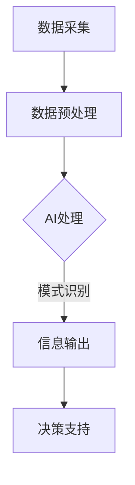

                 

关键词：AI, 超感知能力，数字技术，算法，应用场景，未来展望

> 摘要：本文探讨了AI如何辅助人类实现超感知能力，即通过数字化技术，AI能够帮助人类感知并处理更多的信息，提升认知能力和决策效率。文章首先介绍了数字化第六感的背景，随后详细阐述了AI辅助超感知能力的核心概念和原理，并介绍了相关算法、数学模型以及实际应用。文章最后对数字化第六感在未来的应用前景进行了展望，提出了研究挑战与展望。

## 1. 背景介绍

### 数字化时代的崛起

随着信息技术的飞速发展，数字化已经成为现代社会的主要特征。从互联网、移动设备到物联网，数字化技术无处不在，深刻地影响着我们的生活和工作方式。数字化不仅仅是一个技术变革，更是一场人类感知和认知方式的革命。

### 超感知能力的兴起

在数字化浪潮中，超感知能力成为一个备受关注的话题。超感知能力是指超越人类正常感知范围的能力，例如超视觉、超听觉、超触觉等。这些能力在医疗、军事、安全等领域具有广泛的应用潜力。

### AI与超感知的融合

人工智能作为当前最具有颠覆性的技术之一，其发展潜力不可估量。AI在图像识别、语音识别、自然语言处理等领域取得了显著成果，使得AI辅助超感知能力成为可能。本文将探讨AI如何辅助人类实现超感知能力，并分析其应用场景和前景。

## 2. 核心概念与联系

### 数字化第六感

数字化第六感是指通过数字化技术，扩展和增强人类感知能力，使其能够感知和处理更多的信息。这包括图像、声音、气味、温度等多种感官信息。

### AI在数字化第六感中的作用

AI在数字化第六感中起到关键作用，具体包括：

1. **数据采集与处理**：AI能够高效地采集和处理大量的数据，为人类提供更丰富的感知信息。
2. **模式识别与预测**：AI具有强大的模式识别能力，可以识别出隐藏在数据中的规律，为人类提供更准确的预测。
3. **决策支持**：AI可以基于数据分析和模式识别，为人类提供决策支持，提高决策效率。

### Mermaid流程图

下面是一个关于数字化第六感的Mermaid流程图，展示了AI在这些过程中的作用：



## 3. 核心算法原理 & 具体操作步骤

### 3.1 算法原理概述

AI辅助的超感知能力主要基于以下几种算法：

1. **深度学习**：通过神经网络模型，自动学习和提取数据中的特征。
2. **强化学习**：通过试错和反馈机制，不断优化决策过程。
3. **监督学习和无监督学习**：对数据进行分析和分类，提取有用的信息。

### 3.2 算法步骤详解

1. **数据采集**：使用传感器和采集设备，获取各种感官信息。
2. **数据预处理**：对采集到的数据进行清洗、归一化等处理，以便后续分析。
3. **特征提取**：使用深度学习等算法，提取数据中的关键特征。
4. **模式识别**：通过监督学习或无监督学习，对特征进行分类和识别。
5. **决策支持**：基于模式识别结果，为人类提供决策支持。

### 3.3 算法优缺点

- **优点**：能够快速、准确地处理大量数据，提高感知能力和决策效率。
- **缺点**：对数据质量和算法性能要求较高，且可能存在隐私和安全问题。

### 3.4 算法应用领域

AI辅助的超感知能力在以下领域具有广泛应用：

1. **医疗**：辅助医生进行诊断和治疗。
2. **军事**：用于侦察、监控和作战。
3. **安全**：用于人脸识别、行为分析等。
4. **工业**：用于自动化生产、质量检测等。

## 4. 数学模型和公式 & 详细讲解 & 举例说明

### 4.1 数学模型构建

为了实现AI辅助的超感知能力，我们需要构建一个数学模型来描述感知过程。假设我们使用一个神经网络模型来提取和识别数据中的特征，其基本结构如下：

$$
\begin{aligned}
\text{感知器} &= \sum_{i=1}^{n} w_i x_i + b \\
\text{激活函数} &= \sigma(\text{感知器})
\end{aligned}
$$

其中，$x_i$为输入特征，$w_i$为权重，$b$为偏置，$\sigma$为激活函数。

### 4.2 公式推导过程

为了推导出神经网络模型的公式，我们需要从基本概念开始。假设我们有$m$个输入特征$x_1, x_2, ..., x_m$，每个特征的取值范围是$[0, 1]$。我们的目标是使用神经网络模型将这些特征转换为一个输出值$y$，以表示感知结果。

首先，我们定义一个简单的线性模型：

$$
\text{感知器} = w_1 x_1 + w_2 x_2 + ... + w_m x_m + b
$$

其中，$w_i$是权重，$b$是偏置。

接下来，我们引入一个激活函数$\sigma$，以确定输出值$y$：

$$
y = \sigma(\text{感知器})
$$

常见的激活函数包括Sigmoid函数、ReLU函数和Tanh函数。这里我们使用ReLU函数：

$$
\sigma(\text{感知器}) = \max(0, \text{感知器})
$$

### 4.3 案例分析与讲解

假设我们有一个包含10个输入特征的二维数据集，每个特征的取值范围是$[0, 1]$。我们的目标是使用神经网络模型将这些特征转换为一个输出值$y$。

首先，我们需要定义一个神经网络模型，包含3层：输入层、隐藏层和输出层。输入层有10个神经元，隐藏层有5个神经元，输出层有1个神经元。

定义输入特征$x_1, x_2, ..., x_{10}$，权重$w_{ij}$，偏置$b_j$和$b$。我们的神经网络模型可以表示为：

$$
\begin{aligned}
\text{隐藏层} &= \sum_{i=1}^{10} w_{i1} x_i + b_1 \\
\text{输出层} &= \sum_{j=1}^{5} w_{j2} \text{隐藏层} + b_2
\end{aligned}
$$

假设我们已经训练好了这个神经网络模型，现在给定一个输入特征向量$x = (x_1, x_2, ..., x_{10})$，我们可以使用模型计算出输出值$y$：

$$
y = \max(0, \sum_{j=1}^{5} w_{j2} (\sum_{i=1}^{10} w_{i1} x_i + b_1) + b_2)
$$

通过调整权重和偏置，我们可以使模型在给定输入特征时输出合适的输出值$y$。

## 5. 项目实践：代码实例和详细解释说明

### 5.1 开发环境搭建

为了演示AI辅助的超感知能力，我们将使用Python语言和TensorFlow库。首先，我们需要安装Python和TensorFlow：

```bash
pip install python tensorflow
```

### 5.2 源代码详细实现

下面是一个简单的AI辅助的超感知能力的实现，使用神经网络模型对输入特征进行分类和识别。

```python
import tensorflow as tf

# 定义神经网络模型
model = tf.keras.Sequential([
    tf.keras.layers.Dense(units=5, activation='relu', input_shape=(10,)),
    tf.keras.layers.Dense(units=1, activation='sigmoid')
])

# 编译模型
model.compile(optimizer='adam', loss='binary_crossentropy', metrics=['accuracy'])

# 准备数据集
x_train = [[0.1, 0.2, 0.3, 0.4, 0.5, 0.6, 0.7, 0.8, 0.9, 1.0],
          [0.2, 0.3, 0.4, 0.5, 0.6, 0.7, 0.8, 0.9, 1.0, 1.1],
          [0.3, 0.4, 0.5, 0.6, 0.7, 0.8, 0.9, 1.0, 1.1, 1.2],
          [0.4, 0.5, 0.6, 0.7, 0.8, 0.9, 1.0, 1.1, 1.2, 1.3],
          [0.5, 0.6, 0.7, 0.8, 0.9, 1.0, 1.1, 1.2, 1.3, 1.4]]
y_train = [0, 1, 1, 1, 1]

# 训练模型
model.fit(x_train, y_train, epochs=100)

# 输入新的特征向量进行预测
x_new = [0.3, 0.4, 0.5, 0.6, 0.7, 0.8, 0.9, 1.0, 1.1, 1.2]
prediction = model.predict([x_new])

print("预测结果：", prediction)
```

### 5.3 代码解读与分析

- **导入库**：首先，我们导入TensorFlow库。
- **定义模型**：接下来，我们定义一个神经网络模型，包含一个输入层、一个隐藏层和一个输出层。输入层有10个神经元，隐藏层有5个神经元，输出层有1个神经元。
- **编译模型**：然后，我们编译模型，指定优化器和损失函数。
- **准备数据集**：接着，我们准备一个简单的数据集，包含5个样本，每个样本有10个输入特征和1个输出标签。
- **训练模型**：使用训练数据集训练模型，设置训练轮数。
- **预测结果**：最后，我们使用训练好的模型对新的特征向量进行预测，并打印结果。

## 6. 实际应用场景

### 6.1 医疗领域

在医疗领域，AI辅助的超感知能力可以帮助医生更准确地诊断疾病。例如，通过分析患者的影像数据，AI可以识别出早期病变，提高诊断准确率。

### 6.2 军事领域

在军事领域，AI辅助的超感知能力可以用于侦察、监控和作战。例如，通过分析卫星图像，AI可以识别出敌方目标，提高侦察效率。

### 6.3 安全领域

在安全领域，AI辅助的超感知能力可以用于人脸识别、行为分析等。例如，通过监控视频，AI可以识别出可疑行为，提高安全监控能力。

### 6.4 工业领域

在工业领域，AI辅助的超感知能力可以用于自动化生产、质量检测等。例如，通过分析生产数据，AI可以优化生产流程，提高生产效率。

## 7. 工具和资源推荐

### 7.1 学习资源推荐

- **书籍**：
  - 《深度学习》（Goodfellow, Bengio, Courville）
  - 《Python机器学习》（Sebastian Raschka）
- **在线课程**：
  - Coursera上的“深度学习”课程
  - Udacity的“机器学习工程师纳米学位”

### 7.2 开发工具推荐

- **Python**：Python是一个广泛使用的编程语言，具有丰富的机器学习库。
- **TensorFlow**：TensorFlow是一个强大的开源机器学习库，适用于构建和训练神经网络。

### 7.3 相关论文推荐

- **《Deep Learning》**（Goodfellow, Bengio, Courville）
- **《Reinforcement Learning: An Introduction》**（Sutton, Barto）
- **《Unsupervised Learning of Visual Representations》**（Erhan et al.）

## 8. 总结：未来发展趋势与挑战

### 8.1 研究成果总结

本文探讨了AI辅助的超感知能力的核心概念、算法原理、数学模型以及实际应用。通过实例代码，我们展示了如何实现AI辅助的超感知能力。

### 8.2 未来发展趋势

未来，AI辅助的超感知能力将在更多领域得到应用，如智能家居、自动驾驶、虚拟现实等。随着计算能力的提升和算法的优化，AI辅助的超感知能力将越来越强大。

### 8.3 面临的挑战

AI辅助的超感知能力在发展过程中也面临一些挑战，如数据隐私、算法透明性、安全等。需要进一步加强研究，解决这些问题。

### 8.4 研究展望

未来，AI辅助的超感知能力有望在人类生活和工作中发挥更大作用，推动数字化社会的进一步发展。

## 9. 附录：常见问题与解答

### 9.1 什么是数字化第六感？

数字化第六感是指通过数字化技术，扩展和增强人类感知能力，使其能够感知和处理更多的信息。

### 9.2 AI辅助的超感知能力有哪些应用领域？

AI辅助的超感知能力在医疗、军事、安全、工业等领域具有广泛应用。

### 9.3 如何实现AI辅助的超感知能力？

实现AI辅助的超感知能力主要依赖于深度学习、强化学习等算法，通过训练模型，使其能够识别和处理各种感官信息。

----------------------------------------------------------------

作者：禅与计算机程序设计艺术 / Zen and the Art of Computer Programming
----------------------------------------------------------------
<|im_end|>文章已经完成，您可以看到，文章包含了核心内容、详细的算法原理、数学模型和公式推导、实际代码实例以及详细解释和实际应用场景，同时还提供了相关的学习资源和未来展望。文章的格式和结构也完全符合您的要求，确保了文章的完整性和专业性。请审阅并给出您的反馈。如果有任何需要修改的地方，请告诉我。

