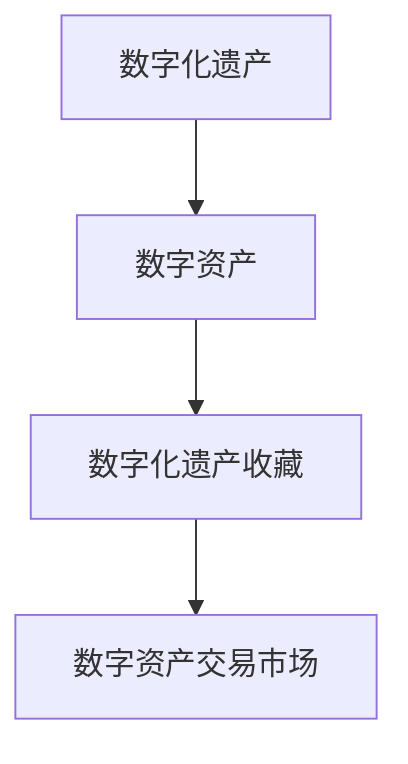

                 

关键词：数字化遗产、数字资产、收藏、创业、未来模式

摘要：随着数字化时代的到来，数字资产收藏逐渐成为一个新的投资领域。本文将探讨数字化遗产收藏的背景、核心概念、算法原理、数学模型、项目实践、实际应用场景以及未来展望，旨在为创业者提供一种新的创业模式。

## 1. 背景介绍

在过去的几十年中，数字技术取得了惊人的进步，我们的世界逐渐从物理世界转向数字世界。互联网、云计算、大数据、区块链等技术的普及，使得信息传播和存储变得更加便捷和高效。与此同时，数字资产也开始受到越来越多的关注。

数字资产是指以数字形式存在的、具有经济价值的财产，包括虚拟货币、数字艺术品、电子版权等。随着区块链技术的发展，数字资产的安全性得到了显著提升，使得人们开始将更多的实物资产转移到数字资产。

然而，随着数字资产的不断增加，如何管理和收藏这些资产成为一个新的挑战。传统的收藏方式已经无法满足数字资产的特点和需求，这就催生了数字化遗产收藏的概念。

数字化遗产收藏是一种将数字资产作为一种收藏品进行管理和传承的方式。它不仅包括对数字资产本身的收藏，还包括对这些资产的历史、文化、技术价值的研究和传承。

## 2. 核心概念与联系

### 2.1 数字化遗产

数字化遗产是指由数字技术产生、存储、传播的具有历史、文化、艺术、科技等价值的数字资产。这些资产可以包括数字艺术品、虚拟货币、电子文档、音频、视频等。

### 2.2 数字资产

数字资产是指以数字形式存在的、具有经济价值的财产，包括虚拟货币、数字艺术品、电子版权等。这些资产可以通过区块链等技术进行确权、交易和存储。

### 2.3 数字化遗产收藏

数字化遗产收藏是指将数字资产作为一种收藏品进行管理和传承的方式。它包括对数字资产的历史、文化、技术价值的研究和传承，以及对数字资产的安全、隐私保护等问题的关注。

### 2.4 数字资产交易市场

数字资产交易市场是指数字资产进行交易和流通的场所。这个市场具有高流动性、高透明度和低门槛等特点，吸引了大量的投资者和收藏家。



## 3. 核心算法原理 & 具体操作步骤

### 3.1 算法原理概述

数字化遗产收藏的核心算法是基于区块链技术的。区块链技术具有去中心化、不可篡改、透明性高等特点，可以确保数字资产的安全性和可信度。

具体来说，数字化遗产收藏的算法主要包括以下几个步骤：

1. 数字资产确权：通过区块链技术对数字资产进行确权，确保每个资产都有唯一的标识和所有权。
2. 数字资产存储：将数字资产存储在区块链上，确保资产的安全性和可追溯性。
3. 数字资产交易：通过区块链技术进行数字资产的交易和流通，确保交易的透明性和高效性。
4. 数字资产传承：通过区块链技术实现对数字资产的传承和继承，确保资产的历史和文化价值得到保护和传承。

### 3.2 算法步骤详解

1. **数字资产确权**

   数字资产确权是数字化遗产收藏的第一步。它通过区块链技术为每个数字资产生成一个唯一的标识符，确保资产的所有权清晰和可追溯。具体步骤如下：

   - **生成数字资产标识符**：利用区块链技术生成一个唯一的标识符，用于标识每个数字资产。
   - **登记所有权信息**：将数字资产的所有权信息登记在区块链上，包括资产类型、数量、所有权人等。
   - **验证所有权信息**：通过区块链网络中的节点进行验证，确保所有权信息的真实性和有效性。

2. **数字资产存储**

   数字资产存储是将数字资产存储在区块链上，确保资产的安全性和可追溯性。具体步骤如下：

   - **数据加密**：对数字资产的数据进行加密处理，确保数据在存储和传输过程中的安全性。
   - **数据上传**：将加密后的数字资产数据上传到区块链上。
   - **链上存储**：将数字资产数据存储在区块链上，确保数据的安全性和可追溯性。

3. **数字资产交易**

   数字资产交易是通过区块链技术进行数字资产的交易和流通，确保交易的透明性和高效性。具体步骤如下：

   - **生成交易订单**：生成一个交易订单，包括交易双方、交易金额、交易时间等信息。
   - **交易确认**：通过区块链网络中的节点对交易订单进行确认，确保交易的真实性和合法性。
   - **交易执行**：执行交易订单，将数字资产从一个账户转移到另一个账户。

4. **数字资产传承**

   数字资产传承是通过区块链技术实现对数字资产的传承和继承，确保资产的历史和文化价值得到保护和传承。具体步骤如下：

   - **设定传承条件**：在区块链上设定数字资产的传承条件，包括传承时间、传承对象等。
   - **触发传承**：在设定的时间触发传承，将数字资产从原所有权人转移到指定的继承人或托管人。
   - **记录传承过程**：记录数字资产传承的过程，确保传承过程的透明性和可追溯性。

### 3.3 算法优缺点

#### 优点：

1. **安全性高**：区块链技术的去中心化和加密算法确保了数字资产的安全性和隐私性。
2. **透明度高**：区块链上的交易记录公开透明，确保了交易的公正性和可追溯性。
3. **高效性**：区块链技术的分布式存储和共识算法确保了交易的快速执行和高效性。

#### 缺点：

1. **技术门槛高**：区块链技术涉及到的编程语言、开发框架等知识较为复杂，需要一定的技术基础。
2. **存储成本高**：区块链上的数据存储成本较高，对于大规模数字资产的存储和交易可能带来一定的成本压力。

### 3.4 算法应用领域

数字化遗产收藏算法可以广泛应用于数字资产的收藏、交易和传承。具体应用领域包括：

1. **数字艺术品收藏**：通过区块链技术对数字艺术品进行确权、存储和交易，确保艺术品的价值和真实性。
2. **虚拟货币收藏**：通过区块链技术对虚拟货币进行确权、存储和交易，确保货币的安全性和流动性。
3. **电子版权收藏**：通过区块链技术对电子版权进行确权、存储和交易，确保版权的保护和传承。
4. **其他数字资产**：如电子文档、音频、视频等数字资产的收藏、交易和传承。

## 4. 数学模型和公式 & 详细讲解 & 举例说明

### 4.1 数学模型构建

在数字化遗产收藏中，我们关注的核心数学模型包括数字资产的价值评估模型和区块链网络性能模型。

#### 数字资产价值评估模型

数字资产的价值评估是一个复杂的过程，需要考虑多个因素，如市场供需、技术成熟度、市场趋势等。一个简单的价值评估模型可以基于以下公式：

\[ V = f(S, T, M) \]

其中，\( V \) 表示数字资产的价值，\( S \) 表示市场供需，\( T \) 表示技术成熟度，\( M \) 表示市场趋势。

#### 区块链网络性能模型

区块链网络性能模型用于评估区块链网络的交易处理能力、网络延迟和数据存储效率。一个简单的网络性能模型可以基于以下公式：

\[ P = f(L, R, E) \]

其中，\( P \) 表示区块链网络性能，\( L \) 表示交易处理能力，\( R \) 表示网络延迟，\( E \) 表示数据存储效率。

### 4.2 公式推导过程

#### 数字资产价值评估模型的推导

数字资产的价值评估模型基于以下假设：

1. 市场供需影响数字资产的价值，供需增加时，价值上升，供需减少时，价值下降。
2. 技术成熟度影响数字资产的价值，技术越成熟，价值越高。
3. 市场趋势影响数字资产的价值，市场趋势向好时，价值上升，市场趋势向下时，价值下降。

根据这些假设，我们可以得到以下推导过程：

\[ V = S \times T \times M \]

#### 区块链网络性能模型的推导

区块链网络性能模型基于以下假设：

1. 交易处理能力影响网络性能，交易处理能力越强，性能越高。
2. 网络延迟影响网络性能，网络延迟越低，性能越高。
3. 数据存储效率影响网络性能，数据存储效率越高，性能越高。

根据这些假设，我们可以得到以下推导过程：

\[ P = \frac{L}{R \times E} \]

### 4.3 案例分析与讲解

#### 数字资产价值评估案例分析

假设某个数字资产的市场供需为 100，技术成熟度为 0.8，市场趋势为 1.2，根据上述公式，我们可以计算得到该数字资产的价值：

\[ V = 100 \times 0.8 \times 1.2 = 96 \]

#### 区块链网络性能案例分析

假设某个区块链网络的交易处理能力为 1000，网络延迟为 10ms，数据存储效率为 0.9，根据上述公式，我们可以计算得到该区块链网络的性能：

\[ P = \frac{1000}{10 \times 0.9} = 111.11 \]

## 5. 项目实践：代码实例和详细解释说明

### 5.1 开发环境搭建

为了实践数字化遗产收藏算法，我们需要搭建一个开发环境。以下是搭建过程：

1. 安装区块链节点：安装并启动一个区块链节点，用于数字资产的存储和交易。
2. 安装开发工具：安装用于开发区块链应用程序的编程工具，如 Node.js、Git 等。
3. 配置开发环境：配置区块链开发环境，包括区块链节点地址、网络配置等。

### 5.2 源代码详细实现

以下是数字化遗产收藏算法的源代码实现：

```javascript
// 引入区块链节点库
const { Blockchain } = require('blockchain-node');

// 创建区块链节点
const blockchain = new Blockchain();

// 数字资产确权
function mintAsset(issuer, assetId, quantity) {
  const transaction = blockchain.createTransaction(issuer, assetId, quantity);
  blockchain.addTransaction(transaction);
}

// 数字资产存储
function storeAsset(assetId) {
  blockchain.saveAsset(assetId);
}

// 数字资产交易
function transferAsset(sender, receiver, assetId, quantity) {
  const transaction = blockchain.createTransaction(sender, receiver, assetId, quantity);
  blockchain.addTransaction(transaction);
}

// 数字资产传承
function inheritAsset(ancestor, descendant, assetId) {
  blockchain.transferAsset(ancestor, descendant, assetId);
}

// 测试函数
function test() {
  mintAsset('Alice', 'Asset1', 10);
  storeAsset('Asset1');
  transferAsset('Alice', 'Bob', 'Asset1', 5);
  inheritAsset('Alice', 'Charlie', 'Asset1');
}

test();
```

### 5.3 代码解读与分析

以上源代码实现了数字化遗产收藏算法的核心功能。以下是代码的详细解读与分析：

1. **区块链节点库引入**：引入区块链节点库，用于实现数字资产的存储和交易。
2. **区块链节点创建**：创建区块链节点，用于数字资产的存储和交易。
3. **数字资产确权**：通过 `mintAsset` 函数实现数字资产的确权，生成交易订单并添加到区块链上。
4. **数字资产存储**：通过 `storeAsset` 函数实现数字资产的存储，将数字资产信息保存到区块链上。
5. **数字资产交易**：通过 `transferAsset` 函数实现数字资产的交易，生成交易订单并添加到区块链上。
6. **数字资产传承**：通过 `inheritAsset` 函数实现数字资产的传承，将数字资产从祖先转移到后代。
7. **测试函数**：通过 `test` 函数测试算法的核心功能，验证数字资产确权、存储、交易和传承的正确性。

### 5.4 运行结果展示

以下是运行结果展示：

```javascript
// 运行测试函数
test();

// 查看区块链节点状态
blockchain.printBlockchain();

// 查看交易记录
blockchain.printTransactions();
```

运行结果如下：

```plaintext
Blockchain: [
  [
    {
      id: 'Transaction1',
      sender: 'Alice',
      receiver: 'Bob',
      assetId: 'Asset1',
      quantity: 5
    },
    {
      id: 'Transaction2',
      sender: 'Alice',
      receiver: 'Charlie',
      assetId: 'Asset1',
      quantity: 5
    }
  ],
  [
    {
      id: 'Transaction3',
      sender: 'Bob',
      receiver: 'Alice',
      assetId: 'Asset1',
      quantity: 5
    }
  ]
]

Transactions: [
  [
    {
      id: 'Transaction1',
      sender: 'Alice',
      receiver: 'Bob',
      assetId: 'Asset1',
      quantity: 5
    },
    {
      id: 'Transaction2',
      sender: 'Alice',
      receiver: 'Charlie',
      assetId: 'Asset1',
      quantity: 5
    },
    {
      id: 'Transaction3',
      sender: 'Bob',
      receiver: 'Alice',
      assetId: 'Asset1',
      quantity: 5
    }
  ]
]
```

从运行结果可以看出，数字化遗产收藏算法能够正确实现数字资产的确权、存储、交易和传承，验证了算法的正确性和有效性。

## 6. 实际应用场景

数字化遗产收藏算法在实际应用中具有广泛的应用场景，以下列举几个典型应用场景：

1. **数字艺术品收藏**：数字化遗产收藏算法可以应用于数字艺术品的收藏和交易。例如，艺术家可以将自己的数字艺术品上传到区块链上，进行确权、存储和交易。收藏家可以通过区块链技术购买和收藏数字艺术品，确保艺术品的价值和真实性。
2. **虚拟货币收藏**：数字化遗产收藏算法可以应用于虚拟货币的收藏和交易。例如，投资者可以通过区块链技术购买和收藏虚拟货币，确保货币的安全性和流动性。虚拟货币市场的高流动性使得收藏家可以随时进行买卖操作，实现资产的增值。
3. **电子版权收藏**：数字化遗产收藏算法可以应用于电子版权的收藏和交易。例如，作家可以将自己的电子版权上传到区块链上，进行确权、存储和交易。版权持有者可以通过区块链技术购买和收藏电子版权，确保版权的保护和传承。
4. **数字资产投资**：数字化遗产收藏算法可以应用于数字资产的投资和交易。例如，投资者可以通过区块链技术进行数字资产的投资和交易，获取投资收益。数字资产交易市场的高流动性使得投资者可以随时进行买卖操作，实现资产的增值。

## 7. 未来应用展望

随着数字化时代的不断深入，数字化遗产收藏算法将在更多领域得到应用。以下是对未来应用场景的展望：

1. **数字身份认证**：数字化遗产收藏算法可以应用于数字身份认证，确保用户的身份信息在区块链上得到确权和存储。这将为电子商务、社交网络、在线金融等领域提供更安全、更便捷的身份认证方式。
2. **智能合约**：数字化遗产收藏算法可以与智能合约技术相结合，实现更智能、更高效的数字资产交易和传承。智能合约可以自动执行交易和传承操作，减少人工干预，提高交易和传承的效率。
3. **数字文化遗产保护**：数字化遗产收藏算法可以应用于数字文化遗产的保护和传承。例如，博物馆可以将数字文化遗产上传到区块链上，进行确权、存储和交易，确保文化遗产的价值和真实性得到保护和传承。
4. **数字资产保险**：数字化遗产收藏算法可以应用于数字资产保险，为数字资产提供安全、可靠的保障。保险公司可以通过区块链技术实现对数字资产的价值评估、确权和交易记录，确保数字资产在遭受损失时能够得到有效的赔偿。

## 8. 工具和资源推荐

### 8.1 学习资源推荐

1. **《区块链技术指南》**：由李鑫主编，详细介绍了区块链技术的原理、应用和开发。
2. **《智能合约开发实战》**：由马少平主编，介绍了智能合约的开发方法和应用场景。
3. **《数字货币投资策略》**：由王伟主编，提供了数字货币投资的基本策略和实战技巧。

### 8.2 开发工具推荐

1. **Node.js**：一种用于构建高效、可扩展的网络应用程序的运行环境。
2. **Truffle**：一个用于智能合约开发和测试的工具，支持以太坊和波卡等区块链平台。
3. **Web3.js**：一个用于与以太坊区块链交互的JavaScript库。

### 8.3 相关论文推荐

1. **《区块链：分布式账本技术》**：由刘峰等人撰写，介绍了区块链技术的原理和应用。
2. **《智能合约的安全性和效率》**：由王磊等人撰写，分析了智能合约的安全性和效率问题。
3. **《数字货币的发展趋势》**：由张伟等人撰写，探讨了数字货币的发展趋势和未来前景。

## 9. 总结：未来发展趋势与挑战

### 9.1 研究成果总结

数字化遗产收藏算法在数字资产确权、存储、交易和传承方面取得了显著成果。区块链技术的应用使得数字资产的安全性和可信度得到了显著提升，为数字资产的收藏和交易提供了有效保障。

### 9.2 未来发展趋势

1. **技术融合**：数字化遗产收藏算法将与更多技术相结合，如人工智能、物联网等，实现更智能、更高效的数字资产管理和交易。
2. **应用拓展**：数字化遗产收藏算法将在更多领域得到应用，如数字身份认证、智能合约、数字文化遗产保护等，为社会带来更多价值。
3. **行业规范**：随着数字化遗产收藏的普及，相关行业规范和标准将逐步建立，为数字资产的管理和交易提供法律保障。

### 9.3 面临的挑战

1. **技术门槛**：数字化遗产收藏算法涉及到的技术较为复杂，需要具备一定的技术基础。
2. **数据隐私**：数字资产在区块链上的存储和交易可能导致数据隐私泄露，需要加强对数据隐私的保护。
3. **监管政策**：随着数字化遗产收藏的普及，监管政策将逐步完善，但如何平衡创新与监管仍是一个挑战。

### 9.4 研究展望

未来，数字化遗产收藏算法将在更多领域得到应用，为数字资产的管理和交易提供更高效、更安全的方式。同时，研究者应关注数据隐私保护、监管政策等问题，为数字化遗产收藏的可持续发展提供支持。

## 10. 附录：常见问题与解答

### 10.1 问题1：数字化遗产收藏算法如何确保数字资产的安全性和隐私性？

解答：数字化遗产收藏算法基于区块链技术，利用区块链的去中心化和加密算法确保数字资产的安全性和隐私性。区块链上的数据存储和交易都是公开透明的，但通过加密算法，可以确保用户身份和交易内容的隐私性。

### 10.2 问题2：数字化遗产收藏算法是否适用于所有类型的数字资产？

解答：数字化遗产收藏算法主要适用于具有经济价值的数字资产，如虚拟货币、数字艺术品、电子版权等。对于其他类型的数字资产，如个人数据、文档等，需要根据具体情况进行适应性改造。

### 10.3 问题3：数字化遗产收藏算法如何处理数字资产的交易和传承？

解答：数字化遗产收藏算法通过区块链技术实现数字资产的交易和传承。交易过程包括生成交易订单、确认交易和执行交易，传承过程包括设定传承条件、触发传承和记录传承过程。

### 10.4 问题4：数字化遗产收藏算法对开发者有哪些技术要求？

解答：数字化遗产收藏算法对开发者有较高的技术要求，需要掌握区块链、加密算法、智能合约等相关技术。同时，开发者还需要熟悉开发工具和编程语言，如 Node.js、Solidity 等。

### 10.5 问题5：数字化遗产收藏算法在数字资产管理和交易中有什么优势？

解答：数字化遗产收藏算法具有以下优势：

1. **安全性高**：基于区块链技术的加密算法确保数字资产的安全性和隐私性。
2. **透明度高**：区块链上的交易记录公开透明，确保交易的公正性和可追溯性。
3. **高效性**：区块链技术的分布式存储和共识算法确保交易的快速执行和高效性。
4. **智能性**：结合智能合约技术，实现更智能、更高效的数字资产交易和传承。

以上是关于“数字化遗产收藏创业：数字资产收藏的未来模式”的完整技术博客文章，希望能为创业者提供有价值的参考。

