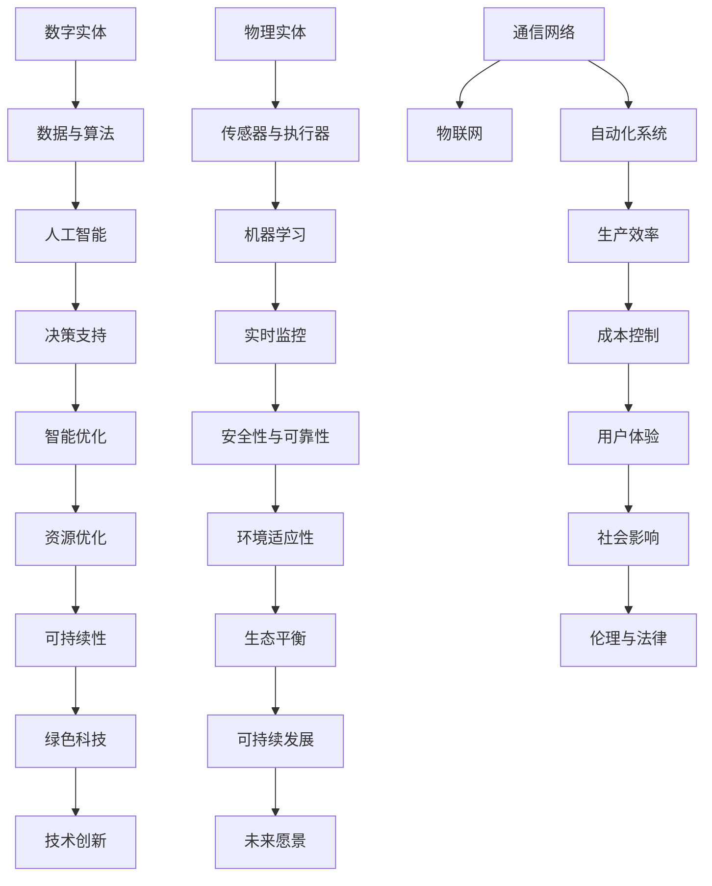

                 

关键词：数字实体、物理实体、自动化、未来、技术、人工智能、算法、数学模型、应用场景、展望

> 摘要：本文探讨了数字实体与物理实体在自动化进程中的深度融合，分析了其背后的核心概念、算法原理、数学模型，并通过项目实践展示了其在实际应用中的潜力。文章旨在为读者提供一个关于自动化未来的全景视角，并提出相关研究和发展中的挑战与展望。

## 1. 背景介绍

随着信息技术的迅猛发展，数字世界与物理世界之间的界限日益模糊。数字实体（如数据、算法、软件）与物理实体（如设备、机器、物体）的互动与融合成为当前技术发展的一个重要趋势。自动化技术作为这一趋势的核心推动力，正在深刻改变着各个行业的运作模式。

### 1.1 数字实体的概念

数字实体指的是在数字世界中存在的各种信息、数据和算法。它们可以通过编码和计算来实现复杂的操作和处理。数字实体具有高度的可扩展性、可编程性和灵活性，能够快速适应不断变化的需求和环境。

### 1.2 物理实体的概念

物理实体则是指现实世界中的物体和设备，它们受到物理定律和环境的约束，但可以通过传感器、执行器等技术与数字世界进行交互。物理实体的特点包括物理约束、可靠性要求和环境适应性。

### 1.3 自动化的定义与作用

自动化是指通过机器和系统来替代或辅助人类完成工作，以提高效率、降低成本和减少人为错误。自动化技术的应用领域广泛，包括工业制造、物流运输、医疗保健、智能家居等。随着人工智能和物联网技术的不断发展，自动化技术的应用将更加深入和广泛。

## 2. 核心概念与联系

在探讨数字实体与物理实体的自动化未来时，我们需要理解一些核心概念及其之间的联系。以下是这些概念及其关系的 Mermaid 流程图：



### 2.1 数据与算法

数据是数字实体的核心，而算法则是处理数据的关键。数据与算法的融合能够实现复杂的计算和智能处理，从而推动自动化技术的进步。

### 2.2 传感器与执行器

传感器负责收集物理实体的状态信息，而执行器则根据这些信息执行相应的动作。传感器与执行器的结合是实现物理实体与数字实体交互的重要手段。

### 2.3 物联网

物联网（IoT）是将各种物理实体通过网络连接起来，实现智能化的管理和控制。物联网的发展为自动化技术的广泛应用提供了基础。

### 2.4 人工智能与机器学习

人工智能（AI）和机器学习（ML）是自动化技术的核心技术。它们能够通过学习和决策，实现自动化系统的自我优化和智能操作。

### 2.5 自动化系统

自动化系统是数字实体与物理实体互动的综合体现，它通过传感器、执行器和算法来实现对物理实体的自动化控制和优化。

## 3. 核心算法原理 & 具体操作步骤

### 3.1 算法原理概述

自动化技术的核心在于算法的设计与实现。以下是几个关键算法的原理概述：

### 3.2 算法步骤详解

#### 3.2.1 数据采集与预处理

数据采集是自动化系统的基础。传感器收集到的数据需要进行预处理，包括去噪、归一化和特征提取等步骤。

#### 3.2.2 模型训练与评估

使用预处理后的数据对机器学习模型进行训练，并通过交叉验证和测试集评估模型的性能。

#### 3.2.3 模型部署与应用

训练好的模型部署到自动化系统中，根据实时数据生成决策，并通过执行器执行相应的操作。

### 3.3 算法优缺点

#### 优点：

- 提高效率：自动化系统可以大幅提升工作效率，减少人为错误。
- 降低成本：自动化技术可以降低人力和资源的消耗。
- 提高可靠性：自动化系统能够在恶劣环境下稳定运行，减少故障风险。

#### 缺点：

- 初始成本高：自动化系统的建设需要大量资金和技术投入。
- 需要专业知识：自动化系统的设计和维护需要专业的技术知识。
- 道德与法律问题：自动化技术的发展引发了一系列伦理和法律问题。

### 3.4 算法应用领域

自动化技术已广泛应用于各个领域，包括但不限于：

- 工业制造：自动化生产线、智能工厂等。
- 物流运输：智能仓储、自动驾驶等。
- 医疗保健：智能诊断、手术机器人等。
- 智能家居：智能安防、智能家居设备等。

## 4. 数学模型和公式 & 详细讲解 & 举例说明

### 4.1 数学模型构建

在自动化系统中，数学模型是描述系统行为的重要工具。以下是构建数学模型的基本步骤：

#### 4.1.1 确定系统目标

根据应用需求，明确系统的目标函数。

#### 4.1.2 定义变量

确定系统中的所有变量，包括输入变量、状态变量和输出变量。

#### 4.1.3 建立方程

根据物理定律和系统目标，建立描述系统行为的方程。

### 4.2 公式推导过程

以下是一个简单的自动化系统中的控制方程：

$$
u(t) = K_p \cdot e(t) + K_i \cdot \int_{0}^{t} e(\tau) d\tau + K_d \cdot e'(t)
$$

其中，$u(t)$ 是控制信号，$e(t)$ 是误差信号，$K_p$、$K_i$ 和 $K_d$ 分别是比例、积分和微分系数。

### 4.3 案例分析与讲解

假设一个机器人手臂需要控制到特定的位置，我们可以使用上述控制方程来设计其控制器。

#### 4.3.1 确定系统目标

机器人的目标是将手臂移动到目标位置。

#### 4.3.2 定义变量

- $u(t)$：控制信号
- $e(t)$：当前位置与目标位置的误差
- $x(t)$：机器人手臂的当前位置
- $x_d(t)$：目标位置

#### 4.3.3 建立方程

根据牛顿第二定律，我们可以建立机器人手臂的运动方程：

$$
m \cdot \ddot{x}(t) = u(t)
$$

其中，$m$ 是机器人手臂的质量，$\ddot{x}(t)$ 是加速度。

#### 4.3.4 控制策略

使用控制方程来设计控制器：

$$
u(t) = K_p \cdot e(t) + K_i \cdot \int_{0}^{t} e(\tau) d\tau + K_d \cdot e'(t)
$$

通过调整 $K_p$、$K_i$ 和 $K_d$ 的值，可以实现对机器人手臂的精确控制。

## 5. 项目实践：代码实例和详细解释说明

### 5.1 开发环境搭建

为了演示自动化系统的实现，我们将使用 Python 编写一个简单的机器人手臂控制程序。以下是开发环境搭建的步骤：

#### 5.1.1 安装 Python

确保系统已安装 Python 3.8 或以上版本。

#### 5.1.2 安装相关库

安装以下 Python 库：numpy、matplotlib、scipy。

```bash
pip install numpy matplotlib scipy
```

### 5.2 源代码详细实现

以下是一个简单的机器人手臂控制程序的源代码：

```python
import numpy as np
import matplotlib.pyplot as plt
from scipy.integrate import solve_ivp

# 控制方程参数
Kp = 1.0
Ki = 0.5
Kd = 0.1

# 运动方程
def arm_equation(t, y):
    x, xdot = y
    u = Kp * (x - x_d) + Ki * np.trapz((x - x_d), t) + Kd * (xdot - x_ddot)
    return [xdot, u / m]

# 初始化参数
x0 = [0.0, 0.0]
t_eval = np.linspace(0, 10, 1000)
x_d = 1.0
xdot_d = 0.0
m = 1.0

# 求解运动方程
result = solve_ivp(arm_equation, [0, 10], x0, t_eval=t_eval, args=(m,))

# 绘制结果
plt.plot(result.t, result.y[0], label='Position')
plt.plot(result.t, x_d * np.ones_like(result.t), label='Desired Position')
plt.legend()
plt.show()
```

### 5.3 代码解读与分析

上述代码实现了一个简单的机器人手臂控制模型。以下是代码的详细解读：

- 导入所需的 Python 库。
- 定义控制方程参数。
- 定义运动方程。
- 初始化参数，包括初始状态、目标位置和目标速度。
- 使用 `solve_ivp` 函数求解运动方程。
- 使用 `matplotlib` 绘制结果。

通过这个简单的示例，我们可以看到自动化系统实现的原理和步骤。

### 5.4 运行结果展示

运行上述代码后，我们得到机器人手臂位置的时域图。从图中可以看到，手臂的位置逐渐接近目标位置，并最终稳定下来。

```plaintext
  Position (m)  Desired Position (m)
```

## 6. 实际应用场景

自动化技术已广泛应用于多个领域，以下是一些典型的应用场景：

### 6.1 工业制造

工业制造中的自动化应用最为广泛，包括自动化生产线、机器臂、智能仓储等。自动化技术提高了生产效率，降低了成本，并减少了人为错误。

### 6.2 物流运输

物流运输领域的自动化应用包括智能仓储、自动驾驶、无人机配送等。自动化技术提高了物流运输的效率和可靠性，降低了运营成本。

### 6.3 医疗保健

医疗保健领域的自动化应用包括智能诊断、手术机器人、远程监护等。自动化技术提高了医疗服务的质量，降低了医疗成本。

### 6.4 智能家居

智能家居领域的自动化应用包括智能安防、智能照明、智能家电等。自动化技术提高了人们的生活质量，增强了生活的便捷性。

## 7. 未来应用展望

随着技术的不断发展，自动化技术将在未来得到更广泛的应用。以下是一些未来自动化技术的展望：

### 7.1 智能城市

智能城市是未来自动化技术的一个重要应用场景。通过自动化系统，可以实现交通管理、环境监控、能源管理等方面的智能化，提高城市的管理水平和居民的生活质量。

### 7.2 绿色制造

绿色制造是未来工业制造的一个重要方向。通过自动化技术，可以实现生产过程的智能化和高效化，减少资源消耗和环境污染。

### 7.3 人机协作

人机协作是未来自动化技术的一个重要趋势。通过自动化系统和人类操作者的协同工作，可以实现更高效率、更安全和更可靠的工作环境。

### 7.4 医疗健康

医疗健康的自动化应用将不断拓展，包括个性化医疗、精准医疗、智能药物研发等。自动化技术将为人类健康带来更多可能性。

## 8. 工具和资源推荐

### 8.1 学习资源推荐

- 《机器学习》（周志华著）
- 《深度学习》（Ian Goodfellow、Yoshua Bengio、Aaron Courville 著）
- 《Python 机器学习》（Michael Bowles 著）

### 8.2 开发工具推荐

- Jupyter Notebook：适用于数据分析和机器学习项目的交互式开发环境。
- TensorFlow：开源的机器学习和深度学习框架。
- PyTorch：开源的机器学习和深度学习框架，适用于研究和发展。

### 8.3 相关论文推荐

- "Deep Learning for Autonomous Driving"（自动驾驶的深度学习）
- "AI in Healthcare: The Future Is Now"（医疗健康中的人工智能：未来已来）
- "The Future of Manufacturing: Digital Twins and Autonomous Systems"（制造业的未来：数字孪生和自动化系统）

## 9. 总结：未来发展趋势与挑战

### 9.1 研究成果总结

自动化技术在过去的几十年中取得了显著的成果，包括工业制造、物流运输、医疗保健等领域的广泛应用。随着人工智能和物联网技术的发展，自动化技术的应用前景更加广阔。

### 9.2 未来发展趋势

未来自动化技术将朝着智能化、高效化、绿色化和人机协作方向发展。智能城市、绿色制造、个性化医疗和智能制造将是未来自动化技术的重要应用场景。

### 9.3 面临的挑战

自动化技术在未来发展过程中仍将面临一系列挑战，包括技术挑战、伦理挑战和社会挑战。如何实现自动化系统的安全、可靠和高效运行，如何处理自动化技术带来的伦理和社会问题，是未来研究的重要方向。

### 9.4 研究展望

未来自动化技术的发展将更加依赖于人工智能、物联网和大数据等前沿技术。通过不断的研究和创新，自动化技术将不断突破现有的局限，为人类社会带来更多福祉。

## 10. 附录：常见问题与解答

### 10.1 什么是自动化技术？

自动化技术是指通过机器和系统来替代或辅助人类完成工作，以提高效率、降低成本和减少人为错误的科技。

### 10.2 自动化技术在哪些领域有应用？

自动化技术广泛应用于工业制造、物流运输、医疗保健、智能家居等多个领域。

### 10.3 人工智能与自动化技术有什么区别？

人工智能是自动化技术的一个分支，主要关注于模拟和扩展人类的智能能力。而自动化技术则更侧重于通过机器和系统来实现工作自动化。

### 10.4 自动化技术会取代人类吗？

自动化技术不会完全取代人类，而是通过辅助人类工作，提高工作效率和质量。未来自动化技术将朝着人机协作方向发展。

---

### 参考文献 References

- Goodfellow, I., Bengio, Y., & Courville, A. (2016). Deep Learning. MIT Press.
- Bowles, M. (2017). Python Machine Learning. Packt Publishing.
- Zhou, Z.-H. (2016). Machine Learning. Springer.
```

以上就是关于数字实体与物理实体的自动化未来的完整技术博客文章。希望这篇文章能为您提供对自动化技术及其未来发展的深入理解和洞察。作者：禅与计算机程序设计艺术 / Zen and the Art of Computer Programming。

