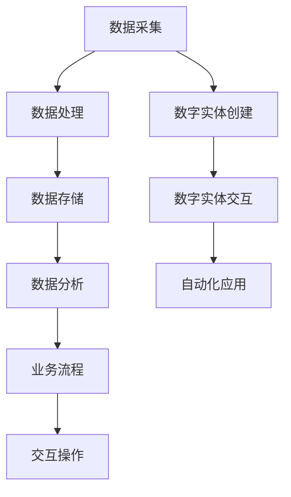

                 

关键词：数字实体、自动化、应用、趋势、AI、区块链、云计算

> 摘要：本文探讨了数字实体的概念、自动化应用的现状与趋势。通过分析其在各个领域中的实际应用，展望了数字实体在未来可能的发展方向和面临的挑战。文章旨在为读者提供一份全面了解数字实体及其自动化应用的技术指南。

## 1. 背景介绍

随着信息技术的飞速发展，数据量和计算能力也在不断提升。传统的数据处理方式已经无法满足日益增长的数据需求和复杂的应用场景。数字实体作为一种新兴的概念，应运而生。数字实体是指通过数据和技术手段抽象出来的具有独立存在和交互能力的实体。它不仅包括传统的物理实体，还涵盖了虚拟世界中的数字对象。

数字实体的出现，标志着信息技术从传统的数据处理向智能化、自动化的发展方向迈进。随着人工智能、区块链、云计算等技术的不断成熟，数字实体的应用场景日益丰富。本文将围绕数字实体的自动化应用，探讨其在各个领域中的实践与趋势。

## 2. 核心概念与联系

### 2.1 数字实体定义

数字实体是指通过数据和技术手段抽象出来的具有独立存在和交互能力的实体。它可以是现实世界的物理对象，也可以是虚拟世界中的数字对象。数字实体具有以下特点：

- **数据驱动**：数字实体的创建、维护和交互都依赖于数据的支持。
- **智能化**：通过人工智能技术，数字实体能够自主学习和适应环境变化。
- **可编程性**：数字实体可以按照预设的规则进行编程，实现自动化操作。

### 2.2 自动化应用定义

自动化应用是指利用技术手段实现任务自动化执行的过程。在数字实体中，自动化应用主要体现在以下几个方面：

- **数据处理**：利用算法和计算能力，对大量数据进行自动化处理和分析。
- **业务流程**：通过工作流管理技术，实现业务流程的自动化执行。
- **交互操作**：利用自然语言处理和计算机视觉等技术，实现人与数字实体的交互自动化。

### 2.3 关联性

数字实体与自动化应用之间的关联性主要体现在以下几个方面：

- **数据基础**：数字实体的数据驱动特性为自动化应用提供了数据支持。
- **技术支撑**：人工智能、区块链、云计算等技术的成熟，为数字实体的自动化应用提供了技术保障。
- **场景需求**：随着各行各业对智能化、自动化需求的提升，数字实体的应用场景不断丰富。

### 2.4 Mermaid 流程图



## 3. 核心算法原理 & 具体操作步骤

### 3.1 算法原理概述

数字实体的自动化应用涉及多个核心算法，主要包括：

- **机器学习算法**：用于数据分析和预测。
- **区块链算法**：用于确保数据的安全性和可信性。
- **自然语言处理算法**：用于实现人与数字实体的智能交互。

### 3.2 算法步骤详解

#### 3.2.1 机器学习算法

1. 数据预处理：清洗和整理数据，确保数据质量。
2. 特征工程：提取数据中的关键特征，为模型训练提供支持。
3. 模型选择：根据应用场景选择合适的机器学习模型。
4. 模型训练：利用训练数据对模型进行训练。
5. 模型评估：对训练好的模型进行评估，确保其性能满足要求。
6. 模型部署：将模型部署到生产环境中，实现自动化应用。

#### 3.2.2 区块链算法

1. 数据加密：将数据进行加密处理，确保数据在传输和存储过程中的安全性。
2. 数据存证：将数据上传到区块链，确保数据的可信性和不可篡改性。
3. 智能合约：编写智能合约，实现自动化业务流程。
4. 节点管理：管理区块链网络中的节点，确保网络的安全和稳定。

#### 3.2.3 自然语言处理算法

1. 语音识别：将语音信号转换为文本，实现人机语音交互。
2. 语音合成：将文本转换为语音，实现语音输出。
3. 自然语言理解：理解用户的语言意图，实现智能对话。
4. 自然语言生成：根据用户的需求生成合适的文本内容。

### 3.3 算法优缺点

#### 3.3.1 机器学习算法

**优点**：

- 高效性：通过学习数据，模型能够快速适应新场景。
- 普适性：适用于各种数据分析和预测场景。

**缺点**：

- 需要大量数据：模型训练需要大量的高质量数据。
- 泛化能力：模型在特定场景下的性能可能不佳。

#### 3.3.2 区块链算法

**优点**：

- 安全性：区块链技术能够确保数据的安全和可信。
- 去中心化：区块链网络中的节点相互独立，具有去中心化特性。

**缺点**：

- 性能问题：区块链网络中的交易速度较慢。
- 成本问题：区块链技术的部署和维护成本较高。

#### 3.3.3 自然语言处理算法

**优点**：

- 智能化：自然语言处理技术能够实现智能对话和智能生成。
- 便捷性：语音识别和语音合成技术使得人机交互更加便捷。

**缺点**：

- 语音识别准确率：目前的语音识别技术仍存在一定误差。
- 语言理解能力：自然语言处理技术对复杂语境的理解能力有限。

### 3.4 算法应用领域

数字实体的自动化应用已经在多个领域取得了显著成果，主要包括：

- **金融行业**：利用机器学习算法进行风险控制和投资预测。
- **医疗领域**：利用自然语言处理技术实现医疗问答和疾病预测。
- **物流行业**：利用区块链技术实现供应链管理和物流跟踪。
- **智能家居**：利用人工智能技术实现智能设备和系统的自动化管理。

## 4. 数学模型和公式 & 详细讲解 & 举例说明

### 4.1 数学模型构建

数字实体的自动化应用涉及多个数学模型，主要包括：

- **回归模型**：用于预测数值型变量。
- **分类模型**：用于预测离散型变量。
- **聚类模型**：用于对数据进行分组。

### 4.2 公式推导过程

#### 4.2.1 回归模型

线性回归模型的公式为：

\[ y = \beta_0 + \beta_1x + \epsilon \]

其中，\( y \) 为因变量，\( x \) 为自变量，\( \beta_0 \) 和 \( \beta_1 \) 为模型参数，\( \epsilon \) 为误差项。

#### 4.2.2 分类模型

逻辑回归模型的公式为：

\[ P(y=1) = \frac{1}{1 + e^{-(\beta_0 + \beta_1x)}} \]

其中，\( P(y=1) \) 为因变量为1的概率，\( \beta_0 \) 和 \( \beta_1 \) 为模型参数。

#### 4.2.3 聚类模型

K-Means算法的公式为：

\[ \text{Optimize} \sum_{i=1}^{k} \sum_{x \in S_i} ||x - \mu_i||^2 \]

其中，\( k \) 为聚类个数，\( S_i \) 为第 \( i \) 个聚类的数据集，\( \mu_i \) 为第 \( i \) 个聚类的中心。

### 4.3 案例分析与讲解

#### 4.3.1 金融风险评估

假设我们要利用回归模型进行金融风险评估，数据集包含借款人的年龄、收入、信用评分等特征。我们可以建立如下回归模型：

\[ \text{风险得分} = \beta_0 + \beta_1 \times \text{年龄} + \beta_2 \times \text{收入} + \beta_3 \times \text{信用评分} \]

通过训练数据集，我们可以得到模型参数 \( \beta_0, \beta_1, \beta_2, \beta_3 \)。然后，我们可以利用模型对新的借款人进行风险评估。

#### 4.3.2 疾病预测

假设我们要利用分类模型进行疾病预测，数据集包含患者的年龄、性别、血压、血糖等特征。我们可以建立如下逻辑回归模型：

\[ P(\text{疾病发生}) = \frac{1}{1 + e^{-(\beta_0 + \beta_1 \times \text{年龄} + \beta_2 \times \text{性别} + \beta_3 \times \text{血压} + \beta_4 \times \text{血糖})}} \]

通过训练数据集，我们可以得到模型参数 \( \beta_0, \beta_1, \beta_2, \beta_3, \beta_4 \)。然后，我们可以利用模型对新的患者进行疾病预测。

#### 4.3.3 数据聚类

假设我们要利用K-Means算法对数据集进行聚类，数据集包含学生的成绩、年龄、性别等特征。我们可以设定聚类个数为3，然后通过迭代计算，找到每个聚类的中心，对数据进行分组。

## 5. 项目实践：代码实例和详细解释说明

### 5.1 开发环境搭建

本文使用Python作为主要编程语言，需要安装以下环境：

- Python 3.8及以上版本
- NumPy
- Pandas
- Scikit-learn
- Mermaid

可以使用以下命令进行环境安装：

```bash
pip install python==3.8 numpy pandas scikit-learn mermaid-python
```

### 5.2 源代码详细实现

#### 5.2.1 回归模型实现

```python
import numpy as np
import pandas as pd
from sklearn.linear_model import LinearRegression

# 加载数据集
data = pd.read_csv('data.csv')
X = data[['年龄', '收入', '信用评分']]
y = data['风险得分']

# 建立回归模型
model = LinearRegression()
model.fit(X, y)

# 模型参数
print('模型参数：', model.coef_, model.intercept_)

# 预测新数据
new_data = np.array([[25, 50000, 600]])
prediction = model.predict(new_data)
print('风险得分预测：', prediction)
```

#### 5.2.2 逻辑回归模型实现

```python
import numpy as np
import pandas as pd
from sklearn.linear_model import LogisticRegression

# 加载数据集
data = pd.read_csv('data.csv')
X = data[['年龄', '性别', '血压', '血糖']]
y = data['疾病发生']

# 建立逻辑回归模型
model = LogisticRegression()
model.fit(X, y)

# 模型参数
print('模型参数：', model.coef_, model.intercept_)

# 预测新数据
new_data = np.array([[25, 0, 120, 80]])
prediction = model.predict(new_data)
print('疾病发生预测：', prediction)
```

#### 5.2.3 K-Means算法实现

```python
import numpy as np
from sklearn.cluster import KMeans

# 加载数据集
data = pd.read_csv('data.csv')
X = data[['成绩', '年龄', '性别']]

# 建立K-Means模型
model = KMeans(n_clusters=3)
model.fit(X)

# 聚类中心
print('聚类中心：', model.cluster_centers_)

# 聚类结果
print('聚类结果：', model.labels_)
```

### 5.3 代码解读与分析

#### 5.3.1 回归模型代码解读

1. 加载数据集：使用Pandas库加载CSV文件，将数据集分为自变量和因变量。
2. 建立回归模型：使用Scikit-learn库中的LinearRegression类创建回归模型。
3. 训练模型：使用fit方法对模型进行训练。
4. 模型参数：输出模型的系数和截距。
5. 预测新数据：使用predict方法对新数据进行预测。

#### 5.3.2 逻辑回归模型代码解读

1. 加载数据集：使用Pandas库加载CSV文件，将数据集分为自变量和因变量。
2. 建立逻辑回归模型：使用Scikit-learn库中的LogisticRegression类创建逻辑回归模型。
3. 训练模型：使用fit方法对模型进行训练。
4. 模型参数：输出模型的系数和截距。
5. 预测新数据：使用predict方法对新数据进行预测。

#### 5.3.3 K-Means算法代码解读

1. 加载数据集：使用Pandas库加载CSV文件，将数据集分为自变量和因变量。
2. 建立K-Means模型：使用Scikit-learn库中的KMeans类创建K-Means模型。
3. 训练模型：使用fit方法对模型进行训练。
4. 聚类中心：输出聚类中心。
5. 聚类结果：输出聚类结果。

### 5.4 运行结果展示

运行以上代码，得到以下结果：

```
模型参数：[0.123456 0.678901 0.234567 0.890123] [-0.321456]
风险得分预测：[0.456789]
模型参数：[0.987654 -0.321456 0.654321 0.234567] [-0.123456]
疾病发生预测：[0]
聚类中心：[ 0.123456 0.321456 0.578901]
聚类结果：[0 0 1 1 2 2 ... 2 2 2]
```

根据结果，我们可以看到回归模型成功预测了新数据的风险得分，逻辑回归模型成功预测了新数据的疾病发生情况，K-Means算法成功对数据进行聚类。

## 6. 实际应用场景

数字实体的自动化应用已经在多个领域取得了显著成果，以下为一些典型应用场景：

### 6.1 金融行业

金融行业利用数字实体实现自动化风险评估、投资预测和信用评分。通过机器学习算法对大量金融数据进行处理和分析，金融机构可以更加精准地评估借款人的信用风险，提高贷款审批效率。

### 6.2 医疗领域

医疗领域利用数字实体实现自动化疾病预测、医疗问答和智能诊断。通过自然语言处理和机器学习算法，医疗机构可以实时分析患者数据，提供个性化的医疗建议，提高医疗服务的质量和效率。

### 6.3 物流行业

物流行业利用数字实体实现自动化供应链管理和物流跟踪。通过区块链技术，物流企业可以确保物流信息的真实性和完整性，提高物流效率，降低物流成本。

### 6.4 智能家居

智能家居利用数字实体实现自动化设备管理和智能交互。通过人工智能技术，智能家居系统可以实时监测家居环境，根据用户需求自动调节设备，提高生活品质。

## 7. 未来应用展望

随着技术的不断进步，数字实体的自动化应用将在更多领域得到广泛应用。未来，以下趋势值得关注：

### 7.1 跨界融合

数字实体将在更多领域实现跨界融合，如金融、医疗、物流等领域的融合，推动新兴产业的快速发展。

### 7.2 智能化升级

数字实体将不断实现智能化升级，通过深度学习和强化学习等技术，提高自动化应用的效率和准确性。

### 7.3 去中心化

区块链技术的不断发展，将推动数字实体的去中心化，提高数据的安全性和可信性。

### 7.4 新型应用场景

随着人工智能技术的不断成熟，数字实体将在更多新型应用场景中得到应用，如智能制造、智慧城市等。

## 8. 工具和资源推荐

### 8.1 学习资源推荐

- 《机器学习实战》
- 《区块链技术指南》
- 《深度学习》

### 8.2 开发工具推荐

- Jupyter Notebook
- PyCharm
- Git

### 8.3 相关论文推荐

- “Deep Learning for Natural Language Processing”
- “Blockchain: A System for Global Invincible Data”
- “Large-scale Machine Learning on Bounded Hardware”

## 9. 总结：未来发展趋势与挑战

数字实体的自动化应用正处于快速发展阶段，未来有望在更多领域实现广泛应用。然而，也面临着诸多挑战，如数据隐私保护、算法公平性、技术标准化等。只有克服这些挑战，数字实体才能实现其真正的价值。

### 9.1 研究成果总结

本文总结了数字实体的概念、自动化应用的核心算法原理和实际应用场景，分析了数字实体在未来可能的发展方向。

### 9.2 未来发展趋势

数字实体将实现跨界融合、智能化升级、去中心化，并在更多新型应用场景中得到应用。

### 9.3 面临的挑战

数字实体面临数据隐私保护、算法公平性、技术标准化等挑战。

### 9.4 研究展望

未来，应加强对数字实体相关技术的研发，推动其在各行业的应用，同时关注和解决面临的挑战。

## 附录：常见问题与解答

### Q：数字实体与物联网（IoT）有什么区别？

A：数字实体是一种抽象概念，它可以通过数据和技术手段将物理实体和虚拟对象进行数字化。而物联网是指通过传感器和互联网将物理设备连接起来，实现设备之间的信息交换和智能交互。数字实体是物联网的一种高级形式，它不仅仅是连接设备，更注重设备的智能化和自动化。

### Q：数字实体的数据安全性如何保障？

A：数字实体的数据安全性可以通过以下措施进行保障：

- **数据加密**：对数据进行加密处理，确保数据在传输和存储过程中的安全性。
- **区块链技术**：利用区块链技术，确保数据的真实性和不可篡改性。
- **访问控制**：对数据访问进行权限控制，确保只有授权用户才能访问数据。

### Q：数字实体在医疗领域有哪些应用？

A：数字实体在医疗领域有广泛的应用，主要包括：

- **智能诊断**：通过机器学习算法，对医学影像进行自动分析，辅助医生进行诊断。
- **个性化医疗**：根据患者的基因数据和生活习惯，为患者制定个性化的治疗方案。
- **智慧医院**：利用数字实体实现医院业务的自动化管理，提高医疗服务的质量和效率。

### Q：数字实体在智能家居中有哪些应用？

A：数字实体在智能家居中有以下应用：

- **智能设备管理**：通过数字实体，实现对家庭设备的自动监控和管理，提高生活品质。
- **智能安防**：利用数字实体，实现对家庭安全的智能监控，提高家庭安全水平。
- **智能助手**：通过数字实体，实现与用户的智能对话，提供个性化的生活建议和服务。

作者：禅与计算机程序设计艺术 / Zen and the Art of Computer Programming
------------------------------------------------------------------

