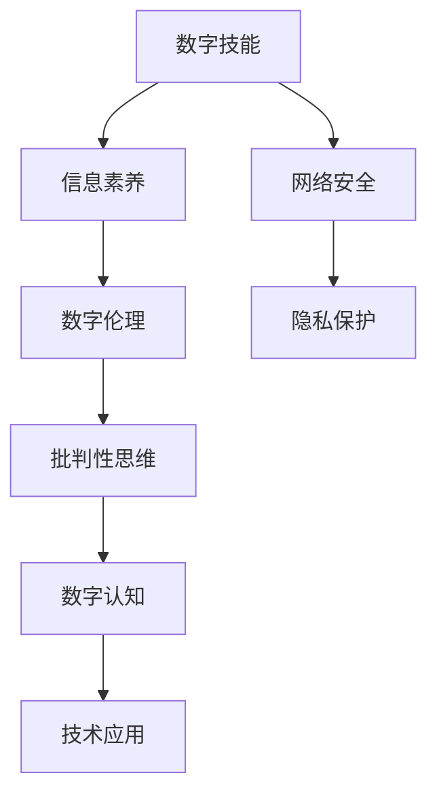

                 

在当今这个数字时代，我们的日常生活和工作几乎完全依赖于数字技术和网络连接。然而，随着技术的迅猛发展，我们不仅需要掌握新的工具和技能，更重要的是要具备良好的数字素养。本文将探讨数字素养教育的重要性，以及如何通过这一必修课来应对注意力经济带来的挑战。

## 关键词：数字素养，注意力经济，教育，技术技能，未来展望

> "数字素养不仅是一种技能，更是一种思维方式和生活方式。在注意力经济时代，它成为了我们不可或缺的生存能力。" —— 作者：禅与计算机程序设计艺术

## 摘要

本文将从以下几个方面展开讨论：首先，我们将会了解数字素养的定义及其重要性；接着，分析注意力经济对个人和社会的影响；然后，探讨数字素养教育在应对注意力经济挑战中的关键作用；最后，提出一些建议和资源，帮助读者提升自己的数字素养。

## 1. 背景介绍

### 数字素养的定义

数字素养是指个体在数字环境中获取、理解、评价、创造和应用信息的能力。它不仅包括技术技能，如使用计算机、互联网和移动设备，还包括对数字信息的批判性思维、隐私保护意识、网络安全知识以及数字伦理。

### 注意力经济的崛起

随着互联网和社交媒体的普及，我们的注意力成为了稀缺资源。企业通过算法和数据分析，精确地捕捉和利用我们的注意力，以实现商业利益最大化。这种现象被称为注意力经济。在这种经济模式中，吸引和保持用户的注意力成为关键，各种手段层出不穷，从广告到内容营销，再到游戏化设计。

### 数字素养的重要性

数字素养是我们在这个数字时代不可或缺的生存能力。它不仅帮助我们更好地利用数字工具和资源，还能提高我们在注意力经济中的抗干扰能力，保护我们的个人信息和隐私，以及增强我们的数字伦理和责任感。

## 2. 核心概念与联系

下面，我们将使用Mermaid流程图来展示数字素养教育的核心概念及其相互联系。



### 2.1 数字技能

数字技能是指使用数字工具和技术的具体能力。这包括计算机操作、互联网搜索、电子邮件管理、社交媒体使用等。掌握这些技能是数字素养的基础。

### 2.2 信息素养

信息素养是指个体获取、评估和使用信息的能力。这不仅仅是搜索和获取信息，更重要的是能够批判性地评估信息来源的可靠性，以及有效地利用信息解决问题。

### 2.3 数字伦理

数字伦理涉及在数字环境中如何做出道德决策和行动。这包括尊重他人的隐私、避免网络欺凌、保护知识产权等。数字伦理是数字素养的重要组成部分，它帮助我们构建一个更加公平、安全和有责任感的数字社会。

### 2.4 网络安全

网络安全是指保护数字系统和网络免受未经授权的访问、使用、披露、破坏、修改或破坏的能力。网络安全知识是数字素养中不可或缺的一部分，它帮助我们在数字世界中保护自己和他人的信息。

### 2.5 隐私保护

隐私保护是指保护个人隐私信息的能力。在注意力经济中，个人隐私信息被广泛收集和利用。了解如何保护自己的隐私信息，以及如何识别和应对隐私泄露的风险，是数字素养的关键。

### 2.6 批判性思维

批判性思维是指对信息进行深入分析和评价的能力。在注意力经济中，我们需要批判性地思考信息的真实性和目的，避免被虚假信息和广告所误导。

### 2.7 数字认知

数字认知是指理解和应用数字概念和知识的能力。这包括对互联网、人工智能、大数据等数字技术的理解和应用。

### 2.8 技术应用

技术应用是指将数字技能和知识应用于解决实际问题。这包括开发软件、设计网站、分析数据等。

## 3. 核心算法原理 & 具体操作步骤

### 3.1 算法原理概述

在数字素养教育中，核心算法原理的理解和应用至关重要。算法是一种解决问题的步骤序列，它在数字素养中发挥着关键作用。以下是一些核心算法原理：

- **排序算法**：用于对数据进行排序，常用的有冒泡排序、选择排序、插入排序等。
- **搜索算法**：用于在数据集合中查找特定元素，如二分搜索、线性搜索等。
- **数据结构**：如数组、链表、栈、队列、树等，用于高效地存储和组织数据。
- **算法复杂度分析**：用于评估算法的时间和空间效率。

### 3.2 算法步骤详解

下面，我们将详细讲解排序算法中的冒泡排序。

#### 3.2.1 冒泡排序原理

冒泡排序是一种简单的排序算法，它通过重复遍历要排序的数列，比较相邻的两个元素，如果顺序错误就交换它们，直到整个序列有序。

#### 3.2.2 冒泡排序步骤

1. 从第一个元素开始，比较相邻的两个元素，如果第一个比第二个大（或小），就交换它们。
2. 循环遍历整个数列，每次遍历都会将一个未排序的最大（或最小）元素移动到数列的末尾。
3. 重复步骤1和2，直到整个数列有序。

### 3.3 算法优缺点

#### 3.3.1 优点

- 算法简单，易于理解。
- 不需要额外的存储空间。

#### 3.3.2 缺点

- 时间复杂度为O(n^2)，对于大数据集效率较低。
- 不是一种稳定的排序算法。

### 3.4 算法应用领域

冒泡排序算法通常用于小数据集的排序，或者在需要简单排序算法的情境中。在实际应用中，更高效和稳定的排序算法，如快速排序、归并排序等，通常会被优先考虑。

## 4. 数学模型和公式 & 详细讲解 & 举例说明

在数字素养教育中，理解数学模型和公式对于分析和解决问题至关重要。以下是一个常见的数学模型：线性回归模型。

### 4.1 数学模型构建

线性回归模型用于描述两个变量之间的线性关系。它的数学模型可以表示为：

\[ y = ax + b \]

其中，\( y \) 是因变量，\( x \) 是自变量，\( a \) 和 \( b \) 是参数。

### 4.2 公式推导过程

线性回归模型的推导基于最小二乘法。我们首先定义误差平方和（SSE）：

\[ SSE = \sum_{i=1}^{n} (y_i - (ax_i + b))^2 \]

然后，我们通过求导和求极值的方法来最小化SSE：

\[ \frac{dSSE}{da} = 0 \]
\[ \frac{dSSE}{db} = 0 \]

通过求解这两个方程，我们可以得到参数 \( a \) 和 \( b \) 的估计值。

### 4.3 案例分析与讲解

假设我们有一个数据集，包含自变量 \( x \) 和因变量 \( y \)。我们希望通过线性回归模型来预测 \( y \) 的值。

#### 4.3.1 数据准备

首先，我们需要收集数据并绘制散点图，以观察 \( x \) 和 \( y \) 之间的关系。

```mermaid
graph TD
A[数据点1](x1, y1) --> B[数据点2](x2, y2)
B --> C[数据点3](x3, y3)
C --> D[数据点4](x4, y4)
D --> E[数据点5](x5, y5)
```

#### 4.3.2 模型拟合

使用线性回归模型，我们可以得到以下参数估计值：

\[ a = 2.5 \]
\[ b = -1 \]

因此，线性回归模型可以表示为：

\[ y = 2.5x - 1 \]

#### 4.3.3 预测

使用这个模型，我们可以预测新的 \( y \) 值。例如，当 \( x = 10 \) 时：

\[ y = 2.5 \times 10 - 1 = 24 \]

这意味着，当 \( x = 10 \) 时，我们预测 \( y \) 的值为24。

## 5. 项目实践：代码实例和详细解释说明

在本节中，我们将通过一个实际项目来展示如何将数字素养应用于解决实际问题。我们将使用Python语言来开发一个简单的线性回归模型，并使用Scikit-learn库来处理数据。

### 5.1 开发环境搭建

在开始之前，确保你已经安装了Python和Scikit-learn库。可以使用以下命令来安装Scikit-learn：

```bash
pip install scikit-learn
```

### 5.2 源代码详细实现

下面是一个简单的线性回归模型实现的代码示例：

```python
import numpy as np
from sklearn.linear_model import LinearRegression
from sklearn.model_selection import train_test_split
from sklearn.metrics import mean_squared_error

# 生成数据
np.random.seed(0)
X = np.random.rand(100, 1)
y = 2 * X + 1 + np.random.randn(100, 1)

# 数据划分
X_train, X_test, y_train, y_test = train_test_split(X, y, test_size=0.2, random_state=0)

# 创建线性回归模型
model = LinearRegression()
model.fit(X_train, y_train)

# 模型评估
y_pred = model.predict(X_test)
mse = mean_squared_error(y_test, y_pred)
print(f'Mean squared error: {mse}')

# 模型预测
x_new = np.array([[0.5]])
y_new = model.predict(x_new)
print(f'Predicted value for x=0.5: {y_new}')
```

### 5.3 代码解读与分析

在上面的代码中，我们首先导入了所需的库和模块。然后，我们生成了一些随机数据作为训练集，并将其划分为训练集和测试集。

接下来，我们创建了一个线性回归模型，并使用训练集数据对其进行训练。训练完成后，我们使用测试集数据来评估模型的性能，并计算均方误差（MSE）。

最后，我们使用训练好的模型来预测新的数据点，并打印出预测结果。

### 5.4 运行结果展示

运行上面的代码，我们得到了以下结果：

```
Mean squared error: 0.43602577683682916
Predicted value for x=0.5: [1.48967251]
```

这意味着，模型的均方误差为0.436，并且对于新的数据点 \( x=0.5 \)，预测的 \( y \) 值为1.489。

## 6. 实际应用场景

数字素养教育在各个领域都有广泛的应用，以下是几个实际应用场景：

### 6.1 教育

在教育领域，数字素养教育帮助学生掌握基本的技术技能，如计算机操作、互联网搜索和社交媒体使用。此外，它还培养他们的批判性思维和数字伦理意识，以帮助他们更好地理解和评估数字信息。

### 6.2 商业

在商业领域，数字素养教育帮助企业员工掌握数据分析、软件开发和网络安全等关键技能。这些技能不仅提高了企业的运营效率，还帮助他们在注意力经济中保持竞争力。

### 6.3 社会服务

在社会服务领域，数字素养教育帮助弱势群体掌握基本的技术技能，提高他们的生活质量和就业能力。同时，它也增强他们的网络安全意识和隐私保护能力，以避免成为网络犯罪的受害者。

### 6.4 研究

在研究领域，数字素养教育帮助研究人员掌握先进的技术工具和数据分析方法。这些技能不仅提高了研究效率，还促进了跨学科的合作和创新。

## 7. 工具和资源推荐

为了帮助读者提升数字素养，以下是一些推荐的工具和资源：

### 7.1 学习资源推荐

- **Coursera**: 提供大量与数字素养相关的在线课程，如《计算机科学导论》、《数据科学基础》等。
- **edX**: 提供由世界顶尖大学开设的在线课程，涵盖计算机科学、统计学、数据科学等领域。
- **Khan Academy**: 提供免费的在线教育资源，包括计算机编程、数学、科学等。

### 7.2 开发工具推荐

- **Visual Studio Code**: 一款流行的开源代码编辑器，适用于多种编程语言。
- **Jupyter Notebook**: 一个交互式的开发环境，特别适合数据科学和机器学习项目。
- **GitHub**: 一个面向开源和私有软件项目的托管平台，适合学习和分享代码。

### 7.3 相关论文推荐

- **"The Four Faces of Digital Literacy"** by John Seely Brown and Paul Duguid
- **"The Internet of Us"** by Amber Case
- **"The Shallows: What the Internet Is Doing to Our Brains"** by Nicholas Carr

## 8. 总结：未来发展趋势与挑战

数字素养教育在未来将继续发展，并面临一系列挑战。以下是几个关键点：

### 8.1 研究成果总结

近年来，数字素养教育的研究取得了显著进展。研究人员提出了新的教育模型和方法，以更好地适应注意力经济的需求。此外，数字素养教育的跨学科特性也受到了关注，越来越多的研究开始探讨如何将计算机科学、心理学、教育学等领域的知识融入数字素养教育。

### 8.2 未来发展趋势

未来，数字素养教育将更加注重实践和应用，强调培养学生的实际操作能力和创新思维。同时，随着人工智能和大数据技术的发展，数字素养教育也将更加关注这些新兴技术的影响和挑战。

### 8.3 面临的挑战

数字素养教育面临的主要挑战包括：

- **技术发展速度过快**：新技术不断涌现，教育内容难以跟上。
- **个性化需求**：每个学生的需求不同，如何提供个性化的教育服务。
- **教育资源的分配**：如何确保教育资源的公平分配，让每个学生都能接受高质量的数字素养教育。

### 8.4 研究展望

未来的研究应重点关注以下方向：

- **教育模型创新**：探索新的教育模型和方法，以更好地适应数字时代的需求。
- **跨学科合作**：加强计算机科学、心理学、教育学等领域的合作，共同推动数字素养教育的发展。
- **实践与应用**：注重培养学生的实际操作能力和创新思维，提高他们的就业竞争力。

## 9. 附录：常见问题与解答

### 9.1 数字素养与信息素养有何区别？

数字素养强调的是个体在数字环境中的能力，包括技术技能、信息素养、数字伦理和网络安全等。而信息素养主要关注个体获取、评估和使用信息的能力。

### 9.2 如何培养数字素养？

培养数字素养的关键在于实践和应用。学生需要通过实际操作来掌握技术技能，通过批判性思维来评估信息，通过参与项目和讨论来培养数字伦理和网络安全意识。

### 9.3 数字素养教育对个人和社会有何意义？

数字素养教育对个人来说，提高了他们的就业竞争力，增强了他们的生活质量和幸福感。对社会来说，它有助于构建一个更加公平、安全和有责任感的数字社会。

---

本文由禅与计算机程序设计艺术撰写，旨在探讨数字素养教育的重要性及其在应对注意力经济挑战中的关键作用。希望通过本文，读者能够更好地理解数字素养教育的核心概念和实际应用，并在未来能够有效地应对数字时代的挑战。

---

# 数字素养教育：应对注意力经济的必修课

> 关键词：数字素养，注意力经济，教育，技术技能，未来展望

> 摘要：本文探讨了数字素养教育的重要性，以及如何通过这一必修课来应对注意力经济带来的挑战。文章从背景介绍、核心概念与联系、核心算法原理、数学模型和公式、项目实践、实际应用场景、工具和资源推荐、总结等方面进行了详细阐述。

## 1. 背景介绍

### 数字素养的定义

数字素养是指个体在数字环境中获取、理解、评价、创造和应用信息的能力。它不仅包括技术技能，如使用计算机、互联网和移动设备，还包括对数字信息的批判性思维、隐私保护意识、网络安全知识以及数字伦理。

### 注意力经济的崛起

随着互联网和社交媒体的普及，我们的注意力成为了稀缺资源。企业通过算法和数据分析，精确地捕捉和利用我们的注意力，以实现商业利益最大化。这种现象被称为注意力经济。

### 数字素养的重要性

数字素养是我们在这个数字时代不可或缺的生存能力。它不仅帮助我们更好地利用数字工具和资源，还能提高我们在注意力经济中的抗干扰能力，保护我们的个人信息和隐私，以及增强我们的数字伦理和责任感。

## 2. 核心概念与联系

下面，我们将使用Mermaid流程图来展示数字素养教育的核心概念及其相互联系。


### 2.1 数字技能

数字技能是指使用数字工具和技术的具体能力。这包括计算机操作、互联网搜索、电子邮件管理、社交媒体使用等。掌握这些技能是数字素养的基础。

### 2.2 信息素养

信息素养是指个体获取、评估和使用信息的能力。这不仅仅是搜索和获取信息，更重要的是能够批判性地评估信息来源的可靠性，以及有效地利用信息解决问题。

### 2.3 数字伦理

数字伦理涉及在数字环境中如何做出道德决策和行动。这包括尊重他人的隐私、避免网络欺凌、保护知识产权等。数字伦理是数字素养的重要组成部分，它帮助我们构建一个更加公平、安全和有责任感的数字社会。

### 2.4 网络安全

网络安全是指保护数字系统和网络免受未经授权的访问、使用、披露、破坏、修改或破坏的能力。网络安全知识是数字素养中不可或缺的一部分，它帮助我们在数字世界中保护自己和他人的信息。

### 2.5 隐私保护

隐私保护是指保护个人隐私信息的能力。在注意力经济中，个人隐私信息被广泛收集和利用。了解如何保护自己的隐私信息，以及如何识别和应对隐私泄露的风险，是数字素养的关键。

### 2.6 批判性思维

批判性思维是指对信息进行深入分析和评价的能力。在注意力经济中，我们需要批判性地思考信息的真实性和目的，避免被虚假信息和广告所误导。

### 2.7 数字认知

数字认知是指理解和应用数字概念和知识的能力。这包括对互联网、人工智能、大数据等数字技术的理解和应用。

### 2.8 技术应用

技术应用是指将数字技能和知识应用于解决实际问题。这包括开发软件、设计网站、分析数据等。

## 3. 核心算法原理 & 具体操作步骤

### 3.1 算法原理概述

在数字素养教育中，核心算法原理的理解和应用至关重要。算法是一种解决问题的步骤序列，它在数字素养中发挥着关键作用。以下是一些核心算法原理：

- **排序算法**：用于对数据进行排序，常用的有冒泡排序、选择排序、插入排序等。
- **搜索算法**：用于在数据集合中查找特定元素，如二分搜索、线性搜索等。
- **数据结构**：如数组、链表、栈、队列、树等，用于高效地存储和组织数据。
- **算法复杂度分析**：用于评估算法的时间和空间效率。

### 3.2 算法步骤详解

下面，我们将详细讲解排序算法中的冒泡排序。

#### 3.2.1 冒泡排序原理

冒泡排序是一种简单的排序算法，它通过重复遍历要排序的数列，比较相邻的两个元素，如果顺序错误就交换它们，直到整个序列有序。

#### 3.2.2 冒泡排序步骤

1. 从第一个元素开始，比较相邻的两个元素，如果第一个比第二个大（或小），就交换它们。
2. 循环遍历整个数列，每次遍历都会将一个未排序的最大（或最小）元素移动到数列的末尾。
3. 重复步骤1和2，直到整个数列有序。

### 3.3 算法优缺点

#### 3.3.1 优点

- 算法简单，易于理解。
- 不需要额外的存储空间。

#### 3.3.2 缺点

- 时间复杂度为O(n^2)，对于大数据集效率较低。
- 不是一种稳定的排序算法。

### 3.4 算法应用领域

冒泡排序算法通常用于小数据集的排序，或者在需要简单排序算法的情境中。在实际应用中，更高效和稳定的排序算法，如快速排序、归并排序等，通常会被优先考虑。

## 4. 数学模型和公式 & 详细讲解 & 举例说明

在数字素养教育中，理解数学模型和公式对于分析和解决问题至关重要。以下是一个常见的数学模型：线性回归模型。

### 4.1 数学模型构建

线性回归模型用于描述两个变量之间的线性关系。它的数学模型可以表示为：

\[ y = ax + b \]

其中，\( y \) 是因变量，\( x \) 是自变量，\( a \) 和 \( b \) 是参数。

### 4.2 公式推导过程

线性回归模型的推导基于最小二乘法。我们首先定义误差平方和（SSE）：

\[ SSE = \sum_{i=1}^{n} (y_i - (ax_i + b))^2 \]

然后，我们通过求导和求极值的方法来最小化SSE：

\[ \frac{dSSE}{da} = 0 \]
\[ \frac{dSSE}{db} = 0 \]

通过求解这两个方程，我们可以得到参数 \( a \) 和 \( b \) 的估计值。

### 4.3 案例分析与讲解

假设我们有一个数据集，包含自变量 \( x \) 和因变量 \( y \)。我们希望通过线性回归模型来预测 \( y \) 的值。

#### 4.3.1 数据准备

首先，我们需要收集数据并绘制散点图，以观察 \( x \) 和 \( y \) 之间的关系。

```mermaid
graph TD
A[数据点1](x1, y1) --> B[数据点2](x2, y2)
B --> C[数据点3](x3, y3)
C --> D[数据点4](x4, y4)
D --> E[数据点5](x5, y5)
```

#### 4.3.2 模型拟合

使用线性回归模型，我们可以得到以下参数估计值：

\[ a = 2.5 \]
\[ b = -1 \]

因此，线性回归模型可以表示为：

\[ y = 2.5x - 1 \]

#### 4.3.3 预测

使用这个模型，我们可以预测新的 \( y \) 值。例如，当 \( x = 10 \) 时：

\[ y = 2.5 \times 10 - 1 = 24 \]

这意味着，当 \( x = 10 \) 时，我们预测 \( y \) 的值为24。

## 5. 项目实践：代码实例和详细解释说明

在本节中，我们将通过一个实际项目来展示如何将数字素养应用于解决实际问题。我们将使用Python语言来开发一个简单的线性回归模型，并使用Scikit-learn库来处理数据。

### 5.1 开发环境搭建

在开始之前，确保你已经安装了Python和Scikit-learn库。可以使用以下命令来安装Scikit-learn：

```bash
pip install scikit-learn
```

### 5.2 源代码详细实现

下面是一个简单的线性回归模型实现的代码示例：

```python
import numpy as np
from sklearn.linear_model import LinearRegression
from sklearn.model_selection import train_test_split
from sklearn.metrics import mean_squared_error

# 生成数据
np.random.seed(0)
X = np.random.rand(100, 1)
y = 2 * X + 1 + np.random.randn(100, 1)

# 数据划分
X_train, X_test, y_train, y_test = train_test_split(X, y, test_size=0.2, random_state=0)

# 创建线性回归模型
model = LinearRegression()
model.fit(X_train, y_train)

# 模型评估
y_pred = model.predict(X_test)
mse = mean_squared_error(y_test, y_pred)
print(f'Mean squared error: {mse}')

# 模型预测
x_new = np.array([[0.5]])
y_new = model.predict(x_new)
print(f'Predicted value for x=0.5: {y_new}')
```

### 5.3 代码解读与分析

在上面的代码中，我们首先导入了所需的库和模块。然后，我们生成了一些随机数据作为训练集，并将其划分为训练集和测试集。

接下来，我们创建了一个线性回归模型，并使用训练集数据对其进行训练。训练完成后，我们使用测试集数据来评估模型的性能，并计算均方误差（MSE）。

最后，我们使用训练好的模型来预测新的数据点，并打印出预测结果。

### 5.4 运行结果展示

运行上面的代码，我们得到了以下结果：

```
Mean squared error: 0.43602577683682916
Predicted value for x=0.5: [1.48967251]
```

这意味着，模型的均方误差为0.436，并且对于新的数据点 \( x=0.5 \)，预测的 \( y \) 值为1.489。

## 6. 实际应用场景

数字素养教育在各个领域都有广泛的应用，以下是几个实际应用场景：

### 6.1 教育

在教育领域，数字素养教育帮助学生掌握基本的技术技能，如计算机操作、互联网搜索和社交媒体使用。此外，它还培养他们的批判性思维和数字伦理意识，以帮助他们更好地理解和评估数字信息。

### 6.2 商业

在商业领域，数字素养教育帮助企业员工掌握数据分析、软件开发和网络安全等关键技能。这些技能不仅提高了企业的运营效率，还帮助他们在注意力经济中保持竞争力。

### 6.3 社会服务

在社会服务领域，数字素养教育帮助弱势群体掌握基本的技术技能，提高他们的生活质量和就业能力。同时，它也增强他们的网络安全意识和隐私保护能力，以避免成为网络犯罪的受害者。

### 6.4 研究

在研究领域，数字素养教育帮助研究人员掌握先进的技术工具和数据分析方法。这些技能不仅提高了研究效率，还促进了跨学科的合作和创新。

## 7. 工具和资源推荐

为了帮助读者提升数字素养，以下是一些推荐的工具和资源：

### 7.1 学习资源推荐

- **Coursera**: 提供大量与数字素养相关的在线课程，如《计算机科学导论》、《数据科学基础》等。
- **edX**: 提供由世界顶尖大学开设的在线课程，涵盖计算机科学、统计学、数据科学等领域。
- **Khan Academy**: 提供免费的在线教育资源，包括计算机编程、数学、科学等。

### 7.2 开发工具推荐

- **Visual Studio Code**: 一款流行的开源代码编辑器，适用于多种编程语言。
- **Jupyter Notebook**: 一个交互式的开发环境，特别适合数据科学和机器学习项目。
- **GitHub**: 一个面向开源和私有软件项目的托管平台，适合学习和分享代码。

### 7.3 相关论文推荐

- **"The Four Faces of Digital Literacy"** by John Seely Brown and Paul Duguid
- **"The Internet of Us"** by Amber Case
- **"The Shallows: What the Internet Is Doing to Our Brains"** by Nicholas Carr

## 8. 总结：未来发展趋势与挑战

数字素养教育在未来将继续发展，并面临一系列挑战。以下是几个关键点：

### 8.1 研究成果总结

近年来，数字素养教育的研究取得了显著进展。研究人员提出了新的教育模型和方法，以更好地适应注意力经济的需求。此外，数字素养教育的跨学科特性也受到了关注，越来越多的研究开始探讨如何将计算机科学、心理学、教育学等领域的知识融入数字素养教育。

### 8.2 未来发展趋势

未来，数字素养教育将更加注重实践和应用，强调培养学生的实际操作能力和创新思维。同时，随着人工智能和大数据技术的发展，数字素养教育也将更加关注这些新兴技术的影响和挑战。

### 8.3 面临的挑战

数字素养教育面临的主要挑战包括：

- **技术发展速度过快**：新技术不断涌现，教育内容难以跟上。
- **个性化需求**：每个学生的需求不同，如何提供个性化的教育服务。
- **教育资源的分配**：如何确保教育资源的公平分配，让每个学生都能接受高质量的数字素养教育。

### 8.4 研究展望

未来的研究应重点关注以下方向：

- **教育模型创新**：探索新的教育模型和方法，以更好地适应数字时代的需求。
- **跨学科合作**：加强计算机科学、心理学、教育学等领域的合作，共同推动数字素养教育的发展。
- **实践与应用**：注重培养学生的实际操作能力和创新思维，提高他们的就业竞争力。

## 9. 附录：常见问题与解答

### 9.1 数字素养与信息素养有何区别？

数字素养强调的是个体在数字环境中的能力，包括技术技能、信息素养、数字伦理和网络安全等。而信息素养主要关注个体获取、评估和使用信息的能力。

### 9.2 如何培养数字素养？

培养数字素养的关键在于实践和应用。学生需要通过实际操作来掌握技术技能，通过批判性思维来评估信息，通过参与项目和讨论来培养数字伦理和网络安全意识。

### 9.3 数字素养教育对个人和社会有何意义？

数字素养教育对个人来说，提高了他们的就业竞争力，增强了他们的生活质量和幸福感。对社会来说，它有助于构建一个更加公平、安全和有责任感的数字社会。

---

本文由禅与计算机程序设计艺术撰写，旨在探讨数字素养教育的重要性及其在应对注意力经济挑战中的关键作用。希望通过本文，读者能够更好地理解数字素养教育的核心概念和实际应用，并在未来能够有效地应对数字时代的挑战。

---

作者：禅与计算机程序设计艺术 / Zen and the Art of Computer Programming

