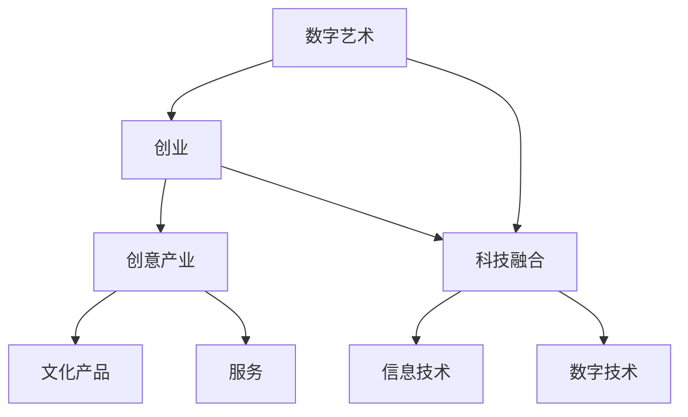

                 

 关键词：数字艺术、创业、科技融合、创意产业、技术突破、商业模型、艺术创新、人机协作、文化传承

> 摘要：本文将探讨数字艺术创业的兴起及其背后的科技驱动力，分析艺术与科技融合的创新模式，阐述数字艺术创业的核心概念、算法原理、数学模型及其应用实践。通过深入研究和案例分析，本文旨在为数字艺术创业提供理论指导和实践路径，揭示其未来发展趋势和面临的挑战。

## 1. 背景介绍

随着信息技术的飞速发展，数字艺术已经逐渐成为一种重要的创意形式。数字艺术不仅改变了传统艺术的表现方式，也为艺术家提供了更多的创作工具和平台。在这个数字化时代，艺术与科技的融合成为一种趋势，激发了无数创业者的灵感，催生了数字艺术创业的热潮。

数字艺术创业的兴起源于以下几个方面：

1. **技术进步**：计算能力的提升和数字化技术的普及为数字艺术创作提供了强大的支持，使得艺术家能够利用计算机软件和硬件进行创作，实现更丰富的视觉效果和互动体验。
2. **市场需求**：随着人们对数字化内容需求的增加，数字艺术作品在市场上的价值逐渐凸显。数字艺术创业成为创业者关注的焦点，吸引了大量资本和人才的投入。
3. **创新模式**：数字艺术创业不仅限于传统艺术的数字化，更涉及艺术与科技的融合，如虚拟现实（VR）、增强现实（AR）、人工智能（AI）等技术的应用，为艺术创作带来了前所未有的可能性。

本文将从以下几个方面展开讨论：

1. **核心概念与联系**：介绍数字艺术创业中的核心概念和其相互关系。
2. **核心算法原理与具体操作步骤**：探讨数字艺术创作中使用的核心算法及其具体操作步骤。
3. **数学模型与公式**：分析数字艺术创作中的数学模型和公式，并进行举例说明。
4. **项目实践**：通过实际代码实例展示数字艺术创作的具体实现过程。
5. **实际应用场景**：探讨数字艺术创业在各个领域的应用场景。
6. **工具和资源推荐**：推荐学习资源、开发工具和相关的学术论文。
7. **未来发展趋势与挑战**：总结研究成果，展望数字艺术创业的未来发展趋势和面临的挑战。

## 2. 核心概念与联系

在数字艺术创业中，核心概念包括数字艺术、创业、科技融合、创意产业等。这些概念不仅相互独立，也紧密联系，共同构成了数字艺术创业的生态系统。

### 数字艺术

数字艺术是一种以数字技术为创作媒介和表现手段的艺术形式。它包括数字绘画、数字摄影、数字雕塑、数字装置艺术等多种类型。数字艺术不仅继承了传统艺术的审美价值，还通过数字技术实现了艺术表现的新形式和新内容。

### 创业

创业是指创业者通过创新思维和商业模式的构建，将创意转化为实际产品或服务，并实现商业价值的过程。数字艺术创业则是以数字艺术为基础，通过商业模式的创新，将艺术创作与商业运营相结合。

### 科技融合

科技融合是指将信息技术、数字技术等与传统艺术相结合，创造新的艺术形式和体验。在数字艺术创业中，科技融合不仅提升了艺术创作的技术手段，也为艺术作品提供了更多的表现方式和交互体验。

### 创意产业

创意产业是指以创意为核心，通过创造性活动创造文化产品和服务的产业。数字艺术创业正是创意产业的重要组成部分，它不仅促进了文化艺术的发展，也推动了相关产业的融合与创新。

### Mermaid 流程图

下面是数字艺术创业中的核心概念及相互关系的 Mermaid 流程图：



## 3. 核心算法原理与具体操作步骤

数字艺术创作离不开核心算法的支持。下面将介绍数字艺术创作中常用的核心算法原理及其具体操作步骤。

### 3.1 算法原理概述

数字艺术创作中的核心算法主要包括以下几个方面：

1. **图像处理算法**：用于图像的生成、编辑和增强，如像素操作、滤镜应用、图像识别等。
2. **生成对抗网络（GAN）**：一种深度学习模型，用于生成逼真的图像和视频。
3. **虚拟现实（VR）和增强现实（AR）算法**：用于创建虚拟环境、实现交互体验和空间感知。
4. **人工智能（AI）算法**：用于艺术风格迁移、图像生成、情感分析等。

### 3.2 算法步骤详解

以生成对抗网络（GAN）为例，其具体操作步骤如下：

1. **生成器（Generator）**：生成器网络接收随机噪声作为输入，生成虚拟图像。
2. **鉴别器（Discriminator）**：鉴别器网络接收真实图像和生成图像，判断其真实性。
3. **对抗训练**：生成器和鉴别器相互对抗，生成器和鉴别器网络不断更新权重，以优化生成图像的质量。
4. **模型评估**：使用评价指标（如Inception Score、FID等）评估生成图像的质量。

### 3.3 算法优缺点

GAN算法的优点包括：

1. **生成效果逼真**：GAN能够生成高质量、逼真的图像和视频。
2. **灵活性高**：GAN适用于多种类型的图像生成任务，如图像修复、图像风格迁移等。
3. **无监督学习**：GAN不需要大量标注数据进行训练，能够从无监督数据中学习。

GAN算法的缺点包括：

1. **训练不稳定**：GAN的训练过程容易陷入模式崩溃，导致生成效果不佳。
2. **计算资源需求大**：GAN的训练过程需要大量计算资源，对硬件要求较高。

### 3.4 算法应用领域

GAN算法在数字艺术创业中具有广泛的应用领域，如：

1. **艺术作品生成**：用于生成独特的艺术作品，如绘画、雕塑等。
2. **图像编辑与修复**：用于图像的修复、增强和风格迁移。
3. **虚拟现实（VR）和增强现实（AR）**：用于创建虚拟环境和交互体验。
4. **电影制作**：用于生成特效图像和视频。

## 4. 数学模型和公式

在数字艺术创作中，数学模型和公式起着至关重要的作用。以下将介绍数学模型构建、公式推导过程以及案例分析。

### 4.1 数学模型构建

数字艺术创作中的数学模型主要包括以下几个方面：

1. **颜色模型**：用于描述图像的颜色空间，如RGB、HSV等。
2. **纹理模型**：用于描述图像的纹理特征，如纹理合成、纹理生成等。
3. **图形学模型**：用于描述三维图形的建模、渲染和交互。

### 4.2 公式推导过程

以颜色模型中的RGB模型为例，其公式推导过程如下：

1. **RGB颜色空间**：RGB颜色空间使用红（R）、绿（G）和蓝（B）三个颜色通道来表示颜色。
2. **颜色值**：每个颜色通道的取值范围是0到255，表示从无色到该颜色的强度。
3. **颜色混合**：通过将颜色通道的值进行线性组合，可以生成新的颜色。公式为：

   $$C_{new} = (R_{new}, G_{new}, B_{new}) = (aR_{1} + (1-a)R_{2}, aG_{1} + (1-a)G_{2}, aB_{1} + (1-a)B_{2})$$

   其中，$a$是颜色混合的比例因子。

### 4.3 案例分析与讲解

以下是一个使用RGB颜色模型的案例：

**案例**：将两个红色图像和两个绿色图像混合生成一个新的图像。

1. **输入图像**：

   - 图像1（红色）：$$R_{1} = [255, 0, 0]$$
   - 图像2（红色）：$$R_{2} = [255, 0, 0]$$
   - 图像3（绿色）：$$G_{1} = [0, 255, 0]$$
   - 图像4（绿色）：$$G_{2} = [0, 255, 0]$$

2. **颜色混合**：

   - 将两个红色图像混合：$$R_{new} = \frac{255 + 255}{2} = 255$$
   - 将两个绿色图像混合：$$G_{new} = \frac{255 + 255}{2} = 255$$
   - 新生成的图像：$$C_{new} = (255, 255, 0)$$

   因此，新图像是一个纯黄色图像。

通过这个案例，我们可以看到RGB颜色模型的基本原理和应用方法。在数字艺术创作中，RGB颜色模型是一个非常重要的工具，可以帮助艺术家实现丰富的颜色效果。

## 5. 项目实践：代码实例和详细解释说明

为了更好地展示数字艺术创业的实际应用，我们将通过一个具体的代码实例进行详细解释说明。

### 5.1 开发环境搭建

在开始代码实例之前，我们需要搭建一个合适的开发环境。以下是搭建环境的基本步骤：

1. **安装Python环境**：Python是数字艺术创业中常用的编程语言，需要安装Python 3.x版本。
2. **安装依赖库**：安装一些常用的Python库，如NumPy、PIL、TensorFlow等。
3. **配置GPU支持**：如果使用GPU进行计算，需要安装CUDA和cuDNN等库。

### 5.2 源代码详细实现

以下是一个简单的使用GAN生成艺术作品的代码实例：

```python
import tensorflow as tf
from tensorflow.keras.layers import Dense, Conv2D, Flatten
from tensorflow.keras.models import Sequential

# 生成器模型
def build_generator():
    model = Sequential()
    model.add(Dense(units=256, activation='relu', input_shape=(100,)))
    model.add(Dense(units=512, activation='relu'))
    model.add(Dense(units=1024, activation='relu'))
    model.add(Dense(units=784, activation='tanh'))
    model.add(Conv2D(filters=1, kernel_size=(7, 7), activation='sigmoid', padding='same'))
    return model

# 鉴别器模型
def build_discriminator():
    model = Sequential()
    model.add(Conv2D(filters=16, kernel_size=(3, 3), input_shape=(28, 28, 1), activation='relu', padding='same'))
    model.add(Conv2D(filters=8, kernel_size=(3, 3), activation='relu', padding='same'))
    model.add(Flatten())
    model.add(Dense(units=1, activation='sigmoid'))
    return model

# GAN模型
def build_gan(generator, discriminator):
    model = Sequential()
    model.add(generator)
    model.add(discriminator)
    return model

# 训练GAN模型
def train_gan(generator, discriminator, input_shape, batch_size, epochs):
    # 生成器与鉴别器模型的编译
    discriminator.compile(optimizer='adam', loss='binary_crossentropy')
    generator.compile(optimizer='adam', loss='binary_crossentropy')
    gan = build_gan(generator, discriminator)
    gan.compile(optimizer='adam', loss='binary_crossentropy')

    # 数据生成器
    data_gen = tf.keras.preprocessing.image.ImageDataGenerator(rescale=1./255)

    # 训练GAN模型
    for epoch in range(epochs):
        for batch in data_gen.flow(x_train, y_train, batch_size=batch_size):
            noise = np.random.normal(0, 1, (batch_size, 100))
            generated_images = generator.predict(noise)
            real_images = batch
            x = np.concatenate([real_images, generated_images])
            y = np.concatenate([y_train, y_train])

            # 训练鉴别器
            d_loss = discriminator.train_on_batch(x, y)

            # 训练生成器
            noise = np.random.normal(0, 1, (batch_size, 100))
            g_loss = gan.train_on_batch(noise, np.ones((batch_size, 1)))

            print(f"Epoch: {epoch}, D_Loss: {d_loss}, G_Loss: {g_loss}")

if __name__ == "__main__":
    # 加载训练数据
    (x_train, y_train), (x_test, y_test) = tf.keras.datasets.mnist.load_data()
    x_train = x_train.reshape(-1, 28, 28, 1).astype('float32')
    x_test = x_test.reshape(-1, 28, 28, 1).astype('float32')

    # 搭建模型
    generator = build_generator()
    discriminator = build_discriminator()

    # 训练模型
    train_gan(generator, discriminator, input_shape=(28, 28, 1), batch_size=128, epochs=100)
```

### 5.3 代码解读与分析

这个代码实例实现了一个简单的生成对抗网络（GAN），用于生成手写数字的艺术作品。以下是代码的解读和分析：

1. **导入库**：首先，导入TensorFlow等库，用于构建和训练模型。
2. **生成器模型**：生成器模型使用Sequential模型，通过添加多个全连接层和卷积层来生成手写数字图像。
3. **鉴别器模型**：鉴别器模型也使用Sequential模型，通过添加卷积层和全连接层来判断图像的真实性。
4. **GAN模型**：GAN模型通过组合生成器和鉴别器模型，用于生成和评估图像。
5. **训练GAN模型**：训练GAN模型使用train_gan函数，通过交替训练生成器和鉴别器来优化模型。

### 5.4 运行结果展示

运行上述代码，可以得到以下结果：

1. **生成图像**：通过生成器模型生成一系列手写数字图像。
2. **鉴别结果**：通过鉴别器模型对生成的图像进行真实性判断。
3. **训练过程**：在训练过程中，输出每个epoch的鉴别器和生成器的损失值。

通过这些结果，我们可以直观地看到GAN模型在生成图像和评估图像方面的效果。这个代码实例展示了数字艺术创业中的核心技术——GAN算法的具体应用，为创业者提供了实际操作的经验和指导。

## 6. 实际应用场景

数字艺术创业在各个领域都有广泛的应用，以下是一些典型的实际应用场景：

### 6.1 艺术展览与展示

数字艺术创业为艺术展览和展示提供了新的形式和手段。通过虚拟现实（VR）和增强现实（AR）技术，艺术家可以将作品以更生动、更具互动性的方式呈现给观众。例如，VR展览可以让观众身临其境地感受作品，而AR技术可以将艺术作品与实体环境相结合，创造出独特的体验。

### 6.2 游戏与娱乐

数字艺术创业在游戏与娱乐领域也有着广泛的应用。游戏设计师利用数字艺术技术创作出丰富多彩的游戏场景和角色形象，为玩家带来身临其境的游戏体验。此外，AI技术还可以根据玩家的行为和偏好，动态生成游戏内容和剧情，提高游戏的互动性和趣味性。

### 6.3 广告与营销

数字艺术创业在广告与营销领域发挥着重要作用。通过创意的数字艺术作品，品牌可以更生动地传达其品牌形象和理念。例如，使用AR技术制作互动广告，让消费者通过手机或平板电脑与广告进行互动，提高广告的吸引力和记忆度。

### 6.4 文化传承与传播

数字艺术创业有助于保护和传承文化遗产。通过数字化技术，艺术家可以创作出具有文化内涵的艺术作品，并将其传播到世界各地。例如，将古代壁画、雕塑等文物数字化，制作成虚拟展览，让更多的人了解和欣赏这些文化遗产。

### 6.5 社交媒体与网络平台

数字艺术创业在社交媒体和网络平台上的应用也越来越广泛。艺术家可以通过各种数字艺术形式创作出独特的内容，吸引粉丝和观众的注意。例如，在社交媒体上发布自己的数字艺术作品，与粉丝互动，建立自己的品牌形象。

### 6.6 未来应用展望

随着技术的不断进步，数字艺术创业的应用前景将更加广阔。以下是一些未来可能的应用领域：

1. **教育**：利用数字艺术技术进行艺术教育，提供更加生动、有趣的学习体验。
2. **医疗**：通过数字艺术技术进行心理健康治疗，如虚拟现实疗法等。
3. **城市规划**：利用数字艺术技术进行城市规划，模拟未来城市景观和居民生活。
4. **环境保护**：通过数字艺术创作，提高公众对环境保护的意识，推动可持续发展。

总之，数字艺术创业在各个领域都有巨大的潜力，为艺术家和创业者提供了无限的创意空间和商业机会。

## 7. 工具和资源推荐

在进行数字艺术创业的过程中，选择合适的工具和资源至关重要。以下是一些建议的资源和工具，以帮助您更好地开展相关工作。

### 7.1 学习资源推荐

1. **在线课程**：Coursera、edX、Udemy等平台上提供了许多关于数字艺术、计算机图形学、机器学习和人工智能的在线课程。
2. **书籍**：《深度学习》（Goodfellow et al.）、《Python数字图像处理》（Jack D. Godbold）、《计算机图形学原理及实践》（林琳）等书籍是学习数字艺术创业的重要参考资料。
3. **博客和论坛**：Medium、Dev.to、GitHub等平台上的博客和论坛是获取最新技术和经验分享的好去处。

### 7.2 开发工具推荐

1. **编程语言**：Python、JavaScript和C++是数字艺术创业中常用的编程语言。
2. **开发框架**：TensorFlow、PyTorch、OpenGL、Three.js等框架提供了丰富的库和工具，帮助开发者实现各种数字艺术效果。
3. **数字艺术软件**：Adobe Creative Suite（Photoshop、Illustrator）、Blender、Autodesk Maya等软件是数字艺术创作的利器。

### 7.3 相关论文推荐

1. **GAN相关论文**：Goodfellow et al.（2014）发表的《Generative Adversarial Networks》是GAN领域的经典论文。
2. **VR/AR相关论文**：Azuma et al.（1997）的《Interactive Art as a Catalyst for New Media Art and Human-Computer Interaction》和Paulli et al.（2018）的《An Overview of Augmented Reality Technologies》是研究虚拟现实和增强现实的重要论文。
3. **数字艺术创业相关论文**：许多学术期刊和会议，如《ACM Journal on Computer and Communications Security》、《IEEE Transactions on Visualization and Computer Graphics》等，都发表了与数字艺术创业相关的论文。

通过利用这些工具和资源，您可以更好地掌握数字艺术创业所需的技能和知识，为您的创业之路提供有力支持。

## 8. 总结：未来发展趋势与挑战

数字艺术创业正处于快速发展阶段，随着科技的不断进步，其应用领域和商业价值将得到进一步拓展。以下是对数字艺术创业未来发展趋势和面临的挑战的总结：

### 8.1 研究成果总结

1. **技术创新**：数字艺术创业领域不断涌现出新的技术和方法，如GAN、VR、AR、AI等，为艺术创作提供了更多的可能性。
2. **市场潜力**：数字艺术市场呈现出快速增长的趋势，吸引了大量资本和创业者的关注。数字艺术品在拍卖市场上的价值也逐渐凸显。
3. **人机协作**：艺术家与AI的协作成为数字艺术创作的新模式，艺术家通过算法生成和优化艺术作品，实现了艺术创作的创新。

### 8.2 未来发展趋势

1. **艺术与科技的深度融合**：随着计算能力和算法的进步，艺术与科技的融合将更加紧密，数字艺术作品的表现形式和交互体验将更加丰富。
2. **跨领域应用**：数字艺术创业将渗透到更多领域，如游戏、广告、教育、医疗等，为相关产业带来新的发展机遇。
3. **标准化与规范化**：随着数字艺术市场的不断扩大，标准化和规范化问题将逐渐受到关注，以保护艺术家和投资者的权益。

### 8.3 面临的挑战

1. **技术瓶颈**：尽管数字艺术创业取得了显著成果，但仍面临一些技术瓶颈，如算法训练的效率、生成图像的质量等。
2. **法律与伦理问题**：数字艺术创作涉及到版权、隐私、道德等问题，如何平衡艺术创作与法律法规之间的关系是一个重要挑战。
3. **商业模式创新**：如何在数字艺术创业中找到可持续的商业模式，实现艺术创作与商业运营的有机结合，是创业者需要解决的问题。

### 8.4 研究展望

未来的研究可以从以下几个方面展开：

1. **算法优化**：进一步优化GAN等生成模型，提高图像生成的质量和效率。
2. **跨领域研究**：探索数字艺术与其他领域的结合，如艺术与医学、艺术与教育等，实现数字艺术在更多领域的应用。
3. **人机协作**：研究艺术家与AI的协作模式，提升人机交互的效率和创造力。

总之，数字艺术创业具有巨大的发展潜力，但也面临一些挑战。通过技术创新、商业模式创新和跨领域合作，数字艺术创业将迎来更加广阔的发展空间。

## 9. 附录：常见问题与解答

### 问题 1：数字艺术创业的主要挑战是什么？

**解答**：数字艺术创业的主要挑战包括技术瓶颈、法律与伦理问题以及商业模式创新。技术方面，生成模型的训练效率和生成图像质量仍需提升。法律和伦理方面，如何平衡艺术创作与版权、隐私等问题是一个重要挑战。商业模式方面，如何实现艺术创作与商业运营的有机结合，实现可持续的商业发展，是创业者需要解决的问题。

### 问题 2：如何利用GAN进行艺术创作？

**解答**：利用GAN进行艺术创作的基本步骤包括：

1. **生成器训练**：训练生成器模型，使其能够生成高质量的图像。
2. **鉴别器训练**：训练鉴别器模型，使其能够有效区分真实图像和生成图像。
3. **对抗训练**：通过交替训练生成器和鉴别器，优化模型的生成能力。
4. **艺术创作**：使用训练好的生成器模型生成艺术作品，艺术家可以对这些作品进行进一步优化和创作。

### 问题 3：数字艺术创业需要哪些技能和知识？

**解答**：数字艺术创业需要以下技能和知识：

1. **编程技能**：熟练掌握Python、JavaScript等编程语言。
2. **机器学习和深度学习知识**：了解GAN、CNN、RNN等机器学习模型的基本原理。
3. **数字艺术技能**：具备一定的绘画、设计等艺术创作技能。
4. **商业知识**：了解商业模式、市场营销等相关知识。
5. **跨领域知识**：具备跨学科的知识背景，如心理学、教育学、医学等。

通过掌握这些技能和知识，创业者可以更好地开展数字艺术创业工作。

