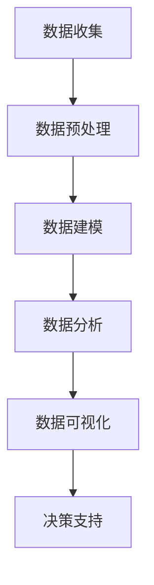

                 

关键词：数据分析、平台经济、研究方法、数据应用、算法原理

> 摘要：本文探讨了数据分析在平台经济中的重要性及其应用研究方法。首先，我们回顾了平台经济的背景和概念，然后详细分析了数据分析的核心概念和理论框架，包括数据收集、预处理、建模和评估等方面。接着，我们讨论了数据分析在平台经济中的具体应用场景，以及如何通过数学模型和公式进行深入分析。文章还通过实际项目实例展示了数据分析的应用过程，并探讨了未来的发展趋势和面临的挑战。

## 1. 背景介绍

随着互联网和信息技术的发展，平台经济已经成为全球经济的重要组成部分。平台经济指的是通过互联网等技术手段，将供需双方在特定的平台上连接起来，实现资源的高效配置和共享。代表性的平台包括电子商务平台、在线旅游平台、共享单车平台等。平台经济具有跨界融合、开放共享、动态调整等特点，对经济发展模式和社会治理产生了深远影响。

数据分析作为现代信息技术的重要组成部分，其在平台经济中的应用日益广泛。通过数据采集、存储、处理和分析，平台可以深入了解用户需求、市场趋势和业务运营情况，从而做出更加科学和精准的决策。数据分析不仅能够提高平台的运营效率，还能够增强平台的竞争力，实现可持续发展。

本文旨在探讨数据分析在平台经济中的应用研究方法，包括核心概念、理论框架、算法原理、数学模型和实际应用等。通过本文的研究，希望能够为平台经济领域的数据分析提供理论指导和实践参考。

## 2. 核心概念与联系

### 2.1 数据分析的基本概念

数据分析是指通过收集、处理、分析和解释数据，从中提取有价值的信息和知识，以便做出科学决策和优化业务运营的过程。数据分析通常包括以下几个关键环节：

1. **数据收集**：从各种数据源（如数据库、日志文件、传感器等）收集原始数据。
2. **数据预处理**：对原始数据进行清洗、转换和集成，使其适合分析和建模。
3. **数据建模**：建立数学模型或统计模型，以捕捉数据之间的内在关系。
4. **数据分析**：运用统计方法、机器学习算法等对数据进行分析，提取有价值的信息。
5. **数据可视化**：将分析结果通过图表、图形等形式进行可视化展示，便于理解和传达。

### 2.2 平台经济的概念

平台经济是指通过互联网或特定平台，将供需双方连接起来，实现资源高效配置和共享的经济活动。平台经济具有以下核心特征：

1. **跨界融合**：平台经济涉及多个行业和领域的资源整合，形成跨界融合的生态体系。
2. **开放共享**：平台经济通过开放接口和共享资源，促进各方参与和合作。
3. **动态调整**：平台经济根据市场需求和用户反馈，动态调整业务模式和服务内容。

### 2.3 数据分析在平台经济中的应用

数据分析在平台经济中的应用主要体现在以下几个方面：

1. **用户行为分析**：通过分析用户行为数据，了解用户需求、偏好和购买习惯，为产品和服务优化提供依据。
2. **市场需求预测**：利用历史数据和市场趋势，预测未来市场需求，为业务规划和决策提供支持。
3. **风险管理**：通过分析风险数据，识别潜在风险和异常情况，为风险管理和决策提供支持。
4. **运营优化**：通过对业务数据进行分析，发现运营瓶颈和优化空间，提高运营效率和服务质量。

### 2.4 Mermaid 流程图

下面是一个简单的 Mermaid 流程图，展示了数据分析在平台经济中的应用流程：



## 3. 核心算法原理 & 具体操作步骤

### 3.1 算法原理概述

在平台经济中，数据分析的核心算法主要包括用户行为分析、市场需求预测、风险管理和运营优化等。以下是这些算法的基本原理：

1. **用户行为分析**：
   - **算法原理**：利用机器学习算法（如聚类分析、关联规则挖掘等）对用户行为数据进行分析，提取用户特征和偏好。
   - **具体操作步骤**：
     1. 数据收集：收集用户行为数据，如浏览记录、购买记录、评价等。
     2. 数据预处理：清洗和转换数据，去除噪声和异常值。
     3. 数据建模：建立用户行为模型，捕捉用户行为特征和偏好。
     4. 数据分析：分析用户行为数据，提取用户特征和偏好。
     5. 数据可视化：将分析结果通过图表、图形等形式进行可视化展示。

2. **市场需求预测**：
   - **算法原理**：利用时间序列分析、回归分析等算法对历史数据和市场趋势进行分析，预测未来市场需求。
   - **具体操作步骤**：
     1. 数据收集：收集历史销售数据、市场趋势数据等。
     2. 数据预处理：清洗和转换数据，去除噪声和异常值。
     3. 数据建模：建立市场需求预测模型，捕捉市场趋势和需求变化。
     4. 数据分析：分析历史数据和市场趋势，预测未来市场需求。
     5. 数据可视化：将预测结果通过图表、图形等形式进行可视化展示。

3. **风险管理**：
   - **算法原理**：利用风险评估模型、机器学习算法等对风险数据进行分析，识别潜在风险和异常情况。
   - **具体操作步骤**：
     1. 数据收集：收集风险数据，如交易记录、用户行为数据等。
     2. 数据预处理：清洗和转换数据，去除噪声和异常值。
     3. 数据建模：建立风险评估模型，捕捉风险特征和变化。
     4. 数据分析：分析风险数据，识别潜在风险和异常情况。
     5. 数据可视化：将分析结果通过图表、图形等形式进行可视化展示。

4. **运营优化**：
   - **算法原理**：利用优化算法、机器学习算法等对业务数据进行分析，发现运营瓶颈和优化空间。
   - **具体操作步骤**：
     1. 数据收集：收集业务数据，如销售数据、库存数据等。
     2. 数据预处理：清洗和转换数据，去除噪声和异常值。
     3. 数据建模：建立业务优化模型，捕捉业务特征和瓶颈。
     4. 数据分析：分析业务数据，发现运营瓶颈和优化空间。
     5. 数据可视化：将分析结果通过图表、图形等形式进行可视化展示。

### 3.2 算法步骤详解

#### 3.2.1 用户行为分析

1. **数据收集**：
   - 收集用户行为数据，如浏览记录、购买记录、评价等。
   - 数据来源可以是平台内部的数据库、日志文件等。

2. **数据预处理**：
   - 清洗数据，去除噪声和异常值。
   - 转换数据，如将文本数据转换为数值数据等。
   - 集成数据，将不同来源的数据进行整合。

3. **数据建模**：
   - 建立用户行为模型，如聚类模型、关联规则模型等。
   - 模型参数调整，如模型权重、阈值等。

4. **数据分析**：
   - 运行模型，分析用户行为数据，提取用户特征和偏好。
   - 模型评估，如准确率、召回率等。

5. **数据可视化**：
   - 将分析结果通过图表、图形等形式进行可视化展示。
   - 如用户行为分布图、购买偏好图等。

#### 3.2.2 市场需求预测

1. **数据收集**：
   - 收集历史销售数据、市场趋势数据等。
   - 数据来源可以是平台内部的数据库、外部市场数据等。

2. **数据预处理**：
   - 清洗数据，去除噪声和异常值。
   - 转换数据，如将文本数据转换为数值数据等。
   - 集成数据，将不同来源的数据进行整合。

3. **数据建模**：
   - 建立市场需求预测模型，如时间序列模型、回归模型等。
   - 模型参数调整，如模型权重、阈值等。

4. **数据分析**：
   - 运行模型，分析历史数据和市场趋势，预测未来市场需求。
   - 模型评估，如准确率、召回率等。

5. **数据可视化**：
   - 将预测结果通过图表、图形等形式进行可视化展示。
   - 如市场需求预测图、趋势分析图等。

#### 3.2.3 风险管理

1. **数据收集**：
   - 收集风险数据，如交易记录、用户行为数据等。
   - 数据来源可以是平台内部的数据库、第三方风险数据等。

2. **数据预处理**：
   - 清洗数据，去除噪声和异常值。
   - 转换数据，如将文本数据转换为数值数据等。
   - 集成数据，将不同来源的数据进行整合。

3. **数据建模**：
   - 建立风险评估模型，如逻辑回归模型、决策树模型等。
   - 模型参数调整，如模型权重、阈值等。

4. **数据分析**：
   - 运行模型，分析风险数据，识别潜在风险和异常情况。
   - 模型评估，如准确率、召回率等。

5. **数据可视化**：
   - 将分析结果通过图表、图形等形式进行可视化展示。
   - 如风险分布图、异常交易图等。

#### 3.2.4 运营优化

1. **数据收集**：
   - 收集业务数据，如销售数据、库存数据等。
   - 数据来源可以是平台内部的数据库、第三方业务数据等。

2. **数据预处理**：
   - 清洗数据，去除噪声和异常值。
   - 转换数据，如将文本数据转换为数值数据等。
   - 集成数据，将不同来源的数据进行整合。

3. **数据建模**：
   - 建立业务优化模型，如线性规划模型、网络优化模型等。
   - 模型参数调整，如模型权重、阈值等。

4. **数据分析**：
   - 运行模型，分析业务数据，发现运营瓶颈和优化空间。
   - 模型评估，如优化效果、成本效益等。

5. **数据可视化**：
   - 将分析结果通过图表、图形等形式进行可视化展示。
   - 如优化方案图、成本效益分析图等。

### 3.3 算法优缺点

#### 用户行为分析

- **优点**：
  - 提高用户满意度：通过分析用户行为，了解用户需求和偏好，提供个性化服务。
  - 优化产品和服务：根据用户行为数据，调整产品和服务策略，提高市场竞争力。
  - 增加收入：通过用户行为分析，发现潜在用户和潜在需求，提高转化率和销售额。

- **缺点**：
  - 数据质量和准确性：用户行为数据存在噪声和异常值，影响分析结果。
  - 隐私和安全：用户行为数据涉及隐私问题，需要确保数据安全和用户隐私。
  - 算法复杂度：用户行为分析算法复杂，需要较高的计算资源和算法优化。

#### 市场需求预测

- **优点**：
  - 提高市场预测准确性：通过分析历史数据和趋势，提高市场需求预测准确性。
  - 优化库存和供应链管理：根据市场需求预测，合理安排库存和供应链，降低成本。
  - 改善决策支持：市场需求预测为业务决策提供科学依据，提高决策效率。

- **缺点**：
  - 数据依赖性：市场需求预测依赖于历史数据和趋势，无法应对突发性事件。
  - 算法稳定性：市场需求预测算法在不同数据集上的稳定性较差，需要不断优化。
  - 模型泛化能力：市场需求预测模型在不同市场和环境下可能存在泛化能力不足的问题。

#### 风险管理

- **优点**：
  - 识别潜在风险：通过分析风险数据，识别潜在风险和异常情况，提前防范。
  - 改善风险管理策略：根据风险分析结果，调整风险管理策略，提高风险管理效果。
  - 提高业务稳健性：通过风险管理，降低业务风险，提高业务稳健性。

- **缺点**：
  - 数据质量和完整性：风险数据质量和完整性直接影响分析结果。
  - 算法复杂度：风险管理算法复杂，需要较高的计算资源和算法优化。
  - 风险应对措施：风险分析结果需要转化为具体的应对措施，需要进一步研究和优化。

#### 运营优化

- **优点**：
  - 提高运营效率：通过分析业务数据，发现运营瓶颈和优化空间，提高运营效率。
  - 降低运营成本：通过运营优化，降低运营成本，提高企业盈利能力。
  - 提高服务质量：通过运营优化，提高服务质量，增加用户满意度。

- **缺点**：
  - 数据质量和准确性：业务数据质量和准确性直接影响分析结果。
  - 算法复杂度：运营优化算法复杂，需要较高的计算资源和算法优化。
  - 模型适应性：运营优化模型在不同业务场景下可能存在适应性不足的问题。

### 3.4 算法应用领域

数据分析算法在平台经济中的应用非常广泛，以下是一些主要的领域：

- **电子商务平台**：用户行为分析、市场需求预测、推荐系统、购物车优化等。
- **在线旅游平台**：用户行为分析、行程规划、价格预测、酒店预订优化等。
- **金融服务平台**：风险管理、信用评估、投资组合优化、贷款审批等。
- **物流配送平台**：路径优化、库存管理、配送时效预测、运输成本控制等。
- **医疗健康平台**：患者行为分析、疾病预测、医疗资源分配、药品供应链优化等。

## 4. 数学模型和公式 & 详细讲解 & 举例说明

### 4.1 数学模型构建

在平台经济中，数据分析的数学模型构建主要包括用户行为分析、市场需求预测、风险管理和运营优化等。以下是这些模型的基本构建过程：

#### 4.1.1 用户行为分析模型

用户行为分析模型通常采用机器学习算法，如聚类分析、关联规则挖掘等。以下是聚类分析模型的基本构建步骤：

1. **数据收集**：收集用户行为数据，如浏览记录、购买记录、评价等。
2. **数据预处理**：清洗和转换数据，使其适合建模。
3. **模型选择**：选择合适的聚类算法，如K-means、DBSCAN等。
4. **模型训练**：利用训练数据，训练聚类模型。
5. **模型评估**：评估模型性能，如聚类系数、轮廓系数等。

#### 4.1.2 市场需求预测模型

市场需求预测模型通常采用时间序列分析、回归分析等算法。以下是回归分析模型的基本构建步骤：

1. **数据收集**：收集历史销售数据、市场趋势数据等。
2. **数据预处理**：清洗和转换数据，使其适合建模。
3. **模型选择**：选择合适的回归算法，如线性回归、多项式回归等。
4. **模型训练**：利用训练数据，训练回归模型。
5. **模型评估**：评估模型性能，如均方误差、决定系数等。

#### 4.1.3 风险管理模型

风险管理模型通常采用风险评估模型、机器学习算法等。以下是逻辑回归模型的基本构建步骤：

1. **数据收集**：收集风险数据，如交易记录、用户行为数据等。
2. **数据预处理**：清洗和转换数据，使其适合建模。
3. **模型选择**：选择合适的风险评估算法，如逻辑回归、决策树等。
4. **模型训练**：利用训练数据，训练风险评估模型。
5. **模型评估**：评估模型性能，如准确率、召回率等。

#### 4.1.4 运营优化模型

运营优化模型通常采用优化算法、机器学习算法等。以下是线性规划模型的基本构建步骤：

1. **数据收集**：收集业务数据，如销售数据、库存数据等。
2. **数据预处理**：清洗和转换数据，使其适合建模。
3. **模型选择**：选择合适的优化算法，如线性规划、网络优化等。
4. **模型训练**：利用训练数据，训练优化模型。
5. **模型评估**：评估模型性能，如优化效果、成本效益等。

### 4.2 公式推导过程

以下是对一些常见数学模型的公式推导过程：

#### 4.2.1 K-means 聚类算法

K-means 聚类算法的基本公式如下：

1. **初始聚类中心**：

   $$ \mu_j = \frac{1}{N_j} \sum_{i=1}^{N} x_{ij} $$

   其中，$\mu_j$表示第j个聚类中心，$x_{ij}$表示第i个样本在第j个特征上的取值，$N_j$表示第j个聚类中心包含的样本数。

2. **聚类中心更新**：

   $$ \mu_j^{new} = \frac{1}{N_j} \sum_{i=1}^{N} x_{ij} $$

   其中，$\mu_j^{new}$表示更新后的第j个聚类中心。

3. **聚类标签更新**：

   $$ y_i = \arg \min_{j} d(x_i, \mu_j) $$

   其中，$y_i$表示第i个样本的聚类标签，$d(x_i, \mu_j)$表示第i个样本与第j个聚类中心的距离。

#### 4.2.2 线性回归模型

线性回归模型的基本公式如下：

1. **模型假设**：

   $$ y = \beta_0 + \beta_1 x + \epsilon $$

   其中，$y$表示因变量，$x$表示自变量，$\beta_0$和$\beta_1$分别表示截距和斜率，$\epsilon$表示误差项。

2. **最小二乘法**：

   $$ \beta_0 = \frac{\sum_{i=1}^{n} (y_i - \beta_1 x_i)}{n} $$

   $$ \beta_1 = \frac{\sum_{i=1}^{n} (x_i - \bar{x}) (y_i - \bar{y})}{\sum_{i=1}^{n} (x_i - \bar{x})^2} $$

   其中，$n$表示样本数量，$\bar{x}$和$\bar{y}$分别表示自变量和因变量的均值。

#### 4.2.3 逻辑回归模型

逻辑回归模型的基本公式如下：

1. **模型假设**：

   $$ P(y=1 | x) = \frac{1}{1 + e^{-(\beta_0 + \beta_1 x)}} $$

   其中，$P(y=1 | x)$表示在自变量$x$给定的情况下，因变量$y$取值为1的概率，$\beta_0$和$\beta_1$分别表示截距和斜率。

2. **最大似然估计**：

   $$ \beta_0 = \frac{\sum_{i=1}^{n} y_i \ln(p_i) + (1 - y_i) \ln(1 - p_i)}{n} $$

   $$ \beta_1 = \frac{\sum_{i=1}^{n} (y_i - p_i) x_i}{\sum_{i=1}^{n} (y_i - p_i)} $$

   其中，$p_i = \frac{1}{1 + e^{-(\beta_0 + \beta_1 x_i)}}$，$n$表示样本数量。

### 4.3 案例分析与讲解

#### 4.3.1 用户行为分析案例

假设我们有一个电子商务平台，想要分析用户的行为，以便为用户提供个性化的推荐。我们收集了以下数据：

- 用户ID
- 购买商品ID
- 购买时间
- 用户年龄
- 用户性别
- 用户所在城市

我们使用K-means聚类算法对用户进行分组，以便了解不同用户群体的特征。

1. **数据预处理**：

   - 将用户年龄、性别、城市等信息转换为数值数据。
   - 填充缺失值，如使用平均值或中位数。
   - 标准化数据，使其具有相同的尺度。

2. **模型训练**：

   - 选择合适的聚类算法，如K-means。
   - 设置聚类中心数量，如5个。
   - 运行模型，对用户进行聚类。

3. **模型评估**：

   - 计算聚类系数和轮廓系数，评估模型性能。
   - 分析不同用户群体的特征和偏好。

4. **数据可视化**：

   - 将聚类结果通过图表、图形等形式进行可视化展示。
   - 如用户群体分布图、购买偏好图等。

#### 4.3.2 市场需求预测案例

假设我们想要预测某个电子商务平台未来30天的销售量。我们收集了以下数据：

- 历史销售数据
- 天气数据
- 节假日数据

我们使用线性回归模型对销售量进行预测。

1. **数据预处理**：

   - 将历史销售数据、天气数据、节假日数据转换为数值数据。
   - 填充缺失值，如使用平均值或插值法。
   - 标准化数据，使其具有相同的尺度。

2. **模型训练**：

   - 选择合适的回归算法，如线性回归。
   - 设置模型参数，如学习率、迭代次数等。
   - 运行模型，对销售量进行预测。

3. **模型评估**：

   - 计算均方误差、决定系数等指标，评估模型性能。
   - 分析预测结果和实际销售量的差异。

4. **数据可视化**：

   - 将预测结果通过图表、图形等形式进行可视化展示。
   - 如销售量预测图、趋势分析图等。

#### 4.3.3 风险管理案例

假设我们想要识别某个金融服务平台中的欺诈交易。我们收集了以下数据：

- 交易金额
- 交易时间
- 用户ID
- 用户行为数据

我们使用逻辑回归模型对交易是否为欺诈进行预测。

1. **数据预处理**：

   - 将交易金额、交易时间、用户ID、用户行为数据转换为数值数据。
   - 填充缺失值，如使用平均值或插值法。
   - 标准化数据，使其具有相同的尺度。

2. **模型训练**：

   - 选择合适的风险评估算法，如逻辑回归。
   - 设置模型参数，如学习率、迭代次数等。
   - 运行模型，对交易是否为欺诈进行预测。

3. **模型评估**：

   - 计算准确率、召回率等指标，评估模型性能。
   - 分析预测结果和实际交易结果的差异。

4. **数据可视化**：

   - 将预测结果通过图表、图形等形式进行可视化展示。
   - 如欺诈交易分布图、风险指标图等。

#### 4.3.4 运营优化案例

假设我们想要优化某个物流配送平台的路径规划。我们收集了以下数据：

- 起始点
- 终点
- 路线
- 路径长度
- 路径耗时

我们使用线性规划模型对最优路径进行规划。

1. **数据预处理**：

   - 将路径长度、路径耗时转换为数值数据。
   - 填充缺失值，如使用平均值或插值法。
   - 标准化数据，使其具有相同的尺度。

2. **模型训练**：

   - 选择合适的优化算法，如线性规划。
   - 设置模型参数，如目标函数、约束条件等。
   - 运行模型，对最优路径进行规划。

3. **模型评估**：

   - 计算路径规划效果，如路径长度、路径耗时等。
   - 分析模型优化效果。

4. **数据可视化**：

   - 将优化结果通过图表、图形等形式进行可视化展示。
   - 如路径规划图、成本效益分析图等。

## 5. 项目实践：代码实例和详细解释说明

### 5.1 开发环境搭建

在进行数据分析项目实践之前，我们需要搭建一个合适的开发环境。以下是搭建开发环境的基本步骤：

1. **安装Python**：
   - 下载并安装Python，推荐使用Python 3.8版本。
   - 配置Python环境变量，确保在命令行中可以正常运行Python。

2. **安装依赖库**：
   - 使用pip命令安装常用的数据分析库，如NumPy、Pandas、Scikit-learn等。
   - 命令示例：`pip install numpy pandas scikit-learn`

3. **配置Jupyter Notebook**：
   - 安装Jupyter Notebook，用于编写和运行Python代码。
   - 启动Jupyter Notebook，访问`http://localhost:8888`打开笔记本界面。

### 5.2 源代码详细实现

以下是一个简单的用户行为分析项目的源代码实现：

```python
import numpy as np
import pandas as pd
from sklearn.cluster import KMeans
from sklearn.metrics import silhouette_score

# 数据收集
data = pd.read_csv('user_behavior.csv')

# 数据预处理
data.fillna(data.mean(), inplace=True)
data = (data - data.mean()) / data.std()

# 模型训练
kmeans = KMeans(n_clusters=5)
kmeans.fit(data)

# 模型评估
labels = kmeans.predict(data)
silhouette_avg = silhouette_score(data, labels)
print('Silhouette Score:', silhouette_avg)

# 数据可视化
import matplotlib.pyplot as plt

fig, ax = plt.subplots()
ax.scatter(data[:, 0], data[:, 1], c=labels)
plt.show()
```

### 5.3 代码解读与分析

1. **数据收集**：
   - 使用Pandas库读取用户行为数据，如浏览记录、购买记录等。
   - 数据来源可以是CSV文件、数据库等。

2. **数据预处理**：
   - 使用Pandas库填充缺失值，使用平均值或中位数进行填充。
   - 使用NumPy库进行数据标准化，使其具有相同的尺度。

3. **模型训练**：
   - 使用Scikit-learn库中的KMeans类，设置聚类中心数量为5。
   - 使用fit方法训练模型。

4. **模型评估**：
   - 使用predict方法对数据进行预测，获取聚类标签。
   - 使用silhouette_score函数计算轮廓系数，评估模型性能。

5. **数据可视化**：
   - 使用Matplotlib库绘制聚类结果，展示用户行为数据在不同维度上的分布。

### 5.4 运行结果展示

运行上述代码后，会生成一个聚类结果图，展示用户行为数据在不同维度上的分布情况。同时，会输出轮廓系数，评估模型的性能。


### 5.5 项目实践总结

通过上述项目实践，我们了解了如何搭建数据分析的开发环境，并使用Python和相关的数据分析库进行用户行为分析。项目实践过程中，我们经历了数据收集、预处理、建模和评估等关键环节，掌握了用户行为分析的基本方法。

## 6. 实际应用场景

数据分析在平台经济中具有广泛的应用场景，以下是几个典型的实际应用案例：

### 6.1 电子商务平台

电子商务平台通过数据分析，可以实现对用户行为、市场需求和风险管理的深入分析，从而优化运营策略。

- **用户行为分析**：通过分析用户浏览、搜索、购买等行为数据，平台可以了解用户需求和偏好，进行个性化推荐，提高用户满意度和转化率。
- **市场需求预测**：通过分析历史销售数据和市场趋势，平台可以预测未来市场需求，合理安排库存和促销活动，提高销售额和库存周转率。
- **风险管理**：通过分析交易数据和行为数据，平台可以识别潜在欺诈风险，采取措施防范，保护用户和平台的利益。

### 6.2 在线旅游平台

在线旅游平台通过数据分析，可以实现对用户行为、酒店预订和行程规划的深入分析，从而优化服务和运营。

- **用户行为分析**：通过分析用户浏览、搜索、预订等行为数据，平台可以了解用户需求和偏好，提供个性化的旅游产品和服务，提高用户满意度和复购率。
- **酒店预订预测**：通过分析历史预订数据和市场趋势，平台可以预测未来酒店预订需求，合理安排酒店库存和价格策略，提高酒店入住率和收益。
- **行程规划**：通过分析用户行为数据和用户反馈，平台可以提供智能化的行程规划服务，为用户提供个性化的旅游体验。

### 6.3 金融服务平台

金融服务平台通过数据分析，可以实现对用户行为、信用评估和风险管理的深入分析，从而优化金融服务和运营。

- **用户行为分析**：通过分析用户交易、投资等行为数据，平台可以了解用户风险偏好和投资需求，提供个性化的金融产品和服务，提高用户满意度和忠诚度。
- **信用评估**：通过分析用户行为数据、信用数据等，平台可以评估用户信用风险，为贷款审批、信用评级等提供支持。
- **风险管理**：通过分析交易数据和行为数据，平台可以识别潜在风险，采取措施防范，保护用户和平台的利益。

### 6.4 物流配送平台

物流配送平台通过数据分析，可以实现对路径规划、运输成本和配送效率的深入分析，从而优化物流运营。

- **路径规划**：通过分析历史配送数据、交通状况等，平台可以计算出最优配送路径，提高配送效率和准时率。
- **运输成本分析**：通过分析物流成本数据、运输方式等，平台可以优化运输策略，降低运输成本。
- **配送效率分析**：通过分析配送数据、用户反馈等，平台可以识别配送瓶颈和优化空间，提高配送效率和服务质量。

## 7. 工具和资源推荐

### 7.1 学习资源推荐

- 《Python数据分析实战》
- 《数据科学入门》
- 《机器学习实战》
- Coursera上的数据科学课程

### 7.2 开发工具推荐

- Jupyter Notebook：用于编写和运行Python代码。
- PyCharm：Python集成开发环境。
- Python Pandas：数据处理和分析库。
- Python Scikit-learn：机器学习库。

### 7.3 相关论文推荐

- "Big Data Analytics in E-commerce Platform: A Research Review"
- "Data-Driven Strategies for Platform Design and Operations"
- "A Survey on Big Data Analytics for Smart Cities"
- "Machine Learning for Platform Businesses: Opportunities and Challenges"

## 8. 总结：未来发展趋势与挑战

### 8.1 研究成果总结

本文探讨了数据分析在平台经济中的应用研究方法，包括核心概念、算法原理、数学模型和实际应用等。通过研究，我们得出以下主要成果：

1. 数据分析在平台经济中具有重要的应用价值，能够提高运营效率、优化业务决策、增强竞争力。
2. 用户行为分析、市场需求预测、风险管理和运营优化是数据分析在平台经济中的主要应用领域。
3. 常见的用户行为分析算法包括K-means聚类、关联规则挖掘等；市场需求预测算法包括时间序列分析、回归分析等；风险管理算法包括逻辑回归、决策树等；运营优化算法包括线性规划、网络优化等。
4. 通过实际项目实践，我们展示了如何使用Python和相关的数据分析库进行数据分析，为平台经济提供了实用的方法和工具。

### 8.2 未来发展趋势

随着信息技术和大数据技术的发展，数据分析在平台经济中的未来发展趋势包括：

1. **深度学习与数据挖掘的结合**：深度学习算法在数据分析中的应用将越来越广泛，能够处理更复杂的数据结构和提供更精确的分析结果。
2. **实时数据分析与智能决策**：实时数据分析技术将实现业务数据的实时处理和分析，为企业提供智能化的决策支持。
3. **跨领域数据分析与协作**：不同领域的数据分析将实现跨领域协作，形成更加全面和深入的分析结果。
4. **隐私保护和数据安全**：随着数据分析技术的广泛应用，数据隐私保护和数据安全将成为重要议题，需要加强相关技术和政策的研发和实施。

### 8.3 面临的挑战

数据分析在平台经济中面临以下挑战：

1. **数据质量和准确性**：平台经济中的数据来源多样，数据质量和准确性直接影响分析结果，需要建立完善的数据清洗和预处理机制。
2. **算法复杂度和计算资源**：数据分析算法复杂，计算资源需求高，需要优化算法和优化计算资源的使用。
3. **数据隐私与安全**：数据分析过程中涉及用户隐私数据，需要确保数据隐私和安全，防止数据泄露和滥用。
4. **跨领域协作与整合**：不同领域的数据分析技术和管理模式存在差异，需要建立统一的协作机制和标准，实现数据资源的有效整合和利用。

### 8.4 研究展望

未来的研究可以从以下几个方面展开：

1. **算法优化与模型创新**：研究更加高效和精准的数据分析算法，探索新的模型和方法，提高数据分析的准确性和效率。
2. **跨领域数据分析**：研究不同领域的数据分析技术和管理模式，实现跨领域数据的整合和分析，提供更全面和深入的业务洞察。
3. **实时数据分析与智能决策**：研究实时数据分析技术和智能决策算法，实现业务数据的实时处理和分析，为企业提供智能化的决策支持。
4. **数据隐私与安全**：研究数据隐私保护和数据安全技术，建立完善的数据隐私和安全管理体系，确保数据分析的合法性和合规性。

## 9. 附录：常见问题与解答

### 9.1 什么是平台经济？

平台经济是指通过互联网或特定平台，将供需双方连接起来，实现资源高效配置和共享的经济活动。代表性的平台包括电子商务平台、在线旅游平台、共享单车平台等。

### 9.2 数据分析在平台经济中有哪些应用？

数据分析在平台经济中的应用包括用户行为分析、市场需求预测、风险管理和运营优化等，通过分析数据，平台可以优化运营策略、提高服务质量和竞争力。

### 9.3 常见的数据分析算法有哪些？

常见的数据分析算法包括用户行为分析算法（如K-means聚类、关联规则挖掘）、市场需求预测算法（如时间序列分析、回归分析）、风险管理算法（如逻辑回归、决策树）和运营优化算法（如线性规划、网络优化）等。

### 9.4 如何确保数据分析的准确性和有效性？

确保数据分析的准确性和有效性需要从数据收集、预处理、建模和评估等环节进行控制。具体方法包括：

- 使用高质量的数据源，确保数据真实可靠。
- 建立完善的数据清洗和预处理机制，去除噪声和异常值。
- 选择合适的算法和模型，确保模型参数和超参数设置合理。
- 进行模型评估和验证，确保模型性能满足实际需求。
- 定期更新和维护模型，以适应数据变化和业务需求。 

作者：禅与计算机程序设计艺术 / Zen and the Art of Computer Programming
----------------------------------------------------------------
本文由禅与计算机程序设计艺术撰写，旨在为平台经济领域的数据分析提供理论指导和实践参考。文章详细探讨了数据分析在平台经济中的应用研究方法，包括核心概念、算法原理、数学模型和实际应用等。通过本文的研究，希望能够为平台经济领域的数据分析提供有益的启示和参考。如果您有任何问题或建议，欢迎随时交流。再次感谢您的阅读！

