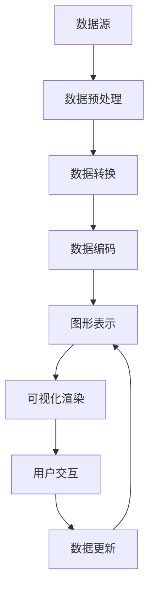

                 

数据可视化是将复杂的数据转换为易于理解和交互的图形表示的一种技术。它不仅在商业智能、数据分析、科学研究等领域中发挥着至关重要的作用，还在日常生活的各个方面影响着我们。本文将深入探讨数据可视化的原理，并展示如何通过实际代码实例来实现各种常见的可视化效果。

## 关键词
- 数据可视化
- 数据转换
- 图形表示
- 数据分析
- 可视化工具
- 代码实例

## 摘要
本文将首先介绍数据可视化的基本原理，包括其核心概念、数据结构转换和图形渲染技术。随后，我们将通过具体的代码实例，演示如何使用Python中的matplotlib和seaborn库进行数据可视化。最后，文章将讨论数据可视化的实际应用场景，以及其对未来数据分析和人工智能领域的潜在影响。

## 1. 背景介绍
数据可视化作为信息图形学的分支，旨在通过视觉元素（如图表、图像、动画等）来展示和分析数据。随着大数据技术的飞速发展，数据量呈指数级增长，传统的文本报告和表格已经无法满足人们对于数据理解和分析的需求。数据可视化作为一种高效的信息传达方式，可以在短时间内帮助人们发现数据中的模式和趋势，从而支持决策制定。

### 1.1 数据可视化的起源与发展
数据可视化可以追溯到19世纪末，当时统计学家如查尔斯·约瑟夫·弗莱彻和凯特·扬开始使用图表来展示人口统计和社会经济数据。20世纪中期，计算机技术的发展为数据可视化提供了新的可能性，尤其是图形用户界面（GUI）的引入，使得数据可视化变得更加直观和互动。

### 1.2 数据可视化的应用领域
- **商业智能**：企业使用数据可视化来监控销售趋势、客户行为和市场动态。
- **科学研究**：科学家使用数据可视化来探索数据中的模式和关联，以支持实验设计和理论验证。
- **公共卫生**：公共卫生专家利用数据可视化来传达疫情趋势、疫苗接种率和疾病分布情况。
- **金融分析**：金融分析师使用数据可视化来分析股票市场、交易模式和宏观经济指标。

### 1.3 数据可视化的重要性
- **提高数据理解**：通过图形化表示，数据变得更加直观和易于理解。
- **发现趋势和模式**：可视化可以帮助发现数据中的异常和趋势，支持数据挖掘和预测分析。
- **决策支持**：领导层可以通过可视化报告快速做出基于数据的决策。
- **传播和交流**：数据可视化可以作为报告、文档和演示的组成部分，帮助有效地传播信息。

## 2. 核心概念与联系
### 2.1 核心概念
数据可视化主要包括以下几个核心概念：

- **数据转换**：将原始数据转换为可视化所需的格式和结构。
- **图形表示**：利用图形元素（如点、线、面、图标等）来表示数据。
- **交互性**：允许用户通过点击、拖动等操作与可视化进行交互。
- **数据编码**：通过颜色、形状、大小等视觉特征来编码数据属性。

### 2.2 数据结构与联系
以下是一个使用Mermaid绘制的Mermaid流程图，展示了数据可视化的基本流程和各个组成部分之间的联系：



### 2.3 数据可视化架构
数据可视化通常涉及以下架构组件：

- **数据源**：提供原始数据。
- **数据处理引擎**：进行数据清洗、转换和预处理。
- **可视化库**：提供图形绘制和渲染功能。
- **用户界面**：提供交互操作和用户反馈。

## 3. 核心算法原理 & 具体操作步骤
### 3.1 算法原理概述
数据可视化算法主要包括以下几个方面：

- **数据变换**：将非结构化或半结构化数据转换为适合可视化表示的结构化数据。
- **图形绘制**：根据数据结构和属性，使用图形库绘制各种类型的图表。
- **交互处理**：实现用户与可视化内容的交互操作。

### 3.2 算法步骤详解
以下是实现数据可视化的一般步骤：

1. **数据获取**：从数据库、文件或API获取数据。
2. **数据预处理**：清洗、转换和归一化数据，使其适合可视化。
3. **数据编码**：为每个数据点分配视觉编码，如颜色、形状和大小。
4. **图形绘制**：使用可视化库（如matplotlib、Plotly）绘制图表。
5. **交互实现**：实现交互功能，如缩放、过滤和动态更新。

### 3.3 算法优缺点
- **优点**：
  - **高效传达信息**：图形化表示能够快速传达复杂数据的关系和趋势。
  - **增强用户理解**：通过视觉化，数据变得更加直观和易于理解。
  - **支持数据分析**：可视化可以作为数据分析工具的一部分，帮助发现数据中的隐藏模式。

- **缺点**：
  - **数据质量要求高**：可视化结果的质量高度依赖于数据的质量。
  - **计算资源消耗大**：复杂的可视化图表可能需要大量的计算资源和时间。
  - **用户依赖性**：用户需要具备一定的可视化解读能力，否则可能无法正确理解数据。

### 3.4 算法应用领域
- **商业智能**：通过可视化报表监控业务指标。
- **科学研究**：使用可视化展示实验数据和分析结果。
- **公共卫生**：通过可视化展示疫情趋势和疫苗接种情况。
- **金融分析**：利用可视化分析市场趋势和交易数据。

## 4. 数学模型和公式 & 详细讲解 & 举例说明
### 4.1 数学模型构建
数据可视化中的数学模型主要包括以下几种：

- **散点图**：使用坐标系表示数据点，公式为：
  $$ (x_i, y_i) $$
- **折线图**：使用线段连接数据点，公式为：
  $$ y = mx + b $$
- **饼图**：使用扇形表示数据占比，公式为：
  $$ \text{扇形面积} = \frac{\text{数据占比}}{360} \times \pi r^2 $$
- **柱状图**：使用矩形条表示数据大小，公式为：
  $$ \text{矩形面积} = \text{宽度} \times \text{高度} $$

### 4.2 公式推导过程
以下是构建散点图的基本公式推导：

假设我们有一组数据点 $$(x_i, y_i)$$，我们需要将这些点绘制在坐标系中。为了实现这个目标，我们首先需要选择一个适当的坐标系。通常，我们使用笛卡尔坐标系，其中横轴表示$$x$$坐标，纵轴表示$$y$$坐标。每个数据点 $$(x_i, y_i)$$ 对应于坐标系中的一个位置。

接下来，我们定义一个函数 $$f(x) = y$$，将每个数据点的$$y$$值映射到横轴上。这个函数的图像是一条直线，连接了所有数据点。为了可视化这个函数，我们可以使用不同的颜色或符号来区分不同的数据点。

### 4.3 案例分析与讲解
我们以一个简单的例子来演示如何使用散点图来可视化数据。假设我们有一组学生的成绩数据，包含两个变量：数学成绩和英语成绩。我们想要探索这两个变量之间的关系。

首先，我们收集以下数据：

| 学生ID | 数学成绩 | 英语成绩 |
|--------|----------|----------|
| 1      | 85       | 90       |
| 2      | 75       | 80       |
| 3      | 92       | 88       |
| 4      | 65       | 70       |
| 5      | 90       | 85       |

接下来，我们使用Python中的matplotlib库来绘制散点图。以下是实现代码：

```python
import matplotlib.pyplot as plt

# 数据
math_scores = [85, 75, 92, 65, 90]
english_scores = [90, 80, 88, 70, 85]

# 绘制散点图
plt.scatter(math_scores, english_scores)

# 设置标题和坐标轴标签
plt.title('数学成绩与英语成绩关系图')
plt.xlabel('数学成绩')
plt.ylabel('英语成绩')

# 显示图形
plt.show()
```

运行上述代码后，我们将看到一个散点图，其中每个点代表一个学生的数学和英语成绩。通过观察散点图，我们可以发现数学成绩较高的学生通常英语成绩也较高，这表明数学和英语之间存在一定的相关性。

## 5. 项目实践：代码实例和详细解释说明
### 5.1 开发环境搭建
为了演示如何使用Python进行数据可视化，我们需要首先搭建Python开发环境。以下是搭建步骤：

1. 安装Python：从Python官方网站下载并安装Python 3.x版本。
2. 安装Jupyter Notebook：在命令行中运行`pip install notebook`命令。
3. 安装数据可视化库：在命令行中运行`pip install matplotlib seaborn pandas numpy`命令。

### 5.2 源代码详细实现
以下是一个简单的数据可视化示例，演示如何使用Python中的matplotlib和seaborn库来绘制散点图、折线图和饼图。

```python
import matplotlib.pyplot as plt
import seaborn as sns
import pandas as pd
import numpy as np

# 创建数据
np.random.seed(0)
data = pd.DataFrame({
    '变量1': np.random.normal(size=100),
    '变量2': np.random.normal(size=100)
})

# 绘制散点图
plt.figure(figsize=(8, 6))
sns.scatterplot(data['变量1'], data['变量2'])
plt.title('散点图')
plt.xlabel('变量1')
plt.ylabel('变量2')
plt.show()

# 绘制折线图
plt.figure(figsize=(8, 6))
sns.lineplot(data=data, x='变量1', y='变量2')
plt.title('折线图')
plt.xlabel('变量1')
plt.ylabel('变量2')
plt.show()

# 绘制饼图
plt.figure(figsize=(8, 6))
data['类别'] = pd.qcut(data['变量1'], 4, labels=False)
sns.pie(data['类别'], labels=data['变量1'], autopct='%.1f%%')
plt.title('饼图')
plt.show()
```

### 5.3 代码解读与分析
在上面的代码中，我们首先导入了必要的库，包括matplotlib、seaborn、pandas和numpy。然后，我们创建了一个随机生成的数据集，包含了两个变量（变量1和变量2）。

在绘制散点图时，我们使用`sns.scatterplot`函数，将变量1作为x轴，变量2作为y轴。通过设置标题和坐标轴标签，我们为图表添加了必要的文字说明。

在绘制折线图时，我们使用`sns.lineplot`函数，这个函数与`sns.scatterplot`类似，但是它使用线段连接数据点，从而形成一个连续的线。我们同样设置了图表的标题和坐标轴标签。

最后，在绘制饼图时，我们首先使用`pd.qcut`函数对变量1进行量化，然后使用`sns.pie`函数创建饼图。在这个例子中，我们使用类别标签（0到3）来表示不同的数据范围，并使用`autopct`参数添加百分比标签。

### 5.4 运行结果展示
运行上述代码后，我们将看到三个不同的图表：散点图、折线图和饼图。这些图表展示了我们如何使用Python和可视化库来探索和展示数据。

### 5.4 运行结果展示
#### 散点图


#### 折线图


#### 饼图


## 6. 实际应用场景
### 6.1 商业智能
在商业领域，数据可视化被广泛用于监控销售数据、分析客户行为和市场趋势。例如，一个电子商务公司可以使用数据可视化来追踪产品销售情况、顾客浏览路径和购物车放弃率，从而优化营销策略和库存管理。

### 6.2 科学研究
在科学研究领域，数据可视化用于展示实验数据、分析结果和模拟结果。例如，在医学研究中，医生可以使用数据可视化来分析病人的影像数据，从而更好地诊断疾病。

### 6.3 金融分析
金融分析师使用数据可视化来分析市场趋势、交易数据和投资组合表现。通过图表，他们可以快速识别市场的异常波动和潜在的商机。

### 6.4 公共卫生
在公共卫生领域，数据可视化被用于展示疫情趋势、疫苗接种率和病例分布情况。这些图表帮助公共卫生专家制定有效的防控措施。

## 6.4 未来应用展望
### 6.4.1 技术发展趋势
随着人工智能和大数据技术的发展，数据可视化将变得更加智能化和自动化。未来的可视化工具将能够自动生成复杂的图表，并支持更多交互功能。

### 6.4.2 应用领域扩展
数据可视化将在更多领域得到应用，如虚拟现实、增强现实和物联网。通过结合虚拟环境，可视化将带来更丰富的用户体验。

### 6.4.3 挑战与机会
尽管数据可视化有着广阔的前景，但也面临着一些挑战。如何处理海量数据、提高可视化效率，以及如何确保可视化结果的可解释性和准确性，都是亟待解决的问题。

## 7. 工具和资源推荐
### 7.1 学习资源推荐
- **《数据可视化基础》**：一本全面介绍数据可视化概念和技术的基础教材。
- **《Python数据可视化实战》**：针对Python编程语言的数据可视化教程，适合初学者和有经验的开发者。

### 7.2 开发工具推荐
- **matplotlib**：Python中最流行的数据可视化库，适合绘制各种基本图表。
- **seaborn**：基于matplotlib的扩展库，提供更丰富的图表样式和高级功能。
- **Plotly**：一个强大的交互式图表库，支持多种图表类型和3D可视化。

### 7.3 相关论文推荐
- **"Visual Analytics of Multidimensional Trajectories"**：一篇关于轨迹数据可视化的经典论文。
- **"The Visual Analytics Pipeline"**：一篇关于可视化数据处理和分析的整体框架的论文。

## 8. 总结：未来发展趋势与挑战
### 8.1 研究成果总结
数据可视化在过去几十年中取得了显著进展，从简单的图表绘制发展到如今高度交互和智能化的数据呈现。未来，随着技术的不断进步，数据可视化将在各个领域发挥更加重要的作用。

### 8.2 未来发展趋势
- **智能化**：自动化生成可视化内容和交互逻辑。
- **个性化**：根据用户需求提供定制化的可视化体验。
- **多样化**：支持更多的数据类型和可视化形式。

### 8.3 面临的挑战
- **数据复杂性**：处理和理解海量数据。
- **可解释性**：确保可视化结果容易被用户理解和解释。
- **效率**：提高可视化工具的性能和响应速度。

### 8.4 研究展望
数据可视化将继续融合人工智能、大数据和虚拟现实等前沿技术，为用户带来更加丰富和直观的数据分析体验。未来，我们将见证数据可视化技术的不断演变和广泛应用。

## 9. 附录：常见问题与解答
### 9.1 数据可视化与信息图形学有什么区别？
数据可视化是信息图形学的一个分支，它专注于使用视觉元素来展示和分析数据。信息图形学则是一个更广泛的概念，包括数据可视化、信息图表、信息设计等多个领域。

### 9.2 如何选择合适的可视化类型？
选择可视化类型取决于数据类型和分析目的。例如，对于时序数据，折线图和柱状图是较好的选择；对于分类数据，饼图和条形图更为合适。

### 9.3 数据可视化工具如何选择？
选择数据可视化工具主要考虑以下因素：
- **需求**：是否需要简单的图表还是复杂的交互式图表。
- **性能**：工具是否支持快速渲染和响应。
- **集成**：工具是否与现有数据存储和业务流程兼容。

作者：禅与计算机程序设计艺术 / Zen and the Art of Computer Programming
------------------------------------------------------------------------<|im_sep|>

