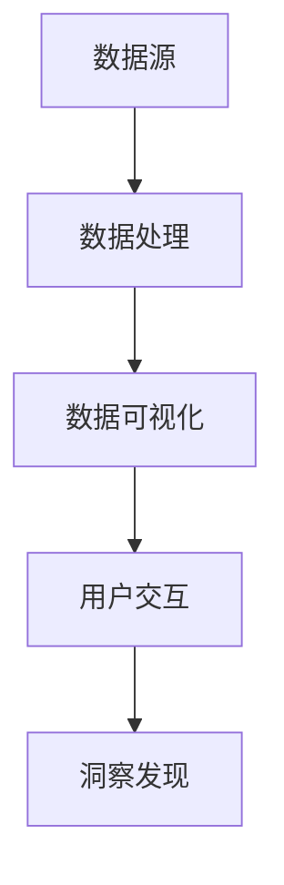

                 

关键词：数据可视化、信息图形、数据驱动设计、交互式可视化、图表设计、可视化工具

> 摘要：本文深入探讨了数据可视化技术，从基本概念、核心算法、数学模型，到实际应用和未来展望，全面揭示了数据可视化在数据分析和决策支持中的关键作用。通过本文，读者可以了解数据可视化如何将复杂的数据转化为易于理解和洞察的图形，以及如何有效地利用可视化工具和资源进行数据探索和展示。

## 1. 背景介绍

在当今数据驱动的社会中，数据可视化已经成为信息传递和决策支持的重要工具。数据可视化技术通过将数据以图形、图表和图像的形式展示出来，帮助用户快速理解和分析数据，发现潜在的模式和趋势。随着大数据和人工智能技术的发展，数据可视化在各个领域中的应用越来越广泛，如金融分析、医疗保健、市场营销、科学研究等。

然而，数据可视化并非仅仅是一种装饰，它具有深层次的技术原理和设计原则。一个有效的数据可视化方案不仅能够提高数据理解的效率，还能够激发用户的创造力和洞察力。本文将深入探讨数据可视化的核心概念、算法原理、数学模型，并通过实际项目实例来展示其应用和实践方法。

## 2. 核心概念与联系

### 2.1 数据可视化的定义

数据可视化（Data Visualization）是一种通过视觉元素（如图表、图形、地图等）来传达数据的分析和解释方法。其核心目的是将抽象的数据转化为直观的视觉形式，使得用户能够更快速、更准确地理解数据中的信息。

### 2.2 可视化元素

数据可视化涉及多种视觉元素，包括：

- **图表**：如条形图、折线图、饼图等，用于展示数据的分布和趋势。
- **图像**：如热图、散点图、三维图等，用于展示数据的结构和关系。
- **交互性**：通过用户与可视化界面的互动，如筛选、过滤、放大等操作，提供更细致的数据探索和分析。

### 2.3 可视化与信息图形的关系

信息图形（Information Graphics）是一种以图形和文字结合的形式传达信息的方法，它通常用于说明复杂的概念或数据关系。信息图形是数据可视化的一种重要形式，两者的区别在于，数据可视化更侧重于数据的呈现和分析，而信息图形则更注重信息的传达和解释。

### 2.4 数据可视化与数据驱动设计的联系

数据驱动设计（Data-Driven Design）是一种基于数据分析和用户行为数据来指导设计决策的方法。数据可视化是数据驱动设计的重要组成部分，通过可视化分析，设计者可以更好地理解用户需求，从而设计出更符合用户期望的产品。

### 2.5 数据可视化工具

目前市场上有许多数据可视化工具，如Tableau、Power BI、D3.js、Matplotlib等。这些工具提供了丰富的图表类型、交互功能和数据分析功能，使得数据可视化变得更加容易和高效。

### 2.6 Mermaid 流程图



上述流程图展示了数据可视化从数据源到用户交互的整个过程。数据源提供原始数据，通过数据处理转化为可视化数据，最终通过用户交互实现数据的深入分析和洞察。

## 3. 核心算法原理 & 具体操作步骤

### 3.1 算法原理概述

数据可视化算法的核心是数据转换和图形生成。数据转换包括数据的预处理、清洗和聚合，以便生成有效的可视化图形。图形生成则涉及各种图形绘制算法和优化技术，如渲染算法、图形布局算法等。

### 3.2 算法步骤详解

#### 3.2.1 数据预处理

1. **数据清洗**：去除无效或错误的数据，如空值、重复值等。
2. **数据转换**：将数据转换为适合可视化的格式，如将文本数据转换为数值或分类数据。
3. **数据聚合**：对数据进行分组、汇总等操作，以便在图表中展示数据的关系。

#### 3.2.2 图形生成

1. **选择图表类型**：根据数据类型和可视化目的选择合适的图表类型，如条形图、折线图、饼图等。
2. **布局算法**：对图表元素进行布局，确保图表的视觉效果最佳。
3. **渲染算法**：使用渲染算法将图表元素绘制在画布上。

### 3.3 算法优缺点

**优点**：

- **提高数据理解**：通过图形化的方式展示数据，帮助用户更快速、准确地理解数据。
- **直观性**：数据可视化使得复杂的数据关系变得更加直观，易于用户分析。
- **交互性**：通过用户与可视化界面的互动，用户可以更深入地探索数据。

**缺点**：

- **计算开销**：数据可视化涉及大量的计算，特别是在处理大量数据时，可能会对性能产生影响。
- **设计复杂性**：设计一个有效的数据可视化方案需要深入理解数据、用户需求和可视化工具。

### 3.4 算法应用领域

数据可视化算法广泛应用于各个领域，包括：

- **商业分析**：通过图表和报告帮助企业管理者了解业务状况和趋势。
- **科学研究**：通过可视化分析来探索科学数据和发现研究规律。
- **医疗保健**：通过可视化技术展示患者数据和医疗数据，帮助医生做出诊断和治疗决策。
- **金融领域**：通过可视化分析来监控市场动态和投资风险。

## 4. 数学模型和公式 & 详细讲解 & 举例说明

### 4.1 数学模型构建

数据可视化涉及多种数学模型，如统计学模型、线性代数模型、图形学模型等。以下是一个简单的统计学模型构建过程：

#### 4.1.1 数据采样

从原始数据中随机抽取一部分数据作为样本。

#### 4.1.2 数据描述

使用均值、方差等统计量描述数据的中心趋势和分散程度。

#### 4.1.3 数据可视化

使用统计图表（如直方图、箱线图等）展示数据的分布和趋势。

### 4.2 公式推导过程

以直方图为例，直方图的面积表示数据在某个区间内的频数。直方图的高度表示数据在某个区间内的频率。公式如下：

$$
h_i = \frac{f_i}{\sum_{i=1}^{n} f_i \times (x_i - x_{i-1})}
$$

其中，$h_i$ 为第 $i$ 个柱状图的高度，$f_i$ 为第 $i$ 个区间的频数，$n$ 为区间总数，$x_i$ 和 $x_{i-1}$ 分别为第 $i$ 个和第 $i-1$ 个区间的边界。

### 4.3 案例分析与讲解

#### 4.3.1 案例背景

某公司想要分析其销售额数据，以了解销售趋势和季节性特征。

#### 4.3.2 数据预处理

1. **数据清洗**：去除无效数据，如空值和重复值。
2. **数据转换**：将日期数据转换为月份，以便进行时间序列分析。
3. **数据聚合**：计算每个月的销售额。

#### 4.3.3 数据可视化

1. **选择图表类型**：使用折线图展示销售额随时间的变化。
2. **布局算法**：将图表元素布局在画布上，确保图表的视觉效果最佳。
3. **渲染算法**：使用渲染算法将折线图绘制在画布上。

#### 4.3.4 结果分析

通过折线图，公司可以直观地了解销售额随时间的变化趋势，以及是否存在明显的季节性特征。例如，如果销售额在每年的7月至9月期间明显增加，公司可以推测这是夏季促销活动导致的。

## 5. 项目实践：代码实例和详细解释说明

### 5.1 开发环境搭建

1. **安装Python环境**：在本地计算机上安装Python 3.x版本。
2. **安装Jupyter Notebook**：使用pip命令安装Jupyter Notebook。

### 5.2 源代码详细实现

以下是一个简单的Python代码实例，用于生成折线图展示销售额数据：

```python
import pandas as pd
import matplotlib.pyplot as plt

# 加载数据
data = pd.read_csv('sales_data.csv')

# 数据预处理
data['Month'] = pd.to_datetime(data['Date']).dt.month
monthly_sales = data.groupby('Month')['Sales'].sum()

# 数据可视化
monthly_sales.plot(kind='line')
plt.title('Monthly Sales')
plt.xlabel('Month')
plt.ylabel('Sales')
plt.show()
```

### 5.3 代码解读与分析

1. **数据加载**：使用pandas库加载CSV文件中的销售额数据。
2. **数据预处理**：将日期列转换为月份列，并计算每个月的销售额。
3. **数据可视化**：使用matplotlib库生成折线图，展示每个月的销售额。
4. **结果展示**：显示生成的图表。

通过这个简单的实例，我们可以看到如何使用Python进行数据加载、预处理和可视化。在实际项目中，可能需要处理更复杂的数据和图表类型，但基本原理和方法是类似的。

## 6. 实际应用场景

### 6.1 商业分析

在商业分析中，数据可视化可以帮助企业深入了解市场趋势、客户行为和业务绩效。例如，通过可视化分析，企业可以识别出销售高峰期和低谷期，从而调整营销策略和生产计划。

### 6.2 医疗保健

在医疗保健领域，数据可视化可以帮助医生和研究人员分析患者数据、药物效果和疾病传播趋势。例如，通过热图展示某个地区的疫情扩散情况，可以帮助卫生部门制定更有效的防控措施。

### 6.3 科学研究

在科学研究中，数据可视化可以帮助研究人员探索实验数据、发现科学规律。例如，通过可视化分析，研究人员可以识别出实验中的异常数据，从而调整实验设计或验证假设。

### 6.4 未来应用展望

随着技术的不断发展，数据可视化技术将更加智能化和自动化。未来的数据可视化工具将能够自动生成可视化报告，提供更深入的数据洞察。此外，虚拟现实和增强现实技术的融合也将使得数据可视化变得更加交互和沉浸式。

## 7. 工具和资源推荐

### 7.1 学习资源推荐

- 《数据可视化：理论与实践》
- 《数据可视化手册》
- 《数据可视化之美》

### 7.2 开发工具推荐

- Tableau
- Power BI
- D3.js
- Matplotlib

### 7.3 相关论文推荐

- "Visualizing Big Data" by Michael F. persisted
- "Effective Data Visualization" by Edward Tufte
- "Interactive Data Visualization for the Web" by Scott Murray

## 8. 总结：未来发展趋势与挑战

### 8.1 研究成果总结

本文总结了数据可视化的核心概念、算法原理、数学模型和实际应用场景，展示了数据可视化在各个领域的应用价值。通过实例代码，读者可以了解到如何使用Python进行数据加载、预处理和可视化。

### 8.2 未来发展趋势

未来的数据可视化技术将更加智能化、自动化，并与虚拟现实和增强现实技术融合。数据可视化工具将提供更丰富的图表类型、交互功能和数据分析功能。

### 8.3 面临的挑战

数据可视化技术面临的主要挑战包括处理大量数据的性能问题、设计有效的可视化方案以及确保可视化结果的准确性和可解释性。

### 8.4 研究展望

未来的研究应关注如何提高数据可视化工具的性能和智能化程度，开发更有效的可视化算法和模型，以及制定可视化设计标准，以帮助用户更好地理解和分析数据。

## 9. 附录：常见问题与解答

### Q：数据可视化技术如何处理大量数据？

A：处理大量数据的数据可视化技术包括数据采样、数据聚合和分布式计算等方法。例如，可以使用pandas库对数据进行分组和汇总，以提高数据处理的效率。

### Q：如何设计有效的数据可视化方案？

A：设计有效的数据可视化方案需要考虑数据类型、可视化目的、用户需求等因素。通常，遵循以下原则：简洁性、直观性、交互性、可扩展性。

### Q：数据可视化技术是否会影响数据隐私？

A：数据可视化技术在处理数据时需要遵守数据隐私保护法规，如GDPR等。在可视化过程中，应避免泄露敏感数据，并采取数据加密、脱敏等保护措施。

----------------------------------------------------------------

作者：禅与计算机程序设计艺术 / Zen and the Art of Computer Programming

