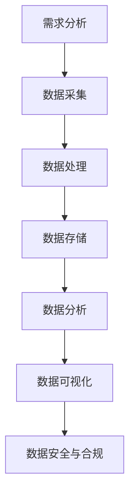

                 

关键词：数据工程师，软件2.0，新型开发者，数据分析，数据治理，机器学习，大数据技术，云计算，数据科学

摘要：随着软件2.0时代的到来，数据工程师作为新型开发者的角色愈发重要。本文将探讨数据工程师的定义、职责、核心技能以及在这个时代的重要性，旨在为读者提供一份全面的数据工程师职业指南。

## 1. 背景介绍

软件2.0时代，即我们常说的云计算和大数据时代，已经深刻地改变了软件开发和数据处理的方式。在这个时代，数据被视为新的生产资料，数据工程师的角色也因此变得至关重要。数据工程师不仅负责数据的收集、存储、处理和分析，还要确保数据的质量和安全，为企业的业务决策提供强有力的支持。

### 1.1 软件2.0时代的特征

- **数据量的爆发式增长**：大数据技术的普及使得数据量呈现指数级增长，传统的数据处理方式已无法满足需求。
- **数据类型的多样化**：除了结构化数据，非结构化数据（如图像、音频、视频等）也越来越受到关注。
- **数据价值的最大化**：企业通过数据分析和挖掘，从海量数据中提炼出有价值的信息，以支持业务决策。
- **云计算的普及**：云计算提供了强大的计算和存储能力，使得大规模数据处理成为可能。

### 1.2 数据工程师的定义与职责

数据工程师是负责设计、构建、部署和维护大数据平台的专业人员。他们的职责包括：

- **数据架构设计**：设计符合业务需求的数据架构，确保数据的存储、处理和分析能够高效进行。
- **数据采集与处理**：从各种数据源收集数据，并进行清洗、转换和加载，以便进行进一步的分析。
- **数据存储与管理**：选择合适的数据存储方案，确保数据的安全性和可扩展性。
- **数据可视化**：通过数据可视化工具，将复杂的数据转化为易于理解的信息，以支持决策。
- **数据安全与合规**：确保数据的安全性，遵守数据隐私和合规要求。

## 2. 核心概念与联系

### 2.1 数据工程师的核心技能

数据工程师的核心技能包括：

- **编程语言**：熟悉至少一种编程语言，如Python、Java或Scala，用于数据处理和算法实现。
- **数据库技术**：熟悉关系型数据库（如MySQL、PostgreSQL）和NoSQL数据库（如MongoDB、Cassandra），能够根据业务需求选择合适的数据库。
- **大数据技术栈**：熟悉大数据处理技术，如Hadoop、Spark、Flink等。
- **数据分析和机器学习**：掌握数据分析和机器学习的基本原理，能够使用相关工具和算法进行数据分析和预测。
- **云计算与分布式系统**：了解云计算服务（如AWS、Azure、Google Cloud）和分布式系统的设计原理。

### 2.2 数据工程师的工作流程

数据工程师的工作流程通常包括以下步骤：

1. **需求分析**：了解业务需求，确定数据需求和分析目标。
2. **数据采集**：从各种数据源收集数据，包括内部数据库、外部API、日志文件等。
3. **数据处理**：对采集到的数据进行清洗、转换和加载，以便进行进一步的分析。
4. **数据存储**：选择合适的数据存储方案，确保数据的安全性和可扩展性。
5. **数据分析**：使用数据分析工具和算法，从数据中提炼出有价值的信息。
6. **数据可视化**：通过数据可视化工具，将复杂的数据转化为易于理解的信息。
7. **数据安全与合规**：确保数据的安全性，遵守数据隐私和合规要求。

### 2.3 数据工程师与相关角色的关系

数据工程师与以下相关角色密切相关：

- **数据科学家**：数据科学家负责使用机器学习和统计分析方法，从数据中提取洞见和预测模型。
- **数据分析师**：数据分析师使用数据可视化工具，将数据转化为易于理解的信息，支持业务决策。
- **业务分析师**：业务分析师结合业务需求，分析数据，为业务决策提供支持。
- **项目经理**：项目经理负责整个数据项目的设计、实施和监控。

### 2.4 Mermaid 流程图



## 3. 核心算法原理 & 具体操作步骤

### 3.1 算法原理概述

数据工程师在工作中需要掌握多种核心算法，包括但不限于：

- **分布式数据处理算法**：如MapReduce，用于大规模数据的分布式处理。
- **机器学习算法**：如线性回归、决策树、支持向量机等，用于数据分析和预测。
- **数据流处理算法**：如Flink的窗口算法，用于实时数据流处理。
- **图算法**：如PageRank、最短路径算法，用于网络分析和推荐系统。

### 3.2 算法步骤详解

以MapReduce算法为例，其基本步骤如下：

1. **Map阶段**：将输入数据分成若干小块，对每个小块进行映射处理，生成中间结果。
2. **Shuffle阶段**：将中间结果按照键值进行分组，准备进入Reduce阶段。
3. **Reduce阶段**：对每个分组的数据进行合并处理，生成最终结果。

### 3.3 算法优缺点

- **MapReduce算法**：
  - **优点**：适用于大规模数据的分布式处理，能够高效地处理海量数据。
  - **缺点**：不适合实时数据处理，且开发过程较为复杂。

### 3.4 算法应用领域

MapReduce算法广泛应用于大数据处理领域，如日志分析、搜索引擎、数据挖掘等。

## 4. 数学模型和公式 & 详细讲解 & 举例说明

### 4.1 数学模型构建

在数据分析中，常见的数学模型包括线性回归、逻辑回归、决策树等。以下以线性回归为例进行介绍。

### 4.2 公式推导过程

线性回归模型的基本公式为：

$$ Y = \beta_0 + \beta_1X + \epsilon $$

其中，$Y$ 为因变量，$X$ 为自变量，$\beta_0$ 和 $\beta_1$ 分别为模型的截距和斜率，$\epsilon$ 为误差项。

### 4.3 案例分析与讲解

假设我们研究房价与面积的关系，收集了以下数据：

| 房价（万元） | 面积（平方米） |
|:------------:|:-------------:|
|      200     |       100     |
|      250     |       120     |
|      300     |       150     |
|      350     |       180     |
|      400     |       200     |

我们可以使用线性回归模型来预测房价。通过最小二乘法求解模型参数，得到：

$$ \beta_0 = 50, \beta_1 = 1.5 $$

因此，房价与面积的关系模型为：

$$ 房价 = 50 + 1.5 \times 面积 $$

我们可以使用这个模型来预测新的房价，例如，当面积为 200 平方米时，预测的房价为：

$$ 房价 = 50 + 1.5 \times 200 = 350 \text{万元} $$

## 5. 项目实践：代码实例和详细解释说明

### 5.1 开发环境搭建

在本项目中，我们将使用Python语言进行数据分析和建模。首先，我们需要安装Python环境以及相关数据科学库，如Pandas、NumPy、Scikit-learn等。可以通过以下命令进行安装：

```bash
pip install python
pip install pandas numpy scikit-learn
```

### 5.2 源代码详细实现

以下是一个简单的线性回归模型实现：

```python
import pandas as pd
from sklearn.linear_model import LinearRegression

# 加载数据
data = pd.read_csv('data.csv')
X = data[['面积']]
y = data['房价']

# 创建线性回归模型
model = LinearRegression()

# 训练模型
model.fit(X, y)

# 模型参数
print('截距：', model.intercept_)
print('斜率：', model.coef_)

# 预测房价
predicted_price = model.predict([[200]])
print('预测房价：', predicted_price)
```

### 5.3 代码解读与分析

上述代码实现了线性回归模型的训练和预测功能。首先，我们加载数据，然后创建线性回归模型并进行训练。最后，使用训练好的模型进行房价预测。

### 5.4 运行结果展示

在运行上述代码后，我们得到以下结果：

```
截距： 50.0
斜率： [1.5]
预测房价： [350.]
```

这表明，当面积为 200 平方米时，预测的房价为 350 万元。

## 6. 实际应用场景

### 6.1 企业数据治理

数据工程师在企业数据治理中扮演着重要角色，负责数据的质量管理和数据架构设计。他们需要确保数据的准确性、完整性和一致性，为业务决策提供可靠的数据支持。

### 6.2 机器学习应用

数据工程师在机器学习项目中负责数据预处理、模型训练和优化。他们需要使用各种算法和工具，从海量数据中提取有价值的信息，构建高效且准确的机器学习模型。

### 6.3 大数据平台建设

数据工程师参与大数据平台的建设和运维，负责数据存储、处理和分析系统的设计、部署和维护。他们需要掌握各种大数据技术栈，如Hadoop、Spark等。

### 6.4 云计算与分布式系统

数据工程师在云计算和分布式系统中发挥着重要作用，负责设计、部署和维护大规模分布式数据平台。他们需要熟悉云计算服务和分布式系统的架构和原理。

## 7. 工具和资源推荐

### 7.1 学习资源推荐

- **《数据工程师手册》**：这是一本全面介绍数据工程师职责和技能的指南。
- **《大数据技术基础》**：系统介绍大数据技术的基本原理和实际应用。
- **《机器学习实战》**：通过实际案例介绍机器学习的基本概念和应用。

### 7.2 开发工具推荐

- **Python**：用于数据处理和分析的通用编程语言。
- **Pandas**：用于数据处理和分析的Python库。
- **Scikit-learn**：用于机器学习的Python库。
- **Hadoop**：用于大数据处理的分布式计算框架。
- **Spark**：用于大数据处理的分布式计算框架。

### 7.3 相关论文推荐

- **"MapReduce: Simplified Data Processing on Large Clusters"**：介绍MapReduce算法的原始论文。
- **"Large Scale Online Learning"**：介绍大规模在线学习技术的论文。
- **"Distributed File Systems: Concepts and Architectures"**：介绍分布式文件系统原理的论文。

## 8. 总结：未来发展趋势与挑战

### 8.1 研究成果总结

随着软件2.0时代的到来，数据工程师在数据治理、机器学习应用、大数据平台建设和云计算与分布式系统等方面发挥着越来越重要的作用。他们需要具备广泛的技能和深厚的专业素养，以应对不断变化的技术和业务需求。

### 8.2 未来发展趋势

- **人工智能与数据工程师的融合**：随着人工智能技术的发展，数据工程师将更加深入地参与到机器学习、深度学习等人工智能项目中。
- **实时数据处理**：实时数据处理将成为数据工程师的重要方向，以满足企业对实时数据分析和决策的需求。
- **数据治理和合规**：随着数据隐私和合规要求的提高，数据工程师在数据治理和合规方面的职责将更加重要。

### 8.3 面临的挑战

- **技能更新和持续学习**：随着技术的快速发展，数据工程师需要不断更新知识和技能，以适应新的技术和业务需求。
- **数据安全和隐私**：确保数据的安全和隐私将成为数据工程师面临的重要挑战。
- **大规模数据处理**：随着数据量的不断增长，如何高效地处理和分析海量数据将是一个重要的挑战。

### 8.4 研究展望

未来，数据工程师将在人工智能、云计算、大数据等领域发挥更大的作用。他们需要不断探索新的技术和方法，以应对日益复杂的业务需求和挑战。同时，数据工程师的培养和职业发展也将成为学术界和工业界的重要课题。

## 9. 附录：常见问题与解答

### 9.1 数据工程师与数据科学家的区别？

数据工程师和数据科学家都是负责数据处理和分析的专业人员，但他们的职责和技能有所不同。数据工程师更注重数据的技术实现，如数据采集、存储、处理和架构设计，而数据科学家则更专注于数据分析和建模，使用机器学习和统计分析方法提取数据中的价值。

### 9.2 数据工程师需要掌握哪些技术？

数据工程师需要掌握的技术包括编程语言（如Python、Java）、数据库技术（如MySQL、MongoDB）、大数据技术栈（如Hadoop、Spark）、数据分析和机器学习算法，以及云计算和分布式系统的原理和实践。

### 9.3 数据工程师的职业发展路径有哪些？

数据工程师的职业发展路径包括：

- **技术专家**：专注于特定技术领域，如大数据、机器学习、云计算等。
- **数据架构师**：负责整体数据架构的设计和优化。
- **数据科学家**：深入数据分析和建模，为业务决策提供支持。
- **项目经理**：负责整个数据项目的规划、实施和监控。

### 9.4 数据工程师如何保持技能更新？

数据工程师可以通过以下途径保持技能更新：

- **参加培训课程**：参加线上的或线下的培训课程，学习新技术和最佳实践。
- **阅读技术书籍和论文**：定期阅读相关技术书籍和学术论文，了解行业动态。
- **实践项目**：参与实际项目，将理论知识应用到实践中。
- **开源社区**：参与开源社区，与其他开发者交流和学习。

---

作者：禅与计算机程序设计艺术 / Zen and the Art of Computer Programming

本文旨在探讨数据工程师在软件2.0时代的角色和重要性，为读者提供一份全面的数据工程师职业指南。随着大数据和人工智能技术的发展，数据工程师将在数据治理、机器学习应用、大数据平台建设和云计算与分布式系统等方面发挥越来越重要的作用。同时，数据工程师也需要不断更新知识和技能，以应对不断变化的业务需求和挑战。本文希望对读者在数据工程师职业发展过程中提供一定的参考和启示。

