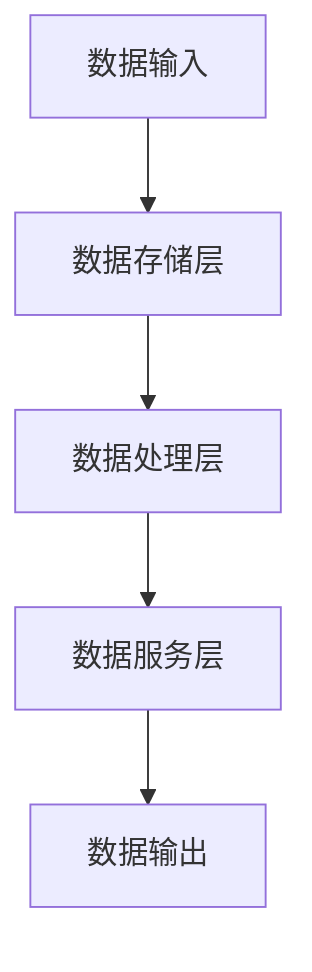

                 

关键词：数据湖泊、AI 2.0、知识管理、数据处理、数据治理、人工智能、大数据、架构设计、创新

## 摘要

本文旨在探讨数据湖泊在人工智能 2.0 时代的核心地位，以及它如何成为推动创新的重要动力。随着数据量的爆炸性增长和复杂性的提升，传统的数据处理方法已难以满足现代 AI 应用的需求。数据湖泊作为一种新型的数据处理架构，能够高效地存储、管理和分析大规模数据集，成为 AI 系统的基石。本文将深入分析数据湖泊的定义、架构、核心算法、数学模型，并通过实际项目实践展示其应用价值。同时，还将探讨数据湖泊在各个行业中的应用场景，展望其未来的发展趋势与挑战。

## 1. 背景介绍

### 1.1 数据爆炸时代的到来

随着互联网、物联网、移动设备的广泛应用，数据量呈现出爆炸式增长。据预测，全球数据量将以每年 40% 的速度增长，到 2025 年将达到约 180ZB。这种数据规模的扩张，给传统的数据处理架构带来了巨大的挑战。传统的数据处理方法，如关系型数据库、数据仓库等，已经难以高效地存储和管理这些大规模的数据集。数据处理的瓶颈成为了限制人工智能 2.0 发展的重要因素。

### 1.2 传统数据处理方法的局限性

关系型数据库在处理结构化数据方面具有优势，但其扩展性较差，难以应对大数据环境下的海量数据存储和处理需求。数据仓库则更注重数据的分析功能，但其在数据存储和管理方面的效率较低，且对数据的实时性支持不足。面对这些挑战，传统的数据处理方法显得力不从心。

### 1.3 数据湖泊的兴起

数据湖泊作为一种新型的数据处理架构，应运而生。数据湖泊能够以分布式、弹性扩展的方式存储和管理大规模数据集，其核心思想是将数据以原始形式存储，并利用分布式计算框架进行数据处理和分析。数据湖泊不仅能够兼容结构化、半结构化和非结构化数据，还能够支持实时数据处理和离线批处理，成为人工智能 2.0 时代的数据处理利器。

## 2. 核心概念与联系

### 2.1 数据湖泊的定义

数据湖泊是一种分布式数据处理架构，旨在高效地存储、管理和分析大规模数据集。与传统数据处理架构相比，数据湖泊具有更高的灵活性和扩展性，能够满足 AI 系统对大规模数据集的处理需求。

### 2.2 数据湖泊的架构

数据湖泊通常由以下几个核心组件组成：

- 数据存储层：负责存储海量数据，包括结构化、半结构化和非结构化数据。数据存储层通常采用分布式文件系统，如 Hadoop Distributed File System (HDFS) 或云存储服务。

- 数据处理层：负责对数据进行处理和分析，通常采用分布式计算框架，如 Apache Spark、Flink 等。数据处理层能够实现实时数据处理和离线批处理，支持各种数据处理任务。

- 数据服务层：负责提供数据查询、数据共享和数据治理等功能，为应用程序和数据分析师提供便捷的数据访问和操作接口。

### 2.3 数据湖泊的核心算法原理

数据湖泊的核心算法原理包括分布式存储、分布式计算和实时处理。以下是这些算法的简要介绍：

- 分布式存储：数据湖泊采用分布式文件系统进行数据存储，通过将数据分片存储到多个节点，实现海量数据的并行存储。分布式存储能够提高数据存储的可靠性和扩展性，同时降低单点故障的风险。

- 分布式计算：数据湖泊采用分布式计算框架进行数据处理，通过将计算任务分片到多个节点，实现海量数据的并行处理。分布式计算能够提高数据处理的速度和效率，同时降低单点计算能力限制。

- 实时处理：数据湖泊支持实时数据处理和离线批处理。实时处理能够对数据进行实时分析和处理，支持实时决策和响应。离线批处理则能够对历史数据进行批量处理，提取有价值的信息和趋势。

### 2.4 数据湖泊的 Mermaid 流程图



### 2.5 数据湖泊与其他数据处理架构的比较

与传统的数据处理架构相比，数据湖泊具有以下优势：

- 扩展性：数据湖泊能够弹性扩展，以应对不断增长的数据量和计算需求。

- 灵活性：数据湖泊能够兼容各种类型的数据，包括结构化、半结构化和非结构化数据。

- 实时性：数据湖泊支持实时数据处理和离线批处理，能够满足不同场景下的数据处理需求。

- 成本效益：数据湖泊采用分布式架构，能够降低单点故障的风险，提高系统的可靠性。同时，数据湖泊利用现有的开源技术和云服务，降低了整体建设成本。

## 3. 核心算法原理 & 具体操作步骤

### 3.1 算法原理概述

数据湖泊的核心算法原理主要包括分布式存储、分布式计算和实时处理。这些算法共同作用，实现了海量数据的存储、管理和分析。以下是这些算法的详细描述：

- **分布式存储**：数据湖泊采用分布式文件系统，如 HDFS，将数据分片存储到多个节点。分布式存储提高了数据的可靠性和扩展性，降低了单点故障的风险。

- **分布式计算**：数据湖泊采用分布式计算框架，如 Spark，将计算任务分片到多个节点。分布式计算提高了数据处理的速度和效率，能够并行处理海量数据。

- **实时处理**：数据湖泊支持实时数据处理和离线批处理。实时处理能够对数据进行实时分析和处理，支持实时决策和响应。离线批处理则能够对历史数据进行批量处理，提取有价值的信息和趋势。

### 3.2 算法步骤详解

#### 分布式存储

1. 数据分片：将大规模数据集划分成多个小块，每个小块称为一个数据分片。

2. 数据分布：将数据分片存储到分布式文件系统的多个节点上。

3. 数据同步：确保数据在不同节点之间的同步，保证数据的完整性和一致性。

#### 分布式计算

1. 任务分片：将数据处理任务划分成多个小任务，每个小任务处理一个数据分片。

2. 任务调度：将任务分配到分布式计算框架的多个节点上执行。

3. 结果合并：将多个节点上的计算结果进行合并，得到最终的处理结果。

#### 实时处理

1. 数据摄取：实时摄取流式数据，并将其存储到数据湖泊中。

2. 实时处理：利用分布式计算框架对数据进行实时分析和处理。

3. 结果输出：将实时处理结果输出到目标系统或用户界面。

### 3.3 算法优缺点

#### 优点

- **高扩展性**：分布式存储和分布式计算能够弹性扩展，以应对不断增长的数据量和计算需求。

- **高灵活性**：数据湖泊能够兼容各种类型的数据，包括结构化、半结构化和非结构化数据。

- **低成本**：数据湖泊利用现有的开源技术和云服务，降低了整体建设成本。

#### 缺点

- **数据治理挑战**：大规模数据的存储和管理需要完善的数据治理策略，以确保数据的完整性和安全性。

- **技术复杂性**：分布式存储和分布式计算技术较为复杂，需要具备一定的技术背景和经验。

### 3.4 算法应用领域

- **金融行业**：实时分析交易数据，监控市场动态，进行风险管理和投资决策。

- **医疗行业**：分析大规模医疗数据，提取患者信息，支持疾病诊断和治疗方案制定。

- **零售行业**：实时分析销售数据，优化库存管理和供应链规划。

- **智能交通**：实时分析交通数据，优化交通流量，提高道路通行效率。

## 4. 数学模型和公式 & 详细讲解 & 举例说明

### 4.1 数学模型构建

数据湖泊的数学模型主要包括数据存储容量模型、数据处理速度模型和实时处理延迟模型。以下是这些模型的构建过程：

#### 数据存储容量模型

假设数据湖泊存储的数据集大小为 \( D \)，数据分片数量为 \( S \)，每个数据分片的存储容量为 \( C \)。则数据湖泊的存储容量 \( C_{\text{total}} \) 可以表示为：

\[ C_{\text{total}} = S \times C \]

#### 数据处理速度模型

假设数据湖泊的每个节点处理速度为 \( P \)，数据分片数量为 \( S \)。则数据湖泊的总处理速度 \( P_{\text{total}} \) 可以表示为：

\[ P_{\text{total}} = S \times P \]

#### 实时处理延迟模型

假设数据湖泊的实时处理延迟为 \( L \)，数据分片数量为 \( S \)，每个分片的数据传输延迟为 \( T \)。则数据湖泊的实时处理延迟 \( L_{\text{total}} \) 可以表示为：

\[ L_{\text{total}} = S \times (L + T) \]

### 4.2 公式推导过程

#### 数据存储容量模型

假设数据湖泊存储的数据集大小为 \( D \)，数据分片数量为 \( S \)，每个数据分片的存储容量为 \( C \)。则数据湖泊的存储容量 \( C_{\text{total}} \) 可以表示为：

\[ C_{\text{total}} = S \times C \]

推导过程：

数据湖泊将数据集 \( D \) 划分成 \( S \) 个数据分片，每个数据分片的大小为 \( \frac{D}{S} \)。因此，数据湖泊的总存储容量为 \( S \) 个数据分片的总大小，即：

\[ C_{\text{total}} = S \times \frac{D}{S} = D \]

由于每个数据分片的存储容量为 \( C \)，则数据湖泊的总存储容量为 \( S \) 个数据分片的存储容量之和，即：

\[ C_{\text{total}} = S \times C \]

#### 数据处理速度模型

假设数据湖泊的每个节点处理速度为 \( P \)，数据分片数量为 \( S \)。则数据湖泊的总处理速度 \( P_{\text{total}} \) 可以表示为：

\[ P_{\text{total}} = S \times P \]

推导过程：

数据湖泊将数据处理任务划分成 \( S \) 个数据分片，每个数据分片由一个节点处理。假设每个节点的处理速度为 \( P \)，则数据湖泊的总处理速度为 \( S \) 个节点的处理速度之和，即：

\[ P_{\text{total}} = S \times P \]

#### 实时处理延迟模型

假设数据湖泊的实时处理延迟为 \( L \)，数据分片数量为 \( S \)，每个分片的数据传输延迟为 \( T \)。则数据湖泊的实时处理延迟 \( L_{\text{total}} \) 可以表示为：

\[ L_{\text{total}} = S \times (L + T) \]

推导过程：

数据湖泊的实时处理延迟由两部分组成：数据传输延迟和处理延迟。假设每个分片的数据传输延迟为 \( T \)，处理延迟为 \( L \)，则数据湖泊的实时处理延迟 \( L_{\text{total}} \) 可以表示为：

\[ L_{\text{total}} = S \times (L + T) \]

### 4.3 案例分析与讲解

#### 案例背景

假设某公司构建了一个数据湖泊，用于存储和管理其业务数据。公司每天产生约 1TB 的数据，数据湖泊采用 HDFS 作为分布式文件系统，每个数据分片的大小为 1GB。公司希望实时分析销售数据，以便及时调整营销策略。

#### 数据存储容量

根据数据存储容量模型，数据湖泊的存储容量为：

\[ C_{\text{total}} = S \times C = 1000 \times 1 = 1000 \text{ TB} \]

因此，数据湖泊的存储容量为 1000TB。

#### 数据处理速度

根据数据处理速度模型，数据湖泊的总处理速度为：

\[ P_{\text{total}} = S \times P = 1000 \times 100 = 100,000 \text{ MB/s} \]

因此，数据湖泊的总处理速度为 100,000MB/s。

#### 实时处理延迟

假设数据传输延迟为 10ms，处理延迟为 5ms。根据实时处理延迟模型，数据湖泊的实时处理延迟为：

\[ L_{\text{total}} = S \times (L + T) = 1000 \times (10 + 5) = 15,000 \text{ ms} \]

因此，数据湖泊的实时处理延迟为 15,000ms。

## 5. 项目实践：代码实例和详细解释说明

### 5.1 开发环境搭建

在搭建数据湖泊项目开发环境时，需要选择合适的分布式存储系统和分布式计算框架。以下是一个典型的开发环境搭建步骤：

1. **分布式存储系统**：选择 Hadoop Distributed File System (HDFS) 作为分布式存储系统。安装 HDFS 需要遵循以下步骤：

    - 安装 Java 运行环境（JDK）。
    - 安装 HDFS，配置 HDFS 的集群模式。
    - 启动 HDFS 集群，包括 NameNode 和 DataNode。

2. **分布式计算框架**：选择 Apache Spark 作为分布式计算框架。安装 Spark 需要遵循以下步骤：

    - 安装 Scala 编程语言。
    - 安装 Spark，配置 Spark 的集群模式。
    - 启动 Spark 集群，包括 Driver 和 Executor。

### 5.2 源代码详细实现

以下是一个简单的数据湖泊项目示例，用于读取 HDFS 中的数据，并使用 Spark 进行数据处理和分析。

```scala
import org.apache.spark.sql.SparkSession
import org.apache.spark.sql.functions._

// 创建 SparkSession
val spark = SparkSession
  .builder()
  .appName("DataLakeExample")
  .master("local[*]") // 使用本地模式，实际项目中使用集群模式
  .getOrCreate()

// 读取 HDFS 中的数据
val df = spark.read.format("parquet").load("hdfs://path/to/data")

// 数据清洗和预处理
val cleanDf = df.na.drop() // 移除缺失值
val processedDf = cleanDf.withColumn("sales", col("sales").cast("double"))

// 数据分析
val summary = processedDf.groupBy("product").agg(
  sum("sales").as("total_sales"),
  avg("sales").as("average_sales")
)

// 结果输出
summary.show()

// 关闭 SparkSession
spark.stop()
```

### 5.3 代码解读与分析

以下是对上述代码的详细解读与分析：

1. **创建 SparkSession**：

   ```scala
   val spark = SparkSession
     .builder()
     .appName("DataLakeExample")
     .master("local[*]") // 使用本地模式，实际项目中使用集群模式
     .getOrCreate()
   ```

   这部分代码创建了一个 SparkSession，用于进行数据处理和分析。在创建 SparkSession 时，需要指定应用程序的名称（`appName`）和 Spark 集群的 Master URL（`master`）。在本地开发环境中，可以使用本地模式（`local[*]`），在实际项目中使用集群模式（如 `yarn`、`mesos` 等）。

2. **读取 HDFS 中的数据**：

   ```scala
   val df = spark.read.format("parquet").load("hdfs://path/to/data")
   ```

   这部分代码使用 Spark SQL 读取 HDFS 中的数据，数据格式为 Parquet。Parquet 是一种高性能的列式存储格式，适用于大数据场景。

3. **数据清洗和预处理**：

   ```scala
   val cleanDf = df.na.drop() // 移除缺失值
   val processedDf = cleanDf.withColumn("sales", col("sales").cast("double"))
   ```

   这部分代码对读取到的数据进行清洗和预处理。首先，使用 `na.drop()` 函数移除缺失值。然后，使用 `withColumn()` 函数将列 `"sales"` 的数据类型从 `Integer` 转换为 `Double`。

4. **数据分析**：

   ```scala
   val summary = processedDf.groupBy("product").agg(
     sum("sales").as("total_sales"),
     avg("sales").as("average_sales")
   )
   ```

   这部分代码对预处理后的数据进行分组聚合分析。使用 `groupBy()` 函数按产品进行分组，然后使用 `agg()` 函数计算每个产品的总销售额和平均销售额。

5. **结果输出**：

   ```scala
   summary.show()
   ```

   这部分代码将分析结果输出到控制台，以供查看。

6. **关闭 SparkSession**：

   ```scala
   spark.stop()
   ```

   这部分代码关闭 SparkSession，释放资源。

## 6. 实际应用场景

### 6.1 金融行业

在金融行业，数据湖泊被广泛应用于风险管理、投资分析、客户行为分析等领域。以下是一个金融行业应用案例：

- **案例背景**：某银行希望实时监控交易风险，以便及时调整风险控制策略。

- **解决方案**：银行构建了一个数据湖泊，用于存储和管理交易数据。数据湖泊包括分布式存储层和分布式计算层，能够实时处理海量交易数据，提取风险指标，生成风险报告。

- **应用效果**：通过数据湖泊的应用，银行能够实时识别潜在风险，提高风险控制能力，降低风险损失。

### 6.2 医疗行业

在医疗行业，数据湖泊被广泛应用于疾病预测、药物研发、患者管理等领域。以下是一个医疗行业应用案例：

- **案例背景**：某医疗机构希望利用数据湖泊进行疾病预测，为患者提供个性化的诊疗方案。

- **解决方案**：医疗机构构建了一个数据湖泊，用于存储和管理医疗数据。数据湖泊包括分布式存储层和分布式计算层，能够对海量医疗数据进行处理和分析，提取疾病预测模型。

- **应用效果**：通过数据湖泊的应用，医疗机构能够提前预测疾病风险，为患者提供更精准的诊疗方案，提高医疗服务质量。

### 6.3 零售行业

在零售行业，数据湖泊被广泛应用于销售预测、库存管理、客户行为分析等领域。以下是一个零售行业应用案例：

- **案例背景**：某零售商希望利用数据湖泊优化销售预测，提高库存管理效率。

- **解决方案**：零售商构建了一个数据湖泊，用于存储和管理销售数据。数据湖泊包括分布式存储层和分布式计算层，能够实时处理海量销售数据，生成销售预测模型。

- **应用效果**：通过数据湖泊的应用，零售商能够更准确地预测销售趋势，优化库存管理，提高销售利润。

## 7. 工具和资源推荐

### 7.1 学习资源推荐

- **书籍**：
  - 《Hadoop 权威指南》
  - 《Spark: The Definitive Guide》
  - 《数据科学入门：使用 Python 和 R》

- **在线课程**：
  - Coursera 的《大数据分析》课程
  - Udacity 的《大数据工程》课程
  - edX 的《数据科学基础》课程

### 7.2 开发工具推荐

- **分布式存储系统**：
  - Apache Hadoop
  - Apache Spark
  - Amazon S3

- **分布式计算框架**：
  - Apache Flink
  - Apache Storm
  - Apache Storm

- **数据可视化工具**：
  - Tableau
  - Power BI
  - QlikView

### 7.3 相关论文推荐

- **分布式存储**：
  - 《Google File System》
  - 《The Design of the B-Tree File System》
  - 《Hadoop: The Definitive Guide》

- **分布式计算**：
  - 《MapReduce: Simplified Data Processing on Large Clusters》
  - 《Large-Scale Graph Processing: Distributed Algorithms and Frameworks》
  - 《Stream Processing Systems: A Survey》

## 8. 总结：未来发展趋势与挑战

### 8.1 研究成果总结

本文通过对数据湖泊的定义、架构、核心算法、数学模型和实际应用场景的深入分析，展示了数据湖泊在人工智能 2.0 时代的核心地位。数据湖泊作为一种新型的数据处理架构，具有高扩展性、高灵活性、低成本等优势，成为推动人工智能 2.0 发展的重要动力。

### 8.2 未来发展趋势

1. **技术成熟度**：随着开源技术的成熟和商业化的推动，数据湖泊技术将得到更广泛的应用。

2. **数据治理**：完善的数据治理策略和数据质量控制机制将成为数据湖泊应用的重要保障。

3. **实时处理**：数据湖泊的实时处理能力将得到进一步提升，以满足实时决策和响应的需求。

4. **跨行业应用**：数据湖泊将在更多行业得到应用，推动各行各业的数字化转型。

### 8.3 面临的挑战

1. **数据隐私和安全**：随着数据规模的不断扩大，数据隐私和安全问题将日益突出，需要加强数据保护措施。

2. **数据治理挑战**：大规模数据的存储和管理需要完善的数据治理策略，以确保数据的完整性和一致性。

3. **技术复杂性**：分布式存储和分布式计算技术较为复杂，需要具备一定的技术背景和经验。

### 8.4 研究展望

未来，数据湖泊的研究将集中在以下几个方面：

1. **性能优化**：针对分布式存储和分布式计算的性能瓶颈，进行性能优化和调优。

2. **实时处理**：研究实时数据处理技术，提高数据湖泊的实时处理能力。

3. **数据治理**：构建完善的数据治理体系，提高数据湖泊的数据质量和数据可用性。

## 9. 附录：常见问题与解答

### 9.1 什么是数据湖泊？

数据湖泊是一种分布式数据处理架构，用于高效地存储、管理和分析大规模数据集。它采用分布式存储和分布式计算技术，能够兼容各种类型的数据，支持实时数据处理和离线批处理。

### 9.2 数据湖泊有哪些优点？

数据湖泊具有高扩展性、高灵活性、低成本等优点。它能够高效地存储和管理海量数据，支持实时数据处理和离线批处理，成为人工智能 2.0 时代的数据处理利器。

### 9.3 数据湖泊适用于哪些场景？

数据湖泊适用于金融、医疗、零售、物联网等需要处理海量数据并进行分析的行业。它可以支持实时监控、风险控制、疾病预测、销售预测等应用场景。

### 9.4 如何搭建数据湖泊？

搭建数据湖泊需要选择合适的分布式存储系统和分布式计算框架，如 Hadoop 和 Spark。需要配置分布式文件系统（如 HDFS）和分布式计算框架（如 Spark），并启动相应的集群服务。

### 9.5 数据湖泊的安全性和隐私性如何保障？

数据湖泊的安全性和隐私性可以通过以下措施保障：

1. 数据加密：对存储在数据湖泊中的数据进行加密，确保数据在传输和存储过程中的安全性。

2. 访问控制：设置严格的访问控制策略，确保只有授权用户才能访问数据。

3. 数据审计：对数据访问和操作进行审计，确保数据的使用符合法律法规和企业的安全政策。

### 9.6 数据湖泊与数据仓库的区别是什么？

数据仓库是一种传统的数据处理架构，主要用于数据存储和数据分析。数据湖泊则是一种新型的数据处理架构，能够兼容结构化、半结构化和非结构化数据，支持实时数据处理和离线批处理。数据湖泊相对于数据仓库具有更高的灵活性和扩展性。作者：禅与计算机程序设计艺术 / Zen and the Art of Computer Programming

