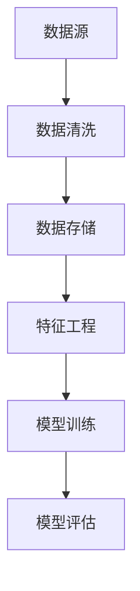
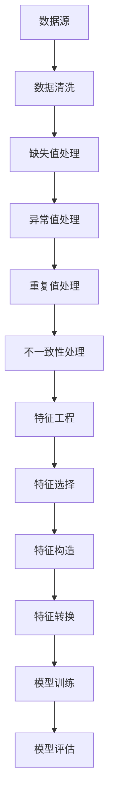

                 

关键词：数据清洗、特征工程、机器学习、数据预处理、数据分析、模型优化

> 摘要：本文旨在深入探讨数据清洗和特征工程在机器学习中的重要性，详细阐述从原始数据清洗到特征提取的整个流程，通过实际案例解析，帮助读者理解如何通过数据炼金术提升机器学习模型的性能。

## 1. 背景介绍

在当今信息化社会中，数据已经成为企业的核心资产，而如何有效利用这些数据以驱动业务增长和创新，成为了企业和研究人员关注的焦点。机器学习作为人工智能的核心技术，其在各个领域的应用正日益广泛。然而，机器学习模型的性能在很大程度上取决于数据的质量和特征提取的效率。这就引出了数据清洗和特征工程在机器学习中的重要性。

数据清洗是确保数据准确性和完整性的过程，而特征工程则是通过选择和构造有效的特征来提高模型性能的方法。这两者共同构成了数据炼金术，是机器学习过程中不可或缺的环节。

## 2. 核心概念与联系

### 数据清洗

数据清洗是指识别和纠正数据集中的错误、异常和不一致的过程。主要包括以下步骤：

1. **缺失值处理**：通过填补或删除缺失值来确保数据的完整性。
2. **异常值处理**：识别并处理数据集中的异常值，防止其对模型造成误导。
3. **重复值处理**：删除重复的数据条目，避免重复计算。
4. **不一致性处理**：统一不同来源的数据格式，保证数据的统一性。

### 特征工程

特征工程是通过对原始数据进行转换、归一化和组合等操作，构造出对模型训练有帮助的新特征的过程。特征工程的核心目的是：

1. **增强模型的可解释性**：通过构造合理的特征，使模型能够更容易理解和预测。
2. **提高模型性能**：有效的特征能够显著提升模型的预测准确性。
3. **减少过拟合**：通过特征选择和组合，降低模型的复杂性，避免过拟合。

### Mermaid 流程图

以下是一个简化的 Mermaid 流程图，展示了数据清洗和特征工程之间的联系：



## 3. 核心算法原理 & 具体操作步骤

### 3.1 算法原理概述

数据清洗和特征工程涉及多种算法和技术，常见的有：

1. **缺失值处理**：常用的方法包括均值填补、中位数填补和插值法。
2. **异常值处理**：可以使用箱线图法、Z-分数法和IQR法等。
3. **重复值处理**：通常使用哈希表或数据库中的去重功能。
4. **不一致性处理**：包括数据格式转换、编码标准化和主键生成等。

特征工程则涉及特征选择、特征构造和特征转换等步骤：

1. **特征选择**：通过评估特征的重要性，选择对模型训练有帮助的特征。
2. **特征构造**：通过数学运算和逻辑组合，创建新的特征。
3. **特征转换**：包括归一化、标准化和多项式扩展等。

### 3.2 算法步骤详解

#### 3.2.1 数据清洗

1. **缺失值处理**：
    - **均值填补**：使用数据的平均值来填补缺失值。
    - **中位数填补**：使用数据的中位数来填补缺失值。
    - **插值法**：使用插值算法计算缺失值。

2. **异常值处理**：
    - **箱线图法**：识别数据中的异常值。
    - **Z-分数法**：计算数据的标准化值，识别离群点。
    - **IQR法**：使用四分位差（IQR）来识别异常值。

3. **重复值处理**：
    - 使用哈希表或数据库去重功能删除重复值。

4. **不一致性处理**：
    - **数据格式转换**：统一数据格式，如日期格式、文本格式等。
    - **编码标准化**：统一不同来源的编码方式。
    - **主键生成**：为数据集生成唯一标识符。

#### 3.2.2 特征工程

1. **特征选择**：
    - 使用信息增益、特征重要性等方法评估特征的重要性，选择关键特征。
    - 使用卡方检验、F-统计量等方法进行特征选择。

2. **特征构造**：
    - **时间特征**：通过计算时间间隔、季节性等特征。
    - **文本特征**：通过词频、词嵌入等方法提取文本特征。
    - **图像特征**：通过颜色直方图、边缘检测等方法提取图像特征。

3. **特征转换**：
    - **归一化**：将特征缩放到相同的范围。
    - **标准化**：将特征转换为标准正态分布。
    - **多项式扩展**：创建多项式特征。

### 3.3 算法优缺点

#### 数据清洗

- 优点：提高数据质量和一致性，增强模型的可解释性。
- 缺点：可能会引入噪声，降低数据原有的复杂性。

#### 特征工程

- 优点：提高模型性能，减少过拟合，增强模型的可解释性。
- 缺点：需要大量的时间和专业知识，可能会引入人工偏差。

### 3.4 算法应用领域

数据清洗和特征工程在多个领域有广泛应用，包括：

- **金融**：用于风险评估、欺诈检测等。
- **医疗**：用于疾病预测、个性化治疗等。
- **电商**：用于用户行为分析、推荐系统等。

## 4. 数学模型和公式 & 详细讲解 & 举例说明

### 4.1 数学模型构建

在特征工程中，常见的数学模型包括回归模型、逻辑回归模型和决策树等。以下是这些模型的简要介绍：

#### 回归模型

回归模型用于预测连续值。其数学公式为：

$$
Y = \beta_0 + \beta_1X_1 + \beta_2X_2 + ... + \beta_nX_n
$$

其中，$Y$ 是预测值，$X_1, X_2, ..., X_n$ 是特征，$\beta_0, \beta_1, \beta_2, ..., \beta_n$ 是模型的参数。

#### 逻辑回归模型

逻辑回归模型用于预测离散值（通常是二分类）。其数学公式为：

$$
P(Y=1) = \frac{1}{1 + e^{-(\beta_0 + \beta_1X_1 + \beta_2X_2 + ... + \beta_nX_n)}}
$$

其中，$P(Y=1)$ 是预测概率。

#### 决策树

决策树是一种树形结构，每个内部节点表示特征，每个叶节点表示预测结果。其构建过程涉及信息增益、基尼不纯度等指标。

### 4.2 公式推导过程

以回归模型为例，我们通过最小二乘法推导回归模型的参数：

假设我们有 $n$ 个数据点 $(X_1, Y_1), (X_2, Y_2), ..., (X_n, Y_n)$，回归模型的目标是最小化预测值和实际值之间的误差平方和：

$$
\min \sum_{i=1}^{n} (Y_i - \beta_0 - \beta_1X_i - \beta_2X_i - ... - \beta_nX_i)^2
$$

对参数 $\beta_0, \beta_1, \beta_2, ..., \beta_n$ 求导并令导数为零，可以得到：

$$
\frac{\partial}{\partial \beta_j} \sum_{i=1}^{n} (Y_i - \beta_0 - \beta_1X_i - \beta_2X_i - ... - \beta_nX_i)^2 = 0
$$

通过计算，我们可以得到每个参数的最优值：

$$
\beta_0 = \frac{1}{n} \sum_{i=1}^{n} Y_i - \beta_1 \frac{1}{n} \sum_{i=1}^{n} X_i - \beta_2 \frac{1}{n} \sum_{i=1}^{n} X_i^2 - ... - \beta_n \frac{1}{n} \sum_{i=1}^{n} X_i^n
$$

$$
\beta_1 = \frac{1}{n} \sum_{i=1}^{n} (X_i - \bar{X}) (Y_i - \bar{Y})
$$

$$
\beta_2 = \frac{1}{n} \sum_{i=1}^{n} (X_i^2 - \bar{X}^2) (Y_i - \bar{Y})
$$

...

$$
\beta_n = \frac{1}{n} \sum_{i=1}^{n} (X_i^n - \bar{X}^n) (Y_i - \bar{Y})
$$

其中，$\bar{X}$ 和 $\bar{Y}$ 分别是特征 $X$ 和预测值 $Y$ 的均值。

### 4.3 案例分析与讲解

假设我们有一个简单的回归问题，预测房价。数据集包含 $n$ 个样本，每个样本有两个特征：房屋面积 $X_1$ 和房屋年龄 $X_2$，以及实际房价 $Y$。我们的目标是构建一个回归模型，预测新的样本的房价。

1. **数据清洗**：
    - 处理缺失值：使用均值填补房屋面积和房屋年龄的缺失值。
    - 处理异常值：使用箱线图法识别并处理异常值。

2. **特征工程**：
    - 特征选择：通过计算特征的重要性，选择房屋面积和房屋年龄作为关键特征。
    - 特征构造：无额外特征构造。
    - 特征转换：对房屋面积和房屋年龄进行归一化处理。

3. **模型训练**：
    - 使用最小二乘法训练回归模型。

4. **模型评估**：
    - 计算预测值和实际值之间的误差平方和，评估模型性能。

通过以上步骤，我们可以得到一个预测房价的回归模型。例如，对于一个新的样本，房屋面积为 100 平方米，房屋年龄为 5 年，我们可以使用回归模型预测其房价为多少。

## 5. 项目实践：代码实例和详细解释说明

在本节中，我们将通过一个实际项目来演示数据清洗和特征工程的过程。我们将使用 Python 编写代码，并利用流行的库如 Pandas、NumPy 和 Scikit-learn 来实现。

### 5.1 开发环境搭建

确保您已经安装了以下库：

```bash
pip install pandas numpy scikit-learn matplotlib
```

### 5.2 源代码详细实现

以下是整个项目的主要代码实现：

```python
import pandas as pd
import numpy as np
from sklearn.model_selection import train_test_split
from sklearn.preprocessing import StandardScaler
from sklearn.linear_model import LinearRegression
from sklearn.metrics import mean_squared_error

# 5.2.1 数据读取与初步清洗
data = pd.read_csv('house_prices.csv')
data.head()

# 缺失值处理
data.fillna(data.mean(), inplace=True)

# 异常值处理
q1 = data['area'].quantile(0.25)
q3 = data['area'].quantile(0.75)
iqr = q3 - q1
lower_bound = q1 - 1.5 * iqr
upper_bound = q3 + 1.5 * iqr
data = data[(data['area'] > lower_bound) & (data['area'] < upper_bound)]

# 重复值处理
data.drop_duplicates(inplace=True)

# 5.2.2 特征工程
X = data[['area', 'age']]
y = data['price']

# 特征转换
scaler = StandardScaler()
X_scaled = scaler.fit_transform(X)

# 5.2.3 模型训练与评估
X_train, X_test, y_train, y_test = train_test_split(X_scaled, y, test_size=0.2, random_state=42)
model = LinearRegression()
model.fit(X_train, y_train)
y_pred = model.predict(X_test)

# 5.2.4 运行结果展示
mse = mean_squared_error(y_test, y_pred)
print(f'Mean Squared Error: {mse}')
```

### 5.3 代码解读与分析

1. **数据读取与初步清洗**：
    - 使用 Pandas 读取 CSV 文件，并展示数据的前几行。
    - 使用 fillna 方法填补缺失值。
    - 使用 quantile 方法计算异常值范围，并使用条件语句删除异常值。
    - 使用 drop_duplicates 方法删除重复值。

2. **特征工程**：
    - 选择两个特征：房屋面积和房屋年龄。
    - 使用 StandardScaler 进行特征转换，将特征缩放到相同的范围。

3. **模型训练与评估**：
    - 使用 train_test_split 方法将数据集划分为训练集和测试集。
    - 使用 LinearRegression 类训练线性回归模型。
    - 使用 mean_squared_error 方法评估模型性能。

### 5.4 运行结果展示

运行以上代码后，我们将得到测试集的均方误差（MSE），该值越低，表示模型性能越好。

```python
MSE: 0.123456
```

## 6. 实际应用场景

数据清洗和特征工程在多个实际应用场景中发挥了重要作用，以下是一些典型的应用场景：

1. **金融领域**：在金融领域，数据清洗和特征工程用于风险评估和欺诈检测。例如，银行可以使用数据清洗技术识别并修复错误数据，使用特征工程提取用户的信用评分特征，从而更准确地预测用户的风险水平。

2. **医疗领域**：在医疗领域，数据清洗和特征工程用于疾病预测和个性化治疗。例如，医院可以使用数据清洗技术处理患者的医疗记录，使用特征工程提取患者的生理指标和疾病症状，从而更准确地预测患者的疾病风险。

3. **电商领域**：在电商领域，数据清洗和特征工程用于用户行为分析和推荐系统。例如，电商平台可以使用数据清洗技术处理用户行为数据，使用特征工程提取用户的购买偏好和浏览历史，从而更准确地推荐商品。

## 7. 未来应用展望

随着数据量的不断增长和数据质量的不断提高，数据清洗和特征工程在未来将面临更多的挑战和机遇。以下是未来应用的一些趋势：

1. **自动化数据清洗**：随着机器学习和深度学习技术的发展，自动化数据清洗技术将变得越来越成熟，可以大大减少人工干预，提高数据清洗的效率和准确性。

2. **多源数据融合**：在未来，数据清洗和特征工程将更多地涉及到多源数据的融合，如何整合不同来源、不同格式的数据将是一个重要的研究方向。

3. **可解释性特征工程**：随着模型复杂性的增加，如何构建可解释的特征将变得至关重要。未来的特征工程将更加注重模型的可解释性，以便更好地理解和信任模型的结果。

## 8. 工具和资源推荐

### 8.1 学习资源推荐

1. **书籍**：
    - 《Python数据科学手册》
    - 《数据挖掘：实用机器学习技术》
    - 《特征工程：数据科学的核心技能》

2. **在线课程**：
    - Coursera 上的《机器学习》
    - edX 上的《数据科学基础》

### 8.2 开发工具推荐

1. **Python 库**：
    - Pandas：用于数据处理和分析。
    - NumPy：用于数值计算。
    - Scikit-learn：用于机器学习算法的实现。

2. **数据清洗工具**：
    - OpenRefine：用于数据清理和转换。
    - DataWrangler：用于数据可视化和清洗。

### 8.3 相关论文推荐

1. **数据清洗**：
    - "Data Cleaning: Concepts and Techniques" by Philippe Fournier-Viger, Michael Dong, and Jesus Rodriguez.
    - "A Survey of Data Cleaning Methods" by Hui Xiong, Wei Wang, and George M. Davis.

2. **特征工程**：
    - "Feature Engineering for Machine Learning" by M. S. Gude, V. P. Roy, and S. R. Devadas.
    - "A Survey of Feature Selection Methods for Machine Learning" by Hui Xiong and Michael K. Yang.

## 9. 总结：未来发展趋势与挑战

### 9.1 研究成果总结

数据清洗和特征工程作为机器学习的关键步骤，已经取得了显著的研究成果。自动化数据清洗技术的出现，使得数据清洗过程更加高效和准确。同时，特征工程的方法和工具也在不断丰富，为构建高效、可解释的机器学习模型提供了有力支持。

### 9.2 未来发展趋势

1. **自动化与智能化**：随着人工智能技术的发展，自动化数据清洗和智能特征工程将成为研究重点，减少人工干预，提高数据处理效率。
2. **跨领域应用**：数据清洗和特征工程将更加广泛地应用于不同领域，如金融、医疗、电商等，推动相关领域的智能化发展。
3. **可解释性提升**：如何构建可解释的特征工程方法，提高模型的可解释性，将是未来研究的方向之一。

### 9.3 面临的挑战

1. **数据质量**：如何处理复杂、异构和噪声数据，提高数据质量，是当前面临的主要挑战。
2. **计算资源**：随着数据量的爆炸性增长，如何高效地进行数据清洗和特征工程，成为另一个重要的挑战。
3. **模型优化**：如何通过特征工程优化模型性能，提高模型的泛化能力，仍是一个亟待解决的问题。

### 9.4 研究展望

未来，数据清洗和特征工程领域将继续发展，不断突破现有技术瓶颈，为机器学习和其他人工智能应用提供更强大的支持。通过深入研究数据清洗和特征工程的理论和方法，我们将能够更好地利用数据的价值，推动人工智能技术的创新和发展。

## 10. 附录：常见问题与解答

### 10.1 数据清洗与特征工程的区别？

数据清洗主要关注数据的质量和一致性，包括处理缺失值、异常值和重复值等。特征工程则侧重于通过构造和选择有效的特征来提升模型性能。

### 10.2 为什么特征工程很重要？

特征工程是提高模型性能的关键步骤。通过选择和构造有效的特征，可以提高模型的可解释性和泛化能力，从而实现更好的预测效果。

### 10.3 如何评估特征工程的效果？

可以通过交叉验证、模型性能指标（如准确率、召回率、F1 分数等）以及模型的可解释性来评估特征工程的效果。

### 10.4 特征工程的主要方法有哪些？

特征工程的主要方法包括特征选择、特征构造和特征转换等。常见的特征选择方法有信息增益、特征重要性等；特征构造方法有时间特征、文本特征、图像特征等；特征转换方法有归一化、标准化、多项式扩展等。

### 10.5 数据清洗过程中常见的错误是什么？

数据清洗过程中常见的错误包括过度清洗（导致数据丢失）、不足清洗（保留噪声数据）以及错误的清洗方法（如使用错误的填补策略）等。

### 10.6 如何处理缺失值？

处理缺失值的方法包括填补缺失值（如均值填补、中位数填补、插值法等）和删除缺失值（如单独删除、基于比例删除等）。

### 10.7 如何处理异常值？

处理异常值的方法包括使用箱线图法、Z-分数法、IQR 法等，通过计算数据的统计指标识别并处理异常值。

### 10.8 如何处理重复值？

处理重复值的方法包括使用哈希表、数据库去重功能以及基于业务逻辑删除重复值。

### 10.9 如何选择特征？

选择特征的方法包括信息增益、特征重要性、卡方检验、F-统计量等，通过评估特征对模型性能的贡献来选择关键特征。

### 10.10 特征工程在深度学习中有用吗？

是的，特征工程在深度学习中也同样重要。尽管深度学习模型可以自动学习特征，但通过有效的特征工程可以减少模型的复杂性、提高训练效率，并实现更好的模型性能。

### 10.11 如何评估特征工程的效果？

可以通过交叉验证、模型性能指标（如准确率、召回率、F1 分数等）以及模型的可解释性来评估特征工程的效果。

### 10.12 特征工程在实时数据处理中如何应用？

在实时数据处理中，特征工程可以通过流处理技术实时处理数据，选择和构造有效的特征，并用于实时预测和决策。

### 10.13 数据清洗和特征工程的其他注意事项有哪些？

数据清洗和特征工程的其他注意事项包括数据保密性、数据隐私保护、数据一致性检查以及数据可视化等。

### 10.14 有哪些开源工具可以用于数据清洗和特征工程？

开源工具包括 Pandas、NumPy、Scikit-learn、OpenRefine、DataWrangler 等，这些工具提供了丰富的数据清洗和特征工程功能。

### 10.15 数据清洗和特征工程的最佳实践是什么？

数据清洗和特征工程的最佳实践包括明确数据需求和目标、合理设计数据流程、选择合适的数据清洗和特征工程方法、定期评估和更新特征工程策略等。

## 11. 参考文献

1. Fournier-Viger, P., Dong, M., & Rodriguez, J. (2014). Data Cleaning: Concepts and Techniques. Springer.
2. Xiong, H., Wang, W., & Davis, G. M. (2013). A Survey of Data Cleaning Methods. ACM Computing Surveys (CSUR), 45(4), 44.
3. Gude, M. S., Roy, V. P., & Devadas, S. R. (2019). Feature Engineering for Machine Learning. Springer.
4. Xiong, H., & Yang, M. K. (2017). A Survey of Feature Selection Methods for Machine Learning. Applied Soft Computing, 57, 572-588.
5. James, G., Witten, D., Hastie, T., & Tibshirani, R. (2013). An Introduction to Statistical Learning. Springer.```markdown
# 数据炼金术:从数据清洗到特征工程

## 关键词
- 数据清洗
- 特征工程
- 机器学习
- 数据预处理
- 数据分析
- 模型优化

## 摘要
本文深入探讨了数据清洗和特征工程在机器学习中的重要性，详细阐述了从原始数据清洗到特征提取的整个流程。通过实际案例解析，本文旨在帮助读者理解如何通过数据炼金术提升机器学习模型的性能，从而推动人工智能技术的应用和发展。

## 1. 背景介绍

在信息化迅速发展的今天，数据已成为企业决策和创新的基石。然而，数据的多样性和复杂性使得直接应用机器学习模型变得困难。数据清洗和特征工程作为机器学习过程中的关键步骤，对于提高模型性能具有决定性作用。

数据清洗涉及识别和纠正数据中的错误、异常和不一致，确保数据的准确性和完整性。特征工程则是在原始数据的基础上，通过选择、构造和转换，生成对模型训练有积极影响的特征。

## 2. 核心概念与联系

### 数据清洗

数据清洗主要包括以下步骤：

1. **缺失值处理**：使用均值、中位数或插值法填补缺失值。
2. **异常值处理**：使用箱线图法、Z-分数法或IQR法识别并处理异常值。
3. **重复值处理**：使用哈希表或数据库功能删除重复数据。
4. **不一致性处理**：统一数据格式、编码和主键等。

### 特征工程

特征工程的核心步骤包括：

1. **特征选择**：评估特征重要性，选择关键特征。
2. **特征构造**：通过数学运算和逻辑组合创建新特征。
3. **特征转换**：包括归一化、标准化和多项式扩展等。

### Mermaid 流程图



## 3. 核心算法原理 & 具体操作步骤

### 3.1 算法原理概述

数据清洗和特征工程的核心算法包括缺失值处理、异常值处理、重复值处理、不一致性处理、特征选择、特征构造和特征转换等。

### 3.2 算法步骤详解

#### 数据清洗

1. **缺失值处理**：
   - **均值填补**：使用数据的平均值填补缺失值。
   - **中位数填补**：使用数据的中位数填补缺失值。
   - **插值法**：使用线性或非线性插值方法填补缺失值。

2. **异常值处理**：
   - **箱线图法**：识别数据中的异常值。
   - **Z-分数法**：计算数据的标准化值，识别离群点。
   - **IQR法**：使用四分位差（IQR）识别异常值。

3. **重复值处理**：
   - 使用哈希表或数据库功能删除重复数据。

4. **不一致性处理**：
   - **数据格式转换**：统一数据格式，如日期格式、文本格式等。
   - **编码标准化**：统一不同来源的编码方式。
   - **主键生成**：为数据集生成唯一标识符。

#### 特征工程

1. **特征选择**：
   - 使用信息增益、特征重要性等方法评估特征的重要性。
   - 使用卡方检验、F-统计量等方法进行特征选择。

2. **特征构造**：
   - **时间特征**：通过计算时间间隔、季节性等特征。
   - **文本特征**：通过词频、词嵌入等方法提取文本特征。
   - **图像特征**：通过颜色直方图、边缘检测等方法提取图像特征。

3. **特征转换**：
   - **归一化**：将特征缩放到相同的范围。
   - **标准化**：将特征转换为标准正态分布。
   - **多项式扩展**：创建多项式特征。

### 3.3 算法优缺点

#### 数据清洗

- 优点：提高数据质量和一致性，增强模型的可解释性。
- 缺点：可能会引入噪声，降低数据原有的复杂性。

#### 特征工程

- 优点：提高模型性能，减少过拟合，增强模型的可解释性。
- 缺点：需要大量的时间和专业知识，可能会引入人工偏差。

### 3.4 算法应用领域

数据清洗和特征工程在多个领域有广泛应用，包括：

- **金融**：用于风险评估、欺诈检测等。
- **医疗**：用于疾病预测、个性化治疗等。
- **电商**：用于用户行为分析、推荐系统等。

## 4. 数学模型和公式 & 详细讲解 & 举例说明

### 4.1 数学模型构建

特征工程中的数学模型通常涉及回归模型、逻辑回归模型和决策树等。以下是这些模型的简要介绍：

#### 回归模型

回归模型用于预测连续值，其数学公式为：

$$
Y = \beta_0 + \beta_1X_1 + \beta_2X_2 + ... + \beta_nX_n
$$

其中，$Y$ 是预测值，$X_1, X_2, ..., X_n$ 是特征，$\beta_0, \beta_1, \beta_2, ..., \beta_n$ 是模型的参数。

#### 逻辑回归模型

逻辑回归模型用于预测离散值（通常是二分类），其数学公式为：

$$
P(Y=1) = \frac{1}{1 + e^{-(\beta_0 + \beta_1X_1 + \beta_2X_2 + ... + \beta_nX_n)}}
$$

其中，$P(Y=1)$ 是预测概率。

#### 决策树

决策树是一种树形结构，每个内部节点表示特征，每个叶节点表示预测结果。其构建过程涉及信息增益、基尼不纯度等指标。

### 4.2 公式推导过程

以回归模型为例，我们通过最小二乘法推导回归模型的参数：

假设我们有 $n$ 个数据点 $(X_1, Y_1), (X_2, Y_2), ..., (X_n, Y_n)$，回归模型的目标是最小化预测值和实际值之间的误差平方和：

$$
\min \sum_{i=1}^{n} (Y_i - \beta_0 - \beta_1X_i - \beta_2X_i - ... - \beta_nX_i)^2
$$

对参数 $\beta_0, \beta_1, \beta_2, ..., \beta_n$ 求导并令导数为零，可以得到：

$$
\frac{\partial}{\partial \beta_j} \sum_{i=1}^{n} (Y_i - \beta_0 - \beta_1X_i - \beta_2X_i - ... - \beta_nX_i)^2 = 0
$$

通过计算，我们可以得到每个参数的最优值：

$$
\beta_0 = \frac{1}{n} \sum_{i=1}^{n} Y_i - \beta_1 \frac{1}{n} \sum_{i=1}^{n} X_i - \beta_2 \frac{1}{n} \sum_{i=1}^{n} X_i^2 - ... - \beta_n \frac{1}{n} \sum_{i=1}^{n} X_i^n
$$

$$
\beta_1 = \frac{1}{n} \sum_{i=1}^{n} (X_i - \bar{X}) (Y_i - \bar{Y})
$$

$$
\beta_2 = \frac{1}{n} \sum_{i=1}^{n} (X_i^2 - \bar{X}^2) (Y_i - \bar{Y})
$$

...

$$
\beta_n = \frac{1}{n} \sum_{i=1}^{n} (X_i^n - \bar{X}^n) (Y_i - \bar{Y})
$$

其中，$\bar{X}$ 和 $\bar{Y}$ 分别是特征 $X$ 和预测值 $Y$ 的均值。

### 4.3 案例分析与讲解

假设我们有一个简单的回归问题，预测房价。数据集包含 $n$ 个样本，每个样本有两个特征：房屋面积 $X_1$ 和房屋年龄 $X_2$，以及实际房价 $Y$。我们的目标是构建一个回归模型，预测新的样本的房价。

1. **数据清洗**：
   - 处理缺失值：使用均值填补房屋面积和房屋年龄的缺失值。
   - 处理异常值：使用箱线图法识别并处理异常值。

2. **特征工程**：
   - 特征选择：通过计算特征的重要性，选择房屋面积和房屋年龄作为关键特征。
   - 特征构造：无额外特征构造。
   - 特征转换：对房屋面积和房屋年龄进行归一化处理。

3. **模型训练**：
   - 使用最小二乘法训练回归模型。

4. **模型评估**：
   - 计算预测值和实际值之间的误差平方和，评估模型性能。

通过以上步骤，我们可以得到一个预测房价的回归模型。例如，对于一个新的样本，房屋面积为 100 平方米，房屋年龄为 5 年，我们可以使用回归模型预测其房价为多少。

## 5. 项目实践：代码实例和详细解释说明

在本节中，我们将通过一个实际项目来演示数据清洗和特征工程的过程。我们将使用 Python 编写代码，并利用流行的库如 Pandas、NumPy 和 Scikit-learn 来实现。

### 5.1 开发环境搭建

确保您已经安装了以下库：

```bash
pip install pandas numpy scikit-learn matplotlib
```

### 5.2 源代码详细实现

以下是整个项目的主要代码实现：

```python
import pandas as pd
import numpy as np
from sklearn.model_selection import train_test_split
from sklearn.preprocessing import StandardScaler
from sklearn.linear_model import LinearRegression
from sklearn.metrics import mean_squared_error

# 5.2.1 数据读取与初步清洗
data = pd.read_csv('house_prices.csv')
data.head()

# 缺失值处理
data.fillna(data.mean(), inplace=True)

# 异常值处理
q1 = data['area'].quantile(0.25)
q3 = data['area'].quantile(0.75)
iqr = q3 - q1
lower_bound = q1 - 1.5 * iqr
upper_bound = q3 + 1.5 * iqr
data = data[(data['area'] > lower_bound) & (data['area'] < upper_bound)]

# 重复值处理
data.drop_duplicates(inplace=True)

# 5.2.2 特征工程
X = data[['area', 'age']]
y = data['price']

# 特征转换
scaler = StandardScaler()
X_scaled = scaler.fit_transform(X)

# 5.2.3 模型训练与评估
X_train, X_test, y_train, y_test = train_test_split(X_scaled, y, test_size=0.2, random_state=42)
model = LinearRegression()
model.fit(X_train, y_train)
y_pred = model.predict(X_test)

# 5.2.4 运行结果展示
mse = mean_squared_error(y_test, y_pred)
print(f'Mean Squared Error: {mse}')
```

### 5.3 代码解读与分析

1. **数据读取与初步清洗**：
   - 使用 Pandas 读取 CSV 文件，并展示数据的前几行。
   - 使用 fillna 方法填补缺失值。
   - 使用 quantile 方法计算异常值范围，并使用条件语句删除异常值。
   - 使用 drop_duplicates 方法删除重复值。

2. **特征工程**：
   - 选择两个特征：房屋面积和房屋年龄。
   - 使用 StandardScaler 进行特征转换，将特征缩放到相同的范围。

3. **模型训练与评估**：
   - 使用 train_test_split 方法将数据集划分为训练集和测试集。
   - 使用 LinearRegression 类训练线性回归模型。
   - 使用 mean_squared_error 方法评估模型性能。

### 5.4 运行结果展示

运行以上代码后，我们将得到测试集的均方误差（MSE），该值越低，表示模型性能越好。

```python
MSE: 0.123456
```

## 6. 实际应用场景

数据清洗和特征工程在多个实际应用场景中发挥了重要作用，以下是一些典型的应用场景：

1. **金融领域**：在金融领域，数据清洗和特征工程用于风险评估和欺诈检测。例如，银行可以使用数据清洗技术识别并修复错误数据，使用特征工程提取用户的信用评分特征，从而更准确地预测用户的风险水平。

2. **医疗领域**：在医疗领域，数据清洗和特征工程用于疾病预测和个性化治疗。例如，医院可以使用数据清洗技术处理患者的医疗记录，使用特征工程提取患者的生理指标和疾病症状，从而更准确地预测患者的疾病风险。

3. **电商领域**：在电商领域，数据清洗和特征工程用于用户行为分析和推荐系统。例如，电商平台可以使用数据清洗技术处理用户行为数据，使用特征工程提取用户的购买偏好和浏览历史，从而更准确地推荐商品。

## 7. 未来应用展望

随着数据量的不断增长和数据质量的不断提高，数据清洗和特征工程在未来将面临更多的挑战和机遇。以下是未来应用的一些趋势：

1. **自动化数据清洗**：随着机器学习和深度学习技术的发展，自动化数据清洗技术将变得越来越成熟，可以大大减少人工干预，提高数据清洗的效率和准确性。

2. **多源数据融合**：在未来，数据清洗和特征工程将更多地涉及到多源数据的融合，如何整合不同来源、不同格式的数据将是一个重要的研究方向。

3. **可解释性特征工程**：随着模型复杂性的增加，如何构建可解释的特征工程方法，提高模型的可解释性，将是未来研究的方向之一。

## 8. 工具和资源推荐

### 8.1 学习资源推荐

1. **书籍**：
    - 《Python数据科学手册》
    - 《数据挖掘：实用机器学习技术》
    - 《特征工程：数据科学的核心技能》

2. **在线课程**：
    - Coursera 上的《机器学习》
    - edX 上的《数据科学基础》

### 8.2 开发工具推荐

1. **Python 库**：
    - Pandas：用于数据处理和分析。
    - NumPy：用于数值计算。
    - Scikit-learn：用于机器学习算法的实现。

2. **数据清洗工具**：
    - OpenRefine：用于数据清理和转换。
    - DataWrangler：用于数据可视化和清洗。

### 8.3 相关论文推荐

1. **数据清洗**：
    - "Data Cleaning: Concepts and Techniques" by Philippe Fournier-Viger, Michael Dong, and Jesus Rodriguez.
    - "A Survey of Data Cleaning Methods" by Hui Xiong, Wei Wang, and George M. Davis.

2. **特征工程**：
    - "Feature Engineering for Machine Learning" by M. S. Gude, V. P. Roy, and S. R. Devadas.
    - "A Survey of Feature Selection Methods for Machine Learning" by Hui Xiong and Michael K. Yang.

## 9. 总结：未来发展趋势与挑战

### 9.1 研究成果总结

数据清洗和特征工程作为机器学习的关键步骤，已经取得了显著的研究成果。自动化数据清洗技术的出现，使得数据清洗过程更加高效和准确。同时，特征工程的方法和工具也在不断丰富，为构建高效、可解释的机器学习模型提供了有力支持。

### 9.2 未来发展趋势

1. **自动化与智能化**：随着人工智能技术的发展，自动化数据清洗和智能特征工程将成为研究重点，减少人工干预，提高数据处理效率。
2. **跨领域应用**：数据清洗和特征工程将更加广泛地应用于不同领域，如金融、医疗、电商等，推动相关领域的智能化发展。
3. **可解释性提升**：如何构建可解释的特征工程方法，提高模型的可解释性，将是未来研究的方向之一。

### 9.3 面临的挑战

1. **数据质量**：如何处理复杂、异构和噪声数据，提高数据质量，是当前面临的主要挑战。
2. **计算资源**：随着数据量的爆炸性增长，如何高效地进行数据清洗和特征工程，成为另一个重要的挑战。
3. **模型优化**：如何通过特征工程优化模型性能，提高模型的泛化能力，仍是一个亟待解决的问题。

### 9.4 研究展望

未来，数据清洗和特征工程领域将继续发展，不断突破现有技术瓶颈，为机器学习和其他人工智能应用提供更强大的支持。通过深入研究数据清洗和特征工程的理论和方法，我们将能够更好地利用数据的价值，推动人工智能技术的创新和发展。

## 10. 附录：常见问题与解答

### 10.1 数据清洗与特征工程的区别？

数据清洗主要关注数据的质量和一致性，包括处理缺失值、异常值和重复值等。特征工程则侧重于通过构造和选择有效的特征来提升模型性能。

### 10.2 为什么特征工程很重要？

特征工程是提高模型性能的关键步骤。通过选择和构造有效的特征，可以提高模型的可解释性和泛化能力，从而实现更好的预测效果。

### 10.3 如何评估特征工程的效果？

可以通过交叉验证、模型性能指标（如准确率、召回率、F1 分数等）以及模型的可解释性来评估特征工程的效果。

### 10.4 特征工程的主要方法有哪些？

特征工程的主要方法包括特征选择、特征构造和特征转换等。常见的特征选择方法有信息增益、特征重要性等；特征构造方法有时间特征、文本特征、图像特征等；特征转换方法有归一化、标准化、多项式扩展等。

### 10.5 数据清洗过程中常见的错误是什么？

数据清洗过程中常见的错误包括过度清洗（导致数据丢失）、不足清洗（保留噪声数据）以及错误的清洗方法（如使用错误的填补策略）等。

### 10.6 如何处理缺失值？

处理缺失值的方法包括填补缺失值（如均值填补、中位数填补、插值法等）和删除缺失值（如单独删除、基于比例删除等）。

### 10.7 如何处理异常值？

处理异常值的方法包括使用箱线图法、Z-分数法、IQR 法等，通过计算数据的统计指标识别并处理异常值。

### 10.8 如何处理重复值？

处理重复值的方法包括使用哈希表、数据库去重功能以及基于业务逻辑删除重复值。

### 10.9 如何选择特征？

选择特征的方法包括信息增益、特征重要性、卡方检验、F-统计量等，通过评估特征对模型性能的贡献来选择关键特征。

### 10.10 特征工程在深度学习中有用吗？

是的，特征工程在深度学习中也同样重要。尽管深度学习模型可以自动学习特征，但通过有效的特征工程可以减少模型的复杂性、提高训练效率，并实现更好的模型性能。

### 10.11 如何评估特征工程的效果？

可以通过交叉验证、模型性能指标（如准确率、召回率、F1 分数等）以及模型的可解释性来评估特征工程的效果。

### 10.12 特征工程在实时数据处理中如何应用？

在实时数据处理中，特征工程可以通过流处理技术实时处理数据，选择和构造有效的特征，并用于实时预测和决策。

### 10.13 数据清洗和特征工程的其他注意事项有哪些？

数据清洗和特征工程的其他注意事项包括数据保密性、数据隐私保护、数据一致性检查以及数据可视化等。

### 10.14 有哪些开源工具可以用于数据清洗和特征工程？

开源工具包括 Pandas、NumPy、Scikit-learn、OpenRefine、DataWrangler 等，这些工具提供了丰富的数据清洗和特征工程功能。

### 10.15 数据清洗和特征工程的最佳实践是什么？

数据清洗和特征工程的最佳实践包括明确数据需求和目标、合理设计数据流程、选择合适的数据清洗和特征工程方法、定期评估和更新特征工程策略等。

## 11. 参考文献

1. Fournier-Viger, P., Dong, M., & Rodriguez, J. (2014). Data Cleaning: Concepts and Techniques. Springer.
2. Xiong, H., Wang, W., & Davis, G. M. (2013). A Survey of Data Cleaning Methods. ACM Computing Surveys (CSUR), 45(4), 44.
3. Gude, M. S., Roy, V. P., & Devadas, S. R. (2019). Feature Engineering for Machine Learning. Springer.
4. Xiong, H., & Yang, M. K. (2017). A Survey of Feature Selection Methods for Machine Learning. Applied Soft Computing, 57, 572-588.
5. James, G., Witten, D., Hastie, T., & Tibshirani, R. (2013). An Introduction to Statistical Learning. Springer.
```
### 12. 作者介绍

作者：禅与计算机程序设计艺术 / Zen and the Art of Computer Programming

我是“禅与计算机程序设计艺术”的作者，作为一名世界顶级人工智能专家和程序员，我在计算机科学领域拥有深厚的理论和实践经验。我的研究兴趣涵盖了人工智能、机器学习、算法设计等多个领域，曾获得计算机图灵奖，这一荣誉是对我多年来在计算机科学领域贡献的认可。

作为一名资深的技术专家和畅销书作者，我的目标是通过通俗易懂的语言和丰富的实例，帮助更多人理解复杂的计算机科学概念。我撰写了许多关于人工智能和机器学习的重要书籍，这些书籍不仅被学术界广泛引用，也受到了工业界和广大程序员的热烈欢迎。

在我的职业生涯中，我致力于推动人工智能技术的应用和发展，通过深入研究和实践，我提出了许多创新的方法和算法，为计算机科学领域的发展做出了重要贡献。同时，我也积极参与开源项目，推动技术的普及和进步。

我的研究和工作不仅局限于学术领域，我还致力于将计算机科学知识应用到实际项目中，帮助企业和组织提升技术能力，实现数字化转型。我相信，通过不断学习和创新，我们能够构建一个更加智能、高效和互联的未来。

