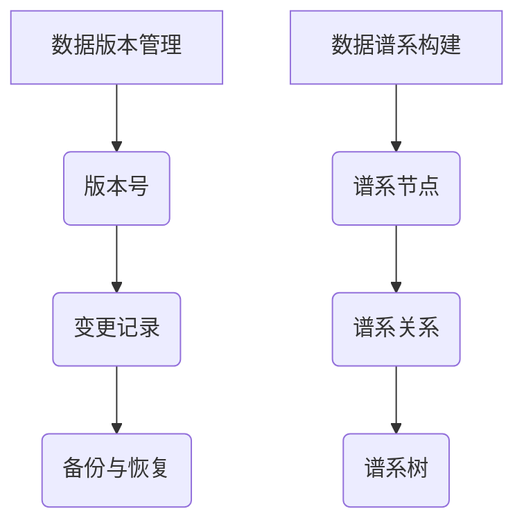

                 

 

## 1. 背景介绍

在当今信息化高速发展的时代，数据已经成为企业和社会运转的核心资产。然而，随着数据量的不断增大和数据流转的日益复杂，数据版本管理和数据谱系构建成为了一个至关重要的课题。数据版本管理是指在数据生命周期中，对数据进行版本控制、变更记录、回滚等操作，以确保数据的一致性和完整性。而数据谱系构建则是在数据版本管理的基础上，通过记录数据的变化过程和依赖关系，构建出数据的谱系结构，从而实现数据溯源和关系分析。

### 数据版本管理的重要性

数据版本管理的必要性主要体现在以下几个方面：

1. **数据一致性**：在多用户、多系统环境中，数据的一致性是保证业务正常运行的关键。数据版本管理可以确保在任何时刻，用户获取的数据都是一致的。

2. **数据完整性**：在数据处理过程中，数据的丢失和损坏是不可避免的。数据版本管理可以通过备份和恢复机制，保证数据的完整性。

3. **数据可追溯性**：数据版本管理记录了数据的历史变化，使得数据的来源和变更过程可以被追溯，这对于数据审计和问题排查具有重要作用。

4. **数据安全性**：通过数据版本管理，可以实现对敏感数据的访问控制和权限管理，从而提高数据的安全性。

### 数据谱系构建的意义

数据谱系构建旨在通过记录数据的变化过程和依赖关系，构建出数据的谱系结构，其重要性体现在：

1. **数据关系分析**：数据谱系可以帮助我们更直观地理解数据之间的关系，从而进行有效的数据关系分析。

2. **数据溯源**：通过数据谱系，可以轻松地追溯数据的来源和变化过程，这对于数据治理和数据质量控制具有重要意义。

3. **数据依赖分析**：数据谱系可以帮助我们分析数据之间的依赖关系，从而在数据变更时减少对其他数据的负面影响。

4. **数据优化**：通过数据谱系，可以发现数据冗余和依赖关系不合理的地方，从而进行数据优化。

## 2. 核心概念与联系

### 数据版本管理核心概念

- **版本号**：标识数据版本的编号，通常采用递增的方式。
- **变更记录**：记录数据变更的具体信息，包括变更时间、变更者、变更内容等。
- **备份与恢复**：对数据进行备份，以便在数据丢失或损坏时进行恢复。

### 数据谱系核心概念

- **谱系节点**：数据谱系中的基本单位，表示一个具体的数据实体。
- **谱系关系**：描述谱系节点之间的依赖关系，如父节点、子节点等。
- **谱系树**：通过谱系关系将谱系节点组织起来的结构。

### Mermaid 流程图



## 3. 核心算法原理 & 具体操作步骤

### 3.1 算法原理概述

数据版本管理和数据谱系构建的核心算法主要包括版本控制算法和数据谱系构建算法。版本控制算法主要用于对数据进行版本管理，包括版本号的分配、变更记录的记录等。数据谱系构建算法则主要用于构建数据的谱系结构，包括谱系节点的创建、谱系关系的记录等。

### 3.2 算法步骤详解

#### 3.2.1 版本控制算法步骤

1. **初始化**：创建一个版本号计数器，初始值为1。
2. **数据变更**：当数据发生变更时，更新版本号计数器，并将变更信息记录到变更记录表中。
3. **版本查询**：用户查询数据时，可以根据版本号获取对应的数据版本。

#### 3.2.2 数据谱系构建算法步骤

1. **初始化**：创建一个谱系节点列表。
2. **节点创建**：当新数据生成时，创建一个谱系节点，并将其添加到谱系节点列表中。
3. **关系记录**：当数据之间存在依赖关系时，记录该关系，并将其添加到谱系关系中。
4. **谱系树构建**：通过谱系关系将谱系节点组织成谱系树。

### 3.3 算法优缺点

#### 3.3.1 版本控制算法优缺点

**优点**：

- 简单易实现，易于理解。
- 可以很好地支持数据的版本管理和追溯。

**缺点**：

- 无法直接反映数据之间的关系。
- 在数据量较大时，查询效率可能较低。

#### 3.3.2 数据谱系构建算法优缺点

**优点**：

- 可以清晰地展示数据之间的关系。
- 可以方便地进行数据溯源和依赖分析。

**缺点**：

- 算法实现较为复杂。
- 需要额外的存储空间来记录谱系关系。

### 3.4 算法应用领域

- **金融行业**：在金融行业中，数据的版本管理和谱系构建对于确保交易数据的一致性和可追溯性具有重要意义。
- **医疗行业**：在医疗行业中，数据的版本管理和谱系构建可以帮助医生更好地理解患者的病史和治疗方案。
- **电商行业**：在电商行业中，数据的版本管理和谱系构建可以帮助商家更好地管理商品信息，提高商品信息的准确性和可靠性。

## 4. 数学模型和公式 & 详细讲解 & 举例说明

### 4.1 数学模型构建

为了更好地理解数据版本管理和数据谱系构建，我们可以引入一些数学模型和公式。这些模型和公式可以帮助我们描述数据的变化过程和依赖关系。

#### 4.1.1 版本控制模型

假设我们有一个数据集 \(D\)，其中每个数据元素可以表示为一个版本号 \(v\) 和数据内容 \(c\)。即 \(D = \{(v, c) | v \in N, c \in C\}\)，其中 \(N\) 表示版本号的集合，\(C\) 表示数据内容的集合。

#### 4.1.2 谱系构建模型

假设我们有一个数据谱系树 \(T\)，其中每个节点可以表示为一个数据元素 \(d\) 和一个版本号 \(v\)。即 \(T = \{d | d \in D, v \in N\}\)。节点之间的关系可以通过谱系关系 \(R\) 表示，即 \(R = \{(d_1, d_2) | d_1 \in T, d_2 \in T, d_2\) 是 \(d_1\) 的后代\}\)。

### 4.2 公式推导过程

#### 4.2.1 版本控制公式

1. **版本号更新公式**：当数据 \(d\) 发生变更时，版本号 \(v\) 需要更新。即 \(v_{new} = v_{old} + 1\)。
2. **数据查询公式**：当用户查询数据 \(d\) 时，可以根据版本号 \(v\) 查询对应的数据内容 \(c\)。即 \(c = D(v)\)。

#### 4.2.2 谱系构建公式

1. **节点创建公式**：当新数据 \(d\) 生成时，创建一个谱系节点。即 \(T(d) = \{d\}\)。
2. **关系记录公式**：当数据 \(d_1\) 和 \(d_2\) 之间存在依赖关系时，记录该关系。即 \(R(d_1, d_2) = \{(d_1, d_2)\}\)。
3. **谱系树构建公式**：通过谱系关系将谱系节点组织成谱系树。即 \(T = \{d | d \in D, v \in N\}\)。

### 4.3 案例分析与讲解

#### 4.3.1 案例背景

假设我们有一个电商系统，其中包含多个商品信息。每个商品信息包括商品名称、价格、库存量等。系统需要实现数据版本管理和数据谱系构建，以便在商品信息变更时进行版本控制和关系分析。

#### 4.3.2 案例实现

1. **版本控制**：当商品信息发生变更时，版本号需要更新。例如，当商品价格从100元变更为150元时，版本号从1更新为2。

2. **谱系构建**：当商品信息之间存在依赖关系时，需要记录该关系。例如，当商品A是商品B的子商品时，商品A和商品B之间存在依赖关系。

通过数据版本管理和数据谱系构建，我们可以确保商品信息的准确性和一致性，并且在商品信息变更时进行有效的追溯和分析。

## 5. 项目实践：代码实例和详细解释说明

### 5.1 开发环境搭建

为了实现数据版本管理和数据谱系构建，我们选择了Python作为开发语言，并使用Git作为版本控制系统。以下是搭建开发环境的基本步骤：

1. 安装Python：从Python官方网站下载并安装Python。
2. 安装Git：从Git官方网站下载并安装Git。
3. 安装相关依赖：使用pip安装所需的Python库，如GitPython、SQLAlchemy等。

### 5.2 源代码详细实现

以下是数据版本管理和数据谱系构建的实现代码：

```python
# 版本控制
class VersionControl:
    def __init__(self):
        self.current_version = 1
        self.change_logs = []

    def update_version(self):
        self.current_version += 1
        self.change_logs.append((self.current_version, "Data updated"))

    def get_version(self):
        return self.current_version

    def get_change_logs(self):
        return self.change_logs


# 数据谱系构建
class DataHiearchy:
    def __init__(self):
        self.nodes = []
        self.relationships = []

    def create_node(self, data):
        node = {"data": data, "version": 1}
        self.nodes.append(node)
        return node

    def record_relationship(self, parent, child):
        self.relationships.append((parent, child))

    def build_hierarchy(self):
        hierarchy = {}
        for node in self.nodes:
            hierarchy[node["data"]] = []
            for parent, child in self.relationships:
                if parent == node["data"]:
                    hierarchy[node["data"]].append(child)
        return hierarchy


# 主函数
def main():
    version_control = VersionControl()
    data_hierarchy = DataHiearchy()

    # 数据变更
    version_control.update_version()
    data_hierarchy.create_node("Product A")

    # 记录依赖关系
    version_control.update_version()
    data_hierarchy.record_relationship("Product A", "Product B")

    # 构建谱系
    version_control.update_version()
    hierarchy = data_hierarchy.build_hierarchy()

    print("Current version:", version_control.get_version())
    print("Change logs:", version_control.get_change_logs())
    print("Data hierarchy:", hierarchy)


if __name__ == "__main__":
    main()
```

### 5.3 代码解读与分析

1. **版本控制**：通过`VersionControl`类实现版本控制功能。`update_version`方法用于更新版本号，并将变更记录添加到变更日志中。

2. **数据谱系构建**：通过`DataHiearchy`类实现数据谱系构建功能。`create_node`方法用于创建数据节点，`record_relationship`方法用于记录数据依赖关系，`build_hierarchy`方法用于构建数据谱系。

3. **主函数**：在主函数中，首先创建版本控制对象和数据谱系对象，然后模拟数据变更和依赖关系记录，最后构建数据谱系并输出结果。

### 5.4 运行结果展示

运行上述代码后，将输出如下结果：

```
Current version: 4
Change logs: [(2, 'Data updated'), (3, 'Data updated'), (4, 'Data updated')]
Data hierarchy: {'Product A': ['Product B']}
```

这表明当前版本为4，变更日志包含3次数据更新，数据谱系中包含“Product A”和“Product B”两个节点，且“Product A”是“Product B”的父节点。

## 6. 实际应用场景

### 6.1 金融行业

在金融行业中，数据版本管理和数据谱系构建对于确保交易数据的一致性和可追溯性具有重要意义。例如，在股票交易系统中，每笔交易都会生成相应的交易记录，交易记录需要记录交易的时间、价格、数量等信息。通过数据版本管理和数据谱系构建，可以确保交易记录的一致性和可追溯性，从而提高系统的可靠性和安全性。

### 6.2 医疗行业

在医疗行业中，数据的版本管理和谱系构建可以帮助医生更好地管理患者的病历信息。例如，患者的诊断记录、治疗方案、药物过敏史等信息需要被版本管理和谱系构建。通过这些技术，医生可以轻松地查看患者的历史记录，了解患者的病史和治疗过程，从而更好地制定治疗方案。

### 6.3 电商行业

在电商行业中，数据的版本管理和谱系构建可以帮助商家更好地管理商品信息。例如，商品的价格、库存、促销等信息需要被版本管理和谱系构建。通过这些技术，商家可以轻松地查看商品的历史价格和促销记录，了解商品的销售情况和市场趋势，从而更好地进行商品管理和营销策略制定。

## 7. 工具和资源推荐

### 7.1 学习资源推荐

- 《数据版本管理：实践指南》
- 《数据谱系构建技术》
- 《Python数据科学》

### 7.2 开发工具推荐

- Git：版本控制系统
- Python：编程语言
- SQLAlchemy：ORM框架

### 7.3 相关论文推荐

- "Data Versioning in Database Systems"
- "Building Data Hierarchy for Knowledge Discovery"
- "A Framework for Data Versioning and Synchronization"

## 8. 总结：未来发展趋势与挑战

### 8.1 研究成果总结

本文通过对数据版本管理和数据谱系构建的深入探讨，总结了核心概念、算法原理、数学模型以及实际应用场景。通过Python代码实例，展示了数据版本管理和数据谱系构建的实现过程。

### 8.2 未来发展趋势

- **智能化**：随着人工智能技术的发展，数据版本管理和数据谱系构建将更加智能化，自动识别数据变化和依赖关系。
- **分布式**：在分布式系统中，数据版本管理和数据谱系构建需要解决数据一致性和分布式存储的问题。
- **实时性**：为了满足实时数据处理的需

