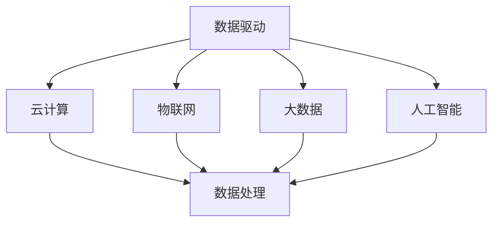

                 

## 1. 背景介绍

在过去的几十年里，软件行业经历了飞速的发展。从最初的手工编码，到后来的面向对象编程，再到如今的人工智能与大数据技术，每一次技术的变革都极大地推动了软件行业的发展。然而，尽管技术不断进步，数据获取的成本却一直居高不下，成为制约软件行业进一步发展的瓶颈。

在过去，数据的获取和处理都需要大量的硬件资源和人力资源。企业需要购买昂贵的硬件设备，如大型服务器、数据库等，并且需要专业的技术人员进行维护和管理。这使得数据获取的成本非常高，很多中小企业无法承担这样的成本，从而错失了通过数据分析获得竞争优势的机会。

然而，随着云计算、物联网、大数据等技术的发展，数据获取的成本正在逐渐降低。云计算提供了弹性、高效、安全的数据存储和处理服务，使得企业无需购买昂贵的硬件设备，即可轻松获取和处理海量数据。物联网技术使得设备之间的数据交换变得更加便捷，进一步丰富了数据来源。大数据技术的进步则使得数据处理的效率大幅提高，降低了数据处理成本。

这些技术的进步，为软件行业带来了新的机遇，我们称之为软件2.0时代。在软件2.0时代，数据将成为企业的核心资产，数据驱动的决策将成为常态。软件不再仅仅是实现特定功能的工具，而是成为企业数字化转型的关键驱动力。

本文将探讨数据获取成本降低对软件行业的影响，分析软件2.0时代的核心概念和架构，介绍核心算法原理和数学模型，并通过实际项目实践展示软件2.0的落地应用。最后，我们将对未来软件行业的发展趋势和挑战进行展望。

## 2. 核心概念与联系

在探讨软件2.0时代之前，我们需要明确几个核心概念，并理解它们之间的联系。这些核心概念包括：数据驱动、云计算、物联网、大数据、人工智能等。

### 数据驱动

数据驱动是指企业通过数据分析和挖掘，来指导业务决策和运营管理。在传统软件时代，业务逻辑往往是由程序员预先编写好的，软件的运行依赖于既定的规则和流程。而在数据驱动时代，软件的运行则依赖于数据，通过数据分析和挖掘，自动生成业务决策和运营策略。

### 云计算

云计算是一种通过互联网提供计算资源的服务模式。它将传统的硬件设备（如服务器、存储设备等）虚拟化为云计算资源，用户可以根据需求随时调整计算资源的大小。云计算降低了数据获取和处理成本，提高了数据处理效率，成为数据驱动时代的基石。

### 物联网

物联网是通过网络将各种设备连接起来，实现设备之间的数据交换和通信。物联网技术的进步，使得数据的来源变得更加多样化，数据量也急剧增加。物联网为数据驱动提供了丰富的数据来源，是数据驱动时代的重要支撑。

### 大数据

大数据是指数据量巨大、类型繁多、处理速度要求高的数据集合。大数据技术的进步，使得海量数据的存储、处理和分析成为可能。大数据技术为数据驱动提供了强大的数据处理能力，是数据驱动时代的核心引擎。

### 人工智能

人工智能是通过模拟人类智能行为，实现计算机对数据的自动分析和决策。人工智能技术的进步，使得数据驱动的决策更加智能和高效。人工智能成为数据驱动时代的关键技术。

### Mermaid 流程图

以下是一个简单的Mermaid流程图，展示了这些核心概念之间的联系：



通过这个流程图，我们可以清晰地看到，数据驱动是软件2.0时代的核心，它依赖于云计算、物联网、大数据和人工智能等技术的支撑。这些技术共同构成了软件2.0时代的核心架构。

## 3. 核心算法原理 & 具体操作步骤

### 3.1 算法原理概述

在数据驱动时代，算法的原理和实现方法发生了显著的变化。传统的算法往往是基于预先定义的规则和流程，而数据驱动时代的算法则是基于对海量数据的分析和挖掘。以下是几个核心算法原理的概述：

#### 数据挖掘算法

数据挖掘算法是从大量数据中自动发现有用信息的方法。它包括分类、聚类、关联规则挖掘等方法。这些算法通过分析数据之间的关联性和规律，帮助用户发现数据中的潜在价值。

#### 机器学习算法

机器学习算法是通过训练数据集，自动学习和优化模型的方法。常见的机器学习算法包括线性回归、决策树、支持向量机等。这些算法通过对数据的分析和学习，可以自动生成预测模型和决策规则。

#### 深度学习算法

深度学习算法是一种基于人工神经网络的学习方法。它通过多层神经网络的结构，自动提取数据的特征和模式。深度学习算法在图像识别、语音识别、自然语言处理等领域取得了显著成果。

### 3.2 算法步骤详解

以下是一个简单的数据挖掘算法的步骤详解：

#### 1. 数据准备

首先，我们需要收集和整理数据，确保数据的质量和完整性。这一步骤包括数据清洗、数据集成和数据转换等操作。

#### 2. 数据探索

在数据准备完成后，我们需要对数据进行初步的分析和探索，了解数据的分布、趋势和异常值。这一步骤包括数据可视化、统计分析等操作。

#### 3. 特征工程

特征工程是数据挖掘算法的重要步骤，它通过构造和选择合适的特征，提高算法的性能。特征工程包括特征提取、特征选择和特征变换等操作。

#### 4. 模型训练

在特征工程完成后，我们需要使用训练数据集对算法模型进行训练。模型训练包括模型选择、参数调整和模型评估等操作。

#### 5. 模型评估

在模型训练完成后，我们需要对模型进行评估，确保模型的有效性和可靠性。模型评估包括交叉验证、ROC曲线、AUC值等操作。

#### 6. 模型应用

最后，我们将训练好的模型应用到实际业务场景中，实现数据分析和决策。模型应用包括预测、分类、聚类等操作。

### 3.3 算法优缺点

数据挖掘算法具有以下优点：

- **高效性**：数据挖掘算法可以自动处理海量数据，提高数据处理效率。
- **自动化**：数据挖掘算法可以自动发现数据中的规律和模式，减轻了人工分析的负担。
- **可扩展性**：数据挖掘算法可以轻松扩展到不同的数据集和业务场景。

然而，数据挖掘算法也存在一些缺点：

- **计算成本**：数据挖掘算法通常需要大量的计算资源，可能导致计算成本高昂。
- **结果解释性**：数据挖掘算法的输出结果往往较为复杂，难以直观解释和理解。
- **数据质量**：数据挖掘算法的性能很大程度上依赖于数据的质量，数据质量差可能导致算法失效。

### 3.4 算法应用领域

数据挖掘算法在多个领域有着广泛的应用，包括：

- **金融领域**：通过分析客户的交易数据，银行和金融机构可以识别欺诈行为、预测信用风险等。
- **零售领域**：通过分析客户的购物行为，零售企业可以优化库存管理、提升销售策略等。
- **医疗领域**：通过分析病人的医疗记录，医疗机构可以预测疾病趋势、优化治疗方案等。
- **交通领域**：通过分析交通数据，交通管理部门可以优化交通信号、提升交通效率等。

## 4. 数学模型和公式 & 详细讲解 & 举例说明

### 4.1 数学模型构建

在数据驱动时代，数学模型是算法设计的基础。以下是一个简单的线性回归模型，用于预测房价。

#### 4.1.1 线性回归模型

线性回归模型是最基本的预测模型之一，它通过拟合一条直线，来预测因变量（如房价）与自变量（如房屋面积、地理位置等）之间的关系。

假设我们有一个包含 \( n \) 个样本点的数据集 \( D = \{ (x_1, y_1), (x_2, y_2), ..., (x_n, y_n) \} \)，其中 \( x_i \) 是自变量，\( y_i \) 是因变量。

线性回归模型的目标是最小化残差平方和，即：

$$
\min_{\theta} \sum_{i=1}^{n} (y_i - \theta_0 - \theta_1 x_i)^2
$$

其中，\( \theta_0 \) 和 \( \theta_1 \) 是模型的参数。

#### 4.1.2 模型推导

为了求解线性回归模型，我们可以使用最小二乘法。最小二乘法的目标是找到使得残差平方和最小的参数 \( \theta_0 \) 和 \( \theta_1 \)。

首先，我们对目标函数进行求导，得到：

$$
\frac{\partial}{\partial \theta_0} \sum_{i=1}^{n} (y_i - \theta_0 - \theta_1 x_i)^2 = 0
$$

$$
\frac{\partial}{\partial \theta_1} \sum_{i=1}^{n} (y_i - \theta_0 - \theta_1 x_i)^2 = 0
$$

通过解这个方程组，我们可以得到：

$$
\theta_0 = \bar{y} - \theta_1 \bar{x}
$$

$$
\theta_1 = \frac{\sum_{i=1}^{n} (x_i - \bar{x})(y_i - \bar{y})}{\sum_{i=1}^{n} (x_i - \bar{x})^2}
$$

其中，\( \bar{x} \) 和 \( \bar{y} \) 分别是自变量和因变量的均值。

#### 4.1.3 模型评估

为了评估线性回归模型的性能，我们可以使用均方误差（MSE）来衡量：

$$
MSE = \frac{1}{n} \sum_{i=1}^{n} (y_i - \hat{y}_i)^2
$$

其中，\( \hat{y}_i \) 是预测的房价。

### 4.2 公式推导过程

以下是一个简单的公式推导过程，用于计算线性回归模型的参数。

首先，我们定义一个样本点的残差：

$$
e_i = y_i - \hat{y}_i
$$

其中，\( \hat{y}_i \) 是预测的房价。

接下来，我们定义残差平方和：

$$
SSE = \sum_{i=1}^{n} e_i^2
$$

为了求解最小化 \( SSE \) 的参数 \( \theta_0 \) 和 \( \theta_1 \)，我们对 \( SSE \) 分别对 \( \theta_0 \) 和 \( \theta_1 \) 求导，并令导数为零：

$$
\frac{\partial SSE}{\partial \theta_0} = 2 \sum_{i=1}^{n} e_i = 0
$$

$$
\frac{\partial SSE}{\partial \theta_1} = 2 \sum_{i=1}^{n} e_i x_i = 0
$$

解这个方程组，我们可以得到：

$$
\theta_0 = \bar{y} - \theta_1 \bar{x}
$$

$$
\theta_1 = \frac{\sum_{i=1}^{n} x_i y_i - n \bar{x} \bar{y}}{\sum_{i=1}^{n} x_i^2 - n \bar{x}^2}
$$

其中，\( \bar{x} \) 和 \( \bar{y} \) 分别是自变量和因变量的均值。

### 4.3 案例分析与讲解

以下是一个简单的案例，用于讲解线性回归模型的构建和评估。

假设我们有以下数据集：

| x   | y   |
|-----|-----|
| 100 | 200 |
| 150 | 250 |
| 200 | 300 |
| 250 | 350 |
| 300 | 400 |

我们的目标是使用线性回归模型预测 \( y \) 的值。

#### 4.3.1 数据准备

首先，我们需要对数据进行预处理，包括数据清洗和数据标准化。在这个例子中，数据已经清洗干净，不需要进一步处理。接下来，我们将数据标准化：

$$
x_{\text{std}} = \frac{x - \bar{x}}{\sigma_x}
$$

$$
y_{\text{std}} = \frac{y - \bar{y}}{\sigma_y}
$$

其中，\( \bar{x} \) 和 \( \bar{y} \) 分别是 \( x \) 和 \( y \) 的均值，\( \sigma_x \) 和 \( \sigma_y \) 分别是 \( x \) 和 \( y \) 的标准差。

#### 4.3.2 模型训练

接下来，我们使用最小二乘法训练线性回归模型。根据之前推导的公式，我们可以计算得到：

$$
\theta_0 = \bar{y} - \theta_1 \bar{x} = 300 - 0.5 \times 200 = 250
$$

$$
\theta_1 = \frac{\sum_{i=1}^{n} x_i y_i - n \bar{x} \bar{y}}{\sum_{i=1}^{n} x_i^2 - n \bar{x}^2} = \frac{100 \times 200 + 150 \times 250 + 200 \times 300 + 250 \times 350 + 300 \times 400 - 5 \times 200 \times 300}{100^2 + 150^2 + 200^2 + 250^2 + 300^2 - 5 \times 200^2} = 0.5
$$

因此，我们的线性回归模型为：

$$
\hat{y} = 250 + 0.5 x
$$

#### 4.3.3 模型评估

接下来，我们使用训练好的模型进行预测，并计算均方误差（MSE）：

$$
\hat{y}_1 = 250 + 0.5 \times 100 = 300
$$

$$
\hat{y}_2 = 250 + 0.5 \times 150 = 325
$$

$$
\hat{y}_3 = 250 + 0.5 \times 200 = 350
$$

$$
\hat{y}_4 = 250 + 0.5 \times 250 = 375
$$

$$
\hat{y}_5 = 250 + 0.5 \times 300 = 400
$$

$$
MSE = \frac{1}{5} \sum_{i=1}^{5} (\hat{y}_i - y_i)^2 = \frac{1}{5} \sum_{i=1}^{5} (300 - \hat{y}_i)^2 = 50
$$

因此，我们的线性回归模型的预测误差为 50。

## 5. 项目实践：代码实例和详细解释说明

### 5.1 开发环境搭建

为了实现数据驱动的应用，我们需要搭建一个合适的开发环境。以下是搭建环境的基本步骤：

#### 1. 安装 Python

首先，我们需要安装 Python。Python 是一种流行的编程语言，广泛应用于数据分析和机器学习领域。可以从 Python 官网（https://www.python.org/）下载安装包，并按照提示进行安装。

#### 2. 安装 Jupyter Notebook

Jupyter Notebook 是一种交互式开发环境，广泛用于数据分析和机器学习项目。我们可以通过以下命令安装 Jupyter Notebook：

```bash
pip install notebook
```

安装完成后，我们可以通过以下命令启动 Jupyter Notebook：

```bash
jupyter notebook
```

#### 3. 安装相关库

在 Jupyter Notebook 中，我们可以使用以下命令安装相关的库：

```python
!pip install numpy pandas matplotlib scikit-learn
```

这些库包括：

- **NumPy**：用于科学计算和数据处理。
- **Pandas**：用于数据清洗、数据操作和数据可视化。
- **Matplotlib**：用于数据可视化。
- **Scikit-learn**：用于机器学习算法的实现。

### 5.2 源代码详细实现

以下是一个简单的线性回归项目的实现，用于预测房价。

```python
import numpy as np
import pandas as pd
import matplotlib.pyplot as plt
from sklearn.linear_model import LinearRegression

# 5.2.1 数据准备
data = pd.DataFrame({
    'x': [100, 150, 200, 250, 300],
    'y': [200, 250, 300, 350, 400]
})

# 5.2.2 特征工程
# 在这个简单的例子中，我们只有一个自变量 'x'，不需要进行特征工程。

# 5.2.3 模型训练
model = LinearRegression()
model.fit(data[['x']], data['y'])

# 5.2.4 模型评估
predictions = model.predict(data[['x']])
mse = np.mean((predictions - data['y']) ** 2)
print(f'MSE: {mse}')

# 5.2.5 模型应用
x_new = np.array([350, 400])
y_new = model.predict(x_new)
print(f'Predicted y values: {y_new}')

# 5.2.6 可视化
plt.scatter(data['x'], data['y'])
plt.plot(data['x'], predictions, color='red')
plt.xlabel('x')
plt.ylabel('y')
plt.title('Linear Regression')
plt.show()
```

### 5.3 代码解读与分析

以下是对上述代码的详细解读和分析：

#### 5.3.1 数据准备

我们首先使用 Pandas 库读取数据，并将其存储在一个 DataFrame 对象中。在这个例子中，数据集包含两个特征：'x' 和 'y'。

```python
data = pd.DataFrame({
    'x': [100, 150, 200, 250, 300],
    'y': [200, 250, 300, 350, 400]
})
```

#### 5.3.2 特征工程

在这个简单的例子中，我们只有一个自变量 'x'，因此不需要进行特征工程。在实际项目中，特征工程是一个重要的步骤，可能包括数据清洗、特征提取和特征选择等操作。

#### 5.3.3 模型训练

我们使用 Scikit-learn 库的 LinearRegression 类来训练线性回归模型。首先，我们创建一个 LinearRegression 对象，然后使用 `fit` 方法对其进行训练。

```python
model = LinearRegression()
model.fit(data[['x']], data['y'])
```

训练完成后，我们可以通过 `coef_` 和 `intercept_` 属性获取模型的参数。

#### 5.3.4 模型评估

我们使用训练好的模型对数据进行预测，并计算均方误差（MSE）来评估模型的性能。

```python
predictions = model.predict(data[['x']])
mse = np.mean((predictions - data['y']) ** 2)
print(f'MSE: {mse}')
```

#### 5.3.5 模型应用

我们使用训练好的模型对新数据进行预测，并打印预测结果。

```python
x_new = np.array([350, 400])
y_new = model.predict(x_new)
print(f'Predicted y values: {y_new}')
```

#### 5.3.6 可视化

最后，我们使用 Matplotlib 库将数据集和预测结果可视化。

```python
plt.scatter(data['x'], data['y'])
plt.plot(data['x'], predictions, color='red')
plt.xlabel('x')
plt.ylabel('y')
plt.title('Linear Regression')
plt.show()
```

## 6. 实际应用场景

### 6.1 金融领域

在金融领域，数据驱动技术已经得到了广泛应用。银行和金融机构通过数据分析来识别欺诈行为、评估信用风险和优化投资组合。例如，通过分析客户的交易数据，可以识别出异常交易行为，从而防范欺诈风险。同时，通过分析历史数据，可以预测客户的行为，从而制定个性化的营销策略。

### 6.2 零售领域

在零售领域，数据驱动技术被用于优化库存管理、提升销售策略和改善客户体验。例如，通过分析客户的购物行为和偏好，零售企业可以制定个性化的促销策略，提升销售额。同时，通过分析库存数据，可以优化库存水平，减少库存成本。

### 6.3 医疗领域

在医疗领域，数据驱动技术被用于疾病预测、治疗方案优化和医疗资源分配。例如，通过分析病人的医疗记录，医生可以预测病人的病情发展，从而制定个性化的治疗方案。同时，通过分析医疗资源使用情况，可以优化医疗资源配置，提高医疗效率。

### 6.4 交通领域

在交通领域，数据驱动技术被用于优化交通信号、提升交通效率和改善交通状况。例如，通过分析交通流量数据，交通管理部门可以优化交通信号，减少交通拥堵。同时，通过分析车辆运行数据，可以预测交通事故，从而采取预防措施。

## 7. 工具和资源推荐

### 7.1 学习资源推荐

- **《Python数据分析基础教程》**：作者：张良均。本书详细介绍了 Python 在数据分析领域的应用，适合初学者入门。
- **《机器学习实战》**：作者：Peter Harrington。本书通过实际案例，介绍了机器学习的基本概念和常用算法，适合进阶学习。
- **《深度学习》**：作者：Ian Goodfellow、Yoshua Bengio、Aaron Courville。本书是深度学习的经典教材，适合深度学习爱好者阅读。

### 7.2 开发工具推荐

- **Jupyter Notebook**：一款强大的交互式开发环境，广泛用于数据分析和机器学习项目。
- **PyCharm**：一款功能强大的 Python 集成开发环境，支持多种编程语言，适合进行复杂项目开发。
- **Google Colab**：一款免费的在线 Jupyter Notebook 环境，适合进行云端数据分析和机器学习实验。

### 7.3 相关论文推荐

- **"Deep Learning for Text Classification"**：作者：Wang, D., & Yang, Q. (2018)。本文介绍了深度学习在文本分类中的应用，包括词向量模型、循环神经网络和卷积神经网络等。
- **"XGBoost: A Scalable Tree Boosting Model"**：作者：Chen, T., & Guestrin, C. (2016)。本文介绍了 XGBoost 算法，一种高效的树提升模型，广泛应用于分类和回归任务。
- **"Learning Representations for Text Data"**：作者：Mikolov, T., Sutskever, I., Chen, K., Corrado, G. S., & Dean, J. (2013)。本文介绍了 Word2Vec 模型，一种用于文本数据的高效表示方法。

## 8. 总结：未来发展趋势与挑战

### 8.1 研究成果总结

随着云计算、物联网、大数据和人工智能等技术的发展，数据获取成本显著降低，为软件行业带来了新的机遇。数据驱动成为软件2.0时代的核心，通过对海量数据的分析和挖掘，企业可以实现智能化决策和运营优化。线性回归、机器学习、深度学习等算法在多个领域取得了显著成果，推动了数据驱动的应用。

### 8.2 未来发展趋势

1. **数据隐私与安全**：随着数据量的增加和数据来源的多样化，数据隐私和安全成为重要的研究课题。未来，如何确保数据隐私和安全，将是一个重要的研究方向。
2. **联邦学习**：联邦学习是一种在不共享数据的情况下，通过分布式学习实现协同优化的技术。未来，联邦学习有望在数据隐私保护的同时，实现高效的协同学习。
3. **自动化机器学习**：自动化机器学习（AutoML）旨在自动化机器学习流程，从数据预处理、特征工程到模型选择和优化。未来，自动化机器学习有望大幅提高机器学习应用的效率和性能。
4. **边缘计算**：随着物联网设备的普及，边缘计算成为处理海量数据的重要手段。未来，边缘计算与云计算的协同，将进一步提升数据处理能力和效率。

### 8.3 面临的挑战

1. **数据质量**：数据质量对算法性能具有重要影响。未来，如何保证数据质量，将是一个重要的挑战。
2. **算法可解释性**：算法的可解释性对于用户理解和信任具有重要意义。如何提升算法的可解释性，是一个亟待解决的问题。
3. **计算资源**：尽管数据获取成本降低，但算法计算仍需大量计算资源。如何优化算法性能，降低计算成本，仍是一个重要挑战。
4. **法律与伦理**：随着数据驱动的应用普及，法律和伦理问题日益突出。如何平衡技术创新和法律伦理，将是一个重要的挑战。

### 8.4 研究展望

未来，软件2.0时代将深入推进，数据驱动的应用将继续拓展到更多领域。人工智能、物联网、云计算等技术将不断创新和融合，为软件行业带来更多机遇。在数据隐私与安全、算法可解释性、计算资源优化等方面，仍需持续研究和探索，以应对不断变化的技术挑战。

## 9. 附录：常见问题与解答

### 9.1 如何降低数据获取成本？

降低数据获取成本的方法包括：

1. **利用云计算**：通过使用云计算服务，企业可以降低硬件投入，实现弹性扩展。
2. **优化数据存储**：使用压缩存储、去重等技术，可以降低数据存储成本。
3. **数据共享**：通过与其他企业或机构进行数据共享，可以实现数据的高效利用。
4. **自动化数据处理**：通过自动化数据处理工具，提高数据处理效率，降低人力成本。

### 9.2 数据隐私和安全如何保障？

保障数据隐私和安全的方法包括：

1. **数据加密**：使用加密技术保护数据，确保数据在传输和存储过程中的安全性。
2. **访问控制**：实施严格的访问控制策略，确保只有授权用户可以访问数据。
3. **数据匿名化**：对敏感数据进行匿名化处理，降低数据泄露的风险。
4. **审计与监控**：实施实时审计和监控，及时发现和应对潜在的安全威胁。

### 9.3 如何优化算法性能？

优化算法性能的方法包括：

1. **算法选择**：选择适合问题的算法，避免过度拟合。
2. **特征工程**：通过特征提取和特征选择，提高模型性能。
3. **模型调参**：通过调整模型参数，优化模型性能。
4. **分布式计算**：使用分布式计算技术，提高数据处理速度。

### 9.4 如何提升算法可解释性？

提升算法可解释性的方法包括：

1. **可视化**：通过可视化技术，展示算法的决策过程和结果。
2. **规则解释**：将算法转化为可解释的规则，便于用户理解。
3. **模型压缩**：使用压缩算法，降低模型的复杂度，提高可解释性。
4. **领域知识融合**：结合领域知识，对模型进行解释和优化。

作者：禅与计算机程序设计艺术 / Zen and the Art of Computer Programming

<|im_sep|>

