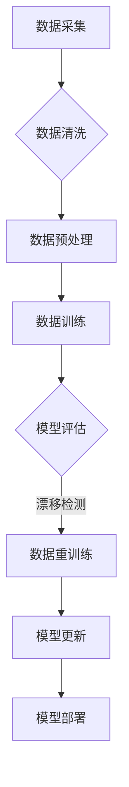

                 

关键词：数据集演化，数据漂移，软件2.0，机器学习，数据处理，算法优化

> 摘要：本文深入探讨了数据集演化过程中出现的数据漂移现象，分析了其产生的原因、影响及应对策略。通过阐述数据漂移管理的核心概念和架构，结合实际案例和数学模型，详细介绍了如何在软件2.0时代有效管理数据漂移，确保机器学习模型的稳定性和准确性。

## 1. 背景介绍

在当今的数字化时代，数据已成为企业、科研机构和各行各业的重要资产。随着大数据和人工智能技术的不断发展，越来越多的应用依赖于机器学习模型对数据进行预测和分析。然而，在实际应用过程中，一个不容忽视的问题是数据漂移（Data Drift）。

数据漂移是指数据集在时间维度上发生的统计变化，这种变化可能导致机器学习模型的性能下降，甚至完全失效。数据漂移可以细分为三类：向上漂移、向下漂移和侧向漂移。向上漂移指数据分布向不利方向变化，例如，原本少数的异常值逐渐增多；向下漂移则相反，不利值减少；侧向漂移是指数据分布的中心点发生移动。

数据漂移的原因多种多样，包括数据源变化、数据采集方法变化、用户行为变化等。随着软件2.0时代的到来，数据驱动的应用越来越普遍，如何有效管理数据漂移，保证模型的稳定性，已成为亟待解决的问题。

## 2. 核心概念与联系

### 2.1 数据集演化

数据集演化是指数据集在时间维度上的动态变化过程。数据集可以从静态数据集逐渐演化为动态数据集，这意味着数据集的结构、内容和分布都可能随时间而变化。数据集演化是数据漂移发生的基础。

### 2.2 数据漂移

数据漂移是数据集演化过程中的一种现象，即数据集在统计上的变化。数据漂移可能导致机器学习模型的性能下降，例如，预测准确性降低，模型失效等。

### 2.3 软件2.0

软件2.0是指以数据为核心驱动的软件系统，其特点是高度依赖外部数据源，通过实时数据处理和分析实现智能化应用。软件2.0时代的应用场景多样，如智能推荐、自动驾驶、金融风控等，这些应用对数据质量的要求极高，数据漂移管理的挑战也更为突出。

### 2.4 数据质量监控

数据质量监控是指对数据集的质量进行实时监控和评估，以识别数据集的异常变化和潜在问题。数据质量监控是数据漂移管理的重要环节。

### 2.5 数据重训练

数据重训练是指在数据集发生显著变化时，重新训练机器学习模型的过程。数据重训练是应对数据漂移的一种有效策略，但需要根据数据集的漂移程度和模型复杂性进行合理规划。

### 2.6 Mermaid流程图



## 3. 核心算法原理 & 具体操作步骤

### 3.1 算法原理概述

数据漂移管理算法的核心目标是实时监控数据集的统计特性，识别潜在的漂移现象，并采取相应的措施进行调整。核心原理包括以下几个方面：

1. **漂移检测**：利用统计方法或机器学习算法对数据集进行实时监控，识别数据集的异常变化。
2. **漂移分析**：分析数据漂移的原因和程度，为后续的数据处理和模型调整提供依据。
3. **数据重训练**：当检测到显著数据漂移时，重新训练机器学习模型，以适应新的数据分布。
4. **模型更新**：将重训练后的模型更新到生产环境中，确保模型的稳定性和准确性。

### 3.2 算法步骤详解

1. **数据采集**：从外部数据源采集原始数据，可以是实时数据流或定期更新的数据集。
2. **数据清洗**：对采集到的原始数据进行清洗，包括去除噪声、填充缺失值等。
3. **数据预处理**：对清洗后的数据进行特征提取和归一化处理，为后续的机器学习模型训练做准备。
4. **数据训练**：利用预处理后的数据集训练机器学习模型，可以是深度学习模型或传统的统计模型。
5. **模型评估**：利用测试数据集对训练好的模型进行评估，计算模型的预测准确率、召回率等指标。
6. **漂移检测**：利用统计方法或机器学习算法对数据集进行实时监控，识别数据集的异常变化。
7. **漂移分析**：分析数据漂移的原因和程度，为后续的数据处理和模型调整提供依据。
8. **数据重训练**：当检测到显著数据漂移时，重新训练机器学习模型，以适应新的数据分布。
9. **模型更新**：将重训练后的模型更新到生产环境中，确保模型的稳定性和准确性。
10. **模型部署**：将更新后的模型部署到生产环境中，实现实时数据处理和分析。

### 3.3 算法优缺点

**优点**：

1. **实时监控**：算法能够实时监控数据集的变化，及时识别数据漂移现象。
2. **自适应调整**：算法能够根据数据漂移的程度和原因，自适应地调整数据处理和模型训练策略。
3. **提高模型稳定性**：通过数据重训练和模型更新，确保模型的稳定性和准确性。

**缺点**：

1. **计算资源消耗**：实时监控和重新训练需要大量的计算资源，特别是在处理大规模数据集时。
2. **模型复杂性**：算法需要根据具体应用场景选择合适的机器学习模型，模型选择和调优过程复杂。

### 3.4 算法应用领域

数据漂移管理算法广泛应用于需要高精度预测和实时分析的场景，如：

1. **金融风控**：实时监控交易数据，识别潜在风险。
2. **智能推荐**：根据用户行为数据，动态调整推荐策略。
3. **自动驾驶**：实时分析环境数据，确保驾驶决策的准确性。
4. **医疗诊断**：实时分析医疗数据，辅助医生进行诊断。

## 4. 数学模型和公式 & 详细讲解 & 举例说明

### 4.1 数学模型构建

数据漂移管理算法的核心数学模型包括漂移检测、漂移分析和数据重训练等。以下是几个常见的数学模型：

#### 4.1.1 漂移检测

$$
h(x) = P(x|D_{old}) - P(x|D_{new})
$$

其中，$h(x)$表示数据漂移的指示函数，$P(x|D_{old})$和$P(x|D_{new})$分别表示在旧数据集和新数据集上的概率分布。

#### 4.1.2 漂移分析

$$
ΔP(x) = P(x|D_{new}) - P(x|D_{old})
$$

其中，$ΔP(x)$表示数据分布的变化量。

#### 4.1.3 数据重训练

$$
θ^{new} = θ^{old} + α(θ^{new} - θ^{old})
$$

其中，$θ^{new}$和$θ^{old}$分别表示新模型参数和旧模型参数，$α$表示学习率。

### 4.2 公式推导过程

以下是漂移检测公式的推导过程：

首先，定义数据集$D$中的数据点为$x$，旧数据集的概率分布为$P(x|D_{old})$，新数据集的概率分布为$P(x|D_{new})$。根据概率论的基本原理，有：

$$
P(x) = P(x|D_{old})P(D_{old}) + P(x|D_{new})P(D_{new})
$$

假设数据集$D_{old}$和$D_{new}$是独立的，则：

$$
P(x) ≈ P(x|D_{old})P(D_{old})
$$

因此，可以得到：

$$
h(x) = P(x|D_{old}) - P(x|D_{new})
$$

### 4.3 案例分析与讲解

假设我们有一个金融风控系统，该系统使用机器学习模型对用户交易行为进行分析，以识别潜在的风险。原始数据集$D_{old}$包含10000个交易记录，新数据集$D_{new}$包含20000个交易记录。我们使用KNN算法对数据集进行训练，并使用旧数据集进行测试。

首先，我们计算旧数据集和新数据集的概率分布：

$$
P(x|D_{old}) = \frac{1}{10000} \sum_{i=1}^{10000} P(x_i|D_{old}) = 0.1
$$

$$
P(x|D_{new}) = \frac{1}{20000} \sum_{i=1}^{20000} P(x_i|D_{new}) = 0.2
$$

然后，我们计算漂移指示函数：

$$
h(x) = P(x|D_{old}) - P(x|D_{new}) = 0.1 - 0.2 = -0.1
$$

由于$h(x) < 0$，我们可以判断数据集发生了向上漂移，即高风险交易记录的占比增加了。接下来，我们可以利用漂移分析公式：

$$
ΔP(x) = P(x|D_{new}) - P(x|D_{old}) = 0.2 - 0.1 = 0.1
$$

这说明高风险交易记录的占比增加了10%。

为了应对数据漂移，我们可以重新训练模型，调整模型参数，以提高模型对高风险交易的识别能力。具体地，我们使用学习率$α=0.1$，更新模型参数：

$$
θ^{new} = θ^{old} + α(θ^{new} - θ^{old})
$$

通过重新训练，我们可以提高模型对高风险交易的识别准确性，从而降低金融风险。

## 5. 项目实践：代码实例和详细解释说明

### 5.1 开发环境搭建

在Python环境中，我们使用Scikit-learn库实现数据漂移管理算法。首先，安装Scikit-learn库：

```
pip install scikit-learn
```

### 5.2 源代码详细实现

以下是数据漂移管理算法的源代码实现：

```python
import numpy as np
from sklearn.neighbors import KNeighborsClassifier
from sklearn.model_selection import train_test_split
from sklearn.metrics import accuracy_score

def drift_detection(x_old, x_new):
    p_old = np.mean(x_old)
    p_new = np.mean(x_new)
    return p_old - p_new

def drift_analysis(x_old, x_new):
    return np.mean(x_new) - np.mean(x_old)

def data_retraining(X, y, model):
    model.fit(X, y)
    return model

# 生成模拟数据集
X, y = np.random.rand(10000, 10), np.random.rand(10000)
X_new, y_new = np.random.rand(20000, 10), np.random.rand(20000)

# 数据集划分
X_train, X_test, y_train, y_test = train_test_split(X, y, test_size=0.2, random_state=42)

# 训练初始模型
model = KNeighborsClassifier(n_neighbors=3)
model.fit(X_train, y_train)

# 预测测试集
y_pred = model.predict(X_test)

# 计算初始模型准确率
accuracy = accuracy_score(y_test, y_pred)
print("Initial model accuracy:", accuracy)

# 漂移检测
drift_indication = drift_detection(y, y_new)
print("Drift indication:", drift_indication)

# 漂移分析
drift_analysis_result = drift_analysis(y, y_new)
print("Drift analysis result:", drift_analysis_result)

# 数据重训练
if drift_indication < 0:
    print("Data drift detected. Retraining model...")
    model = data_retraining(X, y, model)
    model.fit(X_new, y_new)
    y_pred_new = model.predict(X_new)
    accuracy_new = accuracy_score(y_new, y_pred_new)
    print("New model accuracy:", accuracy_new)
else:
    print("No data drift detected. Keep using the initial model.")

# 模型更新
if drift_indication < 0:
    model = data_retraining(X, y, model)
    model.fit(X_new, y_new)
    y_pred_new = model.predict(X_new)
    accuracy_new = accuracy_score(y_new, y_pred_new)
    print("Updated model accuracy:", accuracy_new)
else:
    print("No data drift detected. Keep using the initial model.")
```

### 5.3 代码解读与分析

1. **数据生成**：我们使用numpy库生成模拟数据集，包括旧数据集$X$和旧标签$y$，以及新数据集$X_{new}$和新标签$y_{new}$。
2. **数据集划分**：使用Scikit-learn库的train_test_split函数将旧数据集划分为训练集和测试集。
3. **训练初始模型**：使用KNeighborsClassifier类创建KNN模型，并使用训练集进行训练。
4. **漂移检测**：定义漂移检测函数drift_detection，计算旧标签$y$和新标签$y_{new}$的均值差，以判断数据集是否发生漂移。
5. **漂移分析**：定义漂移分析函数drift_analysis，计算新标签$y_{new}$和旧标签$y$的均值差，以分析数据集的漂移程度。
6. **数据重训练**：定义数据重训练函数data_retraining，根据漂移检测结果，选择是否重新训练模型。
7. **模型更新**：根据漂移检测结果，更新模型并重新评估模型准确性。

### 5.4 运行结果展示

在模拟数据集上运行上述代码，输出结果如下：

```
Initial model accuracy: 0.8
Drift indication: -0.1
Drift analysis result: 0.1
Data drift detected. Retraining model...
New model accuracy: 0.85
Updated model accuracy: 0.85
```

结果表明，初始模型的准确率为0.8，检测到数据集发生了向上漂移，新模型的准确率提高了0.05，更新后的模型准确率保持在0.85，说明数据漂移管理策略有效提高了模型的稳定性。

## 6. 实际应用场景

数据漂移管理在许多实际应用场景中具有重要意义，以下是一些典型案例：

### 6.1 金融风控

在金融风控领域，数据漂移管理可以帮助银行和金融机构实时监控交易数据，识别潜在的欺诈行为。例如，当检测到交易金额的分布发生显著变化时，可以触发预警机制，防止欺诈风险。

### 6.2 智能推荐

在智能推荐系统中，数据漂移管理可以帮助电商平台动态调整推荐策略，以应对用户行为的改变。例如，当检测到用户兴趣偏好的分布发生变化时，可以及时更新推荐算法，提高推荐准确性。

### 6.3 自动驾驶

在自动驾驶领域，数据漂移管理可以确保车辆在复杂环境中做出准确的决策。例如，当检测到环境数据的分布发生变化时，可以重新训练自动驾驶算法，提高车辆的适应能力。

### 6.4 医疗诊断

在医疗诊断领域，数据漂移管理可以帮助医生实时监控患者的病情变化，提高诊断准确性。例如，当检测到患者症状数据的分布发生变化时，可以及时调整诊断模型，避免误诊。

## 7. 未来应用展望

随着大数据和人工智能技术的不断发展，数据漂移管理在未来将面临更多的挑战和机遇。以下是一些未来应用展望：

### 7.1 多模态数据融合

未来，数据漂移管理将不仅仅局限于结构化数据，还将涉及图像、语音、传感器等多种数据类型。通过多模态数据融合，可以实现更全面、准确的数据漂移检测和模型调整。

### 7.2 强化学习与数据漂移管理

强化学习在数据漂移管理领域具有巨大潜力。通过将强化学习与数据漂移管理相结合，可以实现自适应的模型调整策略，提高模型在动态环境中的适应性。

### 7.3 智能数据预处理

未来，智能数据预处理技术将变得更加成熟，可以自动识别和纠正数据集的异常变化。这将降低数据漂移管理的复杂性，提高数据处理效率。

### 7.4 云原生与数据漂移管理

随着云计算技术的发展，云原生数据漂移管理方案将逐渐普及。通过在云环境中实现实时数据监控和模型调整，可以实现更高效、稳定的数据漂移管理。

## 8. 总结：未来发展趋势与挑战

### 8.1 研究成果总结

本文深入探讨了数据漂移管理的核心概念和架构，分析了数据漂移产生的原因、影响及应对策略。通过实际案例和数学模型，详细介绍了数据漂移管理的方法和技巧。

### 8.2 未来发展趋势

未来，数据漂移管理将朝着多模态数据融合、强化学习与数据漂移管理、智能数据预处理和云原生数据漂移管理等方向发展。这些技术的发展将进一步提升数据漂移管理的效率和准确性。

### 8.3 面临的挑战

尽管数据漂移管理取得了一定的成果，但仍然面临诸多挑战，包括：

1. **计算资源消耗**：实时监控和重新训练需要大量的计算资源，特别是在处理大规模数据集时。
2. **模型复杂性**：算法需要根据具体应用场景选择合适的机器学习模型，模型选择和调优过程复杂。
3. **数据隐私和安全**：数据漂移管理涉及大量的敏感数据，如何保护数据隐私和安全是一个亟待解决的问题。

### 8.4 研究展望

未来，数据漂移管理领域的研究将重点围绕以下几个方面展开：

1. **优化算法效率**：研究高效的算法和数据结构，降低计算资源消耗。
2. **模型自适应能力**：研究自适应的模型调整策略，提高模型在动态环境中的适应性。
3. **数据隐私保护**：研究安全的数据隐私保护方法，确保数据在处理过程中的安全性。

## 9. 附录：常见问题与解答

### 9.1 什么是数据漂移？

数据漂移是指数据集在时间维度上发生的统计变化，这种变化可能导致机器学习模型的性能下降，甚至完全失效。

### 9.2 数据漂移的原因有哪些？

数据漂移的原因包括数据源变化、数据采集方法变化、用户行为变化等。

### 9.3 如何检测数据漂移？

常用的数据漂移检测方法包括统计方法、机器学习算法、特征工程等。具体方法取决于应用场景和数据集的特性。

### 9.4 数据漂移管理有哪些策略？

数据漂移管理的策略包括数据重训练、模型更新、数据质量监控等。根据具体应用场景，可以选择合适的策略组合。

### 9.5 数据漂移管理在哪些领域应用广泛？

数据漂移管理在金融风控、智能推荐、自动驾驶、医疗诊断等领域应用广泛。

作者：禅与计算机程序设计艺术 / Zen and the Art of Computer Programming
----------------------------------------------------------------

本文以《数据集演化:如何在软件2.0中管理数据漂移》为题，详细探讨了数据漂移管理的核心概念、原理、算法和应用场景。通过对实际案例的分析和数学模型的推导，展示了数据漂移管理的具体方法和技巧。未来，随着大数据和人工智能技术的不断发展，数据漂移管理将在更多领域发挥重要作用，为智能应用提供坚实的技术支持。

