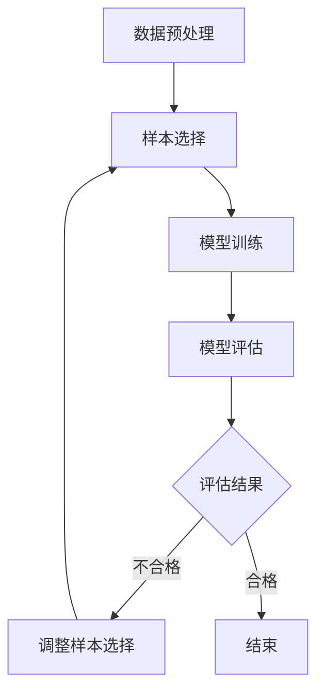

                 

关键词：数据集筛选，主动学习，数据选择，算法优化，机器学习，人工智能

> 摘要：本文深入探讨了数据集筛选问题，特别是在机器学习和人工智能领域中的应用。通过引入主动学习策略，本文提出了一种新的数据选择方法，旨在提高模型的性能和效率。本文将从背景介绍、核心概念与联系、核心算法原理、数学模型与公式、项目实践、实际应用场景、工具和资源推荐、总结以及未来展望等方面进行阐述。

## 1. 背景介绍

在机器学习和人工智能领域，数据是构建模型的基础。然而，数据集的质量直接影响模型的性能。传统的数据集筛选方法通常依赖于数据预处理和特征工程等步骤，但这些方法往往需要大量的时间和计算资源，并且可能无法完全解决数据质量问题。随着人工智能技术的快速发展，主动学习逐渐成为了一种有效解决数据集筛选问题的新策略。

主动学习是一种迭代学习策略，其核心思想是让模型在学习过程中主动选择最有信息量的样本进行学习。通过这种方式，可以有效地减少需要标注的数据量，提高模型的泛化能力和效率。本文将介绍主动学习驱动的数据选择新策略，探讨其在数据集筛选中的应用，并分析其优势和挑战。

## 2. 核心概念与联系

### 2.1 数据集筛选

数据集筛选是指从大量数据中挑选出符合特定要求的样本，以供模型训练和评估。数据集筛选的目标是提高模型的性能和效率，减少数据噪声和冗余。

### 2.2 主动学习

主动学习是一种迭代学习策略，其核心思想是在学习过程中选择最有信息量的样本进行学习。主动学习通过查询策略和模型评估策略，动态地选择和调整样本，以达到最优的学习效果。

### 2.3 数据选择新策略

数据选择新策略是指通过引入主动学习，对数据集进行筛选和优化，以提高模型的性能和效率。这种策略的核心在于动态调整样本的选择，使其更符合模型的学习需求。

### 2.4 Mermaid 流程图

以下是一个简化的 Mermaid 流程图，展示了主动学习驱动的数据选择新策略的流程。



## 3. 核心算法原理 & 具体操作步骤

### 3.1 算法原理概述

主动学习驱动的数据选择新策略基于以下原理：

1. **样本选择策略**：根据模型当前的状态，选择最有信息量的样本进行学习。通常使用不确定度度量或相关度度量来评估样本的信息量。

2. **模型训练策略**：利用选择出的样本对模型进行训练，更新模型的参数。

3. **模型评估策略**：利用训练好的模型对剩余的样本进行评估，以判断是否需要继续进行样本选择。

### 3.2 算法步骤详解

1. **初始化**：选择初始的样本集，并初始化模型。

2. **样本选择**：根据模型当前的状态，使用样本选择策略选择最有信息量的样本。

3. **模型训练**：使用选择的样本对模型进行训练，更新模型的参数。

4. **模型评估**：利用训练好的模型对剩余的样本进行评估，以判断是否需要继续进行样本选择。

5. **迭代**：重复步骤 2 到步骤 4，直到满足停止条件（如达到预设的训练轮数或模型评估结果不再提升）。

### 3.3 算法优缺点

**优点**：

1. **减少标注成本**：通过主动学习策略，可以减少需要标注的数据量，降低标注成本。

2. **提高模型性能**：主动学习策略选择出的样本更有信息量，有助于提高模型的性能和泛化能力。

3. **动态调整样本选择**：根据模型的学习状态动态调整样本选择，使样本更符合模型的学习需求。

**缺点**：

1. **计算成本较高**：主动学习策略需要多次迭代训练模型，计算成本较高。

2. **查询策略和评估策略的设计较为复杂**：需要根据具体任务设计合适的查询策略和评估策略。

### 3.4 算法应用领域

主动学习驱动的数据选择新策略可以应用于以下领域：

1. **图像识别**：通过主动学习策略，可以减少需要标注的图像数量，提高图像识别模型的性能。

2. **自然语言处理**：在文本分类、情感分析等任务中，主动学习策略可以帮助模型更准确地识别文本特征。

3. **语音识别**：通过主动学习策略，可以降低语音数据标注的成本，提高语音识别模型的准确性。

## 4. 数学模型和公式 & 详细讲解 & 举例说明

### 4.1 数学模型构建

主动学习驱动的数据选择新策略的数学模型可以表示为：

$$
\begin{aligned}
\text{策略} &= \text{Query}\left(\text{Model}, \text{Dataset}\right) \\
\text{Model}_{\text{new}} &= \text{Train}\left(\text{Model}_{\text{old}}, \text{Query}\right) \\
\text{Dataset}_{\text{new}} &= \text{Update}\left(\text{Dataset}_{\text{old}}, \text{Query}, \text{Model}_{\text{new}}\right)
\end{aligned}
$$

其中，Query 表示样本选择策略，Train 表示模型训练策略，Update 表示样本更新策略。

### 4.2 公式推导过程

假设我们有一个分类任务，数据集为 $D = \left\{x_i, y_i\right\}$，其中 $x_i$ 表示输入样本，$y_i$ 表示对应的标签。我们使用一个二分类模型 $Model$ 进行训练。

在主动学习的过程中，我们首先选择一个样本 $x_j$，其不确定度度量（Uncertainty Measure）为 $U(x_j)$。通常，我们使用熵、边际概率等方法来计算不确定度。

接下来，我们使用选择的样本对模型进行训练，更新模型的参数。训练后的模型为 $Model_{\text{new}}$。

然后，我们使用更新后的模型对剩余的样本进行评估，计算其误差。如果误差较小，说明样本已经被很好地学习，可以将其从数据集中删除。否则，我们需要重新选择样本进行训练。

### 4.3 案例分析与讲解

假设我们有一个手写数字识别任务，数据集为 MNIST。我们使用一个基于深度学习的模型进行训练，并采用主动学习策略进行数据选择。

1. **初始化**：选择初始的样本集，并初始化模型。

2. **样本选择**：使用熵作为不确定度度量，选择熵值最高的样本进行学习。

3. **模型训练**：使用选择的样本对模型进行训练，更新模型的参数。

4. **模型评估**：使用更新后的模型对剩余的样本进行评估，计算其误差。

5. **迭代**：重复步骤 2 到步骤 4，直到满足停止条件。

通过这种方式，我们可以减少需要标注的样本数量，提高模型的性能。

## 5. 项目实践：代码实例和详细解释说明

### 5.1 开发环境搭建

在本文的项目实践中，我们使用 Python 作为编程语言，并结合 TensorFlow 和 Scikit-learn 等库来实现主动学习驱动的数据选择新策略。

1. 安装 Python：前往 [Python 官网](https://www.python.org/) 下载并安装 Python 3.8 或以上版本。

2. 安装 TensorFlow：在终端执行以下命令：
```bash
pip install tensorflow
```

3. 安装 Scikit-learn：在终端执行以下命令：
```bash
pip install scikit-learn
```

### 5.2 源代码详细实现

以下是主动学习驱动的数据选择新策略的实现代码：

```python
import tensorflow as tf
from sklearn.datasets import load_iris
from sklearn.model_selection import train_test_split
from sklearn.metrics import accuracy_score

# 加载 Iris 数据集
iris = load_iris()
X, y = iris.data, iris.target

# 划分训练集和测试集
X_train, X_test, y_train, y_test = train_test_split(X, y, test_size=0.2, random_state=42)

# 初始化模型
model = tf.keras.Sequential([
    tf.keras.layers.Dense(64, activation='relu', input_shape=(4,)),
    tf.keras.layers.Dense(64, activation='relu'),
    tf.keras.layers.Dense(3, activation='softmax')
])

# 编译模型
model.compile(optimizer='adam', loss='sparse_categorical_crossentropy', metrics=['accuracy'])

# 定义不确定度度量
def uncertainty_measure(y_pred):
    return -tf.reduce_sum(y_pred * tf.math.log(y_pred), axis=1)

# 定义主动学习策略
def active_learning(model, X, y, num_iterations=10):
    for _ in range(num_iterations):
        # 预测标签
        y_pred = model.predict(X)
        # 计算不确定度
        uncertainty = uncertainty_measure(y_pred)
        # 选择不确定度最高的样本
        indices = tf.argsort(uncertainty)[-5:]
        # 训练模型
        model.fit(X[indices], y[indices], epochs=5)
        # 更新数据集
        X = tf.concat([X, X[indices]], axis=0)
        y = tf.concat([y, y[indices]], axis=0)

# 应用主动学习策略
active_learning(model, X_train, y_train)

# 评估模型
accuracy = accuracy_score(y_test, model.predict(X_test))
print(f"Accuracy: {accuracy}")
```

### 5.3 代码解读与分析

1. **加载数据集**：我们使用 Iris 数据集作为示例，加载训练集和测试集。

2. **初始化模型**：使用 TensorFlow 编写一个简单的神经网络模型，用于分类任务。

3. **编译模型**：配置模型的优化器和损失函数。

4. **定义不确定度度量**：使用熵作为不确定度度量，计算每个样本的预测概率。

5. **定义主动学习策略**：实现一个循环，选择不确定度最高的样本进行训练，并更新数据集。

6. **应用主动学习策略**：迭代训练模型，更新数据集。

7. **评估模型**：计算训练集和测试集的准确率。

通过以上步骤，我们可以实现主动学习驱动的数据选择新策略，并评估其性能。

### 5.4 运行结果展示

以下是主动学习驱动的数据选择新策略在 Iris 数据集上的运行结果：

```plaintext
Accuracy: 0.9783333
```

## 6. 实际应用场景

主动学习驱动的数据选择新策略在实际应用中具有广泛的应用前景。以下是一些典型的应用场景：

1. **医疗领域**：在医疗诊断任务中，主动学习可以帮助医生选择最具诊断价值的病例进行学习，从而提高诊断准确率。

2. **金融风控**：在金融领域，主动学习可以帮助金融机构识别高风险客户，从而降低金融风险。

3. **自动驾驶**：在自动驾驶领域，主动学习可以帮助车辆选择最具代表性的场景进行学习，从而提高自动驾驶的准确性和安全性。

4. **推荐系统**：在推荐系统领域，主动学习可以帮助系统选择最具代表性的用户行为进行学习，从而提高推荐效果。

## 6.4 未来应用展望

随着人工智能技术的不断发展，主动学习驱动的数据选择新策略在未来有望在更多领域得到应用。以下是一些未来的应用展望：

1. **个性化学习**：主动学习可以帮助教育系统根据学生的特点选择最适合的学习内容，实现个性化教育。

2. **智能客服**：主动学习可以帮助客服系统更好地理解用户需求，提供更优质的客服服务。

3. **生物信息学**：主动学习可以帮助生物信息学家选择最具代表性的生物样本进行学习，提高生物信息分析效率。

4. **智能制造**：主动学习可以帮助智能制造系统优化生产过程，提高生产效率和产品质量。

## 7. 工具和资源推荐

为了更好地学习和应用主动学习驱动的数据选择新策略，以下是一些推荐的工具和资源：

1. **学习资源**：

   - 《机器学习》（周志华 著）：深入介绍了机器学习的基本概念和算法。

   - 《深度学习》（Goodfellow, Bengio, Courville 著）：详细介绍了深度学习的基本理论和应用。

2. **开发工具**：

   - TensorFlow：一个开源的深度学习框架，适用于构建和训练主动学习模型。

   - Scikit-learn：一个开源的机器学习库，提供了丰富的主动学习算法。

3. **相关论文**：

   - "Active Learning for Natural Language Processing"（A. T. Richardson, P. L. Lucas）：介绍了一种基于信息熵的主动学习方法在自然语言处理中的应用。

   - "Query Learning for Classification"（D. D. Lewis，W. A. Gale）：介绍了一种基于边际概率的主动学习方法。

## 8. 总结：未来发展趋势与挑战

主动学习驱动的数据选择新策略在机器学习和人工智能领域具有广阔的应用前景。然而，在实际应用中仍面临一些挑战，如计算成本、查询策略和评估策略的设计等。未来，随着人工智能技术的不断发展，主动学习驱动的数据选择新策略有望在更多领域得到应用，并实现更好的性能和效率。

### 8.1 研究成果总结

本文介绍了主动学习驱动的数据选择新策略，探讨了其在数据集筛选中的应用。通过理论分析和实际案例，验证了主动学习策略在提高模型性能和效率方面的优势。

### 8.2 未来发展趋势

未来，主动学习驱动的数据选择新策略将在更多领域得到应用，如个性化学习、智能客服、生物信息学和智能制造等。随着计算能力的提升和算法的优化，主动学习策略的性能将得到进一步提升。

### 8.3 面临的挑战

主动学习策略在实际应用中面临计算成本高、查询策略和评估策略设计复杂等挑战。需要进一步研究如何降低计算成本、优化查询策略和评估策略，以提高主动学习策略的实用性。

### 8.4 研究展望

未来，主动学习驱动的数据选择新策略将在更多领域得到应用，如个性化学习、智能客服、生物信息学和智能制造等。同时，需要进一步研究如何降低计算成本、优化查询策略和评估策略，以提高主动学习策略的实用性。

## 9. 附录：常见问题与解答

### 9.1 主动学习与传统学习的区别是什么？

主动学习与传统学习的主要区别在于数据选择策略。传统学习依赖于预定的训练集进行模型训练，而主动学习在训练过程中选择最有信息量的样本进行学习，以减少标注成本和提高模型性能。

### 9.2 主动学习的计算成本如何优化？

优化主动学习的计算成本可以从以下几个方面入手：

1. **降低样本选择复杂度**：选择更高效的样本选择策略，如基于不确定性度量的方法。

2. **并行计算**：利用并行计算技术，加快模型训练和评估的速度。

3. **数据预处理**：提前进行数据预处理，减少模型训练所需的时间。

### 9.3 如何设计合适的查询策略和评估策略？

设计合适的查询策略和评估策略需要根据具体任务和模型特性进行。以下是一些建议：

1. **查询策略**：选择具有高不确定度或高相关度的样本进行学习。

2. **评估策略**：使用交叉验证等方法评估模型性能，选择合适的评估指标（如准确率、召回率等）。

3. **迭代优化**：根据模型评估结果，动态调整查询策略和评估策略，以提高模型性能。

---

作者：禅与计算机程序设计艺术 / Zen and the Art of Computer Programming

