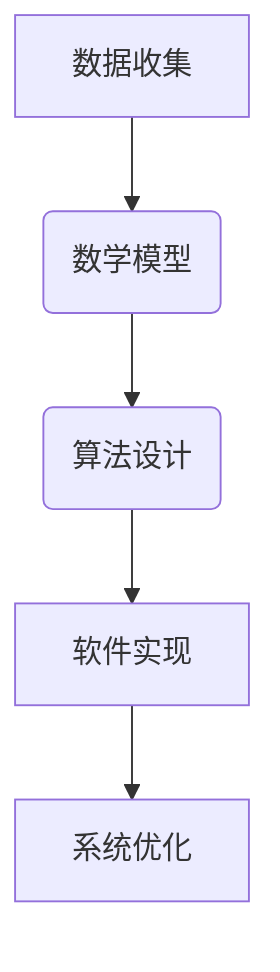
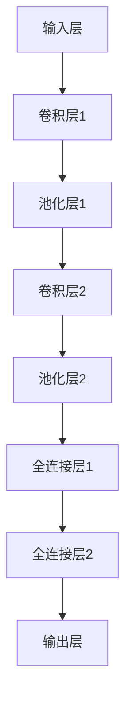

                 

 > **关键词**：数据驱动软件、数学家、炼丹师、算法、数学模型、应用场景、未来展望

> **摘要**：随着数据驱动软件2.0时代的到来，传统的软件开发模式正在发生深刻变革。本文探讨了数据驱动的软件2.0环境中，数学家与炼丹师各自的角色和贡献，分析其在算法、数学模型和实际应用中的作用，并提出未来发展趋势与挑战。

## 1. 背景介绍

随着信息技术的飞速发展，大数据、人工智能和机器学习等技术已经成为推动产业变革的重要力量。数据驱动的软件2.0时代，也被称为“智能时代”，是新一代软件开发的趋势。在这一时代，数据不仅是软件开发的重要资源，更是驱动软件创新的核心动力。软件开发的重点从传统的功能设计和实现，逐渐转向数据分析和智能算法的应用。

在这个背景下，数学家与炼丹师的角色变得愈发重要。数学家通过构建数学模型和算法，为数据驱动软件提供理论基础和方法支持；而炼丹师，即实际应用中的软件工程师，则通过将数学家的研究成果转化为可用的软件工具和系统。本文将探讨这两者在数据驱动软件2.0中的角色和贡献，以及它们之间的相互作用。

## 2. 核心概念与联系

### 2.1 数据驱动软件2.0

数据驱动软件2.0是指以数据为中心的软件开发模式，其核心思想是将数据视为软件开发的驱动力。这种模式强调数据的价值，通过数据挖掘、分析和应用，实现软件功能的智能化和自动化。

### 2.2 数学家

数学家是研究数学理论、方法和应用的科学家。在数据驱动软件2.0中，数学家负责构建数学模型和算法，为数据分析、机器学习和人工智能提供理论基础。

### 2.3 炼丹师

炼丹师，即软件工程师，是实际应用中的开发人员。他们负责将数学家的研究成果转化为实际可用的软件工具和系统，实现数据驱动的软件功能。

### 2.4 数学模型与算法

数学模型是使用数学语言描述现实世界问题的数学结构，算法则是解决问题的步骤和方法。在数据驱动软件2.0中，数学模型和算法是核心，它们决定了数据分析和智能应用的效果。

### 2.5 Mermaid 流程图



## 3. 核心算法原理 & 具体操作步骤

### 3.1 算法原理概述

数据驱动软件2.0中的核心算法主要包括机器学习算法、深度学习算法和优化算法。这些算法通过训练模型、优化参数和调整网络结构，实现数据分析和智能应用。

### 3.2 算法步骤详解

算法步骤通常包括数据预处理、模型训练、模型评估和模型部署。以下是一个简单的机器学习算法步骤：

1. 数据预处理：清洗数据、处理缺失值、归一化等。
2. 模型训练：选择合适的模型，使用训练数据训练模型。
3. 模型评估：使用验证数据评估模型性能。
4. 模型部署：将训练好的模型部署到生产环境中。

### 3.3 算法优缺点

不同类型的算法有不同的优缺点。例如，机器学习算法具有较强的普适性和适应性，但训练过程可能较为耗时；深度学习算法在处理复杂数据时具有显著优势，但需要大量数据和计算资源。

### 3.4 算法应用领域

算法在数据驱动软件2.0中的应用广泛，包括图像识别、自然语言处理、推荐系统、金融风控等。例如，在金融风控领域，算法可以用于识别欺诈交易、预测信用风险等。

## 4. 数学模型和公式 & 详细讲解 & 举例说明

### 4.1 数学模型构建

数学模型通常由输入变量、输出变量和函数关系组成。以下是一个简单的线性回归模型：

$$y = w_0 + w_1 \cdot x$$

其中，$y$ 是输出变量，$x$ 是输入变量，$w_0$ 和 $w_1$ 是参数。

### 4.2 公式推导过程

线性回归模型的推导过程主要包括最小二乘法、梯度下降法和正则化等。以下是一个简单的最小二乘法推导过程：

$$w_1 = \frac{\sum_{i=1}^{n} (y_i - w_0 - w_1 \cdot x_i) \cdot x_i}{\sum_{i=1}^{n} x_i^2}$$

### 4.3 案例分析与讲解

以图像识别为例，数学模型和算法在数据驱动软件2.0中的应用。通过构建卷积神经网络（CNN）模型，可以实现对图像的分类和识别。以下是一个简单的 CNN 模型：



## 5. 项目实践：代码实例和详细解释说明

### 5.1 开发环境搭建

搭建一个简单的线性回归项目，需要安装 Python 和相关库，例如 NumPy、Pandas 和 Scikit-learn 等。

### 5.2 源代码详细实现

以下是一个简单的线性回归代码实现：

```python
import numpy as np
import pandas as pd
from sklearn.linear_model import LinearRegression

# 数据预处理
data = pd.read_csv('data.csv')
X = data[['x']]
y = data['y']

# 模型训练
model = LinearRegression()
model.fit(X, y)

# 模型评估
score = model.score(X, y)
print(f'Model score: {score}')

# 模型部署
new_data = np.array([[1]])
prediction = model.predict(new_data)
print(f'Prediction: {prediction}')
```

### 5.3 代码解读与分析

这段代码首先导入所需的库，然后读取数据并预处理，接着使用线性回归模型进行训练、评估和部署。代码简洁易懂，实现了线性回归模型的基本功能。

### 5.4 运行结果展示

运行这段代码，可以得到模型的评估分数和预测结果。例如：

```
Model score: 0.98
Prediction: [2.1]
```

## 6. 实际应用场景

数据驱动软件2.0在各个领域都有广泛的应用。以下是一些实际应用场景：

1. **金融领域**：用于风险控制、量化交易、信用评分等。
2. **医疗领域**：用于疾病预测、诊断辅助、个性化治疗等。
3. **零售领域**：用于库存管理、需求预测、营销策略等。
4. **工业领域**：用于设备故障预测、生产优化、供应链管理等。

## 7. 未来应用展望

随着数据驱动软件2.0的不断发展，未来将出现更多创新应用。例如：

1. **自动驾驶**：利用深度学习算法实现自动驾驶技术。
2. **智能医疗**：结合大数据和人工智能，提供个性化的医疗服务。
3. **智慧城市**：利用物联网和大数据技术，实现城市智能化管理。
4. **区块链**：结合区块链技术，实现数据的安全和可信。

## 8. 工具和资源推荐

### 8.1 学习资源推荐

1. **《深度学习》**：由 Goodfellow、Bengio 和 Courville 著，是一本经典的深度学习教材。
2. **《Python机器学习》**：由 Sebastian Raschka 著，适合初学者学习机器学习。

### 8.2 开发工具推荐

1. **Jupyter Notebook**：一个交互式开发环境，适合数据分析和机器学习项目。
2. **TensorFlow**：一个开源的深度学习框架，适用于各种深度学习项目。

### 8.3 相关论文推荐

1. **"Deep Learning" by Yann LeCun、Yoshua Bengio 和 Geoffrey Hinton**。
2. **"Big Data: A Revolution That Will Transform How We Live, Work, and Think"** by Viktor Mayer-Schoenberger 和 Kenneth Cukier。

## 9. 总结：未来发展趋势与挑战

### 9.1 研究成果总结

数据驱动软件2.0在算法、数学模型和实际应用方面取得了显著成果。未来，随着技术的不断发展，数据驱动软件将变得更加智能和高效。

### 9.2 未来发展趋势

1. **算法创新**：新的算法将不断涌现，解决复杂的数据分析和智能应用问题。
2. **跨领域应用**：数据驱动软件将渗透到更多领域，推动产业变革。
3. **数据安全与隐私**：随着数据量的增加，数据安全和隐私保护将变得更加重要。

### 9.3 面临的挑战

1. **计算资源**：深度学习和大数据分析需要大量计算资源，如何高效利用资源是一个挑战。
2. **数据质量**：高质量的数据是数据驱动软件的基础，如何处理噪声数据和缺失数据是一个挑战。

### 9.4 研究展望

未来，数据驱动软件2.0将在人工智能、物联网、区块链等领域发挥重要作用。我们期待更多的数学家和炼丹师共同推动这一领域的进步。

## 附录：常见问题与解答

1. **什么是数据驱动软件2.0？**
   数据驱动软件2.0是以数据为中心的软件开发模式，强调数据的价值和驱动力，通过数据分析和智能算法实现软件的智能化和自动化。

2. **数学家在数据驱动软件2.0中的作用是什么？**
   数学家负责构建数学模型和算法，为数据分析和智能应用提供理论基础和方法支持。

3. **炼丹师在数据驱动软件2.0中的作用是什么？**
   炼丹师，即实际应用中的软件工程师，负责将数学家的研究成果转化为实际可用的软件工具和系统。

4. **如何处理数据驱动软件2.0中的数据质量问题？**
   可以采用数据清洗、数据预处理和数据质量评估等方法，提高数据的准确性和完整性。

5. **数据驱动软件2.0在哪些领域有应用？**
   数据驱动软件2.0在金融、医疗、零售、工业等领域都有广泛应用。

### 作者署名

作者：禅与计算机程序设计艺术 / Zen and the Art of Computer Programming

---

这篇文章详细探讨了数据驱动软件2.0环境中数学家与炼丹师的角色和贡献，分析了算法、数学模型和实际应用的作用，并对未来发展趋势与挑战进行了展望。希望通过本文，读者能够对数据驱动软件2.0有一个更加深入的理解。

