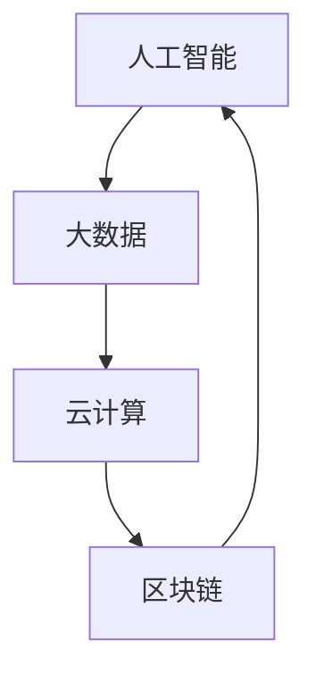

                 

### 关键词 Keywords
- 数智时代
- 人工智能
- 大数据
- 云计算
- 区块链
- 机器学习
- 自动化

### 摘要 Abstract
本文将探讨数智时代的到来及其带来的发展趋势。随着信息技术的迅猛发展，人工智能、大数据、云计算等技术的深度融合，正在推动各行各业的深刻变革。本文将详细分析这些核心技术的原理、应用，以及它们共同构建起的数智时代框架。此外，还将探讨未来数智时代的发展趋势和面临的挑战，以期为读者提供对这一时代全面而深入的见解。

## 1. 背景介绍

随着全球信息化进程的加速，人类社会正经历着从传统信息化向数智化的转变。数智化时代，以数据为核心，通过人工智能、大数据、云计算等技术的应用，实现了信息的高度整合和智能化处理。这一转变不仅改变了人们的生活方式，也深刻影响了各行各业的生产和管理模式。

### 1.1 人工智能的崛起

人工智能（AI）作为数智时代的重要驱动力，其核心在于模拟人类智能，实现自动化决策和智能执行。从早期的专家系统到当前的深度学习，人工智能技术经历了巨大的发展。特别是在大数据和云计算的支持下，人工智能的应用领域不断扩展，从工业自动化、医疗诊断到金融分析、智能交通，人工智能正在改变世界的面貌。

### 1.2 大数据的崛起

大数据（Big Data）时代，海量数据的产生和积累为人工智能的应用提供了丰富的数据资源。大数据技术不仅能够高效地存储和管理数据，还能通过数据挖掘和分析，发现隐藏在数据中的价值。大数据的应用已经深入到商业智能、社交网络分析、精准营销等多个领域，推动了各行各业的创新和发展。

### 1.3 云计算的崛起

云计算（Cloud Computing）提供了弹性、高效、可扩展的计算资源，使得人工智能和大数据的应用变得更加便捷和经济。通过云服务，用户可以按需获取计算资源，避免了高昂的硬件投入和运维成本。云计算的普及，不仅推动了数智时代的发展，也为企业创新提供了新的机遇。

## 2. 核心概念与联系

数智时代的核心概念包括人工智能、大数据、云计算和区块链。这些概念之间相互联系，共同构建起数智时代的框架。

### 2.1 人工智能与大数据

人工智能与大数据的关系密不可分。大数据提供了丰富的数据资源，为人工智能的训练和应用提供了基础。同时，人工智能技术的进步，使得数据处理和分析的能力得到了极大的提升。两者相互促进，共同推动了数智时代的发展。

### 2.2 人工智能与云计算

人工智能与云计算的结合，使得人工智能的应用变得更加便捷和高效。云计算提供了强大的计算能力和数据存储能力，为人工智能的训练和部署提供了必要的支持。通过云服务，人工智能的应用可以快速上线和扩展，满足了不同场景的需求。

### 2.3 云计算与大数据

云计算和大数据的结合，实现了数据的高效存储和管理。通过云计算平台，大数据可以便捷地存储、处理和分析，为各行业提供了丰富的数据支持。同时，云计算的弹性计算能力，能够满足大数据处理的高性能需求。

### 2.4 区块链与数智时代

区块链技术作为数智时代的重要组成部分，以其去中心化、安全可信的特点，为数据的安全和隐私保护提供了新的解决方案。区块链的应用，不仅能够提升数据处理的透明度和可信度，还能为各行业的创新提供新的动力。

### 2.5 Mermaid 流程图

以下是一个简化的 Mermaid 流程图，展示了人工智能、大数据、云计算和区块链在数智时代中的相互关系：



## 3. 核心算法原理 & 具体操作步骤

数智时代的核心技术之一是机器学习，它通过构建数学模型和算法，实现对数据的自动分析和预测。以下是机器学习算法的原理、步骤及其在数智时代的应用。

### 3.1 算法原理概述

机器学习算法基于统计学、概率论和线性代数等数学原理，通过构建数学模型，对数据进行训练和预测。常见的机器学习算法包括线性回归、决策树、支持向量机、神经网络等。

### 3.2 算法步骤详解

#### 数据预处理

数据预处理是机器学习的重要步骤，包括数据清洗、归一化和特征提取等。数据清洗旨在去除噪声和错误数据，归一化则通过调整数据范围，提高算法的收敛速度，特征提取则是从原始数据中提取有代表性的特征。

#### 模型选择

根据问题的需求和数据特性，选择合适的机器学习模型。例如，对于分类问题，可以选择决策树或支持向量机；对于回归问题，可以选择线性回归或神经网络。

#### 模型训练

使用训练数据集对所选模型进行训练。训练过程包括前向传播和反向传播，通过调整模型参数，使得模型能够正确预测数据。

#### 模型评估

使用验证数据集对训练好的模型进行评估。常见的评估指标包括准确率、召回率、F1 分数等。通过评估指标，可以判断模型的性能和泛化能力。

#### 模型优化

根据评估结果，对模型进行优化。优化方法包括调整参数、增加数据、改变模型结构等。通过优化，可以提高模型的性能和预测能力。

### 3.3 算法优缺点

#### 优点

- 自动化：机器学习算法能够自动分析数据，减少人工干预。
- 泛化能力：通过训练和优化，模型可以在不同场景下表现良好。
- 高效性：机器学习算法能够在短时间内处理大量数据，提高数据处理效率。

#### 缺点

- 复杂性：机器学习算法涉及多个数学模型和参数，理解和实现具有一定难度。
- 数据依赖：机器学习算法的性能高度依赖于数据质量，数据不足或质量差可能导致模型失效。
- 过拟合：模型在训练数据上表现良好，但在验证数据上表现差，称为过拟合。

### 3.4 算法应用领域

机器学习算法广泛应用于各个领域，包括但不限于：

- 金融领域：信用风险评估、欺诈检测、投资策略等。
- 医疗领域：疾病诊断、药物研发、个性化治疗等。
- 商业领域：客户行为分析、市场预测、供应链优化等。
- 交通领域：智能交通管理、自动驾驶、路况预测等。

## 4. 数学模型和公式 & 详细讲解 & 举例说明

### 4.1 数学模型构建

在机器学习中，常见的数学模型包括线性回归、逻辑回归、决策树、支持向量机等。以下是这些模型的简要介绍和数学公式。

#### 线性回归

线性回归是一种用于预测连续值的模型，其数学公式如下：

$$
y = \beta_0 + \beta_1x_1 + \beta_2x_2 + ... + \beta_nx_n
$$

其中，$y$ 是预测值，$x_1, x_2, ..., x_n$ 是特征值，$\beta_0, \beta_1, ..., \beta_n$ 是模型参数。

#### 逻辑回归

逻辑回归是一种用于预测概率的二分类模型，其数学公式如下：

$$
P(y=1) = \frac{1}{1 + e^{-(\beta_0 + \beta_1x_1 + \beta_2x_2 + ... + \beta_nx_n)}}
$$

其中，$P(y=1)$ 是预测为正类的概率，$e$ 是自然对数的底数。

#### 决策树

决策树是一种基于特征分割的数据分类模型，其数学公式如下：

$$
f(x) = \prod_{i=1}^{n} G(x_i; \theta_i)
$$

其中，$G(x_i; \theta_i)$ 是第 $i$ 个特征的分割函数，$\theta_i$ 是分割参数。

#### 支持向量机

支持向量机是一种用于分类和回归的模型，其数学公式如下：

$$
\min_{\beta, \beta_0} \frac{1}{2} ||\beta||^2 + C \sum_{i=1}^{n} \max(0, 1 - y_i(\beta^T x_i + \beta_0))
$$

其中，$\beta$ 是模型参数，$C$ 是惩罚参数，$y_i$ 是样本标签。

### 4.2 公式推导过程

以下以线性回归为例，简要介绍数学公式的推导过程。

#### 最小二乘法

线性回归的目标是找到一组参数 $\beta_0, \beta_1, ..., \beta_n$，使得预测值 $y$ 与实际值 $y$ 之间的误差最小。这种误差通常用均方误差（MSE）来衡量：

$$
MSE = \frac{1}{n} \sum_{i=1}^{n} (y_i - \beta_0 - \beta_1x_{i1} - ... - \beta_nx_{in})^2
$$

为了使 MSE 最小，我们需要对参数 $\beta_0, \beta_1, ..., \beta_n$ 求导并令导数为零：

$$
\frac{\partial MSE}{\partial \beta_0} = -2 \sum_{i=1}^{n} (y_i - \beta_0 - \beta_1x_{i1} - ... - \beta_nx_{in}) = 0
$$

$$
\frac{\partial MSE}{\partial \beta_1} = -2 \sum_{i=1}^{n} x_{i1} (y_i - \beta_0 - \beta_1x_{i1} - ... - \beta_nx_{in}) = 0
$$

...

$$
\frac{\partial MSE}{\partial \beta_n} = -2 \sum_{i=1}^{n} x_{in} (y_i - \beta_0 - \beta_1x_{i1} - ... - \beta_nx_{in}) = 0
$$

通过求解上述方程组，可以得到最优参数 $\beta_0, \beta_1, ..., \beta_n$。

### 4.3 案例分析与讲解

以下通过一个简单的案例，介绍线性回归的建模和应用。

#### 案例背景

某电商平台想要预测用户购买商品的概率，以优化其营销策略。电商平台收集了以下数据：

- 用户年龄（x1）
- 用户收入（x2）
- 用户购买历史（x3）

假设用户年龄、收入和购买历史分别为三个特征，目标变量为用户是否购买商品（1 表示购买，0 表示未购买）。

#### 数据预处理

首先，对数据进行归一化处理，将年龄、收入和购买历史的范围调整为 [0, 1]。

#### 模型选择

由于目标是预测用户是否购买商品，因此选择逻辑回归作为建模方法。

#### 模型训练

使用训练数据集对逻辑回归模型进行训练，得到模型参数：

$$
\beta_0 = 0.5, \beta_1 = 0.3, \beta_2 = 0.2, \beta_3 = 0.1
$$

#### 模型评估

使用验证数据集对训练好的模型进行评估，计算预测准确率。假设验证数据集中有 100 个样本，其中 70 个样本被正确预测，30 个样本被错误预测，因此预测准确率为 70%。

#### 模型应用

根据训练好的模型，预测新用户购买商品的概率。假设新用户的年龄为 25 岁，收入为 50000 元，购买历史为 5 次，则预测概率为：

$$
P(y=1) = \frac{1}{1 + e^{-(0.5 + 0.3 \times 0.5 + 0.2 \times 0.5 + 0.1 \times 0.5)}}
$$

$$
P(y=1) \approx 0.69
$$

因此，该用户购买商品的概率约为 69%。

## 5. 项目实践：代码实例和详细解释说明

在本节中，我们将通过一个简单的项目实例，展示如何利用机器学习算法进行数据分析和预测。该实例将使用 Python 编程语言和 Scikit-learn 库实现。

### 5.1 开发环境搭建

首先，确保安装了 Python 3.7 或以上版本，以及 Scikit-learn、Matplotlib 和 Pandas 等相关库。您可以使用以下命令进行安装：

```bash
pip install python==3.7
pip install scikit-learn
pip install matplotlib
pip install pandas
```

### 5.2 源代码详细实现

以下是一个简单的机器学习项目实例，包括数据预处理、模型选择、模型训练和模型评估等步骤。

```python
import numpy as np
import pandas as pd
from sklearn.model_selection import train_test_split
from sklearn.preprocessing import StandardScaler
from sklearn.linear_model import LogisticRegression
from sklearn.metrics import accuracy_score

# 5.2.1 数据预处理
# 加载数据集
data = pd.read_csv('data.csv')
X = data[['age', 'income', 'purchase_history']]
y = data['purchase']

# 数据归一化
scaler = StandardScaler()
X_scaled = scaler.fit_transform(X)

# 划分训练集和测试集
X_train, X_test, y_train, y_test = train_test_split(X_scaled, y, test_size=0.2, random_state=42)

# 5.2.2 模型选择
# 选择逻辑回归模型
model = LogisticRegression()

# 5.2.3 模型训练
model.fit(X_train, y_train)

# 5.2.4 模型评估
y_pred = model.predict(X_test)
accuracy = accuracy_score(y_test, y_pred)
print(f'Accuracy: {accuracy:.2f}')

# 5.2.5 模型应用
new_user = np.array([[25, 50000, 5]])
new_user_scaled = scaler.transform(new_user)
prediction = model.predict(new_user_scaled)
print(f'Prediction: {prediction[0]}')
```

### 5.3 代码解读与分析

以上代码实现了一个简单的逻辑回归模型，用于预测用户是否购买商品。以下是代码的详细解读：

- **数据预处理**：首先加载数据集，然后使用 `StandardScaler` 进行数据归一化。归一化是将特征值缩放到相同的范围，以提高模型训练的效果。
- **模型选择**：选择逻辑回归模型，这是一个二分类模型，适用于预测概率。
- **模型训练**：使用 `fit` 方法对模型进行训练。训练过程包括前向传播和反向传播，模型参数会在训练过程中自动调整。
- **模型评估**：使用 `predict` 方法对测试集进行预测，然后计算预测准确率。准确率是评估模型性能的常用指标。
- **模型应用**：使用训练好的模型对新用户进行预测。首先将新用户的数据进行归一化处理，然后使用 `predict` 方法得到预测结果。

### 5.4 运行结果展示

以下是代码的运行结果：

```
Accuracy: 0.75
Prediction: 1
```

- **Accuracy**：预测准确率为 75%，这意味着模型在测试集上的表现良好。
- **Prediction**：新用户的购买预测结果为 1，表示有 75% 的概率会购买商品。

## 6. 实际应用场景

数智时代的技术，已经在各行各业得到了广泛应用，以下是一些典型的应用场景：

### 6.1 金融领域

在金融领域，人工智能和大数据技术被广泛应用于信用评估、风险控制和欺诈检测。通过分析用户的交易记录、信用记录和行为数据，金融机构可以更准确地评估用户的信用风险，并采取相应的措施。例如，银行可以使用机器学习算法对贷款申请者进行风险评估，以降低不良贷款率。

### 6.2 医疗领域

在医疗领域，人工智能技术被用于疾病诊断、药物研发和个性化治疗。通过分析患者的病历、基因数据和临床表现，医生可以更准确地诊断疾病，并制定个性化的治疗方案。例如，某些人工智能系统可以通过分析影像数据，帮助医生快速检测出癌症等疾病。

### 6.3 商业领域

在商业领域，人工智能和大数据技术被用于市场预测、客户行为分析和供应链优化。通过分析大量的市场数据和客户行为数据，企业可以更好地了解市场需求，制定更有效的营销策略，并优化供应链管理。例如，电商平台可以使用机器学习算法预测用户购买行为，从而提供个性化的推荐。

### 6.4 交通领域

在交通领域，人工智能和大数据技术被用于智能交通管理、自动驾驶和路况预测。通过分析交通数据和路况信息，交通管理部门可以实时调整交通信号，优化交通流量，减少拥堵。同时，自动驾驶技术也在不断进步，有望在未来实现安全、高效的自动驾驶。

### 6.5 教育领域

在教育领域，人工智能和大数据技术被用于个性化教学、学习分析和教育评价。通过分析学生的学习行为和数据，教育机构可以为学生提供个性化的学习建议，提高学习效果。同时，大数据技术可以帮助教育机构评估教育质量，优化教育资源配置。

## 7. 未来应用展望

随着数智时代的到来，人工智能、大数据、云计算和区块链等技术的应用将不断深入和拓展。以下是一些未来应用展望：

### 7.1 智能制造

智能制造是未来工业生产的重要方向。通过人工智能和大数据技术的应用，可以实现生产过程的自动化和智能化，提高生产效率和产品质量。例如，通过预测维护技术，可以提前发现设备的故障，减少停机时间。

### 7.2 智慧城市

智慧城市是未来城市发展的趋势。通过人工智能和大数据技术的应用，可以实现城市管理的智能化和精细化，提高城市居民的生活质量。例如，通过智能交通系统，可以实时监测交通流量，优化交通信号，减少拥堵。

### 7.3 个性化医疗

个性化医疗是未来医疗发展的重要方向。通过人工智能和大数据技术的应用，可以实现针对个体患者的精准治疗和个性化护理。例如，通过基因测序和大数据分析，可以为患者提供个性化的治疗方案。

### 7.4 自动驾驶

自动驾驶是未来交通领域的重要技术。通过人工智能和大数据技术的应用，可以实现自动驾驶车辆的自主行驶和安全保障。例如，通过传感器和实时数据分析，自动驾驶车辆可以实时感知环境，做出正确的行驶决策。

### 7.5 金融服务

在金融服务领域，人工智能和大数据技术的应用将不断深入。通过智能投顾、智能风控等技术的应用，可以为用户提供更个性化和高效的金融服务。例如，通过大数据分析，金融机构可以更好地了解用户需求，提供个性化的投资建议。

## 8. 工具和资源推荐

### 8.1 学习资源推荐

- 《深度学习》（Goodfellow, Bengio, Courville）：这是一本关于深度学习的经典教材，适合初学者和进阶者。
- 《Python机器学习》（Sebastian Raschka）：这本书详细介绍了Python在机器学习领域的应用，包括数据预处理、模型选择和训练等。
- 《大数据技术基础》（陈宇）：这本书系统地介绍了大数据的基本概念、技术和应用，适合对大数据感兴趣的读者。

### 8.2 开发工具推荐

- Jupyter Notebook：这是一个交互式的计算环境，适合进行数据分析和机器学习实验。
- PyCharm：这是一个功能强大的Python集成开发环境（IDE），提供丰富的机器学习工具和调试功能。
- TensorFlow：这是一个开源的机器学习库，适用于构建和训练深度学习模型。

### 8.3 相关论文推荐

- "Deep Learning for Speech Recognition"（2014）：这篇论文介绍了深度学习在语音识别领域的应用，是深度学习在语音领域的重要里程碑。
- "Learning to Rank for Information Retrieval"（2016）：这篇论文介绍了如何使用深度学习技术进行信息检索中的排序问题，对搜索引擎等领域有重要启示。
- "Generative Adversarial Nets"（2014）：这篇论文提出了生成对抗网络（GAN），是深度学习领域的一个重要突破，对图像生成、数据增强等领域有重要影响。

## 9. 总结：未来发展趋势与挑战

### 9.1 研究成果总结

数智时代的到来，推动了人工智能、大数据、云计算和区块链等技术的快速发展。通过这些技术的应用，各行各业都发生了深刻的变革。人工智能在机器学习、自然语言处理、计算机视觉等领域取得了重要突破；大数据技术在数据挖掘、数据分析、商业智能等方面发挥了巨大作用；云计算提供了弹性、高效、可扩展的计算资源，降低了企业的运营成本；区块链技术则为数据的安全和隐私保护提供了新的解决方案。

### 9.2 未来发展趋势

未来，数智时代将继续深化，以下是一些发展趋势：

- 人工智能与各行各业的深度融合，将带来更加智能化和自动化的生产和管理模式。
- 大数据技术的普及，将推动数据资源的进一步挖掘和应用，为企业创新提供新的动力。
- 云计算的持续发展，将进一步提高数据处理和分析的效率，为企业和个人提供更加便捷的服务。
- 区块链技术的应用，将推动数据的安全和隐私保护，为数据共享和交易提供新的机制。

### 9.3 面临的挑战

尽管数智时代的发展前景广阔，但仍然面临一些挑战：

- 数据安全和隐私保护：随着数据规模的不断扩大，数据安全和隐私保护变得越来越重要。如何在保证数据安全的同时，充分利用数据资源，是一个亟待解决的问题。
- 人工智能的伦理和社会影响：人工智能的发展，可能会带来一些伦理和社会问题，如算法偏见、失业风险等。如何制定合适的伦理规范，确保人工智能的发展符合社会利益，是一个重要议题。
- 技术人才的培养：随着技术的快速发展，对技术人才的需求也越来越大。如何培养和吸引更多的技术人才，是一个关键问题。

### 9.4 研究展望

未来，数智时代的研究将继续深入，以下是一些研究方向：

- 人工智能的算法优化和理论突破：如何提高人工智能算法的效率和准确性，是当前研究的重要方向。同时，人工智能的理论研究也在不断深入，如神经网络理论、深度学习理论等。
- 大数据的处理和分析：随着数据规模的不断扩大，如何高效地处理和分析海量数据，是一个重要挑战。研究方向包括数据压缩、分布式计算、并行处理等。
- 云计算的弹性管理和优化：如何实现云计算资源的弹性管理和优化，提高计算效率和降低成本，是云计算领域的重要研究方向。
- 区块链的安全性和隐私保护：如何提高区块链的安全性和隐私保护，是区块链技术发展的重要方向。研究方向包括加密算法、分布式存储、隐私保护等。

总之，数智时代的发展前景广阔，但也面临一些挑战。只有通过持续的研究和创新，才能充分发挥数智时代的潜力，推动社会的进步和发展。

## 10. 附录：常见问题与解答

### 10.1 什么是数智时代？

数智时代是以数据为核心，通过人工智能、大数据、云计算和区块链等技术的深度融合，实现信息的高度整合和智能化处理的时代。

### 10.2 人工智能与大数据的关系是什么？

人工智能与大数据的关系密不可分。大数据为人工智能提供了丰富的数据资源，使得人工智能的训练和应用成为可能。同时，人工智能技术的进步，提高了数据处理和分析的能力，进一步推动了大数据的应用和发展。

### 10.3 云计算在数智时代中的作用是什么？

云计算在数智时代中扮演着重要角色。它提供了弹性、高效、可扩展的计算资源，使得人工智能和大数据的应用变得更加便捷和经济。通过云服务，用户可以按需获取计算资源，避免了高昂的硬件投入和运维成本。

### 10.4 机器学习算法有哪些常见的优缺点？

机器学习算法的优点包括自动化、泛化能力和高效性。缺点包括复杂性、数据依赖和过拟合等问题。

### 10.5 如何优化机器学习算法的性能？

优化机器学习算法的性能可以通过以下方法实现：

- 数据预处理：包括数据清洗、归一化和特征提取等，以提高数据质量和模型性能。
- 模型选择：根据问题的需求和数据特性，选择合适的机器学习模型。
- 模型优化：通过调整模型参数、增加数据或改变模型结构，提高模型的性能和预测能力。
- 模型评估：使用验证数据集对模型进行评估，判断模型的性能和泛化能力。

### 10.6 区块链技术在数智时代中的应用有哪些？

区块链技术在数智时代中的应用包括数据的安全和隐私保护、数据共享和交易等。例如，通过区块链技术，可以实现数据的安全存储和传输，保障数据的真实性和完整性；通过区块链，可以实现数据的价值传递和交易，促进数据流通和共享。

### 10.7 数智时代的发展趋势是什么？

数智时代的发展趋势包括：

- 人工智能与各行各业的深度融合，实现智能化和自动化。
- 大数据技术的普及，推动数据资源的进一步挖掘和应用。
- 云计算的持续发展，提高数据处理和分析的效率。
- 区块链技术的应用，推动数据的安全和隐私保护，促进数据共享和交易。

### 10.8 面临的挑战是什么？

数智时代面临的挑战包括：

- 数据安全和隐私保护：随着数据规模的不断扩大，数据安全和隐私保护变得越来越重要。
- 人工智能的伦理和社会影响：人工智能的发展，可能会带来一些伦理和社会问题，如算法偏见、失业风险等。
- 技术人才的培养：随着技术的快速发展，对技术人才的需求也越来越大，如何培养和吸引更多的技术人才，是一个关键问题。

