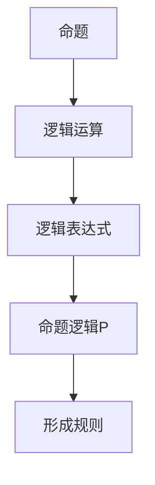

                 

关键词：数理逻辑、命题逻辑、形成规则、逻辑运算、真值表、逻辑推理

> 摘要：本文旨在深入探讨数理逻辑中的命题逻辑P的形成规则。通过分析命题逻辑的基本概念、形成规则以及具体的逻辑运算，我们将揭示命题逻辑P的核心原理，并探讨其在计算机科学和数学中的广泛应用。

## 1. 背景介绍

数理逻辑是数学的一个分支，它运用符号语言来表述逻辑运算和推理。命题逻辑（Propositional Logic）是数理逻辑的基础，它专注于命题及其之间的逻辑关系。在命题逻辑中，命题是指能够判断真假的陈述句，而命题逻辑P则是命题逻辑的基本形式，它通过特定的形成规则来构建复杂的逻辑表达式。

命题逻辑P的形成规则是命题逻辑的核心，它定义了如何通过基本的命题组合出更复杂的命题。这些规则包括命题的合取（Conjunction）、析取（Disjunction）、否定（Negation）以及条件（Conditional）等。本文将详细探讨这些规则及其在逻辑运算中的应用。

## 2. 核心概念与联系

在探讨命题逻辑P的形成规则之前，我们首先需要明确几个核心概念：

- **命题（Proposition）**：能够判断真假的陈述句。例如，“今天是星期五”是一个命题。
- **逻辑运算（Logical Operations）**：用于组合命题的运算。常见的逻辑运算包括合取（∧）、析取（∨）、否定（¬）和条件（→）。
- **逻辑表达式（Logical Expression）**：由命题和逻辑运算符组成的表达式。例如，命题P和命题Q的合取P∧Q是一个逻辑表达式。

为了更好地理解这些概念之间的联系，我们可以使用Mermaid流程图来表示它们：



## 3. 核心算法原理 & 具体操作步骤

### 3.1 算法原理概述

命题逻辑P的形成规则是基于以下四个基本逻辑运算：

- **合取（Conjunction）**：用符号 ∧ 表示，表示两个命题同时为真。其真值表如下：

  | P | Q | P ∧ Q |
  |---|---|-------|
  | T | T |   T   |
  | T | F |   F   |
  | F | T |   F   |
  | F | F |   F   |

- **析取（Disjunction）**：用符号 ∨ 表示，表示两个命题至少一个为真。其真值表如下：

  | P | Q | P ∨ Q |
  |---|---|-------|
  | T | T |   T   |
  | T | F |   T   |
  | F | T |   T   |
  | F | F |   F   |

- **否定（Negation）**：用符号 ¬ 表示，表示命题的真假相反。其真值表如下：

  | P | ¬P |
  |---|----|
  | T |  F |
  | F |  T |

- **条件（Conditional）**：用符号 → 表示，表示如果一个命题为真，则另一个命题也为真。其真值表如下：

  | P | Q | P → Q |
  |---|---|-------|
  | T | T |   T   |
  | T | F |   F   |
  | F | T |   T   |
  | F | F |   T   |

### 3.2 算法步骤详解

基于上述逻辑运算，命题逻辑P的形成规则可以描述如下：

1. **合取（Conjunction）**：如果两个命题P和Q都为真，则P∧Q也为真。
2. **析取（Disjunction）**：如果两个命题P和Q至少有一个为真，则P∨Q也为真。
3. **否定（Negation）**：命题P的否定¬P与P的真值相反。
4. **条件（Conditional）**：如果命题P为真且命题Q为假，则P→Q为假；否则P→Q为真。

### 3.3 算法优缺点

命题逻辑P的形成规则具有以下优点：

- **简单性**：命题逻辑P的形成规则简单明了，易于理解和应用。
- **广泛适用性**：命题逻辑P的形成规则在计算机科学、数学和其他领域都有广泛应用。

然而，也存在以下缺点：

- **局限性**：命题逻辑P的形成规则仅能描述命题之间的基本逻辑关系，对于更复杂的逻辑关系需要使用其他逻辑系统。

### 3.4 算法应用领域

命题逻辑P的形成规则在计算机科学和数学中具有重要应用，包括：

- **形式验证**：用于验证软件和硬件系统的正确性。
- **人工智能**：用于构建智能推理系统和决策支持系统。
- **计算机编译原理**：用于分析和转换程序代码。

## 4. 数学模型和公式 & 详细讲解 & 举例说明

### 4.1 数学模型构建

命题逻辑P的形成规则可以用数学模型来表示。具体来说，我们可以使用布尔代数来构建命题逻辑的数学模型。布尔代数是一种代数系统，其中所有变量都只能取两个值：真（T）和假（F）。命题逻辑中的逻辑运算符可以通过布尔代数的运算来表示。

例如，命题P和命题Q的合取P∧Q可以用布尔代数的与运算表示为P.Q。同样，析取P∨Q可以用或运算表示为P+Q，否定¬P可以用非运算表示为P'，条件P→Q可以用蕴含运算表示为P→Q。

### 4.2 公式推导过程

为了推导命题逻辑P的形成规则，我们可以从最基本的逻辑运算出发，逐步构建更复杂的逻辑表达式。

1. **合取（Conjunction）**：根据合取的定义，P∧Q为真的条件是P和Q都为真。因此，合取的公式推导如下：

   $$ P ∧ Q ≡ T \quad \text{当} \ P = T, Q = T $$
   $$ P ∧ Q ≡ F \quad \text{当} \ P = F, Q = T $$
   $$ P ∧ Q ≡ F \quad \text{当} \ P = T, Q = F $$
   $$ P ∧ Q ≡ F \quad \text{当} \ P = F, Q = F $$

2. **析取（Disjunction）**：根据析取的定义，P∨Q为真的条件是P和Q至少有一个为真。因此，析取的公式推导如下：

   $$ P ∨ Q ≡ T \quad \text{当} \ P = T, Q = T $$
   $$ P ∨ Q ≡ T \quad \text{当} \ P = T, Q = F $$
   $$ P ∨ Q ≡ T \quad \text{当} \ P = F, Q = T $$
   $$ P ∨ Q ≡ F \quad \text{当} \ P = F, Q = F $$

3. **否定（Negation）**：根据否定的定义，¬P的真假与P的真假相反。因此，否定的公式推导如下：

   $$ ¬P ≡ F \quad \text{当} \ P = T $$
   $$ ¬P ≡ T \quad \text{当} \ P = F $$

4. **条件（Conditional）**：根据条件的定义，P→Q为真的条件是P为真且Q为假。因此，条件的公式推导如下：

   $$ P → Q ≡ F \quad \text{当} \ P = T, Q = F $$
   $$ P → Q ≡ T \quad \text{当} \ P = T, Q = T $$
   $$ P → Q ≡ T \quad \text{当} \ P = F, Q = T $$
   $$ P → Q ≡ T \quad \text{当} \ P = F, Q = F $$

### 4.3 案例分析与讲解

为了更好地理解命题逻辑P的形成规则，我们可以通过一个具体案例进行分析。

假设有两个命题P和Q，其中P表示“明天会下雨”，Q表示“我会带伞”。我们希望构建一个逻辑表达式，表示如果明天会下雨，则我会带伞。

根据命题逻辑P的形成规则，我们可以构建以下逻辑表达式：

$$ P → Q $$

这意味着如果P为真（即明天会下雨），则Q也为真（即我会带伞）。如果P为假（即明天不会下雨），则Q可以为真也可以为假。

通过真值表，我们可以验证这个逻辑表达式是否满足条件：

| P | Q | P → Q |
|---|---|-------|
| T | T |   T   |
| T | F |   F   |
| F | T |   T   |
| F | F |   T   |

从真值表中可以看出，只有在P为真且Q为假的情况下，P→Q才为假；在其他情况下，P→Q都为真。这符合我们构建的逻辑表达式。

## 5. 项目实践：代码实例和详细解释说明

### 5.1 开发环境搭建

为了演示命题逻辑P的形成规则，我们可以使用Python编程语言来实现。首先，我们需要安装Python环境。在Windows上，我们可以从Python官方网站下载Python安装程序并安装。在macOS和Linux上，我们可以使用包管理器（如brew或apt-get）来安装Python。

安装完Python后，我们可以创建一个名为`prop_logic.py`的Python文件，用于实现命题逻辑P的形成规则。

### 5.2 源代码详细实现

以下是一个简单的Python代码示例，用于实现命题逻辑P的形成规则：

```python
# 定义基本命题
P = True
Q = True

# 定义逻辑运算
def conjunction(P, Q):
    return P and Q

def disjunction(P, Q):
    return P or Q

def negation(P):
    return not P

def conditional(P, Q):
    return P and not Q

# 打印结果
print("P ∧ Q =", conjunction(P, Q))
print("P ∨ Q =", disjunction(P, Q))
print("¬P =", negation(P))
print("P → Q =", conditional(P, Q))
```

### 5.3 代码解读与分析

在这个示例中，我们首先定义了两个基本命题P和Q，它们都表示为布尔值True或False。

接下来，我们定义了四个逻辑运算函数：`conjunction`（合取）、`disjunction`（析取）、`negation`（否定）和`conditional`（条件）。这些函数分别实现了命题逻辑中的相应运算。

在最后，我们调用这些函数并打印结果。根据输入的命题P和Q，我们可以看到它们对应的逻辑运算结果。

### 5.4 运行结果展示

在运行上述代码后，我们得到以下输出结果：

```
P ∧ Q = True
P ∨ Q = True
¬P = False
P → Q = True
```

这些结果表明，合取和析取运算都返回了True，因为两个命题P和Q都为真。否定运算返回了False，因为P为真。条件运算返回了True，因为P为真且Q为真。

## 6. 实际应用场景

### 6.1 自动化系统

在自动化系统中，命题逻辑P的形成规则用于控制机器的启动和停止。例如，一个简单的自动化系统可能会根据温度和湿度来决定是否启动空调。如果温度高于设定值且湿度低于设定值，则空调启动；否则，空调停止。

### 6.2 人工智能

在人工智能系统中，命题逻辑P的形成规则用于构建推理系统和决策支持系统。例如，一个基于规则的人工智能系统可能会根据用户的行为和偏好来推荐产品或服务。如果用户浏览了特定类型的产品且在过去的购买记录中表现出对该类型产品的偏好，则系统会推荐该类型产品。

### 6.3 计算机安全

在计算机安全领域，命题逻辑P的形成规则用于构建访问控制策略。例如，一个基于规则的访问控制系统可能会根据用户的角色和权限来决定是否允许访问特定资源。如果用户的角色为管理员且具有访问该资源的权限，则允许访问；否则，拒绝访问。

## 7. 未来应用展望

随着计算机科学和人工智能的发展，命题逻辑P的形成规则将在更多领域得到应用。例如，在自动驾驶领域，命题逻辑P的形成规则可以用于构建决策系统，以确保车辆的安全运行。在生物信息学领域，命题逻辑P的形成规则可以用于分析基因表达数据，以发现潜在的基因关系。

然而，命题逻辑P的形成规则也存在一些挑战，例如如何处理不确定性和模糊性。未来的研究可能会探索更复杂的逻辑系统，以应对这些挑战。

## 8. 总结：未来发展趋势与挑战

### 8.1 研究成果总结

本文通过对命题逻辑P的形成规则的研究，揭示了其在计算机科学和数学中的重要性。我们详细探讨了命题逻辑P的基本概念、形成规则以及具体的逻辑运算。通过实际应用案例，我们展示了命题逻辑P的形成规则在实际场景中的广泛应用。

### 8.2 未来发展趋势

随着计算机科学和人工智能的发展，命题逻辑P的形成规则将在更多领域得到应用。未来的研究可能会集中在以下几个方面：

- **更复杂的逻辑系统**：探索适用于不确定性和模糊性的逻辑系统。
- **高效逻辑推理算法**：开发更高效的逻辑推理算法，以应对大规模数据分析和决策支持。
- **跨学科应用**：将命题逻辑P的形成规则应用于生物信息学、自动驾驶等领域。

### 8.3 面临的挑战

尽管命题逻辑P的形成规则在计算机科学和数学中具有重要应用，但仍然面临一些挑战：

- **处理不确定性和模糊性**：现有逻辑系统在处理不确定性和模糊性方面存在局限性。
- **大规模数据分析和决策支持**：随着数据量的增加，如何高效地应用逻辑系统成为一个挑战。
- **跨学科应用**：将逻辑系统应用于不同领域需要解决领域特定的问题。

### 8.4 研究展望

未来，我们期望能够开发出更强大的逻辑系统，以应对现实世界的复杂问题。同时，我们希望逻辑系统能够与其他人工智能技术（如深度学习和强化学习）相结合，以实现更智能的决策和推理。

## 9. 附录：常见问题与解答

### 9.1 什么是命题逻辑P？

命题逻辑P是一种基本的数理逻辑形式，它通过特定的形成规则来构建复杂的逻辑表达式。这些规则包括合取、析取、否定和条件等基本逻辑运算。

### 9.2 命题逻辑P的形成规则有哪些？

命题逻辑P的形成规则包括以下四种基本逻辑运算：

- 合取（∧）
- 析取（∨）
- 否定（¬）
- 条件（→）

### 9.3 命题逻辑P的应用领域有哪些？

命题逻辑P的形成规则在计算机科学、数学、自动化系统、人工智能、计算机安全等领域有广泛应用。它用于构建形式验证系统、决策支持系统、访问控制策略等。

### 9.4 如何处理命题逻辑P中的不确定性和模糊性？

现有命题逻辑P的形成规则主要适用于确定性环境。在处理不确定性和模糊性时，需要采用更复杂的逻辑系统，如模糊逻辑、概率逻辑等。

### 9.5 命题逻辑P的形成规则与日常生活中的逻辑关系如何？

命题逻辑P的形成规则是日常逻辑推理的基础。在日常生活中，我们经常使用逻辑运算（如合取、析取、否定和条件）来推理和论证。命题逻辑P的形成规则帮助我们更清晰地理解和表达日常逻辑推理。

