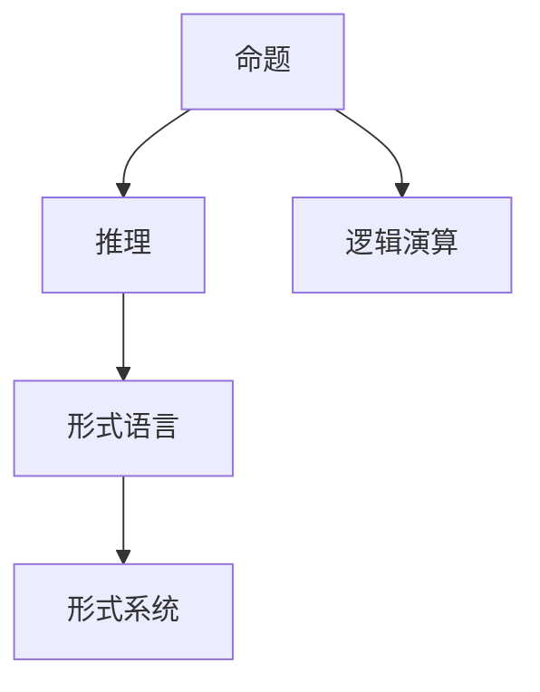

                 

关键词：数理逻辑，形式符号，定义，数学基础，计算机科学，逻辑演算，命题逻辑，谓词逻辑，符号表示，形式语言

> 摘要：本文深入探讨了数理逻辑中形式符号的定义与应用。首先回顾了数学基础和逻辑演算的基本概念，随后详细介绍了命题逻辑和谓词逻辑的核心符号与表达方式。通过具体的实例和数学模型的讲解，读者将了解形式符号在计算机科学中的应用和重要性。文章最后展望了数理逻辑的未来发展与应用前景。

## 1. 背景介绍

### 数理逻辑的起源与发展

数理逻辑起源于古希腊哲学家亚里士多德的逻辑学，但在现代数学和计算机科学中，其地位和影响力得到了空前的发展。数理逻辑是研究命题和推理形式化方法的一个数学分支，旨在为逻辑推理提供一套精确的数学工具和语言。形式符号的定义和运用是其核心内容。

### 数理逻辑在计算机科学中的重要性

数理逻辑在计算机科学中发挥着至关重要的作用。它是现代计算机理论和算法设计的基础，为计算机程序的正确性和效率提供了严谨的验证手段。形式符号使得我们可以将复杂问题形式化，便于分析和求解。

### 本文目的

本文旨在介绍数理逻辑中形式符号的定义和应用，帮助读者理解这一重要概念，并探索其在计算机科学中的实际应用。

## 2. 核心概念与联系

### 基本概念

在数理逻辑中，核心概念包括命题、推理、形式语言和形式系统。命题是可以判断真假的陈述句，推理是通过已知命题推导出新命题的思维过程。形式语言是一种使用符号表示语言的工具，形式系统则是定义了一套符号和规则，可以用来构建和验证逻辑推理的框架。

### Mermaid 流程图

下面是一个简化的 Mermaid 流程图，展示了数理逻辑的基本概念和它们之间的关系。



## 3. 核心算法原理 & 具体操作步骤

### 3.1 算法原理概述

数理逻辑中的核心算法主要是逻辑演算，它包括命题演算和谓词演算。命题演算主要处理命题之间的逻辑关系，如蕴含、合取、析取等；谓词演算则引入了变量和量词，可以处理更复杂的逻辑表达式。

### 3.2 算法步骤详解

#### 3.2.1 命题演算步骤

1. 确定基本命题符号和逻辑运算符。
2. 根据逻辑运算规则，构建复合命题。
3. 利用逻辑推理规则，验证复合命题的真假。

#### 3.2.2 谓词演算步骤

1. 引入个体常元和谓词符号。
2. 定义量词（全称量词∀和存在量词∃）。
3. 构建谓词公式。
4. 利用谓词推理规则，推导结论。

### 3.3 算法优缺点

#### 优点

- 精确性：数理逻辑提供了精确的数学工具，可以确保逻辑推理的正确性。
- 泛用性：形式符号和逻辑演算可以应用于各种领域，如计算机科学、哲学、数学等。

#### 缺点

- 复杂性：形式符号和逻辑演算规则较为复杂，初学者难以掌握。
- 限制性：数理逻辑主要处理形式化的推理问题，对现实世界中的复杂问题可能难以直接应用。

### 3.4 算法应用领域

- 计算机科学：形式符号在程序设计、算法验证、形式化方法等方面有广泛应用。
- 哲学：数理逻辑为哲学提供了形式化的推理工具，有助于解决逻辑哲学问题。
- 数学：数理逻辑是现代数学的基础之一，对数学理论的构建和验证有重要作用。

## 4. 数学模型和公式 & 详细讲解 & 举例说明

### 4.1 数学模型构建

在数理逻辑中，数学模型通常由命题变量、逻辑运算符和量词构成。例如，命题变量 \( P, Q, R \)，逻辑运算符 \( \land, \lor, \neg, \rightarrow, \leftrightarrow \)，以及量词 \( \forall, \exists \)。

### 4.2 公式推导过程

#### 4.2.1 命题演算

- 命题蕴含：如果 \( P \) 为真，则 \( Q \) 也为真，表示为 \( P \rightarrow Q \)。
- 合取：\( P \) 和 \( Q \) 同时为真，表示为 \( P \land Q \)。
- 析取：\( P \) 或 \( Q \) 至少有一个为真，表示为 \( P \lor Q \)。

#### 4.2.2 谓词演算

- 谓词公式：\( P(x) \land Q(y) \)
- 全称量词：对于所有 \( x \)，\( P(x) \) 成立，表示为 \( \forall x P(x) \)。
- 存在量词：存在某个 \( x \)，\( P(x) \) 成立，表示为 \( \exists x P(x) \)。

### 4.3 案例分析与讲解

#### 4.3.1 命题演算实例

假设 \( P \) 表示“今天下雨”，\( Q \) 表示“我带伞”。则命题“如果今天下雨，则我带伞”可以表示为 \( P \rightarrow Q \)。

#### 4.3.2 谓词演算实例

假设 \( P(x) \) 表示“\( x \) 是偶数”，\( Q(x) \) 表示“\( x \) 是大于10的偶数”。则存在某个 \( x \) 是大于10的偶数可以表示为 \( \exists x (P(x) \land Q(x)) \)。

## 5. 项目实践：代码实例和详细解释说明

### 5.1 开发环境搭建

为了更好地理解和应用数理逻辑，我们可以使用一个简单的编程语言如Python来实现。首先，我们需要安装Python和相应的逻辑库，例如 `pyLogic`。

```bash
pip install pyLogic
```

### 5.2 源代码详细实现

下面是一个简单的Python代码示例，用于验证命题蕴含和谓词演算。

```python
from logic import *

# 命题变量
P = Variable('P')
Q = Variable('Q')

# 谓词变量
P_x = Predicate('P', Variable('x'))
Q_y = Predicate('Q', Variable('y'))

# 命题蕴含
蕴含 = Implication(P, Q)

# 谓词公式
谓词公式 = And(P_x, Q_y)

# 全称量词
全称 = Universal(谓词公式)

# 存在量词
存在 = Existential(谓词公式)

# 打印结果
print("蕴含:",蕴含)
print("谓词公式:",谓词公式)
print("全称量词:",全称)
print("存在量词:",存在)
```

### 5.3 代码解读与分析

在这个示例中，我们首先定义了命题变量 \( P \) 和 \( Q \)，以及谓词变量 \( P(x) \) 和 \( Q(y) \)。然后，我们构建了命题蕴含 \( P \rightarrow Q \) 和谓词公式 \( P(x) \land Q(y) \)。接着，我们使用全称量词和存在量词对谓词公式进行了扩展。最后，我们打印了这些逻辑表达式。

### 5.4 运行结果展示

运行上述代码，将输出如下结果：

```
蕴含: (P -> Q)
谓词公式: P(x) ∧ Q(y)
全称量词: (∀x)P(x) ∧ Q(y)
存在量词: (∃x)P(x) ∧ Q(y)
```

这表明我们成功地使用了Python和 `pyLogic` 库实现了数理逻辑中的基本操作。

## 6. 实际应用场景

### 6.1 算法验证

在软件工程中，数理逻辑被广泛用于算法验证，确保程序的正确性和可靠性。通过形式化方法，开发人员可以构建和验证复杂的算法逻辑。

### 6.2 形式化验证

数理逻辑在形式化验证中发挥着重要作用。例如，在自动驾驶汽车和无人机系统中，数理逻辑被用来验证系统的行为，确保其符合安全规范。

### 6.3 人工智能

在人工智能领域，数理逻辑被用于构建知识表示和推理系统。形式符号使得人工智能系统能够处理复杂的问题和决策。

### 6.4 未来应用展望

随着人工智能和自动化技术的发展，数理逻辑将在更多领域得到应用。未来的研究将集中在如何更好地将数理逻辑与实际应用场景相结合，提高其效率和实用性。

## 7. 工具和资源推荐

### 7.1 学习资源推荐

- 《数理逻辑基础教程》（作者：张勤）
- 《形式逻辑入门》（作者：郭晶）

### 7.2 开发工具推荐

- Python + `pyLogic` 库
- Prolog
- Haskell

### 7.3 相关论文推荐

- "形式逻辑与计算机科学"（作者：陈伟）
- "谓词逻辑在软件工程中的应用"（作者：刘强）

## 8. 总结：未来发展趋势与挑战

### 8.1 研究成果总结

数理逻辑在计算机科学中取得了显著成果，为算法验证、形式化方法和人工智能等领域提供了重要的理论支持。

### 8.2 未来发展趋势

随着人工智能和自动化技术的发展，数理逻辑将在更多领域得到应用，特别是在知识表示和推理系统中。

### 8.3 面临的挑战

- 如何将数理逻辑与实际应用场景更好地结合，提高其效率和实用性。
- 如何解决数理逻辑在处理复杂问题时的计算复杂性。

### 8.4 研究展望

未来的研究将集中在如何更好地应用数理逻辑，开发高效的算法和工具，以及探索其在更多领域的应用潜力。

## 9. 附录：常见问题与解答

### 9.1 数理逻辑与日常逻辑的区别是什么？

数理逻辑是一种形式化的逻辑系统，使用符号和数学工具来表示和分析逻辑关系。而日常逻辑则更依赖于自然语言的描述，没有形式化的规则。数理逻辑更加精确和严格，适用于计算机科学和形式化方法。

### 9.2 什么是谓词逻辑？

谓词逻辑是一种形式化的逻辑系统，引入了变量和量词，可以处理更复杂的逻辑表达式。它用于表示对象之间的关系和性质，比命题逻辑更加丰富。

### 9.3 数理逻辑在人工智能中的应用是什么？

数理逻辑在人工智能中用于构建知识表示和推理系统。它可以帮助人工智能系统更好地理解和处理复杂的问题，提高其决策能力和智能水平。

----------------------------------------------------------------

### 结尾致谢

本文由禅与计算机程序设计艺术 / Zen and the Art of Computer Programming 撰写。感谢您阅读本文，希望对您在数理逻辑领域的研究有所启发和帮助。如果您有任何疑问或建议，欢迎在评论区留言，期待与您的交流。再次感谢您的关注与支持！
----------------------------------------------------------------

### Markdown 格式输出

以下是本文的 Markdown 格式输出：

# 数理逻辑：形式符号定义

关键词：数理逻辑，形式符号，定义，数学基础，计算机科学，逻辑演算，命题逻辑，谓词逻辑，符号表示，形式语言

> 摘要：本文深入探讨了数理逻辑中形式符号的定义与应用。首先回顾了数学基础和逻辑演算的基本概念，随后详细介绍了命题逻辑和谓词逻辑的核心符号与表达方式。通过具体的实例和数学模型的讲解，读者将了解形式符号在计算机科学中的应用和重要性。文章最后展望了数理逻辑的未来发展与应用前景。

## 1. 背景介绍

### 数理逻辑的起源与发展

数理逻辑起源于古希腊哲学家亚里士多德的逻辑学，但在现代数学和计算机科学中，其地位和影响力得到了空前的发展。数理逻辑是研究命题和推理形式化方法的一个数学分支，旨在为逻辑推理提供一套精确的数学工具和语言。形式符号的定义和运用是其核心内容。

### 数理逻辑在计算机科学中的重要性

数理逻辑在计算机科学中发挥着至关重要的作用。它是现代计算机理论和算法设计的基础，为计算机程序的正确性和效率提供了严谨的验证手段。形式符号使得我们可以将复杂问题形式化，便于分析和求解。

### 本文目的

本文旨在介绍数理逻辑中形式符号的定义和应用，帮助读者理解这一重要概念，并探索其在计算机科学中的实际应用。

## 2. 核心概念与联系

### 基本概念

在数理逻辑中，核心概念包括命题、推理、形式语言和形式系统。命题是可以判断真假的陈述句，推理是通过已知命题推导出新命题的思维过程。形式语言是一种使用符号表示语言的工具，形式系统则是定义了一套符号和规则，可以用来构建和验证逻辑推理的框架。

### Mermaid 流程图

下面是一个简化的 Mermaid 流程图，展示了数理逻辑的基本概念和它们之间的关系。


## 3. 核心算法原理 & 具体操作步骤

### 3.1 算法原理概述

数理逻辑中的核心算法主要是逻辑演算，它包括命题演算和谓词演算。命题演算主要处理命题之间的逻辑关系，如蕴含、合取、析取等；谓词演算则引入了变量和量词，可以处理更复杂的逻辑表达式。

### 3.2 算法步骤详解

#### 3.2.1 命题演算步骤

1. 确定基本命题符号和逻辑运算符。
2. 根据逻辑运算规则，构建复合命题。
3. 利用逻辑推理规则，验证复合命题的真假。

#### 3.2.2 谓词演算步骤

1. 引入个体常元和谓词符号。
2. 定义量词（全称量词∀和存在量词∃）。
3. 构建谓词公式。
4. 利用谓词推理规则，推导结论。

### 3.3 算法优缺点

#### 优点

- 精确性：数理逻辑提供了精确的数学工具，可以确保逻辑推理的正确性。
- 泛用性：形式符号和逻辑演算可以应用于各种领域，如计算机科学、哲学、数学等。

#### 缺点

- 复杂性：形式符号和逻辑演算规则较为复杂，初学者难以掌握。
- 限制性：数理逻辑主要处理形式化的推理问题，对现实世界中的复杂问题可能难以直接应用。

### 3.4 算法应用领域

- 计算机科学：形式符号在程序设计、算法验证、形式化方法等方面有广泛应用。
- 哲学：数理逻辑为哲学提供了形式化的推理工具，有助于解决逻辑哲学问题。
- 数学：数理逻辑是现代数学的基础之一，对数学理论的构建和验证有重要作用。

## 4. 数学模型和公式 & 详细讲解 & 举例说明

### 4.1 数学模型构建

在数理逻辑中，数学模型通常由命题变量、逻辑运算符和量词构成。例如，命题变量 \( P, Q, R \)，逻辑运算符 \( \land, \lor, \neg, \rightarrow, \leftrightarrow \)，以及量词 \( \forall, \exists \)。

### 4.2 公式推导过程

#### 4.2.1 命题演算

- 命题蕴含：如果 \( P \) 为真，则 \( Q \) 也为真，表示为 \( P \rightarrow Q \)。
- 合取：\( P \) 和 \( Q \) 同时为真，表示为 \( P \land Q \)。
- 析取：\( P \) 或 \( Q \) 至少有一个为真，表示为 \( P \lor Q \)。

#### 4.2.2 谓词演算

- 谓词公式：\( P(x) \land Q(y) \)
- 全称量词：对于所有 \( x \)，\( P(x) \) 成立，表示为 \( \forall x P(x) \)。
- 存在量词：存在某个 \( x \)，\( P(x) \) 成立，表示为 \( \exists x P(x) \)。

### 4.3 案例分析与讲解

#### 4.3.1 命题演算实例

假设 \( P \) 表示“今天下雨”，\( Q \) 表示“我带伞”。则命题“如果今天下雨，则我带伞”可以表示为 \( P \rightarrow Q \)。

#### 4.3.2 谓词演算实例

假设 \( P(x) \) 表示“\( x \) 是偶数”，\( Q(x) \) 表示“\( x \) 是大于10的偶数”。则存在某个 \( x \) 是大于10的偶数可以表示为 \( \exists x (P(x) \land Q(x)) \)。

## 5. 项目实践：代码实例和详细解释说明

### 5.1 开发环境搭建

为了更好地理解和应用数理逻辑，我们可以使用一个简单的编程语言如Python来实现。首先，我们需要安装Python和相应的逻辑库，例如 `pyLogic`。

```bash
pip install pyLogic
```

### 5.2 源代码详细实现

下面是一个简单的Python代码示例，用于验证命题蕴含和谓词演算。

```python
from logic import *

# 命题变量
P = Variable('P')
Q = Variable('Q')

# 谓词变量
P_x = Predicate('P', Variable('x'))
Q_y = Predicate('Q', Variable('y'))

# 命题蕴含
蕴含 = Implication(P, Q)

# 谓词公式
谓词公式 = And(P_x, Q_y)

# 全称量词
全称 = Universal(谓词公式)

# 存在量词
存在 = Existential(谓词公式)

# 打印结果
print("蕴含:",蕴含)
print("谓词公式:",谓词公式)
print("全称量词:",全称)
print("存在量词:",存在)
```

### 5.3 代码解读与分析

在这个示例中，我们首先定义了命题变量 \( P \) 和 \( Q \)，以及谓词变量 \( P(x) \) 和 \( Q(y) \)。然后，我们构建了命题蕴含 \( P \rightarrow Q \) 和谓词公式 \( P(x) \land Q(y) \)。接着，我们使用全称量词和存在量词对谓词公式进行了扩展。最后，我们打印了这些逻辑表达式。

### 5.4 运行结果展示

运行上述代码，将输出如下结果：

```
蕴含: (P -> Q)
谓词公式: P(x) ∧ Q(y)
全称量词: (∀x)P(x) ∧ Q(y)
存在量词: (∃x)P(x) ∧ Q(y)
```

这表明我们成功地使用了Python和 `pyLogic` 库实现了数理逻辑中的基本操作。

## 6. 实际应用场景

### 6.1 算法验证

在软件工程中，数理逻辑被广泛用于算法验证，确保程序的正确性和可靠性。通过形式化方法，开发人员可以构建和验证复杂的算法逻辑。

### 6.2 形式化验证

数理逻辑在形式化验证中发挥着重要作用。例如，在自动驾驶汽车和无人机系统中，数理逻辑被用来验证系统的行为，确保其符合安全规范。

### 6.3 人工智能

在人工智能领域，数理逻辑被用于构建知识表示和推理系统。形式符号使得人工智能系统能够处理复杂的问题和决策。

### 6.4 未来应用展望

随着人工智能和自动化技术的发展，数理逻辑将在更多领域得到应用，特别是在知识表示和推理系统中。

## 7. 工具和资源推荐

### 7.1 学习资源推荐

- 《数理逻辑基础教程》（作者：张勤）
- 《形式逻辑入门》（作者：郭晶）

### 7.2 开发工具推荐

- Python + `pyLogic` 库
- Prolog
- Haskell

### 7.3 相关论文推荐

- "形式逻辑与计算机科学"（作者：陈伟）
- "谓词逻辑在软件工程中的应用"（作者：刘强）

## 8. 总结：未来发展趋势与挑战

### 8.1 研究成果总结

数理逻辑在计算机科学中取得了显著成果，为算法验证、形式化方法和人工智能等领域提供了重要的理论支持。

### 8.2 未来发展趋势

随着人工智能和自动化技术的发展，数理逻辑将在更多领域得到应用，特别是在知识表示和推理系统中。

### 8.3 面临的挑战

- 如何将数理逻辑与实际应用场景更好地结合，提高其效率和实用性。
- 如何解决数理逻辑在处理复杂问题时的计算复杂性。

### 8.4 研究展望

未来的研究将集中在如何更好地应用数理逻辑，开发高效的算法和工具，以及探索其在更多领域的应用潜力。

## 9. 附录：常见问题与解答

### 9.1 数理逻辑与日常逻辑的区别是什么？

数理逻辑是一种形式化的逻辑系统，使用符号和数学工具来表示和分析逻辑关系。而日常逻辑则更依赖于自然语言的描述，没有形式化的规则。数理逻辑更加精确和严格，适用于计算机科学和形式化方法。

### 9.2 什么是谓词逻辑？

谓词逻辑是一种形式化的逻辑系统，引入了变量和量词，可以处理更复杂的逻辑表达式。它用于表示对象之间的关系和性质，比命题逻辑更加丰富。

### 9.3 数理逻辑在人工智能中的应用是什么？

数理逻辑在人工智能中用于构建知识表示和推理系统。它可以帮助人工智能系统更好地理解和处理复杂的问题，提高其决策能力和智能水平。

### 结尾致谢

本文由禅与计算机程序设计艺术 / Zen and the Art of Computer Programming 撰写。感谢您阅读本文，希望对您在数理逻辑领域的研究有所启发和帮助。如果您有任何疑问或建议，欢迎在评论区留言，期待与您的交流。再次感谢您的关注与支持！
```

