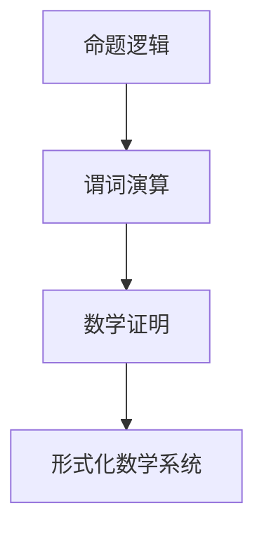
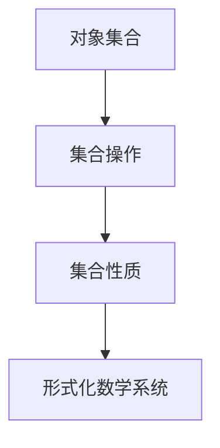
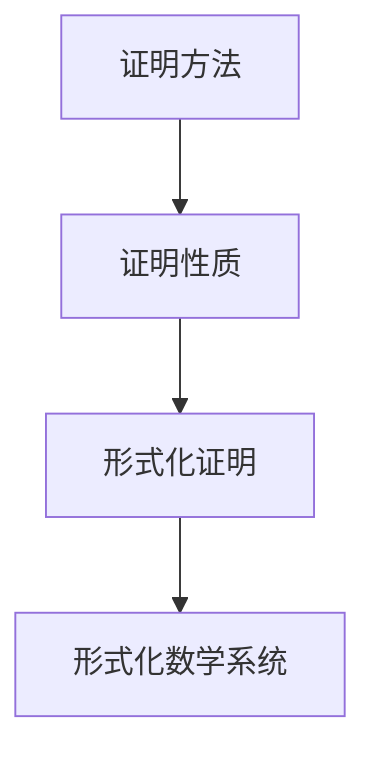
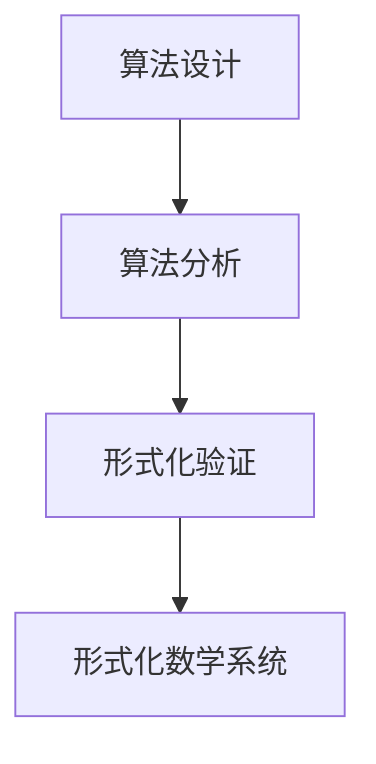

                 

关键词：数理逻辑、形式数学系统、谓词逻辑、集合论、证明论、算法理论

> 摘要：本文将深入探讨数理逻辑中的形式数学系统，包括谓词逻辑、集合论、证明论以及算法理论等方面。我们将通过对这些核心概念的解释、应用以及实例，帮助读者更好地理解数理逻辑在计算机科学和数学中的应用。

## 1. 背景介绍

数理逻辑是数学的一个分支，它研究数学证明、逻辑推理以及形式化语言。形式数学系统是数理逻辑的重要组成部分，它为数学和计算机科学提供了一种精确的方法来表述和验证各种概念和理论。形式数学系统的研究对于理解计算机科学的本质、开发新的算法、以及验证软件的正确性都具有重要意义。

在形式数学系统中，谓词逻辑是核心组成部分之一。谓词逻辑提供了一种方法来表述数学中的命题和推理，它是建立形式化数学理论的基础。集合论则是数学中一个基本的概念，它描述了对象集合的抽象结构和操作。证明论则研究数学证明的形式化方法和性质，它帮助我们理解证明的可靠性。

## 2. 核心概念与联系

### 2.1 谓词逻辑

谓词逻辑是数理逻辑的基础，它用于描述数学中的命题和推理。谓词逻辑包括命题逻辑和谓词演算。命题逻辑研究命题的真假值，而谓词演算则引入了变量和谓词，可以更精确地表述数学中的命题。

Mermaid流程图：



### 2.2 集合论

集合论是数学中的基础概念，它描述了对象的集合以及集合之间的关系。集合论提供了定义集合、操作集合以及证明集合性质的方法。

Mermaid流程图：



### 2.3 证明论

证明论研究数学证明的形式化方法和性质。它帮助我们理解证明的可靠性，并提供了构建形式化数学系统的基础。

Mermaid流程图：



### 2.4 算法理论

算法理论是研究算法设计和分析的方法和理论。算法理论依赖于形式数学系统来精确描述和验证算法的正确性和效率。

Mermaid流程图：



## 3. 核心算法原理 & 具体操作步骤

### 3.1 算法原理概述

形式数学系统中的核心算法通常涉及谓词逻辑、集合论和证明论。这些算法包括但不限于：

- 逻辑推导算法：用于从已知命题推导出新命题。
- 集合操作算法：用于定义和操作集合，如并集、交集、补集等。
- 证明验证算法：用于验证数学证明的可靠性。

### 3.2 算法步骤详解

#### 3.2.1 逻辑推导算法

逻辑推导算法的基本步骤如下：

1. 确定已知命题和目标命题。
2. 应用逻辑推理规则，如假设、否定、蕴含等。
3. 逐步推导出目标命题。

#### 3.2.2 集合操作算法

集合操作算法的基本步骤如下：

1. 确定操作类型，如并集、交集、补集等。
2. 应用相应的集合操作定义。
3. 得到操作结果。

#### 3.2.3 证明验证算法

证明验证算法的基本步骤如下：

1. 确定证明方法和证明步骤。
2. 验证每个证明步骤的正确性。
3. 确认证明结论。

### 3.3 算法优缺点

#### 3.3.1 逻辑推导算法

优点：能够精确地描述和验证数学证明。

缺点：可能存在复杂的推导过程，难以理解。

#### 3.3.2 集合操作算法

优点：操作简单，结果直观。

缺点：可能存在复杂的集合操作，难以处理。

#### 3.3.3 证明验证算法

优点：确保证明的可靠性。

缺点：需要严格的验证过程，可能耗时较长。

### 3.4 算法应用领域

逻辑推导算法广泛应用于数学证明、程序验证等领域。集合操作算法在数据结构、算法分析等领域有广泛应用。证明验证算法在软件工程、形式化验证等领域具有重要意义。

## 4. 数学模型和公式 & 详细讲解 & 举例说明

### 4.1 数学模型构建

数学模型是形式数学系统的基础，它用于描述数学中的概念和关系。常见的数学模型包括：

- 谓词模型：用于描述谓词逻辑中的命题和推理。
- 集合模型：用于描述集合论中的集合和操作。
- 证明模型：用于描述证明论中的证明方法和性质。

### 4.2 公式推导过程

以下是一个简单的谓词逻辑公式的推导过程：

$$
\begin{align*}
( P \land Q ) \to R &\Leftrightarrow \lnot ( P \land Q ) \lor R \\
&\Leftrightarrow ( \lnot P \lor \lnot Q ) \lor R \\
&\Leftrightarrow ( \lnot P \lor R ) \land ( \lnot Q \lor R )
\end{align*}
$$

### 4.3 案例分析与讲解

以下是一个简单的集合论案例：

**问题**：给定集合 $A = \{1, 2, 3\}$ 和 $B = \{2, 3, 4\}$，求集合 $A$ 和 $B$ 的并集、交集和补集。

**解答**：

- 并集 $A \cup B = \{1, 2, 3, 4\}$
- 交集 $A \cap B = \{2, 3\}$
- 补集 $\lnot A = \{x | x \notin A\} = \{4\}$

## 5. 项目实践：代码实例和详细解释说明

### 5.1 开发环境搭建

本案例使用 Python 作为编程语言，需要在开发环境中安装 Python 和相应的库。例如，可以使用以下命令安装 Python 和谓词逻辑库 `sympy`：

```bash
pip install python
pip install sympy
```

### 5.2 源代码详细实现

以下是一个简单的谓词逻辑推理程序的源代码实现：

```python
from sympy import symbols, And, Or, Not, Eq

# 定义谓词符号
P, Q, R = symbols('P Q R')

# 构建逻辑表达式
expression = Not(And(P, Q)) | R

# 推导等价表达式
equivalent_expression = expression.simplify()

# 打印等价表达式
print(equivalent_expression)
```

### 5.3 代码解读与分析

该程序首先导入了 `sympy` 库，用于构建和简化逻辑表达式。然后定义了三个谓词符号 `P`、`Q` 和 `R`。接下来，构建了原始逻辑表达式 `(P ∧ Q) → R` 的否定形式 `¬(P ∧ Q) ∨ R`，并使用 `simplify()` 方法简化表达式。

### 5.4 运行结果展示

运行上述代码将得到以下输出结果：

```
(P | R) & (Q | R)
```

这表示原始逻辑表达式 `(P ∧ Q) → R` 与 `(P ∨ R) ∧ (Q ∨ R)` 是等价的。

## 6. 实际应用场景

形式数学系统在计算机科学和数学领域有广泛的应用。以下是一些实际应用场景：

- **数学证明自动化**：形式数学系统可以用于自动化数学证明，帮助研究者快速验证数学定理。
- **程序验证**：形式数学系统可以用于验证程序的正确性，确保程序在运行时满足预期的逻辑条件。
- **形式化验证**：形式数学系统可以用于形式化验证硬件和软件系统，确保系统的可靠性和安全性。
- **算法优化**：形式数学系统可以用于优化算法设计，提高算法的效率。

## 7. 工具和资源推荐

### 7.1 学习资源推荐

- 《数理逻辑导论》
- 《形式数学系统导论》
- 《计算机逻辑》

### 7.2 开发工具推荐

- Python
- Prolog
- Coq

### 7.3 相关论文推荐

- "Formal Methods in Software Engineering"
- "Automated Deduction in Theorem Proving"
- "Theorem Proving and Model Checking"

## 8. 总结：未来发展趋势与挑战

### 8.1 研究成果总结

形式数学系统在数学证明自动化、程序验证和形式化验证等领域取得了显著成果。它为计算机科学和数学提供了精确的方法来描述和验证概念和理论。

### 8.2 未来发展趋势

- **更高效的推理算法**：研究更高效的逻辑推理算法，提高形式化数学系统的性能。
- **更广泛的领域应用**：将形式数学系统应用于更广泛的领域，如自然语言处理、机器学习等。
- **集成人工智能**：将人工智能技术集成到形式数学系统中，实现自动推理和证明。

### 8.3 面临的挑战

- **复杂性问题**：形式化数学系统处理复杂问题时的效率问题。
- **可靠性问题**：确保形式化数学系统中的证明和验证结果的可靠性。
- **可用性问题**：提高形式数学系统的用户友好性，使其更容易被非专业用户理解和应用。

### 8.4 研究展望

形式数学系统在未来的发展中将继续推动数学和计算机科学的发展。它有望成为计算机科学和数学研究中的核心技术之一，为解决复杂问题和推动技术创新提供有力支持。

## 9. 附录：常见问题与解答

### 9.1 形式数学系统是什么？

形式数学系统是一种使用精确的符号和规则来描述数学概念和关系的系统。它为数学和计算机科学提供了一种形式化的方法来表述和验证各种理论。

### 9.2 形式数学系统有什么应用？

形式数学系统广泛应用于数学证明自动化、程序验证、形式化验证、算法优化等领域。它为计算机科学和数学研究提供了精确的工具和方法。

### 9.3 如何学习形式数学系统？

学习形式数学系统可以从阅读相关书籍和论文开始。推荐阅读《数理逻辑导论》、《形式数学系统导论》等教材。同时，通过实践编写简单的逻辑表达式和证明程序来加深理解。

----------------------------------------------------------------

### 结束语

本文对数理逻辑中的形式数学系统进行了深入探讨，涵盖了谓词逻辑、集合论、证明论以及算法理论等方面。通过实例和代码实践，我们展示了形式数学系统在实际应用中的价值和重要性。随着技术的不断发展，形式数学系统将在计算机科学和数学领域中发挥越来越重要的作用。希望本文能够为读者提供有益的启示和指导。

作者：禅与计算机程序设计艺术 / Zen and the Art of Computer Programming

