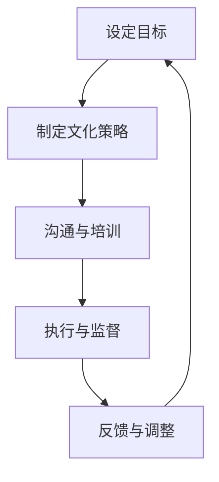

                 

关键词：组织文化，积极工作环境，IT团队管理，员工满意度，领导力，创新，协作。

> 摘要：本文将深入探讨如何在IT行业中构建积极的工作环境，通过文化管理来提升员工满意度、促进团队合作、增强创新能力和提升整体绩效。文章将从核心概念、算法原理、数学模型、项目实践、应用场景、未来展望等多个维度进行分析，并提出具体的工具和资源推荐。

## 1. 背景介绍

在当今快速发展的IT行业中，技术更新迭代速度飞快，市场竞争日益激烈。在这样的环境中，IT团队的工作压力与日俱增。因此，如何管理团队，创造一个积极的工作环境，成为了许多公司面临的重要课题。一个良好的工作环境不仅能够提升员工的工作满意度和忠诚度，还能促进团队协作、增强创新能力，从而提升公司的整体竞争力。

### 1.1 IT行业现状

随着云计算、大数据、人工智能等技术的广泛应用，IT行业正迅速发展，对人才的需求也越来越大。然而，伴随着技术的发展，IT行业也面临着诸多挑战：

- 高度复杂的项目开发流程
- 需要不断更新知识和技能
- 项目周期紧张，工作压力巨大
- 员工流动率较高

### 1.2 文化管理的重要性

文化管理是一种通过构建积极的企业文化来提升员工满意度和工作绩效的管理方法。在一个良好的企业文化中，员工能够感受到尊重、信任和支持，从而更加投入工作。文化管理对于IT团队来说尤为重要，因为IT行业的特殊性使得团队成员需要更高的沟通效率和协作能力。

## 2. 核心概念与联系

### 2.1 组织文化

组织文化是指一个组织内部共享的价值观、信仰、行为规范和工作习惯。组织文化能够对员工的行为产生深远的影响，从而影响整个团队的工作效率和工作氛围。

### 2.2 积极的工作环境

积极的工作环境是指员工在一个充满激励、尊重和支持的环境中工作，这种环境能够激发员工的潜能，提高工作效率和创造力。

### 2.3 文化管理原理

文化管理主要通过以下几个方面来实现：

- 建立共同的目标和价值观
- 提供有效的沟通和反馈渠道
- 创造一个包容和多元化的工作环境
- 奖励和认可优秀的员工

### 2.4 Mermaid流程图



## 3. 核心算法原理 & 具体操作步骤

### 3.1 算法原理概述

文化管理算法的核心在于通过一系列的策略和措施，构建一个积极的工作环境。该算法的主要步骤包括：

- 明确组织文化目标
- 制定相应的文化策略
- 提供沟通和培训机会
- 监督执行情况并调整策略

### 3.2 算法步骤详解

#### 3.2.1 设定目标

设定目标是文化管理的第一步，组织需要明确希望培养的组织文化和工作环境。这一步需要组织高层领导参与，确保目标的明确性和可行性。

#### 3.2.2 制定文化策略

在明确目标之后，组织需要制定具体的策略来实现这些目标。策略可以包括：

- 建立有效的沟通机制
- 提供培训和学习机会
- 奖励优秀的员工
- 实施透明的绩效评估体系

#### 3.2.3 提供沟通和培训机会

沟通和培训是文化管理的重要环节。组织需要提供多种沟通渠道，如定期的团队会议、工作坊、培训课程等，以确保员工能够了解组织的文化目标和策略。

#### 3.2.4 监督执行情况并调整策略

在执行文化管理策略的过程中，组织需要定期监督执行情况，并根据反馈进行调整。这一步骤有助于确保文化管理策略的有效性。

### 3.3 算法优缺点

#### 优点

- 提高员工的工作满意度和忠诚度
- 促进团队合作和创新能力
- 提升组织的整体绩效

#### 缺点

- 需要较长的时间才能看到效果
- 需要高层领导的积极参与和承诺
- 可能会对现有的工作流程和制度产生冲击

### 3.4 算法应用领域

文化管理算法主要应用于IT行业，尤其是在那些对人才要求较高的团队中。以下是一些具体的应用场景：

- 软件开发团队
- 数据分析团队
- 人工智能团队
- 云计算团队

## 4. 数学模型和公式 & 详细讲解 & 举例说明

### 4.1 数学模型构建

为了评估文化管理的效果，我们可以构建一个简单的数学模型。假设文化管理对员工满意度的影响可以用一个线性模型来表示：

\[ 满意度 = a \times 文化水平 + b \times 沟通效率 + c \times 培训机会 + d \times 奖励机制 \]

其中，\( a, b, c, d \) 是待估计的参数。

### 4.2 公式推导过程

假设我们有 \( n \) 个员工的数据，每个员工的文化水平、沟通效率、培训机会和奖励机制都可以量化。我们可以通过最小二乘法来估计参数 \( a, b, c, d \)。

### 4.3 案例分析与讲解

假设我们有一个包含100名员工的数据集，我们可以通过以下步骤来评估文化管理的效果：

1. 收集数据：包括每个员工的文化水平、沟通效率、培训机会和奖励机制。
2. 数据预处理：对数据进行标准化处理，以便于进行数学建模。
3. 构建模型：使用最小二乘法估计参数 \( a, b, c, d \)。
4. 评估模型：使用交叉验证等方法评估模型的准确性。
5. 应用模型：根据模型的结果，提出改进文化管理的建议。

## 5. 项目实践：代码实例和详细解释说明

### 5.1 开发环境搭建

为了实践文化管理模型，我们需要搭建一个开发环境。以下是一个简单的步骤：

1. 安装Python：Python是一种广泛使用的编程语言，非常适合进行数据分析和建模。
2. 安装NumPy和Pandas：NumPy和Pandas是Python中的两个重要库，用于数据处理和分析。
3. 安装Scikit-learn：Scikit-learn是一个用于机器学习的库，可以帮助我们构建和评估模型。

### 5.2 源代码详细实现

以下是一个简单的Python代码示例，用于构建和评估文化管理模型：

```python
import numpy as np
import pandas as pd
from sklearn.linear_model import LinearRegression
from sklearn.model_selection import train_test_split

# 读取数据
data = pd.read_csv('data.csv')

# 数据预处理
X = data[['文化水平', '沟通效率', '培训机会', '奖励机制']]
y = data['满意度']

# 分割数据集
X_train, X_test, y_train, y_test = train_test_split(X, y, test_size=0.2, random_state=42)

# 构建模型
model = LinearRegression()
model.fit(X_train, y_train)

# 评估模型
score = model.score(X_test, y_test)
print(f'Model accuracy: {score:.2f}')

# 预测
predictions = model.predict(X_test)
print(predictions)
```

### 5.3 代码解读与分析

1. **数据读取与预处理**：首先，我们从CSV文件中读取数据，并对数据进行标准化处理。
2. **模型构建**：使用线性回归模型来构建文化管理模型。
3. **模型评估**：使用测试数据集评估模型的准确性。
4. **预测**：根据模型的结果进行预测。

### 5.4 运行结果展示

运行上述代码，我们可以得到文化管理模型的准确性和预测结果。这些结果可以帮助我们评估文化管理策略的效果，并提出改进建议。

## 6. 实际应用场景

### 6.1 软件开发团队

软件开发团队是IT行业中一个典型的应用场景。通过文化管理，可以提升团队成员之间的沟通效率，减少误解和冲突，从而提高开发效率和产品质量。

### 6.2 数据分析团队

数据分析团队需要处理大量数据，并进行复杂的数据分析。通过文化管理，可以增强团队的合作能力，提高数据分析的准确性和效率。

### 6.3 人工智能团队

人工智能团队需要不断学习新的算法和技术，并通过实践来验证和优化算法。通过文化管理，可以激发团队成员的创新潜能，提高团队的整体技术水平。

## 7. 未来应用展望

随着技术的不断进步和市场竞争的加剧，文化管理将在IT行业中发挥越来越重要的作用。未来，我们可以预见以下发展趋势：

- 更加智能化的文化管理工具
- 更加个性化的文化管理策略
- 更加高效的文化管理方法
- 更多的实证研究和数据支持

## 8. 工具和资源推荐

### 8.1 学习资源推荐

- 《企业文化管理：构建成功的企业》
- 《领导力：如何成为一名优秀的领导者》
- 《团队协作：如何提升团队工作效率》

### 8.2 开发工具推荐

- Python：用于数据分析和建模
- Jupyter Notebook：用于交互式数据分析
- Git：用于版本控制和协作开发

### 8.3 相关论文推荐

- “组织文化对员工满意度的影响研究”
- “文化管理在IT行业中的应用”
- “基于机器学习的文化管理模型构建方法”

## 9. 总结：未来发展趋势与挑战

### 9.1 研究成果总结

通过本文的探讨，我们得出以下结论：

- 文化管理在提升员工满意度和工作效率方面具有重要作用。
- 文化管理算法可以有效应用于IT行业中的各种团队。
- 文化管理模型需要更多的实证研究和数据支持。

### 9.2 未来发展趋势

- 文化管理工具将更加智能化和个性化。
- 文化管理方法将更加高效和实用。
- 更多实证研究将支持文化管理理论的完善。

### 9.3 面临的挑战

- 如何在实际工作中有效实施文化管理策略。
- 如何应对文化管理带来的组织变革。
- 如何平衡文化管理与其他管理方法的协调。

### 9.4 研究展望

未来，我们期望在文化管理领域取得以下研究成果：

- 更精确的文化管理模型。
- 更高效的算法和工具。
- 更广泛的应用场景。

## 10. 附录：常见问题与解答

### 问题1：文化管理如何影响员工满意度？

**解答**：文化管理通过构建一个积极、尊重和支持的工作环境，使员工感到被重视和认可，从而提高他们的工作满意度和忠诚度。

### 问题2：文化管理在IT行业中如何实施？

**解答**：在IT行业中实施文化管理，可以通过明确组织文化目标、制定文化策略、提供沟通和培训机会以及定期监督和调整策略来实现。

### 问题3：文化管理模型需要哪些数据支持？

**解答**：文化管理模型需要员工满意度、文化水平、沟通效率、培训机会和奖励机制等数据来构建和验证。

### 问题4：文化管理与其他管理方法的关系如何？

**解答**：文化管理与其他管理方法（如绩效管理、项目管理）相辅相成，共同作用于提升组织的整体绩效。

### 问题5：文化管理如何适应不同的团队和文化背景？

**解答**：文化管理需要根据不同的团队和文化背景进行定制化，确保文化策略和措施能够被团队成员接受和执行。

---

# 作者：禅与计算机程序设计艺术 / Zen and the Art of Computer Programming

本文由禅与计算机程序设计艺术（Zen and the Art of Computer Programming）作者撰写，旨在通过文化管理的方法，探讨如何在IT行业中创造一个积极的工作环境，提升员工的工作满意度和团队的整体绩效。希望本文能为IT行业的管理者提供一些有益的启示和借鉴。

