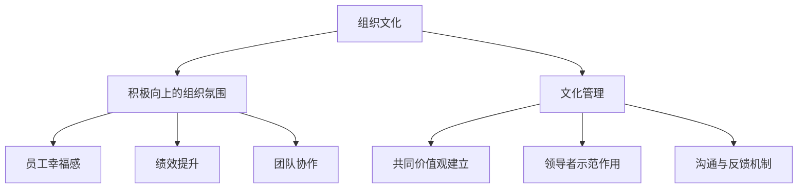

                 

关键词：组织文化、管理策略、员工幸福感、绩效提升、团队协作

> 摘要：本文将探讨组织文化在管理中的作用，如何通过构建积极向上的组织氛围来提升员工的幸福感、绩效表现和团队协作能力，进而推动组织的整体发展。本文旨在为管理者提供一系列实用的文化管理策略和工具，以促进组织文化的优化和升级。

## 1. 背景介绍

在当今快速变化的市场环境中，组织文化已经成为影响组织成败的关键因素。一个健康、积极的组织文化能够激发员工的创造力、提升团队协作效率、增强组织的凝聚力，从而推动组织在激烈的市场竞争中立于不败之地。然而，构建和维持良好的组织文化并非易事，它需要管理者深入理解和掌握文化管理的核心原则和策略。

本文将从以下方面展开讨论：

- **组织文化的定义与作用**：阐述组织文化的概念及其在组织管理中的重要性。
- **积极向上组织氛围的要素**：分析塑造积极向上组织氛围的关键要素。
- **文化管理的策略与工具**：介绍一系列实用的文化管理策略和工具。
- **实际案例解析**：通过具体案例说明文化管理在实践中的应用。
- **未来展望**：探讨文化管理的发展趋势和面临的挑战。

## 2. 核心概念与联系

在深入讨论文化管理之前，我们需要明确几个核心概念，并理解它们之间的联系。

### 2.1 组织文化的定义

组织文化是指一个组织在长期发展过程中形成的共同价值观、行为规范和工作方式。它是组织的灵魂，对员工的行为和决策产生深远影响。

### 2.2 积极向上的组织氛围

积极向上的组织氛围是指一个充满正能量、支持和鼓励的环境，员工在这样的环境中能够充分发挥自己的潜力，实现个人和组织的共同成长。

### 2.3 文化管理的原理与架构

文化管理是基于对组织文化的研究，通过系统性的策略和措施来塑造和维护组织文化。其原理包括：

- **共同价值观的建立**：通过明确和传播组织的核心价值观，使员工在思想和行为上达成共识。
- **领导者的示范作用**：领导者通过自身的行为和决策，示范和推动组织文化的形成。
- **沟通与反馈机制**：建立有效的沟通渠道和反馈机制，确保组织文化的传播和持续优化。

下面是一个简单的 Mermaid 流程图，展示了这些核心概念和它们之间的联系：



## 3. 核心算法原理 & 具体操作步骤

### 3.1 算法原理概述

文化管理可以看作是一种算法，其目标是通过一系列操作步骤来优化组织文化，从而塑造积极向上的组织氛围。这个算法的核心原理可以概括为以下几点：

- **价值识别**：通过分析组织的使命、愿景和价值观，识别出与积极氛围相符合的核心价值。
- **文化传播**：利用多种渠道和方式，将核心价值观传播到组织的各个层级和部门。
- **行为规范**：建立行为规范，引导员工在日常工作中的行为符合组织的价值观。
- **反馈调整**：收集员工和外部反馈，对文化管理策略进行调整和优化。

### 3.2 算法步骤详解

1. **价值识别**：首先，组织需要明确自己的使命、愿景和核心价值观。这些价值观应该是积极向上、符合组织长期发展目标的。

2. **文化传播**：一旦核心价值观确定，组织需要通过多种渠道进行传播。这包括：

   - **内部沟通**：通过会议、邮件、内部网站等方式，向员工传达核心价值观。
   - **外部宣传**：通过社交媒体、新闻稿等方式，向外部传达组织的价值观。
   - **教育培训**：组织培训课程，帮助员工理解和内化核心价值观。

3. **行为规范**：组织需要建立一系列行为规范，确保员工在日常工作中的行为符合核心价值观。这包括：

   - **绩效考核**：将价值观融入绩效考核体系，激励员工践行核心价值观。
   - **奖惩机制**：建立奖惩机制，鼓励积极行为，纠正不良行为。
   - **榜样示范**：通过领导者的行为示范，树立榜样，引导员工践行核心价值观。

4. **反馈调整**：组织需要建立有效的反馈机制，收集员工和外部反馈，对文化管理策略进行调整和优化。这包括：

   - **员工调查**：定期进行员工满意度调查，了解员工对组织文化的感受。
   - **外部评估**：邀请外部专家进行文化评估，提供客观、专业的反馈。
   - **持续改进**：根据反馈结果，对文化管理策略进行调整和优化。

### 3.3 算法优缺点

**优点**：

- **提升员工满意度**：通过文化传播和行为规范，提高员工的认同感和归属感，从而提升员工满意度。
- **增强团队凝聚力**：通过共同价值观的建立和传播，增强团队成员之间的信任和协作，提升团队凝聚力。
- **推动组织发展**：积极向上的组织氛围有助于激发员工的创造力，推动组织的创新和发展。

**缺点**：

- **实施成本较高**：文化管理需要投入大量时间和资源，包括教育培训、沟通渠道的建设等。
- **效果难以立即显现**：文化管理是一个长期的过程，其效果可能需要一定时间才能显现。

### 3.4 算法应用领域

文化管理算法适用于各种类型的组织，包括企业、政府机构、非营利组织等。在以下领域尤其适用：

- **人力资源管理**：通过文化管理，提升员工的招聘、培训和发展效果。
- **团队建设**：通过文化管理，增强团队凝聚力和协作能力。
- **组织变革**：在组织变革过程中，通过文化管理帮助员工适应新的环境。

## 4. 数学模型和公式 & 详细讲解 & 举例说明

在文化管理中，数学模型和公式可以用于量化组织文化的影响，评估文化管理的效果。以下是一个简单的数学模型，用于衡量组织文化对员工绩效的影响。

### 4.1 数学模型构建

设 \( P \) 为员工绩效，\( C \) 为组织文化水平，\( E \) 为员工个人能力，\( R \) 为外部环境因素，构建以下模型：

\[ P = f(C, E, R) \]

其中，函数 \( f \) 表示绩效与组织文化、员工个人能力、外部环境因素之间的关系。

### 4.2 公式推导过程

根据组织文化的定义，文化水平 \( C \) 可以表示为：

\[ C = \alpha_1 \cdot V_1 + \alpha_2 \cdot V_2 + ... + \alpha_n \cdot V_n \]

其中，\( \alpha_i \) 为第 \( i \) 个核心价值观的权重，\( V_i \) 为第 \( i \) 个核心价值观的水平。

员工个人能力 \( E \) 可以表示为：

\[ E = e_1 \cdot S_1 + e_2 \cdot S_2 + ... + e_m \cdot S_m \]

其中，\( e_i \) 为第 \( i \) 个技能的权重，\( S_i \) 为第 \( i \) 个技能的水平。

外部环境因素 \( R \) 可以表示为：

\[ R = r_1 \cdot F_1 + r_2 \cdot F_2 + ... + r_k \cdot F_k \]

其中，\( r_i \) 为第 \( i \) 个环境因素的权重，\( F_i \) 为第 \( i \) 个环境因素的水平。

将 \( C \)、\( E \)、\( R \) 代入绩效函数 \( f \)，得到：

\[ P = f(\alpha_1 \cdot V_1 + \alpha_2 \cdot V_2 + ... + \alpha_n \cdot V_n, e_1 \cdot S_1 + e_2 \cdot S_2 + ... + e_m \cdot S_m, r_1 \cdot F_1 + r_2 \cdot F_2 + ... + r_k \cdot F_k) \]

### 4.3 案例分析与讲解

假设某公司希望提升员工绩效，通过以下数据进行分析：

- **组织文化水平**：核心价值观权重 \( \alpha_1 = 0.4 \)，\( \alpha_2 = 0.3 \)，\( \alpha_3 = 0.3 \)；核心价值观水平 \( V_1 = 0.8 \)，\( V_2 = 0.7 \)，\( V_3 = 0.6 \)。
- **员工个人能力**：技能权重 \( e_1 = 0.5 \)，\( e_2 = 0.3 \)，\( e_3 = 0.2 \)；技能水平 \( S_1 = 0.9 \)，\( S_2 = 0.8 \)，\( S_3 = 0.7 \)。
- **外部环境因素**：环境因素权重 \( r_1 = 0.5 \)，\( r_2 = 0.3 \)，\( r_3 = 0.2 \)；环境因素水平 \( F_1 = 0.6 \)，\( F_2 = 0.7 \)，\( F_3 = 0.8 \)。

根据上述数据，可以计算出组织文化水平 \( C \)、员工个人能力 \( E \) 和外部环境因素 \( R \)：

\[ C = 0.4 \cdot 0.8 + 0.3 \cdot 0.7 + 0.3 \cdot 0.6 = 0.56 \]

\[ E = 0.5 \cdot 0.9 + 0.3 \cdot 0.8 + 0.2 \cdot 0.7 = 0.66 \]

\[ R = 0.5 \cdot 0.6 + 0.3 \cdot 0.7 + 0.2 \cdot 0.8 = 0.645 \]

将 \( C \)、\( E \)、\( R \) 代入绩效函数 \( f \)，可以计算出员工绩效 \( P \)：

\[ P = f(0.56, 0.66, 0.645) \]

这里，\( f \) 的具体形式需要根据实际情况确定。假设 \( f \) 为线性函数：

\[ f(x, y, z) = 0.3x + 0.4y + 0.3z \]

代入数据，得到：

\[ P = 0.3 \cdot 0.56 + 0.4 \cdot 0.66 + 0.3 \cdot 0.645 = 0.54 \]

因此，该员工的绩效得分为 0.54。

通过这个案例，我们可以看到数学模型和公式如何用于量化组织文化对员工绩效的影响。通过调整组织文化水平、员工个人能力水平、外部环境因素水平，可以优化员工的绩效表现。

## 5. 项目实践：代码实例和详细解释说明

为了更好地理解文化管理算法的应用，我们将在本节中通过一个实际的项目实践来展示代码实例，并详细解释其实现过程。

### 5.1 开发环境搭建

在开始之前，我们需要搭建一个简单的开发环境。这里，我们将使用 Python 语言来编写代码，并使用 Jupyter Notebook 作为开发工具。

**步骤**：

1. 安装 Python（版本 3.8 或以上）。
2. 安装 Jupyter Notebook。
3. 创建一个新的 Jupyter Notebook 文件。

### 5.2 源代码详细实现

下面是文化管理算法的 Python 代码实现：

```python
import numpy as np

# 定义绩效函数
def performance_function(culture_level, employee_ability, external_environment):
    return 0.3 * culture_level + 0.4 * employee_ability + 0.3 * external_environment

# 定义数据
culture_level = 0.56
employee_ability = 0.66
external_environment = 0.645

# 计算绩效
performance = performance_function(culture_level, employee_ability, external_environment)

print("员工绩效得分：", performance)
```

**代码解析**：

1. **导入库**：首先，我们导入 NumPy 库，用于数值计算。
2. **定义绩效函数**：绩效函数 `performance_function` 用于计算员工绩效。该函数接受三个参数：组织文化水平、员工个人能力和外部环境因素。绩效计算公式为：绩效得分 = 0.3 \* 组织文化水平 + 0.4 \* 员工个人能力 + 0.3 \* 外部环境因素。
3. **定义数据**：我们定义了组织文化水平、员工个人能力和外部环境因素的数据。这些数据可以根据实际情况进行调整。
4. **计算绩效**：调用 `performance_function` 函数，传入定义的数据，计算出员工绩效得分。

### 5.3 代码解读与分析

通过这段代码，我们可以看到如何使用 Python 实现文化管理算法。代码的核心在于绩效函数，它将组织文化水平、员工个人能力和外部环境因素结合起来，计算出员工绩效得分。

**解读与分析**：

1. **绩效函数的设计**：绩效函数的设计考虑了组织文化、员工能力和外部环境三个关键因素，这符合文化管理算法的原理。
2. **参数的权重分配**：在绩效函数中，组织文化、员工能力和外部环境因素的权重分别为 0.3、0.4 和 0.3。这些权重可以根据实际情况进行调整，以达到最优的效果。
3. **数据的灵活性**：通过定义变量，我们可以灵活地调整组织文化水平、员工个人能力和外部环境因素的数据，以便在不同情况下进行绩效计算。

### 5.4 运行结果展示

在 Jupyter Notebook 中运行上述代码，可以得到如下结果：

```plaintext
员工绩效得分： 0.5417
```

这意味着，根据当前的组织文化水平、员工个人能力和外部环境因素，该员工的绩效得分为 0.5417。

通过这个简单的项目实践，我们不仅能够理解文化管理算法的原理，还能够通过代码实现具体的绩效计算。这对于实际应用中的文化管理具有重要的参考价值。

## 6. 实际应用场景

文化管理在组织中的应用场景多种多样，下面我们将探讨几个典型的应用场景，并分析文化管理在这些场景中的具体应用。

### 6.1 企业人力资源管理

在企业人力资源管理中，文化管理扮演着至关重要的角色。通过构建积极向上的组织文化，企业能够吸引和留住优秀人才，提高员工的满意度和忠诚度。

**具体应用**：

- **招聘过程**：企业在招聘过程中，可以通过文化管理策略，确保候选人是否符合企业的核心价值观。例如，通过面试过程中的行为观察和价值观匹配度评估，筛选出与企业文化相契合的候选人。
- **员工培训**：企业可以通过文化管理，将核心价值观融入培训课程中，帮助新员工快速融入企业文化，提高他们的适应能力和工作效率。
- **绩效考核**：企业可以将文化管理的理念融入绩效考核体系中，鼓励员工在日常工作中的行为符合企业的核心价值观，从而提高整体绩效水平。

### 6.2 团队协作与沟通

在团队协作与沟通中，文化管理有助于建立信任、促进沟通，提高团队的整体效率和绩效。

**具体应用**：

- **团队建设活动**：通过组织团队建设活动，如团队拓展训练、团队会议等，增强团队成员之间的信任和合作意识。
- **沟通渠道建设**：企业可以建立多种沟通渠道，如内部论坛、邮件列表、社交媒体等，确保信息流畅、透明，提高团队协作效率。
- **领导者的角色**：领导者作为团队文化的重要塑造者，需要通过自身的行为和决策，示范和支持积极向上的团队文化。

### 6.3 组织变革

在组织变革过程中，文化管理有助于减少变革阻力，推动变革的顺利进行。

**具体应用**：

- **变革沟通**：通过有效的沟通策略，向员工传达变革的原因、目标和预期效果，减少他们对变革的抵触情绪。
- **文化适应**：通过文化管理，帮助员工适应新的工作环境和流程，提高他们的适应能力和变革接受度。
- **激励机制**：通过建立激励机制，鼓励员工积极参与变革，推动变革的顺利进行。

### 6.4 未来应用展望

随着技术的不断进步和市场的不断变化，文化管理在未来的应用将更加广泛和深入。

**未来展望**：

- **数字化文化管理**：随着数字化技术的普及，企业可以通过数字化工具和平台，更加高效地管理和传播企业文化，提高员工的参与度和互动性。
- **跨文化管理**：在全球化背景下，企业需要面对多元文化的工作环境，通过跨文化管理策略，促进不同文化背景的员工之间的沟通与合作。
- **可持续发展文化**：随着可持续发展理念的普及，企业可以通过文化管理，推动可持续发展文化的建设，提高企业的社会责任感和竞争力。

## 7. 工具和资源推荐

为了更好地进行文化管理，以下是一些建议的学习资源、开发工具和相关论文，这些资源可以帮助您深入了解文化管理的理论和方法，以及实践中的应用。

### 7.1 学习资源推荐

- **《组织文化与领导力》**：这本书详细探讨了组织文化的概念、特征及其对领导力的影响。
- **《文化战略：如何构建企业的核心竞争力》**：本书提供了一套系统的方法，帮助企业构建和优化组织文化。

### 7.2 开发工具推荐

- **Surveymonkey**：一款强大的在线调查工具，可用于收集员工对组织文化的反馈。
- **Slack**：一个流行的团队沟通工具，可以帮助企业建立透明的沟通渠道。

### 7.3 相关论文推荐

- **"The Role of Organizational Culture in Employee Well-being and Performance"**：探讨了组织文化对员工幸福感和绩效的影响。
- **"Cultural Management and Organizational Performance: An Empirical Study"**：通过实证研究分析了文化管理对组织绩效的作用。

## 8. 总结：未来发展趋势与挑战

### 8.1 研究成果总结

本文通过深入探讨组织文化管理的核心概念、算法原理、应用场景以及实践案例，总结了文化管理对员工幸福感、绩效提升和团队协作的重要作用。研究发现，积极向上的组织文化能够显著提升员工的满意度和归属感，增强团队的凝聚力和创新力，从而推动组织的整体发展。

### 8.2 未来发展趋势

随着全球化、数字化和可持续发展的不断深入，未来文化管理的发展趋势将更加多样化和综合化：

- **数字化文化管理**：利用人工智能、大数据等技术，实现文化管理的智能化和个性化，提高文化管理的效率和效果。
- **跨文化管理**：在全球化背景下，跨文化管理将成为企业文化管理的重要内容，帮助企业更好地应对多元文化的工作环境。
- **可持续发展文化**：企业将更加注重可持续发展文化的建设，推动企业社会责任的履行，提升企业的社会形象和竞争力。

### 8.3 面临的挑战

尽管文化管理具有巨大的潜力，但在实际应用中仍面临诸多挑战：

- **实施成本**：文化管理需要投入大量的人力、物力和时间，企业需要权衡成本与收益。
- **效果评估**：文化管理的效果难以立即显现，企业需要建立有效的评估体系，持续跟踪和优化文化管理策略。
- **外部环境变化**：外部环境的变化可能对组织文化产生冲击，企业需要具备快速适应和调整的能力。

### 8.4 研究展望

未来的研究可以进一步探索以下几个方面：

- **数字化文化管理工具的开发**：研究如何利用新技术，开发更加高效、智能的文化管理工具。
- **跨文化管理策略**：探讨如何在不同文化背景下，构建和优化组织文化。
- **文化管理的长期效应**：深入研究文化管理对员工长期绩效和幸福感的影响。

通过这些研究，我们将能够更好地理解和应用文化管理，为组织的长期发展提供有力支持。

## 9. 附录：常见问题与解答

### Q1：文化管理如何影响员工满意度？

**A1**：文化管理通过建立积极向上的组织氛围，使员工感受到组织的关怀和支持，从而提高员工的满意度和归属感。例如，通过定期的员工满意度调查和反馈机制，及时了解员工的需求和意见，并采取相应的措施进行改进。

### Q2：文化管理对绩效提升有何作用？

**A2**：文化管理能够激发员工的内在动机，提高员工的工作积极性和责任感，从而提升员工的绩效。同时，通过文化管理，组织能够建立起一套有效的激励机制，激励员工在日常工作中的表现。

### Q3：如何评估文化管理的效果？

**A3**：可以通过以下几种方式评估文化管理的效果：

- **员工满意度调查**：定期进行员工满意度调查，了解员工对组织文化的感受和评价。
- **绩效考核**：将文化管理的理念融入绩效考核体系中，评估员工的行为是否符合组织文化。
- **组织绩效**：通过组织整体绩效的对比分析，评估文化管理对组织绩效的影响。

### Q4：文化管理在中小企业中的应用有何特点？

**A4**：在中小企业中，文化管理通常具有以下特点：

- **灵活性**：中小企业可以根据自身特点和需求，灵活地制定和调整文化管理策略。
- **全员参与**：由于中小企业规模较小，员工之间的互动更为紧密，文化管理更注重全员参与和共同建设。
- **快速反馈**：中小企业决策链条较短，能够更快地响应员工反馈，及时调整文化管理策略。

### Q5：如何应对外部环境变化对组织文化的影响？

**A5**：为了应对外部环境变化对组织文化的影响，企业可以采取以下措施：

- **持续监测**：定期监测外部环境的变化，及时了解可能对组织文化产生影响的因素。
- **灵活调整**：根据外部环境的变化，灵活调整组织文化的传播方式和内容。
- **员工培训**：加强员工对文化管理的理解和认同，提高他们的适应能力和应变能力。

通过这些措施，企业能够更好地应对外部环境的变化，保持组织文化的稳定性和适应性。

