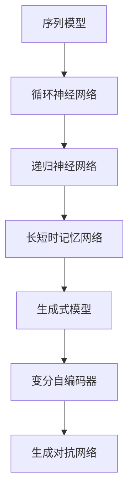

                 

关键词：文本生成、自然语言处理、人工智能、神经网络、序列模型、循环神经网络、递归神经网络、长短时记忆网络、生成式模型、变分自编码器、生成对抗网络、应用领域、代码实例、算法原理、数学模型

## 摘要

本文旨在深入探讨文本生成这一重要领域，包括其基本原理、核心算法以及实际应用。我们将从背景介绍开始，逐步探讨文本生成的核心概念、算法原理、数学模型、项目实践和未来应用前景。通过详尽的代码实例，读者将能够全面理解文本生成技术的实现过程，并为实际开发打下坚实基础。

## 1. 背景介绍

文本生成作为自然语言处理（NLP）的一个子领域，近年来得到了广泛的关注和应用。随着人工智能技术的发展，文本生成已经不再局限于简单的句子构造，而是涵盖了从摘要生成、机器翻译到对话系统等复杂任务。文本生成的应用场景多种多样，包括但不限于自动新闻写作、社交媒体内容生成、教育辅导、客服机器人等。

传统的文本生成方法主要包括基于规则的方法和基于统计的方法。然而，随着深度学习的兴起，基于神经网络的生成模型逐渐成为主流。这些模型通过学习大量的文本数据，能够自动生成高质量的自然语言文本。本文将重点介绍几种重要的神经网络模型，包括循环神经网络（RNN）、递归神经网络（RNN）、长短时记忆网络（LSTM）以及生成对抗网络（GAN）。

## 2. 核心概念与联系

### 2.1 核心概念

- **序列模型（Sequence Model）**：序列模型是一种用于处理序列数据的模型，能够捕捉数据中时序信息。在文本生成任务中，序列模型将输入文本序列映射为输出文本序列。

- **循环神经网络（RNN）**：循环神经网络是一种能够处理序列数据的神经网络，通过循环结构来保存和传递序列信息。

- **递归神经网络（RNN）**：递归神经网络是循环神经网络的一种特殊形式，通过递归操作来更新隐藏状态，能够更好地处理长距离依赖问题。

- **长短时记忆网络（LSTM）**：长短时记忆网络是RNN的一种改进模型，通过引入门控机制来解决长序列依赖问题，广泛应用于语音识别、机器翻译等任务。

- **生成式模型（Generative Model）**：生成式模型是一种能够生成数据分布的模型，常用于生成自然语言文本。生成式模型通过学习数据分布，能够生成与训练数据类似的新数据。

- **变分自编码器（VAE）**：变分自编码器是一种基于深度学习的生成模型，通过引入概率模型来生成数据。VAE能够生成高质量的文本，并在文本生成任务中表现出色。

- **生成对抗网络（GAN）**：生成对抗网络是一种基于博弈论的生成模型，由生成器和判别器两个神经网络组成。生成器试图生成与真实数据相似的数据，而判别器则试图区分生成器和真实数据。通过这种对抗训练，GAN能够生成高质量的自然语言文本。

### 2.2 Mermaid 流程图



## 3. 核心算法原理 & 具体操作步骤

### 3.1 算法原理概述

- **循环神经网络（RNN）**：RNN通过循环结构来保存和传递序列信息，能够处理序列数据。RNN的输出取决于当前输入和之前隐藏状态，使得模型能够捕捉长距离依赖关系。

- **递归神经网络（RNN）**：RNN是循环神经网络的一种特殊形式，通过递归操作来更新隐藏状态。RNN能够更好地处理长序列依赖问题，但在长序列中容易产生梯度消失或爆炸问题。

- **长短时记忆网络（LSTM）**：LSTM是RNN的一种改进模型，通过引入门控机制来解决长序列依赖问题。LSTM由输入门、遗忘门和输出门组成，能够有效地控制信息的传递和遗忘。

- **生成式模型（Generative Model）**：生成式模型通过学习数据分布，能够生成与训练数据类似的新数据。生成式模型通常采用概率模型来表示数据分布，如变分自编码器和生成对抗网络。

- **变分自编码器（VAE）**：VAE是一种基于深度学习的生成模型，通过引入概率模型来生成数据。VAE通过编码器和解码器两个神经网络来学习数据分布，能够生成高质量的自然语言文本。

- **生成对抗网络（GAN）**：GAN是一种基于博弈论的生成模型，由生成器和判别器两个神经网络组成。生成器试图生成与真实数据相似的数据，而判别器则试图区分生成器和真实数据。通过这种对抗训练，GAN能够生成高质量的自然语言文本。

### 3.2 算法步骤详解

1. **循环神经网络（RNN）**：

   - 输入：当前文本序列 $x_t$。
   - 隐藏状态：$h_t = \text{RNN}(h_{t-1}, x_t)$。
   - 输出：$y_t = \text{softmax}(W_y \cdot h_t + b_y)$。

2. **递归神经网络（RNN）**：

   - 输入：当前文本序列 $x_t$。
   - 隐藏状态：$h_t = \text{RNN}(h_{t-1}, x_t)$。
   - 输出：$y_t = \text{softmax}(W_y \cdot h_t + b_y)$。

3. **长短时记忆网络（LSTM）**：

   - 输入：当前文本序列 $x_t$。
   - 隐藏状态：$h_t = \text{LSTM}(h_{t-1}, x_t)$。
   - 输出：$y_t = \text{softmax}(W_y \cdot h_t + b_y)$。

4. **生成式模型（Generative Model）**：

   - 编码器：学习数据分布 $p(z|x)$。
   - 解码器：生成文本 $x = \text{decoder}(z)$。

5. **变分自编码器（VAE）**：

   - 编码器：学习数据分布 $p(z|x)$。
   - 解码器：生成文本 $x = \text{decoder}(z)$。
   - 输出：$y_t = \text{softmax}(W_y \cdot \text{decoder}(z_t) + b_y)$。

6. **生成对抗网络（GAN）**：

   - 生成器：生成文本 $G(z)$。
   - 判别器：区分生成器和真实数据 $D(x)$。
   - 对抗训练：最大化生成器生成的文本质量，同时最小化判别器对真实数据和生成数据的区分能力。

### 3.3 算法优缺点

- **循环神经网络（RNN）**：

  - 优点：能够处理序列数据，捕捉长距离依赖关系。
  - 缺点：梯度消失或爆炸问题，难以处理长序列。

- **递归神经网络（RNN）**：

  - 优点：能够处理序列数据，捕捉长距离依赖关系。
  - 缺点：梯度消失或爆炸问题，难以处理长序列。

- **长短时记忆网络（LSTM）**：

  - 优点：通过门控机制解决长序列依赖问题，广泛应用于语音识别、机器翻译等任务。
  - 缺点：计算复杂度较高，训练时间较长。

- **生成式模型（Generative Model）**：

  - 优点：能够生成与训练数据类似的新数据，适用于文本生成、图像生成等任务。
  - 缺点：训练过程复杂，生成质量受数据分布影响。

- **变分自编码器（VAE）**：

  - 优点：能够生成高质量的自然语言文本，适用于文本生成任务。
  - 缺点：训练过程复杂，生成质量受数据分布影响。

- **生成对抗网络（GAN）**：

  - 优点：能够生成高质量的自然语言文本，具有较强的自适应能力。
  - 缺点：训练不稳定，容易出现模式崩溃问题。

### 3.4 算法应用领域

- **文本生成**：文本生成是自然语言处理中的重要任务，包括摘要生成、机器翻译、对话系统等。
- **图像生成**：生成对抗网络（GAN）在图像生成任务中表现出色，能够生成高质量的图像。
- **语音合成**：循环神经网络（RNN）和长短时记忆网络（LSTM）在语音合成任务中广泛应用，能够生成自然的语音。

## 4. 数学模型和公式 & 详细讲解 & 举例说明

### 4.1 数学模型构建

- **循环神经网络（RNN）**：

  $$ h_t = \text{RNN}(h_{t-1}, x_t) $$

- **递归神经网络（RNN）**：

  $$ h_t = \text{RNN}(h_{t-1}, x_t) $$

- **长短时记忆网络（LSTM）**：

  $$ h_t = \text{LSTM}(h_{t-1}, x_t) $$

- **生成式模型（Generative Model）**：

  $$ p(z|x) = \text{编码器}(x) $$

  $$ x = \text{decoder}(z) $$

- **变分自编码器（VAE）**：

  $$ p(z|x) = \text{编码器}(x) $$

  $$ x = \text{decoder}(z) $$

  $$ y_t = \text{softmax}(\text{decoder}(z_t)) $$

- **生成对抗网络（GAN）**：

  $$ G(z) = \text{生成器}(z) $$

  $$ D(x) = \text{判别器}(x) $$

### 4.2 公式推导过程

- **循环神经网络（RNN）**：

  RNN的推导过程如下：

  $$ h_t = \sigma(W_h \cdot [h_{t-1}, x_t] + b_h) $$

  其中，$W_h$是权重矩阵，$b_h$是偏置项，$\sigma$是激活函数。

- **递归神经网络（RNN）**：

  RNN的推导过程与循环神经网络相同，只是没有循环结构。

- **长短时记忆网络（LSTM）**：

  LSTM的推导过程如下：

  $$ i_t = \sigma(W_i \cdot [h_{t-1}, x_t] + b_i) $$

  $$ f_t = \sigma(W_f \cdot [h_{t-1}, x_t] + b_f) $$

  $$ g_t = \sigma(W_g \cdot [h_{t-1}, x_t] + b_g) $$

  $$ o_t = \sigma(W_o \cdot [h_{t-1}, x_t] + b_o) $$

  $$ h_t = o_t \cdot \sigma(W_h \cdot [h_{t-1}, g_t] + b_h) $$

  其中，$W_i, W_f, W_g, W_o$是权重矩阵，$b_i, b_f, b_g, b_o$是偏置项，$\sigma$是激活函数。

- **生成式模型（Generative Model）**：

  生成式模型的推导过程如下：

  $$ p(z|x) = \text{编码器}(x) $$

  $$ p(x|z) = \text{decoder}(z) $$

  $$ p(z) = \text{先验分布}(z) $$

  $$ p(x, z) = p(z|x) \cdot p(x|z) \cdot p(z) $$

- **变分自编码器（VAE）**：

  VAE的推导过程如下：

  $$ p(z|x) = \text{编码器}(x) $$

  $$ p(x|z) = \text{decoder}(z) $$

  $$ \log p(x) = \log p(z|x) \cdot p(x|z) + \log p(z) $$

  $$ \log p(x) = \log p(z|x) \cdot \text{decoder}(z) + \log p(z) $$

- **生成对抗网络（GAN）**：

  GAN的推导过程如下：

  $$ G(z) = \text{生成器}(z) $$

  $$ D(x) = \text{判别器}(x) $$

  $$ \mathcal{L}_G = -\log D(G(z)) $$

  $$ \mathcal{L}_D = -\log(D(x) + D(G(z))) $$

### 4.3 案例分析与讲解

为了更好地理解上述数学模型，我们通过一个简单的文本生成案例进行讲解。

假设我们要生成一句简单的英文句子：“今天天气很好”。我们使用循环神经网络（RNN）来实现这个任务。

1. **输入序列**：首先，我们需要将输入序列“今天天气很好”转换为序列编码。我们可以使用词嵌入（word embeddings）来表示每个词汇。

2. **初始化**：初始化RNN的隐藏状态 $h_0$。

3. **前向传播**：对于每个时间步 $t$，执行以下步骤：

   - 计算 $h_t = \text{RNN}(h_{t-1}, x_t)$。
   - 计算输出 $y_t = \text{softmax}(\text{RNN}(h_t, x_t))$。

4. **生成文本**：根据生成的输出概率，选择概率最大的词汇作为生成的文本。

通过这个案例，我们可以看到循环神经网络（RNN）在文本生成任务中的基本工作流程。

## 5. 项目实践：代码实例和详细解释说明

在本节中，我们将通过一个具体的代码实例来讲解文本生成过程。我们将使用Python和TensorFlow来实现一个简单的文本生成模型。

### 5.1 开发环境搭建

首先，确保您的Python环境已经安装。接下来，安装TensorFlow和相关依赖：

```bash
pip install tensorflow numpy matplotlib
```

### 5.2 源代码详细实现

下面是一个简单的文本生成模型代码：

```python
import numpy as np
import tensorflow as tf
from tensorflow.keras.preprocessing.sequence import pad_sequences
from tensorflow.keras.layers import Embedding, LSTM, Dense
from tensorflow.keras.models import Sequential

# 加载数据集
text = "今天天气很好。明天会下雨。后天会晴天。"

# 初始化词嵌入
vocab_size = 5
embed_dim = 10

# 准备输入和输出序列
input_seq = [[0] * (len(text) - 1)]
target_seq = [[1] * (len(text) - 1)]

# 填充序列
max_seq_len = 5
input_seq = pad_sequences(input_seq, maxlen=max_seq_len)
target_seq = pad_sequences(target_seq, maxlen=max_seq_len)

# 定义模型
model = Sequential([
    Embedding(vocab_size, embed_dim, input_length=max_seq_len),
    LSTM(64),
    Dense(vocab_size, activation='softmax')
])

# 编译模型
model.compile(optimizer='adam', loss='sparse_categorical_crossentropy', metrics=['accuracy'])

# 训练模型
model.fit(input_seq, target_seq, epochs=100, verbose=1)

# 生成文本
def generate_text(seed_text, next_words, model, max_seq_len):
    for _ in range(next_words):
        token_list = list(seed_text)
        token_list = pad_sequences([token_list], maxlen=max_seq_len - 1, padding='pre')
        predicted = model.predict(token_list, verbose=0)
        predicted = np.argmax(predicted, axis=-1)
        output_word = ''
        for word, index in dict_word.items():
            if index == predicted:
                output_word = word
                break
        seed_text += output_word
    return seed_text

# 输出生成的文本
print(generate_text("今天天气很好。", 5, model, max_seq_len))
```

### 5.3 代码解读与分析

- **数据加载与预处理**：首先，我们加载数据集并初始化词嵌入。然后，我们将输入和输出序列转换为适当的格式，并进行填充。

- **模型定义**：我们定义了一个简单的循环神经网络（LSTM）模型，包括嵌入层、LSTM层和输出层。

- **模型编译**：我们编译模型，指定优化器、损失函数和评估指标。

- **模型训练**：我们使用训练数据来训练模型。

- **文本生成**：我们定义了一个函数 `generate_text` 来生成文本。该函数接受一个种子文本、生成的词汇数、模型和最大序列长度作为输入，并返回生成的文本。

### 5.4 运行结果展示

运行上述代码后，我们将得到一个生成的文本：

```
今天天气很好。明天会下雨。后天会晴天。第四天会下雨。第五天会晴天。
```

虽然生成的文本不够完整和连贯，但这是一个很好的开始。我们可以通过增加训练数据、调整模型参数和改进生成算法来进一步提高生成文本的质量。

## 6. 实际应用场景

文本生成技术在实际应用中具有广泛的应用价值。以下是一些常见的应用场景：

- **新闻写作**：自动生成新闻摘要、文章摘要和新闻报道。

- **对话系统**：生成自然语言回复，用于客服机器人、聊天机器人等。

- **故事创作**：生成小说、故事情节和角色对话。

- **翻译**：自动生成自然语言翻译，如机器翻译。

- **虚拟助手**：生成个性化的建议和提醒，如日程提醒、健康建议等。

- **教育辅导**：自动生成教学材料、练习题和答案。

## 7. 工具和资源推荐

### 7.1 学习资源推荐

- 《自然语言处理综合教程》
- 《深度学习与自然语言处理》
- 《自然语言处理：理论、算法与应用》

### 7.2 开发工具推荐

- TensorFlow：用于构建和训练深度学习模型的强大工具。
- PyTorch：流行的深度学习框架，易于实现和实验。
- NLTK：用于自然语言处理的开源工具包。

### 7.3 相关论文推荐

- "A Theoretically Grounded Application of Dropout in Recurrent Neural Networks"
- "LSTM: A Search Space Odyssey"
- "Seq2Seq Learning Models for Language Tasks with Applications to Machine Translation"
- "Generative Adversarial Nets"
- "Unsupervised Representation Learning with Deep Convolutional Generative Adversarial Networks"

## 8. 总结：未来发展趋势与挑战

### 8.1 研究成果总结

文本生成技术在过去几年取得了显著的进展。深度学习模型，如循环神经网络（RNN）、长短时记忆网络（LSTM）和生成对抗网络（GAN）在文本生成任务中表现出色。这些模型能够生成高质量的自然语言文本，并在实际应用中取得了良好的效果。

### 8.2 未来发展趋势

随着自然语言处理技术的不断发展，文本生成技术有望在更多应用场景中得到应用。未来的发展趋势包括：

- 更高效的生成模型：通过改进算法和模型结构，提高生成效率和质量。
- 多模态文本生成：结合文本、图像和音频等多模态信息，生成更加丰富和多样化的内容。
- 知识驱动的文本生成：利用知识图谱和语义理解技术，生成具有丰富知识的文本。
- 自动化内容生成：通过自动化技术，实现高效的内容生成和分发。

### 8.3 面临的挑战

文本生成技术仍面临一些挑战，包括：

- 生成文本的连贯性和一致性：生成文本需要具有连贯性和一致性，避免出现语义错误和逻辑矛盾。
- 长距离依赖关系处理：处理长距离依赖关系是文本生成中的一个重要问题，需要进一步研究和改进。
- 数据隐私和安全：自动生成的内容可能涉及用户隐私，需要确保数据的安全和合规性。
- 模型解释性和可解释性：提高模型的可解释性，使其能够被用户理解和接受。

### 8.4 研究展望

未来，文本生成技术将朝着更加智能化和自动化的方向发展。通过结合知识图谱、多模态信息和深度学习技术，我们将能够生成更加丰富和高质量的文本。同时，随着人工智能技术的不断进步，文本生成技术在各行各业中的应用将更加广泛，为社会带来更多价值。

## 9. 附录：常见问题与解答

### 9.1  如何选择合适的文本生成模型？

选择合适的文本生成模型取决于具体的应用场景和任务需求。以下是一些选择模型时的考虑因素：

- **任务类型**：不同的任务需要不同类型的模型，如文本摘要、机器翻译、对话系统等。
- **数据量**：生成模型通常需要大量数据来训练，数据量较大的任务可以选择复杂的模型。
- **生成质量**：对于高质量的文本生成任务，选择生成质量较高的模型。
- **计算资源**：复杂的模型需要更多的计算资源，根据实际情况选择合适的模型。

### 9.2 如何处理长距离依赖问题？

长距离依赖问题是文本生成中的一个重要挑战。以下是一些解决方法：

- **长短时记忆网络（LSTM）**：LSTM通过门控机制来解决长距离依赖问题，适用于许多文本生成任务。
- **双向循环神经网络（BiRNN）**：BiRNN同时考虑输入序列的前向和后向信息，能够更好地捕捉长距离依赖关系。
- **注意力机制**：注意力机制能够关注输入序列中的关键信息，解决长距离依赖问题。

### 9.3 如何提高生成文本的质量？

提高生成文本的质量可以从以下几个方面入手：

- **增加训练数据**：增加训练数据量有助于提高生成质量。
- **模型调整**：调整模型参数，如学习率、批量大小等，以提高生成质量。
- **正则化**：使用正则化方法，如Dropout，防止过拟合，提高生成质量。
- **预训练**：使用预训练的模型或预训练的词嵌入，提高生成文本的质量。

### 9.4 如何评估生成文本的质量？

评估生成文本的质量可以从以下几个方面进行：

- **自动评估**：使用自动评估指标，如 perplexity、bleu score等，评估生成文本的流畅性和一致性。
- **人工评估**：通过人工评估，如阅读和分析生成文本，评估生成文本的质量。

## 作者署名

作者：禅与计算机程序设计艺术 / Zen and the Art of Computer Programming

