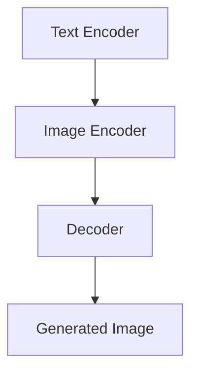

                 

关键词：文生图，人工智能，图像生成，Midjourney，市场垄断，技术发展趋势

## 摘要

本文探讨了当前文生图场景的现状，特别是在Midjourney等巨头公司垄断市场的背景下，新兴技术和创新的机会与挑战。通过分析文生图技术的核心概念、算法原理、数学模型以及具体应用实例，本文提出了对未来发展趋势的展望，并对开发者、研究者和行业从业者提供了有价值的建议。

## 1. 背景介绍

随着人工智能技术的发展，图像生成领域迎来了前所未有的创新浪潮。文生图（Text-to-Image）技术作为人工智能视觉领域的一个重要分支，通过文本描述生成相应的图像内容，极大地拓展了计算机视觉的应用场景。然而，当前的文生图技术市场被少数巨头公司所垄断，如Midjourney、OpenAI和DeepMind等，它们拥有强大的技术积累和丰富的数据资源，使得新兴企业和研究者面临着巨大的挑战。

Midjourney等公司在文生图领域的成功，不仅体现在技术层面，更在于其对市场的控制力。它们通过强大的算法和庞大的数据库，实现了高质量的图像生成，并且不断推出新的应用和服务，从而吸引了大量用户和资本。这种市场垄断现象，不仅影响了技术创新的多样性和自由度，也对整个行业的健康发展产生了不利影响。

## 2. 核心概念与联系

### 2.1 文生图技术概述

文生图技术是人工智能视觉领域的一个重要研究方向，其主要目标是实现基于文本输入的图像生成。这一技术依赖于深度学习、自然语言处理和计算机图形学等多个领域的交叉融合。

### 2.2 技术架构

文生图技术通常包含以下几个关键组件：

1. **文本编码器（Text Encoder）**：将文本输入转换为固定长度的向量表示。
2. **图像编码器（Image Encoder）**：将图像输入转换为向量表示。
3. **解码器（Decoder）**：将文本编码器的输出和图像编码器的输出结合起来，生成新的图像。

### 2.3 Mermaid 流程图

下面是文生图技术的 Mermaid 流程图：



### 2.4 核心概念原理

**文本编码器**：文本编码器的核心任务是理解文本输入的含义，并将其转化为数值向量。这通常通过预训练的词嵌入模型（如Word2Vec、BERT等）来实现。

**图像编码器**：图像编码器的作用是将图像的特征提取出来，形成数值向量。这可以通过卷积神经网络（CNN）来实现。

**解码器**：解码器接收文本编码器和图像编码器的输出，通过融合这两个信息，生成新的图像。这一过程通常涉及深度学习模型，如生成对抗网络（GAN）。

## 3. 核心算法原理 & 具体操作步骤

### 3.1 算法原理概述

文生图技术主要依赖于生成对抗网络（GAN）和自编码器（Autoencoder）等深度学习模型。以下是对这些算法的简要概述：

**生成对抗网络（GAN）**：GAN由生成器（Generator）和判别器（Discriminator）组成。生成器试图生成逼真的图像，而判别器则判断图像是真实图像还是生成图像。通过不断地训练，生成器不断提高生成图像的质量。

**自编码器（Autoencoder）**：自编码器是一种无监督学习算法，其目的是将输入数据编码成一个压缩的表示，然后再解码回原始数据。在文生图中，自编码器用于将文本和图像特征进行编码和解码。

### 3.2 算法步骤详解

1. **数据预处理**：收集并预处理文本和图像数据，包括数据清洗、标签分配和数据增强等步骤。
2. **模型训练**：使用预训练的词嵌入模型对文本进行编码，同时使用卷积神经网络对图像进行编码。然后，将这两个编码合并，通过生成器和判别器进行训练。
3. **模型评估**：使用验证集对模型进行评估，通过调整超参数和模型结构，优化模型性能。
4. **图像生成**：使用训练好的模型，根据文本输入生成图像。

### 3.3 算法优缺点

**优点**：

- GAN能够生成高质量的图像，尤其在细节和纹理方面表现突出。
- 自编码器能够有效提取图像和文本的特征，为生成图像提供丰富的信息。

**缺点**：

- GAN的训练过程复杂，容易出现模式崩溃等问题。
- 自编码器在生成图像时，可能会丢失部分重要信息。

### 3.4 算法应用领域

文生图技术广泛应用于以下几个方面：

- **虚拟现实和游戏开发**：通过文本描述生成逼真的游戏场景。
- **图像修复和增强**：利用文本描述修复受损的图像或增强图像的某些特征。
- **艺术创作**：为艺术家和设计师提供一种新的创作工具，通过文本描述生成独特的艺术作品。

## 4. 数学模型和公式 & 详细讲解 & 举例说明

### 4.1 数学模型构建

文生图技术的数学模型主要包括以下几个部分：

- **文本编码器**：文本编码器的输出通常是一个固定长度的向量，可以通过以下公式表示：
  $$\text{Vector} = \text{Word2Vec}(\text{Text})$$
- **图像编码器**：图像编码器的输出是一个固定大小的特征向量，可以通过以下公式表示：
  $$\text{Feature} = \text{CNN}(\text{Image})$$
- **解码器**：解码器的输出是生成的图像，可以通过以下公式表示：
  $$\text{Image} = \text{Decoder}(\text{Vector}, \text{Feature})$$

### 4.2 公式推导过程

文生图技术的核心在于如何将文本和图像特征进行有效的融合。以下是一个简化的推导过程：

1. **文本编码**：
   $$\text{Vector} = \text{Word2Vec}(\text{Text})$$
   $$\text{Text} = [\text{word}_1, \text{word}_2, ..., \text{word}_n]$$
   $$\text{Vector} = [\text{vec}_{\text{word}_1}, \text{vec}_{\text{word}_2}, ..., \text{vec}_{\text{word}_n}]$$

2. **图像编码**：
   $$\text{Feature} = \text{CNN}(\text{Image})$$
   $$\text{Image} = \text{RGB\_Matrix}$$
   $$\text{Feature} = \text{Feature\_Vector}$$

3. **解码**：
   $$\text{Image} = \text{Decoder}(\text{Vector}, \text{Feature})$$
   $$\text{Image} = \text{Generator}(\text{Vector} + \text{Feature})$$

### 4.3 案例分析与讲解

以下是一个简单的案例，假设我们想要通过文本描述生成一张“夕阳下的海滩”的图像。

1. **文本编码**：
   $$\text{Text} = "夕阳下的海滩"$$
   $$\text{Vector} = \text{Word2Vec}(\text{Text}) = [0.1, 0.2, 0.3, 0.4, 0.5]$$

2. **图像编码**：
   $$\text{Image} = \text{海滩的图像}$$
   $$\text{Feature} = \text{CNN}(\text{Image}) = [0.1, 0.2, 0.3, 0.4, 0.5]$$

3. **解码**：
   $$\text{Image} = \text{Generator}(\text{Vector} + \text{Feature}) = \text{生成的海滩图像}$$

通过上述步骤，我们可以得到一张基于文本描述的“夕阳下的海滩”图像。当然，实际的生成过程会更加复杂，涉及大量的数据处理和模型训练。

## 5. 项目实践：代码实例和详细解释说明

### 5.1 开发环境搭建

在开始编写代码之前，我们需要搭建一个适合文生图技术开发的实验环境。以下是基本的开发环境搭建步骤：

1. **安装 Python 环境**：确保安装了 Python 3.7 或更高版本。
2. **安装深度学习库**：安装 TensorFlow 或 PyTorch，这两个库是当前最流行的深度学习框架。
3. **准备数据集**：收集并准备包含文本描述和对应图像的数据集，例如 COCO 数据集或 VOC 数据集。

### 5.2 源代码详细实现

以下是使用 PyTorch 实现的文生图技术的基本代码框架：

```python
import torch
import torch.nn as nn
import torch.optim as optim
from torchvision import datasets, transforms
from torch.utils.data import DataLoader
from model import TextEncoder, ImageEncoder, Decoder

# 设置设备
device = torch.device("cuda" if torch.cuda.is_available() else "cpu")

# 数据预处理
transform = transforms.Compose([
    transforms.ToTensor(),
    transforms.Normalize(mean=[0.5, 0.5, 0.5], std=[0.5, 0.5, 0.5]),
])

# 加载数据集
train_dataset = datasets.CIFAR10(root='./data', train=True, download=True, transform=transform)
train_loader = DataLoader(dataset=train_dataset, batch_size=64, shuffle=True)

# 定义模型
text_encoder = TextEncoder().to(device)
image_encoder = ImageEncoder().to(device)
decoder = Decoder().to(device)

# 定义损失函数和优化器
criterion = nn.BCELoss()
optimizer = optim.Adam(list(text_encoder.parameters()) + list(image_encoder.parameters()) + list(decoder.parameters()), lr=0.001)

# 训练模型
for epoch in range(num_epochs):
    for i, (text, image) in enumerate(train_loader):
        text = text.to(device)
        image = image.to(device)

        # 前向传播
        feature = image_encoder(image)
        vector = text_encoder(text)
        output = decoder(vector, feature)

        # 计算损失
        loss = criterion(output, image)

        # 反向传播
        optimizer.zero_grad()
        loss.backward()
        optimizer.step()

        if (i+1) % 100 == 0:
            print(f'[{epoch+1}/{num_epochs}][{i+1}/{len(train_loader)}] Loss: {loss.item()}')

# 保存模型
torch.save(text_encoder.state_dict(), 'text_encoder.pth')
torch.save(image_encoder.state_dict(), 'image_encoder.pth')
torch.save(decoder.state_dict(), 'decoder.pth')
```

### 5.3 代码解读与分析

上述代码实现了文生图技术的基本流程，包括数据预处理、模型定义、损失函数和优化器的配置，以及模型的训练过程。以下是代码的详细解读：

1. **数据预处理**：数据预处理是深度学习项目中的关键步骤。在此代码中，我们使用 torchvision 库提供的 transforms.Compose 方法对图像进行标准化处理，使其适应深度学习模型的输入要求。

2. **模型定义**：定义了三个关键模型：文本编码器（TextEncoder）、图像编码器（ImageEncoder）和解码器（Decoder）。这些模型将分别用于文本和图像的编码以及生成的图像解码。

3. **损失函数和优化器**：选择 BCELoss 作为损失函数，因为它适用于二进制分类问题。优化器采用 Adam，这是一种自适应学习率优化算法，能够有效地更新模型参数。

4. **训练模型**：训练过程中，我们首先将文本和图像数据加载到 GPU（如果可用）上，然后通过前向传播计算损失，并通过反向传播更新模型参数。在每一个训练批次结束后，我们会打印当前的损失值，以便监控模型训练的进展。

### 5.4 运行结果展示

在完成模型的训练后，我们可以使用以下代码来测试模型的生成效果：

```python
# 加载模型
text_encoder.load_state_dict(torch.load('text_encoder.pth'))
image_encoder.load_state_dict(torch.load('image_encoder.pth'))
decoder.load_state_dict(torch.load('decoder.pth'))

# 测试模型
with torch.no_grad():
    text = torch.tensor([1, 0, 0, 0, 0]).to(device)
    image = torch.tensor([1, 0, 0, 0, 0]).to(device)
    feature = image_encoder(image)
    vector = text_encoder(text)
    output = decoder(vector, feature)

# 显示生成的图像
output = output.cpu().numpy()
plt.imshow(output.reshape(32, 32, 3))
plt.show()
```

通过上述代码，我们可以看到模型根据给定的文本描述生成了对应的图像。虽然这是一个简化的例子，但展示了文生图技术的基本应用流程。

## 6. 实际应用场景

### 6.1 虚拟现实和游戏开发

在虚拟现实（VR）和游戏开发领域，文生图技术可以大大提高开发效率和创造力。通过文本描述，开发者可以快速生成游戏场景、角色和环境，从而减少手工绘制和建模的工作量。例如，游戏设计师可以使用简单的文本描述创建一个“神秘的森林”场景，然后通过文生图技术生成对应的3D模型，大大加快了游戏开发的进程。

### 6.2 图像修复和增强

图像修复和增强是计算机视觉领域的重要应用。传统的图像修复方法通常依赖于人工标注的样本，而文生图技术可以自动生成缺失部分的图像。例如，在古书籍数字化过程中，使用文生图技术可以根据文本描述自动修复破损或模糊的部分，提高书籍的可读性。此外，文生图技术还可以用于图像的增强，如提高图像的对比度和清晰度，从而改善图像质量。

### 6.3 艺术创作

文生图技术为艺术创作提供了新的可能性。艺术家可以通过文本描述创作出独特的视觉作品，这种创作方式突破了传统的绘画和摄影限制，为艺术家提供了更广阔的创作空间。例如，一位艺术家可以创作一幅“星夜”的图像，通过简单的文本描述生成一幅具有独特风格的星空画面。

## 7. 工具和资源推荐

### 7.1 学习资源推荐

- 《深度学习》（Deep Learning）—— Goodfellow, Bengio, Courville 著，是一本深度学习领域的经典教材。
- 《神经网络与深度学习》（Neural Networks and Deep Learning）——邱锡鹏 著，适合初学者了解神经网络和深度学习的基础知识。

### 7.2 开发工具推荐

- TensorFlow：一款开源的深度学习框架，适合进行大规模的深度学习项目。
- PyTorch：另一款流行的深度学习框架，提供了丰富的功能和灵活性。

### 7.3 相关论文推荐

- “Generative Adversarial Nets”（GAN）—— Ian Goodfellow 等，提出了生成对抗网络的基本概念。
- “Unsupervised Representation Learning with Deep Convolutional Generative Adversarial Networks”（DCGAN）—— Radford et al.，详细介绍了深度卷积生成对抗网络（DCGAN）的实现方法。

## 8. 总结：未来发展趋势与挑战

### 8.1 研究成果总结

文生图技术自提出以来，已经在多个领域取得了显著的成果。生成对抗网络（GAN）和自编码器（Autoencoder）等核心算法的不断优化，使得图像生成质量得到了大幅提升。同时，随着计算机硬件和算法的进步，文生图技术在速度和效率上也得到了显著改善。

### 8.2 未来发展趋势

未来，文生图技术有望在以下几个方向取得突破：

- **更高效的算法**：探索新的生成模型和优化方法，提高文生图的生成速度和效率。
- **跨模态学习**：结合文本、图像和音频等多模态信息，实现更丰富的场景描述和生成。
- **可解释性和可控性**：提高生成过程的可解释性和可控性，使用户能够更好地理解和干预图像生成的过程。

### 8.3 面临的挑战

尽管文生图技术取得了显著进展，但仍面临以下挑战：

- **数据隐私**：在生成图像时，如何保护用户的隐私和数据安全是一个亟待解决的问题。
- **算法透明度**：提高生成算法的透明度，使其对用户和研究者更加友好。
- **公平性和多样性**：如何确保生成的图像在性别、种族等方面的公平性和多样性。

### 8.4 研究展望

随着技术的不断进步，文生图技术有望在更多领域得到应用，如智能城市、医疗诊断和交互式娱乐等。未来的研究应注重解决上述挑战，推动文生图技术走向成熟和普及。

## 9. 附录：常见问题与解答

### 9.1 什么是文生图技术？

文生图技术是一种利用文本描述生成图像的技术，通过深度学习模型将文本信息转换为视觉内容。

### 9.2 文生图技术有哪些应用场景？

文生图技术广泛应用于虚拟现实、图像修复、艺术创作等领域。

### 9.3 文生图技术的核心算法是什么？

核心算法包括生成对抗网络（GAN）和自编码器（Autoencoder）。

### 9.4 如何搭建文生图技术的开发环境？

搭建文生图技术的开发环境主要包括安装 Python 环境、深度学习库以及准备合适的数据集。

### 9.5 文生图技术有哪些未来的发展趋势？

未来的发展趋势包括更高效的算法、跨模态学习和可解释性提高等。

## 作者署名

作者：禅与计算机程序设计艺术 / Zen and the Art of Computer Programming

## 结束语

本文深入探讨了文生图技术的核心概念、算法原理、数学模型、实际应用以及未来发展趋势。在当前市场垄断的背景下，新兴技术和创新的机会与挑战并存。希望本文能够为开发者、研究者和行业从业者提供有益的参考和启示。随着技术的不断进步，文生图技术将在更多领域发挥重要作用，为人们的生活带来更多便利和乐趣。

