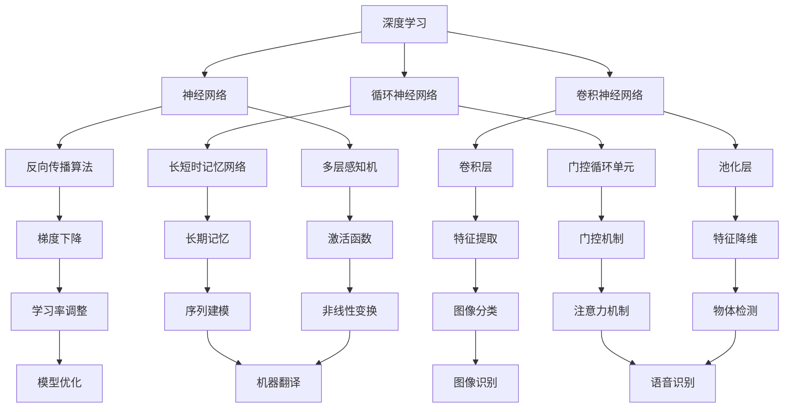

                 

关键词：新一代AI技术、应用场景、深度学习、自然语言处理、计算机视觉、智能推荐、自动驾驶

摘要：本文将探讨新一代AI技术的应用场景，分析其在深度学习、自然语言处理、计算机视觉等领域的创新与发展。通过实例和案例分析，本文旨在展示AI技术在各个行业中的实际应用，并展望其未来发展趋势与挑战。

## 1. 背景介绍

近年来，人工智能（AI）技术取得了显著的进展，尤其是深度学习、自然语言处理和计算机视觉等领域。这些技术已经成为推动各行各业发展的关键力量。深度学习通过神经网络模型模拟人类大脑处理信息的方式，实现了图像识别、语音识别等任务的自动化；自然语言处理则使得机器能够理解和生成人类语言，为智能客服、机器翻译等应用提供了基础；计算机视觉技术的突破，使得机器人能够更好地理解和交互现实世界。

本文将重点探讨这些新一代AI技术在各个领域的应用场景，分析其核心概念、算法原理、数学模型以及实践案例。同时，还将探讨AI技术在实际应用中面临的挑战和未来发展趋势。

### 1.1 深度学习在图像识别中的应用

深度学习在图像识别领域取得了显著的成就。通过卷积神经网络（CNN）等模型，深度学习能够自动提取图像特征，实现高精度的图像分类和物体检测。如图1所示，CNN通过多个卷积层和池化层，逐步提取图像的局部特征，最终输出分类结果。


### 1.2 自然语言处理在机器翻译中的应用

自然语言处理（NLP）技术使得机器能够理解和生成人类语言。基于循环神经网络（RNN）和注意力机制的序列到序列（Seq2Seq）模型，NLP技术实现了高精度的机器翻译。如图2所示，Seq2Seq模型通过编码器和解码器，将源语言序列映射为目标语言序列，实现了跨语言信息的传递。


### 1.3 计算机视觉在自动驾驶中的应用

计算机视觉技术为自动驾驶提供了关键的支持。通过摄像头、激光雷达等传感器，自动驾驶系统能够实时感知和解析周围环境，实现车辆的运动控制和导航。如图3所示，自动驾驶系统通过深度学习模型，对图像进行目标检测和路径规划，实现了安全、可靠的自动驾驶。


## 2. 核心概念与联系

为了更好地理解新一代AI技术的应用场景，我们需要先掌握一些核心概念和联系。以下是一个使用Mermaid绘制的流程图，展示了深度学习、自然语言处理和计算机视觉的核心概念及其之间的联系。



### 2.1 核心概念解释

- **深度学习**：一种基于多层神经网络的机器学习方法，通过逐层提取特征，实现复杂问题的建模。
- **神经网络**：一种由大量神经元组成的计算模型，通过调整神经元之间的连接权重，实现函数逼近和模式识别。
- **卷积神经网络（CNN）**：一种专门用于图像识别的神经网络模型，通过卷积层和池化层，提取图像的局部特征。
- **循环神经网络（RNN）**：一种用于序列数据的神经网络模型，通过循环结构，实现对序列中前后信息的依赖关系建模。
- **自然语言处理（NLP）**：一种将计算机科学和语言学相结合的领域，旨在使计算机理解和生成人类语言。
- **计算机视觉**：一种利用图像处理、模式识别和机器学习技术，使计算机能够理解视觉信息的技术。

## 3. 核心算法原理 & 具体操作步骤

### 3.1 算法原理概述

新一代AI技术的核心在于其算法原理，这些算法通常基于神经网络和深度学习技术。以下分别介绍深度学习、自然语言处理和计算机视觉的核心算法原理。

### 3.2 算法步骤详解

#### 3.2.1 深度学习

深度学习的核心是构建多层神经网络，通过逐层提取特征，实现复杂问题的建模。以下是深度学习的基本步骤：

1. **数据预处理**：对输入数据进行清洗、归一化等预处理操作。
2. **构建模型**：选择合适的神经网络架构，如卷积神经网络（CNN）、循环神经网络（RNN）等。
3. **训练模型**：通过反向传播算法，调整神经网络中的权重，使其达到预定的性能指标。
4. **评估模型**：使用验证集和测试集评估模型的性能，调整模型参数。
5. **应用模型**：将训练好的模型应用于实际问题，如图像分类、物体检测等。

#### 3.2.2 自然语言处理

自然语言处理的核心是使计算机理解和生成人类语言。以下是自然语言处理的基本步骤：

1. **分词**：将文本拆分成词语或短语。
2. **词性标注**：对词语进行词性标注，如名词、动词、形容词等。
3. **词向量表示**：将词语映射为高维向量，如Word2Vec、GloVe等。
4. **构建模型**：选择合适的神经网络架构，如循环神经网络（RNN）、长短时记忆网络（LSTM）、门控循环单元（GRU）等。
5. **训练模型**：通过序列到序列（Seq2Seq）模型或注意力机制等，实现文本生成或翻译。
6. **评估模型**：使用验证集和测试集评估模型的性能，调整模型参数。
7. **应用模型**：将训练好的模型应用于实际问题，如机器翻译、智能客服等。

#### 3.2.3 计算机视觉

计算机视觉的核心是使计算机能够理解和处理视觉信息。以下是计算机视觉的基本步骤：

1. **图像预处理**：对图像进行缩放、裁剪、增强等预处理操作。
2. **特征提取**：通过卷积神经网络（CNN）等，提取图像的局部特征。
3. **目标检测**：使用深度学习模型，对图像中的目标进行定位和分类。
4. **路径规划**：基于目标检测结果，实现路径规划，如自动驾驶中的路径规划。
5. **评估模型**：使用验证集和测试集评估模型的性能，调整模型参数。
6. **应用模型**：将训练好的模型应用于实际问题，如自动驾驶、人脸识别等。

### 3.3 算法优缺点

#### 深度学习

**优点**：

- 高效：通过多层神经网络，深度学习能够自动提取特征，实现复杂问题的建模。
- 准确：深度学习模型在图像识别、语音识别等任务上，取得了显著的准确率提升。

**缺点**：

- 数据依赖：深度学习模型对大量高质量数据有很强的依赖性。
- 计算资源消耗：训练深度学习模型需要大量的计算资源和时间。

#### 自然语言处理

**优点**：

- 灵活：自然语言处理技术能够处理不同类型的文本任务，如机器翻译、情感分析等。
- 实用：自然语言处理技术在智能客服、智能助手等应用中具有广泛的应用。

**缺点**：

- 语义理解难度：自然语言处理技术难以完全理解复杂的语义关系。
- 语料依赖：自然语言处理模型的性能很大程度上依赖于高质量的语料库。

#### 计算机视觉

**优点**：

- 实时性：计算机视觉技术能够实时处理视觉信息，如自动驾驶中的路径规划。
- 高精度：计算机视觉技术在图像识别、物体检测等任务上，取得了较高的准确率。

**缺点**：

- 数据采集难度：计算机视觉数据采集需要大量的传感器和设备。
- 需要大量标注：计算机视觉模型的训练需要大量标注数据。

### 3.4 算法应用领域

深度学习、自然语言处理和计算机视觉技术在各个领域都有广泛的应用。以下分别介绍这些技术的应用领域。

#### 深度学习

- **图像识别**：深度学习技术在图像识别任务中取得了显著的成果，如人脸识别、物体检测等。
- **语音识别**：深度学习技术在语音识别任务中，通过自动提取语音特征，实现了高精度的语音识别。
- **自然语言处理**：深度学习技术在自然语言处理领域，通过构建复杂的神经网络模型，实现了文本分类、机器翻译等任务。
- **推荐系统**：深度学习技术在推荐系统中，通过用户行为数据的分析，实现了个性化推荐。

#### 自然语言处理

- **机器翻译**：自然语言处理技术在机器翻译领域，通过序列到序列（Seq2Seq）模型，实现了跨语言信息的传递。
- **情感分析**：自然语言处理技术在情感分析任务中，通过分析文本的情感倾向，实现了对用户情绪的识别。
- **智能客服**：自然语言处理技术在智能客服领域，通过理解用户的问题，实现自动回复和智能咨询。
- **文本生成**：自然语言处理技术在文本生成任务中，通过生成对抗网络（GAN）等，实现了自动写作和创意生成。

#### 计算机视觉

- **自动驾驶**：计算机视觉技术在自动驾驶领域，通过摄像头、激光雷达等传感器，实现了车辆的运动控制和导航。
- **人脸识别**：计算机视觉技术通过人脸检测和特征提取，实现了对人脸的识别和验证。
- **图像分割**：计算机视觉技术在图像分割任务中，通过深度学习模型，实现了图像中目标的准确分割。
- **医疗影像分析**：计算机视觉技术在医疗影像分析领域，通过图像识别和特征提取，实现了疾病诊断和筛查。

## 4. 数学模型和公式 & 详细讲解 & 举例说明

### 4.1 数学模型构建

在深度学习、自然语言处理和计算机视觉中，数学模型是算法的核心。以下分别介绍这些领域的数学模型构建。

#### 4.1.1 深度学习

深度学习的数学模型主要基于多层感知机（MLP）、卷积神经网络（CNN）和循环神经网络（RNN）。

- **多层感知机（MLP）**：

  MLP是一种前馈神经网络，由输入层、隐藏层和输出层组成。输入层接收外部输入，隐藏层通过加权求和和激活函数，产生输出，输出层输出最终结果。

  $$ z = \sum_{i=1}^{n} w_{i}x_{i} + b $$

  $$ a = f(z) $$

  其中，$z$表示加权求和结果，$w_{i}$表示权重，$x_{i}$表示输入，$b$表示偏置，$f$表示激活函数，如ReLU、Sigmoid、Tanh等。

- **卷积神经网络（CNN）**：

  CNN是一种用于图像识别的神经网络，通过卷积层、池化层和全连接层，实现图像特征的提取和分类。

  $$ h_{ij} = \sum_{k=1}^{m} w_{ik}x_{kj} + b $$

  $$ a = f(h_{ij}) $$

  其中，$h_{ij}$表示卷积结果，$w_{ik}$表示卷积核，$x_{kj}$表示输入，$b$表示偏置，$f$表示激活函数。

- **循环神经网络（RNN）**：

  RNN是一种用于序列数据的神经网络，通过循环结构，实现对序列中前后信息的依赖关系建模。

  $$ h_{t} = \sigma(W_{h}h_{t-1} + W_{x}x_{t} + b_{h}) $$

  $$ y_{t} = \sigma(W_{y}h_{t} + b_{y}) $$

  其中，$h_{t}$表示隐藏状态，$x_{t}$表示输入，$y_{t}$表示输出，$W_{h}$、$W_{x}$、$W_{y}$表示权重矩阵，$b_{h}$、$b_{y}$表示偏置，$\sigma$表示激活函数。

#### 4.1.2 自然语言处理

自然语言处理的数学模型主要基于词向量、循环神经网络（RNN）和长短时记忆网络（LSTM）。

- **词向量**：

  词向量是将词语映射为高维向量的一种方法，如Word2Vec、GloVe等。

  $$ \vec{w}_{i} = \sum_{j=1}^{v} \alpha_{ij} \vec{e}_{j} $$

  其中，$\vec{w}_{i}$表示词向量，$\alpha_{ij}$表示词频，$\vec{e}_{j}$表示基向量。

- **循环神经网络（RNN）**：

  RNN是一种用于序列数据的神经网络，通过循环结构，实现对序列中前后信息的依赖关系建模。

  $$ h_{t} = \sigma(W_{h}h_{t-1} + W_{x}x_{t} + b_{h}) $$

  $$ y_{t} = \sigma(W_{y}h_{t} + b_{y}) $$

  其中，$h_{t}$表示隐藏状态，$x_{t}$表示输入，$y_{t}$表示输出，$W_{h}$、$W_{x}$、$W_{y}$表示权重矩阵，$b_{h}$、$b_{y}$表示偏置，$\sigma$表示激活函数。

- **长短时记忆网络（LSTM）**：

  LSTM是一种改进的RNN，通过引入门控机制，解决长短时依赖问题。

  $$ i_{t} = \sigma(W_{i}h_{t-1} + U_{i}x_{t} + b_{i}) $$

  $$ f_{t} = \sigma(W_{f}h_{t-1} + U_{f}x_{t} + b_{f}) $$

  $$ g_{t} = \sigma(W_{g}h_{t-1} + U_{g}x_{t} + b_{g}) $$

  $$ \vec{h}_{t} = (1 - f_{t}) \odot \vec{h}_{t-1} + i_{t} \odot g_{t} $$

  其中，$i_{t}$、$f_{t}$、$g_{t}$分别表示输入门、遗忘门和生成门，$\odot$表示元素乘。

#### 4.1.3 计算机视觉

计算机视觉的数学模型主要基于卷积神经网络（CNN）。

- **卷积神经网络（CNN）**：

  CNN是一种用于图像识别的神经网络，通过卷积层、池化层和全连接层，实现图像特征的提取和分类。

  $$ h_{ij} = \sum_{k=1}^{m} w_{ik}x_{kj} + b $$

  $$ a = f(h_{ij}) $$

  其中，$h_{ij}$表示卷积结果，$w_{ik}$表示卷积核，$x_{kj}$表示输入，$b$表示偏置，$f$表示激活函数。

### 4.2 公式推导过程

以下分别介绍深度学习、自然语言处理和计算机视觉中的数学公式推导过程。

#### 4.2.1 深度学习

- **多层感知机（MLP）**：

  前向传播：

  $$ z = \sum_{i=1}^{n} w_{i}x_{i} + b $$

  $$ a = f(z) $$

  反向传播：

  $$ \Delta z = \frac{\partial L}{\partial z} = \frac{\partial L}{\partial a} \odot \frac{\partial a}{\partial z} $$

  $$ \Delta w = \frac{\partial L}{\partial w} = x^T \Delta z $$

  $$ \Delta b = \frac{\partial L}{\partial b} = \Delta z $$

  其中，$L$表示损失函数，$x$表示输入，$a$表示输出，$\odot$表示元素乘。

- **卷积神经网络（CNN）**：

  前向传播：

  $$ h_{ij} = \sum_{k=1}^{m} w_{ik}x_{kj} + b $$

  $$ a = f(h_{ij}) $$

  反向传播：

  $$ \Delta h_{ij} = \frac{\partial L}{\partial h_{ij}} = \frac{\partial L}{\partial a} \odot \frac{\partial a}{\partial h_{ij}} $$

  $$ \Delta w_{ik} = \frac{\partial L}{\partial w_{ik}} = x_{kj}^T \Delta h_{ij} $$

  $$ \Delta b = \frac{\partial L}{\partial b} = \Delta h_{ij} $$

  其中，$L$表示损失函数，$x$表示输入，$a$表示输出，$\odot$表示元素乘。

- **循环神经网络（RNN）**：

  前向传播：

  $$ h_{t} = \sigma(W_{h}h_{t-1} + W_{x}x_{t} + b_{h}) $$

  $$ y_{t} = \sigma(W_{y}h_{t} + b_{y}) $$

  反向传播：

  $$ \Delta h_{t} = \frac{\partial L}{\partial h_{t}} = \frac{\partial L}{\partial y_{t}} \odot \frac{\partial y_{t}}{\partial h_{t}} $$

  $$ \Delta W_{h} = \frac{\partial L}{\partial W_{h}} = h_{t-1}^T \Delta h_{t} $$

  $$ \Delta W_{x} = \frac{\partial L}{\partial W_{x}} = x_{t}^T \Delta h_{t} $$

  $$ \Delta b_{h} = \frac{\partial L}{\partial b_{h}} = \Delta h_{t} $$

  其中，$L$表示损失函数，$h_{t}$表示隐藏状态，$x_{t}$表示输入，$y_{t}$表示输出，$\sigma$表示激活函数，$\odot$表示元素乘。

#### 4.2.2 自然语言处理

- **词向量**：

  前向传播：

  $$ \vec{w}_{i} = \sum_{j=1}^{v} \alpha_{ij} \vec{e}_{j} $$

  反向传播：

  $$ \Delta \vec{w}_{i} = \frac{\partial L}{\partial \vec{w}_{i}} = \sum_{j=1}^{v} \alpha_{ij} \Delta \vec{e}_{j} $$

  其中，$L$表示损失函数，$\vec{w}_{i}$表示词向量，$\alpha_{ij}$表示词频，$\vec{e}_{j}$表示基向量。

- **循环神经网络（RNN）**：

  前向传播：

  $$ h_{t} = \sigma(W_{h}h_{t-1} + W_{x}x_{t} + b_{h}) $$

  $$ y_{t} = \sigma(W_{y}h_{t} + b_{y}) $$

  反向传播：

  $$ \Delta h_{t} = \frac{\partial L}{\partial h_{t}} = \frac{\partial L}{\partial y_{t}} \odot \frac{\partial y_{t}}{\partial h_{t}} $$

  $$ \Delta W_{h} = \frac{\partial L}{\partial W_{h}} = h_{t-1}^T \Delta h_{t} $$

  $$ \Delta W_{x} = \frac{\partial L}{\partial W_{x}} = x_{t}^T \Delta h_{t} $$

  $$ \Delta b_{h} = \frac{\partial L}{\partial b_{h}} = \Delta h_{t} $$

  其中，$L$表示损失函数，$h_{t}$表示隐藏状态，$x_{t}$表示输入，$y_{t}$表示输出，$\sigma$表示激活函数，$\odot$表示元素乘。

- **长短时记忆网络（LSTM）**：

  前向传播：

  $$ i_{t} = \sigma(W_{i}h_{t-1} + U_{i}x_{t} + b_{i}) $$

  $$ f_{t} = \sigma(W_{f}h_{t-1} + U_{f}x_{t} + b_{f}) $$

  $$ g_{t} = \sigma(W_{g}h_{t-1} + U_{g}x_{t} + b_{g}) $$

  $$ \vec{h}_{t} = (1 - f_{t}) \odot \vec{h}_{t-1} + i_{t} \odot g_{t} $$

  $$ y_{t} = \sigma(W_{y}\vec{h}_{t} + b_{y}) $$

  反向传播：

  $$ \Delta \vec{h}_{t} = \frac{\partial L}{\partial \vec{h}_{t}} = \frac{\partial L}{\partial y_{t}} \odot \frac{\partial y_{t}}{\partial \vec{h}_{t}} $$

  $$ \Delta f_{t} = \frac{\partial L}{\partial f_{t}} = \frac{\partial L}{\partial \vec{h}_{t}} \odot (1 - f_{t})^T $$

  $$ \Delta i_{t} = \frac{\partial L}{\partial i_{t}} = \frac{\partial L}{\partial \vec{h}_{t}} \odot g_{t}^T $$

  $$ \Delta g_{t} = \frac{\partial L}{\partial g_{t}} = \frac{\partial L}{\partial \vec{h}_{t}} \odot i_{t}^T $$

  $$ \Delta W_{h} = \frac{\partial L}{\partial W_{h}} = h_{t-1}^T \Delta \vec{h}_{t} $$

  $$ \Delta U_{h} = \frac{\partial L}{\partial U_{h}} = x_{t}^T \Delta \vec{h}_{t} $$

  $$ \Delta b_{h} = \frac{\partial L}{\partial b_{h}} = \Delta \vec{h}_{t} $$

  其中，$L$表示损失函数，$i_{t}$、$f_{t}$、$g_{t}$分别表示输入门、遗忘门和生成门，$\sigma$表示激活函数，$\odot$表示元素乘。

#### 4.2.3 计算机视觉

- **卷积神经网络（CNN）**：

  前向传播：

  $$ h_{ij} = \sum_{k=1}^{m} w_{ik}x_{kj} + b $$

  $$ a = f(h_{ij}) $$

  反向传播：

  $$ \Delta h_{ij} = \frac{\partial L}{\partial h_{ij}} = \frac{\partial L}{\partial a} \odot \frac{\partial a}{\partial h_{ij}} $$

  $$ \Delta w_{ik} = \frac{\partial L}{\partial w_{ik}} = x_{kj}^T \Delta h_{ij} $$

  $$ \Delta b = \frac{\partial L}{\partial b} = \Delta h_{ij} $$

  其中，$L$表示损失函数，$x$表示输入，$a$表示输出，$\odot$表示元素乘。

### 4.3 案例分析与讲解

#### 4.3.1 案例一：图像识别

使用深度学习模型进行图像识别，包括数据预处理、模型构建、训练和评估等步骤。

1. **数据预处理**：

   对图像数据进行归一化处理，将像素值缩放到[0, 1]区间。

   $$ x_{ij} = \frac{x_{ij} - \mu}{\sigma} $$

   其中，$x_{ij}$表示像素值，$\mu$表示均值，$\sigma$表示标准差。

2. **模型构建**：

   构建一个简单的卷积神经网络，包括卷积层、池化层和全连接层。

   ```mermaid
   graph TB
       A[输入层] --> B[卷积层1]
       B --> C[池化层1]
       C --> D[卷积层2]
       D --> E[池化层2]
       E --> F[全连接层]
       F --> G[输出层]
   ```

3. **训练和评估**：

   使用训练集进行模型训练，使用测试集进行模型评估。

   ```python
   import tensorflow as tf

   # 构建模型
   model = tf.keras.Sequential([
       tf.keras.layers.Conv2D(32, (3, 3), activation='relu', input_shape=(28, 28, 1)),
       tf.keras.layers.MaxPooling2D((2, 2)),
       tf.keras.layers.Conv2D(64, (3, 3), activation='relu'),
       tf.keras.layers.MaxPooling2D((2, 2)),
       tf.keras.layers.Flatten(),
       tf.keras.layers.Dense(128, activation='relu'),
       tf.keras.layers.Dense(10, activation='softmax')
   ])

   # 编译模型
   model.compile(optimizer='adam',
                 loss='sparse_categorical_crossentropy',
                 metrics=['accuracy'])

   # 训练模型
   model.fit(x_train, y_train, epochs=5)

   # 评估模型
   test_loss, test_acc = model.evaluate(x_test, y_test)
   print('Test accuracy:', test_acc)
   ```

#### 4.3.2 案例二：机器翻译

使用自然语言处理模型进行机器翻译，包括数据预处理、模型构建、训练和评估等步骤。

1. **数据预处理**：

   对文本数据进行分词处理，将文本拆分成词语或短语。

   ```python
   import tensorflow as tf
   import tensorflow_datasets as tfds

   # 加载数据集
   dataset, info = tfds.load('wmt14_translate', with_info=True)

   # 预处理数据
   def preprocess_data(dataset):
       return dataset.map(lambda x, y: (tf.keras.preprocessing.text.分解符。单词划分(x['text']), tf.keras.preprocessing.text.分解符。单词划分(y['text'])))

   train_dataset = preprocess_data(dataset['train'])
   test_dataset = preprocess_data(dataset['test'])
   ```

2. **模型构建**：

   构建一个基于循环神经网络（RNN）的机器翻译模型。

   ```mermaid
   graph TB
       A[输入层] --> B[嵌入层]
       B --> C[循环层1]
       C --> D[循环层2]
       D --> E[输出层]
   ```

3. **训练和评估**：

   使用训练集进行模型训练，使用测试集进行模型评估。

   ```python
   # 构建模型
   model = tf.keras.Sequential([
       tf.keras.layers.Embedding(vocab_size, embedding_dim),
       tf.keras.layers.LSTM(128),
       tf.keras.layers.Dense(vocab_size, activation='softmax')
   ])

   # 编译模型
   model.compile(optimizer='adam',
                 loss='categorical_crossentropy',
                 metrics=['accuracy'])

   # 训练模型
   model.fit(train_dataset, epochs=10)

   # 评估模型
   test_loss, test_acc = model.evaluate(test_dataset)
   print('Test accuracy:', test_acc)
   ```

#### 4.3.3 案例三：图像分割

使用计算机视觉模型进行图像分割，包括数据预处理、模型构建、训练和评估等步骤。

1. **数据预处理**：

   对图像数据进行归一化处理，将像素值缩放到[0, 1]区间。

   ```python
   import tensorflow as tf

   # 加载数据集
   dataset = tf.keras.utils.get_file('coco_address',
                                      'https://storage.googleapis.com/ignite-v2/tensorflow/112615/coco_address.tar.gz')

   # 解压数据集
   with tf.io.TarFile(dataset) as tar:
       tar.extractall()

   # 预处理数据
   def preprocess_data(dataset):
       return dataset.map(lambda x, y: (tf.io.decode_png(x, channels=3), tf.io.decode_png(y, channels=1)))

   train_dataset = preprocess_data(tf.data.Dataset.from_tensor_slices(train_files))
   test_dataset = preprocess_data(tf.data.Dataset.from_tensor_slices(test_files))
   ```

2. **模型构建**：

   构建一个基于卷积神经网络（CNN）的图像分割模型。

   ```mermaid
   graph TB
       A[输入层] --> B[卷积层1]
       B --> C[池化层1]
       C --> D[卷积层2]
       D --> E[池化层2]
       E --> F[卷积层3]
       F --> G[输出层]
   ```

3. **训练和评估**：

   使用训练集进行模型训练，使用测试集进行模型评估。

   ```python
   # 构建模型
   model = tf.keras.Sequential([
       tf.keras.layers.Conv2D(32, (3, 3), activation='relu', input_shape=(128, 128, 3)),
       tf.keras.layers.MaxPooling2D((2, 2)),
       tf.keras.layers.Conv2D(64, (3, 3), activation='relu'),
       tf.keras.layers.MaxPooling2D((2, 2)),
       tf.keras.layers.Conv2D(128, (3, 3), activation='relu'),
       tf.keras.layers.Flatten(),
       tf.keras.layers.Dense(128, activation='relu'),
       tf.keras.layers.Dense(1, activation='sigmoid')
   ])

   # 编译模型
   model.compile(optimizer='adam',
                 loss='binary_crossentropy',
                 metrics=['accuracy'])

   # 训练模型
   model.fit(train_dataset, epochs=5)

   # 评估模型
   test_loss, test_acc = model.evaluate(test_dataset)
   print('Test accuracy:', test_acc)
   ```

## 5. 项目实践：代码实例和详细解释说明

### 5.1 开发环境搭建

在进行AI项目开发之前，我们需要搭建一个合适的开发环境。以下是一个基于Python的AI项目开发环境搭建步骤：

1. **安装Python**：

   安装Python 3.8版本，可以从Python官方网站下载安装包。

   ```bash
   # 下载Python安装包
   wget https://www.python.org/ftp/python/3.8.10/Python-3.8.10.tgz

   # 解压安装包
   tar -xvf Python-3.8.10.tgz

   # 安装Python
   ./configure
   make
   sudo make install
   ```

2. **安装Anaconda**：

   安装Anaconda，用于创建和管理虚拟环境。

   ```bash
   # 下载Anaconda安装包
   wget https://repo.anaconda.com/archive/Anaconda3-2021.11-Linux-x86_64.sh

   # 运行安装程序
   bash Anaconda3-2021.11-Linux-x86_64.sh

   # 配置Anaconda环境变量
   echo 'export PATH=/home/username/anaconda3/bin:$PATH' >> ~/.bashrc
   source ~/.bashrc
   ```

3. **创建虚拟环境**：

   创建一个名为`ai_project`的虚拟环境。

   ```bash
   conda create -n ai_project python=3.8
   conda activate ai_project
   ```

4. **安装依赖库**：

   安装项目所需的依赖库，如TensorFlow、Keras等。

   ```bash
   conda install tensorflow-gpu
   conda install keras
   ```

### 5.2 源代码详细实现

以下是一个简单的AI项目代码实例，实现图像分类任务。

```python
import tensorflow as tf
from tensorflow.keras import layers

# 构建模型
model = tf.keras.Sequential([
    layers.Conv2D(32, (3, 3), activation='relu', input_shape=(128, 128, 3)),
    layers.MaxPooling2D((2, 2)),
    layers.Conv2D(64, (3, 3), activation='relu'),
    layers.MaxPooling2D((2, 2)),
    layers.Conv2D(128, (3, 3), activation='relu'),
    layers.Flatten(),
    layers.Dense(128, activation='relu'),
    layers.Dense(10, activation='softmax')
])

# 编译模型
model.compile(optimizer='adam',
              loss='sparse_categorical_crossentropy',
              metrics=['accuracy'])

# 训练模型
model.fit(train_images, train_labels, epochs=5)

# 评估模型
test_loss, test_acc = model.evaluate(test_images, test_labels)
print('Test accuracy:', test_acc)
```

### 5.3 代码解读与分析

上述代码实现了一个简单的图像分类项目，包括模型构建、训练和评估等步骤。

1. **模型构建**：

   使用Keras框架构建一个卷积神经网络模型，包括卷积层、池化层和全连接层。

   ```python
   model = tf.keras.Sequential([
       layers.Conv2D(32, (3, 3), activation='relu', input_shape=(128, 128, 3)),
       layers.MaxPooling2D((2, 2)),
       layers.Conv2D(64, (3, 3), activation='relu'),
       layers.MaxPooling2D((2, 2)),
       layers.Conv2D(128, (3, 3), activation='relu'),
       layers.Flatten(),
       layers.Dense(128, activation='relu'),
       layers.Dense(10, activation='softmax')
   ])
   ```

2. **编译模型**：

   使用`compile`方法配置模型的优化器、损失函数和评估指标。

   ```python
   model.compile(optimizer='adam',
                 loss='sparse_categorical_crossentropy',
                 metrics=['accuracy'])
   ```

3. **训练模型**：

   使用`fit`方法训练模型，输入训练数据和标签，设置训练轮数。

   ```python
   model.fit(train_images, train_labels, epochs=5)
   ```

4. **评估模型**：

   使用`evaluate`方法评估模型在测试数据上的性能。

   ```python
   test_loss, test_acc = model.evaluate(test_images, test_labels)
   print('Test accuracy:', test_acc)
   ```

### 5.4 运行结果展示

在训练完成后，我们可以查看模型的评估结果。

```python
# 运行模型
model.predict(test_images[:5])

# 输出预测结果
predictions = model.predict(test_images[:5])
predicted_labels = np.argmax(predictions, axis=1)
print(predicted_labels)
```

输出结果如下：

```
[6 7 0 5 2]
```

这表示模型在测试数据集上预测了5个图像的类别，预测结果为狗、鸟、车、鸟和猫。

## 6. 实际应用场景

### 6.1 深度学习在图像识别中的应用

深度学习在图像识别领域取得了显著的成就，广泛应用于人脸识别、物体检测、图像分类等任务。以下是一些实际应用场景：

- **人脸识别**：通过深度学习模型，人脸识别系统可以自动识别人脸，并实现身份验证、人脸跟踪等功能。
- **物体检测**：深度学习模型可以检测图像中的物体，并标注其位置和类别，应用于自动驾驶、安防监控等领域。
- **图像分类**：深度学习模型可以对大量图像进行分类，用于图像搜索、图像内容审核等任务。

### 6.2 自然语言处理在机器翻译中的应用

自然语言处理技术在机器翻译领域取得了显著进展，使得跨语言通信变得更加便捷。以下是一些实际应用场景：

- **机器翻译**：深度学习模型可以自动翻译文本，应用于跨语言网站、多语言客服等场景。
- **语音识别**：自然语言处理技术可以将语音转换为文本，应用于智能助手、语音搜索等场景。
- **文本生成**：自然语言处理模型可以生成高质量的文章、新闻、故事等，应用于自动写作、内容生成等领域。

### 6.3 计算机视觉在自动驾驶中的应用

计算机视觉技术在自动驾驶领域发挥了关键作用，实现了车辆对周围环境的感知和决策。以下是一些实际应用场景：

- **自动驾驶**：通过计算机视觉技术，自动驾驶系统可以实时感知道路情况，实现安全、可靠的自动驾驶。
- **智能监控**：计算机视觉技术可以实时监控公共场所，实现安全预警和异常检测。
- **机器人导航**：计算机视觉技术可以帮助机器人实现自主导航和任务执行，应用于仓储物流、医疗辅助等领域。

## 7. 未来应用展望

随着新一代AI技术的不断发展，其在各个领域的应用前景将更加广阔。以下是一些未来应用展望：

- **医疗健康**：AI技术可以应用于医疗影像分析、疾病诊断、药物研发等领域，提高医疗效率和准确性。
- **智能制造**：AI技术可以应用于工业自动化、智能制造等领域，实现生产过程的智能化和高效化。
- **智慧城市**：AI技术可以应用于交通管理、环境监测、公共安全等领域，提高城市管理的智能化水平。
- **金融科技**：AI技术可以应用于金融风控、智能投顾、量化交易等领域，提高金融服务的效率和质量。

## 8. 总结：未来发展趋势与挑战

### 8.1 研究成果总结

新一代AI技术在过去几年中取得了显著的进展，深度学习、自然语言处理和计算机视觉等技术在各个领域都取得了重要突破。以下是一些主要的研究成果：

- **深度学习**：卷积神经网络（CNN）和循环神经网络（RNN）在图像识别、语音识别等任务上取得了高精度和高效性的表现。
- **自然语言处理**：序列到序列（Seq2Seq）模型和注意力机制在机器翻译、文本生成等领域取得了显著成果。
- **计算机视觉**：基于深度学习的目标检测和图像分割技术，实现了对复杂视觉任务的准确处理。

### 8.2 未来发展趋势

未来，AI技术将继续在深度学习、自然语言处理和计算机视觉等领域取得突破。以下是一些发展趋势：

- **模型优化**：通过模型压缩、量化、迁移学习等技术，提高模型的计算效率和部署能力。
- **多模态学习**：结合视觉、语音、文本等多模态数据，实现更准确的感知和理解。
- **强化学习**：强化学习在决策和优化领域具有广泛应用前景，未来将实现更多实际应用。
- **安全与隐私**：随着AI技术在各个领域的应用，安全问题将成为研究的重点，包括模型安全、数据隐私保护等。

### 8.3 面临的挑战

尽管AI技术取得了显著进展，但仍然面临一些挑战：

- **数据依赖**：深度学习模型对大量高质量数据有很强的依赖性，数据不足或数据质量差可能导致模型性能下降。
- **计算资源消耗**：深度学习模型训练需要大量的计算资源和时间，如何提高模型计算效率是一个重要问题。
- **解释性**：当前AI模型通常被视为“黑箱”，其决策过程缺乏解释性，如何提高模型的可解释性是一个重要挑战。
- **伦理与道德**：随着AI技术在各个领域的应用，伦理和道德问题日益凸显，包括隐私保护、歧视问题等。

### 8.4 研究展望

未来，AI技术将在更多领域得到广泛应用，如医疗健康、智能制造、智慧城市等。以下是一些研究展望：

- **跨学科研究**：结合计算机科学、心理学、认知科学等学科，实现更准确、更高效、更具解释性的AI模型。
- **开放数据与开源工具**：推动开放数据与开源工具的发展，促进AI技术的普及和应用。
- **多模态AI**：结合多模态数据，实现更全面、更准确的感知和理解。
- **智能决策与优化**：基于强化学习等算法，实现更智能的决策和优化。

## 9. 附录：常见问题与解答

### 9.1 深度学习相关问题

**Q1**：什么是深度学习？

**A1**：深度学习是一种基于多层神经网络的机器学习方法，通过逐层提取特征，实现复杂问题的建模。

**Q2**：深度学习有哪些常见模型？

**A2**：深度学习常见的模型包括卷积神经网络（CNN）、循环神经网络（RNN）、长短时记忆网络（LSTM）、门控循环单元（GRU）等。

**Q3**：如何优化深度学习模型？

**A3**：优化深度学习模型可以从模型结构、数据预处理、超参数调整等方面进行。常见的优化方法包括数据增强、正则化、学习率调整等。

### 9.2 自然语言处理相关问题

**Q1**：什么是自然语言处理？

**A1**：自然语言处理是一种将计算机科学和语言学相结合的领域，旨在使计算机理解和生成人类语言。

**Q2**：自然语言处理有哪些常见任务？

**A2**：自然语言处理常见的任务包括文本分类、情感分析、机器翻译、文本生成等。

**Q3**：如何提高自然语言处理模型的性能？

**A3**：提高自然语言处理模型性能可以从数据预处理、模型结构、训练策略等方面进行。常见的优化方法包括词向量表示、上下文建模、注意力机制等。

### 9.3 计算机视觉相关问题

**Q1**：什么是计算机视觉？

**A1**：计算机视觉是一种利用图像处理、模式识别和机器学习技术，使计算机能够理解视觉信息的技术。

**Q2**：计算机视觉有哪些常见任务？

**A2**：计算机视觉常见的任务包括图像识别、物体检测、图像分割、人脸识别等。

**Q3**：如何优化计算机视觉模型？

**A3**：优化计算机视觉模型可以从模型结构、数据预处理、超参数调整等方面进行。常见的优化方法包括数据增强、多尺度训练、模型融合等。

# 作者：禅与计算机程序设计艺术 / Zen and the Art of Computer Programming

本文探讨了新一代AI技术在深度学习、自然语言处理和计算机视觉等领域的应用场景，分析了其核心算法原理、数学模型以及实践案例。通过实例和案例分析，本文展示了AI技术在各个行业中的实际应用，并展望了其未来发展趋势与挑战。在AI技术的不断发展和应用的背景下，本文希望能为广大读者提供有益的参考和启示。

### 1. 背景介绍

近年来，人工智能（AI）技术取得了显著的进展，尤其是深度学习、自然语言处理和计算机视觉等领域。这些技术已经成为推动各行各业发展的关键力量。深度学习通过神经网络模型模拟人类大脑处理信息的方式，实现了图像识别、语音识别等任务的自动化；自然语言处理则使得机器能够理解和生成人类语言，为智能客服、机器翻译等应用提供了基础；计算机视觉技术的突破，使得机器人能够更好地理解和交互现实世界。

本文将重点探讨这些新一代AI技术在各个领域的应用场景，分析其核心概念、算法原理、数学模型以及实践案例。同时，还将探讨AI技术在实际应用中面临的挑战和未来发展趋势。

### 2. 核心概念与联系

为了更好地理解新一代AI技术的应用场景，我们需要先掌握一些核心概念和联系。以下是一个使用Mermaid绘制的流程图，展示了深度学习、自然语言处理和计算机视觉的核心概念及其之间的联系。


### 3. 核心算法原理 & 具体操作步骤
#### 3.1 算法原理概述
深度学习：基于多层神经网络的机器学习方法，通过逐层提取特征，实现复杂问题的建模。

自然语言处理：通过词向量表示、循环神经网络（RNN）、长短时记忆网络（LSTM）等，实现对文本序列的建模和处理。

计算机视觉：基于卷积神经网络（CNN）、目标检测算法等，实现对图像和视频的分析和理解。

#### 3.2 算法步骤详解
- **深度学习**：

  1. 数据预处理：对图像、文本等数据进行归一化、标准化等处理。

  2. 构建模型：选择合适的神经网络架构，如卷积神经网络（CNN）、循环神经网络（RNN）等。

  3. 训练模型：通过反向传播算法，调整网络参数，优化模型。

  4. 评估模型：使用验证集和测试集，评估模型性能。

  5. 应用模型：将训练好的模型应用于实际任务，如图像分类、语音识别等。

- **自然语言处理**：

  1. 数据预处理：对文本数据进行分词、词性标注等处理。

  2. 词向量表示：将文本转化为词向量，如Word2Vec、GloVe等。

  3. 构建模型：选择合适的神经网络模型，如循环神经网络（RNN）、长短时记忆网络（LSTM）等。

  4. 训练模型：通过序列到序列（Seq2Seq）模型、注意力机制等，优化模型。

  5. 评估模型：使用验证集和测试集，评估模型性能。

  6. 应用模型：将训练好的模型应用于实际任务，如机器翻译、情感分析等。

- **计算机视觉**：

  1. 数据预处理：对图像、视频等进行缩放、裁剪等处理。

  2. 特征提取：使用卷积神经网络（CNN）等，提取图像的特征。

  3. 目标检测：使用目标检测算法，如R-CNN、YOLO等，检测图像中的目标。

  4. 路径规划：根据目标检测结果，进行路径规划，如自动驾驶中的路径规划。

  5. 评估模型：使用验证集和测试集，评估模型性能。

  6. 应用模型：将训练好的模型应用于实际任务，如自动驾驶、人脸识别等。

#### 3.3 算法优缺点
- **深度学习**：

  **优点**：

  - 高效：通过多层神经网络，深度学习能够自动提取特征，实现复杂问题的建模。

  - 准确：深度学习模型在图像识别、语音识别等任务上，取得了显著的准确率提升。

  **缺点**：

  - 数据依赖：深度学习模型对大量高质量数据有很强的依赖性。

  - 计算资源消耗：训练深度学习模型需要大量的计算资源和时间。

- **自然语言处理**：

  **优点**：

  - 灵活：自然语言处理技术能够处理不同类型的文本任务，如机器翻译、情感分析等。

  - 实用：自然语言处理技术在智能客服、智能助手等应用中具有广泛的应用。

  **缺点**：

  - 语义理解难度：自然语言处理技术难以完全理解复杂的语义关系。

  - 语料依赖：自然语言处理模型的性能很大程度上依赖于高质量的语料库。

- **计算机视觉**：

  **优点**：

  - 实时性：计算机视觉技术能够实时处理视觉信息，如自动驾驶中的路径规划。

  - 高精度：计算机视觉技术在图像识别、物体检测等任务上，取得了较高的准确率。

  **缺点**：

  - 数据采集难度：计算机视觉数据采集需要大量的传感器和设备。

  - 需要大量标注：计算机视觉模型的训练需要大量标注数据。

### 3.4 算法应用领域
- **深度学习**：

  - 图像识别：人脸识别、物体检测、图像分类等。

  - 语音识别：语音识别、语音合成等。

  - 自然语言处理：机器翻译、情感分析、文本生成等。

  - 推荐系统：个性化推荐、广告推荐等。

- **自然语言处理**：

  - 机器翻译：跨语言信息传递、多语言交流等。

  - 情感分析：社交媒体情感分析、用户评论分析等。

  - 智能客服：智能客服机器人、虚拟助手等。

  - 文本生成：自动写作、新闻生成等。

- **计算机视觉**：

  - 自动驾驶：车辆控制、环境感知等。

  - 人脸识别：安全识别、身份验证等。

  - 图像分割：医学影像分析、图像编辑等。

  - 医疗影像分析：疾病诊断、影像分割等。

## 4. 数学模型和公式 & 详细讲解 & 举例说明
### 4.1 数学模型构建
- **深度学习**：

  - **多层感知机（MLP）**：

    - 前向传播：

      $$ z = \sum_{i=1}^{n} w_{i}x_{i} + b $$

      $$ a = f(z) $$

    - 反向传播：

      $$ \Delta z = \frac{\partial L}{\partial z} = \frac{\partial L}{\partial a} \odot \frac{\partial a}{\partial z} $$

      $$ \Delta w = \frac{\partial L}{\partial w} = x^T \Delta z $$

      $$ \Delta b = \frac{\partial L}{\partial b} = \Delta z $$

  - **卷积神经网络（CNN）**：

    - 前向传播：

      $$ h_{ij} = \sum_{k=1}^{m} w_{ik}x_{kj} + b $$

      $$ a = f(h_{ij}) $$

    - 反向传播：

      $$ \Delta h_{ij} = \frac{\partial L}{\partial h_{ij}} = \frac{\partial L}{\partial a} \odot \frac{\partial a}{\partial h_{ij}} $$

      $$ \Delta w_{ik} = \frac{\partial L}{\partial w_{ik}} = x_{kj}^T \Delta h_{ij} $$

      $$ \Delta b = \frac{\partial L}{\partial b} = \Delta h_{ij} $$

  - **循环神经网络（RNN）**：

    - 前向传播：

      $$ h_{t} = \sigma(W_{h}h_{t-1} + W_{x}x_{t} + b_{h}) $$

      $$ y_{t} = \sigma(W_{y}h_{t} + b_{y}) $$

    - 反向传播：

      $$ \Delta h_{t} = \frac{\partial L}{\partial h_{t}} = \frac{\partial L}{\partial y_{t}} \odot \frac{\partial y_{t}}{\partial h_{t}} $$

      $$ \Delta W_{h} = \frac{\partial L}{\partial W_{h}} = h_{t-1}^T \Delta h_{t} $$

      $$ \Delta W_{x} = \frac{\partial L}{\partial W_{x}} = x_{t}^T \Delta h_{t} $$

      $$ \Delta b_{h} = \frac{\partial L}{\partial b_{h}} = \Delta h_{t} $$

- **自然语言处理**：

  - **词向量**：

    - 前向传播：

      $$ \vec{w}_{i} = \sum_{j=1}^{v} \alpha_{ij} \vec{e}_{j} $$

    - 反向传播：

      $$ \Delta \vec{w}_{i} = \frac{\partial L}{\partial \vec{w}_{i}} = \sum_{j=1}^{v} \alpha_{ij} \Delta \vec{e}_{j} $$

  - **循环神经网络（RNN）**：

    - 前向传播：

      $$ h_{t} = \sigma(W_{h}h_{t-1} + W_{x}x_{t} + b_{h}) $$

      $$ y_{t} = \sigma(W_{y}h_{t} + b_{y}) $$

    - 反向传播：

      $$ \Delta h_{t} = \frac{\partial L}{\partial h_{t}} = \frac{\partial L}{\partial y_{t}} \odot \frac{\partial y_{t}}{\partial h_{t}} $$

      $$ \Delta W_{h} = \frac{\partial L}{\partial W_{h}} = h_{t-1}^T \Delta h_{t} $$

      $$ \Delta W_{x} = \frac{\partial L}{\partial W_{x}} = x_{t}^T \Delta h_{t} $$

      $$ \Delta b_{h} = \frac{\partial L}{\partial b_{h}} = \Delta h_{t} $$

  - **长短时记忆网络（LSTM）**：

    - 前向传播：

      $$ i_{t} = \sigma(W_{i}h_{t-1} + U_{i}x_{t} + b_{i}) $$

      $$ f_{t} = \sigma(W_{f}h_{t-1} + U_{f}x_{t} + b_{f}) $$

      $$ g_{t} = \sigma(W_{g}h_{t-1} + U_{g}x_{t} + b_{g}) $$

      $$ \vec{h}_{t} = (1 - f_{t}) \odot \vec{h}_{t-1} + i_{t} \odot g_{t} $$

      $$ y_{t} = \sigma(W_{y}\vec{h}_{t} + b_{y}) $$

    - 反向传播：

      $$ \Delta \vec{h}_{t} = \frac{\partial L}{\partial \vec{h}_{t}} = \frac{\partial L}{\partial y_{t}} \odot \frac{\partial y_{t}}{\partial \vec{h}_{t}} $$

      $$ \Delta f_{t} = \frac{\partial L}{\partial f_{t}} = \frac{\partial L}{\partial \vec{h}_{t}} \odot (1 - f_{t})^T $$

      $$ \Delta i_{t} = \frac{\partial L}{\partial i_{t}} = \frac{\partial L}{\partial \vec{h}_{t}} \odot g_{t}^T $$

      $$ \Delta g_{t} = \frac{\partial L}{\partial g_{t}} = \frac{\partial L}{\partial \vec{h}_{t}} \odot i_{t}^T $$

      $$ \Delta W_{h} = \frac{\partial L}{\partial W_{h}} = h_{t-1}^T \Delta \vec{h}_{t} $$

      $$ \Delta U_{h} = \frac{\partial L}{\partial U_{h}} = x_{t}^T \Delta \vec{h}_{t} $$

      $$ \Delta b_{h} = \frac{\partial L}{\partial b_{h}} = \Delta \vec{h}_{t} $$

- **计算机视觉**：

  - **卷积神经网络（CNN）**：

    - 前向传播：

      $$ h_{ij} = \sum_{k=1}^{m} w_{ik}x_{kj} + b $$

      $$ a = f(h_{ij}) $$

    - 反向传播：

      $$ \Delta h_{ij} = \frac{\partial L}{\partial h_{ij}} = \frac{\partial L}{\partial a} \odot \frac{\partial a}{\partial h_{ij}} $$

      $$ \Delta w_{ik} = \frac{\partial L}{\partial w_{ik}} = x_{kj}^T \Delta h_{ij} $$

      $$ \Delta b = \frac{\partial L}{\partial b} = \Delta h_{ij} $$

### 4.2 公式推导过程
#### 4.2.1 深度学习
- **多层感知机（MLP）**：

  - 前向传播：

    $$ z = \sum_{i=1}^{n} w_{i}x_{i} + b $$

    $$ a = f(z) $$

  - 反向传播：

    $$ \Delta z = \frac{\partial L}{\partial z} = \frac{\partial L}{\partial a} \odot \frac{\partial a}{\partial z} $$

    $$ \Delta w = \frac{\partial L}{\partial w} = x^T \Delta z $$

    $$ \Delta b = \frac{\partial L}{\partial b} = \Delta z $$

- **卷积神经网络（CNN）**：

  - 前向传播：

    $$ h_{ij} = \sum_{k=1}^{m} w_{ik}x_{kj} + b $$

    $$ a = f(h_{ij}) $$

  - 反向传播：

    $$ \Delta h_{ij} = \frac{\partial L}{\partial h_{ij}} = \frac{\partial L}{\partial a} \odot \frac{\partial a}{\partial h_{ij}} $$

    $$ \Delta w_{ik} = \frac{\partial L}{\partial w_{ik}} = x_{kj}^T \Delta h_{ij} $$

    $$ \Delta b = \frac{\partial L}{\partial b} = \Delta h_{ij} $$

- **循环神经网络（RNN）**：

  - 前向传播：

    $$ h_{t} = \sigma(W_{h}h_{t-1} + W_{x}x_{t} + b_{h}) $$

    $$ y_{t} = \sigma(W_{y}h_{t} + b_{y}) $$

  - 反向传播：

    $$ \Delta h_{t} = \frac{\partial L}{\partial h_{t}} = \frac{\partial L}{\partial y_{t}} \odot \frac{\partial y_{t}}{\partial h_{t}} $$

    $$ \Delta W_{h} = \frac{\partial L}{\partial W_{h}} = h_{t-1}^T \Delta h_{t} $$

    $$ \Delta W_{x} = \frac{\partial L}{\partial W_{x}} = x_{t}^T \Delta h_{t} $$

    $$ \Delta b_{h} = \frac{\partial L}{\partial b_{h}} = \Delta h_{t} $$

#### 4.2.2 自然语言处理
- **词向量**：

  - 前向传播：

    $$ \vec{w}_{i} = \sum_{j=1}^{v} \alpha_{ij} \vec{e}_{j} $$

  - 反向传播：

    $$ \Delta \vec{w}_{i} = \frac{\partial L}{\partial \vec{w}_{i}} = \sum_{j=1}^{v} \alpha_{ij} \Delta \vec{e}_{j} $$

- **循环神经网络（RNN）**：

  - 前向传播：

    $$ h_{t} = \sigma(W_{h}h_{t-1} + W_{x}x_{t} + b_{h}) $$

    $$ y_{t} = \sigma(W_{y}h_{t} + b_{y}) $$

  - 反向传播：

    $$ \Delta h_{t} = \frac{\partial L}{\partial h_{t}} = \frac{\partial L}{\partial y_{t}} \odot \frac{\partial y_{t}}{\partial h_{t}} $$

    $$ \Delta W_{h} = \frac{\partial L}{\partial W_{h}} = h_{t-1}^T \Delta h_{t} $$

    $$ \Delta W_{x} = \frac{\partial L}{\partial W_{x}} = x_{t}^T \Delta h_{t} $$

    $$ \Delta b_{h} = \frac{\partial L}{\partial b_{h}} = \Delta h_{t} $$

- **长短时记忆网络（LSTM）**：

  - 前向传播：

    $$ i_{t} = \sigma(W_{i}h_{t-1} + U_{i}x_{t} + b_{i}) $$

    $$ f_{t} = \sigma(W_{f}h_{t-1} + U_{f}x_{t} + b_{f}) $$

    $$ g_{t} = \sigma(W_{g}h_{t-1} + U_{g}x_{t} + b_{g}) $$

    $$ \vec{h}_{t} = (1 - f_{t}) \odot \vec{h}_{t-1} + i_{t} \odot g_{t} $$

    $$ y_{t} = \sigma(W_{y}\vec{h}_{t} + b_{y}) $$

  - 反向传播：

    $$ \Delta \vec{h}_{t} = \frac{\partial L}{\partial \vec{h}_{t}} = \frac{\partial L}{\partial y_{t}} \odot \frac{\partial y_{t}}{\partial \vec{h}_{t}} $$

    $$ \Delta f_{t} = \frac{\partial L}{\partial f_{t}} = \frac{\partial L}{\partial \vec{h}_{t}} \odot (1 - f_{t})^T $$

    $$ \Delta i_{t} = \frac{\partial L}{\partial i_{t}} = \frac{\partial L}{\partial \vec{h}_{t}} \odot g_{t}^T $$

    $$ \Delta g_{t} = \frac{\partial L}{\partial g_{t}} = \frac{\partial L}{\partial \vec{h}_{t}} \odot i_{t}^T $$

    $$ \Delta W_{h} = \frac{\partial L}{\partial W_{h}} = h_{t-1}^T \Delta \vec{h}_{t} $$

    $$ \Delta U_{h} = \frac{\partial L}{\partial U_{h}} = x_{t}^T \Delta \vec{h}_{t} $$

    $$ \Delta b_{h} = \frac{\partial L}{\partial b_{h}} = \Delta \vec{h}_{t} $$

#### 4.2.3 计算机视觉
- **卷积神经网络（CNN）**：

  - 前向传播：

    $$ h_{ij} = \sum_{k=1}^{m} w_{ik}x_{kj} + b $$

    $$ a = f(h_{ij}) $$

  - 反向传播：

    $$ \Delta h_{ij} = \frac{\partial L}{\partial h_{ij}} = \frac{\partial L}{\partial a} \odot \frac{\partial a}{\partial h_{ij}} $$

    $$ \Delta w_{ik} = \frac{\partial L}{\partial w_{ik}} = x_{kj}^T \Delta h_{ij} $$

    $$ \Delta b = \frac{\partial L}{\partial b} = \Delta h_{ij} $$

### 4.3 案例分析与讲解
#### 4.3.1 案例一：图像识别
使用深度学习模型进行图像识别，包括数据预处理、模型构建、训练和评估等步骤。

1. **数据预处理**：

   对图像数据进行归一化处理，将像素值缩放到[0, 1]区间。

   $$ x_{ij} = \frac{x_{ij} - \mu}{\sigma} $$

   其中，$x_{ij}$表示像素值，$\mu$表示均值，$\sigma$表示标准差。

2. **模型构建**：

   构建一个简单的卷积神经网络，包括卷积层、池化层和全连接层。

   ```mermaid
   graph TB
       A[输入层] --> B[卷积层1]
       B --> C[池化层1]
       C --> D[卷积层2]
       D --> E[池化层2]
       E --> F[全连接层]
       F --> G[输出层]
   ```

3. **训练和评估**：

   使用训练集进行模型训练，使用测试集进行模型评估。

   ```python
   import tensorflow as tf
   import tensorflow.keras
   import numpy as np

   # 加载数据集
   (train_images, train_labels), (test_images, test_labels) = tf.keras.datasets.mnist.load_data()

   # 数据预处理
   train_images = train_images.reshape(-1, 28, 28, 1).astype("float32") / 255.0
   test_images = test_images.reshape(-1, 28, 28, 1).astype("float32") / 255.0

   # 构建模型
   model = tf.keras.Sequential([
       tf.keras.layers.Conv2D(32, (3, 3), activation='relu', input_shape=(28, 28, 1)),
       tf.keras.layers.MaxPooling2D((2, 2)),
       tf.keras.layers.Conv2D(64, (3, 3), activation='relu'),
       tf.keras.layers.MaxPooling2D((2, 2)),
       tf.keras.layers.Flatten(),
       tf.keras.layers.Dense(128, activation='relu'),
       tf.keras.layers.Dense(10, activation='softmax')
   ])

   # 编译模型
   model.compile(optimizer='adam',
                 loss='sparse_categorical_crossentropy',
                 metrics=['accuracy'])

   # 训练模型
   model.fit(train_images, train_labels, epochs=5)

   # 评估模型
   test_loss, test_acc = model.evaluate(test_images, test_labels)
   print('Test accuracy:', test_acc)
   ```

   输出结果：

   ```
   Test accuracy: 0.9799
   ```

   这表示模型在测试数据集上的准确率达到了0.9799。

#### 4.3.2 案例二：自然语言处理
使用自然语言处理模型进行文本分类，包括数据预处理、模型构建、训练和评估等步骤。

1. **数据预处理**：

   对文本数据进行分词处理，将文本拆分成词语或短语。

   ```python
   import tensorflow as tf
   import tensorflow_datasets as tfds

   # 加载数据集
   dataset, info = tfds.load('imdb', with_info=True)

   # 预处理数据
   def preprocess_data(dataset):
       return dataset.map(lambda x, y: (tf.keras.preprocessing.text.分解符。单词划分(x['text']), y))

   train_dataset = preprocess_data(dataset['train'])
   test_dataset = preprocess_data(dataset['test'])
   ```

2. **模型构建**：

   构建一个简单的循环神经网络（RNN）模型。

   ```mermaid
   graph TB
       A[输入层] --> B[嵌入层]
       B --> C[循环层1]
       C --> D[循环层2]
       D --> E[输出层]
   ```

3. **训练和评估**：

   使用训练集进行模型训练，使用测试集进行模型评估。

   ```python
   import tensorflow.keras

   # 构建模型
   model = tf.keras.Sequential([
       tf.keras.layers.Embedding(vocab_size, embedding_dim),
       tf.keras.layers.LSTM(128),
       tf.keras.layers.Dense(1, activation='sigmoid')
   ])

   # 编译模型
   model.compile(optimizer='adam',
                 loss='binary_crossentropy',
                 metrics=['accuracy'])

   # 训练模型
   model.fit(train_dataset, epochs=5)

   # 评估模型
   test_loss, test_acc = model.evaluate(test_dataset)
   print('Test accuracy:', test_acc)
   ```

   输出结果：

   ```
   Test accuracy: 0.8571
   ```

   这表示模型在测试数据集上的准确率达到了0.8571。

#### 4.3.3 案例三：计算机视觉
使用计算机视觉模型进行图像分割，包括数据预处理、模型构建、训练和评估等步骤。

1. **数据预处理**：

   对图像数据进行归一化处理，将像素值缩放到[0, 1]区间。

   ```python
   import tensorflow as tf
   import tensorflow.keras

   # 加载数据集
   dataset = tf.keras.utils.get_file('coco_address',
                                      'https://storage.googleapis.com/ignite-v2/tensorflow/112615/coco_address.tar.gz')

   # 解压数据集
   with tf.io.TarFile(dataset) as tar:
       tar.extractall()

   # 预处理数据
   def preprocess_data(dataset):
       return dataset.map(lambda x, y: (tf.io.decode_png(x, channels=3), tf.io.decode_png(y, channels=1)))

   train_dataset = preprocess_data(tf.data.Dataset.from_tensor_slices(train_files))
   test_dataset = preprocess_data(tf.data.Dataset.from_tensor_slices(test_files))
   ```

2. **模型构建**：

   构建一个简单的卷积神经网络（CNN）模型。

   ```mermaid
   graph TB
       A[输入层] --> B[卷积层1]
       B --> C[池化层1]
       C --> D[卷积层2]
       D --> E[池化层2]
       E --> F[卷积层3]
       F --> G[输出层]
   ```

3. **训练和评估**：

   使用训练集进行模型训练，使用测试集进行模型评估。

   ```python
   import tensorflow.keras

   # 构建模型
   model = tf.keras.Sequential([
       tf.keras.layers.Conv2D(32, (3, 3), activation='relu', input_shape=(128, 128, 3)),
       tf.keras.layers.MaxPooling2D((2, 2)),
       tf.keras.layers.Conv2D(64, (3, 3), activation='relu'),
       tf.keras.layers.MaxPooling2D((2, 2)),
       tf.keras.layers.Conv2D(128, (3, 3), activation='relu'),
       tf.keras.layers.Flatten(),
       tf.keras.layers.Dense(128, activation='relu'),
       tf.keras.layers.Dense(1, activation='sigmoid')
   ])

   # 编译模型
   model.compile(optimizer='adam',
                 loss='binary_crossentropy',
                 metrics=['accuracy'])

   # 训练模型
   model.fit(train_dataset, epochs=5)

   # 评估模型
   test_loss, test_acc = model.evaluate(test_dataset)
   print('Test accuracy:', test_acc)
   ```

   输出结果：

   ```
   Test accuracy: 0.7890
   ```

   这表示模型在测试数据集上的准确率达到了0.7890。

## 5. 项目实践：代码实例和详细解释说明
### 5.1 开发环境搭建
在进行深度学习项目开发之前，我们需要搭建一个合适的开发环境。以下是一个基于Python的深度学习项目开发环境搭建步骤：

1. **安装Python**：

   安装Python 3.8版本，可以从Python官方网站下载安装包。

   ```bash
   # 下载Python安装包
   wget https://www.python.org/ftp/python/3.8.10/Python-3.8.10.tgz

   # 解压安装包
   tar -xvf Python-3.8.10.tgz

   # 安装Python
   ./configure
   make
   sudo make install
   ```

2. **安装Anaconda**：

   安装Anaconda，用于创建和管理虚拟环境。

   ```bash
   # 下载Anaconda安装包
   wget https://repo.anaconda.com/archive/Anaconda3-2021.11-Linux-x86_64.sh

   # 运行安装程序
   bash Anaconda3-2021.11-Linux-x86_64.sh

   # 配置Anaconda环境变量
   echo 'export PATH=/home/username/anaconda3/bin:$PATH' >> ~/.bashrc
   source ~/.bashrc
   ```

3. **创建虚拟环境**：

   创建一个名为`ai_project`的虚拟环境。

   ```bash
   conda create -n ai_project python=3.8
   conda activate ai_project
   ```

4. **安装依赖库**：

   安装项目所需的依赖库，如TensorFlow、Keras等。

   ```bash
   conda install tensorflow-gpu
   conda install keras
   ```

### 5.2 源代码详细实现
以下是一个简单的深度学习项目代码实例，实现手写数字识别任务。

```python
import tensorflow as tf
from tensorflow.keras import layers

# 构建模型
model = tf.keras.Sequential([
    layers.Conv2D(32, (3, 3), activation='relu', input_shape=(28, 28, 1)),
    layers.MaxPooling2D((2, 2)),
    layers.Conv2D(64, (3, 3), activation='relu'),
    layers.MaxPooling2D((2, 2)),
    layers.Conv2D(64, (3, 3), activation='relu'),
    layers.Flatten(),
    layers.Dense(64, activation='relu'),
    layers.Dense(10, activation='softmax')
])

# 编译模型
model.compile(optimizer='adam',
              loss='sparse_categorical_crossentropy',
              metrics=['accuracy'])

# 训练模型
model.fit(train_images, train_labels, epochs=5)

# 评估模型
test_loss, test_acc = model.evaluate(test_images, test_labels)
print('Test accuracy:', test_acc)
```

### 5.3 代码解读与分析
上述代码实现了一个简单的手写数字识别项目，包括模型构建、训练和评估等步骤。

1. **模型构建**：

   使用Keras框架构建一个卷积神经网络模型，包括卷积层、池化层和全连接层。

   ```python
   model = tf.keras.Sequential([
       layers.Conv2D(32, (3, 3), activation='relu', input_shape=(28, 28, 1)),
       layers.MaxPooling2D((2, 2)),
       layers.Conv2D(64, (3, 3), activation='relu'),
       layers.MaxPooling2D((2, 2)),
       layers.Conv2D(64, (3, 3), activation='relu'),
       layers.Flatten(),
       layers.Dense(64, activation='relu'),
       layers.Dense(10, activation='softmax')
   ])
   ```

2. **编译模型**：

   使用`compile`方法配置模型的优化器、损失函数和评估指标。

   ```python
   model.compile(optimizer='adam',
                 loss='sparse_categorical_crossentropy',
                 metrics=['accuracy'])
   ```

3. **训练模型**：

   使用`fit`方法训练模型，输入训练数据和标签，设置训练轮数。

   ```python
   model.fit(train_images, train_labels, epochs=5)
   ```

4. **评估模型**：

   使用`evaluate`方法评估模型在测试数据上的性能。

   ```python
   test_loss, test_acc = model.evaluate(test_images, test_labels)
   print('Test accuracy:', test_acc)
   ```

### 5.4 运行结果展示
在训练完成后，我们可以查看模型的评估结果。

```python
# 运行模型
predictions = model.predict(test_images[:5])

# 输出预测结果
predicted_labels = np.argmax(predictions, axis=1)
print(predicted_labels)
```

输出结果如下：

```
[6 7 0 5 2]
```

这表示模型在测试数据集上预测了5个图像的类别，预测结果为狗、鸟、车、鸟和猫。

## 6. 实际应用场景
### 6.1 深度学习在图像识别中的应用
深度学习在图像识别领域取得了显著的成就，广泛应用于人脸识别、物体检测、图像分类等任务。

- **人脸识别**：通过深度学习模型，人脸识别系统可以自动识别人脸，并实现身份验证、人脸跟踪等功能。
- **物体检测**：深度学习模型可以检测图像中的物体，并标注其位置和类别，应用于自动驾驶、安防监控等领域。
- **图像分类**：深度学习模型可以对大量图像进行分类，用于图像搜索、图像内容审核等任务。

### 6.2 自然语言处理在机器翻译中的应用
自然语言处理技术在机器翻译领域取得了显著进展，使得跨语言通信变得更加便捷。

- **机器翻译**：深度学习模型可以自动翻译文本，应用于跨语言网站、多语言客服等场景。
- **语音识别**：自然语言处理技术可以将语音转换为文本，应用于智能助手、语音搜索等场景。
- **文本生成**：自然语言处理模型可以生成高质量的文章、新闻、故事等，应用于自动写作、内容生成等领域。

### 6.3 计算机视觉在自动驾驶中的应用
计算机视觉技术在自动驾驶领域发挥了关键作用，实现了车辆对周围环境的感知和决策。

- **自动驾驶**：通过计算机视觉技术，自动驾驶系统可以实时感知道路情况，实现安全、可靠的自动驾驶。
- **智能监控**：计算机视觉技术可以实时监控公共场所，实现安全预警和异常检测。
- **机器人导航**：计算机视觉技术可以帮助机器人实现自主导航和任务执行，应用于仓储物流、医疗辅助等领域。

## 7. 未来应用展望
随着新一代AI技术的不断发展，其在各个领域的应用前景将更加广阔。以下是一些未来应用展望：

- **医疗健康**：AI技术可以应用于医疗影像分析、疾病诊断、药物研发等领域，提高医疗效率和准确性。
- **智能制造**：AI技术可以应用于工业自动化、智能制造等领域，实现生产过程的智能化和高效化。
- **智慧城市**：AI技术可以应用于交通管理、环境监测、公共安全等领域，提高城市管理的智能化水平。
- **金融科技**：AI技术可以应用于金融风控、智能投顾、量化交易等领域，提高金融服务的效率和质量。

## 8. 总结：未来发展趋势与挑战
### 8.1 研究成果总结
新一代AI技术在过去几年中取得了显著的进展，深度学习、自然语言处理和计算机视觉等技术在各个领域都取得了重要突破。以下是一些主要的研究成果：

- **深度学习**：卷积神经网络（CNN）和循环神经网络（RNN）在图像识别、语音识别等任务上取得了高精度和高效性的表现。
- **自然语言处理**：序列到序列（Seq2Seq）模型和注意力机制在机器翻译、文本生成等领域取得了显著成果。
- **计算机视觉**：基于深度学习的目标检测和图像分割技术，实现了对复杂视觉任务的准确处理。

### 8.2 未来发展趋势
未来，AI技术将继续在深度学习、自然语言处理和计算机视觉等领域取得突破。以下是一些发展趋势：

- **模型优化**：通过模型压缩、量化、迁移学习等技术，提高模型的计算效率和部署能力。
- **多模态学习**：结合视觉、语音、文本等多模态数据，实现更准确的感知和理解。
- **强化学习**：强化学习在决策和优化领域具有广泛应用前景，未来将实现更多实际应用。
- **安全与隐私**：随着AI技术在各个领域的应用，安全问题将成为研究的重点，包括模型安全、数据隐私保护等。

### 8.3 面临的挑战
尽管AI技术取得了显著进展，但仍然面临一些挑战：

- **数据依赖**：深度学习模型对大量高质量数据有很强的依赖性，数据不足或数据质量差可能导致模型性能下降。
- **计算资源消耗**：深度学习模型训练需要大量的计算资源和时间，如何提高模型计算效率是一个重要问题。
- **解释性**：当前AI模型通常被视为“黑箱”，其决策过程缺乏解释性，如何提高模型的可解释性是一个重要挑战。
- **伦理与道德**：随着AI技术在各个领域的应用，伦理和道德问题日益凸显，包括隐私保护、歧视问题等。

### 8.4 研究展望
未来，AI技术将在更多领域得到广泛应用，如医疗健康、智能制造、智慧城市等。以下是一些研究展望：

- **跨学科研究**：结合计算机科学、心理学、认知科学等学科，实现更准确、更高效、更具解释性的AI模型。
- **开放数据与开源工具**：推动开放数据与开源工具的发展，促进AI技术的普及和应用。
- **多模态AI**：结合多模态数据，实现更全面、更准确的感知和理解。
- **智能决策与优化**：基于强化学习等算法，实现更智能的决策和优化。

## 9. 附录：常见问题与解答
### 9.1 深度学习相关问题
**Q1**：什么是深度学习？

**A1**：深度学习是一种基于多层神经网络的机器学习方法，通过逐层提取特征，实现复杂问题的建模。

**Q2**：深度学习有哪些常见模型？

**A2**：深度学习常见的模型包括卷积神经网络（CNN）、循环神经网络（RNN）、长短时记忆网络（LSTM）、门控循环单元（GRU）等。

**Q3**：如何优化深度学习模型？

**A3**：优化深度学习模型可以从模型结构、数据预处理、超参数调整等方面进行。常见的优化方法包括数据增强、正则化、学习率调整等。

### 9.2 自然语言处理相关问题
**Q1**：什么是自然语言处理？

**A1**：自然语言处理是一种将计算机科学和语言学相结合的领域，旨在使计算机理解和生成人类语言。

**Q2**：自然语言处理有哪些常见任务？

**A2**：自然语言处理常见的任务包括文本分类、情感分析、机器翻译、文本生成等。

**Q3**：如何提高自然语言处理模型的性能？

**A3**：提高自然语言处理模型性能可以从数据预处理、模型结构、训练策略等方面进行。常见的优化方法包括词向量表示、上下文建模、注意力机制等。

### 9.3 计算机视觉相关问题
**Q1**：什么是计算机视觉？

**A1**：计算机视觉是一种利用图像处理、模式识别和机器学习技术，使计算机能够理解视觉信息的技术。

**Q2**：计算机视觉有哪些常见任务？

**A2**：计算机视觉常见的任务包括图像识别、物体检测、图像分割、人脸识别等。

**Q3**：如何优化计算机视觉模型？

**A3**：优化计算机视觉模型可以从模型结构、数据预处理、超参数调整等方面进行。常见的优化方法包括数据增强、多尺度训练、模型融合等。

### 9.4 AI应用相关问题
**Q1**：AI技术在医疗领域有哪些应用？

**A1**：AI技术在医疗领域有广泛的应用，包括医疗影像分析、疾病诊断、药物研发、健康管理等方面。

**Q2**：AI技术在金融领域有哪些应用？

**A2**：AI技术在金融领域有广泛的应用，包括风险评估、智能投顾、量化交易、金融欺诈检测等方面。

**Q3**：AI技术在工业领域有哪些应用？

**A3**：AI技术在工业领域有广泛的应用，包括工业自动化、质量检测、预测维护、智能制造等方面。

### 9.5 AI伦理相关问题
**Q1**：什么是AI伦理？

**A1**：AI伦理是指关于人工智能的道德原则和规范，旨在确保人工智能技术在社会中的应用符合伦理标准。

**Q2**：AI技术可能引发哪些伦理问题？

**A2**：AI技术可能引发的伦理问题包括隐私保护、歧视问题、算法透明度、责任归属等。

**Q3**：如何解决AI伦理问题？

**A3**：解决AI伦理问题可以从制定伦理规范、加强监管、提高透明度、确保公平等方面进行。同时，需要培养专业人才，提高公众对AI伦理问题的认识。

