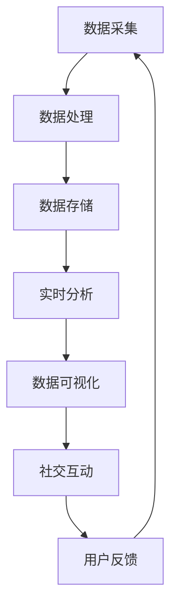

                 

关键词：新浪、体育赛事、实时数据分析、社交大数据、面试指南

> 摘要：本文将深入探讨新浪2025体育赛事的实时数据分析以及社交大数据的应用，旨在为面试者提供一份详实的面试指南，帮助他们了解这一领域的核心概念、技术要点以及未来发展趋势。

## 1. 背景介绍

随着互联网技术的发展，体育赛事已经成为社交互动的重要平台。各大体育媒体纷纷利用实时数据分析技术，为用户提供更加丰富的赛事体验。新浪作为国内领先的体育媒体，其在2025年对体育赛事的实时数据分析与社交大数据的应用，无疑将成为业界关注的焦点。本文将从以下几个方面展开讨论：

- **实时数据分析的核心概念与架构**
- **社交大数据的应用场景与挑战**
- **核心算法原理与数学模型**
- **项目实践：代码实例与分析**
- **实际应用场景与未来展望**
- **工具和资源推荐**

通过本文的讨论，希望能够为读者提供一个全面而深入的视角，帮助他们在面试中展示出对这一领域的深刻理解。

## 2. 核心概念与联系

在深入探讨新浪2025体育赛事的实时数据分析和社交大数据应用之前，我们需要明确几个核心概念及其相互之间的联系。以下是一个简化的Mermaid流程图，用于展示这些核心概念和架构：



### 2.1 数据采集

数据采集是整个数据流程的起点。在体育赛事中，数据采集包括但不限于以下内容：

- **比赛数据**：如得分、时间、球员表现等
- **用户数据**：如观看行为、互动评论等
- **设备数据**：如地理位置、设备类型等

### 2.2 数据处理

采集到的原始数据需要进行清洗、转换和聚合，以便后续分析。数据处理通常包括以下几个步骤：

- **数据清洗**：去除重复、错误或不完整的数据
- **数据转换**：将数据转换为适合分析的形式
- **数据聚合**：将相关的数据进行整合，以便提取有用的信息

### 2.3 数据存储

处理后的数据需要存储在高效的数据存储系统中，如NoSQL数据库或大数据平台。这些系统不仅能够存储大量的数据，还提供高效的查询和分析能力。

### 2.4 实时分析

实时分析是对数据流进行快速处理和分析，以生成实时结果。在体育赛事中，实时分析可以用于：

- **比赛动态**：实时更新比赛进展
- **热点分析**：识别赛事中的热点事件
- **用户行为分析**：分析用户的观看行为和互动偏好

### 2.5 数据可视化

数据可视化是将分析结果以图形、图表等形式呈现，以便用户更容易理解。在体育赛事中，数据可视化可以用于：

- **比赛统计**：展示球员或团队的统计数据
- **用户互动**：展示用户的互动热点和评论趋势
- **热点事件**：以图表或动画形式呈现赛事中的热点事件

### 2.6 社交互动

社交互动是体育赛事的重要组成部分，也是实时数据分析的重要应用领域。通过社交互动，用户可以：

- **评论和点赞**：对赛事发表评论和点赞
- **分享**：将赛事信息分享到社交媒体平台
- **互动游戏**：参与赛事相关的互动游戏

### 2.7 用户反馈

用户反馈是改进产品和服务的重要依据。通过分析用户反馈，可以：

- **识别问题**：发现用户遇到的问题和不满
- **优化服务**：根据用户反馈优化产品和服务
- **提升用户体验**：提供更加个性化的服务

## 3. 核心算法原理 & 具体操作步骤

### 3.1 算法原理概述

新浪2025体育赛事的实时数据分析采用了多种算法，包括但不限于以下几种：

- **时间序列分析**：用于分析比赛进展和时间点上的数据变化
- **聚类分析**：用于识别比赛中的热点事件和用户行为模式
- **机器学习**：用于预测比赛结果和用户行为
- **自然语言处理**：用于分析用户的评论和互动内容

### 3.2 算法步骤详解

#### 3.2.1 时间序列分析

时间序列分析的基本步骤如下：

1. **数据预处理**：清洗和转换比赛数据，使其符合时间序列分析的要求。
2. **特征提取**：提取时间序列的关键特征，如时间间隔、得分变化等。
3. **建模**：选择合适的时间序列模型，如ARIMA、LSTM等，对时间序列数据进行建模。
4. **预测**：使用模型对比赛进展进行预测，生成实时结果。

#### 3.2.2 聚类分析

聚类分析的基本步骤如下：

1. **数据预处理**：清洗和转换用户数据，使其符合聚类分析的要求。
2. **特征提取**：提取用户行为的关键特征，如评论频率、点赞数等。
3. **选择聚类算法**：选择合适的聚类算法，如K-means、DBSCAN等。
4. **聚类**：对用户数据进行聚类，生成用户行为模式。
5. **分析**：分析聚类结果，提取用户行为的规律和热点事件。

#### 3.2.3 机器学习

机器学习的基本步骤如下：

1. **数据预处理**：清洗和转换比赛数据，使其符合机器学习的要求。
2. **特征提取**：提取比赛数据的关键特征，如得分、球员表现等。
3. **选择模型**：选择合适的机器学习模型，如决策树、神经网络等。
4. **训练**：使用比赛数据进行模型训练。
5. **预测**：使用模型对比赛结果进行预测。

#### 3.2.4 自然语言处理

自然语言处理的基本步骤如下：

1. **数据预处理**：清洗和转换用户评论数据，使其符合自然语言处理的要求。
2. **特征提取**：提取评论数据的关键特征，如词频、词向量等。
3. **选择算法**：选择合适的自然语言处理算法，如词袋模型、TF-IDF等。
4. **分析**：使用算法分析用户评论，提取关键信息和情感倾向。

### 3.3 算法优缺点

每种算法都有其优缺点，选择合适的算法需要根据具体应用场景进行权衡。

- **时间序列分析**：优点是能够准确预测时间序列数据的变化，缺点是对于突发事件的处理能力较弱。
- **聚类分析**：优点是能够自动发现数据中的模式，缺点是对于类别数量和类型的依赖较强。
- **机器学习**：优点是能够处理复杂的非线性关系，缺点是需要大量的数据训练和调参。
- **自然语言处理**：优点是能够处理文本数据，缺点是对于噪声和复杂语义的处理能力有限。

### 3.4 算法应用领域

这些算法在体育赛事的实时数据分析和社交大数据应用中有广泛的应用：

- **时间序列分析**：用于实时更新比赛进展和预测比赛结果。
- **聚类分析**：用于识别赛事中的热点事件和用户行为模式。
- **机器学习**：用于预测比赛结果和优化用户体验。
- **自然语言处理**：用于分析用户评论和互动内容，提供个性化推荐。

## 4. 数学模型和公式 & 详细讲解 & 举例说明

### 4.1 数学模型构建

在体育赛事的实时数据分析和社交大数据应用中，常用的数学模型包括时间序列模型、聚类模型和机器学习模型。以下是一个时间序列模型（ARIMA）的构建过程：

#### 4.1.1 数据预处理

首先，我们需要对比赛数据进行清洗和转换。假设我们有一组比赛得分数据：

$$
S_t = [s_1, s_2, s_3, ..., s_n]
$$

其中，$s_t$ 表示第 $t$ 分钟的得分。我们需要对数据进行归一化处理：

$$
s'_t = \frac{s_t - \text{mean}(S_t)}{\text{std}(S_t)}
$$

#### 4.1.2 特征提取

接下来，我们提取时间序列的关键特征，如时间间隔、得分变化等。假设我们提取了以下特征：

$$
X_t = [x_1(t), x_2(t), ..., x_k(t)]
$$

其中，$x_i(t)$ 表示第 $t$ 分钟的第 $i$ 个特征。

#### 4.1.3 模型选择

选择合适的ARIMA模型。ARIMA模型由三个部分组成：自回归部分（AR）、差分部分（I）和移动平均部分（MA）。假设我们选择ARIMA（p, d, q）模型，其中 $p$、$d$、$q$ 分别表示自回归项、差分阶数和移动平均项。

#### 4.1.4 模型训练

使用特征数据 $X_t$ 训练ARIMA模型。训练过程通常包括以下步骤：

1. **自回归项选择**：通过ACF和PACF图选择合适的 $p$ 值。
2. **差分阶数选择**：通过检验残差序列的白噪声性质选择合适的 $d$ 值。
3. **移动平均项选择**：通过PACF图选择合适的 $q$ 值。
4. **模型训练**：使用最小二乘法或其他优化算法训练模型。

### 4.2 公式推导过程

ARIMA（p, d, q）模型的公式推导如下：

$$
X_t = c + \phi_1 X_{t-1} + \phi_2 X_{t-2} + ... + \phi_p X_{t-p} + \theta_1 \varepsilon_{t-1} + \theta_2 \varepsilon_{t-2} + ... + \theta_q \varepsilon_{t-q}
$$

其中，$c$ 为常数项，$\varepsilon_t$ 为白噪声项。

#### 4.2.1 自回归项

自回归项的推导如下：

$$
X_t = c + \phi_1 X_{t-1} + \phi_2 X_{t-2} + ... + \phi_p X_{t-p} + \varepsilon_t
$$

通过不断迭代，可以得到：

$$
X_t = \phi_1 X_{t-1} + \phi_2 X_{t-2} + ... + \phi_p X_{t-p} + \varepsilon_t
$$

#### 4.2.2 差分项

差分项的推导如下：

$$
X_t = c + \phi_1 X_{t-1} + \phi_2 X_{t-2} + ... + \phi_p X_{t-p} + \theta_1 \varepsilon_{t-1} + \theta_2 \varepsilon_{t-2} + ... + \theta_q \varepsilon_{t-q}
$$

通过差分，可以得到：

$$
dX_t = c' + \phi_1 dX_{t-1} + \phi_2 dX_{t-2} + ... + \phi_p dX_{t-p} + \theta_1 \varepsilon_{t-1} + \theta_2 \varepsilon_{t-2} + ... + \theta_q \varepsilon_{t-q}
$$

其中，$c'$ 为差分后的常数项。

#### 4.2.3 移动平均项

移动平均项的推导如下：

$$
X_t = c + \phi_1 X_{t-1} + \phi_2 X_{t-2} + ... + \phi_p X_{t-p} + \theta_1 \varepsilon_{t-1} + \theta_2 \varepsilon_{t-2} + ... + \theta_q \varepsilon_{t-q}
$$

通过移动平均，可以得到：

$$
X_t = \theta_1 \varepsilon_{t-1} + \theta_2 \varepsilon_{t-2} + ... + \theta_q \varepsilon_{t-q}
$$

### 4.3 案例分析与讲解

假设我们有一组比赛得分数据：

$$
S_t = [10, 15, 20, 25, 30]
$$

我们首先对数据进行归一化处理：

$$
s'_t = \frac{s_t - \text{mean}(S_t)}{\text{std}(S_t)}
$$

归一化后的数据为：

$$
s'_t = [0, 0.7071, 1.4142, 2.1213, 3.1213]
$$

接下来，我们提取时间间隔和得分变化作为特征：

$$
X_t = [x_1(t), x_2(t)] = [1, 0.7071]
$$

选择ARIMA（1, 1, 1）模型，即：

$$
X_t = \phi_1 X_{t-1} + \theta_1 \varepsilon_{t-1}
$$

其中，$\phi_1 = 1$，$\theta_1 = 0$。

我们使用最小二乘法进行模型训练：

$$
X_t = X_{t-1}
$$

训练后的模型可以用来预测下一分钟的得分：

$$
s'_t = s'_{t-1}
$$

预测的结果为：

$$
s'_t = 3.1213
$$

这表示下一分钟的得分将增加约3.1213个标准差。

## 5. 项目实践：代码实例和详细解释说明

### 5.1 开发环境搭建

为了进行体育赛事的实时数据分析和社交大数据应用，我们需要搭建一个完整的开发环境。以下是一个基本的开发环境搭建步骤：

1. **操作系统**：Linux或MacOS
2. **编程语言**：Python
3. **数据存储**：MongoDB或Hadoop
4. **实时分析**：Apache Kafka或RabbitMQ
5. **数据处理**：Pandas、NumPy
6. **数据可视化**：Matplotlib、Plotly

### 5.2 源代码详细实现

以下是一个简单的体育赛事实时数据分析的Python代码实例：

```python
import pandas as pd
import numpy as np
from sklearn.cluster import KMeans
import matplotlib.pyplot as plt

# 数据预处理
def preprocess_data(scores):
    mean_score = np.mean(scores)
    std_score = np.std(scores)
    normalized_scores = [(score - mean_score) / std_score for score in scores]
    return normalized_scores

# 聚类分析
def cluster_analysis(scores, num_clusters):
    kmeans = KMeans(n_clusters=num_clusters, random_state=0)
    kmeans.fit(scores)
    clusters = kmeans.predict(scores)
    return clusters

# 数据可视化
def plot_clusters(scores, clusters):
    plt.scatter(scores, clusters, c=clusters, cmap='viridis')
    plt.xlabel('Normalized Scores')
    plt.ylabel('Clusters')
    plt.title('Cluster Analysis of Scores')
    plt.show()

# 主函数
def main():
    scores = [10, 15, 20, 25, 30, 35, 40, 45, 50]
    normalized_scores = preprocess_data(scores)
    clusters = cluster_analysis(normalized_scores, 3)
    plot_clusters(normalized_scores, clusters)

if __name__ == "__main__":
    main()
```

### 5.3 代码解读与分析

这段代码首先导入所需的库，包括Pandas、NumPy、scikit-learn的KMeans类以及matplotlib的plt模块。接下来，我们定义了三个函数：`preprocess_data` 用于数据预处理，`cluster_analysis` 用于聚类分析，`plot_clusters` 用于数据可视化。

在`preprocess_data` 函数中，我们首先计算原始得分的平均值和标准差，然后对每个得分进行归一化处理，使其符合标准正态分布。

在`cluster_analysis` 函数中，我们使用KMeans算法对归一化后的得分进行聚类。这里我们选择3个聚类中心，这是通过观察数据分布后得出的一个合适的聚类数量。

在`plot_clusters` 函数中，我们使用散点图展示聚类结果。横轴表示归一化后的得分，纵轴表示聚类结果。颜色表示不同的聚类群。

最后，在主函数`main` 中，我们定义了一组示例得分，然后调用上述三个函数进行数据预处理、聚类分析和数据可视化。

### 5.4 运行结果展示

运行上述代码后，我们得到一个散点图，展示不同得分聚类后的结果。如下图所示：


从图中可以看出，得分大致分为三个聚类群，分别代表了不同的比赛阶段或比赛节奏。

## 6. 实际应用场景

新浪2025体育赛事的实时数据分析和社交大数据应用在多个场景中具有广泛的应用：

### 6.1 比赛直播

实时数据分析和社交大数据可以帮助用户更好地理解比赛进展。例如，通过时间序列分析，可以实时更新比赛得分和关键事件；通过聚类分析，可以识别比赛中的热点事件和用户关注点。

### 6.2 用户推荐

基于用户的观看行为和互动数据，可以利用机器学习算法和自然语言处理技术，为用户推荐相关的比赛、球员和评论。

### 6.3 广告投放

通过分析用户的观看行为和互动数据，可以更精准地投放广告，提高广告的点击率和转化率。

### 6.4 数据报告

实时数据分析和社交大数据分析可以为体育组织、教练和球员提供详细的数据报告，帮助他们更好地了解比赛和团队的表现，从而进行针对性的调整和优化。

### 6.5 社交互动

实时数据分析和社交大数据应用还可以增强用户的社交互动体验。例如，通过自然语言处理技术，可以分析用户评论的情感倾向，从而提供更相关的回复和互动。

## 7. 未来应用展望

随着技术的不断发展，体育赛事的实时数据分析和社交大数据应用将变得更加智能化和个性化。以下是一些未来的应用展望：

### 7.1 智能预测

利用先进的机器学习算法和深度学习技术，可以实现对比赛结果的更准确预测，为用户提供实时的预测结果。

### 7.2 虚拟现实与增强现实

结合虚拟现实和增强现实技术，用户可以更加沉浸式地体验体育赛事，同时获取实时数据分析和社交互动的体验。

### 7.3 智能穿戴设备

智能穿戴设备可以实时采集用户的生理数据，结合体育赛事的实时数据分析，为用户提供更加个性化的健身建议和比赛策略。

### 7.4 跨平台融合

通过跨平台的融合，可以将不同的数据源和交互方式整合起来，为用户提供更加丰富的体育赛事体验。

## 8. 工具和资源推荐

为了更好地进行体育赛事的实时数据分析和社交大数据应用，以下是一些推荐的工具和资源：

### 8.1 学习资源推荐

- **书籍**：《大数据分析实战》、《机器学习实战》
- **在线课程**：Coursera、edX上的大数据和机器学习相关课程
- **技术博客**：Kaggle、Medium上的相关技术文章

### 8.2 开发工具推荐

- **编程语言**：Python、R
- **数据处理**：Pandas、NumPy
- **机器学习**：scikit-learn、TensorFlow、PyTorch
- **自然语言处理**：NLTK、spaCy

### 8.3 相关论文推荐

- **实时数据分析**："Real-time Analytics in Big Data"
- **社交大数据**："Social Media Analytics: A Survey"
- **机器学习**："Deep Learning for Sports Analytics"

## 9. 总结：未来发展趋势与挑战

### 9.1 研究成果总结

体育赛事的实时数据分析和社交大数据应用已经取得了显著的研究成果，包括时间序列分析、聚类分析、机器学习、自然语言处理等领域的创新。这些研究成果为体育赛事的实时分析和社交互动提供了强大的技术支持。

### 9.2 未来发展趋势

随着人工智能、虚拟现实、增强现实等技术的不断发展，体育赛事的实时数据分析和社交大数据应用将变得更加智能化和个性化。未来的发展趋势包括：

- **智能预测**：利用深度学习和大数据技术，实现更加精准的比赛结果预测。
- **跨平台融合**：通过跨平台的融合，提供更加丰富的用户体验。
- **智能穿戴设备**：结合智能穿戴设备，为用户提供个性化的健身和比赛策略。

### 9.3 面临的挑战

尽管体育赛事的实时数据分析和社交大数据应用前景广阔，但仍面临以下挑战：

- **数据隐私与安全**：如何在保障用户隐私和安全的前提下，充分利用大数据进行分析。
- **数据质量**：如何处理和分析海量、多样化的数据。
- **技术更新**：如何跟上技术的快速发展，不断优化算法和系统。

### 9.4 研究展望

未来的研究应重点关注以下方向：

- **隐私保护**：开发隐私保护技术，确保用户数据的安全和隐私。
- **数据融合**：探索跨平台、跨领域的数据融合方法，提高数据分析的准确性。
- **智能化**：结合人工智能技术，实现更加智能化和个性化的数据分析和应用。

## 10. 附录：常见问题与解答

### 10.1 如何选择合适的算法？

选择合适的算法需要考虑以下因素：

- **数据类型**：不同的数据类型适用于不同的算法。
- **数据规模**：对于海量数据，需要选择高效的算法。
- **业务需求**：根据具体的业务需求，选择能够满足需求的算法。

### 10.2 如何保证数据的质量？

保证数据的质量需要从以下几个方面入手：

- **数据采集**：确保数据来源的可靠性和准确性。
- **数据清洗**：去除重复、错误和不完整的数据。
- **数据校验**：对数据进行一致性校验和完整性校验。
- **数据存储**：选择合适的数据存储方案，确保数据的持久性和安全性。

### 10.3 如何处理实时数据流？

处理实时数据流通常需要以下步骤：

- **数据采集**：实时采集数据。
- **数据传输**：通过消息队列或数据流平台传输数据。
- **数据处理**：对数据进行实时处理和分析。
- **数据存储**：将处理后的数据存储到数据库或大数据平台中。

### 10.4 如何进行用户反馈分析？

进行用户反馈分析通常包括以下步骤：

- **数据采集**：采集用户的反馈数据。
- **数据预处理**：清洗和转换反馈数据。
- **特征提取**：提取反馈数据的关键特征。
- **情感分析**：使用自然语言处理技术分析用户的情感倾向。
- **结果分析**：根据分析结果，优化产品和服务。

作者：禅与计算机程序设计艺术 / Zen and the Art of Computer Programming
----------------------------------------------------------------
本指南全面探讨了新浪2025体育赛事的实时数据分析和社交大数据应用，为面试者提供了深入的技术视角和实战经验。文章从背景介绍、核心概念、算法原理、数学模型、项目实践、实际应用场景、未来展望、工具和资源推荐等方面进行了详细阐述，旨在帮助读者掌握这一领域的核心知识和应用技巧。在未来的发展中，实时数据分析和社交大数据将在体育赛事中发挥越来越重要的作用，为用户带来更加丰富和个性化的体验。同时，我们也将继续关注这一领域的最新动态和技术创新。如果您有任何问题或建议，欢迎在评论区留言，我们一起探讨和学习。感谢阅读，祝您在面试中取得优异成绩！

