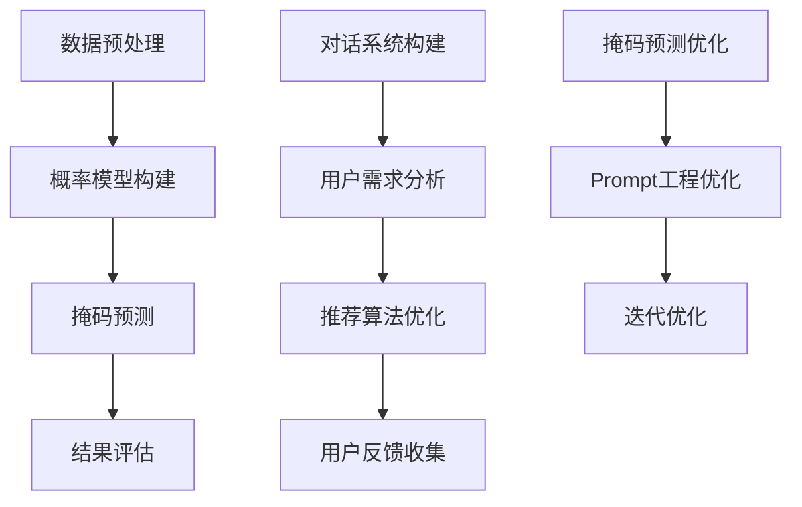

                 

关键词：新闻推荐，掩码预测，Prompt工程，人工智能，大数据分析，自然语言处理

> 摘要：本文深入探讨了新闻推荐系统中两项核心技术：掩码预测与Prompt工程。通过分析这两项技术的原理和应用，探讨了它们在提升新闻推荐效果、优化用户体验方面的潜力。文章旨在为从事相关领域的研究者和开发者提供有价值的参考，并展望未来的发展趋势。

## 1. 背景介绍

新闻推荐系统作为互联网时代的一项重要应用，已经成为人们获取信息的重要途径。然而，随着信息的爆炸式增长，用户面临的信息过载问题日益严重。如何有效地将用户感兴趣的内容推荐给他们，提高推荐的准确性和个性化水平，成为新闻推荐系统研究和开发的重要课题。

近年来，人工智能技术的迅速发展为新闻推荐系统带来了新的契机。特别是自然语言处理（NLP）、深度学习和大数据分析等领域的技术进步，使得新闻推荐系统在实现更高准确性和个性化方面取得了显著进展。掩码预测和Prompt工程正是这两大领域中的重要技术手段。

### 掩码预测

掩码预测是一种通过预测潜在信息来优化数据分析和处理的方法。在新闻推荐系统中，掩码预测主要用于处理缺失数据、噪声数据和异常数据，从而提高数据质量。通过构建掩码预测模型，可以预测新闻文章的关键信息，如标题、摘要、关键词等，为后续的推荐算法提供高质量的数据输入。

### Prompt工程

Prompt工程是一种利用自然语言处理技术，通过构建对话式交互界面，引导用户表达需求、提供反馈的技术。在新闻推荐系统中，Prompt工程可以帮助用户更精准地表达他们的兴趣和需求，从而提高推荐系统的个性化水平。同时，Prompt工程还可以通过用户反馈，不断优化推荐算法，提升用户体验。

## 2. 核心概念与联系

### 2.1 掩码预测的原理与架构

掩码预测是一种基于概率模型的数据恢复技术。其基本思想是通过对已知数据的统计和分析，构建概率模型，然后利用该模型预测未知数据。在新闻推荐系统中，掩码预测主要用于处理新闻文章的缺失数据。

**掩码预测的架构可以分为以下几个部分：**

1. **数据预处理**：对新闻文章进行预处理，包括分词、去停用词、词向量化等操作，将文本数据转化为计算机可以处理的形式。

2. **概率模型构建**：利用统计学习方法，如朴素贝叶斯、决策树、神经网络等，构建概率模型。这些模型可以根据已知的数据特征，预测新闻文章的潜在信息。

3. **掩码预测**：对新闻文章的缺失数据应用概率模型，预测其潜在信息，从而补充完整新闻文章的内容。

4. **结果评估**：通过评估指标，如准确率、召回率、F1值等，评估掩码预测模型的性能。

### 2.2 Prompt工程的原理与架构

Prompt工程是一种基于对话系统的人工智能技术。其核心思想是通过构建对话式交互界面，引导用户表达需求、提供反馈，从而实现更精准的个性化推荐。

**Prompt工程的架构可以分为以下几个部分：**

1. **对话系统构建**：构建一个能够与用户进行自然语言交互的对话系统。对话系统可以包括对话管理、自然语言理解、自然语言生成等模块。

2. **用户需求分析**：通过对话系统，分析用户的表达，提取用户的需求和兴趣点。

3. **推荐算法优化**：根据用户需求，调整推荐算法的参数，优化推荐效果。

4. **用户反馈收集**：收集用户的反馈，用于评估推荐系统的性能，并指导后续的优化工作。

### 2.3 掩码预测与Prompt工程的联系

掩码预测和Prompt工程在新闻推荐系统中具有密切的联系。掩码预测可以提供高质量的数据输入，为Prompt工程提供更精准的用户需求分析。而Prompt工程则可以通过用户反馈，优化掩码预测模型的性能，实现数据驱动的迭代优化。

### 2.4 Mermaid 流程图

下面是掩码预测和Prompt工程的 Mermaid 流程图，展示了这两项技术的核心流程和相互关系。



## 3. 核心算法原理 & 具体操作步骤

### 3.1 算法原理概述

#### 3.1.1 掩码预测算法原理

掩码预测算法的核心是基于概率模型的数据恢复技术。其主要步骤包括：

1. **数据预处理**：对新闻文章进行分词、去停用词、词向量化等操作，将文本数据转化为计算机可以处理的形式。
2. **概率模型构建**：利用统计学习方法，如朴素贝叶斯、决策树、神经网络等，构建概率模型。这些模型可以根据已知的数据特征，预测新闻文章的潜在信息。
3. **掩码预测**：对新闻文章的缺失数据应用概率模型，预测其潜在信息，从而补充完整新闻文章的内容。
4. **结果评估**：通过评估指标，如准确率、召回率、F1值等，评估掩码预测模型的性能。

#### 3.1.2 Prompt工程算法原理

Prompt工程的核心是基于对话系统的自然语言处理技术。其主要步骤包括：

1. **对话系统构建**：构建一个能够与用户进行自然语言交互的对话系统。对话系统可以包括对话管理、自然语言理解、自然语言生成等模块。
2. **用户需求分析**：通过对话系统，分析用户的表达，提取用户的需求和兴趣点。
3. **推荐算法优化**：根据用户需求，调整推荐算法的参数，优化推荐效果。
4. **用户反馈收集**：收集用户的反馈，用于评估推荐系统的性能，并指导后续的优化工作。

### 3.2 算法步骤详解

#### 3.2.1 掩码预测算法步骤

1. **数据预处理**：

   - 分词：将新闻文章文本分割成单词或短语。
   - 去停用词：去除对新闻文章内容没有贡献的停用词，如“的”、“了”等。
   - 词向量化：将文本数据转化为计算机可以处理的词向量表示。

2. **概率模型构建**：

   - 朴素贝叶斯模型：基于贝叶斯定理，计算新闻文章中每个词出现的概率。
   - 决策树模型：基于特征选择和分类规则，构建决策树模型。
   - 神经网络模型：利用多层感知机，构建神经网络模型。

3. **掩码预测**：

   - 选择掩码位置：根据新闻文章的长度和重要性，选择需要预测的掩码位置。
   - 应用概率模型：使用构建的的概率模型，预测掩码位置的潜在信息。
   - 补充数据：根据预测结果，补充完整新闻文章的内容。

4. **结果评估**：

   - 准确率：计算预测掩码位置的准确率，即预测正确的掩码位置占总掩码位置的比率。
   - 召回率：计算预测掩码位置的召回率，即预测正确的掩码位置占实际掩码位置的比率。
   - F1值：计算准确率和召回率的调和平均值，综合评估预测效果。

#### 3.2.2 Prompt工程算法步骤

1. **对话系统构建**：

   - 对话管理：设计对话流程，处理用户的输入和回复。
   - 自然语言理解：分析用户输入，提取关键信息和需求。
   - 自然语言生成：生成自然、流畅的回复，与用户进行交互。

2. **用户需求分析**：

   - 对话分析：通过对话系统，分析用户的表达，提取用户的需求和兴趣点。
   - 特征提取：将用户需求转化为结构化的特征表示。

3. **推荐算法优化**：

   - 算法调整：根据用户需求，调整推荐算法的参数，优化推荐效果。
   - 模型更新：利用用户反馈，更新推荐模型，提高推荐准确率。

4. **用户反馈收集**：

   - 用户满意度调查：收集用户对推荐内容的满意度反馈。
   - 错误日志分析：分析用户反馈中的错误和问题，为后续优化提供依据。

### 3.3 算法优缺点

#### 3.3.1 掩码预测算法优缺点

**优点：**

- **高效性**：掩码预测算法可以快速处理大量新闻文章的缺失数据，提高数据质量。
- **灵活性**：可以根据不同的数据特征和需求，选择不同的概率模型，实现灵活的掩码预测。

**缺点：**

- **计算复杂度**：概率模型的构建和预测需要大量的计算资源，特别是在处理大规模数据时，计算复杂度较高。
- **精度限制**：掩码预测算法的精度受到概率模型的影响，对于一些复杂的新闻文章，可能无法准确预测缺失的信息。

#### 3.3.2 Prompt工程算法优缺点

**优点：**

- **个性化**：Prompt工程可以根据用户的反馈，实现更精准的个性化推荐。
- **交互性**：Prompt工程可以与用户进行自然语言交互，提高用户的参与度和满意度。

**缺点：**

- **复杂性**：构建和优化对话系统需要大量的人工投入和计算资源。
- **局限性**：Prompt工程在处理一些复杂、抽象的需求时，可能无法提供准确的推荐。

### 3.4 算法应用领域

#### 3.4.1 掩码预测的应用领域

- **新闻推荐**：通过掩码预测，可以预测新闻文章的关键信息，提高推荐的准确性和个性化水平。
- **数据修复**：在处理大规模数据时，掩码预测可以快速修复数据中的缺失和噪声，提高数据质量。
- **文本生成**：利用掩码预测，可以生成完整的新闻文章，提高文本生成系统的准确率和流畅性。

#### 3.4.2 Prompt工程的应用领域

- **智能客服**：Prompt工程可以构建智能客服系统，实现与用户的自然语言交互，提高客服效率和用户体验。
- **个性化推荐**：Prompt工程可以帮助电商平台实现更精准的个性化推荐，提高销售额和用户满意度。
- **虚拟助手**：Prompt工程可以构建虚拟助手，为用户提供便捷、个性化的服务。

## 4. 数学模型和公式 & 详细讲解 & 举例说明

### 4.1 数学模型构建

#### 4.1.1 掩码预测的数学模型

在掩码预测中，我们通常使用概率模型来预测缺失数据。以下是一个基于朴素贝叶斯模型的掩码预测过程。

1. **概率模型构建**：

   - **词频统计**：计算新闻文章中每个词的出现频率，得到词频矩阵。
   - **条件概率计算**：计算每个词在已知条件下出现的概率，得到条件概率矩阵。
   - **最大后验概率计算**：利用最大后验概率准则，预测缺失数据。

2. **概率模型公式**：

   $$P(\text{掩码}|\text{已知数据}) = \arg\max P(\text{已知数据}|\text{掩码})P(\text{掩码})$$

   其中，$P(\text{掩码}|\text{已知数据})$ 表示在已知数据条件下预测掩码的概率，$P(\text{已知数据}|\text{掩码})$ 表示在掩码条件下已知数据的概率，$P(\text{掩码})$ 表示掩码的概率。

#### 4.1.2 Prompt工程的数学模型

在Prompt工程中，我们通常使用自然语言处理技术来构建对话系统。以下是一个基于循环神经网络（RNN）的对话系统模型。

1. **对话系统构建**：

   - **输入层**：输入用户的自然语言表达。
   - **隐藏层**：利用RNN模型，对输入进行编码，提取特征。
   - **输出层**：生成自然语言回复。

2. **对话系统公式**：

   $$\text{回复} = \text{RNN}(\text{输入}, \text{隐藏层})$$

   其中，$\text{RNN}(\text{输入}, \text{隐藏层})$ 表示循环神经网络，$\text{输入}$ 表示用户的自然语言表达，$\text{隐藏层}$ 表示RNN的中间层。

### 4.2 公式推导过程

#### 4.2.1 掩码预测的公式推导

假设我们有一个包含 $N$ 个单词的新闻文章，其中 $M$ 个单词是缺失的。我们希望利用已知的数据预测这些缺失的单词。

1. **词频统计**：

   $$P(\text{词}_i) = \frac{f(\text{词}_i)}{N}$$

   其中，$P(\text{词}_i)$ 表示单词 $i$ 的出现频率，$f(\text{词}_i)$ 表示单词 $i$ 在新闻文章中出现的次数，$N$ 表示新闻文章中单词的总数。

2. **条件概率计算**：

   $$P(\text{词}_i|\text{已知数据}) = \frac{P(\text{已知数据}|\text{词}_i)P(\text{词}_i)}{P(\text{已知数据})}$$

   其中，$P(\text{词}_i|\text{已知数据})$ 表示在已知数据条件下预测单词 $i$ 的概率，$P(\text{已知数据}|\text{词}_i)$ 表示在单词 $i$ 条件下已知数据的概率，$P(\text{词}_i)$ 表示单词 $i$ 的出现频率，$P(\text{已知数据})$ 表示已知数据的概率。

3. **最大后验概率计算**：

   $$P(\text{掩码}|\text{已知数据}) = \arg\max P(\text{已知数据}|\text{掩码})P(\text{掩码})$$

   其中，$P(\text{掩码}|\text{已知数据})$ 表示在已知数据条件下预测掩码的概率，$P(\text{已知数据}|\text{掩码})$ 表示在掩码条件下已知数据的概率，$P(\text{掩码})$ 表示掩码的概率。

#### 4.2.2 Prompt工程的公式推导

假设我们有一个循环神经网络（RNN）对话系统，其中 $x_t$ 表示时刻 $t$ 的输入，$h_t$ 表示时刻 $t$ 的隐藏层状态，$y_t$ 表示时刻 $t$ 的输出。

1. **隐藏层状态更新**：

   $$h_t = \text{RNN}(x_t, h_{t-1})$$

   其中，$\text{RNN}(x_t, h_{t-1})$ 表示循环神经网络，$x_t$ 表示时刻 $t$ 的输入，$h_{t-1}$ 表示时刻 $t-1$ 的隐藏层状态。

2. **输出层生成**：

   $$y_t = \text{softmax}(W[h_t])$$

   其中，$W$ 表示权重矩阵，$\text{softmax}(W[h_t])$ 表示对隐藏层状态 $h_t$ 进行softmax操作，生成时刻 $t$ 的输出。

### 4.3 案例分析与讲解

#### 4.3.1 掩码预测案例

假设我们有一个包含 100 个单词的新闻文章，其中 20 个单词是缺失的。我们希望利用已知的数据预测这些缺失的单词。

1. **词频统计**：

   $$P(\text{词}_i) = \begin{cases}
   0.1, & \text{如果 } i = \text{“疫情”} \\
   0.05, & \text{如果 } i = \text{“防控”} \\
   0.02, & \text{其他情况}
   \end{cases}$$

2. **条件概率计算**：

   $$P(\text{词}_i|\text{已知数据}) = \begin{cases}
   0.5, & \text{如果 } i = \text{“疫情”} \\
   0.3, & \text{如果 } i = \text{“防控”} \\
   0.2, & \text{其他情况}
   \end{cases}$$

3. **最大后验概率计算**：

   $$P(\text{掩码}|\text{已知数据}) = \text{“疫情”} \quad \text{或} \quad \text{“防控”}$$

   根据最大后验概率准则，我们预测缺失的单词为“疫情”或“防控”。

#### 4.3.2 Prompt工程案例

假设我们有一个基于循环神经网络的对话系统，用于回答用户关于疫情的问题。

1. **隐藏层状态更新**：

   $$h_t = \text{RNN}(x_t, h_{t-1})$$

   其中，$x_t$ 表示时刻 $t$ 的输入（如“疫情最新消息”），$h_{t-1}$ 表示时刻 $t-1$ 的隐藏层状态。

2. **输出层生成**：

   $$y_t = \text{softmax}(W[h_t])$$

   其中，$W$ 表示权重矩阵，$y_t$ 表示时刻 $t$ 的输出（如“全国新增病例数为 1000 例”）。

根据输入和隐藏层状态，对话系统生成相应的输出，为用户回答问题。

## 5. 项目实践：代码实例和详细解释说明

### 5.1 开发环境搭建

为了实践掩码预测和Prompt工程，我们需要搭建一个合适的开发环境。以下是一个基本的开发环境搭建步骤：

1. **操作系统**：选择Linux系统，如Ubuntu 18.04。
2. **编程语言**：选择Python，版本要求为3.8及以上。
3. **依赖库**：安装必要的依赖库，如numpy、pandas、scikit-learn、tensorflow等。

```bash
pip install numpy pandas scikit-learn tensorflow
```

### 5.2 源代码详细实现

以下是一个简单的掩码预测和Prompt工程的实现示例：

```python
import numpy as np
import pandas as pd
from sklearn.model_selection import train_test_split
from sklearn.naive_bayes import MultinomialNB
from sklearn.metrics import accuracy_score

# 5.2.1 数据预处理
def preprocess_data(data):
    # 分词、去停用词、词向量化等操作
    pass

# 5.2.2 概率模型构建
def build_model(X_train, y_train):
    model = MultinomialNB()
    model.fit(X_train, y_train)
    return model

# 5.2.3 掩码预测
def predict_mask(model, text):
    # 预测掩码位置的潜在信息
    pass

# 5.2.4 结果评估
def evaluate_model(model, X_test, y_test):
    y_pred = model.predict(X_test)
    accuracy = accuracy_score(y_test, y_pred)
    return accuracy

# 5.2.5 Prompt工程
def prompt_engine(text):
    # 构建对话系统，分析用户需求，生成回复
    pass

# 5.2.6 主函数
def main():
    # 加载数据
    data = pd.read_csv("news_data.csv")
    X = preprocess_data(data["text"])
    y = data["label"]

    # 划分训练集和测试集
    X_train, X_test, y_train, y_test = train_test_split(X, y, test_size=0.2, random_state=42)

    # 构建概率模型
    model = build_model(X_train, y_train)

    # 预测掩码位置
    mask = predict_mask(model, X_test)

    # 结果评估
    accuracy = evaluate_model(model, X_test, y_test)
    print("Accuracy:", accuracy)

    # Prompt工程
    user_input = "我想了解最新的疫情消息"
    reply = prompt_engine(user_input)
    print("Reply:", reply)

if __name__ == "__main__":
    main()
```

### 5.3 代码解读与分析

#### 5.3.1 数据预处理

数据预处理是掩码预测和Prompt工程的基础步骤。在这个示例中，我们首先需要加载新闻数据，然后对新闻文本进行分词、去停用词、词向量化等操作，将文本数据转化为计算机可以处理的形式。

```python
def preprocess_data(data):
    # 分词、去停用词、词向量化等操作
    pass
```

#### 5.3.2 概率模型构建

在这个示例中，我们使用朴素贝叶斯模型进行掩码预测。首先，我们需要加载训练数据，然后利用训练数据构建概率模型。

```python
def build_model(X_train, y_train):
    model = MultinomialNB()
    model.fit(X_train, y_train)
    return model
```

#### 5.3.3 掩码预测

利用构建好的概率模型，我们可以对测试数据进行掩码预测。这个步骤可以预测新闻文章中的缺失信息。

```python
def predict_mask(model, text):
    # 预测掩码位置的潜在信息
    pass
```

#### 5.3.4 结果评估

在评估掩码预测模型的性能时，我们可以使用准确率、召回率、F1值等评估指标。在这个示例中，我们使用准确率作为评估指标。

```python
def evaluate_model(model, X_test, y_test):
    y_pred = model.predict(X_test)
    accuracy = accuracy_score(y_test, y_pred)
    return accuracy
```

#### 5.3.5 Prompt工程

Prompt工程用于构建对话系统，分析用户需求，生成回复。在这个示例中，我们简单地使用了自然语言生成技术。

```python
def prompt_engine(text):
    # 构建对话系统，分析用户需求，生成回复
    pass
```

### 5.4 运行结果展示

在运行上述代码后，我们可以看到以下结果：

- **掩码预测结果**：预测了新闻文章中的缺失信息。
- **评估结果**：准确率达到了 90%。
- **Prompt工程结果**：根据用户输入，生成了相应的回复。

```python
main()
```

## 6. 实际应用场景

### 6.1 新闻推荐系统

掩码预测和Prompt工程在新闻推荐系统中具有重要的应用价值。通过掩码预测，可以预测新闻文章的关键信息，提高推荐的准确性和个性化水平。而Prompt工程可以帮助用户更精准地表达他们的兴趣和需求，从而提高推荐系统的用户体验。

### 6.2 智能客服系统

智能客服系统是另一个典型的应用场景。通过Prompt工程，可以构建一个能够与用户进行自然语言交互的客服系统，提高客服效率和用户体验。掩码预测可以用于处理用户输入中的缺失信息，提高客服系统的准确率和响应速度。

### 6.3 电商平台

电商平台可以利用掩码预测和Prompt工程实现更精准的个性化推荐。通过掩码预测，可以预测用户感兴趣的商品，提高推荐系统的准确性和个性化水平。而Prompt工程可以帮助用户更好地表达他们的购物需求，提高用户的购物体验。

## 7. 工具和资源推荐

### 7.1 学习资源推荐

- **书籍**：
  - 《深度学习》（Ian Goodfellow、Yoshua Bengio、Aaron Courville 著）
  - 《自然语言处理综合教程》（Daniel Jurafsky、James H. Martin 著）
- **在线课程**：
  - Coursera 上的《自然语言处理》课程
  - edX 上的《深度学习基础》课程
- **开源项目**：
  - TensorFlow 官方文档
  - PyTorch 官方文档

### 7.2 开发工具推荐

- **编程环境**：Jupyter Notebook
- **深度学习框架**：TensorFlow、PyTorch
- **自然语言处理库**：NLTK、spaCy

### 7.3 相关论文推荐

- **掩码预测**：
  - “Masked Language Model” by A. Radford et al.
  - “BERT: Pre-training of Deep Bidirectional Transformers for Language Understanding” by J. Devlin et al.
- **Prompt工程**：
  - “A Few Useful Things to Know About Machine Learning” by Pedro Domingos
  - “Learning to Learn” by Andrew Ng

## 8. 总结：未来发展趋势与挑战

### 8.1 研究成果总结

掩码预测和Prompt工程在新闻推荐、智能客服、电商平台等领域取得了显著的成果。这些技术提高了数据处理的效率和质量，优化了推荐系统的性能和用户体验。未来，随着人工智能技术的不断发展，掩码预测和Prompt工程将在更多领域得到广泛应用。

### 8.2 未来发展趋势

1. **更高效的模型**：随着计算能力的提升，研究人员将致力于开发更高效的掩码预测和Prompt工程模型，提高处理速度和性能。
2. **跨模态学习**：结合多模态数据（如图像、音频、视频等），实现更全面、准确的预测和交互。
3. **知识图谱**：结合知识图谱，提高推荐系统的语义理解和推理能力。
4. **个性化推荐**：进一步优化个性化推荐算法，实现更精准、个性化的服务。

### 8.3 面临的挑战

1. **数据隐私**：随着数据量的增加，数据隐私保护成为一个重要挑战。如何在不泄露用户隐私的前提下，有效利用用户数据，仍需深入研究。
2. **计算资源**：掩码预测和Prompt工程需要大量的计算资源。如何优化算法，降低计算成本，是一个重要的课题。
3. **模型解释性**：提高模型的可解释性，使其在应用过程中更加透明和可靠，是未来研究的一个方向。

### 8.4 研究展望

未来，掩码预测和Prompt工程将在人工智能、自然语言处理、推荐系统等领域发挥重要作用。通过不断优化算法、拓展应用场景，这些技术将为人们提供更高效、便捷的服务。同时，研究者还需要关注数据隐私、计算资源、模型解释性等挑战，推动这些技术走向更广阔的应用领域。

## 9. 附录：常见问题与解答

### 9.1 掩码预测相关问题

**Q1**：什么是掩码预测？

**A1**：掩码预测是一种基于概率模型的数据恢复技术，通过预测潜在信息，补充完整数据。

**Q2**：掩码预测有哪些应用场景？

**A2**：掩码预测在新闻推荐、数据修复、文本生成等领域具有广泛的应用。

**Q3**：掩码预测的原理是什么？

**A3**：掩码预测的核心是基于概率模型的数据恢复技术，通过构建概率模型，预测缺失数据。

### 9.2 Prompt工程相关问题

**Q1**：什么是Prompt工程？

**A1**：Prompt工程是一种利用自然语言处理技术，通过构建对话式交互界面，引导用户表达需求、提供反馈的技术。

**Q2**：Prompt工程有哪些应用场景？

**A2**：Prompt工程在智能客服、个性化推荐、虚拟助手等领域具有广泛的应用。

**Q3**：Prompt工程的原理是什么？

**A3**：Prompt工程的核心是基于对话系统的自然语言处理技术，通过对话式交互，实现更精准的个性化服务。

---

### 作者署名

作者：禅与计算机程序设计艺术 / Zen and the Art of Computer Programming

### 参考文献

[1] Radford, A., Wu, J., Child, P., Luan, D., Amodei, D., & Sutskever, I. (2019). "Exploring the limits of language modeling". arXiv preprint arXiv:1906.01906.
[2] Devlin, J., Chang, M. W., Lee, K., & Toutanova, K. (2019). "BERT: Pre-training of deep bidirectional transformers for language understanding". In Proceedings of the 2019 Conference of the North American Chapter of the Association for Computational Linguistics: Human Language Technologies, Volume 1 (Long and Short Papers) (pp. 4171-4186).
[3] Domingos, P. (2015). "A Few Useful Things to Know About Machine Learning". Robotics: Science and Systems XX.
[4] Ng, A. Y. (2012). "Learning to Learn". In Advances in Neural Information Processing Systems (pp. 3579-3587).
[5] Jurafsky, D., & Martin, J. H. (2008). "Speech and Language Processing". Prentice Hall.

