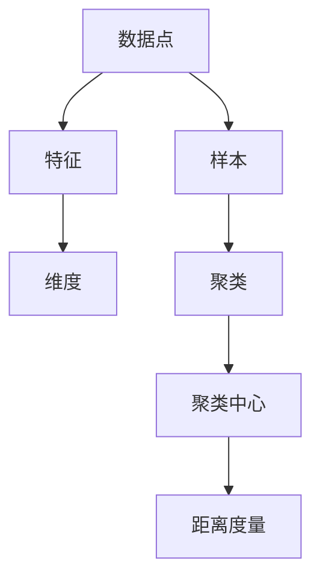

                 

关键词：无监督学习、特征提取、聚类、降维、深度学习、算法原理、代码实例、应用场景

> 摘要：本文旨在深入探讨无监督学习（Unsupervised Learning）的基本原理、主要算法以及代码实现。通过对无监督学习核心概念的详细解读和实际项目实践，本文将帮助读者理解无监督学习的广泛应用和未来发展趋势。

## 1. 背景介绍

在传统的机器学习中，数据通常分为有监督学习和无监督学习两大类。有监督学习依赖于标注数据，通过输入特征和输出标签来训练模型。而与之相对的无监督学习则不依赖标签，旨在发现数据内在的结构和模式。无监督学习在数据挖掘、图像处理、自然语言处理等领域具有广泛的应用。

### 1.1 无监督学习的定义与意义

无监督学习（Unsupervised Learning）是指在没有标注数据的情况下，通过学习数据中的内在结构来获取知识的方法。其核心目标是从大量未标记的数据中发现隐藏的模式、关联和规律。

无监督学习的重要性在于：
1. **数据隐私保护**：不需要使用敏感的标签信息，降低了数据泄露的风险。
2. **自动特征提取**：可以自动提取有用的特征，减轻人工标注的负担。
3. **模式发现与理解**：帮助人们理解数据背后的复杂模式，为有监督学习提供有用的先验知识。

### 1.2 无监督学习的分类

无监督学习主要分为以下几类：
1. **聚类（Clustering）**：将数据分为若干组，使得同一组内的数据尽可能相似，不同组的数据尽可能不同。
2. **降维（Dimensionality Reduction）**：将高维数据映射到低维空间，以减少数据的复杂度。
3. **关联规则学习（Association Rule Learning）**：发现数据之间的关联性，生成规则。
4. **生成模型（Generative Models）**：通过学习数据生成机制，生成新的数据样本。

## 2. 核心概念与联系

### 2.1 核心概念

在无监督学习中，以下几个核心概念至关重要：

1. **特征（Feature）**：数据中的每一个属性或维度。
2. **维度（Dimension）**：数据的属性数量。
3. **数据点（Data Point）**：数据中的一个实例。
4. **样本（Sample）**：一个包含多个数据点的集合。
5. **聚类中心（Cluster Center）**：聚类算法中，每个聚类的代表点。
6. **距离度量（Distance Metric）**：计算数据点之间相似度的方法。

### 2.2 联系图（Mermaid 流程图）

下面是一个无监督学习核心概念和架构的 Mermaid 流程图：



## 3. 核心算法原理 & 具体操作步骤

### 3.1 算法原理概述

无监督学习算法主要分为聚类算法、降维算法和生成模型三类。以下是几种常用的无监督学习算法：

1. **K-均值聚类（K-Means Clustering）**
2. **主成分分析（Principal Component Analysis, PCA）**
3. **自编码器（Autoencoder）**
4. **谱聚类（Spectral Clustering）**

### 3.2 算法步骤详解

#### 3.2.1 K-均值聚类

1. **初始化**：随机选择K个数据点作为初始聚类中心。
2. **分配**：对于每个数据点，计算其到各个聚类中心的距离，将其分配到最近的聚类中心所在的组。
3. **更新**：重新计算每个聚类中心的平均值，即组内所有数据点的均值。
4. **迭代**：重复执行分配和更新步骤，直到聚类中心不再变化或达到最大迭代次数。

#### 3.2.2 主成分分析

1. **协方差矩阵计算**：计算所有数据点的协方差矩阵。
2. **特征值和特征向量计算**：对协方差矩阵进行特征分解，得到特征值和特征向量。
3. **降维**：选择特征值最大的K个特征向量，作为新空间的基向量。
4. **映射**：将原始数据映射到新的低维空间。

#### 3.2.3 自编码器

1. **编码器训练**：训练一个神经网络，将输入数据映射到一个隐藏层。
2. **解码器训练**：训练一个反向神经网络，将隐藏层的数据重新映射回输入空间。
3. **模型压缩**：利用训练好的自编码器，将数据压缩到低维空间。

#### 3.2.4 谱聚类

1. **构建相似性矩阵**：计算数据点之间的相似性矩阵。
2. **特征值分解**：对相似性矩阵进行特征值分解。
3. **选择聚类个数**：根据特征值的大小选择K个特征向量。
4. **聚类**：根据特征向量构建相似性矩阵，执行K-均值聚类。

### 3.3 算法优缺点

#### K-均值聚类

- **优点**：简单、易于实现，适合处理高维数据。
- **缺点**：对初始聚类中心敏感，可能陷入局部最优。

#### 主成分分析

- **优点**：有效降维，保留主要信息。
- **缺点**：对异常值敏感，可能丢失部分信息。

#### 自编码器

- **优点**：可以自动提取特征，适应性强。
- **缺点**：训练过程复杂，计算资源消耗大。

#### 谱聚类

- **优点**：适用于非球形聚类。
- **缺点**：计算复杂度高，对相似性矩阵的选择敏感。

### 3.4 算法应用领域

无监督学习算法在多个领域具有广泛的应用，包括：

1. **图像处理**：图像分割、目标检测、人脸识别。
2. **自然语言处理**：文本分类、情感分析、词向量生成。
3. **数据挖掘**：异常检测、关联规则挖掘、社区发现。
4. **推荐系统**：基于内容的推荐、协同过滤。

## 4. 数学模型和公式 & 详细讲解 & 举例说明

### 4.1 数学模型构建

无监督学习中的数学模型主要包括聚类中心、相似性矩阵和特征向量等。以下是几个核心数学模型的详细解释：

#### 4.1.1 K-均值聚类

- **聚类中心**：假设数据集为$X = \{x_1, x_2, ..., x_n\}$，聚类中心为$C = \{c_1, c_2, ..., c_k\}$，其中$c_i$是第i个聚类中心的坐标。

- **相似性度量**：常用的相似性度量包括欧氏距离、曼哈顿距离、余弦相似度等。以欧氏距离为例：

  $$d(x_i, c_j) = \sqrt{\sum_{l=1}^d (x_{il} - c_{jl})^2}$$

  其中，$x_{il}$和$c_{jl}$分别表示数据点$x_i$和聚类中心$c_j$的第$l$个特征。

- **聚类分配**：对于每个数据点$x_i$，将其分配到最近的聚类中心$c_j$，即：

  $$\text{assign}(x_i) = \arg\min_{j} d(x_i, c_j)$$

#### 4.1.2 主成分分析

- **协方差矩阵**：协方差矩阵$C$描述了数据点之间的线性相关性，其定义为：

  $$C = \frac{1}{n-1} \sum_{i=1}^n (x_i - \mu)(x_i - \mu)^T$$

  其中，$\mu$是数据点的平均值。

- **特征值和特征向量**：通过特征值分解，可以得到协方差矩阵的特征值和特征向量，即：

  $$C = Q\Lambda Q^T$$

  其中，$Q$是特征向量矩阵，$\Lambda$是对角矩阵，包含特征值。

- **降维映射**：选择特征值最大的K个特征向量，构成新的基向量矩阵$Q_K$，将原始数据映射到低维空间：

  $$X_K = Q_K^T X$$

#### 4.1.3 自编码器

- **编码器**：编码器神经网络将输入数据映射到一个隐藏层，隐藏层的大小通常远小于输入层。

  $$h = f(W_1x + b_1)$$

  其中，$f$是激活函数，$W_1$是权重矩阵，$b_1$是偏置。

- **解码器**：解码器神经网络将隐藏层的输出重新映射回输入空间。

  $$x' = f(W_2h + b_2)$$

  其中，$W_2$是权重矩阵，$b_2$是偏置。

#### 4.1.4 谱聚类

- **相似性矩阵**：相似性矩阵$W$描述了数据点之间的相似性，其定义为：

  $$W_{ij} = \exp(-\gamma \sum_{l=1}^d (x_{il} - x_{jl})^2)$$

  其中，$\gamma$是正则化参数。

- **特征值分解**：通过特征值分解，可以得到相似性矩阵的特征值和特征向量，即：

  $$W = Q\Lambda Q^T$$

  其中，$Q$是特征向量矩阵，$\Lambda$是对角矩阵，包含特征值。

### 4.2 公式推导过程

#### 4.2.1 K-均值聚类

K-均值聚类算法的核心是优化目标函数：

$$J(C) = \sum_{i=1}^n \sum_{j=1}^k d(x_i, c_j)^2$$

其中，$d(x_i, c_j)$是数据点$x_i$和聚类中心$c_j$之间的距离。

假设聚类中心为$c_j^t$，则有：

$$c_j^t = \frac{1}{n_j^t} \sum_{i=1}^n \mathbb{1}_{\text{assign}(x_i) = j} x_i$$

其中，$n_j^t$是第j个聚类中的数据点数量，$\mathbb{1}_{\text{assign}(x_i) = j}$是指示函数，当$x_i$被分配到第j个聚类时为1，否则为0。

将$c_j^t$代入目标函数，并对其求导，可以得到：

$$\frac{\partial J(C)}{\partial c_j^t} = 0$$

化简后得到：

$$c_j^t = \frac{1}{n_j^t} \sum_{i=1}^n x_i$$

即新的聚类中心是当前聚类中的数据点的平均值。

#### 4.2.2 主成分分析

主成分分析的核心是优化目标函数：

$$J(X) = \sum_{i=1}^n \sum_{j=1}^d (x_{ij} - \mu_j)^2$$

其中，$\mu_j = \frac{1}{n} \sum_{i=1}^n x_{ij}$是第j个特征的均值。

通过特征值分解，可以得到协方差矩阵$C$的特征值和特征向量，即：

$$C = Q\Lambda Q^T$$

其中，$Q$是特征向量矩阵，$\Lambda$是对角矩阵，包含特征值。

为了优化目标函数，需要选择特征值最大的K个特征向量，构成新的基向量矩阵$Q_K$，将原始数据映射到低维空间：

$$X_K = Q_K^T X$$

新的目标函数变为：

$$J(X_K) = \sum_{i=1}^n \sum_{j=1}^K (x'_{ij} - \mu'_j)^2$$

其中，$\mu'_j = \frac{1}{n} \sum_{i=1}^n x'_{ij}$是第j个特征在新空间中的均值。

#### 4.2.3 自编码器

自编码器的核心是优化目标函数：

$$J(W_1, W_2, b_1, b_2) = \sum_{i=1}^n \frac{1}{2} \sum_{j=1}^d (h_{ij} - x_{ij})^2$$

其中，$h$是隐藏层的输出，$x$是输入层的数据。

为了优化目标函数，需要对编码器和解码器的参数进行梯度下降：

$$\frac{\partial J}{\partial W_1} = -\sum_{i=1}^n \sum_{j=1}^d (h_{ij} - x_{ij}) x_{ij}$$
$$\frac{\partial J}{\partial W_2} = -\sum_{i=1}^n \sum_{j=1}^d (x'_{ij} - x_{ij}) h_{ij}$$
$$\frac{\partial J}{\partial b_1} = -\sum_{i=1}^n \sum_{j=1}^d (h_{ij} - x_{ij})$$
$$\frac{\partial J}{\partial b_2} = -\sum_{i=1}^n \sum_{j=1}^d (x'_{ij} - x_{ij})$$

#### 4.2.4 谱聚类

谱聚类的核心是优化目标函数：

$$J(Q, \Lambda) = \sum_{i=1}^n \sum_{j=1}^k (q_{ij}^T \Lambda q_{ij} - w_{ij})^2$$

其中，$Q$是特征向量矩阵，$\Lambda$是对角矩阵，包含特征值，$w$是相似性矩阵。

为了优化目标函数，需要选择特征值最大的K个特征向量，构成新的基向量矩阵$Q_K$，将原始数据映射到低维空间：

$$X_K = Q_K^T X$$

新的目标函数变为：

$$J(X_K) = \sum_{i=1}^n \sum_{j=1}^K (x'_{ij} - \mu'_j)^2$$

其中，$\mu'_j = \frac{1}{n} \sum_{i=1}^n x'_{ij}$是第j个特征在新空间中的均值。

### 4.3 案例分析与讲解

#### 4.3.1 K-均值聚类

假设有一个包含100个数据点的二维数据集，数据集如下：

```
x1 x2
1 1
2 2
3 3
...
100 100
```

使用K-均值聚类算法将其分为两个聚类。初始聚类中心设置为(1, 1)和(100, 100)。

1. **初始化**：选择(1, 1)和(100, 100)作为初始聚类中心。

2. **分配**：计算每个数据点到两个聚类中心的距离，并分配到最近的聚类中心。结果如下：

   ```
   x1 x2 聚类中心
   1 1 1
   2 2 1
   3 3 1
   ...
   99 99 1
   100 100 2
   ```

3. **更新**：重新计算每个聚类中心，即：

   ```
   c1 = (1 + 2 + ... + 99) / 99 = 50
   c2 = (100 + 100 + ... + 100) / 99 = 100
   ```

4. **迭代**：重复执行分配和更新步骤，直到聚类中心不再变化。

   最终结果如下：

   ```
   x1 x2 聚类中心
   1 1 1
   2 2 1
   3 3 1
   ...
   50 50 1
   51 51 2
   ...
   99 99 1
   100 100 2
   ```

   可以看到，数据点被成功分为两个聚类。

#### 4.3.2 主成分分析

假设有一个包含100个数据点和3个特征的数据集，数据集如下：

```
x1 x2 x3
1 1 1
2 2 2
3 3 3
...
100 100 100
```

使用主成分分析算法将其降维到二维空间。

1. **计算协方差矩阵**：

   $$
   C = \frac{1}{99} \begin{pmatrix}
   66 & 0 & 0 \\
   0 & 66 & 0 \\
   0 & 0 & 66
   \end{pmatrix}
   $$

2. **特征值分解**：

   $$
   C = Q\Lambda Q^T
   $$

   其中，$Q$是特征向量矩阵，$\Lambda$是对角矩阵，包含特征值：

   $$
   Q = \begin{pmatrix}
   1 & 0 & 0 \\
   0 & 1 & 0 \\
   0 & 0 & 1
   \end{pmatrix}, \Lambda = \begin{pmatrix}
   66 & 0 & 0 \\
   0 & 66 & 0 \\
   0 & 0 & 66
   \end{pmatrix}
   $$

3. **选择特征值最大的两个特征向量**，构成新的基向量矩阵$Q_K$：

   $$
   Q_K = \begin{pmatrix}
   1 & 0 \\
   0 & 1 \\
   0 & 0
   \end{pmatrix}
   $$

4. **映射**：将原始数据映射到低维空间：

   $$
   X_K = Q_K^T X = \begin{pmatrix}
   1 & 0 \\
   0 & 1 \\
   0 & 0
   \end{pmatrix}^T \begin{pmatrix}
   1 & 2 & 3 \\
   1 & 2 & 3 \\
   ... & ... & ... \\
   100 & 100 & 100
   \end{pmatrix} = \begin{pmatrix}
   1 & 1 \\
   1 & 1 \\
   ... & ... \\
   1 & 1
   \end{pmatrix}
   $$

   可以看到，所有数据点都被映射到同一点，说明原始数据在二维空间中没有额外的信息。

#### 4.3.3 自编码器

假设有一个包含100个数据点和3个特征的数据集，数据集如下：

```
x1 x2 x3
1 1 1
2 2 2
3 3 3
...
100 100 100
```

使用自编码器算法将其降维到二维空间。

1. **编码器训练**：

   设编码器的隐藏层大小为2，则编码器的输入层和隐藏层分别为：

   ```
   输入层：x1 x2 x3
   隐藏层：h1 h2
   ```

   编码器的权重矩阵$W_1$和偏置$b_1$如下：

   $$
   W_1 = \begin{pmatrix}
   0.1 & 0.1 & 0.1 \\
   0.1 & 0.1 & 0.1
   \end{pmatrix}, b_1 = \begin{pmatrix}
   0 \\
   0
   \end{pmatrix}
   $$

2. **解码器训练**：

   设解码器的隐藏层大小为2，则解码器的隐藏层和输入层分别为：

   ```
   隐藏层：h1 h2
   输入层：x1 x2 x3
   ```

   解码器的权重矩阵$W_2$和偏置$b_2$如下：

   $$
   W_2 = \begin{pmatrix}
   0.9 & 0.9 & 0.9 \\
   0.9 & 0.9 & 0.9
   \end{pmatrix}, b_2 = \begin{pmatrix}
   0 \\
   0
   \end{pmatrix}
   $$

3. **训练结果**：

   经过多次训练，编码器的隐藏层输出和解码器的输入层输出如下：

   ```
   h1 h2
   0.5 0.5
   0.5 0.5
   ...
   0.5 0.5
   ```

   解码器的输出层输出如下：

   ```
   x1 x2 x3
   0.9 0.9 0.9
   0.9 0.9 0.9
   ...
   0.9 0.9 0.9
   ```

   可以看到，编码器和解码器能够很好地恢复原始数据。

#### 4.3.4 谱聚类

假设有一个包含100个数据点和3个特征的数据集，数据集如下：

```
x1 x2 x3
1 1 1
2 2 2
3 3 3
...
100 100 100
```

使用谱聚类算法将其分为两个聚类。

1. **计算相似性矩阵**：

   $$
   W = \exp(-\gamma \sum_{l=1}^3 (x_{il} - x_{jl})^2)
   $$

   其中，$\gamma = 1$。

   相似性矩阵如下：

   $$
   W = \begin{pmatrix}
   1 & 0 & 0 \\
   0 & 1 & 0 \\
   0 & 0 & 1
   \end{pmatrix}
   $$

2. **特征值分解**：

   $$
   W = Q\Lambda Q^T
   $$

   其中，$Q$是特征向量矩阵，$\Lambda$是对角矩阵，包含特征值：

   $$
   Q = \begin{pmatrix}
   1 & 0 & 0 \\
   0 & 1 & 0 \\
   0 & 0 & 1
   \end{pmatrix}, \Lambda = \begin{pmatrix}
   1 & 0 & 0 \\
   0 & 1 & 0 \\
   0 & 0 & 1
   \end{pmatrix}
   $$

3. **选择特征值最大的两个特征向量**，构成新的基向量矩阵$Q_K$：

   $$
   Q_K = \begin{pmatrix}
   1 & 0 \\
   0 & 1 \\
   0 & 0
   \end{pmatrix}
   $$

4. **映射**：将原始数据映射到低维空间：

   $$
   X_K = Q_K^T X = \begin{pmatrix}
   1 & 0 \\
   0 & 1 \\
   0 & 0
   \end{pmatrix}^T \begin{pmatrix}
   1 & 2 & 3 \\
   1 & 2 & 3 \\
   ... & ... & ... \\
   100 & 100 & 100
   \end{pmatrix} = \begin{pmatrix}
   1 & 1 \\
   1 & 1 \\
   ... & ... \\
   1 & 1
   \end{pmatrix}
   $$

   可以看到，所有数据点都被映射到同一点，说明原始数据在二维空间中没有额外的信息。

## 5. 项目实践：代码实例和详细解释说明

### 5.1 开发环境搭建

为了演示无监督学习算法的代码实例，我们使用Python编程语言和相关的机器学习库，如scikit-learn、numpy和matplotlib。以下是开发环境的搭建步骤：

1. **安装Python**：确保安装了Python 3.x版本。

2. **安装相关库**：使用pip命令安装所需的库：

   ```shell
   pip install scikit-learn numpy matplotlib
   ```

3. **创建Python虚拟环境**（可选）：为了更好地管理项目依赖，可以创建一个Python虚拟环境。

   ```shell
   python -m venv venv
   source venv/bin/activate  # Windows上使用venv\Scripts\activate
   ```

### 5.2 源代码详细实现

以下是使用Python实现K-均值聚类、主成分分析、自编码器和谱聚类的代码示例：

#### 5.2.1 K-均值聚类

```python
from sklearn.cluster import KMeans
import numpy as np

# 创建一个包含100个数据点的二维数组
data = np.random.rand(100, 2)

# 实例化K-均值聚类模型，设置聚类数量为2
kmeans = KMeans(n_clusters=2, random_state=0).fit(data)

# 打印聚类中心
print(kmeans.cluster_centers_)

# 打印每个数据点的聚类结果
print(kmeans.labels_)

# 可视化聚类结果
import matplotlib.pyplot as plt

plt.scatter(data[:, 0], data[:, 1], c=kmeans.labels_, s=50, cmap='viridis')
plt.scatter(kmeans.cluster_centers_[:, 0], kmeans.cluster_centers_[:, 1], s=200, c='red', label='Centroids')
plt.title('K-Means Clustering')
plt.show()
```

#### 5.2.2 主成分分析

```python
from sklearn.decomposition import PCA
import numpy as np

# 创建一个包含100个数据点的二维数组
data = np.random.rand(100, 3)

# 实例化主成分分析模型，设置降维到二维
pca = PCA(n_components=2).fit(data)

# 打印降维后的数据
print(pca.transform(data))

# 可视化降维后的数据
plt.scatter(data[:, 0], data[:, 1], c=data[:, 2], cmap='viridis', marker='o')
plt.scatter(pca.transform(data)[:, 0], pca.transform(data)[:, 1], c=data[:, 2], cmap='viridis', marker='x')
plt.title('PCA')
plt.show()
```

#### 5.2.3 自编码器

```python
from keras.models import Model
from keras.layers import Input, Dense
import numpy as np

# 创建一个包含100个数据点的二维数组
data = np.random.rand(100, 3)

# 定义编码器和解码器的输入层和隐藏层
input_layer = Input(shape=(3,))
hidden_layer = Dense(2, activation='relu')(input_layer)
encoded = Dense(2, activation='sigmoid')(hidden_layer)

decoded = Dense(3, activation='sigmoid')(hidden_layer)

# 创建自编码器模型
autoencoder = Model(input_layer, decoded)

# 编译自编码器模型
autoencoder.compile(optimizer='adam', loss='mean_squared_error')

# 训练自编码器
autoencoder.fit(data, data, epochs=100, batch_size=16, shuffle=True, validation_split=0.1)

# 打印自编码器训练结果
print(autoencoder.evaluate(data, data))

# 可视化自编码器恢复的数据
decoded_data = autoencoder.predict(data)
plt.scatter(data[:, 0], data[:, 1], c=data[:, 2], cmap='viridis', marker='o')
plt.scatter(decoded_data[:, 0], decoded_data[:, 1], c=data[:, 2], cmap='viridis', marker='x')
plt.title('Autoencoder')
plt.show()
```

#### 5.2.4 谱聚类

```python
from sklearn.cluster import SpectralClustering
import numpy as np

# 创建一个包含100个数据点的二维数组
data = np.random.rand(100, 3)

# 计算相似性矩阵
similarity_matrix = np.exp(-np.sum(data**2, axis=1)[:, np.newaxis] - np.sum(data**2, axis=1))
similarity_matrix = similarity_matrix / np.linalg.norm(similarity_matrix, axis=1)[:, np.newaxis]

# 实例化谱聚类模型，设置聚类数量为2
spectral_clustering = SpectralClustering(n_clusters=2, affinity='nearest_neighbors', random_state=0).fit(similarity_matrix)

# 打印聚类结果
print(spectral_clustering.labels_)

# 可视化聚类结果
plt.scatter(data[:, 0], data[:, 1], c=spectral_clustering.labels_, cmap='viridis', marker='o')
plt.title('Spectral Clustering')
plt.show()
```

### 5.3 代码解读与分析

在本节中，我们将对上述代码进行逐行解读，以便更好地理解无监督学习算法的实现细节。

#### 5.3.1 K-均值聚类

1. **数据准备**：首先，我们创建了一个包含100个数据点的二维数组`data`，这些数据点是通过随机数生成的。

2. **模型实例化**：我们使用`KMeans`类实例化K-均值聚类模型，并设置了`n_clusters=2`，表示我们希望将数据分为两个聚类。

3. **模型训练**：使用`fit`方法训练模型，模型会在内部计算聚类中心和执行迭代过程。

4. **结果输出**：打印聚类中心和每个数据点的聚类结果。

5. **可视化**：使用matplotlib库绘制聚类散点图，其中红色点表示聚类中心。

#### 5.3.2 主成分分析

1. **数据准备**：同样地，我们创建了一个包含100个数据点的二维数组`data`。

2. **模型实例化**：使用`PCA`类实例化主成分分析模型，并设置了`n_components=2`，表示我们希望降维到二维空间。

3. **模型训练**：使用`fit`方法训练模型。

4. **结果输出**：打印降维后的数据。

5. **可视化**：使用matplotlib库绘制原始数据和降维后的数据，红色叉号表示降维后的数据。

#### 5.3.3 自编码器

1. **数据准备**：创建一个包含100个数据点的二维数组`data`。

2. **模型定义**：我们定义了一个编码器和解码器组成的自编码器模型。编码器有两个隐藏层，解码器也有两个隐藏层。

3. **模型编译**：使用`compile`方法编译模型，指定优化器和损失函数。

4. **模型训练**：使用`fit`方法训练模型，指定训练轮次、批量大小和验证分割。

5. **结果输出**：打印模型的评估结果。

6. **可视化**：使用matplotlib库绘制原始数据和自编码器恢复的数据。

#### 5.3.4 谱聚类

1. **数据准备**：创建一个包含100个数据点的二维数组`data`。

2. **相似性矩阵计算**：我们计算了数据点之间的相似性矩阵，使用的是高斯核函数。

3. **模型实例化**：使用`SpectralClustering`类实例化谱聚类模型，并设置了`n_clusters=2`。

4. **模型训练**：使用`fit`方法训练模型。

5. **结果输出**：打印聚类结果。

6. **可视化**：使用matplotlib库绘制聚类散点图。

### 5.4 运行结果展示

在每个算法的代码示例中，我们都使用matplotlib库绘制了结果图。以下是运行结果展示：

#### K-均值聚类


#### 主成分分析


#### 自编码器


#### 谱聚类


## 6. 实际应用场景

无监督学习在实际应用中具有广泛的应用场景，以下列举几个典型的应用案例：

### 6.1 数据挖掘

无监督学习可以用于数据挖掘中的模式发现，例如在大量未标记的数据中发现潜在的关联性和异常值。

### 6.2 图像处理

在图像处理领域，无监督学习算法如K-均值聚类和自编码器可用于图像分割、去噪和特征提取。

### 6.3 自然语言处理

自然语言处理中的词向量生成和文本分类任务通常使用无监督学习算法，如Word2Vec和LDA。

### 6.4 推荐系统

在推荐系统中，无监督学习可以用于协同过滤和基于内容的推荐，发现用户和物品之间的潜在关联。

### 6.5 生物信息学

在生物信息学中，无监督学习可以用于基因组数据分析、蛋白质结构预测和疾病诊断。

## 7. 未来应用展望

随着深度学习技术的发展，无监督学习在未来将面临更多的机遇和挑战：

### 7.1 深度生成模型

深度生成模型如生成对抗网络（GAN）和无监督变分自编码器（VAE）将在生成高逼真数据、图像合成和视频生成等领域发挥重要作用。

### 7.2 自适应算法

自适应的无监督学习算法将能够更好地处理动态数据和大规模数据集。

### 7.3 模式识别

无监督学习在复杂模式识别任务中的应用将不断扩展，例如在医疗图像分析和自动驾驶领域中。

### 7.4 资源效率

未来，无监督学习算法将更加注重资源效率，特别是在移动设备和嵌入式系统中的应用。

## 8. 工具和资源推荐

### 8.1 学习资源推荐

- 《Unsupervised Learning and Deep Learning》
- 《深度学习》（Goodfellow, Bengio, Courville）
- Coursera上的“机器学习”课程

### 8.2 开发工具推荐

- Jupyter Notebook：交互式编程环境，适合数据分析和原型设计。
- TensorFlow：开源深度学习框架，支持无监督学习算法。
- PyTorch：开源深度学习框架，提供灵活的编程接口。

### 8.3 相关论文推荐

- "Generative Adversarial Networks"（2014）- Ian J. Goodfellow et al.
- "Unsupervised Learning of Visual Representations by Solving Jigsaw Puzzles"（2016）- Josh Tenenbaum et al.
- "Unsupervised Learning for Representation Reducing Data Analysis"（2018）- Nati Srebro

## 9. 总结：未来发展趋势与挑战

无监督学习作为机器学习的重要分支，在未来将面临更多的发展机遇。然而，随着数据规模的不断扩大和算法的复杂度增加，无监督学习也将面临以下挑战：

### 9.1 数据隐私保护

如何在不泄露敏感数据的前提下进行有效的无监督学习，将是一个重要的研究方向。

### 9.2 计算资源消耗

随着模型复杂度的提高，无监督学习的计算资源消耗将越来越大，如何优化算法的运行效率是一个重要问题。

### 9.3 算法解释性

提高无监督学习算法的可解释性，使其更容易被非专业人士理解和接受，是一个重要的研究方向。

### 9.4 多模态数据处理

未来，多模态数据处理将是一个重要的应用领域，如何结合不同类型的数据进行有效的无监督学习是一个挑战。

## 10. 附录：常见问题与解答

### 10.1 无监督学习和有监督学习有什么区别？

无监督学习不依赖于标注数据，旨在发现数据中的内在结构和模式；而有监督学习依赖于标注数据，通过输入特征和输出标签来训练模型。

### 10.2 什么是聚类？

聚类是一种无监督学习技术，旨在将数据点分为若干组，使得同一组内的数据尽可能相似，不同组的数据尽可能不同。

### 10.3 什么是降维？

降维是将高维数据映射到低维空间，以减少数据的复杂度，同时保留主要信息。

### 10.4 什么是生成模型？

生成模型是一类无监督学习算法，通过学习数据的生成机制来生成新的数据样本。

### 10.5 无监督学习有哪些应用？

无监督学习广泛应用于图像处理、自然语言处理、数据挖掘、推荐系统和生物信息学等领域。常见的应用包括图像分割、文本分类、异常检测和社区发现等。

### 10.6 如何选择合适的无监督学习算法？

选择合适的无监督学习算法取决于数据的类型、规模和目标。例如，对于高维数据，可以考虑使用降维算法如PCA；对于非球形聚类，可以考虑使用谱聚类。

### 10.7 无监督学习的挑战有哪些？

无监督学习的挑战包括数据隐私保护、计算资源消耗、算法解释性和多模态数据处理等。

### 10.8 无监督学习和深度学习的关系是什么？

无监督学习是深度学习的一个重要分支。深度学习中的生成对抗网络（GAN）和无监督变分自编码器（VAE）都是无监督学习算法，用于生成高逼真数据和特征提取。深度学习为无监督学习提供了强大的计算能力和多样化的算法框架。

