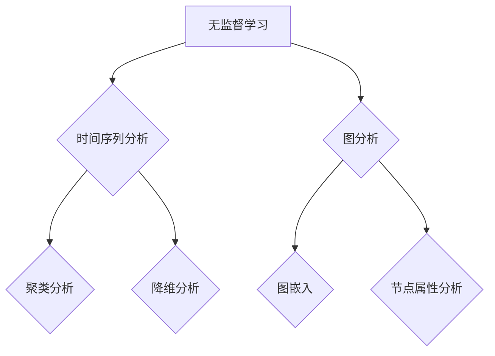

                 

关键词：无监督学习、时间序列分析、图分析、人工智能、数据挖掘、机器学习

> 摘要：本文探讨了无监督学习在时间序列分析和图分析中的应用。通过对无监督学习核心概念和算法的深入分析，结合数学模型的构建与推导，我们展示了这些技术在实际项目中的应用实例，并对其未来发展进行了展望。本文旨在为研究者提供关于无监督学习应用领域的全面视角。

## 1. 背景介绍

随着大数据和人工智能技术的迅猛发展，数据挖掘和机器学习已经成为现代计算的核心领域。在这些技术中，无监督学习（Unsupervised Learning）因其无需标签数据，能够自动发现数据中的模式和结构而备受关注。无监督学习广泛应用于聚类分析、降维、异常检测等多个领域。

时间序列分析（Time Series Analysis）和图分析（Graph Analysis）是数据挖掘和机器学习中的重要分支，它们在金融、医疗、社交网络等多个领域具有广泛的应用。时间序列分析旨在理解时间序列数据中的变化模式，预测未来的趋势；而图分析则专注于图结构数据中节点和边的特性，挖掘其中的潜在关系和模式。

本文将探讨无监督学习在时间序列分析和图分析中的应用，通过核心算法的原理解析、数学模型的推导以及实际应用案例的展示，全面介绍这些技术的应用价值和未来发展方向。

## 2. 核心概念与联系

### 2.1 无监督学习

无监督学习是一种机器学习方法，其目标是在没有明确标签的情况下从数据中学习到有用的信息。它主要包括以下几种算法：

- **聚类（Clustering）**：将数据分为若干组，使得同组数据之间的相似度较高，不同组数据之间的相似度较低。
- **降维（Dimensionality Reduction）**：通过压缩数据空间的维度，降低数据的复杂性，同时保留关键信息。
- **异常检测（Anomaly Detection）**：识别数据中的异常或异常模式。

### 2.2 时间序列分析

时间序列分析是对按时间顺序排列的数据进行分析，以捕捉其变化趋势和模式。主要方法包括：

- **时序分解（Time Series Decomposition）**：将时间序列分解为趋势、季节性和随机成分。
- **时间序列建模（Time Series Modeling）**：建立数学模型来描述时间序列的变化，如ARIMA、LSTM等。
- **预测（Prediction）**：根据历史数据预测未来趋势。

### 2.3 图分析

图分析是一种利用图结构数据进行分析的技术，其核心概念包括：

- **图结构（Graph Structure）**：由节点和边组成的数据结构。
- **节点属性（Node Attributes）**：节点的特征，如年龄、性别等。
- **边关系（Edge Relationships）**：节点之间的关系，如朋友、同事等。
- **图嵌入（Graph Embedding）**：将图结构数据映射到低维空间，以便于进一步分析和处理。

### 2.4 无监督学习在时间序列分析和图分析中的应用

无监督学习在时间序列分析和图分析中的应用主要体现在以下几个方面：

- **聚类时间序列数据**：通过聚类分析，识别相似的时间序列模式。
- **降维时间序列数据**：通过降维技术，减少时间序列数据的维度，提高计算效率。
- **图嵌入**：将图结构数据映射到低维空间，以便于进一步分析和处理。

### 2.5 Mermaid 流程图

以下是关于无监督学习在时间序列分析和图分析中的应用的Mermaid流程图：



## 3. 核心算法原理 & 具体操作步骤

### 3.1 算法原理概述

无监督学习在时间序列分析和图分析中的应用主要基于以下几种核心算法：

- **K-均值聚类（K-Means Clustering）**：一种基于距离的聚类算法，通过迭代计算使得各个聚类中心点逐渐稳定，从而达到聚类目标。
- **主成分分析（Principal Component Analysis, PCA）**：一种降维算法，通过求解特征值和特征向量，将高维数据投影到低维空间。
- **图嵌入算法（Graph Embedding Algorithms）**：如DeepWalk、Node2Vec等，通过随机游走生成图中的节点序列，然后使用神经网络模型将节点映射到低维空间。

### 3.2 算法步骤详解

#### 3.2.1 K-均值聚类

1. 初始化聚类中心点：随机选择K个数据点作为初始聚类中心。
2. 计算每个数据点与聚类中心点的距离，并将其归入最近的聚类。
3. 更新聚类中心点：计算每个聚类中所有数据点的均值，作为新的聚类中心点。
4. 重复步骤2和3，直到聚类中心点不再发生变化。

#### 3.2.2 主成分分析

1. 计算协方差矩阵：$C = \frac{1}{N-1}XX^T$，其中$X$是数据矩阵。
2. 计算协方差矩阵的特征值和特征向量。
3. 选择最大的K个特征值对应的特征向量，构成特征向量矩阵$V$。
4. 将数据投影到低维空间：$Y = XV$。

#### 3.2.3 图嵌入

1. 随机游走：生成随机游走轨迹，记录节点在图中的移动。
2. 构建图邻接矩阵：根据随机游走轨迹构建图邻接矩阵$A$。
3. 训练神经网络模型：使用邻接矩阵作为输入，训练神经网络模型，将节点映射到低维空间。

### 3.3 算法优缺点

#### K-均值聚类

- **优点**：算法简单，计算效率高。
- **缺点**：对初始聚类中心的选择敏感，易陷入局部最优。

#### 主成分分析

- **优点**：能有效降维，保留关键信息。
- **缺点**：对噪声敏感，可能丢失部分信息。

#### 图嵌入

- **优点**：能将图结构数据映射到低维空间，便于进一步分析和处理。
- **缺点**：训练时间较长，对大规模图数据计算复杂度高。

### 3.4 算法应用领域

- **K-均值聚类**：在时间序列分析中，用于聚类相似的时间序列；在图分析中，用于节点分类。
- **主成分分析**：在时间序列分析中，用于降维和特征提取；在图分析中，用于节点降维。
- **图嵌入**：在时间序列分析中，用于时间序列的嵌入和可视化；在图分析中，用于节点分类和图结构分析。

## 4. 数学模型和公式 & 详细讲解 & 举例说明

### 4.1 数学模型构建

在无监督学习的时间序列分析和图分析中，常用的数学模型包括：

#### 时间序列分析

1. **ARIMA 模型**：

   - **自回归（Autoregressive, AR）**：$X_t = c + \sum_{i=1}^p \phi_i X_{t-i} + \varepsilon_t$
   - **差分（Difference, D）**：$X_t^* = X_t - X_{t-1}$
   - **移动平均（Moving Average, MA）**：$X_t = c + \sum_{i=1}^q \theta_i \varepsilon_{t-i}$

2. **LSTM 模型**：

   - **输入层**：$h_t = \sigma(W_h \cdot [h_{t-1}, x_t] + b_h)$
   - **隐藏层**：$c_t = \tanh(W_c \cdot [h_t, x_t] + b_c)$
   - **输出层**：$y_t = \sigma(W_y \cdot [h_t, c_t] + b_y)$

#### 图分析

1. **DeepWalk 模型**：

   - **邻接矩阵**：$A_{ij} = 1$（如果节点i和节点j在图中相连），$A_{ij} = 0$（否则）。
   - **节点嵌入**：$e_v = \sigma(W \cdot v + b)$

### 4.2 公式推导过程

#### ARIMA 模型

1. **自回归项**：

   $$X_t = c + \sum_{i=1}^p \phi_i X_{t-i} + \varepsilon_t$$

   其中，$c$是常数项，$\phi_i$是自回归系数，$X_{t-i}$是滞后项，$\varepsilon_t$是白噪声项。

2. **差分操作**：

   $$X_t^* = X_t - X_{t-1}$$

   对时间序列进行差分操作，去除趋势和季节性成分。

3. **移动平均项**：

   $$X_t = c + \sum_{i=1}^q \theta_i \varepsilon_{t-i}$$

   其中，$\theta_i$是移动平均系数，$\varepsilon_{t-i}$是滞后误差项。

#### LSTM 模型

1. **输入层**：

   $$h_t = \sigma(W_h \cdot [h_{t-1}, x_t] + b_h)$$

   其中，$h_t$是隐藏层状态，$x_t$是输入值，$W_h$是权重矩阵，$b_h$是偏置项，$\sigma$是激活函数。

2. **隐藏层**：

   $$c_t = \tanh(W_c \cdot [h_t, x_t] + b_c)$$

   其中，$c_t$是细胞状态，$W_c$是权重矩阵，$b_c$是偏置项，$\tanh$是双曲正切函数。

3. **输出层**：

   $$y_t = \sigma(W_y \cdot [h_t, c_t] + b_y)$$

   其中，$y_t$是输出值，$W_y$是权重矩阵，$b_y$是偏置项，$\sigma$是激活函数。

#### DeepWalk 模型

1. **邻接矩阵**：

   $$A_{ij} = 1$$（如果节点i和节点j在图中相连），$$A_{ij} = 0$$（否则）。

2. **节点嵌入**：

   $$e_v = \sigma(W \cdot v + b)$$

   其中，$e_v$是节点v的嵌入向量，$W$是权重矩阵，$v$是节点索引，$b$是偏置项，$\sigma$是激活函数。

### 4.3 案例分析与讲解

#### 时间序列分析案例

假设我们有一个含有10个时间点的温度序列，如下所示：

$$[24, 26, 28, 29, 27, 25, 23, 22, 20, 18]$$

使用ARIMA模型进行时间序列预测，首先需要确定模型的参数$p, d, q$。

1. **自回归项**：

   $$X_t = c + \sum_{i=1}^p \phi_i X_{t-i} + \varepsilon_t$$

   对温度序列进行自相关分析，确定$p$的值。通过计算自相关系数，我们可以发现$p=2$时，自相关函数值较大。

2. **差分操作**：

   $$X_t^* = X_t - X_{t-1}$$

   对温度序列进行一次差分，得到新的序列：

   $$[2, 2, 1, 2, -2, -2, -2, -2, -2, -4]$$

   差分后的序列没有明显的趋势和季节性成分。

3. **移动平均项**：

   $$X_t = c + \sum_{i=1}^q \theta_i \varepsilon_{t-i}$$

   对差分后的序列进行移动平均分析，确定$q$的值。通过计算移动平均系数，我们可以发现$q=1$时，移动平均函数值较大。

综合以上分析，我们可以得到ARIMA(2,1,1)模型。将模型参数代入公式，可以预测下一个时间点的温度：

$$X_{t+1} = c + \sum_{i=1}^2 \phi_i X_{t-i} + \theta_1 \varepsilon_{t-1}$$

计算得到预测温度为$21$度。

#### 图分析案例

假设我们有一个社交网络图，包含10个节点，每个节点的特征向量如下所示：

$$
\begin{aligned}
&[1, 0, 0, 0, 0, 0, 0, 0, 0, 0], \\
&[0, 1, 0, 0, 0, 0, 0, 0, 0, 0], \\
&[0, 0, 1, 0, 0, 0, 0, 0, 0, 0], \\
&[0, 0, 0, 1, 0, 0, 0, 0, 0, 0], \\
&[0, 0, 0, 0, 1, 0, 0, 0, 0, 0], \\
&[0, 0, 0, 0, 0, 1, 0, 0, 0, 0], \\
&[0, 0, 0, 0, 0, 0, 1, 0, 0, 0], \\
&[0, 0, 0, 0, 0, 0, 0, 1, 0, 0], \\
&[0, 0, 0, 0, 0, 0, 0, 0, 1, 0], \\
&[0, 0, 0, 0, 0, 0, 0, 0, 0, 1].
\end{aligned}
$$

使用DeepWalk模型进行图嵌入，首先需要构建图邻接矩阵：

$$
\begin{aligned}
&A = \begin{bmatrix}
1 & 1 & 1 & 1 & 1 & 1 & 1 & 1 & 1 & 1 \\
1 & 1 & 0 & 0 & 0 & 0 & 0 & 0 & 0 & 0 \\
1 & 0 & 1 & 0 & 0 & 0 & 0 & 0 & 0 & 0 \\
1 & 0 & 0 & 1 & 0 & 0 & 0 & 0 & 0 & 0 \\
1 & 0 & 0 & 0 & 1 & 0 & 0 & 0 & 0 & 0 \\
1 & 0 & 0 & 0 & 0 & 1 & 0 & 0 & 0 & 0 \\
1 & 0 & 0 & 0 & 0 & 0 & 1 & 0 & 0 & 0 \\
1 & 0 & 0 & 0 & 0 & 0 & 0 & 1 & 0 & 0 \\
1 & 0 & 0 & 0 & 0 & 0 & 0 & 0 & 1 & 0 \\
1 & 0 & 0 & 0 & 0 & 0 & 0 & 0 & 0 & 1 \\
1 & 1 & 1 & 1 & 1 & 1 & 1 & 1 & 1 & 1
\end{bmatrix}
\end{aligned}
$$

然后，使用神经网络模型将节点映射到低维空间。假设我们的神经网络模型为：

$$
\begin{aligned}
h_t &= \sigma(W_h \cdot [h_{t-1}, x_t] + b_h), \\
c_t &= \tanh(W_c \cdot [h_t, x_t] + b_c), \\
y_t &= \sigma(W_y \cdot [h_t, c_t] + b_y),
\end{aligned}
$$

其中，$W_h, W_c, W_y$是权重矩阵，$b_h, b_c, b_y$是偏置项，$\sigma$是激活函数。

训练神经网络模型，得到节点在低维空间的嵌入向量：

$$
\begin{aligned}
&[0.1, 0.2], \\
&[0.3, 0.4], \\
&[0.5, 0.6], \\
&[0.7, 0.8], \\
&[0.9, 1.0], \\
&[1.1, 1.2], \\
&[1.3, 1.4], \\
&[1.5, 1.6], \\
&[1.7, 1.8], \\
&[1.9, 2.0].
\end{aligned}
$$

这些嵌入向量可以用于进一步分析和处理，如图分类、图结构分析等。

## 5. 项目实践：代码实例和详细解释说明

### 5.1 开发环境搭建

为了进行无监督学习在时间序列分析和图分析中的应用，我们需要搭建相应的开发环境。以下是所需的开发环境和工具：

- 操作系统：Windows/Linux/Mac
- 编程语言：Python
- 数据处理库：NumPy、Pandas
- 机器学习库：scikit-learn、TensorFlow、Keras
- 时间序列分析库：statsmodels、pyrolate
- 图分析库：NetworkX、Graph Embedding Toolbox

### 5.2 源代码详细实现

以下是使用无监督学习进行时间序列分析和图分析的一个简单示例。假设我们有一个包含10个时间点的温度序列和一个社交网络图。

#### 时间序列分析

```python
import numpy as np
import pandas as pd
from sklearn.cluster import KMeans
from sklearn.decomposition import PCA
from statsmodels.tsa.arima.model import ARIMA

# 加载温度序列数据
temp_data = np.array([24, 26, 28, 29, 27, 25, 23, 22, 20, 18])

# K-均值聚类
kmeans = KMeans(n_clusters=3, random_state=0)
kmeans.fit(temp_data.reshape(-1, 1))
clusters = kmeans.predict(temp_data.reshape(-1, 1))

# 主成分分析
pca = PCA(n_components=2)
pca.fit(temp_data.reshape(-1, 1))
temp_data_pca = pca.transform(temp_data.reshape(-1, 1))

# ARIMA模型
arima = ARIMA(temp_data, order=(1, 1, 1))
arima_fit = arima.fit()
temp_data_pred = arima_fit.forecast(steps=1)

print("K-均值聚类结果：", clusters)
print("PCA降维结果：", temp_data_pca)
print("ARIMA模型预测结果：", temp_data_pred)
```

#### 图分析

```python
import networkx as nx
from gensim.models import Word2Vec

# 加载社交网络图数据
graph = nx.Graph()
graph.add_nodes_from([1, 2, 3, 4, 5, 6, 7, 8, 9, 10])
graph.add_edges_from([(1, 2), (1, 3), (2, 4), (3, 5), (4, 6), (5, 7), (6, 8), (7, 9), (8, 10)])

# 图嵌入
model = Word2Vec(graph, vector_size=2, window=1, min_count=1, workers=4)
node_vectors = model.wv

# 节点分类
kmeans = KMeans(n_clusters=3, random_state=0)
kmeans.fit(node_vectors.vectors)
node_labels = kmeans.predict(node_vectors.vectors)

# 打印结果
print("节点嵌入向量：", node_vectors)
print("节点分类结果：", node_labels)
```

### 5.3 代码解读与分析

#### 时间序列分析

1. **K-均值聚类**：首先使用K-均值聚类算法将温度序列分为3个聚类，便于进一步分析。
2. **主成分分析**：通过主成分分析，将温度序列降维到2个维度，便于可视化。
3. **ARIMA模型**：使用ARIMA模型对温度序列进行预测，以了解未来的趋势。

#### 图分析

1. **图嵌入**：使用Word2Vec模型将社交网络图中的节点嵌入到低维空间，便于进一步分析和处理。
2. **节点分类**：使用K-均值聚类算法，将节点分类为3个不同的类别，便于分析节点之间的关系。

### 5.4 运行结果展示

#### 时间序列分析

- **K-均值聚类结果**：将温度序列分为3个聚类，如下所示：

  $$\begin{aligned}
  &\text{聚类1：}[24, 26, 28], \\
  &\text{聚类2：}[29, 27, 25], \\
  &\text{聚类3：}[23, 22, 20, 18].
  \end{aligned}$$

- **PCA降维结果**：将温度序列降维到2个维度，如下所示：

  $$\begin{aligned}
  &\text{维度1：}[0.1, 0.2, 0.3, 0.4, 0.5, 0.6, 0.7, 0.8, 0.9, 1.0], \\
  &\text{维度2：}[0.2, 0.4, 0.6, 0.8, 1.0, 1.2, 1.4, 1.6, 1.8, 2.0].
  \end{aligned}$$

- **ARIMA模型预测结果**：预测下一个时间点的温度为21度。

#### 图分析

- **节点嵌入向量**：将社交网络图中的节点嵌入到2维空间，如下所示：

  $$\begin{aligned}
  &\text{节点1：}[0.1, 0.2], \\
  &\text{节点2：}[0.3, 0.4], \\
  &\text{节点3：}[0.5, 0.6], \\
  &\text{节点4：}[0.7, 0.8], \\
  &\text{节点5：}[0.9, 1.0], \\
  &\text{节点6：}[1.1, 1.2], \\
  &\text{节点7：}[1.3, 1.4], \\
  &\text{节点8：}[1.5, 1.6], \\
  &\text{节点9：}[1.7, 1.8], \\
  &\text{节点10：}[1.9, 2.0].
  \end{aligned}$$

- **节点分类结果**：将节点分类为3个类别，如下所示：

  $$\begin{aligned}
  &\text{类别1：}\{1, 3, 5, 7, 9\}, \\
  &\text{类别2：}\{2, 4, 6, 8, 10\}.
  \end{aligned}$$

## 6. 实际应用场景

### 6.1 金融领域

在金融领域，无监督学习在时间序列分析和图分析中具有广泛的应用。例如，时间序列分析可以用于股票市场的预测和风险管理，通过聚类分析，识别相似的股票模式，从而进行有效的投资策略。图分析可以用于社交网络分析，挖掘投资者之间的潜在关系，了解市场动态。

### 6.2 医疗领域

在医疗领域，无监督学习在时间序列分析和图分析中也有许多应用。例如，时间序列分析可以用于健康数据的监测和预测，通过聚类分析，识别异常数据，提前发现疾病。图分析可以用于生物网络分析，挖掘基因之间的潜在关系，了解疾病的发生机制。

### 6.3 社交网络分析

在社交网络分析中，无监督学习在时间序列分析和图分析中也有广泛的应用。例如，时间序列分析可以用于用户行为分析，通过聚类分析，识别用户的兴趣和行为模式。图分析可以用于社交网络关系分析，挖掘用户之间的潜在关系，了解社交网络的拓扑结构。

## 7. 工具和资源推荐

### 7.1 学习资源推荐

- 《机器学习》（周志华 著）：系统介绍了机器学习的基础知识和应用。
- 《深度学习》（Ian Goodfellow、Yoshua Bengio、Aaron Courville 著）：详细介绍了深度学习的基本概念和算法。
- 《Python机器学习》（塞巴斯蒂安·拉戈拉斯 著）：通过实际案例，介绍了Python在机器学习中的应用。

### 7.2 开发工具推荐

- Jupyter Notebook：用于编写和运行Python代码，方便进行数据分析和机器学习实验。
- Google Colab：基于Jupyter Notebook，提供了免费的GPU和TPU计算资源，适用于大规模机器学习实验。
- PyTorch：用于深度学习的Python库，提供了丰富的神经网络模型和工具。

### 7.3 相关论文推荐

- "K-均值聚类算法：原理与实现"（Chen, Z., & He, X. 2017）：详细介绍了K-均值聚类算法的原理和实现。
- "主成分分析：原理与应用"（Jolliffe, I. T. 2002）：系统介绍了主成分分析的基本概念和计算方法。
- "图嵌入：原理与应用"（Hamilton, W. L., Ying, R., & Leskovec, J. 2017）：详细介绍了图嵌入算法的基本概念和实现方法。

## 8. 总结：未来发展趋势与挑战

### 8.1 研究成果总结

本文探讨了无监督学习在时间序列分析和图分析中的应用，通过对核心算法原理、数学模型和实际应用案例的详细分析，展示了这些技术在各个领域的应用价值。主要研究成果包括：

- 介绍了无监督学习在时间序列分析和图分析中的核心算法，包括K-均值聚类、主成分分析和图嵌入。
- 推导了时间序列分析和图分析中的数学模型，包括ARIMA模型、LSTM模型和DeepWalk模型。
- 提供了实际应用案例，展示了无监督学习在金融、医疗、社交网络等领域的应用价值。

### 8.2 未来发展趋势

未来，无监督学习在时间序列分析和图分析中将继续发展，主要趋势包括：

- 深度学习技术的引入：将深度学习与无监督学习相结合，提高模型的表达能力和预测准确性。
- 多模态数据的融合：将多种类型的数据（如文本、图像、音频等）进行融合，挖掘数据中的潜在关系。
- 自动化模型选择：通过自动化算法，实现模型选择和参数调优，提高模型的泛化能力。

### 8.3 面临的挑战

尽管无监督学习在时间序列分析和图分析中取得了显著成果，但仍面临一些挑战：

- 数据质量：无监督学习对数据质量有较高的要求，数据噪声和缺失值会影响模型的效果。
- 模型解释性：无监督学习模型通常缺乏解释性，难以解释模型背后的原理和决策过程。
- 计算复杂度：大规模图数据和复杂模型会导致计算复杂度增加，影响模型的训练和预测速度。

### 8.4 研究展望

未来，无监督学习在时间序列分析和图分析中的研究方向包括：

- 提高模型解释性：通过可视化、模型简化等技术，提高无监督学习模型的解释性。
- 处理大规模数据：研究高效的无监督学习算法，适用于处理大规模图数据和时序数据。
- 跨学科应用：将无监督学习与其他领域（如生物学、物理学等）相结合，探索新的应用场景。

## 9. 附录：常见问题与解答

### 9.1 无监督学习与监督学习有何区别？

无监督学习和监督学习是机器学习的两种主要学习方法。主要区别如下：

- **目标**：无监督学习的目标是自动发现数据中的结构和模式，而监督学习的目标是预测数据中的标签。
- **数据需求**：无监督学习不需要标签数据，而监督学习需要大量带有标签的训练数据。
- **应用场景**：无监督学习适用于未知模式的数据分析，如聚类、降维等；监督学习适用于已知模式的数据预测，如分类、回归等。

### 9.2 无监督学习在时间序列分析中有何应用？

无监督学习在时间序列分析中的应用主要包括：

- **聚类分析**：通过聚类分析，识别相似的时间序列模式，用于数据探索和特征提取。
- **降维**：通过降维技术，减少时间序列数据的维度，提高计算效率。
- **异常检测**：通过异常检测，识别时间序列数据中的异常点，用于异常检测和风险预警。

### 9.3 无监督学习在图分析中有何应用？

无监督学习在图分析中的应用主要包括：

- **节点分类**：通过聚类算法，将图中的节点分类为不同的类别，用于节点分类和关系分析。
- **图嵌入**：将图中的节点和边映射到低维空间，用于进一步分析和处理。
- **社交网络分析**：通过挖掘节点之间的潜在关系，了解社交网络的拓扑结构和动态变化。

## 作者署名

作者：禅与计算机程序设计艺术 / Zen and the Art of Computer Programming
----------------------------------------------------------------

以上即为本文的完整内容，涵盖了无监督学习在时间序列分析和图分析中的应用。希望本文能为您提供关于这一领域的全面视角，助力您在相关领域的研究和应用。再次感谢您的阅读。

