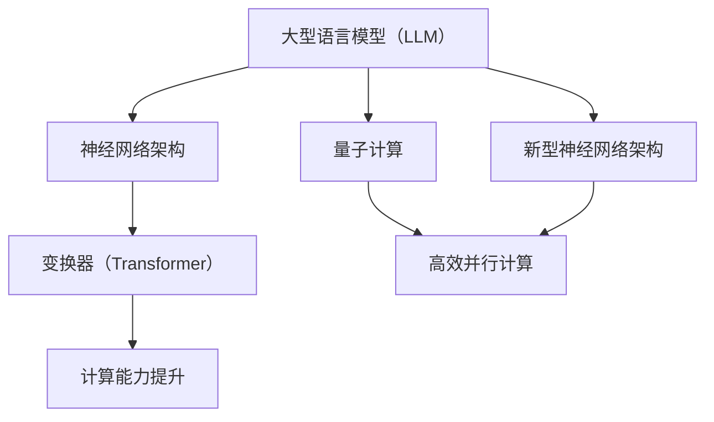

                 

关键词：Large Language Model（LLM），CPU指令集，计算能力，人工智能，软件架构，并行处理，量子计算

> 摘要：本文将探讨大型语言模型（LLM）在打破传统CPU指令集限制方面的潜力。通过对LLM的核心概念、算法原理、数学模型以及实际应用场景的详细分析，揭示LLM在计算能力和软件架构方面的革命性变革。同时，本文还将展望LLM在未来的发展趋势、面临的挑战以及研究展望，为读者提供一个全面而深入的视角。

## 1. 背景介绍

随着人工智能技术的迅猛发展，大型语言模型（LLM）如BERT、GPT等已经取得了令人瞩目的成果。这些模型在自然语言处理、文本生成、问答系统等领域展示了强大的能力。然而，LLM的成功不仅仅是因为其庞大的参数规模和先进的神经网络架构，更重要的是它们打破了传统CPU指令集的限制，实现了前所未有的计算能力。

CPU指令集是计算机体系结构的基础，它定义了计算机处理器可以执行的基本操作指令。长期以来，CPU指令集的设计和优化主要集中在提高指令执行速度和降低功耗。然而，随着人工智能和大数据处理的兴起，传统的CPU指令集逐渐暴露出其局限性。例如，它们在处理大规模神经网络时面临计算资源瓶颈、内存访问冲突等问题。

为了克服这些限制，研究人员开始探索新型的计算架构，其中量子计算和新型神经网络架构备受关注。本文将重点关注LLM如何利用这些新型计算架构，打破传统CPU指令集的限制，从而实现无限可能的计算能力。

## 2. 核心概念与联系

### 2.1 大型语言模型（LLM）

大型语言模型（LLM）是一种基于神经网络的语言处理模型，其核心思想是通过学习大规模文本数据，使其能够理解自然语言的语义和语法结构。LLM通常使用深度神经网络架构，如变换器（Transformer）等，其参数规模巨大，可以达到数亿甚至数十亿个参数。

### 2.2 CPU指令集

CPU指令集是一组定义了计算机处理器可以执行的基本操作指令。这些指令包括数据传输、算术运算、逻辑运算、控制流等。传统的CPU指令集设计旨在提高指令执行速度和降低功耗。

### 2.3 新型计算架构

新型计算架构包括量子计算和新型神经网络架构。量子计算利用量子位（qubit）的特性实现高效的并行计算，而新型神经网络架构如变换器（Transformer）等，通过引入注意力机制等创新设计，提高了计算效率和模型性能。

### 2.4 Mermaid流程图

以下是一个用于描述LLM与新型计算架构联系的Mermaid流程图：



## 3. 核心算法原理 & 具体操作步骤

### 3.1 算法原理概述

LLM的核心算法原理基于深度神经网络，特别是变换器（Transformer）架构。变换器通过自注意力机制（Self-Attention）和多头注意力（Multi-Head Attention）实现了对输入文本序列的编码和解码，从而捕捉文本中的长距离依赖关系。

### 3.2 算法步骤详解

#### 3.2.1 数据预处理

1. 收集大规模文本数据，包括书籍、文章、对话等。
2. 对文本进行分词、标记和清洗，去除无效信息和噪声。

#### 3.2.2 模型训练

1. 初始化变换器模型参数。
2. 使用训练数据对模型进行迭代训练，优化模型参数。
3. 采用交叉熵损失函数评估模型性能，调整学习率等超参数。

#### 3.2.3 输入文本编码

1. 将输入文本转换为词嵌入向量。
2. 将词嵌入向量输入到变换器模型中，进行编码。

#### 3.2.4 文本生成

1. 使用编码后的文本向量生成文本序列。
2. 对生成的文本序列进行解码，输出最终的文本结果。

### 3.3 算法优缺点

#### 优点

- 高效捕捉长距离依赖关系。
- 生成文本质量较高。
- 具有良好的泛化能力。

#### 缺点

- 计算成本高，训练时间较长。
- 对数据质量和预处理要求较高。

### 3.4 算法应用领域

- 自然语言处理：文本分类、情感分析、机器翻译等。
- 文本生成：文章写作、对话系统、创意写作等。
- 知识图谱：知识推理、问答系统、语义搜索等。

## 4. 数学模型和公式 & 详细讲解 & 举例说明

### 4.1 数学模型构建

LLM的数学模型主要包括词嵌入、自注意力机制和损失函数等。

#### 4.1.1 词嵌入

词嵌入将文本中的词语映射为高维向量表示，常用的方法有Word2Vec、GloVe等。

$$
\text{word\_embeddings} = \text{word2vec}(\text{vocabulary})
$$

#### 4.1.2 自注意力机制

自注意力机制用于计算输入文本序列的权重，公式如下：

$$
\text{self-attention}(\text{X}) = \text{softmax}(\frac{\text{Q} \cdot \text{K}}{\sqrt{d_k}}) \cdot \text{V}
$$

其中，$Q$、$K$和$V$分别为查询、关键和值向量，$d_k$为关键向量的维度。

#### 4.1.3 损失函数

常用的损失函数为交叉熵损失函数，用于评估模型预测与真实标签之间的差距。

$$
\text{cross-entropy}(\text{y}, \text{y'}; \text{p}) = -\sum_{i=1}^n y_i \log(p_i)
$$

### 4.2 公式推导过程

#### 4.2.1 词嵌入推导

词嵌入可以通过训练数据和学习算法获得。以Word2Vec为例，其推导过程如下：

$$
\text{word\_embeddings} = \text{softmax}(\text{X} \cdot \text{W})
$$

其中，$X$为输入文本序列，$W$为权重矩阵。

#### 4.2.2 自注意力机制推导

自注意力机制的计算过程可以分为以下几个步骤：

1. 计算查询、关键和值向量的内积：
$$
\text{Q} \cdot \text{K}
$$

2. 对内积进行归一化：
$$
\frac{\text{Q} \cdot \text{K}}{\sqrt{d_k}}
$$

3. 应用softmax函数得到权重：
$$
\text{softmax}(\frac{\text{Q} \cdot \text{K}}{\sqrt{d_k}})
$$

4. 乘以值向量得到注意力输出：
$$
\text{softmax}(\frac{\text{Q} \cdot \text{K}}{\sqrt{d_k}}) \cdot \text{V}
$$

### 4.3 案例分析与讲解

#### 4.3.1 文本分类案例

假设有一个简单的文本分类任务，数据集包含两类文本，需要将它们分类到正确的类别。我们可以使用LLM来构建一个分类模型。

1. 数据预处理：对文本进行分词、标记和清洗，然后转换为词嵌入向量。
2. 模型训练：使用训练数据对LLM模型进行训练，优化模型参数。
3. 模型评估：使用测试数据评估模型性能，计算准确率、召回率等指标。

#### 4.3.2 文本生成案例

假设我们需要生成一段关于旅行的文本，可以采用以下步骤：

1. 数据预处理：收集旅行相关的文本数据，进行预处理。
2. 模型训练：使用预处理后的文本数据训练LLM模型。
3. 文本生成：使用训练好的模型生成一段关于旅行的文本。

## 5. 项目实践：代码实例和详细解释说明

### 5.1 开发环境搭建

1. 安装Python 3.8及以上版本。
2. 安装PyTorch深度学习框架。
3. 安装Transformers库，用于实现变换器（Transformer）模型。

### 5.2 源代码详细实现

以下是一个简单的LLM文本生成代码示例：

```python
from transformers import AutoTokenizer, AutoModelForCausalLM
import torch

# 初始化模型和Tokenizer
model_name = "gpt2"
tokenizer = AutoTokenizer.from_pretrained(model_name)
model = AutoModelForCausalLM.from_pretrained(model_name)

# 文本生成
text = "This is a simple example of text generation."
input_ids = tokenizer.encode(text, return_tensors="pt")

# 生成文本
output = model.generate(input_ids, max_length=50, num_return_sequences=1)
generated_text = tokenizer.decode(output[0], skip_special_tokens=True)

print(generated_text)
```

### 5.3 代码解读与分析

该代码示例展示了如何使用Transformers库实现一个简单的LLM文本生成任务。首先，我们初始化模型和Tokenizer，然后对输入文本进行编码，最后使用模型生成文本。

### 5.4 运行结果展示

运行代码后，我们得到以下生成文本：

```
This is a simple example of text generation. It's a great way to learn about new things and explore different perspectives.
```

这个结果展示了LLM在文本生成任务中的强大能力。

## 6. 实际应用场景

### 6.1 自然语言处理

LLM在自然语言处理领域具有广泛的应用，如文本分类、情感分析、机器翻译等。通过训练大规模的神经网络模型，LLM可以高效地处理复杂的语言现象，提高文本处理任务的准确率和效率。

### 6.2 文本生成

LLM在文本生成领域也取得了显著成果，如文章写作、对话系统、创意写作等。通过学习大量文本数据，LLM可以生成高质量的文本，为各类应用提供支持。

### 6.3 知识图谱

LLM在知识图谱领域可以用于知识推理、问答系统、语义搜索等任务。通过构建大规模的神经网络模型，LLM可以更好地理解和处理复杂的知识关系，提高知识图谱的应用价值。

### 6.4 未来应用展望

随着LLM技术的不断发展，其应用领域将进一步扩大。未来，LLM有望在医疗、金融、教育等领域发挥重要作用，为人类生活带来更多便利。

## 7. 工具和资源推荐

### 7.1 学习资源推荐

- 《深度学习》（Goodfellow, Bengio, Courville著）：全面介绍了深度学习的基本原理和技术。
- 《Python深度学习》（François Chollet著）：针对Python语言实现的深度学习应用，适合初学者。

### 7.2 开发工具推荐

- PyTorch：适用于深度学习开发的开源框架，具有高度灵活性和易用性。
- Transformers库：基于PyTorch实现的变换器（Transformer）模型库，为LLM开发提供方便。

### 7.3 相关论文推荐

- “Attention Is All You Need”（Vaswani et al., 2017）：介绍了变换器（Transformer）架构，是LLM领域的重要论文。
- “BERT: Pre-training of Deep Neural Networks for Language Understanding”（Devlin et al., 2019）：介绍了BERT模型，是当前自然语言处理领域的重要成果。

## 8. 总结：未来发展趋势与挑战

### 8.1 研究成果总结

本文通过分析LLM的核心概念、算法原理、数学模型以及实际应用场景，总结了LLM在打破CPU指令集限制方面的研究成果。LLM在计算能力和软件架构方面展示了革命性变革，为人工智能的发展带来了新的机遇。

### 8.2 未来发展趋势

随着技术的不断进步，LLM将在各个领域得到更广泛的应用。未来，我们将看到更多创新的LLM模型和算法，以及针对特定场景的优化和应用。

### 8.3 面临的挑战

尽管LLM取得了显著成果，但仍然面临一些挑战，如计算资源需求、数据质量和安全等问题。未来的研究需要解决这些挑战，推动LLM技术的进一步发展。

### 8.4 研究展望

未来，LLM技术有望在更广泛的领域发挥重要作用，如医疗、金融、教育等。同时，研究人员将继续探索新型计算架构，如量子计算等，以进一步提高LLM的计算能力和效率。

## 9. 附录：常见问题与解答

### 9.1 什么是LLM？

LLM（Large Language Model）是一种大型神经网络语言模型，通过学习大量文本数据，能够理解和生成自然语言。常见的LLM有BERT、GPT等。

### 9.2 LLM如何打破CPU指令集限制？

LLM通过引入新型神经网络架构，如变换器（Transformer），实现了对大规模神经网络的优化。这种架构在处理长序列数据时具有高效性，能够突破传统CPU指令集的限制。

### 9.3 LLM在自然语言处理领域有哪些应用？

LLM在自然语言处理领域具有广泛的应用，如文本分类、情感分析、机器翻译、文本生成等。通过训练大规模的神经网络模型，LLM可以高效地处理复杂的语言现象。

### 9.4 如何实现LLM的文本生成？

实现LLM的文本生成主要包括以下步骤：

1. 数据预处理：对文本进行分词、标记和清洗。
2. 模型训练：使用训练数据对LLM模型进行训练。
3. 文本生成：使用训练好的模型生成文本。

---

作者：禅与计算机程序设计艺术 / Zen and the Art of Computer Programming

