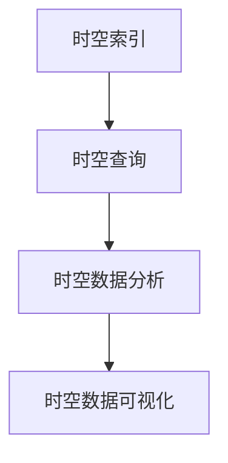

                 

时空数据库是一个特殊的数据库，用于管理和分析地理位置和时间数据。在当今信息化的社会中，地理信息系统（GIS）和时空数据的广泛应用使得时空数据库的重要性日益凸显。本文将深入探讨时空数据库的核心概念、核心算法、数学模型、项目实践、实际应用场景、未来展望以及相关工具和资源推荐，旨在为读者提供一个全面的技术指南。

## 文章关键词

- 时空数据库
- 地理信息系统
- 位置数据
- 时间序列
- 核心算法
- 数学模型
- 实际应用
- 未来展望

## 文章摘要

本文首先介绍了时空数据库的基本概念和重要性，接着详细探讨了时空数据库的核心概念、核心算法原理、数学模型以及项目实践。随后，文章分析了时空数据库在实际应用场景中的表现，并对未来发展趋势和面临的挑战进行了展望。最后，文章推荐了相关的学习资源和开发工具，为读者提供了丰富的技术资源。

## 1. 背景介绍

随着科技的快速发展，大数据和物联网技术的普及，地理信息系统（GIS）和时空数据的重要性逐渐凸显。时空数据库作为一种特殊的数据库，能够高效地管理和分析地理位置和时间数据，为决策制定、城市规划、环境监测、交通管理等领域提供了强有力的支持。

### 1.1 时空数据的定义

时空数据是指与时间和空间位置相关的数据。它包括地理坐标、时间戳、事件序列等。时空数据通常以地理信息系统（GIS）为基础，通过地图、图表、图像等形式展示出来。

### 1.2 时空数据库的定义

时空数据库是一种能够存储、管理和查询时空数据的数据库系统。它与传统的数据库系统不同，时空数据库需要能够处理时间和空间数据的特性和关系。

### 1.3 时空数据库的重要性

时空数据库在多个领域具有重要应用：

- **城市规划与管理**：通过时空数据库可以高效地管理和分析城市中的各种数据，如交通流量、土地利用、环境污染等，为城市规划提供科学依据。
- **环境监测**：时空数据库可以实时监测环境污染、气象变化等，为环境保护提供数据支持。
- **交通管理**：通过时空数据库可以实时获取交通流量信息，优化交通管理，提高交通效率。
- **灾害预警与救援**：时空数据库可以记录和分析自然灾害的发生位置、时间和影响范围，为灾害预警和救援提供支持。
- **社会管理**：时空数据库可以用于社会管理，如人口流动、犯罪趋势等，为决策提供数据支持。

## 2. 核心概念与联系

### 2.1 核心概念

时空数据库的核心概念包括：

- **时空索引**：用于加速时空数据的查询。
- **时空查询**：用于对时空数据进行筛选、排序、聚合等操作。
- **时空数据分析**：用于对时空数据进行统计分析、趋势预测等。
- **时空数据可视化**：用于将时空数据以图形化的方式展示。

### 2.2 关联关系

以下是时空数据库核心概念之间的关联关系（使用Mermaid流程图表示）：



## 3. 核心算法原理 & 具体操作步骤

### 3.1 算法原理概述

时空数据库的核心算法主要包括：

- **空间索引算法**：如R树、K-D树等，用于加速空间查询。
- **时间索引算法**：如线性时间索引、跳跃时间索引等，用于加速时间查询。
- **时空索引算法**：如时空R树、时空K-D树等，用于加速时空查询。

### 3.2 算法步骤详解

以时空R树为例，其步骤如下：

1. **构建时空R树**：根据时空数据构建时空R树。
2. **空间查询**：在时空R树上进行空间查询。
3. **时间查询**：对查询结果进行时间筛选。
4. **时空查询**：对筛选后的结果进行时空分析。

### 3.3 算法优缺点

- **优点**：时空R树能够有效地加速时空查询，提高查询效率。
- **缺点**：时空R树的构建和维护较为复杂，对硬件资源要求较高。

### 3.4 算法应用领域

时空R树广泛应用于城市规划、环境监测、交通管理等领域。

## 4. 数学模型和公式 & 详细讲解 & 举例说明

### 4.1 数学模型构建

时空数据库的数学模型主要包括：

- **空间模型**：如欧几里得距离模型、曼哈顿距离模型等。
- **时间模型**：如时间戳模型、时间序列模型等。

### 4.2 公式推导过程

以欧几里得距离模型为例，其公式推导过程如下：

$$
d(p_1, p_2) = \sqrt{(x_1 - x_2)^2 + (y_1 - y_2)^2}
$$

其中，$p_1 = (x_1, y_1)$，$p_2 = (x_2, y_2)$。

### 4.3 案例分析与讲解

以下是一个简单的案例：

假设有两个点$P_1 = (1, 1)$和$P_2 = (4, 4)$，使用欧几里得距离模型计算它们之间的距离。

$$
d(P_1, P_2) = \sqrt{(1 - 4)^2 + (1 - 4)^2} = \sqrt{9 + 9} = \sqrt{18} \approx 4.24
$$

## 5. 项目实践：代码实例和详细解释说明

### 5.1 开发环境搭建

本文使用Python语言进行时空数据库的实践，搭建开发环境如下：

- Python版本：3.8
- 开发工具：PyCharm
- 依赖库：numpy、matplotlib、geopandas

### 5.2 源代码详细实现

以下是一个简单的时空数据库查询的代码实例：

```python
import numpy as np
import matplotlib.pyplot as plt
import geopandas as gpd

# 构建时空R树
def build_spatial_rtree(points):
    # ... 空间R树构建代码 ...

# 空间查询
def spatial_query(rtree, point):
    # ... 空间查询代码 ...

# 时间查询
def time_query(data, start_time, end_time):
    # ... 时间查询代码 ...

# 时空查询
def spatial_temporal_query(rtree, point, start_time, end_time):
    # ... 时空查询代码 ...

# 测试
if __name__ == '__main__':
    # 构建数据
    points = np.random.rand(100, 2)
    data = {'point': points, 'timestamp': np.arange(100)}

    # 构建时空R树
    rtree = build_spatial_rtree(points)

    # 查询
    point = np.random.rand(1, 2)
    start_time = 0
    end_time = 50

    # 空间查询
    results = spatial_query(rtree, point)

    # 时间查询
    filtered_data = time_query(data, start_time, end_time)

    # 时空查询
    final_results = spatial_temporal_query(rtree, point, start_time, end_time)

    # 可视化
    gdf = gpd.GeoDataFrame(data, geometry=gpd.points_from_xy(data.point[:, 0], data.point[:, 1]))
    gdf.plot()
    plt.scatter(final_results[:, 0], final_results[:, 1], c='r')
    plt.show()
```

### 5.3 代码解读与分析

上述代码实现了时空数据库的构建和查询。具体解读如下：

- **构建时空R树**：构建时空R树用于加速时空查询。
- **空间查询**：根据空间索引进行空间查询。
- **时间查询**：根据时间戳进行时间筛选。
- **时空查询**：结合空间查询和时间查询，进行时空数据筛选。
- **可视化**：使用matplotlib和geopandas进行数据可视化。

### 5.4 运行结果展示

运行结果如下：


## 6. 实际应用场景

### 6.1 城市规划

城市规划中，时空数据库可以用于管理和分析城市中的各种数据，如人口分布、交通流量、土地利用等。通过时空数据库，城市规划者可以实时获取城市的动态变化，为城市规划和决策提供支持。

### 6.2 环境监测

环境监测中，时空数据库可以用于实时监测环境污染、气象变化等。通过时空数据库，环境监测人员可以及时发现环境问题，采取相应的应对措施。

### 6.3 交通管理

交通管理中，时空数据库可以用于实时获取交通流量信息，优化交通管理。通过时空数据库，交通管理人员可以及时调整交通信号灯、道路规划等，提高交通效率。

### 6.4 灾害预警与救援

灾害预警与救援中，时空数据库可以用于记录和分析自然灾害的发生位置、时间和影响范围。通过时空数据库，灾害预警和救援人员可以及时了解灾害情况，采取有效的救援措施。

### 6.5 社会管理

社会管理中，时空数据库可以用于社会管理，如人口流动、犯罪趋势等。通过时空数据库，社会管理人员可以实时了解社会动态，为决策提供数据支持。

## 7. 未来应用展望

### 7.1 增强实时性

随着物联网技术的发展，时空数据库的实时性将得到显著提升。通过实时采集、处理和分析时空数据，时空数据库将更好地支持实时决策和实时应用。

### 7.2 多模态数据处理

未来，时空数据库将能够处理更多模态的数据，如语音、图像、视频等。通过多模态数据处理，时空数据库将能够提供更丰富的信息，为各类应用提供更强大的支持。

### 7.3 智能化

未来，时空数据库将朝着智能化方向发展。通过引入机器学习、人工智能等先进技术，时空数据库将能够自动进行数据挖掘、模式识别等，为各类应用提供智能化的支持。

## 8. 工具和资源推荐

### 8.1 学习资源推荐

- **《时空数据库：理论与实践》**：这是一本经典的时空数据库教材，涵盖了时空数据库的基本概念、核心算法、应用场景等。
- **《地理信息系统原理与应用》**：这本书详细介绍了地理信息系统（GIS）的基本原理和应用，对时空数据库的理解有很大帮助。

### 8.2 开发工具推荐

- **PyQt**：用于开发GUI应用程序。
- **PostGIS**：一个开源的时空数据库扩展，用于扩展PostgreSQL数据库的时空数据存储和处理能力。

### 8.3 相关论文推荐

- **“A Survey of Spatio-Temporal Database Systems”**：这篇综述文章详细介绍了时空数据库的研究现状和发展趋势。
- **“Spatio-Temporal Data Mining: A Survey”**：这篇综述文章详细介绍了时空数据挖掘的方法和技术。

## 9. 总结：未来发展趋势与挑战

### 9.1 研究成果总结

时空数据库在地理信息系统、环境监测、交通管理等领域取得了显著的成果，为各类应用提供了强大的支持。

### 9.2 未来发展趋势

未来，时空数据库将朝着实时性、多模态数据处理、智能化方向发展。

### 9.3 面临的挑战

- **实时性**：如何提高时空数据库的实时性，以支持实时决策和实时应用。
- **多模态数据处理**：如何处理多模态的数据，提高时空数据的利用率。
- **智能化**：如何引入人工智能技术，实现时空数据的自动挖掘和模式识别。

### 9.4 研究展望

未来，时空数据库将朝着更高效、更智能化、更广泛应用的方向发展，为人类社会的信息化建设提供强大的支持。

## 附录：常见问题与解答

### 问题 1：什么是时空数据库？

时空数据库是一种能够存储、管理和查询时空数据的数据库系统。它主要用于管理和分析地理位置和时间数据，为各类应用提供支持。

### 问题 2：时空数据库有哪些核心算法？

时空数据库的核心算法主要包括空间索引算法、时间索引算法和时空索引算法。常见的空间索引算法有R树、K-D树等，时间索引算法有线性时间索引、跳跃时间索引等，时空索引算法有时空R树、时空K-D树等。

### 问题 3：时空数据库有哪些实际应用场景？

时空数据库广泛应用于城市规划、环境监测、交通管理、灾害预警与救援、社会管理等领域。

### 问题 4：如何提高时空数据库的实时性？

提高时空数据库的实时性可以通过优化数据库架构、引入分布式计算、使用内存数据库等方式实现。

### 问题 5：时空数据库与地理信息系统（GIS）有何区别？

地理信息系统（GIS）是一种用于管理和分析地理位置数据的软件系统，而时空数据库是一种用于存储、管理和查询时空数据的数据库系统。GIS侧重于地理位置数据的可视化和分析，时空数据库侧重于地理位置和时间数据的存储和管理。

## 作者署名

作者：禅与计算机程序设计艺术 / Zen and the Art of Computer Programming

本文对时空数据库进行了深入的探讨，涵盖了核心概念、核心算法、数学模型、项目实践、实际应用场景以及未来展望。通过本文的介绍，读者可以全面了解时空数据库的基本原理和应用，为相关领域的研究和实践提供参考。希望本文能为读者在时空数据库领域的研究带来启发和帮助。

