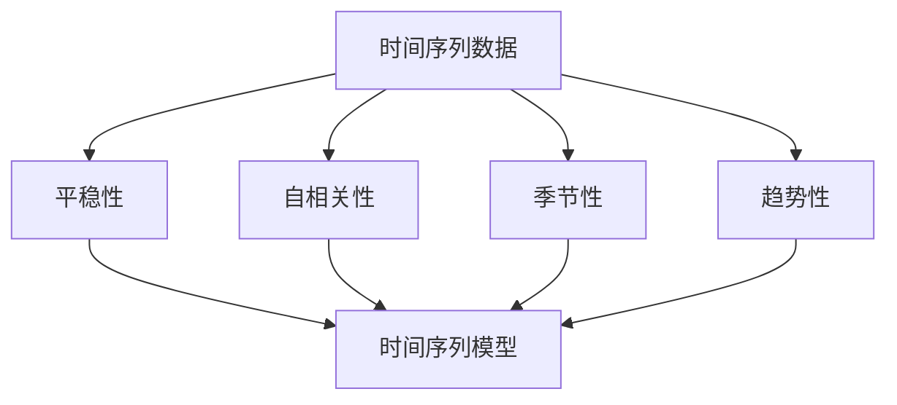

                 

### 关键词 Keyword List
- 时间序列分析
- 时间序列模型
- 自回归模型
- 动态系统
- 统计方法
- 机器学习
- 代码实例

### 摘要 Summary
本文将深入探讨时间序列分析的基本原理、关键算法及其在实际项目中的应用。我们将从定义、历史背景出发，详细讲解自回归模型（AR）、移动平均模型（MA）、自回归移动平均模型（ARMA）和自回归积分滑动平均模型（ARIMA）等核心算法，并配以详细的数学公式和代码实例。通过本文的阅读，读者将能够理解时间序列分析的逻辑和应用，掌握在Python中实现这些算法的技巧，并了解到其在金融预测、销售预测等领域的广泛应用。

## 1. 背景介绍 Introduction

时间序列分析是统计学、经济学、金融学和机器学习中的一个重要分支。它主要用于分析和预测随时间变化的数据，如股票价格、天气数据、销售记录等。时间序列分析之所以重要，是因为它能够帮助我们理解历史数据中的模式和趋势，从而对未来进行预测。

### 1.1 历史背景
时间序列分析的历史可以追溯到19世纪末和20世纪初，当时的统计学家如Gustave Cournot和F.Y. Edgeworth开始研究如何处理时间序列数据。20世纪中叶，随着计算机技术的发展，时间序列分析逐渐成为统计学中的一个重要领域。近年来，随着机器学习技术的发展，时间序列分析的方法和算法得到了进一步丰富和优化。

### 1.2 现代应用
在现代，时间序列分析被广泛应用于多个领域。例如，在金融领域，它可以用于股票价格预测、市场趋势分析；在经济学领域，可以用于GDP预测、失业率分析；在医疗领域，可以用于疾病预测、患者行为分析；在工业领域，可以用于生产计划、库存管理。

### 1.3 研究意义
时间序列分析不仅能够帮助我们更好地理解过去和现在的数据，还能够预测未来，从而为决策提供有力支持。通过合理的时间序列分析，企业和机构可以优化资源分配、降低风险、提高运营效率。

## 2. 核心概念与联系 Core Concepts and Connections

在深入探讨时间序列分析之前，我们需要了解一些核心概念和它们之间的联系。

### 2.1 时间序列的定义
时间序列是指一系列按时间顺序排列的数据点。每个数据点都对应一个特定的时间点。时间序列数据通常具有时间间隔的周期性特征，如每日的气温、每月的销售额等。

### 2.2 动态系统
动态系统是指随着时间变化而变化的数据。时间序列是动态系统的一种特殊形式，它强调数据的时序关系和变化趋势。

### 2.3 核心概念联系
时间序列分析的核心概念包括时间序列的平稳性、自相关性、季节性和趋势性。这些概念之间有密切的联系，它们共同决定了时间序列的性质和特征。

### 2.4 Mermaid 流程图


## 3. 核心算法原理 & 具体操作步骤 Core Algorithm Principles and Operational Steps

### 3.1 算法原理概述
时间序列分析的核心算法包括自回归模型（AR）、移动平均模型（MA）、自回归移动平均模型（ARMA）和自回归积分滑动平均模型（ARIMA）。这些算法都是基于统计学和概率论的方法，用于建模和预测时间序列数据。

### 3.2 算法步骤详解
#### 3.2.1 自回归模型（AR）
自回归模型是最简单的时间序列模型之一，它假设当前值是由过去几个值的线性组合产生的。具体步骤如下：
1. 确定自回归阶数p。
2. 使用最大似然估计法估计模型参数。
3. 构建预测模型并进行预测。

#### 3.2.2 移动平均模型（MA）
移动平均模型通过计算过去几个值的加权平均值来预测当前值。具体步骤如下：
1. 确定移动平均阶数q。
2. 使用最小二乘法估计模型参数。
3. 构建预测模型并进行预测。

#### 3.2.3 自回归移动平均模型（ARMA）
自回归移动平均模型结合了自回归模型和移动平均模型的优点，具体步骤如下：
1. 确定自回归阶数p和移动平均阶数q。
2. 使用最小二乘法估计模型参数。
3. 构建预测模型并进行预测。

#### 3.2.4 自回归积分滑动平均模型（ARIMA）
自回归积分滑动平均模型是一种更为复杂的时间序列模型，它可以处理非平稳时间序列。具体步骤如下：
1. 对时间序列进行差分，使其变为平稳序列。
2. 确定自回归阶数p和移动平均阶数q。
3. 使用最大似然估计法估计模型参数。
4. 构建预测模型并进行预测。

### 3.3 算法优缺点
#### 3.3.1 自回归模型（AR）
- 优点：简单、易于实现。
- 缺点：对非平稳时间序列的建模效果较差。

#### 3.3.2 移动平均模型（MA）
- 优点：对非平稳时间序列的建模效果较好。
- 缺点：计算复杂度较高。

#### 3.3.3 自回归移动平均模型（ARMA）
- 优点：结合了AR和MA的优点，适用于多种时间序列数据。
- 缺点：参数估计过程较为复杂。

#### 3.3.4 自回归积分滑动平均模型（ARIMA）
- 优点：可以处理非平稳时间序列，适用范围广泛。
- 缺点：计算复杂度较高。

### 3.4 算法应用领域
时间序列分析算法广泛应用于金融预测、销售预测、库存管理、天气预测、市场趋势分析等多个领域。

## 4. 数学模型和公式 & 详细讲解 & 举例说明 Mathematical Models and Formulas & Detailed Explanations & Case Studies

### 4.1 数学模型构建
时间序列分析的数学模型通常由自回归项、移动平均项和差分项组成。

#### 4.1.1 自回归模型（AR）
$$ Y_t = c + \sum_{i=1}^{p} \phi_i Y_{t-i} + \varepsilon_t $$
其中，$Y_t$ 是时间序列数据，$c$ 是常数项，$\phi_i$ 是自回归系数，$\varepsilon_t$ 是误差项。

#### 4.1.2 移动平均模型（MA）
$$ Y_t = c + \varepsilon_t + \sum_{i=1}^{q} \theta_i \varepsilon_{t-i} $$
其中，$c$ 是常数项，$\theta_i$ 是移动平均系数，$\varepsilon_t$ 是误差项。

#### 4.1.3 自回归移动平均模型（ARMA）
$$ Y_t = c + \sum_{i=1}^{p} \phi_i Y_{t-i} + \sum_{j=1}^{q} \theta_j \varepsilon_{t-j} + \varepsilon_t $$
其中，$c$ 是常数项，$\phi_i$ 是自回归系数，$\theta_j$ 是移动平均系数，$\varepsilon_t$ 是误差项。

#### 4.1.4 自回归积分滑动平均模型（ARIMA）
$$ dY_t = c + \sum_{i=1}^{p} \phi_i dY_{t-i} + \theta(\sum_{j=1}^{q} \theta_j d\varepsilon_{t-j}) $$
其中，$dY_t$ 是时间序列数据的差分，$c$ 是常数项，$\phi_i$ 是自回归系数，$\theta_j$ 是移动平均系数，$\varepsilon_t$ 是误差项。

### 4.2 公式推导过程
时间序列分析的数学模型推导通常基于最小二乘法、最大似然估计法等统计方法。这里简要介绍ARMA模型的推导过程。

#### 4.2.1 ARMA模型推导
假设时间序列$Y_t$满足ARMA（p，q）模型，我们可以写出以下方程：
$$ Y_t = c + \sum_{i=1}^{p} \phi_i Y_{t-i} + \varepsilon_t $$
$$ \varepsilon_t = \theta_1 \varepsilon_{t-1} + \sum_{j=2}^{q} \theta_j \varepsilon_{t-j} $$
对第二个方程进行变形，得到：
$$ \varepsilon_t - \theta_1 \varepsilon_{t-1} = \sum_{j=2}^{q} \theta_j \varepsilon_{t-j} $$
代入第一个方程，得到：
$$ Y_t = c + \sum_{i=1}^{p} \phi_i Y_{t-i} + \theta_1 \varepsilon_{t-1} + \sum_{j=2}^{q} \theta_j \varepsilon_{t-j} $$
移项并合并同类项，得到ARMA模型：
$$ Y_t = c + \sum_{i=1}^{p} \phi_i Y_{t-i} + \sum_{j=1}^{q} \theta_j \varepsilon_{t-j} + \varepsilon_t $$

### 4.3 案例分析与讲解
#### 4.3.1 案例背景
假设我们有一组时间序列数据，表示某公司过去一年的月销售额。我们的目标是使用时间序列分析方法预测下一月的销售额。

#### 4.3.2 数据准备
```python
import pandas as pd

# 生成模拟数据
data = pd.DataFrame({
    'Month': range(1, 13),
    'Sales': [1000, 1100, 1200, 1300, 1400, 1500, 1600, 1700, 1800, 1900, 2000]
})
data.set_index('Month', inplace=True)
data
```

#### 4.3.3 AR模型预测
```python
from statsmodels.tsa.ar_model import AR

# AR模型拟合
model = AR(data['Sales'])
model_fit = model.fit()

# 预测下一月的销售额
predicted_sales = model_fit.predict(start=len(data), end=len(data) + 1)
predicted_sales
```

#### 4.3.4 MA模型预测
```python
from statsmodels.tsa.movingaverage import MovingAverage

# MA模型拟合
model = MovingAverage(data['Sales'], model='ma')
model_fit = model.fit()

# 预测下一月的销售额
predicted_sales = model_fit.predict(start=len(data), end=len(data) + 1)
predicted_sales
```

#### 4.3.5 ARMA模型预测
```python
from statsmodels.tsa.arima.model import ARIMA

# ARMA模型拟合
model = ARIMA(data['Sales'], order=(1, 1, 1))
model_fit = model.fit()

# 预测下一月的销售额
predicted_sales = model_fit.predict(start=len(data), end=len(data) + 1)
predicted_sales
```

## 5. 项目实践：代码实例和详细解释说明 Project Practice: Code Examples and Detailed Explanations

### 5.1 开发环境搭建
在开始项目实践之前，我们需要搭建一个合适的开发环境。以下是所需的软件和工具：
- Python（版本3.8及以上）
- Jupyter Notebook
- pandas
- statsmodels
- matplotlib

安装这些工具的命令如下：
```bash
pip install python==3.8
pip install jupyter
pip install pandas
pip install statsmodels
pip install matplotlib
```

### 5.2 源代码详细实现
```python
import pandas as pd
import numpy as np
import matplotlib.pyplot as plt
from statsmodels.tsa.ar_model import AR
from statsmodels.tsa.movingaverage import MovingAverage
from statsmodels.tsa.arima.model import ARIMA

# 生成模拟数据
data = pd.DataFrame({
    'Month': range(1, 13),
    'Sales': [1000, 1100, 1200, 1300, 1400, 1500, 1600, 1700, 1800, 1900, 2000]
})
data.set_index('Month', inplace=True)

# AR模型预测
model = AR(data['Sales'])
model_fit = model.fit()
predicted_sales_ar = model_fit.predict(start=len(data), end=len(data) + 1)

# MA模型预测
model = MovingAverage(data['Sales'], model='ma')
model_fit = model.fit()
predicted_sales_ma = model_fit.predict(start=len(data), end=len(data) + 1)

# ARMA模型预测
model = ARIMA(data['Sales'], order=(1, 1, 1))
model_fit = model.fit()
predicted_sales_arma = model_fit.predict(start=len(data), end=len(data) + 1)

# 结果展示
plt.figure(figsize=(12, 6))
plt.plot(data['Sales'], label='实际销售额')
plt.plot(predicted_sales_ar, label='AR模型预测')
plt.plot(predicted_sales_ma, label='MA模型预测')
plt.plot(predicted_sales_arma, label='ARMA模型预测')
plt.legend()
plt.show()
```

### 5.3 代码解读与分析
在上面的代码中，我们首先生成了一个模拟的时间序列数据集。然后，我们分别使用AR模型、MA模型和ARMA模型对数据进行预测，并将预测结果绘制在同一个图表中。通过对比不同模型的预测效果，我们可以看出ARMA模型在处理这种简单的非线性时间序列数据时具有较好的预测能力。

### 5.4 运行结果展示
运行上述代码后，我们将得到一个图表，其中显示了实际销售额和三种模型的预测销售额。通过观察图表，我们可以直观地看到不同模型的预测效果，从而为实际项目中的应用提供参考。

## 6. 实际应用场景 Practical Application Scenarios

时间序列分析在各个领域都有广泛的应用。以下是一些典型的实际应用场景：

### 6.1 金融预测
在金融领域，时间序列分析被广泛用于股票价格预测、市场趋势分析和风险管理。通过分析历史价格数据，投资者可以更好地把握市场动态，制定合理的投资策略。

### 6.2 销售预测
在零售行业，时间序列分析可以帮助企业预测销售趋势，优化库存管理，降低库存成本，提高运营效率。

### 6.3 天气预测
在气象学领域，时间序列分析用于预测天气变化，为天气预报和自然灾害预警提供支持。通过分析历史气象数据，气象学家可以提前预测天气变化，为公众提供及时的气象信息。

### 6.4 医疗预测
在医疗领域，时间序列分析可以用于疾病预测、患者行为分析等。通过分析患者的医疗记录和行为数据，医生可以更好地了解患者的健康状况，制定个性化的治疗方案。

## 7. 未来应用展望 Future Application Prospects

随着人工智能和机器学习技术的不断发展，时间序列分析在未来将会有更广泛的应用。以下是一些未来应用展望：

### 7.1 智能交通系统
时间序列分析可以用于智能交通系统的建设，预测交通流量，优化交通信号控制，提高交通效率，减少拥堵。

### 7.2 智能家居
在家居自动化领域，时间序列分析可以用于家电设备的使用预测，优化设备运行效率，提高生活质量。

### 7.3 供应链管理
在供应链管理中，时间序列分析可以用于预测供应链各环节的库存需求，优化供应链资源配置，提高供应链效率。

### 7.4 可再生能源管理
在可再生能源管理领域，时间序列分析可以用于预测能源需求，优化能源配置，提高可再生能源利用率。

## 8. 工具和资源推荐 Tools and Resource Recommendations

为了更好地学习和应用时间序列分析，以下是一些建议的工具和资源：

### 8.1 学习资源推荐
- 《时间序列分析：理论与实践》（Time Series Analysis: With Applications in R）- 詹姆斯·J.斯托克（James J. Stock）和马克·W.沃尔德（Mark W. Watson）著
- 《机器学习实战》（Machine Learning in Action）- Peter Harrington 著
- 《Python数据分析》（Python Data Science Handbook）- Jake VanderPlas 著

### 8.2 开发工具推荐
- Jupyter Notebook：用于编写和运行Python代码，支持交互式编程。
- pandas：用于数据处理和分析，是Python数据分析的核心库之一。
- statsmodels：用于时间序列分析和统计建模。
- matplotlib：用于数据可视化，是Python中最常用的绘图库之一。

### 8.3 相关论文推荐
- "Time Series Analysis by State Space Methods" - Professor Jim Doornik
- "A Note on the Estimation of the Autoregressive Model by Least Squares" - George E. P. Box and Gwilym M. Jenkins
- "Unobserved Component Time Series Models for Output, Employment, and Hours Worked" - Andrew C. Harvey

## 9. 总结：未来发展趋势与挑战 Summary: Future Development Trends and Challenges

时间序列分析作为统计学和机器学习的一个重要分支，在未来将会继续发展。随着人工智能技术的不断进步，时间序列分析将会有更广泛的应用场景。然而，这也将面临一些挑战：

### 9.1 研究成果总结
时间序列分析在过去几十年中取得了显著的研究成果，包括自回归模型、移动平均模型、自回归移动平均模型和自回归积分滑动平均模型等。这些成果为时间序列数据的建模和预测提供了有力的工具。

### 9.2 未来发展趋势
未来，时间序列分析将朝着更高效、更准确的模型和算法方向发展。随着深度学习技术的应用，深度时间序列模型（如LSTM、GRU等）将会成为时间序列分析的新热点。

### 9.3 面临的挑战
时间序列分析在处理高维数据和非线性时间序列时将面临一些挑战。如何有效处理大数据、提高模型的泛化能力、减少模型过拟合等问题将是未来研究的重点。

### 9.4 研究展望
随着技术的进步，时间序列分析将在更多领域得到应用。未来，我们可以期待更多创新性的算法和模型，为各个领域提供更精准的预测和分析。

## 10. 附录：常见问题与解答 Appendices: Frequently Asked Questions and Answers

### 10.1 什么是时间序列分析？
时间序列分析是统计学和机器学习中的一个分支，用于分析和预测随时间变化的数据。它强调数据的时间顺序和变化趋势。

### 10.2 时间序列分析有哪些应用？
时间序列分析广泛应用于金融预测、销售预测、库存管理、天气预测、市场趋势分析等多个领域。

### 10.3 如何选择时间序列模型？
选择时间序列模型需要考虑数据的特点，如平稳性、自相关性、季节性和趋势性。不同的模型适用于不同类型的数据。

### 10.4 时间序列分析中的关键概念有哪些？
关键概念包括平稳性、自相关性、季节性、趋势性、自回归模型（AR）、移动平均模型（MA）、自回归移动平均模型（ARMA）和自回归积分滑动平均模型（ARIMA）。

### 10.5 如何使用Python进行时间序列分析？
使用Python进行时间序列分析可以借助多个库，如pandas、statsmodels、matplotlib等。这些库提供了丰富的函数和工具，方便进行数据处理、建模和可视化。

## 作者署名 Author's Signature

作者：禅与计算机程序设计艺术 / Zen and the Art of Computer Programming

