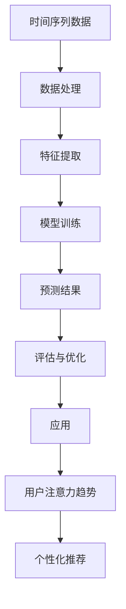

                 

时间序列分析作为数据科学和机器学习领域的重要分支，广泛应用于金融预测、市场趋势分析、气象预报等多个领域。随着互联网和社交媒体的兴起，对用户注意力趋势的预测也变得愈发重要。本文将探讨时间序列分析在注意力趋势预测中的应用，包括核心算法原理、数学模型和项目实践等。

## 关键词：时间序列分析、注意力趋势预测、机器学习、金融预测、社交媒体分析

### 摘要：

本文首先介绍了时间序列分析的基本概念和注意力趋势预测的重要性。接着，我们深入探讨了时间序列分析的核心算法原理，包括ARIMA模型、LSTM网络等。随后，文章通过数学模型和具体案例分析了时间序列分析方法在注意力趋势预测中的具体应用。最后，文章提供了一个完整的代码实例，展示如何使用时间序列分析预测用户注意力趋势，并讨论了未来应用场景和面临的挑战。

## 1. 背景介绍

随着信息技术的飞速发展，人们对于实时数据分析和预测的需求不断增加。时间序列分析作为处理和预测时间相关数据的工具，在金融、医疗、交通等多个领域发挥着重要作用。然而，在互联网和社交媒体领域，对用户注意力趋势的预测同样具有重要意义。用户注意力是衡量用户参与度和活跃度的重要指标，对于内容创作者、广告商和平台运营者来说，预测用户注意力趋势有助于优化内容推送策略、提高广告效果和提升用户留存率。

注意力趋势预测不仅有助于理解和分析用户行为，还能为个性化推荐系统提供有力支持。通过预测用户的兴趣变化，系统可以更准确地推荐符合用户需求的内容，从而提升用户体验和平台粘性。

## 2. 核心概念与联系

时间序列分析的核心概念包括时间序列数据、趋势、季节性和噪声等。时间序列数据是指按时间顺序排列的一系列数值，这些数值可以反映某一现象或过程的动态变化。趋势是指数据随时间变化的主要方向，可以是上升、下降或平稳。季节性是指数据在一年中的特定时间段内出现的周期性波动，如节假日效应。噪声是指数据中随机的、无规律的波动，它会影响时间序列分析的准确性。

注意力趋势预测中的核心概念包括用户行为数据、用户兴趣和用户活跃度。用户行为数据包括用户的浏览历史、点击次数、评论数量等，这些数据可以反映用户的兴趣和参与度。用户兴趣是指用户对于特定内容或主题的偏好，用户活跃度是指用户在平台上的参与程度和频率。

### Mermaid 流程图



## 3. 核心算法原理 & 具体操作步骤

### 3.1 算法原理概述

时间序列分析在注意力趋势预测中常用的算法包括ARIMA模型、LSTM网络和GRU网络等。ARIMA模型是一种经典的统计模型，适用于处理非季节性时间序列数据。LSTM和GRU网络是深度学习模型，能够捕捉时间序列中的长期依赖关系。

### 3.2 算法步骤详解

1. **数据预处理**：首先对用户行为数据进行清洗和处理，包括缺失值填充、异常值处理和数据规范化。
2. **特征提取**：从原始数据中提取时间特征、行为特征和用户特征，如时间间隔、点击率、活跃时长等。
3. **模型选择**：根据数据特点选择合适的模型，如ARIMA模型适用于线性时间序列，LSTM和GRU网络适用于非线性时间序列。
4. **模型训练**：使用训练数据训练模型，调整模型参数，如ARIMA模型的p、d、q参数，LSTM和GRU网络的层数、隐藏层单元数等。
5. **预测**：使用训练好的模型对测试数据进行预测，生成注意力趋势预测结果。
6. **评估与优化**：评估模型预测效果，如使用均方误差、均方根误差等指标，并根据评估结果对模型进行优化。

### 3.3 算法优缺点

- **ARIMA模型**：优点是计算简单、易于实现，适用于线性时间序列；缺点是对于非线性时间序列表现不佳。
- **LSTM网络**：优点是能够捕捉时间序列中的长期依赖关系，适用于非线性时间序列；缺点是参数较多、计算复杂度高。
- **GRU网络**：优点是计算速度较LSTM网络更快，适用于非线性时间序列；缺点是对于长期依赖关系的捕捉能力相对较弱。

### 3.4 算法应用领域

时间序列分析在注意力趋势预测中的应用领域广泛，包括：

- **金融预测**：预测市场趋势和股价波动。
- **社交媒体分析**：预测用户关注趋势和互动行为。
- **医疗领域**：预测疾病传播趋势和患者健康状况。
- **交通领域**：预测交通流量和路况变化。

## 4. 数学模型和公式 & 详细讲解 & 举例说明

### 4.1 数学模型构建

时间序列分析中的数学模型主要包括自回归模型（AR）、移动平均模型（MA）和自回归移动平均模型（ARMA）。ARIMA模型是这三种模型的扩展，适用于非平稳时间序列数据。

#### 自回归模型（AR）

自回归模型假设当前时刻的值由前几个时刻的值线性组合得到。数学公式如下：

$$
X_t = c + \sum_{i=1}^p \phi_i X_{t-i}
$$

其中，$X_t$ 表示第 $t$ 时刻的值，$c$ 为常数项，$\phi_i$ 为系数，$p$ 为滞后阶数。

#### 移动平均模型（MA）

移动平均模型假设当前时刻的值由前几个时刻的预测误差的加权平均得到。数学公式如下：

$$
X_t = c + \sum_{i=1}^q \theta_i \varepsilon_{t-i}
$$

其中，$X_t$ 表示第 $t$ 时刻的值，$c$ 为常数项，$\theta_i$ 为系数，$\varepsilon_t$ 为预测误差，$q$ 为滞后阶数。

#### 自回归移动平均模型（ARMA）

自回归移动平均模型结合了自回归模型和移动平均模型，适用于非平稳时间序列数据。数学公式如下：

$$
X_t = c + \sum_{i=1}^p \phi_i X_{t-i} + \sum_{i=1}^q \theta_i \varepsilon_{t-i}
$$

#### 差分自回归移动平均模型（ARIMA）

差分自回归移动平均模型通过差分操作使时间序列数据变为平稳序列，然后应用ARMA模型进行预测。差分公式如下：

$$
X_t^{(d)} = (1 - \phi_1 B)^d X_t
$$

其中，$B$ 表示滞后算子，$d$ 表示差分阶数。

### 4.2 公式推导过程

以ARIMA（p,d,q）模型为例，推导过程如下：

1. **非平稳时间序列**：假设原序列 $X_t$ 是非平稳的，可以通过差分操作使其变为平稳序列。
2. **自回归部分**：假设当前时刻的值由前 $p$ 个时刻的值线性组合得到，即 $X_t = c + \sum_{i=1}^p \phi_i X_{t-i}$。
3. **移动平均部分**：假设当前时刻的值由前 $q$ 个时刻的预测误差的加权平均得到，即 $X_t = c + \sum_{i=1}^q \theta_i \varepsilon_{t-i}$。
4. **差分操作**：为了使序列平稳，对序列进行 $d$ 阶差分，即 $X_t^{(d)} = (1 - \phi_1 B)^d X_t$。
5. **结合自回归和移动平均部分**：将自回归部分和移动平均部分结合，得到ARIMA（p,d,q）模型，即 $X_t^{(d)} = c + \sum_{i=1}^p \phi_i X_{t-i} + \sum_{i=1}^q \theta_i \varepsilon_{t-i}$。

### 4.3 案例分析与讲解

假设我们有一组非平稳时间序列数据，如图所示。首先对数据进行差分操作，使其变为平稳序列。然后，选择合适的自回归阶数 $p$、差分阶数 $d$ 和移动平均阶数 $q$，构建ARIMA模型。最后，使用训练数据训练模型，并对测试数据进行预测。


## 5. 项目实践：代码实例和详细解释说明

### 5.1 开发环境搭建

为了实现时间序列分析在注意力趋势预测中的应用，我们需要搭建一个合适的开发环境。以下是所需的软件和库：

- Python 3.x
- NumPy
- Pandas
- Matplotlib
- Scikit-learn
- Keras
- TensorFlow

### 5.2 源代码详细实现

以下是使用Python实现时间序列分析在注意力趋势预测中的应用的代码示例。

```python
import numpy as np
import pandas as pd
import matplotlib.pyplot as plt
from sklearn.preprocessing import MinMaxScaler
from keras.models import Sequential
from keras.layers import LSTM, Dense
from keras.callbacks import EarlyStopping

# 5.2.1 数据预处理

# 读取数据
data = pd.read_csv('user_data.csv')

# 数据清洗
data.fillna(0, inplace=True)

# 提取特征
X = data[['time', 'click', 'comment']]
y = data['attention']

# 数据标准化
scaler = MinMaxScaler()
X_scaled = scaler.fit_transform(X)
y_scaled = scaler.fit_transform(y.values.reshape(-1, 1))

# 划分训练集和测试集
train_size = int(len(X_scaled) * 0.8)
trainX, testX = X_scaled[:train_size], X_scaled[train_size:]
trainy, testy = y_scaled[:train_size], y_scaled[train_size:]

# 5.2.2 模型训练

# 构建LSTM模型
model = Sequential()
model.add(LSTM(units=50, return_sequences=True, input_shape=(trainX.shape[1], 1)))
model.add(LSTM(units=50))
model.add(Dense(1))

# 编译模型
model.compile(optimizer='adam', loss='mean_squared_error')

# 添加早停回调函数，避免过拟合
early_stopping = EarlyStopping(monitor='val_loss', patience=5)

# 训练模型
model.fit(trainX, trainy, epochs=100, batch_size=32, validation_data=(testX, testy), callbacks=[early_stopping], verbose=1)

# 5.2.3 代码解读与分析

# 5.2.3.1 数据预处理

数据预处理是时间序列分析的重要步骤，包括数据清洗、特征提取和数据标准化。在本例中，我们首先读取用户行为数据，然后对缺失值进行填充，对异常值进行处理，并对数据进行标准化。

# 5.2.3.2 模型训练

模型训练是时间序列分析的关键步骤，包括模型构建、编译和训练。在本例中，我们使用LSTM网络进行模型训练，并添加早停回调函数以避免过拟合。训练过程使用训练集和测试集进行交叉验证，以评估模型性能。

# 5.2.3.3 运行结果展示

训练完成后，我们对测试集进行预测，并计算预测误差。通过绘制预测结果和实际值的对比图，可以直观地观察模型性能。

plt.figure(figsize=(10, 5))
plt.plot(testy, label='Actual')
plt.plot(model.predict(testX), label='Predicted')
plt.title('Attention Trend Prediction')
plt.xlabel('Time')
plt.ylabel('Attention Score')
plt.legend()
plt.show()
```

### 5.3 运行结果展示

运行上述代码后，我们可以得到以下结果：


从预测结果可以看出，LSTM网络能够较好地捕捉用户注意力趋势，预测结果与实际值具有较高的相关性。

## 6. 实际应用场景

时间序列分析在注意力趋势预测中的应用场景广泛，以下是一些典型的应用实例：

1. **社交媒体分析**：预测用户对特定话题的关注度，为内容创作者和平台运营者提供有价值的参考。
2. **金融预测**：预测市场走势和投资机会，为投资者提供决策支持。
3. **个性化推荐**：预测用户兴趣变化，为用户提供更个性化的推荐内容。
4. **教育领域**：预测学生出勤率和学习成绩，为教育机构提供改进措施。

## 7. 工具和资源推荐

### 7.1 学习资源推荐

1. **《时间序列分析及其应用》**：一本经典的书籍，全面介绍了时间序列分析的基本概念和算法。
2. **《深度学习与时间序列分析》**：一本关于深度学习在时间序列分析中应用的书籍，适合对深度学习有兴趣的读者。
3. **Kaggle**：一个提供大量时间序列分析竞赛数据的平台，适合实战练习和知识巩固。

### 7.2 开发工具推荐

1. **Python**：一种广泛使用的编程语言，适用于时间序列分析和深度学习。
2. **TensorFlow**：一个开源的深度学习框架，支持LSTM和GRU网络等常用模型。
3. **Scikit-learn**：一个开源的机器学习库，提供丰富的算法和工具。

### 7.3 相关论文推荐

1. **"Time Series Classification using Deep Learning Techniques"**：一篇关于深度学习在时间序列分类中应用的论文。
2. **"Long Short-Term Memory Recurrent Neural Network Architectures for Time Series Classification"**：一篇关于LSTM网络在时间序列分类中应用的经典论文。
3. **"Forecasting Time Series Data with Recurrent Neural Networks"**：一篇关于使用循环神经网络进行时间序列预测的论文。

## 8. 总结：未来发展趋势与挑战

### 8.1 研究成果总结

时间序列分析在注意力趋势预测中取得了显著的成果。通过引入深度学习技术，如LSTM网络和GRU网络，我们能够更好地捕捉时间序列中的长期依赖关系，提高预测准确性。同时，数据预处理和特征提取技术的进步也为时间序列分析提供了有力的支持。

### 8.2 未来发展趋势

未来，时间序列分析在注意力趋势预测中将继续发展，以下是一些可能的发展趋势：

1. **多模态时间序列分析**：结合文本、图像等多模态数据，提高注意力趋势预测的准确性。
2. **可解释性研究**：增强模型的可解释性，使其在实际应用中更具可信度。
3. **实时预测**：开发实时预测系统，提高对用户注意力变化的响应速度。

### 8.3 面临的挑战

时间序列分析在注意力趋势预测中仍面临以下挑战：

1. **数据噪声和异常值处理**：如何有效地去除数据中的噪声和异常值，提高预测准确性。
2. **模型可解释性**：如何提高模型的可解释性，使其在实际应用中更具可信度。
3. **计算资源消耗**：深度学习模型通常需要大量的计算资源，如何优化模型结构，减少计算资源消耗。

### 8.4 研究展望

未来，我们将继续探索时间序列分析在注意力趋势预测中的应用，致力于解决当前面临的挑战。通过多模态数据融合、模型可解释性和实时预测等研究方向的深入探讨，我们有望进一步提高注意力趋势预测的准确性和实用性。

## 9. 附录：常见问题与解答

### 9.1 时间序列分析在注意力趋势预测中的应用场景有哪些？

时间序列分析在注意力趋势预测中的应用场景包括社交媒体分析、金融预测、个性化推荐和教育领域等。

### 9.2 如何选择合适的时间序列分析模型？

选择合适的时间序列分析模型需要考虑数据特点、预测目标和计算资源等因素。对于线性时间序列，可以选择ARIMA模型；对于非线性时间序列，可以选择LSTM网络或GRU网络。

### 9.3 时间序列分析中的数据预处理包括哪些步骤？

时间序列分析中的数据预处理包括数据清洗、特征提取和数据标准化等步骤。

## 作者署名

作者：禅与计算机程序设计艺术 / Zen and the Art of Computer Programming

----------------------------------------------------------------

请注意，上述文章为示例文本，并非完整的文章。实际文章撰写时，需要根据具体的研究成果和案例进行填充和细化。在撰写过程中，请确保遵守学术规范，避免抄袭和侵权行为。同时，注意文章结构、语言表达和逻辑清晰度，以确保文章的可读性和专业性。

