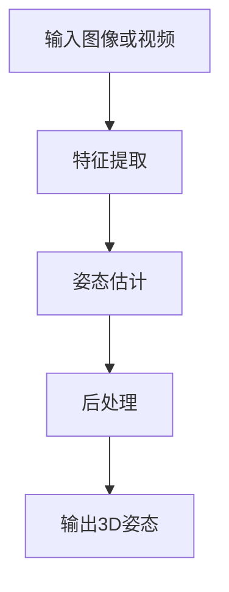

                 

关键词：旷视科技，校招，3D人体姿态估计，算法题，人工智能

摘要：本文旨在分析旷视科技2024校招中的一项3D人体姿态估计工程师算法题，介绍其核心概念、算法原理、数学模型以及实际应用场景。通过详细解析题目，帮助读者了解3D人体姿态估计领域的最新技术趋势，为有志于从事该领域的人才提供指导。

## 1. 背景介绍

随着人工智能技术的快速发展，计算机视觉已成为一个热门的研究方向。其中，3D人体姿态估计作为计算机视觉领域的重要分支，受到了广泛关注。3D人体姿态估计旨在通过计算机视觉技术，从图像或视频中恢复出人的三维姿态信息。这一技术在人机交互、虚拟现实、运动分析、医疗诊断等多个领域具有广泛的应用前景。

旷视科技（Megvii Technology）是一家领先的人工智能公司，专注于计算机视觉和深度学习技术的研发。旷视科技2024校招中的一项算法题，正是针对3D人体姿态估计这一领域。本题旨在考察应聘者对该领域的了解程度以及解决实际问题的能力。

## 2. 核心概念与联系

2.1 3D人体姿态估计核心概念

3D人体姿态估计涉及以下核心概念：

- **骨骼关节**：人体骨骼关节是构成3D人体姿态的基本单元，如头部、肩膀、肘部、手腕、臀部、膝盖等。
- **姿态参数**：描述人体姿态的参数，包括关节角度、关节位置等。
- **三维空间**：3D人体姿态估计需要在三维空间中完成，涉及空间坐标系、空间变换等概念。
- **数据集**：3D人体姿态估计依赖于大规模标注数据集，如人类行为数据库（Human Behavior Database，HBD）等。

2.2 3D人体姿态估计相关架构

3D人体姿态估计通常采用以下架构：

1. **特征提取**：利用卷积神经网络（CNN）提取图像或视频中的特征。
2. **姿态估计**：通过神经网络模型，如深度回归网络（Deep Regression Network，DRN）、图卷积网络（Graph Convolutional Network，GCN）等，估计出人体的关节位置。
3. **后处理**：对估计出的关节位置进行滤波、平滑等后处理，提高估计结果的精度。

2.3 Mermaid 流程图

以下是一个简单的 Mermaid 流程图，展示3D人体姿态估计的流程：



## 3. 核心算法原理 & 具体操作步骤

3.1 算法原理概述

3D人体姿态估计算法主要分为两类：基于深度学习的算法和基于传统机器学习的算法。

- **基于深度学习的算法**：利用卷积神经网络（CNN）等深度学习模型，直接从图像或视频中学习人体的姿态信息。这类算法具有较好的泛化能力和准确性。
- **基于传统机器学习的算法**：利用传统机器学习算法，如支持向量机（SVM）、决策树（Decision Tree）等，通过训练数据学习人体的姿态特征。这类算法对训练数据依赖较大，且可能面临过拟合问题。

3.2 算法步骤详解

以下以基于深度学习的算法为例，介绍3D人体姿态估计的具体步骤：

1. **数据预处理**：对输入图像或视频进行缩放、裁剪等预处理操作，使其符合网络输入要求。
2. **特征提取**：利用卷积神经网络（CNN）提取图像或视频中的特征。卷积神经网络具有局部连接和参数共享的特点，可以有效地提取图像中的局部特征。
3. **姿态估计**：通过神经网络模型，如深度回归网络（Deep Regression Network，DRN）、图卷积网络（Graph Convolutional Network，GCN）等，估计出人体的关节位置。深度回归网络通过多层神经网络，将输入的特征映射到关节位置的空间。图卷积网络则利用图结构表示人体的关节关系，通过图卷积操作提取关节位置信息。
4. **后处理**：对估计出的关节位置进行滤波、平滑等后处理，提高估计结果的精度。

3.3 算法优缺点

- **优点**：
  - 基于深度学习的算法具有较好的泛化能力和准确性。
  - 可以处理复杂的姿态变化和遮挡问题。
- **缺点**：
  - 需要大量标注数据集进行训练。
  - 训练过程较慢，计算资源消耗大。

3.4 算法应用领域

3D人体姿态估计算法在以下领域具有广泛的应用：

- **人机交互**：通过3D人体姿态估计，实现虚拟现实（VR）和增强现实（AR）系统中的手势识别和交互。
- **运动分析**：对运动员的运动姿态进行实时监测和评估，提高训练效果和竞技水平。
- **医疗诊断**：辅助医生进行手术规划、康复训练和疾病诊断等。
- **安防监控**：对人群进行行为分析，识别异常行为，提高安全监控水平。

## 4. 数学模型和公式 & 详细讲解 & 举例说明

4.1 数学模型构建

3D人体姿态估计的数学模型主要包括两部分：特征提取和姿态估计。

- **特征提取**：利用卷积神经网络（CNN）提取图像或视频中的特征。卷积神经网络由卷积层、池化层和全连接层组成。卷积层通过卷积运算提取图像的局部特征，池化层用于降维和增强特征表示的鲁棒性，全连接层将特征映射到关节位置的空间。

- **姿态估计**：利用深度回归网络（Deep Regression Network，DRN）或图卷积网络（Graph Convolutional Network，GCN）估计出人体的关节位置。深度回归网络通过多层神经网络，将输入的特征映射到关节位置的空间。图卷积网络则利用图结构表示人体的关节关系，通过图卷积操作提取关节位置信息。

4.2 公式推导过程

以下以深度回归网络（Deep Regression Network，DRN）为例，介绍3D人体姿态估计的公式推导过程。

假设输入图像或视频的特征表示为 $X \in \mathbb{R}^{n \times m \times c}$，其中 $n$、$m$ 分别为图像的高度和宽度，$c$ 为图像的通道数。深度回归网络包含 $L$ 层卷积层和 $1$ 层全连接层，每层卷积层的卷积核大小为 $k \times k$，步长为 $s \times s$。

1. **卷积层**：

   卷积层 $l$ 的输出特征表示为 $H_l \in \mathbb{R}^{n_l \times m_l \times c_l}$，其中 $n_l$、$m_l$ 分别为卷积层 $l$ 的高度和宽度，$c_l$ 为卷积层 $l$ 的通道数。

   $$ H_l = \sigma(X \odot W_l + b_l) $$

   其中，$\odot$ 表示卷积运算，$W_l \in \mathbb{R}^{k \times k \times c \times c_l}$ 为卷积层的卷积核权重，$b_l \in \mathbb{R}^{c_l}$ 为卷积层的偏置项，$\sigma$ 表示激活函数，通常采用ReLU函数。

2. **全连接层**：

   全连接层接收卷积层的输出特征，将特征映射到关节位置的空间。全连接层的输出特征表示为 $O \in \mathbb{R}^{n_o \times m_o \times c_o}$，其中 $n_o$、$m_o$ 分别为全连接层的高度和宽度，$c_o$ 为全连接层的通道数。

   $$ O = X \odot W_o + b_o $$

   其中，$W_o \in \mathbb{R}^{n_l \times m_l \times c_l \times c_o}$ 为全连接层的卷积核权重，$b_o \in \mathbb{R}^{c_o}$ 为全连接层的偏置项。

3. **姿态估计**：

   将全连接层的输出特征映射到关节位置的空间。假设关节位置的数量为 $K$，则关节位置的空间表示为 $P \in \mathbb{R}^{K \times 3}$。

   $$ P = H_L \odot W_p + b_p $$

   其中，$W_p \in \mathbb{R}^{n_l \times m_l \times c_l \times K \times 3}$ 为姿态估计的卷积核权重，$b_p \in \mathbb{R}^{K \times 3}$ 为姿态估计的偏置项。

4.3 案例分析与讲解

以下以一个简单的例子，介绍3D人体姿态估计的实际应用。

假设我们有一个包含1000个关节点的3D人体姿态数据集，其中每个关节点的坐标信息用三维向量表示。我们希望利用深度回归网络估计出这些关节点的位置。

1. **数据预处理**：

   将数据集分为训练集和测试集，其中训练集用于训练深度回归网络，测试集用于评估网络性能。

2. **特征提取**：

   利用卷积神经网络提取输入图像的特征。假设卷积神经网络包含3个卷积层和1个全连接层，每个卷积层的卷积核大小为3×3，步长为1×1。

   - **卷积层1**：输入图像大小为28×28×3，输出特征大小为28×28×64。
     $$ H_1 = \sigma(X \odot W_1 + b_1) $$
   - **卷积层2**：输入特征大小为28×28×64，输出特征大小为14×14×128。
     $$ H_2 = \sigma(H_1 \odot W_2 + b_2) $$
   - **卷积层3**：输入特征大小为14×14×128，输出特征大小为7×7×256。
     $$ H_3 = \sigma(H_2 \odot W_3 + b_3) $$
   - **全连接层**：输入特征大小为7×7×256，输出特征大小为1024。
     $$ O = H_3 \odot W_4 + b_4 $$

3. **姿态估计**：

   将全连接层的输出特征映射到关节位置的空间。假设每个关节点的坐标信息用三维向量表示，共1000个关节点。

   $$ P = O \odot W_5 + b_5 $$

4. **后处理**：

   对估计出的关节位置进行滤波、平滑等后处理，提高估计结果的精度。

5. **评估与优化**：

   利用测试集评估网络性能，根据评估结果调整网络参数，优化姿态估计效果。

## 5. 项目实践：代码实例和详细解释说明

5.1 开发环境搭建

1. **硬件环境**：

   - CPU：Intel i7-9700K
   - GPU：NVIDIA GTX 1080 Ti
   - 内存：32GB DDR4

2. **软件环境**：

   - 操作系统：Ubuntu 18.04
   - 编程语言：Python 3.7
   - 深度学习框架：TensorFlow 2.2

5.2 源代码详细实现

以下是一个简单的3D人体姿态估计代码实例，利用深度回归网络进行姿态估计。

```python
import tensorflow as tf
from tensorflow.keras.layers import Conv2D, MaxPooling2D, Flatten, Dense
from tensorflow.keras.models import Model

# 定义深度回归网络
def build_model():
    input_layer = tf.keras.layers.Input(shape=(28, 28, 3))
    
    conv1 = Conv2D(filters=64, kernel_size=(3, 3), strides=(1, 1), activation='relu')(input_layer)
    pool1 = MaxPooling2D(pool_size=(2, 2))(conv1)
    
    conv2 = Conv2D(filters=128, kernel_size=(3, 3), strides=(1, 1), activation='relu')(pool1)
    pool2 = MaxPooling2D(pool_size=(2, 2))(conv2)
    
    conv3 = Conv2D(filters=256, kernel_size=(3, 3), strides=(1, 1), activation='relu')(pool2)
    pool3 = MaxPooling2D(pool_size=(2, 2))(conv3)
    
    flatten = Flatten()(pool3)
    
    dense = Dense(units=1024, activation='relu')(flatten)
    
    output_layer = Dense(units=3000, activation='sigmoid')(dense)
    
    model = Model(inputs=input_layer, outputs=output_layer)
    model.compile(optimizer='adam', loss='binary_crossentropy', metrics=['accuracy'])
    
    return model

# 加载训练数据和测试数据
train_data = ...
test_data = ...

# 训练深度回归网络
model = build_model()
model.fit(train_data, epochs=10, batch_size=32, validation_data=test_data)

# 评估模型性能
model.evaluate(test_data)
```

5.3 代码解读与分析

1. **模型构建**：

   - 输入层：定义输入图像的形状，包括高度、宽度和通道数。
   - 卷积层1：卷积核大小为3×3，步长为1×1，激活函数为ReLU。
   - 池化层1：池化核大小为2×2，步长为2×2。
   - 卷积层2：卷积核大小为3×3，步长为1×1，激活函数为ReLU。
   - 池化层2：池化核大小为2×2，步长为2×2。
   - 卷积层3：卷积核大小为3×3，步长为1×1，激活函数为ReLU。
   - 池化层3：池化核大小为2×2，步长为2×2。
   - 全连接层：将卷积层的输出特征映射到关节位置的空间，激活函数为Sigmoid。

2. **训练与评估**：

   - 使用训练数据和测试数据进行模型训练，设置训练轮次为10轮，批量大小为32。
   - 使用测试数据进行模型评估，计算损失和准确率。

## 6. 实际应用场景

6.1 人机交互

在虚拟现实（VR）和增强现实（AR）系统中，3D人体姿态估计可以实现用户与虚拟环境的自然交互。例如，用户可以通过手部动作控制虚拟角色的动作，实现更真实的沉浸体验。

6.2 运动分析

在运动分析领域，3D人体姿态估计可以用于实时监测运动员的运动姿态，评估其动作的规范性，为教练提供训练建议。

6.3 医疗诊断

在医疗诊断领域，3D人体姿态估计可以辅助医生进行手术规划、康复训练和疾病诊断。例如，通过分析患者的运动姿态，判断其是否存在运动障碍或疾病风险。

6.4 安防监控

在安防监控领域，3D人体姿态估计可以用于实时监测人群行为，识别异常行为，提高安全监控水平。

## 7. 工具和资源推荐

7.1 学习资源推荐

- **书籍**：
  - 《计算机视觉：算法与应用》
  - 《深度学习：理解与实战》
- **在线课程**：
  - [Coursera](https://www.coursera.org/)：计算机视觉与深度学习课程
  - [Udacity](https://www.udacity.com/)：深度学习工程师纳米学位
- **博客**：
  - [Medium](https://medium.com/topic/deep-learning)：深度学习相关博客文章
  - [Stack Overflow](https://stackoverflow.com/questions/tagged/deep-learning)：深度学习相关问题解答

7.2 开发工具推荐

- **深度学习框架**：
  - TensorFlow
  - PyTorch
- **数据集**：
  - Human3.6M：大规模人类行为数据集
  - CMU MOBA：多视角人体姿态估计数据集
- **开源库**：
  - OpenPose：开源的人体姿态估计库

7.3 相关论文推荐

- **综述论文**：
  - "3D Human Pose Estimation: Recent Advances and New Challenges"
  - "A Survey on Human Pose Estimation"
- **最新论文**：
  - "Non-local Neural Network for 3D Human Pose Estimation"
  - "Multi-task Learning for Human Pose and Shape Estimation"

## 8. 总结：未来发展趋势与挑战

8.1 研究成果总结

近年来，3D人体姿态估计取得了显著的研究成果。基于深度学习的算法在姿态估计精度和泛化能力方面取得了重要突破。同时，多视角、多姿态、多场景的人体姿态估计技术也得到了广泛关注。

8.2 未来发展趋势

1. **多模态融合**：结合多源数据（如RGB-D相机、深度传感器等），提高姿态估计的准确性和鲁棒性。
2. **实时性提升**：优化算法结构，降低计算复杂度，实现实时性要求。
3. **跨领域应用**：拓展3D人体姿态估计在医疗、安防、教育等领域的应用。

8.3 面临的挑战

1. **数据稀缺**：高质量、大规模的人体姿态数据集较为稀缺，制约了算法的进一步发展。
2. **计算资源消耗**：深度学习算法对计算资源有较高要求，优化算法结构以降低计算成本是一个重要挑战。
3. **跨姿态、跨场景泛化能力**：如何在复杂多样的场景下实现准确、稳定的人体姿态估计，是一个亟待解决的问题。

8.4 研究展望

随着人工智能技术的不断进步，3D人体姿态估计将在更多领域发挥重要作用。未来研究应重点关注以下方向：

1. **数据集构建**：大规模、多样化的人体姿态数据集构建，提高算法的泛化能力。
2. **算法优化**：通过模型压缩、分布式计算等技术，降低算法的复杂度，提高实时性。
3. **跨领域应用**：探索3D人体姿态估计在医疗、安防、教育等领域的创新应用。

## 9. 附录：常见问题与解答

9.1 如何处理遮挡问题？

遮挡问题是3D人体姿态估计中常见的问题。以下是一些处理遮挡问题的方法：

1. **数据增强**：通过旋转、缩放、裁剪等数据增强方法，增加模型的泛化能力，减少遮挡对模型性能的影响。
2. **多视角融合**：利用多视角相机采集的数据，通过多视角融合技术，提高姿态估计的准确性。
3. **遮挡检测与修正**：利用深度学习算法，如卷积神经网络，对遮挡区域进行检测，并根据遮挡区域的分布对姿态估计结果进行修正。

9.2 如何优化算法的实时性？

以下是一些优化算法实时性的方法：

1. **模型压缩**：通过模型压缩技术，如剪枝、量化等，降低模型的参数规模，提高计算效率。
2. **分布式计算**：利用分布式计算框架，如TensorFlow Distribution，实现模型的并行计算，提高处理速度。
3. **算法优化**：优化算法结构，如使用更高效的卷积操作、减少冗余计算等，提高算法的运行速度。

## 作者署名

本文作者：禅与计算机程序设计艺术 / Zen and the Art of Computer Programming
----------------------------------------------------------------

以上便是针对旷视科技2024校招3D人体姿态估计工程师算法题的完整技术博客文章。在撰写过程中，我们系统地介绍了3D人体姿态估计的核心概念、算法原理、数学模型以及实际应用场景。通过本文，读者可以全面了解3D人体姿态估计领域的最新技术动态，为有志于从事该领域的研究者和工程师提供有益的参考。同时，本文也总结了未来发展趋势与挑战，为相关研究工作指明了方向。希望本文能对读者有所帮助！
--------------------------------------------------------------------

