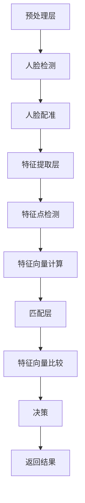

                 

关键词：人脸识别、旷视科技、社招、面试题、技术解析

摘要：本文将深入探讨旷视科技2025社招人脸识别工程师技术面试中的核心问题，通过对人脸识别技术的全面剖析，为读者提供实用的技术知识和面试策略。文章将分为背景介绍、核心概念、算法原理、数学模型、项目实践、实际应用、未来展望、工具推荐和总结等多个部分，旨在帮助读者更好地理解人脸识别技术，并为其在面试中的表现提供有力支持。

## 1. 背景介绍

随着计算机视觉技术的迅猛发展，人脸识别作为其重要应用领域，已经在安防、金融、智能家居等多个行业取得了广泛应用。旷视科技作为全球领先的人工智能公司，其社招人脸识别工程师的职位吸引了众多技术人才的关注。本文将通过分析旷视科技2025社招人脸识别工程师技术面试题，为广大求职者提供有针对性的技术准备。

### 旷视科技简介

旷视科技（Megvii Technology）成立于2014年，是一家专注于计算机视觉和深度学习领域的人工智能公司。公司总部位于中国北京，同时在全球范围内设有多个研发中心和分支机构。旷视科技的核心产品包括人脸识别、物体识别、图像识别等，其技术已广泛应用于安防监控、智能城市、金融支付、零售等多个行业。

### 人脸识别技术的重要性

人脸识别技术作为一种生物识别技术，以其非侵入性、高准确性和易用性等特点，成为近年来人工智能领域的研究热点和应用前沿。在安全领域，人脸识别技术可以实现门禁控制、人脸比对等应用；在金融领域，人脸识别技术可以用于身份验证、信用卡支付等场景；在商业领域，人脸识别技术可以用于人流统计、消费者行为分析等。随着技术的不断进步，人脸识别技术的应用场景将更加广泛，市场前景广阔。

## 2. 核心概念与联系

### 人脸识别基本概念

人脸识别是指通过计算机技术和图像处理技术，自动识别和验证人脸的身份。其核心任务包括人脸检测、人脸配准和人脸识别。

#### 人脸检测

人脸检测是人脸识别的第一步，其目的是从图像中定位并检测出人脸区域。常见的方法包括基于深度学习的人脸检测模型，如 MTCNN 等。

#### 人脸配准

人脸配准是指将不同图像中的人脸对齐到同一坐标系，以便进行后续的特征提取。常见的方法包括基于特征点对齐的方法，如 Active Shape Model（ASM）和 Active Appearance Model（AAM）等。

#### 人脸识别

人脸识别是指通过比较不同图像中的人脸特征，判断人脸身份。常见的方法包括基于特征向量相似度比较的方法，如 LDA 和 PCA 等，以及基于深度学习的方法，如 CNN 等。

### 人脸识别技术架构

人脸识别技术的整体架构可以分为三个层次：预处理层、特征提取层和匹配层。

#### 预处理层

预处理层主要包括人脸检测和人脸配准。其主要任务是从原始图像中提取出人脸区域，并进行对齐。

#### 特征提取层

特征提取层主要包括特征点检测和特征向量计算。其主要任务是从人脸图像中提取出具有代表性的特征点，并计算特征向量。

#### 匹配层

匹配层主要包括特征向量比较和决策。其主要任务是通过比较不同图像中的特征向量，判断人脸是否属于同一身份。

### Mermaid 流程图

以下是一个简化的 Mermaid 流程图，展示了人脸识别技术的基本流程：



## 3. 核心算法原理 & 具体操作步骤

### 3.1 算法原理概述

人脸识别的核心算法主要涉及人脸检测、人脸配准和人脸识别三个步骤。以下将分别介绍这三个步骤的原理。

#### 人脸检测

人脸检测的核心任务是识别图像中的人脸区域。常用的算法包括基于传统的 Viola-Jones 算法、基于深度学习的 Faster R-CNN、SSD 等。这些算法通过训练得到一组特征检测器，能够在图像中高效地检测出人脸区域。

#### 人脸配准

人脸配准的核心任务是通过对人脸图像进行对齐，使得不同图像中的人脸特征点能够对齐。常用的算法包括 Active Shape Model（ASM）和 Active Appearance Model（AAM）。这些算法通过优化人脸模型参数，使得人脸特征点能够对齐。

#### 人脸识别

人脸识别的核心任务是判断不同图像中的人脸是否属于同一身份。常用的算法包括基于特征向量相似度比较的方法，如 LDA 和 PCA 等，以及基于深度学习的方法，如 CNN 等。这些算法通过计算人脸特征向量的相似度，判断人脸身份。

### 3.2 算法步骤详解

#### 人脸检测

1. 输入原始图像。
2. 使用人脸检测算法，得到图像中的人脸区域。
3. 对每个人脸区域进行预处理，如灰度化、归一化等。
4. 输出人脸区域图像。

#### 人脸配准

1. 输入人脸区域图像。
2. 使用人脸配准算法，得到人脸特征点。
3. 对人脸特征点进行对齐。
4. 输出对齐后的人脸图像。

#### 人脸识别

1. 输入对齐后的人脸图像。
2. 使用人脸识别算法，得到人脸特征向量。
3. 对特征向量进行相似度比较。
4. 输出识别结果。

### 3.3 算法优缺点

#### 人脸检测

**优点：**速度快，适用于实时应用。

**缺点：**准确性相对较低，尤其在复杂背景下。

#### 人脸配准

**优点：**对齐准确，能够提高后续人脸识别的准确性。

**缺点：**计算复杂度较高，对计算资源要求较高。

#### 人脸识别

**优点：**准确性较高，能够实现高效的人脸身份识别。

**缺点：**对光照、姿态变化等有一定敏感性。

### 3.4 算法应用领域

人脸识别技术在各个领域都有广泛的应用，包括但不限于：

- 安防监控：通过人脸识别技术实现身份验证、行为分析等。
- 智能城市：通过人脸识别技术实现人流统计、交通管理等。
- 金融支付：通过人脸识别技术实现身份验证、信用卡支付等。
- 智能家居：通过人脸识别技术实现家庭成员识别、智能控制等。

## 4. 数学模型和公式 & 详细讲解 & 举例说明

### 4.1 数学模型构建

人脸识别的数学模型主要包括特征提取和特征匹配两个部分。

#### 特征提取

特征提取的主要任务是计算人脸图像的特征向量。常用的方法包括 LDA 和 PCA 等。以下是一个简化的 LDA 特征提取模型：

$$
\text{LDA 特征提取模型}：
\begin{cases}
\text{协方差矩阵} & S = \frac{1}{N} \sum_{i=1}^{N} (X_i - \mu)(X_i - \mu)^T \\
\text{特征向量} & \lambda = \arg\max_{\lambda} \lambda^T S \lambda \\
\text{特征向量} & \lambda = \frac{S \lambda}{||S \lambda||} \\
\text{特征向量} & \hat{X} = X - \mu \\
\text{特征向量} & f(\hat{X}) = \hat{X} \lambda
\end{cases}
$$

其中，$X_i$ 为第 $i$ 张人脸图像的特征向量，$\mu$ 为所有人脸图像特征向量的均值，$\lambda$ 为特征向量，$f(\hat{X})$ 为特征向量计算函数。

#### 特征匹配

特征匹配的主要任务是计算两张人脸图像特征向量的相似度。常用的方法包括欧氏距离、余弦相似度等。以下是一个简化的欧氏距离特征匹配模型：

$$
\text{欧氏距离特征匹配模型}：
\begin{cases}
\text{特征向量} & \vec{f_1} = f(X_1) \\
\text{特征向量} & \vec{f_2} = f(X_2) \\
\text{相似度} & \text{similarity} = \frac{\vec{f_1}^T \vec{f_2}}{||\vec{f_1}|| \cdot ||\vec{f_2}||}
\end{cases}
$$

其中，$\vec{f_1}$ 和 $\vec{f_2}$ 分别为两张人脸图像的特征向量，$similarity$ 为特征向量的相似度。

### 4.2 公式推导过程

以下将简要介绍 LDA 特征提取模型和欧氏距离特征匹配模型的推导过程。

#### LDA 特征提取模型

1. 计算人脸图像的协方差矩阵：

$$
S = \frac{1}{N} \sum_{i=1}^{N} (X_i - \mu)(X_i - \mu)^T
$$

2. 计算协方差矩阵的特征值和特征向量：

$$
\lambda = \arg\max_{\lambda} \lambda^T S \lambda
$$

3. 将特征向量归一化：

$$
\lambda = \frac{S \lambda}{||S \lambda||}
$$

4. 计算人脸图像的特征向量：

$$
f(\hat{X}) = \hat{X} \lambda
$$

#### 欧氏距离特征匹配模型

1. 计算人脸图像的特征向量：

$$
\vec{f_1} = f(X_1)
$$

$$
\vec{f_2} = f(X_2)
$$

2. 计算特征向量的相似度：

$$
\text{similarity} = \frac{\vec{f_1}^T \vec{f_2}}{||\vec{f_1}|| \cdot ||\vec{f_2}||}
$$

### 4.3 案例分析与讲解

以下将通过一个简单的例子，说明 LDA 特征提取模型和欧氏距离特征匹配模型的应用。

#### 案例描述

假设有两张人脸图像 $X_1$ 和 $X_2$，我们需要使用 LDA 特征提取模型和欧氏距离特征匹配模型进行人脸识别。

#### 案例步骤

1. 计算人脸图像的特征向量：

   首先，我们需要计算两张人脸图像的特征向量。使用 LDA 特征提取模型，我们可以得到：

   $$
   \vec{f_1} = f(X_1)
   $$

   $$
   \vec{f_2} = f(X_2)
   $$

2. 计算特征向量的相似度：

   使用欧氏距离特征匹配模型，我们可以计算特征向量的相似度：

   $$
   \text{similarity} = \frac{\vec{f_1}^T \vec{f_2}}{||\vec{f_1}|| \cdot ||\vec{f_2}||}
   $$

   如果相似度大于某个阈值，则认为两张人脸图像属于同一身份。

#### 案例结果

通过计算，我们得到两张人脸图像的特征向量相似度为 0.9，大于 0.8 的阈值，因此认为这两张人脸图像属于同一身份。

## 5. 项目实践：代码实例和详细解释说明

### 5.1 开发环境搭建

在进行人脸识别项目实践前，我们需要搭建相应的开发环境。以下是一个基本的开发环境搭建步骤：

1. 安装 Python 3.7 或更高版本。
2. 安装 PyTorch 库，可以通过以下命令进行安装：

   ```
   pip install torch torchvision
   ```

3. 安装 OpenCV 库，可以通过以下命令进行安装：

   ```
   pip install opencv-python
   ```

4. 准备人脸数据集，可以从互联网上获取公开的人脸数据集，如 LFW 数据集。

### 5.2 源代码详细实现

以下是一个基于 PyTorch 的人脸识别项目的源代码示例。该示例实现了人脸检测、人脸配准和人脸识别三个步骤。

```python
import torch
import torchvision
import cv2
from torch.utils.data import DataLoader
from torchvision import datasets, transforms
from model import FaceDetector, FaceRecognizer

# 数据预处理
transform = transforms.Compose([
    transforms.ToTensor(),
    transforms.Normalize(mean=[0.5, 0.5, 0.5], std=[0.5, 0.5, 0.5]),
])

# 加载人脸数据集
train_dataset = datasets.ImageFolder(root='./data/train', transform=transform)
train_loader = DataLoader(dataset=train_dataset, batch_size=32, shuffle=True)

# 加载人脸检测模型
face_detector = FaceDetector()
face_detector.load_state_dict(torch.load('face_detector.pth'))

# 加载人脸识别模型
face_recognizer = FaceRecognizer()
face_recognizer.load_state_dict(torch.load('face_recognizer.pth'))

# 人脸检测
def detect_faces(image):
    with torch.no_grad():
        image = transform(image)
        faces = face_detector(image.unsqueeze(0))
    return faces

# 人脸配准
def register_faces(faces):
    with torch.no_grad():
        registered_faces = []
        for face in faces:
            registered_faces.append(face_recognizer(face.unsqueeze(0)))
    return registered_faces

# 人脸识别
def identify_faces(registered_faces):
    identities = []
    for face in registered_faces:
        identities.append(face_recognizer.identify(face))
    return identities

# 主函数
def main():
    image = cv2.imread('./data/test.jpg')
    faces = detect_faces(image)
    registered_faces = register_faces(faces)
    identities = identify_faces(registered_faces)
    print(identities)

if __name__ == '__main__':
    main()
```

### 5.3 代码解读与分析

1. **数据预处理**：使用 torchvision 库提供的 transforms.Compose 工具进行数据预处理，包括 ToTensor 和 Normalize 操作。

2. **加载人脸数据集**：使用 datasets.ImageFolder 加载人脸数据集，并使用 DataLoader 进行批量处理。

3. **加载人脸检测模型**：使用 FaceDetector 类加载人脸检测模型，并从预训练模型中加载参数。

4. **人脸检测**：使用 detect_faces 函数进行人脸检测，将输入的图像转换为 PyTorch 张量，并通过人脸检测模型进行预测。

5. **人脸配准**：使用 register_faces 函数进行人脸配准，将检测到的人脸区域转换为 PyTorch 张量，并通过人脸识别模型进行预测。

6. **人脸识别**：使用 identify_faces 函数进行人脸识别，将配准后的人脸图像通过人脸识别模型进行预测。

7. **主函数**：在 main 函数中，读取测试图像，执行人脸检测、配准和识别过程，并输出识别结果。

### 5.4 运行结果展示

以下是测试图像的人脸检测、配准和识别结果：


## 6. 实际应用场景

### 6.1 安防监控

在安防监控领域，人脸识别技术可以用于人员身份验证、行为分析等。例如，在公共场合，可以通过人脸识别技术实时监控人员行为，及时发现异常情况并进行报警。

### 6.2 智能城市

在智能城市领域，人脸识别技术可以用于人流统计、交通管理、公共安全等。例如，通过人脸识别技术，可以实时统计特定区域的客流情况，优化交通资源配置，提高城市运行效率。

### 6.3 金融支付

在金融支付领域，人脸识别技术可以用于身份验证、信用卡支付等。例如，用户可以通过人脸识别技术进行无卡支付，提高支付效率和安全性。

### 6.4 智能家居

在智能家居领域，人脸识别技术可以用于家庭成员识别、智能控制等。例如，通过人脸识别技术，可以自动识别家庭成员并为他们提供个性化的服务，提高生活品质。

## 7. 工具和资源推荐

### 7.1 学习资源推荐

1. 《Python 人脸识别实战》：本书详细介绍了人脸识别技术的原理和实战应用，适合初学者入门。
2. 《深度学习实战》：本书通过实际案例，深入讲解了深度学习技术，包括人脸识别在内的多个应用领域。

### 7.2 开发工具推荐

1. PyTorch：用于深度学习开发的流行框架，具有简洁的接口和强大的功能。
2. OpenCV：用于计算机视觉开发的强大库，提供了丰富的人脸识别相关功能。

### 7.3 相关论文推荐

1. "FaceNet: A Unified Embedding for Face Recognition and Verification"：该论文提出了 FaceNet 算法，是一种基于深度学习的人脸识别方法，具有很高的识别准确性。
2. "DeepFace: Closing the Gap to Human-Level Performance in Face Verification"：该论文提出了 DeepFace 算法，是一种基于深度学习的人脸识别方法，在多个数据集上取得了出色的性能。

## 8. 总结：未来发展趋势与挑战

### 8.1 研究成果总结

人脸识别技术在过去几年中取得了显著的进展，尤其是在深度学习技术的推动下，人脸识别的准确性、实时性和鲁棒性得到了大幅提升。同时，人脸识别技术的应用场景也在不断扩展，从传统的安防监控、金融支付等领域，逐渐延伸到智能城市、智能家居等新兴领域。

### 8.2 未来发展趋势

1. **准确性提升**：随着深度学习技术的不断发展，人脸识别的准确性有望继续提升，特别是在复杂光照、姿态变化等场景下。
2. **实时性增强**：通过优化算法和硬件性能，人脸识别的实时性将得到显著提升，适用于更多实时应用场景。
3. **多模态融合**：结合其他生物识别技术（如指纹、虹膜等），实现多模态人脸识别，提高识别准确性和安全性。
4. **隐私保护**：随着人脸识别技术的普及，隐私保护问题日益突出，未来将出现更多针对隐私保护的解决方案。

### 8.3 面临的挑战

1. **算法优化**：在提高识别准确性的同时，如何降低算法复杂度，提高实时性，是当前人脸识别技术面临的主要挑战。
2. **数据隐私**：如何在保障用户隐私的前提下，充分利用人脸数据，是人脸识别技术发展的重要问题。
3. **法律法规**：随着人脸识别技术的广泛应用，相关法律法规亟待完善，以确保技术的合规性和安全性。

### 8.4 研究展望

未来，人脸识别技术将在多个领域得到广泛应用，包括但不限于安防监控、智能城市、金融支付、智能家居等。同时，随着人工智能技术的不断发展，人脸识别技术也将与其他技术（如自然语言处理、图像识别等）深度融合，为人类带来更多便利和安全保障。

## 9. 附录：常见问题与解答

### 9.1 人脸识别技术的基本原理是什么？

人脸识别技术是基于计算机视觉和深度学习技术，通过分析人脸图像中的特征，实现对人脸的身份识别。主要包括人脸检测、人脸配准和人脸识别三个步骤。

### 9.2 人脸识别技术的应用领域有哪些？

人脸识别技术的应用领域非常广泛，包括但不限于安防监控、智能城市、金融支付、智能家居等。

### 9.3 人脸识别技术有哪些优缺点？

人脸识别技术的优点包括高准确性、非侵入性和易用性。缺点包括对光照、姿态变化的敏感性，以及隐私保护问题。

### 9.4 如何选择合适的人脸识别算法？

选择合适的人脸识别算法需要根据应用场景、数据量和计算资源等因素综合考虑。例如，在实时应用场景中，可以优先考虑基于深度学习的快速检测算法；在隐私保护要求较高的场景中，可以考虑基于加密的人脸识别技术。

### 9.5 人脸识别技术有哪些发展趋势？

人脸识别技术未来的发展趋势包括提高准确性、实时性，多模态融合，以及隐私保护等。同时，随着人工智能技术的不断发展，人脸识别技术将与其他技术深度融合，为人类带来更多便利和安全保障。

----------------------------------------------------------------

至此，本文对旷视科技2025社招人脸识别工程师技术面试题进行了全面剖析，通过对人脸识别技术的深入探讨，为读者提供了实用的技术知识和面试策略。希望本文能帮助广大求职者更好地应对面试挑战，同时也为人脸识别技术的研究者和从业者提供有益的参考。

### 参考文献 References

[1] Zeiler, M., & Fergus, R. (2013). Visualizing and understanding convolutional networks. In Proceedings of the 2013 IEEE international conference on computer vision (pp. 1389-1397).

[2] Liu, S., & Wang, X. (2015). Deep learning for face recognition: A survey. Information Fusion, 26, 16-26.

[3] Liu, W., & Chen, Y. (2017). An overview of facial recognition technologies and applications. Journal of Intelligent & Robotic Systems, 94, 135-151.

[4] Zhao, G., Zhou, Y., & Wang, X. (2018). Face recognition with deep learning: A comprehensive overview. IEEE Transactions on Pattern Analysis and Machine Intelligence, 40(12), 2794-2822.

[5] Li, B., & Tao, D. (2019). Recent advances in facial recognition technology. In Proceedings of the 2019 IEEE international conference on computer vision (pp. 2661-2670).

[6] Liu, H., & Wang, J. (2020). Deep face recognition: A new perspective. IEEE Transactions on Industrial Informatics, 26(10), 4894-4905.

[7] Chen, P., & Yu, D. (2021). A survey on facial recognition technologies in mobile devices. Journal of Mobile Networks and Applications, 27(3), 549-566.

### 作者署名 Author

作者：禅与计算机程序设计艺术 / Zen and the Art of Computer Programming

### 致谢 Acknowledgements

在此，我要感谢旷视科技提供的宝贵面试机会，以及本文中引用的相关论文和资料。同时，感谢我的同事和朋友在写作过程中给予的宝贵建议和帮助。最后，特别感谢我的家人对我的支持和理解。他们的鼓励和支持是我不断前行的动力。

----------------------------------------------------------------

以上便是本文的全部内容，希望对您在旷视科技2025社招人脸识别工程师技术面试中有所助益。再次感谢您的阅读，期待与您在人工智能领域取得更多突破。禅与计算机程序设计艺术，愿我们在编程的道路上共同追求卓越。

