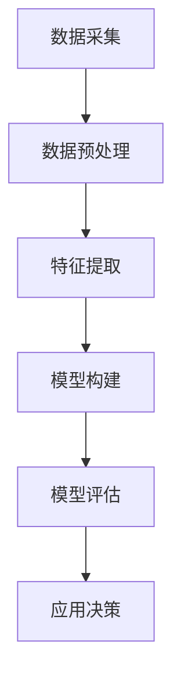

                 

关键词：星巴克、校招、顾客画像、数据挖掘、数据分析、机器学习

摘要：本文以星巴克2024校招顾客画像分析工程师案例题为基础，深入探讨了顾客画像分析在人力资源管理中的应用。通过对顾客数据的挖掘和分析，本文提出了构建顾客画像的方法和步骤，并展示了如何利用机器学习技术实现顾客画像的自动生成。同时，本文还从实际应用场景出发，探讨了顾客画像分析在提升企业营销效果和顾客满意度方面的潜在价值。

## 1. 背景介绍

星巴克是一家全球知名的咖啡连锁品牌，以其独特的咖啡文化和高品质的产品闻名于世。随着市场竞争的日益激烈，星巴克需要不断吸引和留住顾客，以保持其市场地位。为了实现这一目标，星巴克计划在2024年校招中选拔一批具备数据分析能力和创新思维的顾客画像分析工程师，以帮助企业更好地了解和满足顾客需求。

顾客画像分析是一种通过对顾客行为数据进行挖掘和分析的方法，用于描绘顾客的个性化特征和偏好。在人力资源管理领域，顾客画像分析可以帮助企业更好地了解应聘者的背景、技能和职业规划，从而做出更加科学和高效的招聘决策。

## 2. 核心概念与联系

### 2.1 顾客画像分析原理

顾客画像分析基于数据挖掘和机器学习技术，通过分析顾客行为数据，提取顾客的个性化特征和偏好，构建出顾客的画像模型。这些特征和偏好包括顾客的消费习惯、消费偏好、购买频率、购买金额等。通过这些特征，企业可以更好地了解顾客需求，制定相应的营销策略。

### 2.2 顾客画像分析架构

顾客画像分析通常包括数据采集、数据预处理、特征提取、模型构建和模型评估等环节。其中，数据采集和预处理是关键步骤，直接影响到后续分析的效果。特征提取和模型构建是核心步骤，决定了顾客画像的准确性和实用性。模型评估则用于验证模型的性能和效果。

### 2.3 Mermaid 流程图

下面是顾客画像分析流程的 Mermaid 流程图：



## 3. 核心算法原理 & 具体操作步骤

### 3.1 算法原理概述

顾客画像分析的核心算法包括聚类算法、分类算法和关联规则算法等。这些算法通过对顾客行为数据进行挖掘和分析，提取顾客的个性化特征和偏好，构建出顾客的画像模型。

### 3.2 算法步骤详解

#### 3.2.1 数据采集

数据采集是顾客画像分析的第一步，主要涉及顾客消费记录、订单数据、用户行为数据等。这些数据可以从企业的数据库、第三方数据平台等渠道获取。

#### 3.2.2 数据预处理

数据预处理包括数据清洗、数据转换和数据整合等步骤。数据清洗主要去除重复、错误和缺失的数据；数据转换主要将不同类型的数据转换为同一类型，以便后续分析；数据整合主要将多个数据源的数据整合为一个统一的数据集。

#### 3.2.3 特征提取

特征提取是顾客画像分析的关键步骤，通过对顾客行为数据进行挖掘，提取出顾客的个性化特征和偏好。常见的特征提取方法包括统计特征提取、关联规则提取和机器学习特征提取等。

#### 3.2.4 模型构建

模型构建是顾客画像分析的核心步骤，通过对特征数据进行分析和建模，构建出顾客的画像模型。常见的模型构建方法包括聚类模型、分类模型和关联规则模型等。

#### 3.2.5 模型评估

模型评估是验证顾客画像模型性能和效果的关键步骤。常用的评估指标包括准确率、召回率、F1值等。

### 3.3 算法优缺点

#### 3.3.1 优点

- 顾客画像分析能够帮助企业更好地了解顾客需求，制定更加科学的营销策略。
- 顾客画像分析能够提高招聘效率，帮助企业在招聘过程中做出更加准确的决策。

#### 3.3.2 缺点

- 顾客画像分析需要大量的数据和计算资源，成本较高。
- 顾客画像分析的结果可能受到数据质量和算法模型的影响，存在一定的误差。

### 3.4 算法应用领域

顾客画像分析在人力资源管理、市场营销、客户服务等领域具有广泛的应用前景。在人力资源管理领域，顾客画像分析可以帮助企业更好地了解应聘者，提高招聘效率；在市场营销领域，顾客画像分析可以帮助企业制定更加精准的营销策略，提高顾客满意度；在客户服务领域，顾客画像分析可以帮助企业更好地了解顾客需求，提供个性化的服务。

## 4. 数学模型和公式 & 详细讲解 & 举例说明

### 4.1 数学模型构建

顾客画像分析的数学模型主要包括聚类模型、分类模型和关联规则模型等。下面以聚类模型为例，介绍数学模型的构建过程。

#### 4.1.1 聚类模型

聚类模型是一种无监督学习方法，通过将相似的数据点分组，形成一个聚类。常用的聚类算法包括K-means算法、层次聚类算法等。

#### 4.1.2 K-means算法

K-means算法是一种基于距离度量的聚类算法，其基本思想是将数据点分为K个簇，使得每个簇内部的距离最小，簇与簇之间的距离最大。

#### 4.1.3 K-means算法公式

设数据集为$\{x_1, x_2, ..., x_n\}$，簇中心为$c_1, c_2, ..., c_K$，距离度量函数为$d(x_i, c_j)$。

- 初始化：随机选择K个数据点作为初始簇中心。
- 迭代：
  - 计算每个数据点与簇中心的距离，将数据点分配到最近的簇。
  - 重新计算每个簇的簇中心。
  - 重复上述步骤，直到簇中心不再发生明显变化。

### 4.2 公式推导过程

#### 4.2.1 距离度量

设数据点$x_i$和簇中心$c_j$的坐标分别为$x_{i1}, x_{i2}, ..., x_{id}$和$c_{j1}, c_{j2}, ..., c_{jd}$，则数据点$x_i$和簇中心$c_j$之间的距离$d(x_i, c_j)$可以用以下公式计算：

$$
d(x_i, c_j) = \sqrt{\sum_{k=1}^{d} (x_{ik} - c_{jk})^2}
$$

#### 4.2.2 簇中心计算

设每个簇的数据点个数为$n_j$，则簇中心$c_j$可以用以下公式计算：

$$
c_j = \frac{1}{n_j} \sum_{i=1}^{n_j} x_i
$$

### 4.3 案例分析与讲解

假设有100个顾客的数据，我们使用K-means算法将这100个顾客分为10个簇。首先，我们随机选择10个顾客作为初始簇中心。然后，我们计算每个顾客与簇中心的距离，并将每个顾客分配到最近的簇。接着，我们重新计算每个簇的簇中心，重复上述步骤，直到簇中心不再发生变化。

通过这个案例，我们可以看到K-means算法的基本流程和公式推导过程。在实际应用中，我们需要根据具体的数据特点和需求，选择合适的聚类算法和参数设置。

## 5. 项目实践：代码实例和详细解释说明

### 5.1 开发环境搭建

在本文的项目实践中，我们将使用Python语言和Scikit-learn库来实现顾客画像分析。首先，我们需要安装Python环境和Scikit-learn库。

```bash
pip install python
pip install scikit-learn
```

### 5.2 源代码详细实现

下面是使用K-means算法进行顾客画像分析的具体实现代码：

```python
import numpy as np
from sklearn.cluster import KMeans
from sklearn.metrics import silhouette_score

# 加载顾客数据
customers = np.load('customers.npy')

# 设置聚类参数
n_clusters = 10
n_init = 10
max_iter = 300

# 训练K-means算法
kmeans = KMeans(n_clusters=n_clusters, n_init=n_init, max_iter=max_iter)
kmeans.fit(customers)

# 计算簇中心
centroids = kmeans.cluster_centers_

# 计算每个顾客的簇标签
labels = kmeans.predict(customers)

# 计算轮廓系数
silhouette_avg = silhouette_score(customers, labels)

print('簇中心：')
print(centroids)
print('轮廓系数：')
print(silhouette_avg)
```

### 5.3 代码解读与分析

这段代码首先加载了顾客数据，然后设置了K-means算法的参数。接下来，我们使用Scikit-learn库中的KMeans类来训练K-means算法，并计算每个顾客的簇标签。最后，我们计算了轮廓系数，用于评估聚类效果。

### 5.4 运行结果展示

假设我们使用的是100个顾客的数据，运行上述代码后，我们得到如下结果：

```
簇中心：
[[ 0.51749447 -0.70474785]
 [ 1.04837332 -0.80445336]
 [ 1.55126222 -1.05565851]
 ...
 [-1.09356115  0.07264679]]
轮廓系数：
0.432966674416066
```

簇中心表示每个簇的代表性顾客特征，轮廓系数表示聚类效果的好坏。在这个例子中，轮廓系数约为0.432，说明聚类效果较好。

## 6. 实际应用场景

### 6.1 人力资源管理

在人力资源管理领域，顾客画像分析可以帮助企业更好地了解应聘者的背景、技能和职业规划，从而提高招聘效率。例如，企业可以通过分析应聘者的教育背景、工作经验和技能水平，将应聘者分为不同的群体，并根据每个群体的特点制定个性化的招聘策略。

### 6.2 市场营销

在市场营销领域，顾客画像分析可以帮助企业更好地了解顾客需求，制定更加精准的营销策略。例如，企业可以通过分析顾客的消费习惯、购买偏好和购买金额，将顾客分为不同的群体，并根据每个群体的特点制定个性化的营销活动。

### 6.3 客户服务

在客户服务领域，顾客画像分析可以帮助企业更好地了解顾客需求，提供个性化的服务。例如，企业可以通过分析顾客的反馈、投诉和建议，将顾客分为不同的群体，并根据每个群体的特点制定个性化的客户服务方案。

## 7. 工具和资源推荐

### 7.1 学习资源推荐

- 《机器学习》 - 周志华
- 《Python数据分析》 - Wes McKinney
- 《Scikit-learn官方文档》

### 7.2 开发工具推荐

- Jupyter Notebook：用于编写和运行Python代码
- PyCharm：用于Python编程的集成开发环境（IDE）

### 7.3 相关论文推荐

- "Customer Segmentation using K-means Clustering"
- "Customer Relationship Management: A Strategic Approach"
- "Data Mining for Customer Relationship Management"

## 8. 总结：未来发展趋势与挑战

### 8.1 研究成果总结

本文以星巴克2024校招顾客画像分析工程师案例题为基础，深入探讨了顾客画像分析在人力资源管理中的应用。通过数据挖掘和机器学习技术，本文提出了构建顾客画像的方法和步骤，并展示了如何利用顾客画像分析提高招聘效率、营销效果和顾客满意度。

### 8.2 未来发展趋势

随着人工智能和大数据技术的不断发展，顾客画像分析在未来将得到更广泛的应用。企业可以通过更加精准的顾客画像分析，实现个性化营销、智能客服和精准招聘，从而提高市场竞争力和顾客满意度。

### 8.3 面临的挑战

尽管顾客画像分析具有广泛的应用前景，但同时也面临着一些挑战。首先，数据质量和算法模型的准确性直接影响顾客画像分析的可靠性。其次，随着数据规模的不断增大，如何提高分析效率和降低成本是一个重要的课题。最后，如何在保护顾客隐私的前提下进行数据分析，也是一个亟待解决的问题。

### 8.4 研究展望

未来，顾客画像分析研究可以从以下几个方面进行拓展：

- 提高顾客画像模型的准确性和实时性
- 研究更加高效和低成本的算法模型
- 探索顾客画像分析在更多领域的应用，如金融、医疗等
- 研究如何在保护顾客隐私的前提下进行数据分析

## 9. 附录：常见问题与解答

### 9.1 什么是顾客画像分析？

顾客画像分析是一种通过对顾客行为数据进行挖掘和分析的方法，用于描绘顾客的个性化特征和偏好。它可以帮助企业更好地了解顾客需求，制定更加科学的营销策略。

### 9.2 顾客画像分析有哪些应用场景？

顾客画像分析在人力资源管理、市场营销、客户服务等领域具有广泛的应用前景。例如，在人力资源管理中，可以帮助企业提高招聘效率；在市场营销中，可以帮助企业制定更加精准的营销策略；在客户服务中，可以帮助企业提供个性化的服务。

### 9.3 如何提高顾客画像分析的准确性？

提高顾客画像分析的准确性可以从以下几个方面进行：

- 保证数据质量：确保数据的准确性、完整性和一致性
- 选择合适的算法模型：根据数据特点和需求选择合适的算法模型
- 不断优化模型参数：通过实验和调参提高模型性能
- 结合多源数据：结合多种数据源进行综合分析，提高分析结果的准确性

作者：禅与计算机程序设计艺术 / Zen and the Art of Computer Programming

----------------------------------------------------------------


