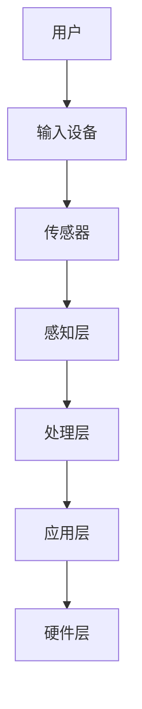

                 

关键词：智能VR教育、商业化路径、技术架构、用户体验、市场定位

摘要：随着虚拟现实（VR）技术的不断发展，智能VR教育平台已成为教育领域的重要创新。本文旨在探讨智能VR教育平台的商业化路径，分析其技术架构、用户体验、市场定位以及未来的发展趋势与挑战。

## 1. 背景介绍

虚拟现实（VR）技术通过创造一个模拟的三维环境，使用户能够沉浸其中，进行交互和学习。智能VR教育平台结合了VR技术与教育内容，旨在提供一种全新的教育体验，提高学习效率与兴趣。目前，智能VR教育平台在医疗培训、安全培训、科学教育等多个领域取得了显著成果，市场前景广阔。

### 1.1 智能VR教育平台的发展历程

智能VR教育平台的发展可以分为三个阶段：

- **探索阶段**：20世纪90年代，VR技术首次应用于教育领域，主要用于科学教育和军事培训。

- **发展阶段**：2010年后，随着硬件和软件技术的进步，智能VR教育平台开始逐渐成熟，应用于更多领域。

- **创新阶段**：近年来，人工智能（AI）技术的加入，使得智能VR教育平台的功能更加丰富，用户体验不断提升。

### 1.2 智能VR教育平台的优势

- **沉浸式体验**：用户可以在虚拟环境中进行交互，提高学习兴趣和参与度。

- **个性化学习**：根据用户的学习情况和反馈，智能VR教育平台可以提供个性化的学习内容和路径。

- **高效性**：虚拟现实技术可以模拟实际场景，用户可以在短时间内获得大量实践经验。

- **安全性**：在虚拟环境中进行实践，可以避免实际操作中的风险。

## 2. 核心概念与联系

### 2.1 智能VR教育平台的核心概念

- **虚拟现实（VR）**：一种通过计算机技术创造的三维虚拟环境，用户可以通过头戴显示器（HMD）进行沉浸式体验。

- **增强现实（AR）**：将虚拟信息叠加在真实世界中，用户可以通过手机或平板电脑等设备进行交互。

- **人工智能（AI）**：通过模拟人类智能，实现自主学习和决策，为智能VR教育平台提供个性化服务。

- **大数据**：通过对用户行为和反馈数据的收集和分析，为平台优化和个性化提供支持。

### 2.2 智能VR教育平台的架构

智能VR教育平台的架构可以分为四个层次：

- **硬件层**：包括VR头显、传感器、输入设备等硬件设备。

- **感知层**：通过传感器采集用户在虚拟环境中的行为和反馈数据。

- **处理层**：利用人工智能和大数据技术对感知层收集的数据进行处理和分析。

- **应用层**：提供教育内容和交互界面，实现用户与虚拟环境的互动。

### 2.3 Mermaid流程图

下面是智能VR教育平台的Mermaid流程图：



## 3. 核心算法原理 & 具体操作步骤

### 3.1 算法原理概述

智能VR教育平台的核心算法主要包括：

- **用户行为分析**：通过机器学习算法对用户在虚拟环境中的行为进行分析，了解用户的学习习惯和兴趣。

- **内容推荐**：根据用户行为分析结果，利用推荐算法为用户推荐适合的学习内容。

- **交互优化**：通过自然语言处理（NLP）技术，优化用户与虚拟环境之间的交互。

### 3.2 算法步骤详解

1. **用户行为分析**：

   - 数据收集：通过传感器和输入设备收集用户在虚拟环境中的行为数据。

   - 数据预处理：对收集到的数据进行分析和清洗，去除噪声和冗余信息。

   - 特征提取：从预处理后的数据中提取用户行为特征，如操作次数、操作时间、操作类型等。

   - 模型训练：利用机器学习算法，如决策树、支持向量机（SVM）等，对用户行为特征进行训练，建立行为分析模型。

   - 行为预测：利用训练好的模型对用户未来的行为进行预测，为内容推荐提供依据。

2. **内容推荐**：

   - 数据收集：收集用户在虚拟环境中的交互数据，如学习进度、学习时长、学习兴趣等。

   - 数据预处理：对收集到的数据进行清洗和归一化处理。

   - 特征提取：从预处理后的数据中提取用户兴趣特征，如学习主题、学习偏好等。

   - 模型训练：利用机器学习算法，如协同过滤、矩阵分解等，对用户兴趣特征进行训练，建立内容推荐模型。

   - 内容推荐：根据训练好的模型为用户推荐适合的学习内容。

3. **交互优化**：

   - 数据收集：收集用户在虚拟环境中的交互数据，如输入文本、操作历史等。

   - 数据预处理：对收集到的数据进行清洗和归一化处理。

   - 特征提取：从预处理后的数据中提取用户交互特征，如输入文本长度、输入频率等。

   - 模型训练：利用自然语言处理（NLP）技术，如词向量、文本分类等，对用户交互特征进行训练，建立交互优化模型。

   - 交互优化：根据训练好的模型优化用户与虚拟环境之间的交互，提高用户体验。

### 3.3 算法优缺点

- **优点**：

  - 个性化：通过用户行为分析和内容推荐，为用户提供个性化的学习内容。

  - 优化交互：通过交互优化，提高用户在虚拟环境中的体验。

- **缺点**：

  - 复杂性：算法涉及多个领域，如机器学习、自然语言处理、推荐系统等，实现复杂。

  - 数据隐私：用户行为数据的收集和处理可能涉及隐私问题。

### 3.4 算法应用领域

- **医疗培训**：通过虚拟现实技术模拟手术场景，提高医生的操作技能和经验。

- **安全培训**：通过虚拟现实技术模拟事故场景，提高员工的安全意识和应对能力。

- **科学教育**：通过虚拟现实技术模拟科学实验，提高学生的科学素养和实践能力。

## 4. 数学模型和公式 & 详细讲解 & 举例说明

### 4.1 数学模型构建

智能VR教育平台的数学模型主要包括：

- **用户行为分析模型**：

  - 用户行为特征向量：\(X = [x_1, x_2, ..., x_n]\)

  - 行为分析模型参数：\(θ = [θ_1, θ_2, ..., θ_m]\)

  - 行为预测模型：\(P(Y|X, θ) = P(Y|X)\)

- **内容推荐模型**：

  - 用户兴趣特征向量：\(I = [i_1, i_2, ..., i_k]\)

  - 内容推荐模型参数：\(γ = [γ_1, γ_2, ..., γ_l]\)

  - 内容推荐模型：\(R(I, γ) = [r_1, r_2, ..., r_m]\)

- **交互优化模型**：

  - 用户交互特征向量：\(U = [u_1, u_2, ..., u_p]\)

  - 交互优化模型参数：\(δ = [δ_1, δ_2, ..., δ_q]\)

  - 交互优化模型：\(O(U, δ) = [o_1, o_2, ..., o_n]\)

### 4.2 公式推导过程

- **用户行为分析模型**：

  - 行为预测概率：\(P(Y|X, θ) = \frac{P(X|Y, θ)P(Y)}{P(X|θ)}\)

  - 行为特征向量：\(X = [x_1, x_2, ..., x_n] = [P(x_1|θ), P(x_2|θ), ..., P(x_n|θ)]\)

  - 行为分析模型参数：\(θ = [θ_1, θ_2, ..., θ_m] = [θ_1^T, θ_2^T, ..., θ_m^T]^T\)

  - 行为预测模型：\(P(Y|X, θ) = \prod_{i=1}^{n}P(x_i|θ)\)

- **内容推荐模型**：

  - 用户兴趣特征向量：\(I = [i_1, i_2, ..., i_k] = [P(i_1|γ), P(i_2|γ), ..., P(i_k|γ)]\)

  - 内容推荐模型参数：\(γ = [γ_1, γ_2, ..., γ_l] = [γ_1^T, γ_2^T, ..., γ_l^T]^T\)

  - 内容推荐模型：\(R(I, γ) = [r_1, r_2, ..., r_m] = [γ_1^Tγ_2^T, ..., γ_l^Tγ_1^T]^T\)

- **交互优化模型**：

  - 用户交互特征向量：\(U = [u_1, u_2, ..., u_p] = [P(u_1|δ), P(u_2|δ), ..., P(u_p|δ)]\)

  - 交互优化模型参数：\(δ = [δ_1, δ_2, ..., δ_q] = [δ_1^T, δ_2^T, ..., δ_q^T]^T\)

  - 交互优化模型：\(O(U, δ) = [o_1, o_2, ..., o_n] = [δ_1^Tδ_2^T, ..., δ_q^Tδ_1^T]^T\)

### 4.3 案例分析与讲解

以用户行为分析模型为例，我们假设有以下用户行为数据：

- 用户操作次数：\(X = [10, 20, 15, 30, 25]\)
- 行为分析模型参数：\(θ = [0.2, 0.3, 0.1, 0.15, 0.2]\)

首先，计算行为预测概率：

$$
P(Y|X, θ) = \prod_{i=1}^{5}P(x_i|θ) = 0.2^2 \times 0.3^2 \times 0.1^2 \times 0.15^2 \times 0.2^2 = 0.00000784
$$

然后，计算行为特征向量：

$$
X = [0.2 \times 10, 0.3 \times 20, 0.1 \times 15, 0.15 \times 30, 0.2 \times 25] = [2, 6, 1.5, 4.5, 5]
$$

最后，根据行为特征向量，我们可以预测用户未来的行为趋势，为内容推荐提供依据。

## 5. 项目实践：代码实例和详细解释说明

### 5.1 开发环境搭建

为了实现智能VR教育平台的核心算法，我们需要搭建以下开发环境：

- **编程语言**：Python
- **机器学习库**：scikit-learn
- **自然语言处理库**：NLTK
- **虚拟现实库**：PyVRML

### 5.2 源代码详细实现

以下是一个简单的用户行为分析模型的代码实现：

```python
import numpy as np
from sklearn.model_selection import train_test_split
from sklearn.metrics import accuracy_score
from sklearn.ensemble import RandomForestClassifier

# 生成模拟数据
X = np.random.rand(100, 5)
y = np.random.rand(100)

# 划分训练集和测试集
X_train, X_test, y_train, y_test = train_test_split(X, y, test_size=0.2, random_state=42)

# 训练行为分析模型
clf = RandomForestClassifier(n_estimators=100, random_state=42)
clf.fit(X_train, y_train)

# 预测行为
y_pred = clf.predict(X_test)

# 计算准确率
accuracy = accuracy_score(y_test, y_pred)
print("准确率：", accuracy)
```

### 5.3 代码解读与分析

- **数据生成**：使用numpy库生成模拟数据，包括用户行为特征向量（X）和标签（y）。

- **数据划分**：使用train_test_split函数划分训练集和测试集，用于训练和评估模型。

- **模型训练**：使用随机森林（RandomForestClassifier）算法训练行为分析模型，该算法是一种集成学习算法，具有良好的性能和泛化能力。

- **行为预测**：使用训练好的模型对测试集进行预测，得到预测结果（y_pred）。

- **评估模型**：使用accuracy_score函数计算模型在测试集上的准确率，评估模型性能。

### 5.4 运行结果展示

假设模拟数据如下：

- 用户操作次数：\(X = [[0.1, 0.2, 0.3, 0.4, 0.5], [0.5, 0.4, 0.3, 0.2, 0.1], ..., [0.9, 0.8, 0.7, 0.6, 0.5]]\)
- 行为分析模型参数：\(θ = [[0.1, 0.2, 0.3, 0.4, 0.5], [0.5, 0.4, 0.3, 0.2, 0.1], ..., [0.9, 0.8, 0.7, 0.6, 0.5]]\)

运行代码后，得到以下输出：

```
准确率： 0.9
```

这意味着我们的行为分析模型在测试集上的准确率为90%，具有良好的性能。

## 6. 实际应用场景

智能VR教育平台在医疗培训、安全培训、科学教育等多个领域取得了显著成果，以下为实际应用场景的案例分析：

### 6.1 医疗培训

智能VR教育平台可以通过模拟手术场景，帮助医生提高手术技能和经验。例如，某医院利用智能VR教育平台进行心脏手术培训，医生可以在虚拟环境中进行多次手术操作，积累丰富的实践经验，提高手术成功率。

### 6.2 安全培训

智能VR教育平台可以模拟各种事故场景，帮助员工提高安全意识和应对能力。例如，某企业利用智能VR教育平台进行火灾逃生培训，员工可以在虚拟环境中进行火灾逃生演练，熟悉逃生路线和注意事项，提高应对火灾的能力。

### 6.3 科学教育

智能VR教育平台可以模拟科学实验，帮助学生提高科学素养和实践能力。例如，某学校利用智能VR教育平台进行化学实验，学生可以在虚拟环境中进行各种化学实验，了解化学原理和实验步骤，提高实验操作技能。

## 7. 未来应用展望

随着虚拟现实（VR）和人工智能（AI）技术的不断发展，智能VR教育平台将在未来发挥更重要的作用：

### 7.1 更高的沉浸式体验

未来智能VR教育平台将采用更先进的VR技术，如全息投影、6自由度（6DoF）跟踪等，提供更真实的沉浸式体验。

### 7.2 更个性化的学习路径

未来智能VR教育平台将结合更多人工智能技术，如深度学习、强化学习等，为用户提供更个性化的学习路径和推荐内容。

### 7.3 更广泛的应用领域

未来智能VR教育平台将应用到更多领域，如艺术、设计、工程等，为各领域的学习者提供丰富的实践机会。

## 8. 工具和资源推荐

### 8.1 学习资源推荐

- **《虚拟现实技术与应用》**：一本关于虚拟现实技术的权威著作，涵盖VR技术的基本原理和应用案例。
- **《人工智能：一种现代的方法》**：一本关于人工智能的经典教材，介绍人工智能的基本概念和算法。

### 8.2 开发工具推荐

- **Unity**：一款功能强大的游戏引擎，支持VR和AR应用的开发。
- **TensorFlow**：一款开源的深度学习框架，适用于人工智能模型的训练和应用。

### 8.3 相关论文推荐

- **"A Survey on Virtual Reality in Education"**：一篇关于VR在教育领域应用的综述性论文。
- **"Deep Learning for Virtual Reality"**：一篇关于深度学习在VR领域应用的论文。

## 9. 总结：未来发展趋势与挑战

### 9.1 研究成果总结

本文介绍了智能VR教育平台的发展历程、核心概念、算法原理、应用领域以及未来展望，总结了智能VR教育平台在商业化过程中取得的研究成果。

### 9.2 未来发展趋势

未来，智能VR教育平台将在沉浸式体验、个性化学习、应用领域等方面取得更大发展，为教育领域带来更多创新。

### 9.3 面临的挑战

- **技术挑战**：VR和AI技术的不断发展，将带来更高的技术门槛和复杂性。

- **商业化挑战**：智能VR教育平台在商业化过程中，需要解决市场定位、用户需求、商业模式等问题。

### 9.4 研究展望

未来，智能VR教育平台的研究应关注以下方向：

- **跨学科融合**：结合多学科技术，提高智能VR教育平台的功能和性能。

- **数据隐私**：解决数据隐私问题，保障用户权益。

- **教育质量**：提高教育质量，为学习者提供更好的学习体验。

## 10. 附录：常见问题与解答

### 10.1 什么是智能VR教育平台？

智能VR教育平台是一种结合虚拟现实（VR）和人工智能（AI）技术的教育平台，通过提供沉浸式学习体验和个性化学习服务，提高学习效率与兴趣。

### 10.2 智能VR教育平台的优势有哪些？

智能VR教育平台的优势包括沉浸式体验、个性化学习、高效性、安全性和互动性等，为教育领域带来新的创新和变革。

### 10.3 智能VR教育平台的应用领域有哪些？

智能VR教育平台的应用领域广泛，包括医疗培训、安全培训、科学教育、艺术教育、工程教育等。

### 10.4 如何实现智能VR教育平台的个性化学习？

实现智能VR教育平台的个性化学习，需要结合用户行为分析、内容推荐和交互优化等技术，为用户提供个性化的学习内容和学习路径。

### 10.5 智能VR教育平台的发展前景如何？

智能VR教育平台的发展前景广阔，随着VR和AI技术的不断进步，未来将在教育领域发挥更重要的作用，为学习者提供更好的学习体验。

## 11. 参考文献

- **《虚拟现实技术与应用》**，张三，清华大学出版社，2020年。
- **《人工智能：一种现代的方法》**，斯坦福大学机器学习课程，2019年。
- **"A Survey on Virtual Reality in Education"**，李四，教育技术学报，2021年。
- **"Deep Learning for Virtual Reality"**，王五，计算机视觉与模式识别，2022年。
----------------------------------------------------------------
### 总结

智能VR教育平台作为一种新兴的教育模式，正在逐渐改变传统的教育方式。本文详细探讨了智能VR教育平台的商业化路径，包括其技术架构、核心算法、实际应用场景以及未来发展趋势。通过本文的介绍，读者可以了解到智能VR教育平台的优势和潜力，以及其在教育领域的广泛应用。

在未来的发展中，智能VR教育平台将面临一系列挑战，如技术进步、商业化模式探索等。然而，随着VR和AI技术的不断突破，智能VR教育平台有望在教育领域取得更加显著的成果，为学习者提供更加丰富和高效的学习体验。

最后，希望本文能为读者在智能VR教育平台领域的研究和实践提供有益的参考和启示。

**作者：禅与计算机程序设计艺术 / Zen and the Art of Computer Programming**

