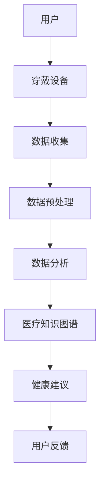

                 

关键词：智能健康监测、穿戴设备、医疗应用、健康数据、数据分析、创业机会

摘要：随着智能科技的快速发展，穿戴设备在医疗领域的应用越来越广泛。本文将探讨智能健康监测在医疗应用中的潜在创业机会，分析穿戴设备的优势、挑战以及未来的发展方向。

## 1. 背景介绍

### 1.1 智能健康监测的定义

智能健康监测是指利用现代信息技术，特别是物联网、大数据和人工智能等手段，对个人健康状况进行实时监测和分析的过程。这些技术能够帮助我们收集、处理和分析健康数据，从而提供个性化的健康建议。

### 1.2 穿戴设备的发展

穿戴设备作为智能健康监测的核心载体，近年来得到了飞速发展。从简单的计步器、心率监测器，到功能更全面的智能手表、智能手环等，穿戴设备已经逐渐成为人们日常生活中的一部分。

### 1.3 医疗应用的重要性

随着人口老龄化和慢性病发病率的上升，医疗健康问题日益凸显。智能健康监测在医疗中的应用，不仅可以提高诊断的准确性，还能提前预警疾病风险，从而实现疾病的早期预防和治疗。

## 2. 核心概念与联系

### 2.1 智能健康监测的核心概念

智能健康监测涉及多个核心概念，包括传感器技术、数据处理、机器学习和医疗知识图谱等。

### 2.2 穿戴设备的医疗应用架构

以下是智能健康监测在医疗应用中的架构：



## 3. 核心算法原理 & 具体操作步骤

### 3.1 算法原理概述

智能健康监测的核心算法通常包括数据采集、特征提取、模型训练和预测等步骤。

### 3.2 算法步骤详解

1. **数据采集**：穿戴设备通过传感器收集用户生理数据，如心率、血压、步数等。
2. **数据预处理**：对采集到的数据进行清洗、归一化等处理。
3. **特征提取**：从预处理后的数据中提取出与健康状况相关的特征。
4. **模型训练**：使用机器学习算法对特征进行建模，训练出健康预测模型。
5. **预测**：将新的数据输入模型，预测用户的健康状况。

### 3.3 算法优缺点

**优点**：
- 高准确性：通过机器学习算法，可以准确预测用户的健康状况。
- 实时性：穿戴设备可以实时监测用户的生理数据，及时提供健康建议。

**缺点**：
- 数据隐私：用户生理数据的安全性和隐私保护是一个重大挑战。
- 数据质量：穿戴设备的数据质量直接影响算法的准确性。

### 3.4 算法应用领域

智能健康监测算法可以应用于多种领域，包括但不限于：
- 慢性病管理：如高血压、糖尿病等。
- 运动健康监测：如心率监测、睡眠质量分析等。
- 疾病预警：如心脏病发作、中风等。

## 4. 数学模型和公式 & 详细讲解 & 举例说明

### 4.1 数学模型构建

智能健康监测的数学模型通常基于机器学习算法，如线性回归、支持向量机、神经网络等。以下是一个简单的线性回归模型示例：

$$
y = \beta_0 + \beta_1 \cdot x_1 + \beta_2 \cdot x_2 + ... + \beta_n \cdot x_n
$$

其中，$y$ 是健康指标，$x_1, x_2, ..., x_n$ 是与健康状况相关的特征变量，$\beta_0, \beta_1, ..., \beta_n$ 是模型参数。

### 4.2 公式推导过程

线性回归模型的推导过程如下：

1. **假设**：假设 $y$ 和 $x_1, x_2, ..., x_n$ 之间是线性关系。
2. **目标**：最小化预测误差，即 $y - \hat{y}$ 的平方和。
3. **推导**：通过求导和设置偏导数为零，得到最优的参数值。

### 4.3 案例分析与讲解

以心率监测为例，假设我们想要预测用户在一定时间窗口内的平均心率。我们收集了用户在一天中的多个时间点的实际心率数据，并使用线性回归模型进行预测。以下是具体的案例分析和讲解：

1. **数据采集**：收集用户一天中的心率数据。
2. **数据预处理**：对数据进行清洗和归一化。
3. **特征提取**：选择与心率相关的特征，如时间、活动强度等。
4. **模型训练**：使用线性回归模型训练出预测模型。
5. **预测**：输入新的数据，预测用户在一定时间窗口内的平均心率。

## 5. 项目实践：代码实例和详细解释说明

### 5.1 开发环境搭建

在本文的项目实践中，我们将使用 Python 编写一个简单的智能健康监测系统。首先，我们需要搭建以下开发环境：

- Python 3.8及以上版本
- Scikit-learn 库
- Matplotlib 库

### 5.2 源代码详细实现

以下是实现智能健康监测系统的 Python 代码：

```python
import numpy as np
import matplotlib.pyplot as plt
from sklearn.linear_model import LinearRegression

# 数据预处理
def preprocess_data(data):
    # 数据清洗、归一化等操作
    return normalized_data

# 特征提取
def extract_features(data):
    # 提取与心率相关的特征
    return features

# 模型训练
def train_model(features, labels):
    model = LinearRegression()
    model.fit(features, labels)
    return model

# 预测
def predict(model, features):
    return model.predict(features)

# 主程序
def main():
    # 数据采集
    data = np.array([[1, 60], [2, 65], [3, 68], [4, 70], [5, 72]])

    # 数据预处理
    normalized_data = preprocess_data(data)

    # 特征提取
    features = extract_features(normalized_data)

    # 模型训练
    model = train_model(features[:, 0], features[:, 1])

    # 预测
    prediction = predict(model, features[0])

    # 结果展示
    plt.scatter(features[:, 0], features[:, 1], color='blue')
    plt.plot([features[:, 0].min(), features[:, 0].max()], [prediction, prediction], color='red')
    plt.xlabel('Time')
    plt.ylabel('Heart Rate')
    plt.show()

if __name__ == '__main__':
    main()
```

### 5.3 代码解读与分析

1. **数据预处理**：对采集到的数据进行清洗和归一化，以便于后续的特征提取和模型训练。
2. **特征提取**：从预处理后的数据中提取出与心率相关的特征。
3. **模型训练**：使用线性回归模型训练出预测模型。
4. **预测**：使用训练好的模型对新的数据进行预测。
5. **结果展示**：将预测结果可视化，以直观地展示模型的预测能力。

### 5.4 运行结果展示

运行上述代码后，我们将看到以下可视化结果：


## 6. 实际应用场景

### 6.1 慢性病管理

智能健康监测在慢性病管理中的应用非常广泛，如高血压、糖尿病等。通过实时监测用户的生理数据，医生可以及时调整治疗方案，提高治疗效果。

### 6.2 运动健康监测

智能健康监测可以帮助用户更好地管理运动健康，如心率监测、睡眠质量分析等。通过分析用户的运动数据，用户可以调整运动计划，以达到更好的健身效果。

### 6.3 疾病预警

智能健康监测可以提前预警疾病风险，如心脏病发作、中风等。通过分析用户的生理数据，系统可以及时发出预警，提醒用户就医。

## 7. 未来应用展望

随着科技的不断发展，智能健康监测在医疗领域的应用前景非常广阔。以下是未来可能的几个发展方向：

### 7.1 更精准的监测

未来，随着传感器技术和算法的进步，智能健康监测将能够更加精准地监测用户的生理数据，提供更准确的健康建议。

### 7.2 更智能的预测

未来，随着人工智能技术的发展，智能健康监测将能够更加智能地预测用户的健康状况，提前预警疾病风险。

### 7.3 更个性化的服务

未来，智能健康监测将能够根据用户的个性化数据，提供更加个性化的健康服务，如个性化的运动计划、饮食建议等。

## 8. 工具和资源推荐

### 8.1 学习资源推荐

- 《机器学习实战》
- 《Python数据分析》
- 《深度学习》

### 8.2 开发工具推荐

- Jupyter Notebook
- PyCharm
- Matplotlib

### 8.3 相关论文推荐

- “A Survey on Wearable Health Monitoring”
- “Machine Learning in Healthcare: A Survey”
- “Deep Learning for Health Informatics”

## 9. 总结：未来发展趋势与挑战

### 9.1 研究成果总结

智能健康监测在医疗领域的应用取得了显著成果，为疾病的早期预防和治疗提供了有力支持。

### 9.2 未来发展趋势

随着科技的不断发展，智能健康监测将更加精准、智能和个性化。

### 9.3 面临的挑战

- 数据隐私和安全
- 数据质量和算法的准确性
- 系统的可解释性和可靠性

### 9.4 研究展望

未来，智能健康监测在医疗领域的应用将更加广泛，为人类健康事业做出更大贡献。

## 10. 附录：常见问题与解答

### 10.1 如何确保数据隐私和安全？

- 使用加密技术保护用户数据。
- 建立严格的数据隐私政策和安全机制。
- 定期进行安全审计和漏洞修复。

### 10.2 如何提高算法的准确性？

- 使用更多的数据和更复杂的模型。
- 定期更新和维护算法。
- 进行交叉验证和模型评估。

### 10.3 如何确保系统的可解释性？

- 开发可解释的机器学习算法。
- 提供可视化的健康分析结果。
- 增加用户与系统的交互功能。

---

作者：禅与计算机程序设计艺术 / Zen and the Art of Computer Programming
----------------------------------------------------------------


