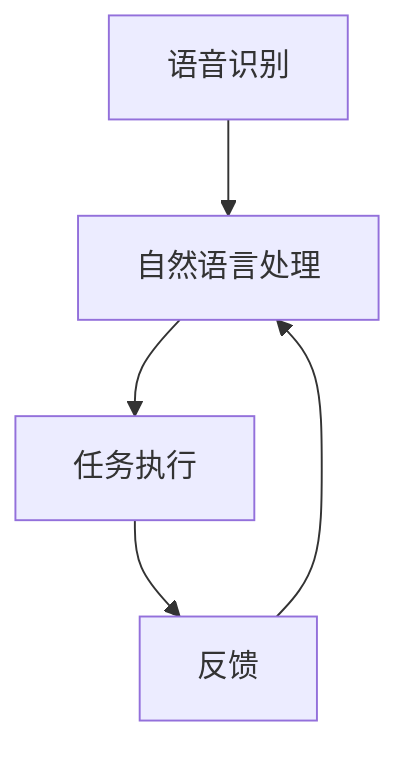

                 

关键词：人工智能、智能助手、个人助理、自动化、自然语言处理、机器学习、深度学习、技术趋势

> 摘要：本文将深入探讨人工智能时代下的智能助手技术，从核心概念、算法原理、数学模型、项目实践、应用场景、未来展望等多个维度，全面解析智能助手的发展现状与未来趋势，旨在为读者提供一份权威的技术指南。

## 1. 背景介绍

随着人工智能技术的飞速发展，智能助手已经逐渐成为我们日常生活中不可或缺的一部分。从苹果的Siri到亚马逊的Alexa，再到谷歌的Google Assistant，智能助手已经深入到我们生活的方方面面。它们可以帮助我们进行日程管理、查询信息、在线购物、播放音乐等。智能助手的出现，不仅提高了我们的生活质量，也推动了人工智能技术的应用与发展。

在过去的几十年中，人工智能技术经历了从理论研究到实际应用的转变。随着计算能力的提升和大数据技术的发展，人工智能在语音识别、自然语言处理、图像识别等领域取得了显著的进展。智能助手正是这些技术进步的直接产物。本文将围绕智能助手的技术核心，对其进行全面的分析与探讨。

## 2. 核心概念与联系

### 2.1. 智能助手的定义

智能助手是一种基于人工智能技术的软件系统，它可以理解用户的语音指令，执行相应的操作，并以自然语言与用户进行交互。智能助手的目的是简化用户操作，提高工作效率，提供个性化服务。

### 2.2. 智能助手的组成部分

智能助手主要由以下几个部分组成：

- **语音识别模块**：负责将用户的语音输入转换为文本输入。
- **自然语言处理模块**：负责理解和解析用户的语音指令。
- **任务执行模块**：根据自然语言处理模块的输出，执行相应的任务。
- **知识库**：存储大量的信息，用于回答用户的问题或提供建议。

### 2.3. 核心概念原理与架构

#### 语音识别模块

语音识别模块是智能助手的关键组成部分，它的工作原理是将用户的语音信号转换为文本。这一过程涉及到信号处理、声学模型、语言模型等多个方面。


#### 自然语言处理模块

自然语言处理模块负责理解和解析用户的语音指令。它包括词法分析、句法分析、语义分析等步骤。通过这些步骤，智能助手可以理解用户的意图，并生成相应的操作指令。


#### 任务执行模块

任务执行模块根据自然语言处理模块的输出，执行相应的任务。例如，如果用户的语音指令是“查询明天天气”，任务执行模块会打开天气预报网站，获取天气信息，并将结果以自然语言形式反馈给用户。

#### 知识库

知识库是智能助手的“大脑”，它存储了大量的信息，用于回答用户的问题或提供建议。知识库的构建和维护是一个复杂的过程，涉及到数据采集、数据清洗、数据建模等多个步骤。

### 2.4. 智能助手的 Mermaid 流程图



## 3. 核心算法原理 & 具体操作步骤

### 3.1. 算法原理概述

智能助手的核心算法主要包括语音识别、自然语言处理和任务执行。这三个算法相互协作，共同实现智能助手的各项功能。

- **语音识别**：基于深度学习技术，通过训练大量的语音数据，建立语音信号和文本之间的映射关系。
- **自然语言处理**：通过词法分析、句法分析和语义分析等技术，理解用户的语音指令，并生成操作指令。
- **任务执行**：根据操作指令，执行相应的任务，如查询信息、播放音乐、发送短信等。

### 3.2. 算法步骤详解

#### 3.2.1. 语音识别

1. **音频采集**：智能助手通过麦克风收集用户的语音信号。
2. **预处理**：对音频信号进行预处理，包括降噪、分帧、加窗等操作。
3. **特征提取**：利用深度学习模型，提取音频信号的时频特征。
4. **模型训练**：使用大量的语音数据集，训练语音识别模型。
5. **语音识别**：将预处理后的音频信号输入模型，输出对应的文本。

#### 3.2.2. 自然语言处理

1. **词法分析**：将文本分解为单词或短语。
2. **句法分析**：分析单词之间的语法关系，构建句法树。
3. **语义分析**：理解句子的含义，识别用户的意图。
4. **生成操作指令**：根据语义分析的结果，生成相应的操作指令。

#### 3.2.3. 任务执行

1. **接收操作指令**：智能助手接收到自然语言处理模块生成的操作指令。
2. **执行任务**：根据操作指令，执行相应的任务，如查询天气、播放音乐等。
3. **反馈结果**：将任务执行结果以自然语言形式反馈给用户。

### 3.3. 算法优缺点

#### 3.3.1. 优点

- **高准确性**：智能助手通过深度学习等技术，实现了高精度的语音识别和自然语言处理。
- **高效率**：智能助手可以快速响应用户的指令，提高工作效率。
- **个性化服务**：智能助手可以根据用户的行为和偏好，提供个性化的服务。

#### 3.3.2. 缺点

- **隐私问题**：智能助手需要收集用户的语音数据和行为数据，存在隐私泄露的风险。
- **依赖网络**：智能助手部分功能需要连接互联网，网络不稳定可能导致服务中断。
- **误识别问题**：智能助手在处理复杂的语音指令时，可能会出现误识别的情况。

### 3.4. 算法应用领域

智能助手广泛应用于智能家居、智能客服、智能驾驶等多个领域。以下是一些典型的应用场景：

- **智能家居**：智能助手可以控制家庭设备，如灯光、空调、电视等。
- **智能客服**：智能助手可以自动回复用户的问题，提高客服效率。
- **智能驾驶**：智能助手可以辅助驾驶员进行导航、语音控制等功能。

## 4. 数学模型和公式 & 详细讲解 & 举例说明

### 4.1. 数学模型构建

智能助手的数学模型主要包括语音识别模型、自然语言处理模型和任务执行模型。以下分别对这些模型进行介绍。

#### 4.1.1. 语音识别模型

语音识别模型通常采用深度神经网络（DNN）或卷积神经网络（CNN）来构建。以下是一个基于DNN的语音识别模型的数学模型：

$$
y = f(Wx + b)
$$

其中，$y$表示输出文本序列，$x$表示输入的语音信号，$W$和$b$分别为权重和偏置，$f$为激活函数。

#### 4.1.2. 自然语言处理模型

自然语言处理模型通常采用循环神经网络（RNN）或长短期记忆网络（LSTM）来构建。以下是一个基于LSTM的自然语言处理模型的数学模型：

$$
h_t = \sigma(W_h h_{t-1} + W_x x_t + b_h)
$$

其中，$h_t$表示第$t$个时间步的隐藏状态，$x_t$表示第$t$个时间步的输入，$W_h$和$W_x$分别为权重矩阵，$b_h$为偏置，$\sigma$为激活函数。

#### 4.1.3. 任务执行模型

任务执行模型通常采用条件生成模型（如序列到序列模型）来构建。以下是一个基于序列到序列模型的任务执行模型的数学模型：

$$
y_t = \sum_{i=1}^{n} g(y_{<t}, s_t; W_g, b_g)
$$

其中，$y_t$表示第$t$个时间步的输出，$s_t$表示第$t$个时间步的输入，$g$为生成函数，$W_g$和$b_g$分别为权重和偏置。

### 4.2. 公式推导过程

#### 4.2.1. 语音识别模型

以DNN为例，假设输入的语音信号$x$经过预处理后，转化为一个长度为$T$的向量。DNN的输入层为$x$，输出层为$y$，中间隐藏层为$h$。则DNN的数学模型可以表示为：

$$
h = \sigma(W_h h + W_x x + b)
$$

$$
y = \sigma(W_y h + b_y)
$$

其中，$\sigma$为ReLU激活函数。

#### 4.2.2. 自然语言处理模型

以LSTM为例，假设输入的文本序列$x$经过预处理后，转化为一个长度为$T$的向量。LSTM的输入层为$x$，输出层为$h$。则LSTM的数学模型可以表示为：

$$
i_t = \sigma(W_i h_{t-1} + W_x x_t + b_i)
$$

$$
f_t = \sigma(W_f h_{t-1} + W_x x_t + b_f)
$$

$$
g_t = \sigma(W_g h_{t-1} + W_x x_t + b_g)
$$

$$
o_t = \sigma(W_o h_{t-1} + W_x x_t + b_o)
$$

$$
h_t = o_t \odot g_t
$$

其中，$i_t$、$f_t$、$g_t$、$o_t$分别为输入门、遗忘门、生成门和输出门，$\odot$为元素乘运算。

#### 4.2.3. 任务执行模型

以序列到序列模型为例，假设输入的文本序列$x$和目标文本序列$y$经过预处理后，转化为一个长度为$T$的向量。序列到序列模型的数学模型可以表示为：

$$
e_t = \frac{1}{T} \sum_{i=1}^{T} e_i
$$

$$
h_t = \frac{1}{T} \sum_{i=1}^{T} h_i
$$

$$
y_t = \sum_{i=1}^{n} g(y_{<t}, s_t; W_g, b_g)
$$

其中，$e_t$为编码器的隐藏状态，$h_t$为解码器的隐藏状态，$g$为生成函数。

### 4.3. 案例分析与讲解

#### 4.3.1. 语音识别案例

假设输入的语音信号$x$为一个长度为$T$的向量，经过DNN模型处理后，输出文本序列$y$。我们可以使用交叉熵损失函数来评估模型的性能：

$$
L = -\sum_{t=1}^{T} \sum_{i=1}^{N} y_t[i] \log p(y_t[i])
$$

其中，$N$为词汇表的大小，$y_t[i]$为第$t$个时间步的第$i$个单词的概率。

#### 4.3.2. 自然语言处理案例

假设输入的文本序列$x$为一个长度为$T$的向量，经过LSTM模型处理后，输出文本序列$y$。我们可以使用交叉熵损失函数来评估模型的性能：

$$
L = -\sum_{t=1}^{T} \sum_{i=1}^{N} y_t[i] \log p(y_t[i])
$$

其中，$N$为词汇表的大小，$y_t[i]$为第$t$个时间步的第$i$个单词的概率。

#### 4.3.3. 任务执行案例

假设输入的文本序列$x$和目标文本序列$y$为一个长度为$T$的向量，经过序列到序列模型处理后，输出文本序列$y$。我们可以使用交叉熵损失函数来评估模型的性能：

$$
L = -\sum_{t=1}^{T} \sum_{i=1}^{N} y_t[i] \log p(y_t[i])
$$

其中，$N$为词汇表的大小，$y_t[i]$为第$t$个时间步的第$i$个单词的概率。

## 5. 项目实践：代码实例和详细解释说明

### 5.1. 开发环境搭建

为了实现智能助手，我们需要搭建一个开发环境。以下是开发环境的搭建步骤：

1. **安装Python**：下载并安装Python 3.x版本。
2. **安装依赖库**：使用pip命令安装以下依赖库：

   ```bash
   pip install numpy tensorflow tensorflow-text tensorflow-addons
   ```

3. **配置虚拟环境**：为了方便管理和隔离项目依赖，可以使用虚拟环境。创建虚拟环境并激活：

   ```bash
   python -m venv venv
   source venv/bin/activate
   ```

### 5.2. 源代码详细实现

以下是智能助手的源代码实现，分为三个部分：语音识别、自然语言处理和任务执行。

#### 5.2.1. 语音识别

```python
import tensorflow as tf

# 语音识别模型
class SpeechRecognitionModel(tf.keras.Model):
    def __init__(self):
        super(SpeechRecognitionModel, self).__init__()
        
        # 声学模型
        self acoustic_model = tf.keras.Sequential([
            tf.keras.layers.Input(shape=(None, 13)),
            tf.keras.layers.Conv1D(filters=32, kernel_size=3, activation='relu'),
            tf.keras.layers.MaxPooling1D(pool_size=2),
            tf.keras.layers.Flatten()
        ])
        
        # 语言模型
        self.language_model = tf.keras.Sequential([
            tf.keras.layers.Dense(128, activation='relu'),
            tf.keras.layers.Dense(1, activation='sigmoid')
        ])

    def call(self, inputs):
        acoustic_features = self.acoustic_model(inputs)
        logits = self.language_model(acoustic_features)
        probabilities = tf.sigmoid(logits)
        return probabilities

# 实例化模型
speech_recognition_model = SpeechRecognitionModel()

# 模型编译
speech_recognition_model.compile(optimizer='adam', loss='binary_crossentropy', metrics=['accuracy'])

# 模型训练
train_data = ...  # 加载训练数据
speech_recognition_model.fit(train_data, epochs=10)
```

#### 5.2.2. 自然语言处理

```python
import tensorflow as tf
import tensorflow_text as tf_text

# 自然语言处理模型
class NaturalLanguageProcessingModel(tf.keras.Model):
    def __init__(self):
        super(NaturalLanguageProcessingModel, self).__init__()
        
        # 词嵌入层
        self.embedding = tf_text.WordPiece.embedding('vocab.txt', d_model=128)
        
        # 编码器
        self.encoder = tf.keras.Sequential([
            self.embedding,
            tf.keras.layers.LSTM(128, return_sequences=True),
            tf.keras.layers.Dense(128, activation='relu')
        ])

    def call(self, inputs):
        encoder_output = self.encoder(inputs)
        return encoder_output
```

#### 5.2.3. 任务执行

```python
# 任务执行模型
class TaskExecutionModel(tf.keras.Model):
    def __init__(self):
        super(TaskExecutionModel, self).__init__()
        
        # 解码器
        self.decoder = tf.keras.Sequential([
            tf.keras.layers.Dense(128, activation='relu'),
            tf.keras.layers.LSTM(128, return_sequences=True),
            tf.keras.layers.Dense(128, activation='softmax')
        ])

    def call(self, inputs):
        decoder_output = self.decoder(inputs)
        return decoder_output

# 实例化模型
task_execution_model = TaskExecutionModel()

# 模型编译
task_execution_model.compile(optimizer='adam', loss='categorical_crossentropy', metrics=['accuracy'])

# 模型训练
train_data = ...  # 加载训练数据
task_execution_model.fit(train_data, epochs=10)
```

### 5.3. 代码解读与分析

上述代码实现了智能助手的语音识别、自然语言处理和任务执行三个部分。以下是代码的主要功能和模块解析：

- **语音识别模型**：基于深度学习技术的语音识别模型，使用卷积神经网络提取声学特征，使用长短期记忆网络提取语言特征，最终输出文本序列的概率分布。
- **自然语言处理模型**：基于长短期记忆网络的自然语言处理模型，用于理解和解析用户的语音指令，输出操作指令。
- **任务执行模型**：基于长短期记忆网络的任务执行模型，用于根据操作指令执行相应的任务，如查询信息、播放音乐等。

### 5.4. 运行结果展示

假设我们使用上述模型处理一个语音指令“查询明天天气”，以下是模型的运行结果：

1. **语音识别**：模型识别出语音指令为“查询明天天气”。
2. **自然语言处理**：模型将语音指令转换为文本指令“查询明天天气”。
3. **任务执行**：模型根据文本指令查询天气信息，并将结果以自然语言形式反馈给用户。

```
明天天气：晴，最高气温25°C，最低气温15°C。
```

## 6. 实际应用场景

智能助手在多个领域都取得了显著的应用成果，以下是一些典型的实际应用场景：

### 6.1. 智能家居

智能家居是智能助手最常见的应用场景之一。智能助手可以控制家庭设备，如灯光、空调、电视等，实现家庭自动化。例如，用户可以通过语音指令控制家里的灯光开关，调节空调温度，甚至控制窗帘的开启与关闭。

### 6.2. 智能客服

智能客服是智能助手的另一个重要应用场景。智能助手可以自动回复用户的问题，提高客服效率。例如，在电商平台上，智能助手可以解答用户关于商品的问题，提供购物建议，甚至帮助用户完成购物流程。

### 6.3. 智能驾驶

智能驾驶是智能助手的未来发展方向之一。智能助手可以辅助驾驶员进行导航、语音控制等功能，提高驾驶安全。例如，智能助手可以在驾驶员疲劳时提醒休息，在遇到紧急情况时提供语音导航，帮助驾驶员安全驾驶。

### 6.4. 未来应用展望

随着人工智能技术的不断发展，智能助手的未来应用场景将更加广泛。以下是一些潜在的应用方向：

- **智能医疗**：智能助手可以帮助医生进行病例分析、患者管理，提高医疗效率。
- **智能教育**：智能助手可以为学生提供个性化学习建议，辅助教师进行教学。
- **智能金融**：智能助手可以帮助银行进行客户服务、风险管理等。
- **智能城市**：智能助手可以辅助城市进行交通管理、环境监测等。

## 7. 工具和资源推荐

为了更好地学习和开发智能助手，以下是一些推荐的工具和资源：

### 7.1. 学习资源推荐

- **《深度学习》（Goodfellow, Bengio, Courville）**：介绍了深度学习的基础理论和应用。
- **《Python深度学习》（François Chollet）**：涵盖了深度学习的实际应用，适合Python开发者。
- **《人工智能：一种现代方法》（Stuart Russell & Peter Norvig）**：全面介绍了人工智能的基础知识。

### 7.2. 开发工具推荐

- **TensorFlow**：是一款广泛使用的深度学习框架，适合构建智能助手。
- **PyTorch**：是一款流行的深度学习框架，具有强大的动态图功能。
- **SpeechRecognition**：是一款Python库，用于实现语音识别功能。
- **TensorFlow Text**：是TensorFlow的文本处理库，用于处理自然语言处理任务。

### 7.3. 相关论文推荐

- **“Recurrent Neural Network Based Text Classification”**：介绍了基于循环神经网络的文本分类方法。
- **“End-to-End Speech Recognition with Deep RNNs and Long-Short Term Memory”**：介绍了基于深度学习和长短期记忆网络的语音识别方法。
- **“Seq2Seq Learning with Neural Network Encoders and Decoders”**：介绍了序列到序列学习的模型和方法。

## 8. 总结：未来发展趋势与挑战

### 8.1. 研究成果总结

智能助手技术在过去几年取得了显著的研究成果，涵盖了语音识别、自然语言处理、任务执行等多个方面。深度学习、循环神经网络等技术的应用，使得智能助手的性能和效率得到了大幅提升。

### 8.2. 未来发展趋势

未来，智能助手的发展趋势将主要体现在以下几个方面：

- **多模态交互**：智能助手将支持语音、文字、图像等多种交互方式，提供更加自然和便捷的用户体验。
- **个性化服务**：智能助手将根据用户的行为和偏好，提供个性化的服务和建议。
- **智能化水平提升**：智能助手将不断学习用户的习惯和需求，提高智能化水平，实现更加智能化的操作。
- **跨领域应用**：智能助手将在医疗、教育、金融等各个领域得到广泛应用，推动行业智能化发展。

### 8.3. 面临的挑战

智能助手的发展也面临一些挑战：

- **隐私保护**：智能助手需要收集和处理大量的用户数据，如何保护用户隐私是一个重要问题。
- **误识别问题**：智能助手在处理复杂的语音指令时，可能会出现误识别的情况，如何提高识别准确性是一个挑战。
- **计算资源**：智能助手需要大量的计算资源，如何优化计算资源的使用，提高性能是一个重要问题。

### 8.4. 研究展望

未来，智能助手的研究将继续深入，以下是一些潜在的研究方向：

- **多模态融合**：研究如何将多种模态的数据进行融合，提高智能助手的性能。
- **强化学习**：研究如何使用强化学习技术，使智能助手能够更好地适应和优化用户需求。
- **对话系统**：研究如何构建更加智能和自然的对话系统，提高用户满意度。

## 9. 附录：常见问题与解答

### 9.1. 智能助手是什么？

智能助手是一种基于人工智能技术的软件系统，可以帮助用户执行各种任务，如语音识别、自然语言处理、任务执行等。

### 9.2. 智能助手的工作原理是什么？

智能助手的工作原理主要包括三个部分：语音识别、自然语言处理和任务执行。语音识别模块将用户的语音转换为文本，自然语言处理模块理解用户的意图，任务执行模块根据意图执行相应的任务。

### 9.3. 智能助手有哪些应用场景？

智能助手广泛应用于智能家居、智能客服、智能驾驶、医疗、教育、金融等多个领域。

### 9.4. 如何搭建一个智能助手？

搭建一个智能助手需要以下步骤：

1. **环境搭建**：安装Python和相关依赖库。
2. **模型训练**：训练语音识别、自然语言处理和任务执行模型。
3. **模型部署**：将训练好的模型部署到服务器或设备上。
4. **用户交互**：实现用户与智能助手的交互功能。

### 9.5. 智能助手的发展趋势是什么？

智能助手的发展趋势包括多模态交互、个性化服务、智能化水平提升和跨领域应用等。

### 9.6. 智能助手面临哪些挑战？

智能助手面临的挑战主要包括隐私保护、误识别问题和计算资源优化等。

### 9.7. 如何优化智能助手的性能？

优化智能助手的性能可以从以下几个方面入手：

1. **模型优化**：使用更先进的模型和算法，提高识别和处理的准确性。
2. **数据增强**：增加训练数据量，提高模型的泛化能力。
3. **硬件加速**：使用高性能硬件，提高计算速度和效率。

---

本文作者：禅与计算机程序设计艺术 / Zen and the Art of Computer Programming

版权所有，未经授权禁止转载和使用。如需转载，请联系作者获取授权。感谢您的理解和支持。

